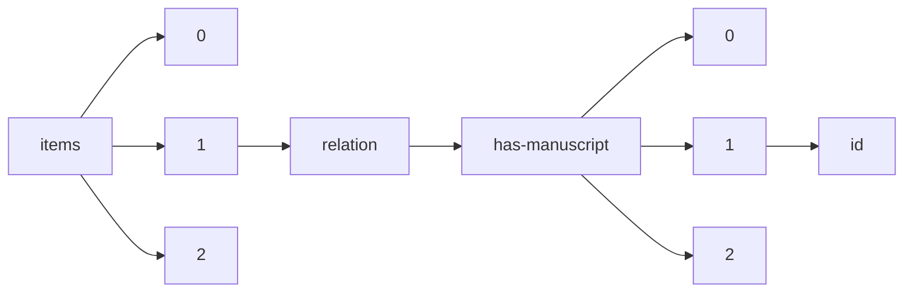

!!! warning "This document is not official Crossref documentation"
# Id
PATH = items/array/relation/has-manuscript/array/id(1)  
Occurs 327 times  
Unique values: 47  
{ .annotate }

1. A route to an element, for example:  
   The route "items/array/relation/has-manuscript/array/id" corresponds to navigating through the JSON indices as  
   ["items"][0]["relation"]["has-manuscript"][0]["id"]  

| **Row** | **Value** `String`                  | **Count** `Int64` |
|--------:|---------------------------------------:|---------------------:|
| **1**   | 2149-6544                              | 66                   |
| **2**   | 2636-7718                              | 47                   |
| **3**   | 2791-6022                              | 43                   |
| **4**   | 2587-3008                              | 31                   |
| **5**   | 2667-4688                              | 26                   |
| **6**   | 2717-719X                              | 25                   |
| **7**   | 2791-7401                              | 14                   |
| **8**   | 2822-5228                              | 10                   |
| **9**   |                                        | 10                   |
| **10**  | 0128-2603                              | 7                    |
| **11**  | 0128-259X                              | 5                    |
| **12**  | 0128-3103                              | 4                    |
| **13**  | 0128-2611                              | 4                    |
| **14**  | 2148-4139                              | 2                    |
| **15**  | 10.17077/hq5u-6aa0                     | 1                    |
| **16**  | 10.17077/0068-bqrr                     | 1                    |
| **17**  | 10.17077/pp.001113                     | 1                    |
| **18**  | 10.17077/pp.005162                     | 1                    |
| **19**  | 10.17077/h9xt-l294                     | 1                    |
| **20**  | https://doi.org/10.46829/              | 1                    |
| **21**  | 10.17077/pp.005154                     | 1                    |
| **22**  | 10.17077/tjri-gg33                     | 1                    |
| **23**  | 10.17077/pp.005144                     | 1                    |
| **24**  | 10.17077/pp.005125                     | 1                    |
| **25**  | 10.17077/pp.005129                     | 1                    |
| **26**  | 10.17077/pp.005147                     | 1                    |
| **27**  | 10.17077/pp.005120                     | 1                    |
| **28**  | 10.17077/pp.005145                     | 1                    |
| **29**  | 10.17077/pp.005122                     | 1                    |
| **30**  | 10.17077/pp.005156                     | 1                    |
| **31**  | 10.17077/o1ah-25ie                     | 1                    |
| **32**  | 10.17077/4r59-1v3w                     | 1                    |
| **33**  | 10.17077/15jq-9y57                     | 1                    |
| **34**  | 10.17077/pp.005161                     | 1                    |
| **35**  | 10.17077/pp.005121                     | 1                    |
| **36**  | https://hdl.handle.net/20.500.12334/97 | 1                    |
| **37**  | 10.17077/qwzn-8rw8                     | 1                    |
| **38**  | 10.17077/a7rw-29zx                     | 1                    |
| **39**  | 10.17077/pp.001119                     | 1                    |
| **40**  | 10.17077/pp.005119                     | 1                    |
| **41**  | 10.17077/pp.005124                     | 1                    |
| **42**  | 10.17077/pp.005158                     | 1                    |
| **43**  | 10.17077/cgm9-y7aj                     | 1                    |
| **44**  | 10.17077/pp.005134                     | 1                    |
| **45**  | 10.17077/a6f2-zwvr                     | 1                    |
| **46**  | 10.17077/pp.005141                     | 1                    |
| **47**  | 10.17077/3yjk-ht8s                     | 1                    |

