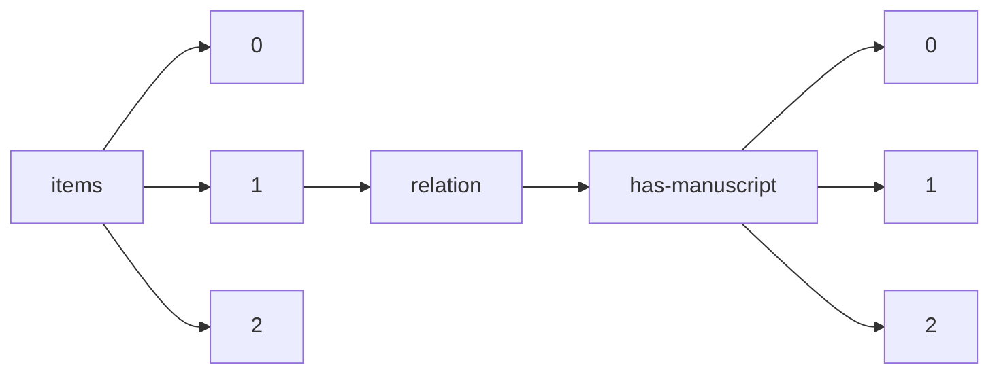

!!! warning "This document is not official Crossref documentation"
# Elements
PATH = items/array/relation/has-manuscript/array(1)  
Occurs 327 times  
{ .annotate }

1. A route to an element, for example:  
   The route "items/array/relation/has-manuscript/array" corresponds to navigating through the JSON indices as  
   ["items"][0]["relation"]["has-manuscript"][0]  

## Asserted-by
See more information: [items/array/relation/has-manuscript/array/asserted-by](asserted-by/index.md)  
Occurs 327 timess  
Unique values: 2  

| **Row** | **Value** `String` | **Count** `Int64` |
|--------:|----------------------:|---------------------:|
| **1**   | subject               | 296                  |
| **2**   | object                | 31                   |

## Id
See more information: [items/array/relation/has-manuscript/array/id](id/index.md)  
Occurs 327 timess  
Unique values: 47  

| **Row** | **Value** `String` | **Count** `Int64` |
|--------:|----------------------:|---------------------:|
| **1**   | 2149-6544             | 66                   |
| **2**   | 2636-7718             | 47                   |
| **3**   | 2791-6022             | 43                   |
| **4**   | 2587-3008             | 31                   |
| **5**   | 2667-4688             | 26                   |
| **6**   | 2717-719X             | 25                   |
| **7**   | 2791-7401             | 14                   |
| **8**   | 2822-5228             | 10                   |
| **9**   |                       | 10                   |
| **10**  | 0128-2603             | 7                    |
| ... | ... | ... |

## Id-type
See more information: [items/array/relation/has-manuscript/array/id-type](id-type/index.md)  
Occurs 327 timess  
Unique values: 3  

| **Row** | **Value** `String` | **Count** `Int64` |
|--------:|----------------------:|---------------------:|
| **1**   | issn                  | 295                  |
| **2**   | doi                   | 31                   |
| **3**   | handle                | 1                    |

