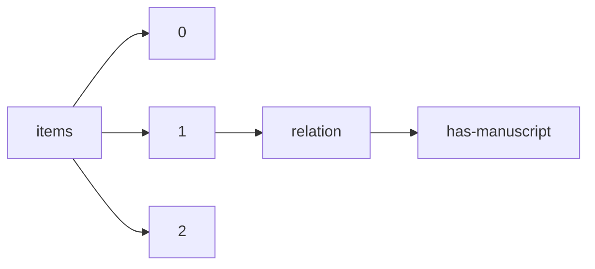

!!! warning "This document is not official Crossref documentation"
# Has-manuscript
PATH = items/array/relation/has-manuscript(1)  
Occurs 327 times  
{ .annotate }

1. A route to an element, for example:  
   The route "items/array/relation/has-manuscript" corresponds to navigating through the JSON indices as  
   ["items"][0]["relation"]["has-manuscript"]  

## Properties of Array
See information about elements: [items/array/relation/has-manuscript/array](array/index.md)  
Distribution of lengths:  

| **Row** | **Length** `Any` | **Count** `Int64` |
|--------:|--------------------:|---------------------:|
| **1**   | 1                   | 327                  |

