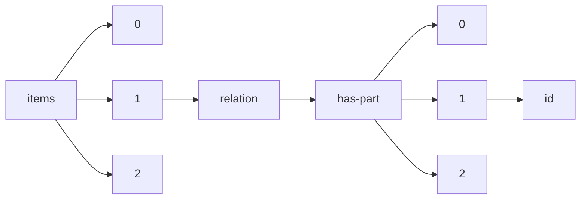

!!! warning "This document is not official Crossref documentation"
# Id
PATH = items/array/relation/has-part/array/id(1)  
Occurs 1 184 times  
Unique values: 985  
{ .annotate }

1. A route to an element, for example:  
   The route "items/array/relation/has-part/array/id" corresponds to navigating through the JSON indices as  
   ["items"][0]["relation"]["has-part"][0]["id"]  

| **Row** | **Value** `String`                         | **Count** `Int64` |
|--------:|----------------------------------------------:|---------------------:|
| **1**   | 10.5194/cp-14-527-2018                        | 10                   |
| **2**   | 10.5194/gmd-9-3817-2016                       | 8                    |
| **3**   | 10.5194/acp-21-5965-2021                      | 7                    |
| **4**   | 10.5194/acp-20-14183-2020                     | 6                    |
| **5**   | 10.5194/acp-20-969-2020                       | 5                    |
| **6**   | PropWIDIncludes                               | 5                    |
| **7**   | 10.5194/bg-13-3717-2016                       | 5                    |
| **8**   | 10.5194/gmd-11-2009-2018                      | 4                    |
| **9**   | 10.5194/os-14-187-2018                        | 4                    |
| **10**  | 10.5194/acp-21-2675-2021                      | 4                    |
| **11**  | 10.5194/hess-24-2061-2020                     | 3                    |
| **12**  | 10.5194/angeo-35-505-2017                     | 3                    |
| **13**  | 10.5194/hess-24-3311-2020                     | 3                    |
| **14**  | 10.5194/piahs-382-333-2020                    | 3                    |
| **15**  | 10.5194/bg-18-2711-2021                       | 3                    |
| **16**  | 10.5194/esd-8-55-2017                         | 3                    |
| **17**  | 10.5194/acp-17-7605-2017                      | 3                    |
| **18**  | 10.5194/hess-25-2279-2021                     | 3                    |
| **19**  | 10.5194/gh-72-197-2017                        | 3                    |
| **20**  | 10.5194/tc-15-743-2021                        | 3                    |
| **21**  | 10.5194/acp-18-6543-2018                      | 3                    |
| **22**  | 10.5194/piahs-372-145-2015                    | 3                    |
| **23**  | 10.5194/bg-17-2315-2020                       | 3                    |
| **24**  | 10.5194/acp-18-18063-2018                     | 3                    |
| **25**  | 10.5194/essd-11-1411-2019                     | 3                    |
| **26**  | 10.5194/acp-21-1613-2021                      | 3                    |
| **27**  | 10.5194/bg-14-5143-2017                       | 3                    |
| **28**  | 10.5194/asr-14-35-2017                        | 3                    |
| **29**  | 10.5194/hess-24-5745-2020                     | 3                    |
| **30**  | 10.5194/hess-23-5089-2019                     | 3                    |
| **31**  | 10.5194/gc-3-475-2020                         | 3                    |
| **32**  | 10.19108/KOERS.84.1.2454                      | 3                    |
| **33**  | 10.5194/esd-8-719-2017                        | 3                    |
| **34**  | 10.5194/os-12-807-2016                        | 3                    |
| **35**  | 10.5194/amt-13-5259-2020                      | 3                    |
| **36**  | 10.5194/gi-6-473-2017                         | 3                    |
| **37**  | 10.5194/angeo-35-443-2017                     | 3                    |
| **38**  | 10.5194/acp-19-12887-2019                     | 2                    |
| **39**  | 10.5194/hess-22-1775-2018                     | 2                    |
| **40**  | 10.5194/acp-20-2123-2020                      | 2                    |
| **41**  | 10.5194/angeo-34-943-2016                     | 2                    |
| **42**  | 10.5194/hess-22-6059-2018                     | 2                    |
| **43**  | 10.5194/hess-21-2277-2017                     | 2                    |
| **44**  | 10.5194/hess-24-381-2020                      | 2                    |
| **45**  | 10.5194/acp-20-4275-2020                      | 2                    |
| **46**  | 10.5194/bg-16-2343-2019                       | 2                    |
| **47**  | 10.5194/acp-21-4825-2021                      | 2                    |
| **48**  | 10.5194/tc-14-4453-2020                       | 2                    |
| **49**  | 10.5194/esurf-7-895-2019                      | 2                    |
| **50**  | 10.47721/ARJHSS202002045                      | 2                    |
| **51**  | 10.5194/bg-14-3525-2017                       | 2                    |
| **52**  | 10.5194/bg-17-4059-2020                       | 2                    |
| **53**  | 10.5194/gmd-9-3517-2016                       | 2                    |
| **54**  | 10.5194/esurf-6-49-2018                       | 2                    |
| **55**  | 10.5194/esurf-8-177-2020                      | 2                    |
| **56**  | 10.5194/cp-14-1229-2018                       | 2                    |
| **57**  | 10.47721/ARJEE202002019                       | 2                    |
| **58**  | 10.5194/esd-9-267-2018                        | 2                    |
| **59**  | 10.5194/amt-9-3921-2016                       | 2                    |
| **60**  | 10.5194/essd-10-1795-2018                     | 2                    |
| **61**  | 10.5194/angeo-35-279-2017                     | 2                    |
| **62**  | 10.5194/nhess-20-3455-2020                    | 2                    |
| **63**  | 10.5194/egqsj-68-1-2019                       | 2                    |
| **64**  | 10.5194/ms-10-529-2019                        | 2                    |
| **65**  | 10.5194/acp-21-393-2021                       | 2                    |
| **66**  | 10.23915/distill.00019.7                      | 2                    |
| **67**  | 10.5194/gmd-10-3329-2017                      | 2                    |
| **68**  | 10.5194/amt-9-2055-2016                       | 2                    |
| **69**  | 10.5194/cp-15-2053-2019                       | 2                    |
| **70**  | 10.23915/distill.00019.2                      | 2                    |
| **71**  | 10.5194/hess-22-2655-2018                     | 2                    |
| **72**  | 10.47721/ARJHSS202101019                      | 2                    |
| **73**  | 10.5194/hess-22-3515-2018                     | 2                    |
| **74**  | 10.5194/esd-12-387-2021                       | 2                    |
| **75**  | 10.5194/se-11-2031-2020                       | 2                    |
| **76**  | 10.5194/hess-22-1971-2018                     | 2                    |
| **77**  | 10.25820/6g3e-t191                            | 2                    |
| **78**  | 10.23915/distill.00019.6                      | 2                    |
| **79**  | 10.23915/distill.00019.5                      | 2                    |
| **80**  | 10.5194/acp-19-425-2019                       | 2                    |
| **81**  | 10.47721/ARJHSS202003018                      | 2                    |
| **82**  | 10.47721/ARJHSS202101025                      | 2                    |
| **83**  | 10.5194/angeo-35-1249-2017                    | 2                    |
| **84**  | 10.5194/angeo-38-657-2020                     | 2                    |
| **85**  | 10.5194/acp-21-5685-2021                      | 2                    |
| **86**  | 10.5194/bg-17-6185-2020                       | 2                    |
| **87**  | 10.47721/ARJEE202003024                       | 2                    |
| **88**  | 10.5194/bg-18-39-2021                         | 2                    |
| **89**  | 10.47721/ARJST202001016                       | 2                    |
| **90**  | 10.5194/hess-21-1279-2017                     | 2                    |
| **91**  | 10.5194/nhess-17-693-2017                     | 2                    |
| **92**  | 10.5194/amt-9-4955-2016                       | 2                    |
| **93**  | 10.5194/acp-18-601-2018                       | 2                    |
| **94**  | 10.5194/cp-14-1515-2018                       | 2                    |
| **95**  | 10.5194/amt-13-4461-2020                      | 2                    |
| **96**  | 10.5194/bg-16-2617-2019                       | 2                    |
| **97**  | 10.47721/ARJEE202003021                       | 2                    |
| **98**  | 10.5194/bg-15-5779-2018                       | 2                    |
| **99**  | 10.5194/amt-9-5423-2016                       | 2                    |
| **100** | 10.5194/tc-11-3023-2017                       | 2                    |
| **101** | 10.5194/amt-11-3661-2018                      | 2                    |
| **102** | 10.5194/piahs-379-119-2018                    | 2                    |
| **103** | 10.5194/acp-20-995-2020                       | 2                    |
| **104** | 10.47721/ARJHSS202004024                      | 2                    |
| **105** | 10.5194/bg-14-5053-2017                       | 2                    |
| **106** | 10.19135/revista.consinter.00004.00           | 2                    |
| **107** | 10.5194/acp-16-10521-2016                     | 2                    |
| **108** | 10.5194/acp-18-8155-2018                      | 2                    |
| **109** | 10.15763/DBS.SCCSC.RR.0003                    | 2                    |
| **110** | 10.5194/acp-19-1623-2019                      | 2                    |
| **111** | 10.23915/distill.00019.4                      | 2                    |
| **112** | 10.5194/acp-17-3987-2017                      | 2                    |
| **113** | 10.5194/cp-14-1543-2018                       | 2                    |
| **114** | 10.5194/tc-15-345-2021                        | 2                    |
| **115** | 10.47721/ARJHSS202004027                      | 2                    |
| **116** | 10.5194/tc-11-1501-2017                       | 2                    |
| **117** | 10.5194/amt-11-5261-2018                      | 2                    |
| **118** | 10.5194/tc-11-2595-2017                       | 2                    |
| **119** | 10.5194/bg-16-4815-2019                       | 2                    |
| **120** | 10.5194/gmd-10-4005-2017                      | 2                    |
| **121** | 10.23915/distill.00019.3                      | 2                    |
| **122** | 10.5194/acp-19-10303-2019                     | 2                    |
| **123** | 10.5194/tc-15-883-2021                        | 2                    |
| **124** | 10.47721/ARJHSS202003023                      | 2                    |
| **125** | 10.23915/distill.00019.1                      | 2                    |
| **126** | 10.1257/mac.20160207                          | 2                    |
| **127** | 10.5194/bg-17-4815-2020                       | 2                    |
| **128** | 10.5194/bg-13-2003-2016                       | 2                    |
| **129** | 10.5194/tc-14-51-2020                         | 2                    |
| **130** | 10.5194/amt-12-1-2019                         | 2                    |
| **131** | 10.5194/tc-10-2099-2016                       | 2                    |
| **132** | 10.5194/bg-17-2365-2020                       | 2                    |
| **133** | 10.5194/gmd-13-5813-2020                      | 2                    |
| **134** | 10.5194/amt-10-2645-2017                      | 2                    |
| **135** | 10.5194/acp-19-13827-2019                     | 1                    |
| **136** | 10.33195/uochjrs-v2i(4)1332019                | 1                    |
| **137** | 10.19135/revista.consinter.00003.06           | 1                    |
| **138** | 10.25820/ebhk-m463                            | 1                    |
| **139** | 10.5194/piahs-376-45-2018                     | 1                    |
| **140** | 10.19135/revista.consinter.00007.03           | 1                    |
| **141** | 10.5194/os-16-65-2020                         | 1                    |
| **142** | 10.5194/nhess-18-2331-2018                    | 1                    |
| **143** | 10.19135/revista.consinter.00002.09           | 1                    |
| **144** | “https://doi.org/10.5281/zenodo.6624797”      | 1                    |
| **145** | 10.25820/4dqf-wg38                            | 1                    |
| **146** | “https://doi.org/10.5281/zenodo.6463431”      | 1                    |
| **147** | 10.5194/os-17-265-2021                        | 1                    |
| **148** | 10.5194/esd-9-563-2018                        | 1                    |
| **149** | 10.5194/hess-26-5955-2022                     | 1                    |
| **150** | 10.5194/hess-21-2987-2017                     | 1                    |
| **151** | 10.19218/3906897660-2a                        | 1                    |
| **152** | 10.5194/bg-15-1919-2018                       | 1                    |
| **153** | 10.5194/bg-14-3461-2017                       | 1                    |
| **154** | 10.23890/IJAST.vm01is02.0204                  | 1                    |
| **155** | 10.5194/bg-16-3507-2019                       | 1                    |
| **156** | 10.19135/revista.consinter.00009.31           | 1                    |
| **157** | 10.19135/revista.consinter.00002.03           | 1                    |
| **158** | 10.19135/revista.consinter.00001.031          | 1                    |
| **159** | 10.19135/revista.consinter.00003.16           | 1                    |
| **160** | 10.5194/bg-17-6115-2020                       | 1                    |
| **161** | 10.19135/revista.consinter.00008.22           | 1                    |
| **162** | 10.5194/cp-15-91-2019                         | 1                    |
| **163** | 10.33195/uochjrs-v1i1402017                   | 1                    |
| **164** | 10.5194/acp-18-7131-2018                      | 1                    |
| **165** | 10.19135/revista.consinter.00009.11           | 1                    |
| **166** | 10.5194/hess-25-811-2021                      | 1                    |
| **167** | 10.5194/bg-15-4301-2018                       | 1                    |
| **168** | 10.5194/acp-16-6863-2016                      | 1                    |
| **169** | 10.5194/cp-15-1113-2019                       | 1                    |
| **170** | 10.5194/essd-2017-82                          | 1                    |
| **171** | 10.5194/acp-19-473-2019                       | 1                    |
| **172** | 10.5194/acp-20-8501-2020                      | 1                    |
| **173** | 10.5194/cp-18-919-2022                        | 1                    |
| **174** | 10.19135/revista.consinter.00004.08           | 1                    |
| **175** | 10.19135/revista.consinter.00004.19           | 1                    |
| **176** | 10.5194/bg-13-4863-2016                       | 1                    |
| **177** | 10.25820/jkg3-dx71                            | 1                    |
| **178** | 10.33195/uochjull-v1iI252017                  | 1                    |
| **179** | 10.5194/npg-27-453-2020                       | 1                    |
| **180** | 10.5194/acp-17-6547-2017                      | 1                    |
| **181** | 10.5194/hess-21-4841-2017                     | 1                    |
| **182** | 10.5194/angeo-35-403-2017                     | 1                    |
| **183** | 10.25820/yvsd-6303                            | 1                    |
| **184** | 10.19135/revista.consinter.00006.10           | 1                    |
| **185** | 10.33195/uochjrs-v2i(4)1202019                | 1                    |
| **186** | 10.19135/revista.consinter.00004.06           | 1                    |
| **187** | 10.5194/bg-18-2221-2021                       | 1                    |
| **188** | 10.19135/revista.consinter.00008.09           | 1                    |
| **189** | 10.19135/revista.consinter.00001.05           | 1                    |
| **190** | 10.25820/w3bp-0k95                            | 1                    |
| **191** | 1-58-1675-g2071                               | 1                    |
| **192** | 10.25820/wmd9-d521                            | 1                    |
| **193** | 10.5194/cp-16-117-2020                        | 1                    |
| **194** | 10.35707/dostresmil/20102                     | 1                    |
| **195** | 10.19135/revista.consinter.00007.11           | 1                    |
| **196** | 10.19135/revista.consinter.00002.12           | 1                    |
| **197** | 10.19135/revista.consinter.00007.08           | 1                    |
| **198** | 10.19135/revista.consinter.00002.18           | 1                    |
| **199** | 10.33195/uochjb-v1i1372017                    | 1                    |
| **200** | 10.5194/tc-14-2581-2020                       | 1                    |
| **201** | 10.5194/hgss-7-73-2016                        | 1                    |
| **202** | 10.33195/uochjull-v1iI212017                  | 1                    |
| **203** | 10.19135/revista.consinter.00007.23           | 1                    |
| **204** | 10.5194/hess-23-4661-2019                     | 1                    |
| **205** | 10.5194/acp-16-7451-2016                      | 1                    |
| **206** | “https://doi.org/10.5281/zenodo.6463435”      | 1                    |
| **207** | 10.19135/revista.consinter.00008.29           | 1                    |
| **208** | 10.33195/uochjrs-v2i(4)2019                   | 1                    |
| **209** | 1-58-1651-g2045                               | 1                    |
| **210** | 10.19135/revista.consinter.00009.08           | 1                    |
| **211** | 10.5194/hess-22-1749-2018                     | 1                    |
| **212** | 10.5194/acp-19-11279-2019                     | 1                    |
| **213** | 10.19135/revista.consinter.00008.27           | 1                    |
| **214** | 10.25820/1efg-9b83                            | 1                    |
| **215** | 10.19135/revista.consinter.00006.17           | 1                    |
| **216** | 10.19135/revista.consinter.00004.03           | 1                    |
| **217** | 10.33195/uochjs-v1i1212017                    | 1                    |
| **218** | 10.19135/revista.consinter.00006.08           | 1                    |
| **219** | 10.33195/uochjrs-v2iIII952018                 | 1                    |
| **220** | 10.5194/bg-13-527-2016                        | 1                    |
| **221** | 10.19135/revista.consinter.00002.10           | 1                    |
| **222** | 10.5194/acp-20-7231-2020                      | 1                    |
| **223** | 10.5194/esd-9-153-2018                        | 1                    |
| **224** | 10.25820/ejb4-gp45                            | 1                    |
| **225** | 10.19135/revista.consinter.00008.28           | 1                    |
| **226** | 10.5194/acp-20-6541-2020                      | 1                    |
| **227** | 10.5194/acp-18-6141-2018                      | 1                    |
| **228** | 10.5194/acp-18-1379-2018                      | 1                    |
| **229** | “https://doi.org/10.5281/zenodo.6624795”      | 1                    |
| **230** | 10.5194/essd-9-149-2017                       | 1                    |
| **231** | 10.1575/1912/bco-dmo.664755                   | 1                    |
| **232** | 10.5194/tc-13-709-2019                        | 1                    |
| **233** | 10.19135/revista.consinter.00001.030          | 1                    |
| **234** | 10.5194/os-12-647-2016                        | 1                    |
| **235** | 10.5194/tc-12-2855-2018                       | 1                    |
| **236** | 10.5194/bg-18-1689-2021                       | 1                    |
| **237** | 10.19135/revista.consinter.00009.13           | 1                    |
| **238** | 10.5194/os-16-99-2020                         | 1                    |
| **239** | 10.5194/gmd-13-249-2020                       | 1                    |
| **240** | 10.33195/uochjrs-v1i1492017                   | 1                    |
| **241** | 10.19135/revista.consinter.00003.05           | 1                    |
| **242** | 10.5194/se-12-725-2021                        | 1                    |
| **243** | 10.19135/revista.consinter.00003.18           | 1                    |
| **244** | 10.19218/3906897660-3a                        | 1                    |
| **245** | 10.19135/revista.consinter.00007.19           | 1                    |
| **246** | 10.33195/uochjull-v1iII352018                 | 1                    |
| **247** | 10.5194/amt-10-2807-2017                      | 1                    |
| **248** | 10.19135/revista.consinter.00008.24           | 1                    |
| **249** | 10.25820/aws5-7s29                            | 1                    |
| **250** | 10.5194/nhess-18-3311-2018                    | 1                    |
| **251** | 10.5194/hess-26-71-2022                       | 1                    |
| **252** | 10.5194/os-14-161-2018                        | 1                    |
| **253** | 10.5194/hess-21-5201-2017                     | 1                    |
| **254** | 10.5194/amt-14-2993-2021                      | 1                    |
| **255** | 10.19135/revista.consinter.00009.41           | 1                    |
| **256** | 10.25820/867h-hy14                            | 1                    |
| **257** | 10.19135/revista.consinter.00001.037          | 1                    |
| **258** | 10.32089/WBH.PHW.2020.3(273).0001             | 1                    |
| **259** | 10.33195/uochjrs-v1i1512017                   | 1                    |
| **260** | 10.19135/revista.consinter.00009.35           | 1                    |
| **261** | 10.5194/gi-5-427-2016                         | 1                    |
| **262** | 10.25820/xmmc-wc10                            | 1                    |
| **263** | 10.5194/se-10-1971-2019                       | 1                    |
| **264** | 10.19135/revista.consinter.00003.20           | 1                    |
| **265** | 10.5194/nhess-19-2477-2019                    | 1                    |
| **266** | 10.5194/acp-18-14837-2018                     | 1                    |
| **267** | 10.19135/revista.consinter.00003.15           | 1                    |
| **268** | 10.19135/revista.consinter.00001.032          | 1                    |
| **269** | 10.33195/uochjull-v1iII372018                 | 1                    |
| **270** | 10.5194/bg-15-3541-2018                       | 1                    |
| **271** | 10.19135/revista.consinter.00001.28           | 1                    |
| **272** | 10.5194/acp-18-8203-2018                      | 1                    |
| **273** | 10.33195/uochjrs-v2i(4)1262019                | 1                    |
| **274** | 10.5194/esd-7-385-2016                        | 1                    |
| **275** | 10.25820/wk24-ny91                            | 1                    |
| **276** | 10.1575/1912/bco-dmo.704665                   | 1                    |
| **277** | 10.5194/se-6-1259-2015                        | 1                    |
| **278** | 10.5194/amt-13-2659-2020                      | 1                    |
| **279** | 10.25820/fjka-ys98                            | 1                    |
| **280** | 9783943253597                                 | 1                    |
| **281** | 2477-9083                                     | 1                    |
| **282** | 10.5194/tc-12-971-2018                        | 1                    |
| **283** | 10.33195/uochjull-v1iI232017                  | 1                    |
| **284** | 10.5194/gmd-9-1747-2016                       | 1                    |
| **285** | 10.5194/angeo-35-613-2017                     | 1                    |
| **286** | 10.25820/yvkv-r154                            | 1                    |
| **287** | 10.5194/gmd-10-4511-2017                      | 1                    |
| **288** | 10.19135/revista.consinter.00003.19           | 1                    |
| **289** | 10.5194/esd-8-91-2017                         | 1                    |
| **290** | 10.19135/revista.consinter.00003.08           | 1                    |
| **291** | 10.5194/tc-10-2865-2016                       | 1                    |
| **292** | 10.19135/revista.consinter.00002.05           | 1                    |
| **293** | 10.5194/bg-15-5221-2018                       | 1                    |
| **294** | 10.25820/emw0-fj34                            | 1                    |
| **295** | 10.33195/uochjull-v1iI192017                  | 1                    |
| **296** | 10.19135/revista.consinter.00009.27           | 1                    |
| **297** | 10.5194/tc-12-609-2018                        | 1                    |
| **298** | 10.19135/revista.consinter.00001.011          | 1                    |
| **299** | 10.19135/revista.consinter.00004.11           | 1                    |
| **300** | 10.5194/adgeo-42-83-2016                      | 1                    |
| **301** | 10.33195/uochjb-v1i1382017                    | 1                    |
| **302** | 10.19135/revista.consinter.00007.22           | 1                    |
| **303** | 10.5194/amt-15-4063-2022                      | 1                    |
| **304** | 10.19135/revista.consinter.00008.03           | 1                    |
| **305** | 10.5194/acp-17-9815-2017                      | 1                    |
| **306** | 10.5194/essd-10-1197-2018                     | 1                    |
| **307** | 10.19135/revista.consinter.00007.17           | 1                    |
| **308** | 10.19135/revista.consinter.00008.16           | 1                    |
| **309** | 10.25820/tvt9-hj65                            | 1                    |
| **310** | 10.33195/uochjrs-v1i2582018                   | 1                    |
| **311** | 10.25820/k5c8-1y64                            | 1                    |
| **312** | 10.33195/uochjrs-v1i2692018                   | 1                    |
| **313** | 10.5194/acp-19-11123-2019                     | 1                    |
| **314** | 10.19135/revista.consinter.00001.017          | 1                    |
| **315** | 10.19135/revista.consinter.00009.03           | 1                    |
| **316** | 10.19135/revista.consinter.00007.10           | 1                    |
| **317** | 10.19135/revista.consinter.00008.33           | 1                    |
| **318** | 10.33195/uochjb-v1i1352017                    | 1                    |
| **319** | 10.25820/52vb-ra53                            | 1                    |
| **320** | 10.5194/acp-17-3861-2017                      | 1                    |
| **321** | 10.19135/revista.consinter.00009.25           | 1                    |
| **322** | 10.19218/3906897660-3b                        | 1                    |
| **323** | 10.19135/revista.consinter.00004.10           | 1                    |
| **324** | 10.5194/bg-16-1381-2019                       | 1                    |
| **325** | 10.25820/9bdr-1067                            | 1                    |
| **326** | 10.19135/revista.consinter.00009.02           | 1                    |
| **327** | 10.5194/amt-9-2797-2016                       | 1                    |
| **328** | 10.5194/hess-22-437-2018                      | 1                    |
| **329** | 10.5194/hess-25-2199-2021                     | 1                    |
| **330** | 10.19135/revista.consinter.00009.40           | 1                    |
| **331** | 10.5194/nhess-20-1931-2020                    | 1                    |
| **332** | 10.19135/revista.consinter.00006.04           | 1                    |
| **333** | 10.33195/uochjull-v1iII292018                 | 1                    |
| **334** | 10.5194/tc-14-2755-2020                       | 1                    |
| **335** | 10.19135/revista.consinter.00006.11           | 1                    |
| **336** | 10.5194/bg-14-5015-2017                       | 1                    |
| **337** | 10.19135/revista.consinter.00001.029          | 1                    |
| **338** | 1-58-1656-g2063                               | 1                    |
| **339** | 10.19135/revista.consinter.00001.035          | 1                    |
| **340** | 10.5194/jsss-12-45-2023                       | 1                    |
| **341** | 10.25820/93q4-gw42                            | 1                    |
| **342** | 10.5194/amt-14-2827-2021                      | 1                    |
| **343** | 10.5194/bg-15-353-2018                        | 1                    |
| **344** | 10.25820/bcyr-e410                            | 1                    |
| **345** | 10.33195/uochjrs-v1i1522017                   | 1                    |
| **346** | 10.25820/t1er-er53                            | 1                    |
| **347** | 10.5194/acp-21-12189-2021                     | 1                    |
| **348** | 10.25820/2a16-7q17                            | 1                    |
| **349** | 10.5194/se-9-295-2018                         | 1                    |
| **350** | 10.5194/hess-25-685-2021                      | 1                    |
| **351** | 10.5194/tc-13-1215-2019                       | 1                    |
| **352** | 10.25820/a4jj-we68                            | 1                    |
| **353** | 10.33195/uochjrs-v0iIII2018                   | 1                    |
| **354** | 10.6028/NIST.SP.800-213A                      | 1                    |
| **355** | 10.19135/revista.consinter.00001.036          | 1                    |
| **356** | 10.5194/hess-24-4625-2020                     | 1                    |
| **357** | 10.5194/bg-17-1033-2020                       | 1                    |
| **358** | 10.5194/hess-21-3671-2017                     | 1                    |
| **359** | 10.19135/revista.consinter.00008.26           | 1                    |
| **360** | 10.5194/hess-25-2045-2021                     | 1                    |
| **361** | 10.19135/revista.consinter.00004.14           | 1                    |
| **362** | 10.5194/acp-18-9681-2018                      | 1                    |
| **363** | 10.5194/acp-21-2305-2021                      | 1                    |
| **364** | 10.5194/acp-16-6931-2016                      | 1                    |
| **365** | 10.25820/y534-sj61                            | 1                    |
| **366** | 10.19135/revista.consinter.00009.26           | 1                    |
| **367** | 10.25820/nv0x-t692                            | 1                    |
| **368** | 10.19135/revista.consinter.00008.17           | 1                    |
| **369** | 10.19135/revista.consinter.00004.05           | 1                    |
| **370** | 10.5194/amt-12-971-2019                       | 1                    |
| **371** | 10.25820/y5qp-3c64                            | 1                    |
| **372** | 10.19135/revista.consinter.00002.15           | 1                    |
| **373** | 10.5194/hess-21-515-2017                      | 1                    |
| **374** | 10.5194/acp-20-10667-2020                     | 1                    |
| **375** | 10.5194/os-16-513-2020                        | 1                    |
| **376** | 1-6                                           | 1                    |
| **377** | 10.19135/revista.consinter.00008.13           | 1                    |
| **378** | 10.33195/uochjrs-v1i2602018                   | 1                    |
| **379** | 10.19135/revista.consinter.00002.11           | 1                    |
| **380** | 10.33195/uochjrs-v2i(4)1192019                | 1                    |
| **381** | 10.19135/revista.consinter.00003.13           | 1                    |
| **382** | 10.5194/hess-21-4825-2017                     | 1                    |
| **383** | 10.5194/hess-24-1211-2020                     | 1                    |
| **384** | 10.5194/angeo-38-983-2020                     | 1                    |
| **385** | 10.5194/nhess-20-2753-2020                    | 1                    |
| **386** | https://purl.org/10.36990/hijp.v10i2.110.t001 | 1                    |
| **387** | 10.19135/revista.consinter.00003.21           | 1                    |
| **388** | 10.5194/angeo-36-337-2018                     | 1                    |
| **389** | 10.19135/revista.consinter.00009.07           | 1                    |
| **390** | 10.33195/uochjrs-v1i2592018                   | 1                    |
| **391** | 10.5194/hess-23-3503-2019                     | 1                    |
| **392** | 10.25820/g6m1-sp90                            | 1                    |
| **393** | 10.25820/7czq-8j57                            | 1                    |
| **394** | 10.5194/acp-16-8141-2016                      | 1                    |
| **395** | 10.5194/esd-11-13-2020                        | 1                    |
| **396** | 10.25820/qvd1-qp53                            | 1                    |
| **397** | 10.19218/3906897660-4a                        | 1                    |
| **398** | 10.5194/acp-20-7473-2020                      | 1                    |
| **399** | 10.33195/uochjb-v1i1342017                    | 1                    |
| **400** | 10.5194/hess-23-5001-2019                     | 1                    |
| **401** | 10.33195/uochjrs-v1i1442017                   | 1                    |
| **402** | 10.5194/hess-25-1943-2021                     | 1                    |
| **403** | 10.25820/2msh-fd68                            | 1                    |
| **404** | 10.19135/revista.consinter.00001.021          | 1                    |
| **405** | 10.19135/revista.consinter.00003.02           | 1                    |
| **406** | 10.5194/gmd-11-3833-2018                      | 1                    |
| **407** | 10.33195/uochjb-v1i1442017                    | 1                    |
| **408** | 10.5194/angeo-36-405-2018                     | 1                    |
| **409** | 10.25820/fayy-y581                            | 1                    |
| **410** | 10.5194/tc-15-1731-2021                       | 1                    |
| **411** | 10.25820/9f7w-za90                            | 1                    |
| **412** | 10.5194/amt-13-1797-2020                      | 1                    |
| **413** | 10.33195/uochjrs-v1i2722018                   | 1                    |
| **414** | 10.5194/acp-19-13569-2019                     | 1                    |
| **415** | 10.5194/acp-20-499-2020                       | 1                    |
| **416** | 10.19135/revista.consinter.00006.19           | 1                    |
| **417** | 10.5194/adgeo-44-1-2017                       | 1                    |
| **418** | 10.5194/hess-25-1333-2021                     | 1                    |
| **419** | 10.19135/revista.consinter.00002.13           | 1                    |
| **420** | 10.33195/uochjrs-v2iIII1012018                | 1                    |
| **421** | 10.19135/revista.consinter.00002.08           | 1                    |
| **422** | 10.33195/uochjull-v1iII322018                 | 1                    |
| **423** | 10.5194/bg-16-4497-2019                       | 1                    |
| **424** | 10.5194/cp-15-53-2019                         | 1                    |
| **425** | 10.5194/bg-19-1691-2022                       | 1                    |
| **426** | 10.33195/uochjull-v1iII302018                 | 1                    |
| **427** | 10.19135/revista.consinter.00001.34           | 1                    |
| **428** | 10.25820/h5jr-st51                            | 1                    |
| **429** | 10.19135/revista.consinter.00002.17           | 1                    |
| **430** | 10.19135/revista.consinter.00001.03           | 1                    |
| **431** | 10.5194/acp-18-14493-2018                     | 1                    |
| **432** | 10.5194/acp-19-1901-2019                      | 1                    |
| **433** | 10.5194/bg-14-89-2017                         | 1                    |
| **434** | 10.5194/cp-17-2559-2021                       | 1                    |
| **435** | 10.33195/uochjrs-v2iIII972018                 | 1                    |
| **436** | 10.5194/gmd-10-3771-2017                      | 1                    |
| **437** | 10.15763/dbs.mesonet.research.anemantiicing   | 1                    |
| **438** | 10.5194/bg-15-4923-2018                       | 1                    |
| **439** | 10.33195/journal.v3i1.414                     | 1                    |
| **440** | 10.19135/revista.consinter.00006.13           | 1                    |
| **441** | 10.33195/uochjull-v1iII392018                 | 1                    |
| **442** | 10.33195/uochjull-v1iI172017                  | 1                    |
| **443** | 10.5194/acp-20-15079-2020                     | 1                    |
| **444** | 10.5194/hess-22-5657-2018                     | 1                    |
| **445** | 10.5194/asr-15-51-2018                        | 1                    |
| **446** | 10.19135/revista.consinter.00003.14           | 1                    |
| **447** | 10.5194/hess-21-1741-2017                     | 1                    |
| **448** | 10.33195/uochjrs-v1i2642018                   | 1                    |
| **449** | 10.5194/acp-21-10499-2021                     | 1                    |
| **450** | 10.5194/esd-9-1279-2018                       | 1                    |
| **451** | 10.19135/revista.consinter.00001.019          | 1                    |
| **452** | 10.5194/se-12-319-2021                        | 1                    |
| **453** | 10.25820/sv3r-rp68                            | 1                    |
| **454** | 10.5194/hess-22-3493-2018                     | 1                    |
| **455** | 10.19135/revista.consinter.00002.16           | 1                    |
| **456** | 10.5194/essd-12-1679-2020                     | 1                    |
| **457** | 10.5194/gi-6-193-2017                         | 1                    |
| **458** | 10.33195/uochjb-v1i1432017                    | 1                    |
| **459** | 10.19135/revista.consinter.00001.06           | 1                    |
| **460** | 10.19135/revista.consinter.00008.02           | 1                    |
| **461** | 10.25820/d2cb-a956                            | 1                    |
| **462** | 10.25820/f324-mg51                            | 1                    |
| **463** | 10.5194/cp-17-317-2021                        | 1                    |
| **464** | 10.25820/gmp5-bz33                            | 1                    |
| **465** | 10.19135/revista.consinter.00001.012          | 1                    |
| **466** | 10.5194/hess-21-5165-2017                     | 1                    |
| **467** | 10.5194/ejm-32-187-2020                       | 1                    |
| **468** | 10.5194/cp-16-1429-2020                       | 1                    |
| **469** | 10.5194/amt-13-6407-2020                      | 1                    |
| **470** | 10.35707/dostresmil/20101                     | 1                    |
| **471** | 10.5194/esd-10-765-2019                       | 1                    |
| **472** | 10.19218/3906897660-4b                        | 1                    |
| **473** | 10.5194/angeo-39-379-2021                     | 1                    |
| **474** | 10.19135/revista.consinter.00006.18           | 1                    |
| **475** | 10.5194/essd-9-721-2017                       | 1                    |
| **476** | 10.5194/nhess-19-1541-2019                    | 1                    |
| **477** | 10.33195/uochjrs-v1iI2017                     | 1                    |
| **478** | 10.33195/uochjull-v1iI242017                  | 1                    |
| **479** | 10.5194/essd-11-375-2019                      | 1                    |
| **480** | 10.5194/bg-17-4571-2020                       | 1                    |
| **481** | 10.33195/uochjull-v1iI162017                  | 1                    |
| **482** | 10.5194/gmd-11-3089-2018                      | 1                    |
| **483** | 10.25820/542d-aw21                            | 1                    |
| **484** | 10.25820/dkkm-9248                            | 1                    |
| **485** | 10.5194/bg-17-1673-2020                       | 1                    |
| **486** | 10.5194/wes-3-713-2018                        | 1                    |
| **487** | 10.5194/acp-16-9905-2016                      | 1                    |
| **488** | 10.19135/revista.consinter.00001.018          | 1                    |
| **489** | 10.5194/acp-20-6379-2020                      | 1                    |
| **490** | 10.33195/uochjull-v1iII402018                 | 1                    |
| **491** | 10.19135/revista.consinter.00001.015          | 1                    |
| **492** | 10.19135/revista.consinter.00001.023          | 1                    |
| **493** | 10.5194/acp-21-3427-2021                      | 1                    |
| **494** | 10.19135/revista.consinter.00008.10           | 1                    |
| **495** | 10.5194/tc-12-3635-2018                       | 1                    |
| **496** | 10.19135/revista.consinter.00006.01           | 1                    |
| **497** | 10.5194/acp-17-4781-2017                      | 1                    |
| **498** | 10.19135/revista.consinter.00001.02           | 1                    |
| **499** | 10.5194/cp-14-1195-2018                       | 1                    |
| **500** | 9783943253405                                 | 1                    |
| **501** | 10.5194/nhess-20-2857-2020                    | 1                    |
| **502** | 10.5194/acp-18-9583-2018                      | 1                    |
| **503** | 10.5194/gmd-10-3441-2017                      | 1                    |
| **504** | 10.19135/revista.consinter.00003.22           | 1                    |
| **505** | 10.25820/vdhp-af61                            | 1                    |
| **506** | 10.5194/cp-18-1407-2022                       | 1                    |
| **507** | 10.25820/hjdt-rd37                            | 1                    |
| **508** | 10.33195/uochjull-v1iII282018                 | 1                    |
| **509** | “https://doi.org/10.5281/zenodo.6624790”      | 1                    |
| **510** | 10.5194/cp-15-611-2019                        | 1                    |
| **511** | 10.33195/uochjrs-v2i(4)1212019                | 1                    |
| **512** | 10.5194/gmd-10-927-2017                       | 1                    |
| **513** | 10.33195/uochjull-v1iI132017                  | 1                    |
| **514** | 10.19135/revista.consinter.00004.09           | 1                    |
| **515** | 10.5194/acp-19-10379-2019                     | 1                    |
| **516** | 10.5194/acp-17-6743-2017                      | 1                    |
| **517** | 10.33195/uochjrs-v2i(4)1272019                | 1                    |
| **518** | 10.25820/bn37-jc57                            | 1                    |
| **519** | 10.19135/revista.consinter.00001.09           | 1                    |
| **520** | 10.5194/piahs-382-315-2020                    | 1                    |
| **521** | 10.5194/amt-9-2381-2016                       | 1                    |
| **522** | 10.25820/pbd1-f878                            | 1                    |
| **523** | 10.25820/3fdv-e263                            | 1                    |
| **524** | 10.5194/essd-9-557-2017                       | 1                    |
| **525** | 10.5194/bg-17-3149-2020                       | 1                    |
| **526** | 10.5194/essd-11-1567-2019                     | 1                    |
| **527** | 10.25820/w8kr-3s98                            | 1                    |
| **528** | 10.5194/hess-24-307-2020                      | 1                    |
| **529** | 10.25820/hk6n-8k29                            | 1                    |
| **530** | 10.33195/uochjrs-v1i1422017                   | 1                    |
| **531** | 10.19135/revista.consinter.00003.10           | 1                    |
| **532** | 10.5194/hess-21-3483-2017                     | 1                    |
| **533** | 10.33195/uochjrs-v2i(4)1222019                | 1                    |
| **534** | 10.19135/revista.consinter.00007.15           | 1                    |
| **535** | 10.5194/tc-13-3209-2019                       | 1                    |
| **536** | 10.23890/IJAST.vm01is02.0201                  | 1                    |
| **537** | 10.25820/8vyd-y271                            | 1                    |
| **538** | 10.5194/amt-12-1815-2019                      | 1                    |
| **539** | 10.19135/revista.consinter.00007.16           | 1                    |
| **540** | 10.19135/revista.consinter.00009.34           | 1                    |
| **541** | 10.5194/tc-13-693-2019                        | 1                    |
| **542** | 10.19135/revista.consinter.00007.21           | 1                    |
| **543** | 10.1575/1912/bco-dmo.704664                   | 1                    |
| **544** | 10.33195/uochjrs-v2i(4)1282019                | 1                    |
| **545** | 10.19218/3906897660-5                         | 1                    |
| **546** | 10.5194/esd-9-543-2018                        | 1                    |
| **547** | 10.19135/revista.consinter.00007.20           | 1                    |
| **548** | 10.19135/revista.consinter.00009.20           | 1                    |
| **549** | 10.33195/uochjb-v1i1332017                    | 1                    |
| **550** | 10.19135/revista.consinter.00008.19           | 1                    |
| **551** | 10.25820/nj9g-cg86                            | 1                    |
| **552** | 10.5194/gmd-9-2701-2016                       | 1                    |
| **553** | 10.5194/bg-14-751-2017                        | 1                    |
| **554** | 10.19135/revista.consinter.00002.01           | 1                    |
| **555** | 10.5194/hess-22-595-2018                      | 1                    |
| **556** | 10.19135/revista.consinter.00009.38           | 1                    |
| **557** | 10.33195/uochjrs-v1i2742018                   | 1                    |
| **558** | 10.5194/acp-19-12731-2019                     | 1                    |
| **559** | 10.5194/bg-17-2537-2020                       | 1                    |
| **560** | 10.19135/revista.consinter.00008.07           | 1                    |
| **561** | 10.5194/os-16-451-2020                        | 1                    |
| **562** | 10.5194/esurf-8-637-2020                      | 1                    |
| **563** | 10.5194/asr-14-115-2017                       | 1                    |
| **564** | 10.5194/nhess-16-2455-2016                    | 1                    |
| **565** | 10.5194/piahs-381-21-2019                     | 1                    |
| **566** | 10.5194/acp-18-7573-2018                      | 1                    |
| **567** | 10.19135/revista.consinter.00009.21           | 1                    |
| **568** | 10.25820/cqg3-hn88                            | 1                    |
| **569** | 10.5194/npg-24-125-2017                       | 1                    |
| **570** | 10.25820/j7d2-2b39                            | 1                    |
| **571** | 10.5194/bg-15-5653-2018                       | 1                    |
| **572** | 10.33195/uochjb-v1i1322017                    | 1                    |
| **573** | 10.25820/7h0j-gg87                            | 1                    |
| **574** | 10.19135/revista.consinter.00001.024          | 1                    |
| **575** | 10.5194/gmd-12-989-2019                       | 1                    |
| **576** | 10.5194/os-17-319-2021                        | 1                    |
| **577** | 10.19135/revista.consinter.00008.11           | 1                    |
| **578** | 10.5194/tc-12-3409-2018                       | 1                    |
| **579** | 10.5194/acp-19-3097-2019                      | 1                    |
| **580** | 10.19135/revista.consinter.00006.02           | 1                    |
| **581** | 10.19135/revista.consinter.00003.01           | 1                    |
| **582** | 10.5194/hess-21-2389-2017                     | 1                    |
| **583** | 10.5194/cp-16-1043-2020                       | 1                    |
| **584** | 10.19135/revista.consinter.00001.013          | 1                    |
| **585** | 10.5194/hess-24-3493-2020                     | 1                    |
| **586** | 10.5194/angeo-36-1171-2018                    | 1                    |
| **587** | 10.5194/acp-20-15969-2020                     | 1                    |
| **588** | 10.5194/se-7-995-2016                         | 1                    |
| **589** | 10.15763/DBS.SCCSC.RR.0001                    | 1                    |
| **590** | 10.25820/f85w-s265                            | 1                    |
| **591** | 10.1575/1912/bco-dmo.664760                   | 1                    |
| **592** | 10.5194/amt-13-6771-2020                      | 1                    |
| **593** | 10.5194/se-11-2377-2020                       | 1                    |
| **594** | 10.25820/vrya-p723                            | 1                    |
| **595** | 10.33195/uochjrs-v2iIII1042018                | 1                    |
| **596** | 10.5194/bg-17-6491-2020                       | 1                    |
| **597** | “https://doi.org/10.5281/zenodo.6624793”      | 1                    |
| **598** | 10.5194/hess-21-1559-2017                     | 1                    |
| **599** | 10.33195/uochjrs-v1i2712018                   | 1                    |
| **600** | 10.19135/revista.consinter.00004.15           | 1                    |
| **601** | 10.1575/1912/bco-dmo.664750                   | 1                    |
| **602** | 10.5194/se-12-503-2021                        | 1                    |
| **603** | 10.19135/revista.consinter.00002.02           | 1                    |
| **604** | 10.5194/acp-19-2655-2019                      | 1                    |
| **605** | 10.5194/essd-11-565-2019                      | 1                    |
| **606** | 10.5194/esd-8-1071-2017                       | 1                    |
| **607** | 10.5194/amt-9-3547-2016                       | 1                    |
| **608** | 10.5194/egqsj-69-225-2020                     | 1                    |
| **609** | 10.5194/bg-17-3427-2020                       | 1                    |
| **610** | 10.33195/uochjrs-v2i(4)1162019                | 1                    |
| **611** | 10.33195/uochjrs-v2iIII982018                 | 1                    |
| **612** | 10.25820/bjp5-fy46                            | 1                    |
| **613** | 10.5194/essd-10-281-2018                      | 1                    |
| **614** | 10.33195/uochjrs-v1i1382017                   | 1                    |
| **615** | 10.5194/hess-21-4629-2017                     | 1                    |
| **616** | 10.5194/gmd-9-4097-2016                       | 1                    |
| **617** | 10.19135/revista.consinter.00007.06           | 1                    |
| **618** | 10.33195/uochjrs-v2i(4)1322019                | 1                    |
| **619** | 10.25820/ew2q-2233                            | 1                    |
| **620** | 10.5194/hess-21-4323-2017                     | 1                    |
| **621** | 10.19135/revista.consinter.00009.18           | 1                    |
| **622** | 10.5194/hess-23-5199-2019                     | 1                    |
| **623** | 10.19135/revista.consinter.00008.18           | 1                    |
| **624** | 10.25820/pgcg-c338                            | 1                    |
| **625** | 10.25820/ft9q-9d39                            | 1                    |
| **626** | 10.5194/bg-13-4315-2016                       | 1                    |
| **627** | 10.33195/uochjull-v1iI142017                  | 1                    |
| **628** | 10.5194/piahs-374-9-2016                      | 1                    |
| **629** | 10.19135/revista.consinter.00001.027          | 1                    |
| **630** | 10.5194/esd-7-767-2016                        | 1                    |
| **631** | 10.25820/6zdp-7116                            | 1                    |
| **632** | 10.5194/nhess-20-2335-2020                    | 1                    |
| **633** | 10.15763/DBS.SCCSC.RR.0002                    | 1                    |
| **634** | 10.5555/5638632                               | 1                    |
| **635** | 10.33195/uochjrs-v1i2632018                   | 1                    |
| **636** | 10.5194/bg-15-7177-2018                       | 1                    |
| **637** | 10.19135/revista.consinter.00002.04           | 1                    |
| **638** | 10.5194/bg-14-4125-2017                       | 1                    |
| **639** | 10.25820/j4wv-7y02                            | 1                    |
| **640** | 10.5194/acp-18-15535-2018                     | 1                    |
| **641** | 10.25820/r990-kx13                            | 1                    |
| **642** | 10.25820/y9x2-ya97                            | 1                    |
| **643** | 10.35707/dostresmil/20105                     | 1                    |
| **644** | 10.5194/acp-20-8017-2020                      | 1                    |
| **645** | 10.25820/ke0m-7j68                            | 1                    |
| **646** | 10.25820/958a-mw71                            | 1                    |
| **647** | 10.25820/g3cf-9c77                            | 1                    |
| **648** | 10.19135/revista.consinter.00001.016          | 1                    |
| **649** | 10.5194/os-16-593-2020                        | 1                    |
| **650** | 10.5194/esd-8-495-2017                        | 1                    |
| **651** | 10.25820/p98h-0h23                            | 1                    |
| **652** | 10.19135/revista.consinter.00001.026          | 1                    |
| **653** | 10.19135/revista.consinter.00003.17           | 1                    |
| **654** | 10.33195/uochjrs-v1i2702018                   | 1                    |
| **655** | 10.1257/mac.20160207.data                     | 1                    |
| **656** | 10.19135/revista.consinter.00009.09           | 1                    |
| **657** | 10.25820/a7yq-2n96                            | 1                    |
| **658** | 10.25820/csz8-aj54                            | 1                    |
| **659** | 10.25820/pbqa-5n81                            | 1                    |
| **660** | 10.19135/revista.consinter.00001.022          | 1                    |
| **661** | 10.5194/nhess-18-599-2018                     | 1                    |
| **662** | 10.19135/revista.consinter.00003.09           | 1                    |
| **663** | 10.5194/gmd-9-2549-2016                       | 1                    |
| **664** | 10.5194/gi-7-179-2018                         | 1                    |
| **665** | 10.23890/IJAST.vm01is02.0203                  | 1                    |
| **666** | 10.5194/hess-23-3553-2019                     | 1                    |
| **667** | 10.19135/revista.consinter.00001.10           | 1                    |
| **668** | 10.5194/angeo-36-13-2018                      | 1                    |
| **669** | 10.19135/revista.consinter.00006.05           | 1                    |
| **670** | 10.25820/hxcc-1c93                            | 1                    |
| **671** | 10.25820/vvt9-y138                            | 1                    |
| **672** | 10.33195/uochjrs-v1i2652018                   | 1                    |
| **673** | 10.19135/revista.consinter.00007.01           | 1                    |
| **674** | 10.5194/hess-22-3421-2018                     | 1                    |
| **675** | 10.5194/bg-13-6015-2016                       | 1                    |
| **676** | 10.19135/revista.consinter.00001.04           | 1                    |
| **677** | 10.19135/revista.consinter.00004.17           | 1                    |
| **678** | 10.5194/hess-22-3007-2018                     | 1                    |
| **679** | 10.5194/acp-21-3447-2021                      | 1                    |
| **680** | 10.19135/revista.consinter.00009.32           | 1                    |
| **681** | 10.5194/acp-20-9281-2020                      | 1                    |
| **682** | 10.25820/j33p-9b24                            | 1                    |
| **683** | 10.5194/jsss-7-359-2018                       | 1                    |
| **684** | 10.5194/bg-13-6191-2016                       | 1                    |
| **685** | 10.35707/dostresmil/20103                     | 1                    |
| **686** | 1-58-1652-g2051                               | 1                    |
| **687** | 10.19135/revista.consinter.00006.16           | 1                    |
| **688** | 10.5194/acp-16-14585-2016                     | 1                    |
| **689** | 10.19135/revista.consinter.00003.07           | 1                    |
| **690** | 10.33195/uochjrs-v1i1452017                   | 1                    |
| **691** | 10.25820/f128-aw72                            | 1                    |
| **692** | 10.5194/acp-18-4201-2018                      | 1                    |
| **693** | 10.5194/esd-8-889-2017                        | 1                    |
| **694** | 10.5194/hess-24-3271-2020                     | 1                    |
| **695** | 10.33195/uochjrs-v2i(4)1142019                | 1                    |
| **696** | 10.5194/cp-12-1889-2016                       | 1                    |
| **697** | 10.53198/9783943253672                        | 1                    |
| **698** | 10.19135/revista.consinter.00008.12           | 1                    |
| **699** | 10.19135/revista.consinter.00007.24           | 1                    |
| **700** | 10.5194/bg-16-961-2019                        | 1                    |
| **701** | 10.19135/revista.consinter.00006.06           | 1                    |
| **702** | 10.33195/uochjrs-v2i(4)1152019                | 1                    |
| **703** | 10.5194/cp-13-667-2017                        | 1                    |
| **704** | 10.33195/uochjb-v1i1362017                    | 1                    |
| **705** | 10.5194/acp-20-391-2020                       | 1                    |
| **706** | 10.5194/nhess-18-145-2018                     | 1                    |
| **707** | 10.25820/njhc-ha25                            | 1                    |
| **708** | 10.25820/krng-xm37                            | 1                    |
| **709** | 10.35707/dostresmil/20106                     | 1                    |
| **710** | 10.19135/revista.consinter.00007.18           | 1                    |
| **711** | 10.19135/revista.consinter.00008.20           | 1                    |
| **712** | 10.1257/test.99999.data                       | 1                    |
| **713** | 10.33195/uochjrs-v1i1432017                   | 1                    |
| **714** | 10.19135/revista.consinter.00009.17           | 1                    |
| **715** | 10.5194/esd-8-1031-2017                       | 1                    |
| **716** | 10.19135/revista.consinter.00001.01           | 1                    |
| **717** | 10.33195/uochjrs-v1i2682018                   | 1                    |
| **718** | 10.25820/eggs-4w23                            | 1                    |
| **719** | 10.25820/6qqm-4s76                            | 1                    |
| **720** | 10.5194/tc-11-2543-2017                       | 1                    |
| **721** | 10.25820/7qka-kx34                            | 1                    |
| **722** | 10.19135/revista.consinter.00008.21           | 1                    |
| **723** | 10.5194/acp-20-14377-2020                     | 1                    |
| **724** | 10.5194/nhess-19-2027-2019                    | 1                    |
| **725** | 10.5194/acp-20-14043-2020                     | 1                    |
| **726** | 10.5194/acp-16-7889-2016                      | 1                    |
| **727** | 10.25820/yrjw-c465                            | 1                    |
| **728** | 10.5194/bg-14-3487-2017                       | 1                    |
| **729** | 10.25820/2m17-xc21                            | 1                    |
| **730** | 10.15763/dbs.mesonet.research.soiltempvar     | 1                    |
| **731** | 10.5194/esurf-4-47-2016                       | 1                    |
| **732** | 10.19135/revista.consinter.00003.03           | 1                    |
| **733** | 10.5194/hess-21-4525-2017                     | 1                    |
| **734** | 10.15763/DBS.SCCSC.RR.0004                    | 1                    |
| **735** | 10.25820/q6yw-7517                            | 1                    |
| **736** | 10.5194/acp-18-7815-2018                      | 1                    |
| **737** | 10.33195/uochjrs-v2iIII1072018                | 1                    |
| **738** | 10.19135/revista.consinter.00007.05           | 1                    |
| **739** | 10.33195/uochjull-v1iI152017                  | 1                    |
| **740** | 10.33195/uochjrs-v2iIII1102018                | 1                    |
| **741** | 10.5194/amt-14-737-2021                       | 1                    |
| **742** | 10.19135/revista.consinter.00007.09           | 1                    |
| **743** | 10.5194/acp-20-2277-2020                      | 1                    |
| **744** | 10.19135/revista.consinter.00009.10           | 1                    |
| **745** | 10.33195/uochjull-v1iI222017                  | 1                    |
| **746** | 10.1257/mac.20160207.ds                       | 1                    |
| **747** | 10.25820/c6r9-z513                            | 1                    |
| **748** | 10.5194/bg-15-2619-2018                       | 1                    |
| **749** | 10.25820/qgdh-9b06                            | 1                    |
| **750** | 10.5194/cp-12-255-2016                        | 1                    |
| **751** | 10.5194/tc-11-669-2017                        | 1                    |
| **752** | 10.33195/uochjull-v1iII332018                 | 1                    |
| **753** | 10.5194/tc-14-2189-2020                       | 1                    |
| **754** | 10.5194/hess-24-6059-2020                     | 1                    |
| **755** | 10.5194/hess-22-3435-2018                     | 1                    |
| **756** | 10.5194/hess-24-3951-2020                     | 1                    |
| **757** | “https://doi.org/10.5281/zenodo.6463437”      | 1                    |
| **758** | 10.5194/cp-12-1785-2016                       | 1                    |
| **759** | 10.5194/hess-23-1263-2019                     | 1                    |
| **760** | 10.5194/bg-15-821-2018                        | 1                    |
| **761** | 10.19135/revista.consinter.00003.12           | 1                    |
| **762** | 10.25820/ex9b-de81                            | 1                    |
| **763** | 10.5194/hess-22-4155-2018                     | 1                    |
| **764** | 10.19135/revista.consinter.00008.25           | 1                    |
| **765** | 10.19135/revista.consinter.00003.04           | 1                    |
| **766** | 10.19135/revista.consinter.00009.30           | 1                    |
| **767** | 10.5194/acp-20-10707-2020                     | 1                    |
| **768** | 10.19135/revista.consinter.00009.28           | 1                    |
| **769** | 10.25820/xvnt-t517                            | 1                    |
| **770** | 10.33195/10.33195/uochjrs-v2i(4)1242019       | 1                    |
| **771** | 10.5194/os-13-777-2017                        | 1                    |
| **772** | 10.33195/uochjb-v1i1422017                    | 1                    |
| **773** | 10.5194/hess-21-4115-2017                     | 1                    |
| **774** | 10.5194/bg-14-651-2017                        | 1                    |
| **775** | 10.25820/pzzq-3q76                            | 1                    |
| **776** | 10.33195/uochjull-v1iII382018                 | 1                    |
| **777** | 10.5194/bg-15-6941-2018                       | 1                    |
| **778** | 10.25820/jqrz-db23                            | 1                    |
| **779** | 10.19135/revista.consinter.00008.06           | 1                    |
| **780** | 10.5194/hess-21-5493-2017                     | 1                    |
| **781** | 10.5194/npg-24-599-2017                       | 1                    |
| **782** | 10.33195/uochjrs-v2iIII1022018                | 1                    |
| **783** | 10.33195/uochjrs-v1i1412017                   | 1                    |
| **784** | 10.33195/uochjrs-v2i(4)1232019                | 1                    |
| **785** | 10.19135/revista.consinter.00006.07           | 1                    |
| **786** | 10.5194/acp-19-13129-2019                     | 1                    |
| **787** | 10.33195/uochjrs-v1i1482017                   | 1                    |
| **788** | 10.5194/tc-16-1349-2022                       | 1                    |
| **789** | 10.33195/uochjrs-v1i1502017                   | 1                    |
| **790** | 10.33195/uochjrs-v1i2732018                   | 1                    |
| **791** | 10.5194/esurf-6-903-2018                      | 1                    |
| **792** | 10.19135/revista.consinter.00003.11           | 1                    |
| **793** | 10.5194/bg-17-3923-2020                       | 1                    |
| **794** | 10.19135/revista.consinter.00007.02           | 1                    |
| **795** | 10.5194/bg-18-2539-2021                       | 1                    |
| **796** | 10.19135/revista.consinter.00001.020          | 1                    |
| **797** | 10.19135/revista.consinter.00008.30           | 1                    |
| **798** | 10.33195/uochjrs-v1i2622018                   | 1                    |
| **799** | 10.5194/asr-14-85-2017                        | 1                    |
| **800** | 10.5194/essd-11-1765-2019                     | 1                    |
| **801** | 10.19135/revista.consinter.00002.14           | 1                    |
| **802** | 10.5194/acp-17-6153-2017                      | 1                    |
| **803** | 10.25820/k49w-gr11                            | 1                    |
| **804** | 10.5194/angeo-36-1073-2018                    | 1                    |
| **805** | 10.19135/revista.consinter.00007.04           | 1                    |
| **806** | 10.5194/gmd-12-3419-2019                      | 1                    |
| **807** | 10.5194/essd-12-403-2020                      | 1                    |
| **808** | 10.33195/uochjrs-v2i(4)1252019                | 1                    |
| **809** | 10.33195/uochjrs-v2iIII1082018                | 1                    |
| **810** | 10.35707/dostresmil/20107                     | 1                    |
| **811** | 10.5194/hess-20-4159-2016                     | 1                    |
| **812** | 10.26360/2017\_2                              | 1                    |
| **813** | 10.19135/revista.consinter.00007.26           | 1                    |
| **814** | 10.5194/bg-17-1821-2020                       | 1                    |
| **815** | 10.33195/uochjull-v1iI102017                  | 1                    |
| **816** | 10.33195/uochjrs-v2iIII1092018                | 1                    |
| **817** | 10.5194/essd-13-5423-2021                     | 1                    |
| **818** | 10.5194/amt-11-781-2018                       | 1                    |
| **819** | 10.19135/revista.consinter.00008.14           | 1                    |
| **820** | 10.5194/hess-24-967-2020                      | 1                    |
| **821** | 10.5194/acp-20-1131-2020                      | 1                    |
| **822** | 10.33195/uochjrs-v1i1472017                   | 1                    |
| **823** | 10.33195/uochjrs-v1i1462017                   | 1                    |
| **824** | 10.25820/6ypy-ee65                            | 1                    |
| **825** | 10.19135/revista.consinter.00006.14           | 1                    |
| **826** | 10.19135/revista.consinter.00009.04           | 1                    |
| **827** | 10.25820/6efc-mw42                            | 1                    |
| **828** | 10.5194/hess-22-463-2018                      | 1                    |
| **829** | 10.5194/tc-12-2401-2018                       | 1                    |
| **830** | 10.19135/revista.consinter.00006.15           | 1                    |
| **831** | 10.25820/k26g-yf27                            | 1                    |
| **832** | 10.25820/sq0x-ry17                            | 1                    |
| **833** | 10.5194/acp-19-12051-2019                     | 1                    |
| **834** | 10.19135/revista.consinter.00007.12           | 1                    |
| **835** | 10.19135/revista.consinter.00004.18           | 1                    |
| **836** | 10.5194/amt-14-2237-2021                      | 1                    |
| **837** | 10.25820/9qqt-s188                            | 1                    |
| **838** | 10.25820/3fdv-e264                            | 1                    |
| **839** | 10.19135/revista.consinter.00001.07           | 1                    |
| **840** | 10.25820/rs49-s515                            | 1                    |
| **841** | 10.5194/npg-23-407-2016                       | 1                    |
| **842** | 10.19135/revista.consinter.00006.03           | 1                    |
| **843** | 10.5194/acp-20-8989-2020                      | 1                    |
| **844** | 10.5194/bg-13-6637-2016                       | 1                    |
| **845** | 10.5194/se-12-563-2021                        | 1                    |
| **846** | 10.5194/gmd-13-2245-2020                      | 1                    |
| **847** | 10.15763/dbs.mesonet.standard                 | 1                    |
| **848** | 10.19135/revista.consinter.00004.20           | 1                    |
| **849** | 10.5194/essd-10-1877-2018                     | 1                    |
| **850** | 10.19135/revista.consinter.00001.033          | 1                    |
| **851** | 10.19135/revista.consinter.00009.39           | 1                    |
| **852** | “https://doi.org/10.5281/zenodo.6463433”      | 1                    |
| **853** | 10.5194/hess-21-4403-2017                     | 1                    |
| **854** | 10.5194/esd-12-401-2021                       | 1                    |
| **855** | 10.5194/wcd-1-635-2020                        | 1                    |
| **856** | 10.25820/2q0s-fj69                            | 1                    |
| **857** | 10.19218/3906897660-2b                        | 1                    |
| **858** | 10.19135/revista.consinter.00008.08           | 1                    |
| **859** | 10.19135/revista.consinter.00006.09           | 1                    |
| **860** | 10.25820/hbtz-tq27                            | 1                    |
| **861** | 10.25820/jcny-ze36                            | 1                    |
| **862** | 10.5194/os-15-401-2019                        | 1                    |
| **863** | 10.25820/xffm-r021                            | 1                    |
| **864** | 10.5194/acp-20-9581-2020                      | 1                    |
| **865** | 10.19135/revista.consinter.00004.12           | 1                    |
| **866** | 10.19135/revista.consinter.00002.19           | 1                    |
| **867** | 10.33195/uochjb-v1i1392017                    | 1                    |
| **868** | 10.19135/revista.consinter.00009.16           | 1                    |
| **869** | 10.5194/acp-16-12305-2016                     | 1                    |
| **870** | 10.19135/revista.consinter.00009.15           | 1                    |
| **871** | 10.33195/uochjull-v1iI122017                  | 1                    |
| **872** | 10.19135/revista.consinter.00002.06           | 1                    |
| **873** | 10.5194/tc-12-1347-2018                       | 1                    |
| **874** | 10.5194/amt-10-2105-2017                      | 1                    |
| **875** | 10.5194/angeo-38-845-2020                     | 1                    |
| **876** | 10.5194/esd-10-205-2019                       | 1                    |
| **877** | 10.33195/uochjb-v1i1412017                    | 1                    |
| **878** | 10.19135/revista.consinter.00009.23           | 1                    |
| **879** | 10.19135/revista.consinter.00007.14           | 1                    |
| **880** | 10.5194/hess-20-3859-2016                     | 1                    |
| **881** | 10.5194/bg-15-3027-2018                       | 1                    |
| **882** | 10.5194/cp-14-215-2018                        | 1                    |
| **883** | 10.33195/uochjrs-v2iIII1032018                | 1                    |
| **884** | 10.19135/revista.consinter.00007.07           | 1                    |
| **885** | 10.19135/revista.consinter.00009.05           | 1                    |
| **886** | 10.25820/qcg1-dz60                            | 1                    |
| **887** | 10.47109/0102220104                           | 1                    |
| **888** | 10.19135/revista.consinter.00009.24           | 1                    |
| **889** | 10.5194/os-16-209-2020                        | 1                    |
| **890** | 10.33195/uochjrs-v2iIII942018                 | 1                    |
| **891** | 10.5194/bg-15-3391-2018                       | 1                    |
| **892** | 10.23890/IJAST.vm01is02.0205                  | 1                    |
| **893** | 10.19135/revista.consinter.00004.01           | 1                    |
| **894** | 10.5194/jm-39-61-2020                         | 1                    |
| **895** | 10.15763/dbs.mesonet.oasis                    | 1                    |
| **896** | 10.19135/revista.consinter.00009.29           | 1                    |
| **897** | 10.19135/revista.consinter.00008.01           | 1                    |
| **898** | 10.19135/revista.consinter.00007.27           | 1                    |
| **899** | 10.33195/uochjull-v1iII342018                 | 1                    |
| **900** | 10.19135/revista.consinter.00009.12           | 1                    |
| **901** | 10.5194/gmd-9-4049-2016                       | 1                    |
| **902** | 10.25820/cfk7-6f44                            | 1                    |
| **903** | 10.5194/bg-14-4545-2017                       | 1                    |
| **904** | 10.5194/cp-13-267-2017                        | 1                    |
| **905** | 10.25820/wpe4-3k21                            | 1                    |
| **906** | 10.5194/os-17-509-2021                        | 1                    |
| **907** | 10.19135/revista.consinter.00008.32           | 1                    |
| **908** | 10.5194/acp-20-915-2020                       | 1                    |
| **909** | 10.5194/bg-17-6237-2020                       | 1                    |
| **910** | 10.19135/revista.consinter.00007.13           | 1                    |
| **911** | 10.5194/hess-22-4183-2018                     | 1                    |
| **912** | 10.15763/dbs.mesonet.okcmicro                 | 1                    |
| **913** | 10.35707/dostresmil/20104                     | 1                    |
| **914** | 10.19135/revista.consinter.00001.025          | 1                    |
| **915** | 10.5194/hess-25-2089-2021                     | 1                    |
| **916** | 10.25820/kdxe-xk24                            | 1                    |
| **917** | 10.5194/acp-16-7357-2016                      | 1                    |
| **918** | 10.19135/revista.consinter.00004.02           | 1                    |
| **919** | 10.5194/os-13-315-2017                        | 1                    |
| **920** | 10.5194/hess-21-821-2017                      | 1                    |
| **921** | 10.33195/uochjrs-v2iIII1002018                | 1                    |
| **922** | 10.53178/kfo.030421.52                        | 1                    |
| **923** | 10.33195/uochjull-v1iII312018                 | 1                    |
| **924** | 10.19135/revista.consinter.00007.25           | 1                    |
| **925** | 10.5194/acp-18-10799-2018                     | 1                    |
| **926** | 10.25820/cjfx-eh92                            | 1                    |
| **927** | 10.33195/uochjull-v1iII272018                 | 1                    |
| **928** | 10.5194/amt-11-4413-2018                      | 1                    |
| **929** | 10.5194/acp-18-8097-2018                      | 1                    |
| **930** | 10.19135/revista.consinter.00008.15           | 1                    |
| **931** | 10.25820/t8hy-3439                            | 1                    |
| **932** | 10.5194/acp-17-13439-2017                     | 1                    |
| **933** | 10.19135/revista.consinter.00009.36           | 1                    |
| **934** | 10.5194/nhess-18-1535-2018                    | 1                    |
| **935** | 10.5194/esd-11-1133-2020                      | 1                    |
| **936** | 10.5194/acp-20-4085-2020                      | 1                    |
| **937** | 10.19135/revista.consinter.00001.014          | 1                    |
| **938** | 10.5194/essd-10-303-2018                      | 1                    |
| **939** | 10.19135/revista.consinter.00004.13           | 1                    |
| **940** | 10.5194/acp-18-1535-2018                      | 1                    |
| **941** | 10.33195/uochjrs-v1iII2018                    | 1                    |
| **942** | 10.25820/eqg4-dr22                            | 1                    |
| **943** | 10.33195/uochjb-v1i1302017                    | 1                    |
| **944** | 10.5194/asr-16-175-2019                       | 1                    |
| **945** | 1-145-2309-g4778                              | 1                    |
| **946** | 10.25820/tztz-bs88                            | 1                    |
| **947** | 10.5194/tc-13-611-2019                        | 1                    |
| **948** | 10.19218/3906897660-1                         | 1                    |
| **949** | 10.25820/ccz8-9w63                            | 1                    |
| **950** | 10.33195/uochjull-v1iII262018                 | 1                    |
| **951** | 10.19135/revista.consinter.00009.22           | 1                    |
| **952** | 10.5194/cp-16-1187-2020                       | 1                    |
| **953** | 10.33195/uochjull-v1iI202017                  | 1                    |
| **954** | 10.35707/dostresmil/20108                     | 1                    |
| **955** | 10.19135/revista.consinter.00002.07           | 1                    |
| **956** | 10.5194/hess-18-5377-2014                     | 1                    |
| **957** | 10.5194/angeo-37-455-2019                     | 1                    |
| **958** | 10.5194/bg-12-6985-2015                       | 1                    |
| **959** | 10.25820/9qwe-pa41                            | 1                    |
| **960** | 10.5194/hess-22-4015-2018                     | 1                    |
| **961** | 10.25820/94qm-mm79                            | 1                    |
| **962** | 10.5194/tc-12-3841-2018                       | 1                    |
| **963** | 10.5194/bg-13-3687-2016                       | 1                    |
| **964** | 10.23890/IJAST.vm01is02.0202                  | 1                    |
| **965** | 10.25820/z0b9-w515                            | 1                    |
| **966** | 10.5194/tc-14-2053-2020                       | 1                    |
| **967** | 10.5194/gmd-11-4515-2018                      | 1                    |
| **968** | 10.19135/revista.consinter.00001.08           | 1                    |
| **969** | 10.5194/acp-17-8757-2017                      | 1                    |
| **970** | 10.19135/revista.consinter.00009.37           | 1                    |
| **971** | 10.5194/bg-18-573-2021                        | 1                    |
| **972** | 10.33195/uochjrs-v2iIII962018                 | 1                    |
| **973** | 1-58-1646-g2039                               | 1                    |
| **974** | 10.5194/essd-13-1711-2021                     | 1                    |
| **975** | 10.5194/amt-11-997-2018                       | 1                    |
| **976** | 10.25820/mxr4-9s84                            | 1                    |
| **977** | 10.5194/acp-18-15859-2018                     | 1                    |
| **978** | 1-58-1665-g2065                               | 1                    |
| **979** | 10.19135/revista.consinter.00008.05           | 1                    |
| **980** | 10.5194/hess-24-1159-2020                     | 1                    |
| **981** | 10.19135/revista.consinter.00008.31           | 1                    |
| **982** | 10.25820/jgks-hb79                            | 1                    |
| **983** | 10.1575/1912/bco-dmo.664745                   | 1                    |
| **984** | 10.25820/qpwx-0x59                            | 1                    |
| **985** | 10.5194/cp-17-721-2021                        | 1                    |

