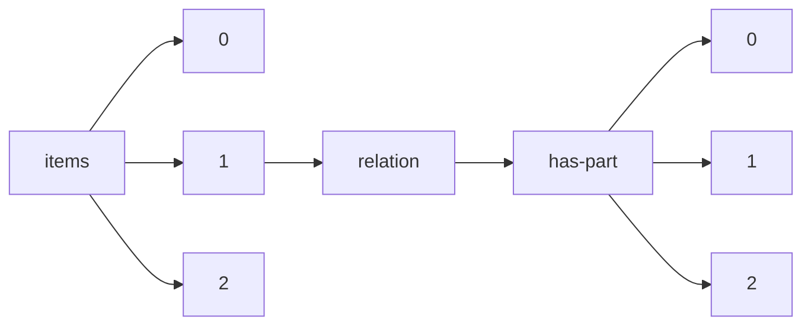

!!! warning "This document is not official Crossref documentation"
# Elements
PATH = items/array/relation/has-part/array(1)  
Occurs 1 184 times  
{ .annotate }

1. A route to an element, for example:  
   The route "items/array/relation/has-part/array" corresponds to navigating through the JSON indices as  
   ["items"][0]["relation"]["has-part"][0]  

## Asserted-by
See more information: [items/array/relation/has-part/array/asserted-by](asserted-by/index.md)  
Occurs 1 184 timess  
Unique values: 2  

| **Row** | **Value** `String` | **Count** `Int64` |
|--------:|----------------------:|---------------------:|
| **1**   | object                | 911                  |
| **2**   | subject               | 273                  |

## Id
See more information: [items/array/relation/has-part/array/id](id/index.md)  
Occurs 1 184 timess  
Unique values: 985  

| **Row** | **Value** `String`     | **Count** `Int64` |
|--------:|--------------------------:|---------------------:|
| **1**   | 10.5194/cp-14-527-2018    | 10                   |
| **2**   | 10.5194/gmd-9-3817-2016   | 8                    |
| **3**   | 10.5194/acp-21-5965-2021  | 7                    |
| **4**   | 10.5194/acp-20-14183-2020 | 6                    |
| **5**   | 10.5194/acp-20-969-2020   | 5                    |
| **6**   | PropWIDIncludes           | 5                    |
| **7**   | 10.5194/bg-13-3717-2016   | 5                    |
| **8**   | 10.5194/gmd-11-2009-2018  | 4                    |
| **9**   | 10.5194/os-14-187-2018    | 4                    |
| **10**  | 10.5194/acp-21-2675-2021  | 4                    |
| ... | ... | ... |

## Id-type
See more information: [items/array/relation/has-part/array/id-type](id-type/index.md)  
Occurs 1 184 timess  
Unique values: 5  

| **Row** | **Value** `String` | **Count** `Int64` |
|--------:|----------------------:|---------------------:|
| **1**   | doi                   | 1 167                |
| **2**   | other                 | 13                   |
| **3**   | isbn                  | 2                    |
| **4**   | purl                  | 1                    |
| **5**   | issn                  | 1                    |

