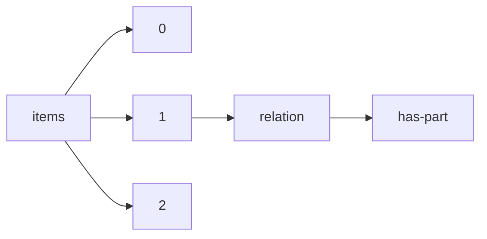

!!! warning "This document is not official Crossref documentation"
# Has-part
PATH = items/array/relation/has-part(1)  
Occurs 844 times  
{ .annotate }

1. A route to an element, for example:  
   The route "items/array/relation/has-part" corresponds to navigating through the JSON indices as  
   ["items"][0]["relation"]["has-part"]  

## Properties of Array
See information about elements: [items/array/relation/has-part/array](array/index.md)  
Distribution of lengths:  

| **Row** | **Length** `Any` | **Count** `Int64` |
|--------:|--------------------:|---------------------:|
| **1**   | 1                   | 762                  |
| **2**   | 2                   | 44                   |
| **3**   | 3                   | 13                   |
| **4**   | 4                   | 4                    |
| **5**   | 5                   | 5                    |
| **6**   | 6                   | 1                    |
| **7**   | 8                   | 4                    |
| **8**   | 9                   | 1                    |
| **9**   | 13                  | 1                    |
| **10**  | 14                  | 1                    |
| ... | ... | ... |

