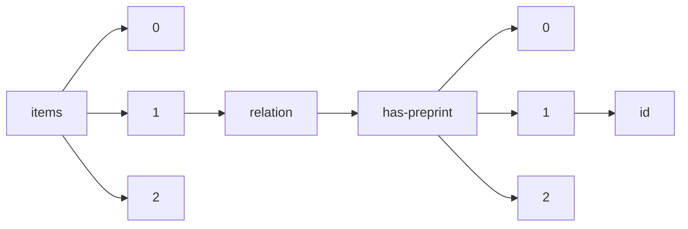

!!! warning "This document is not official Crossref documentation"
# Id
PATH = items/array/relation/has-preprint/array/id(1)  
Occurs 156 676 times  
Unique values: > 999  
{ .annotate }

1. A route to an element, for example:  
   The route "items/array/relation/has-preprint/array/id" corresponds to navigating through the JSON indices as  
   ["items"][0]["relation"]["has-preprint"][0]["id"]  

!!! note "Due to current limitations, only the first 1,000 unique values are counted."

| **Row** | **Value** `String`       | **Count** `Int64` |
|--------:|----------------------------:|---------------------:|
| **1**   | 10.47649/vau001             | 101                  |
| **2**   | 10.5194/tcd-7-5921-2013     | 4                    |
| **3**   | 10.5194/acpd-14-6361-2014   | 4                    |
| **4**   | 10.5194/bgd-10-12285-2013   | 4                    |
| **5**   | 10.5194/egusphere-2022-294  | 4                    |
| **6**   | 10.5194/cpd-2-1293-2006     | 4                    |
| **7**   | 10.5194/egusphere-2022-568  | 3                    |
| **8**   | 10.1101/2020.04.24.058958   | 3                    |
| **9**   | 10.5194/egusphere-2022-491  | 3                    |
| **10**  | 10.5194/egusphere-2022-824  | 3                    |
| **11**  | 10.5194/essd-2022-61        | 3                    |
| **12**  | 10.5194/egusphere-2022-387  | 3                    |
| **13**  | 10.5194/egusphere-2022-513  | 3                    |
| **14**  | 10.5194/egusphere-2022-966  | 3                    |
| **15**  | 10.31234/osf.io/rq3zs       | 3                    |
| **16**  | 10.5194/gmd-2022-250        | 3                    |
| **17**  | 10.1101/2020.09.03.282152   | 3                    |
| **18**  | 10.5194/egusphere-2022-168  | 3                    |
| **19**  | 10.5194/amt-2022-196        | 3                    |
| **20**  | 10.5194/egusphere-2022-638  | 3                    |
| **21**  | 10.5194/egusphere-2022-268  | 3                    |
| **22**  | 10.5194/esurf-2022-7        | 3                    |
| **23**  | 10.5194/egusphere-2022-141  | 3                    |
| **24**  | 10.5194/egusphere-2022-777  | 3                    |
| **25**  | 10.5194/egusphere-2022-377  | 3                    |
| **26**  | 10.5194/nhess-2022-137      | 3                    |
| **27**  | 10.5194/egusphere-2022-887  | 3                    |
| **28**  | 10.5194/egusphere-2022-270  | 3                    |
| **29**  | 10.5194/egusphere-2022-96   | 3                    |
| **30**  | 10.5194/egusphere-2022-62   | 3                    |
| **31**  | 10.5194/egusphere-2022-43   | 3                    |
| **32**  | 10.5194/osd-11-2607-2014    | 2                    |
| **33**  | 10.5194/hessd-12-771-2015   | 2                    |
| **34**  | 10.5194/acpd-11-23349-2011  | 2                    |
| **35**  | 10.5194/amt-2015-383        | 2                    |
| **36**  | 10.5194/acp-2019-456        | 2                    |
| **37**  | 10.5194/bgd-10-9603-2013    | 2                    |
| **38**  | 10.5194/gmd-2018-224        | 2                    |
| **39**  | 10.5194/egusphere-2022-913  | 2                    |
| **40**  | 10.5194/esurf-2019-2        | 2                    |
| **41**  | 10.5194/bg-2018-205         | 2                    |
| **42**  | 10.5194/hess-2020-216       | 2                    |
| **43**  | 10.5194/nhess-2022-184      | 2                    |
| **44**  | 10.5194/acpd-15-27917-2015  | 2                    |
| **45**  | 10.5194/hess-2016-92        | 2                    |
| **46**  | 10.5194/esd-2020-43         | 2                    |
| **47**  | 10.5194/acpd-13-6131-2013   | 2                    |
| **48**  | 10.5194/essd-2020-327       | 2                    |
| **49**  | 10.5194/bgd-12-11751-2015   | 2                    |
| **50**  | 10.5194/gmdd-8-4075-2015    | 2                    |
| **51**  | 10.5194/amt-2020-126        | 2                    |
| **52**  | 10.5194/soil-2020-75        | 2                    |
| **53**  | 10.5194/egusphere-2022-223  | 2                    |
| **54**  | 10.5194/tc-2017-271         | 2                    |
| **55**  | 10.5194/acpd-10-183-2010    | 2                    |
| **56**  | 10.5194/acpd-10-7469-2010   | 2                    |
| **57**  | 10.5194/amtd-8-11285-2015   | 2                    |
| **58**  | 10.5194/nhessd-3-3151-2015  | 2                    |
| **59**  | 10.5194/acpd-3-2331-2003    | 2                    |
| **60**  | 10.5194/acp-2019-749        | 2                    |
| **61**  | 10.5194/egusphere-2022-1160 | 2                    |
| **62**  | 10.5194/acp-2015-1048       | 2                    |
| **63**  | 10.5194/acp-2017-1058       | 2                    |
| **64**  | 10.5194/acpd-14-15771-2014  | 2                    |
| **65**  | 10.5194/acp-2017-10         | 2                    |
| **66**  | 10.5194/esurfd-1-601-2013   | 2                    |
| **67**  | 10.5194/se-2019-64          | 2                    |
| **68**  | 10.5194/amtd-3-5079-2010    | 2                    |
| **69**  | 10.5194/tcd-5-2629-2011     | 2                    |
| **70**  | 10.5194/se-2018-44          | 2                    |
| **71**  | 10.5194/acpd-14-953-2014    | 2                    |
| **72**  | 10.5194/bgd-3-1763-2006     | 2                    |
| **73**  | 10.5194/sed-4-1025-2012     | 2                    |
| **74**  | 10.5194/hessd-8-9927-2011   | 2                    |
| **75**  | 10.5194/gmdd-2-935-2009     | 2                    |
| **76**  | 10.5194/cpd-7-1511-2011     | 2                    |
| **77**  | 10.5194/hess-2019-320       | 2                    |
| **78**  | 10.5194/osd-11-123-2014     | 2                    |
| **79**  | 10.5194/amtd-7-12449-2014   | 2                    |
| **80**  | 10.5194/acpd-11-6771-2011   | 2                    |
| **81**  | 10.5194/osd-12-1013-2015    | 2                    |
| **82**  | 10.5194/acp-2017-363        | 2                    |
| **83**  | 10.5194/tc-2018-62          | 2                    |
| **84**  | 10.5194/tc-2019-177         | 2                    |
| **85**  | 10.5194/acp-2018-420        | 2                    |
| **86**  | 10.5194/acp-2016-753        | 2                    |
| **87**  | 10.5194/nhessd-1-7449-2013  | 2                    |
| **88**  | 10.5194/acpd-13-17717-2013  | 2                    |
| **89**  | 10.5194/amt-2015-341        | 2                    |
| **90**  | 10.5194/acp-2019-219        | 2                    |
| **91**  | 10.5194/tc-2016-107         | 2                    |
| **92**  | 10.5194/acp-2019-1165       | 2                    |
| **93**  | 10.5194/nhess-2018-40       | 2                    |
| **94**  | 10.5194/os-2017-100         | 2                    |
| **95**  | 10.5194/hessd-3-3061-2006   | 2                    |
| **96**  | 10.5194/acp-2019-141        | 2                    |
| **97**  | 10.5194/gmdd-4-1129-2011    | 2                    |
| **98**  | 10.5194/acpd-8-19917-2008   | 2                    |
| **99**  | 10.5194/acp-2016-806        | 2                    |
| **100** | 10.5194/bgd-8-1643-2011     | 2                    |
| **101** | 10.5194/hessd-3-1629-2006   | 2                    |
| **102** | 10.5194/amtd-3-891-2010     | 2                    |
| **103** | 10.5194/acpd-13-1575-2013   | 2                    |
| **104** | 10.5194/essd-2019-151       | 2                    |
| **105** | 10.5194/acp-2018-1057       | 2                    |
| **106** | 10.5194/bgd-11-12631-2014   | 2                    |
| **107** | 10.5194/bgd-9-19085-2012    | 2                    |
| **108** | 10.5194/wes-2019-45         | 2                    |
| **109** | 10.5194/acp-2016-450        | 2                    |
| **110** | 10.5194/os-2016-106         | 2                    |
| **111** | 10.5194/cpd-7-1797-2011     | 2                    |
| **112** | 10.5194/hessd-7-5621-2010   | 2                    |
| **113** | 10.5194/bg-2019-493         | 2                    |
| **114** | 10.5194/bgd-6-11347-2009    | 2                    |
| **115** | 10.5194/tcd-6-4977-2012     | 2                    |
| **116** | 10.5194/bgd-10-15711-2013   | 2                    |
| **117** | 10.5194/cpd-9-2929-2013     | 2                    |
| **118** | 10.5194/os-2017-62          | 2                    |
| **119** | 10.5194/gmdd-5-2527-2012    | 2                    |
| **120** | 10.5194/cpd-9-1321-2013     | 2                    |
| **121** | 10.5194/acpd-11-9217-2011   | 2                    |
| **122** | 10.5194/bg-2016-359         | 2                    |
| **123** | 10.5194/tc-2019-84          | 2                    |
| **124** | 10.5194/esd-2020-49         | 2                    |
| **125** | 10.5194/bgd-11-15693-2014   | 2                    |
| **126** | 10.5194/acpd-4-2167-2004    | 2                    |
| **127** | 10.5194/hessd-11-3005-2014  | 2                    |
| **128** | 10.5194/acpd-9-23319-2009   | 2                    |
| **129** | 10.5194/gmdd-8-5931-2015    | 2                    |
| **130** | 10.5194/acp-2020-613        | 2                    |
| **131** | 10.5194/hessd-6-4637-2009   | 2                    |
| **132** | 10.5194/acpd-15-25739-2015  | 2                    |
| **133** | 10.5194/cpd-8-3251-2012     | 2                    |
| **134** | 10.5194/essd-2019-78        | 2                    |
| **135** | 10.5194/gmdd-8-8519-2015    | 2                    |
| **136** | 10.5194/amtd-5-8271-2012    | 2                    |
| **137** | 10.5194/bg-2017-182         | 2                    |
| **138** | 10.5194/tc-2020-5           | 2                    |
| **139** | 10.5194/gmd-2016-78         | 2                    |
| **140** | 10.5194/amt-2017-213        | 2                    |
| **141** | 10.5194/cp-2016-127         | 2                    |
| **142** | 10.5194/tc-2020-282         | 2                    |
| **143** | 10.5194/tc-2020-97          | 2                    |
| **144** | 10.5194/angeo-2019-55       | 2                    |
| **145** | 10.5194/bg-2017-308         | 2                    |
| **146** | 10.5194/acpd-10-11615-2010  | 2                    |
| **147** | 10.5194/nhessd-3-5891-2015  | 2                    |
| **148** | 10.5194/acp-2020-685        | 2                    |
| **149** | 10.5194/amt-2017-219        | 2                    |
| **150** | 10.5194/acp-2017-265        | 2                    |
| **151** | 10.5194/acpd-9-13629-2009   | 2                    |
| **152** | 10.5194/gmd-2019-369        | 2                    |
| **153** | 10.5194/acpd-15-13211-2015  | 2                    |
| **154** | 10.5194/bg-2015-663         | 2                    |
| **155** | 10.5194/hessd-4-2521-2007   | 2                    |
| **156** | 10.5194/bg-2020-156         | 2                    |
| **157** | 10.5194/gmd-2019-162        | 2                    |
| **158** | 10.5194/hessd-5-1137-2008   | 2                    |
| **159** | 10.5194/hessd-9-7227-2012   | 2                    |
| **160** | 10.5194/acpd-15-27449-2015  | 2                    |
| **161** | 10.5194/nhess-2020-395      | 2                    |
| **162** | 10.5194/amt-2017-165        | 2                    |
| **163** | 10.5194/acp-2016-465        | 2                    |
| **164** | 10.5194/acp-2016-530        | 2                    |
| **165** | 10.5194/essd-2017-117       | 2                    |
| **166** | 10.5194/acp-2022-167        | 2                    |
| **167** | 10.5194/amt-2016-373        | 2                    |
| **168** | 10.5194/hess-2016-282       | 2                    |
| **169** | 10.5194/acpd-14-2087-2014   | 2                    |
| **170** | 10.5194/gmdd-8-10237-2015   | 2                    |
| **171** | 10.5194/hess-2020-604       | 2                    |
| **172** | 10.5194/acp-2017-747        | 2                    |
| **173** | 10.5194/bg-2016-296         | 2                    |
| **174** | 10.5194/sed-5-1845-2013     | 2                    |
| **175** | 10.5194/osd-10-519-2013     | 2                    |
| **176** | 10.5194/esurf-2016-47       | 2                    |
| **177** | 10.5194/wes-2016-6          | 2                    |
| **178** | 10.5194/nhessd-2-3741-2014  | 2                    |
| **179** | 10.5194/bgd-9-6715-2012     | 2                    |
| **180** | 10.5194/hessd-6-2751-2009   | 2                    |
| **181** | 10.5194/hessd-6-1433-2009   | 2                    |
| **182** | 10.5194/hessd-7-1103-2010   | 2                    |
| **183** | 10.5194/acpd-14-1971-2014   | 2                    |
| **184** | 10.5194/acp-2019-432        | 2                    |
| **185** | 10.5194/acpd-13-32459-2013  | 2                    |
| **186** | 10.5194/os-2019-77          | 2                    |
| **187** | 10.5194/essd-2019-242       | 2                    |
| **188** | 10.5194/acpd-11-29845-2011  | 2                    |
| **189** | 10.5194/acpd-14-11749-2014  | 2                    |
| **190** | 10.5194/dwes-2017-39        | 2                    |
| **191** | 10.5194/osd-5-419-2008      | 2                    |
| **192** | 10.5194/amt-2017-247        | 2                    |
| **193** | 10.5194/tcd-8-6193-2014     | 2                    |
| **194** | 10.5194/amt-2018-177        | 2                    |
| **195** | 10.5194/amtd-8-11401-2015   | 2                    |
| **196** | 10.5194/acpd-11-3041-2011   | 2                    |
| **197** | 10.5194/os-2019-132         | 2                    |
| **198** | 10.5194/hess-2022-118       | 2                    |
| **199** | 10.5194/hessd-11-12027-2014 | 2                    |
| **200** | 10.5194/hess-2017-533       | 2                    |
| **201** | 10.5194/nhess-2016-199      | 2                    |
| **202** | 10.5194/acpd-10-14639-2010  | 2                    |
| **203** | 10.5194/hessd-6-1939-2009   | 2                    |
| **204** | 10.5194/amt-2020-60         | 2                    |
| **205** | 10.5194/acpd-9-13801-2009   | 2                    |
| **206** | 10.5194/acp-2019-441        | 2                    |
| **207** | 10.5194/esurf-2019-52       | 2                    |
| **208** | 10.5194/tcd-9-4981-2015     | 2                    |
| **209** | 10.5194/acp-2020-523        | 2                    |
| **210** | 10.5194/acp-2020-175        | 2                    |
| **211** | 10.5194/tc-2016-156         | 2                    |
| **212** | 10.5194/hess-2016-164       | 2                    |
| **213** | 10.1101/2021.10.03.462935   | 2                    |
| **214** | 10.5194/tc-2019-144         | 2                    |
| **215** | 10.5194/amtd-6-1239-2013    | 2                    |
| **216** | 10.5194/hess-2019-313       | 2                    |
| **217** | 10.5194/gmdd-4-1533-2011    | 2                    |
| **218** | 10.5194/acpd-7-13627-2007   | 2                    |
| **219** | 10.5194/acp-2016-946        | 2                    |
| **220** | 10.5194/hessd-10-2955-2013  | 2                    |
| **221** | 10.5194/osd-9-1973-2012     | 2                    |
| **222** | 10.5194/amtd-6-8743-2013    | 2                    |
| **223** | 10.5194/gmd-2019-368        | 2                    |
| **224** | 10.5194/tcd-9-2999-2015     | 2                    |
| **225** | 10.5194/acpd-13-3695-2013   | 2                    |
| **226** | 10.5194/acp-2016-998        | 2                    |
| **227** | 10.5194/bgd-12-3825-2015    | 2                    |
| **228** | 10.5194/hessd-6-6795-2009   | 2                    |
| **229** | 10.5194/amtd-2-893-2009     | 2                    |
| **230** | 10.5194/hessd-11-7773-2014  | 2                    |
| **231** | 10.5194/acp-2016-728        | 2                    |
| **232** | 10.5194/wcd-2021-61         | 2                    |
| **233** | 10.5194/acp-2018-1077       | 2                    |
| **234** | 10.5194/acp-2016-1054       | 2                    |
| **235** | 10.5194/amt-2015-330        | 2                    |
| **236** | 10.5194/tc-2016-206         | 2                    |
| **237** | 10.5194/wes-2022-80         | 2                    |
| **238** | 10.5194/amtd-8-1615-2015    | 2                    |
| **239** | 10.5194/egusphere-2022-288  | 2                    |
| **240** | 10.5194/acp-2016-694        | 2                    |
| **241** | 10.5194/os-2020-90          | 2                    |
| **242** | 10.5194/essd-2020-252       | 2                    |
| **243** | 10.5194/nhessd-2-5937-2014  | 2                    |
| **244** | 10.5194/tcd-6-2059-2012     | 2                    |
| **245** | 10.5194/acpd-11-4167-2011   | 2                    |
| **246** | 10.5194/acpd-13-31761-2013  | 2                    |
| **247** | 10.5194/bg-2015-622         | 2                    |
| **248** | 10.5194/gmdd-2-797-2009     | 2                    |
| **249** | 10.5194/hess-2017-142       | 2                    |
| **250** | 10.31219/osf.io/rgzkh       | 2                    |
| **251** | 10.5194/tcd-4-823-2010      | 2                    |
| **252** | 10.5194/acp-2017-126        | 2                    |
| **253** | 10.5194/bg-2020-27          | 2                    |
| **254** | 10.5194/acpd-14-9647-2014   | 2                    |
| **255** | 10.5194/essdd-6-389-2013    | 2                    |
| **256** | 10.5194/esurf-2016-25       | 2                    |
| **257** | 10.5194/amtd-4-1021-2011    | 2                    |
| **258** | 10.5194/osd-7-709-2010      | 2                    |
| **259** | 10.5194/amtd-7-12517-2014   | 2                    |
| **260** | 10.5194/amtd-7-7245-2014    | 2                    |
| **261** | 10.5194/amtd-4-247-2011     | 2                    |
| **262** | 10.5194/acpd-10-12341-2010  | 2                    |
| **263** | 10.5194/bg-2016-153         | 2                    |
| **264** | 10.5194/osd-10-1971-2013    | 2                    |
| **265** | 10.5194/acp-2016-900        | 2                    |
| **266** | 10.5194/hess-2016-258       | 2                    |
| **267** | 10.5194/angeo-2019-78       | 2                    |
| **268** | 10.5194/amt-2020-62         | 2                    |
| **269** | 10.5194/amtd-6-3581-2013    | 2                    |
| **270** | 10.5194/gmd-2017-227        | 2                    |
| **271** | 10.5194/tcd-8-121-2014      | 2                    |
| **272** | 10.5194/osd-3-701-2006      | 2                    |
| **273** | 10.5194/nhess-2019-381      | 2                    |
| **274** | 10.5194/acp-2020-467        | 2                    |
| **275** | 10.5194/hess-2018-241       | 2                    |
| **276** | 10.5194/hessd-6-4705-2009   | 2                    |
| **277** | 10.5194/tcd-9-3821-2015     | 2                    |
| **278** | 10.5194/acpd-15-29347-2015  | 2                    |
| **279** | 10.5194/essd-2018-8         | 2                    |
| **280** | 10.5194/bgd-8-11285-2011    | 2                    |
| **281** | 10.5194/osd-8-829-2011      | 2                    |
| **282** | 10.5194/acpd-10-7383-2010   | 2                    |
| **283** | 10.5194/gmd-2020-294        | 2                    |
| **284** | 10.5194/hessd-10-11861-2013 | 2                    |
| **285** | 10.5194/acp-2016-360        | 2                    |
| **286** | 10.5194/bg-2018-510         | 2                    |
| **287** | 10.5194/acpd-14-4189-2014   | 2                    |
| **288** | 10.5194/nhess-2016-204      | 2                    |
| **289** | 10.5194/acp-2018-882        | 2                    |
| **290** | 10.5194/cpd-10-809-2014     | 2                    |
| **291** | 10.5194/amtd-7-1535-2014    | 2                    |
| **292** | 10.5194/acp-2017-670        | 2                    |
| **293** | 10.5194/esd-2019-83         | 2                    |
| **294** | 10.5194/acpd-6-579-2006     | 2                    |
| **295** | 10.5194/bg-2020-323         | 2                    |
| **296** | 10.5194/tc-2019-55          | 2                    |
| **297** | 10.5194/se-2020-3           | 2                    |
| **298** | 10.5194/hessd-11-4311-2014  | 2                    |
| **299** | 10.5194/essdd-2-537-2009    | 2                    |
| **300** | 10.5194/amt-2016-133        | 2                    |
| **301** | 10.5194/acp-2018-1185       | 2                    |
| **302** | 10.5194/essd-2022-171       | 2                    |
| **303** | 10.5194/hessd-10-7235-2013  | 2                    |
| **304** | 10.5194/amt-2017-86         | 2                    |
| **305** | 10.5194/cp-2018-59          | 2                    |
| **306** | 10.5194/acp-2020-17         | 2                    |
| **307** | 10.5194/acp-2019-684        | 2                    |
| **308** | 10.5194/acpd-13-32291-2013  | 2                    |
| **309** | 10.5194/gi-2017-17          | 2                    |
| **310** | 10.5194/acpd-9-837-2009     | 2                    |
| **311** | 10.5194/acp-2019-1147       | 2                    |
| **312** | 10.5194/egusphere-2022-267  | 2                    |
| **313** | 10.5194/tc-2016-199         | 2                    |
| **314** | 10.5194/acpd-10-15537-2010  | 2                    |
| **315** | 10.5194/dwesd-1-155-2008    | 2                    |
| **316** | 10.5194/acp-2018-1102       | 2                    |
| **317** | 10.5194/hessd-10-6669-2013  | 2                    |
| **318** | 10.5194/acpd-8-2745-2008    | 2                    |
| **319** | 10.5194/bgd-12-20515-2015   | 2                    |
| **320** | 10.5194/bgd-4-2915-2007     | 2                    |
| **321** | 10.5194/gmdd-7-8649-2014    | 2                    |
| **322** | 10.5194/hess-2018-416       | 2                    |
| **323** | 10.5194/tc-2018-16          | 2                    |
| **324** | 10.5194/bgd-11-3865-2014    | 2                    |
| **325** | 10.5194/acp-2017-24         | 2                    |
| **326** | 10.5194/bgd-10-787-2013     | 2                    |
| **327** | 10.5194/gmd-2018-320        | 2                    |
| **328** | 10.5194/bgd-4-4067-2007     | 2                    |
| **329** | 10.5194/hessd-4-1215-2007   | 2                    |
| **330** | 10.5194/bg-2019-200         | 2                    |
| **331** | 10.5194/amtd-6-4333-2013    | 2                    |
| **332** | 10.5194/gid-2-337-2012      | 2                    |
| **333** | 10.5194/acpd-13-29983-2013  | 2                    |
| **334** | 10.5194/amt-2018-412        | 2                    |
| **335** | 10.5194/sed-7-495-2015      | 2                    |
| **336** | 10.5194/hessd-8-5319-2011   | 2                    |
| **337** | 10.5194/tcd-9-1209-2015     | 2                    |
| **338** | 10.5194/nhessd-2-3289-2014  | 2                    |
| **339** | 10.5194/cpd-2-399-2006      | 2                    |
| **340** | 10.5194/acp-2016-614        | 2                    |
| **341** | 10.5194/nhess-2016-89       | 2                    |
| **342** | 10.5194/acpd-12-11415-2012  | 2                    |
| **343** | 10.5194/acpd-11-23859-2011  | 2                    |
| **344** | 10.5194/amt-2020-90         | 2                    |
| **345** | 10.5194/bgd-9-9091-2012     | 2                    |
| **346** | 10.5194/cp-2019-114         | 2                    |
| **347** | 10.5194/bgd-11-8485-2014    | 2                    |
| **348** | 10.5194/hessd-8-11115-2011  | 2                    |
| **349** | 10.5194/tcd-9-2543-2015     | 2                    |
| **350** | 10.5194/acpd-1-23-2001      | 2                    |
| **351** | 10.5194/egusphere-2022-510  | 2                    |
| **352** | 10.5194/gmd-2018-285        | 2                    |
| **353** | 10.5194/gmdd-5-1203-2012    | 2                    |
| **354** | 10.5194/acp-2018-496        | 2                    |
| **355** | 10.5194/bgd-9-3003-2012     | 2                    |
| **356** | 10.5194/os-2020-48          | 2                    |
| **357** | 10.5194/osd-11-1213-2014    | 2                    |
| **358** | 10.5194/bgd-11-3963-2014    | 2                    |
| **359** | 10.5194/acpd-14-23415-2014  | 2                    |
| **360** | 10.5194/tcd-8-3851-2014     | 2                    |
| **361** | 10.5194/acp-2021-1018       | 2                    |
| **362** | 10.5194/acp-2016-982        | 2                    |
| **363** | 10.5194/egusphere-2022-1080 | 2                    |
| **364** | 10.5194/bgd-9-879-2012      | 2                    |
| **365** | 10.5194/gmd-2018-41         | 2                    |
| **366** | 10.5194/acp-2016-1165       | 2                    |
| **367** | 10.5194/esd-2022-18         | 2                    |
| **368** | 10.5194/bgd-10-16453-2013   | 2                    |
| **369** | 10.5194/bg-2020-223         | 2                    |
| **370** | 10.5194/amt-2018-133        | 2                    |
| **371** | 10.5194/amt-2022-250        | 2                    |
| **372** | 10.5194/tcd-6-1405-2012     | 2                    |
| **373** | 10.5194/bgd-7-5347-2010     | 2                    |
| **374** | 10.5194/bg-2018-516         | 2                    |
| **375** | 10.5194/hessd-7-221-2010    | 2                    |
| **376** | 10.5194/acp-2019-129        | 2                    |
| **377** | 10.5194/acp-2017-1114       | 2                    |
| **378** | 10.5194/acpd-12-25389-2012  | 2                    |
| **379** | 10.5194/gmdd-7-7823-2014    | 2                    |
| **380** | 10.5194/nhess-2018-250      | 2                    |
| **381** | 10.5194/bgd-10-12967-2013   | 2                    |
| **382** | 10.5194/acp-2015-967        | 2                    |
| **383** | 10.5194/bgd-12-5725-2015    | 2                    |
| **384** | 10.5194/tc-2020-220         | 2                    |
| **385** | 10.5194/acp-2017-547        | 2                    |
| **386** | 10.5194/tc-2017-262         | 2                    |
| **387** | 10.5194/os-2019-51          | 2                    |
| **388** | 10.5194/acp-2018-612        | 2                    |
| **389** | 10.5194/gmd-2019-218        | 2                    |
| **390** | 10.5194/acp-2016-409        | 2                    |
| **391** | 10.5194/bgd-2-1795-2005     | 2                    |
| **392** | 10.5194/bg-2018-74          | 2                    |
| **393** | 10.5194/acpd-8-16219-2008   | 2                    |
| **394** | 10.5194/acpd-8-20799-2008   | 2                    |
| **395** | 10.5194/tcd-4-641-2010      | 2                    |
| **396** | 10.5194/amt-2017-451        | 2                    |
| **397** | 10.5194/acpd-10-281-2010    | 2                    |
| **398** | 10.5194/acp-2020-432        | 2                    |
| **399** | 10.5194/gmd-2016-174        | 2                    |
| **400** | 10.5194/acpd-10-23149-2010  | 2                    |
| **401** | 10.5194/essdd-6-541-2013    | 2                    |
| **402** | 10.5194/acp-2018-10         | 2                    |
| **403** | 10.5194/acpd-4-471-2004     | 2                    |
| **404** | 10.5194/gmd-2016-153        | 2                    |
| **405** | 10.5194/bg-2016-275         | 2                    |
| **406** | 10.5194/esd-2020-45         | 2                    |
| **407** | 10.5194/cpd-10-2011-2014    | 2                    |
| **408** | 10.5194/acpd-14-13963-2014  | 2                    |
| **409** | 10.5194/hessd-6-3041-2009   | 2                    |
| **410** | 10.5194/essd-2020-157       | 2                    |
| **411** | 10.5194/essd-2017-53        | 2                    |
| **412** | 10.5194/hess-2017-64        | 2                    |
| **413** | 10.5194/acpd-11-28747-2011  | 2                    |
| **414** | 10.5194/acp-2018-163        | 2                    |
| **415** | 10.5194/amt-2020-397        | 2                    |
| **416** | 10.5194/hessd-8-4979-2011   | 2                    |
| **417** | 10.5194/acpd-8-489-2008     | 2                    |
| **418** | 10.5194/bgd-6-8393-2009     | 2                    |
| **419** | 10.5194/amt-2018-67         | 2                    |
| **420** | 10.5194/tc-2018-209         | 2                    |
| **421** | 10.5194/gi-2015-45          | 2                    |
| **422** | 10.5194/acpd-7-11545-2007   | 2                    |
| **423** | 10.5194/essd-2019-77        | 2                    |
| **424** | 10.5194/bg-2018-182         | 2                    |
| **425** | 10.5194/acp-2016-922        | 2                    |
| **426** | 10.5194/amt-2018-44         | 2                    |
| **427** | 10.5194/acpd-9-6929-2009    | 2                    |
| **428** | 10.5194/bgd-12-231-2015     | 2                    |
| **429** | 10.5194/bgd-9-2375-2012     | 2                    |
| **430** | 10.5194/amt-2019-66         | 2                    |
| **431** | 10.5194/amt-2018-2          | 2                    |
| **432** | 10.5194/acpd-4-3947-2004    | 2                    |
| **433** | 10.5194/sed-5-227-2013      | 2                    |
| **434** | 10.5194/acpd-11-5351-2011   | 2                    |
| **435** | 10.5194/bgd-10-2127-2013    | 2                    |
| **436** | 10.5194/hessd-8-9505-2011   | 2                    |
| **437** | 10.5194/wes-2019-109        | 2                    |
| **438** | 10.5194/esdd-1-1-2010       | 2                    |
| **439** | 10.5194/esurf-2016-18       | 2                    |
| **440** | 10.5194/hess-2020-200       | 2                    |
| **441** | 10.5194/bg-2022-1           | 2                    |
| **442** | 10.5194/bgd-12-19673-2015   | 2                    |
| **443** | 10.5194/acp-2016-499        | 2                    |
| **444** | 10.5194/tc-2018-278         | 2                    |
| **445** | 10.5194/esdd-5-1319-2014    | 2                    |
| **446** | 10.5194/hessd-10-5355-2013  | 2                    |
| **447** | 10.5194/acp-2019-74         | 2                    |
| **448** | 10.5194/tc-2018-245         | 2                    |
| **449** | 10.5194/os-2019-48          | 2                    |
| **450** | 10.5194/egusphere-2022-10   | 2                    |
| **451** | 10.5194/amt-2018-459        | 2                    |
| **452** | 10.5194/acp-2020-484        | 2                    |
| **453** | 10.5194/egusphere-2022-75   | 2                    |
| **454** | 10.5194/nhess-2020-86       | 2                    |
| **455** | 10.5194/hessd-6-3483-2009   | 2                    |
| **456** | 10.5194/tcd-7-6075-2013     | 2                    |
| **457** | 10.5194/amtd-8-4137-2015    | 2                    |
| **458** | 10.5194/wes-2020-115        | 2                    |
| **459** | 10.5194/hessd-9-8173-2012   | 2                    |
| **460** | 10.5194/acpd-11-11205-2011  | 2                    |
| **461** | 10.5194/acpd-14-15219-2014  | 2                    |
| **462** | 10.5194/bgd-9-9315-2012     | 2                    |
| **463** | 10.5194/amt-2016-153        | 2                    |
| **464** | 10.5194/nhess-2020-201      | 2                    |
| **465** | 10.5194/amt-2017-323        | 2                    |
| **466** | 10.5194/os-2018-117         | 2                    |
| **467** | 10.5194/gmdd-3-1089-2010    | 2                    |
| **468** | 10.5194/hessd-6-3359-2009   | 2                    |
| **469** | 10.5194/os-2018-86          | 2                    |
| **470** | 10.5194/hessd-8-9275-2011   | 2                    |
| **471** | 10.5194/hessd-9-1251-2012   | 2                    |
| **472** | 10.5194/acpd-11-25173-2011  | 2                    |
| **473** | 10.5194/amtd-5-4003-2012    | 2                    |
| **474** | 10.5194/sed-5-257-2013      | 2                    |
| **475** | 10.5194/amtd-3-3489-2010    | 2                    |
| **476** | 10.5194/esurf-2018-81       | 2                    |
| **477** | 10.5194/hess-2018-64        | 2                    |
| **478** | 10.5194/bg-2019-292         | 2                    |
| **479** | 10.5194/hessd-8-6565-2011   | 2                    |
| **480** | 10.5194/acpd-10-2835-2010   | 2                    |
| **481** | 10.5194/hess-2019-391       | 2                    |
| **482** | 10.5194/nhess-2016-184      | 2                    |
| **483** | 10.5194/acpd-9-4769-2009    | 2                    |
| **484** | 10.5194/esurf-2020-27       | 2                    |
| **485** | 10.5194/nhessd-2-4857-2014  | 2                    |
| **486** | 10.5194/nhess-2015-341      | 2                    |
| **487** | 10.5194/acpd-6-3997-2006    | 2                    |
| **488** | 10.5194/hess-2015-491       | 2                    |
| **489** | 10.5194/bgd-8-8723-2011     | 2                    |
| **490** | 10.5194/acp-2018-1049       | 2                    |
| **491** | 10.5194/hess-2016-435       | 2                    |
| **492** | 10.5194/acp-2016-800        | 2                    |
| **493** | 10.5194/gmd-2017-205        | 2                    |
| **494** | 10.5194/wes-2019-88         | 2                    |
| **495** | 10.5194/bgd-12-2459-2015    | 2                    |
| **496** | 10.5194/essd-2018-3         | 2                    |
| **497** | 10.5194/amt-2019-363        | 2                    |
| **498** | 10.5194/acpd-7-15693-2007   | 2                    |
| **499** | 10.5194/bg-2016-129         | 2                    |
| **500** | 10.5194/acp-2018-130        | 2                    |
| **501** | 10.5194/mr-2021-22          | 2                    |
| **502** | 10.5194/amtd-8-8083-2015    | 2                    |
| **503** | 10.5194/acp-2017-226        | 2                    |
| **504** | 10.5194/acp-2020-980        | 2                    |
| **505** | 10.5194/bgd-10-19189-2013   | 2                    |
| **506** | 10.5194/esdd-2-467-2011     | 2                    |
| **507** | 10.5194/acpd-9-19243-2009   | 2                    |
| **508** | 10.5194/acp-2017-236        | 2                    |
| **509** | 10.5194/nhessd-2-6859-2014  | 2                    |
| **510** | 10.5194/bgd-9-3479-2012     | 2                    |
| **511** | 10.5194/amt-2020-400        | 2                    |
| **512** | 10.5194/acpd-7-14603-2007   | 2                    |
| **513** | 10.5194/acpd-9-14771-2009   | 2                    |
| **514** | 10.5194/acp-2018-398        | 2                    |
| **515** | 10.1099/acmi.0.000470.v2    | 2                    |
| **516** | 10.5194/hess-2015-511       | 2                    |
| **517** | 10.5194/gmdd-6-6219-2013    | 2                    |
| **518** | 10.5194/esd-2017-103        | 2                    |
| **519** | 10.5194/bg-2018-470         | 2                    |
| **520** | 10.5194/acpd-7-10343-2007   | 2                    |
| **521** | 10.5194/acpd-15-2577-2015   | 2                    |
| **522** | 10.5194/acp-2016-271        | 2                    |
| **523** | 10.5194/acpd-9-6979-2009    | 2                    |
| **524** | 10.5194/se-2020-121         | 2                    |
| **525** | 10.5194/acp-2017-884        | 2                    |
| **526** | 10.5194/acpd-10-28355-2010  | 2                    |
| **527** | 10.5194/acpd-7-17261-2007   | 2                    |
| **528** | 10.5194/gmdd-7-2651-2014    | 2                    |
| **529** | 10.5194/acpd-5-10055-2005   | 2                    |
| **530** | 10.5194/cpd-10-2087-2014    | 2                    |
| **531** | 10.5194/tcd-5-2409-2011     | 2                    |
| **532** | 10.5194/acpd-3-1051-2003    | 2                    |
| **533** | 10.5194/acpd-15-32289-2015  | 2                    |
| **534** | 10.5194/amt-2017-206        | 2                    |
| **535** | 10.5194/hessd-8-10635-2011  | 2                    |
| **536** | 10.5194/egusphere-2022-478  | 2                    |
| **537** | 10.5194/hessd-5-323-2008    | 2                    |
| **538** | 10.5194/acpd-9-14713-2009   | 2                    |
| **539** | 10.5194/acpd-4-343-2004     | 2                    |
| **540** | 10.5194/tc-2019-315         | 2                    |
| **541** | 10.5194/nhess-2020-274      | 2                    |
| **542** | 10.5194/acpd-14-30799-2014  | 2                    |
| **543** | 10.5194/acpd-6-3945-2006    | 2                    |
| **544** | 10.5194/esd-2016-71         | 2                    |
| **545** | 10.5194/hessd-3-1281-2006   | 2                    |
| **546** | 10.5194/gmd-2019-374        | 2                    |
| **547** | 10.5194/bg-2015-631         | 2                    |
| **548** | 10.5194/gmdd-7-1865-2014    | 2                    |
| **549** | 10.5194/tcd-8-4545-2014     | 2                    |
| **550** | 10.5194/acpd-15-3629-2015   | 2                    |
| **551** | 10.5194/amtd-8-5105-2015    | 2                    |
| **552** | 10.5194/osd-10-1559-2013    | 2                    |
| **553** | 10.5194/bg-2016-14          | 2                    |
| **554** | 10.5194/amt-2017-238        | 2                    |
| **555** | 10.5194/essd-2020-174       | 2                    |
| **556** | 10.5194/bg-2019-460         | 2                    |
| **557** | 10.5194/acp-2016-1017       | 2                    |
| **558** | 10.5194/acpd-9-693-2009     | 2                    |
| **559** | 10.5194/acp-2018-1104       | 2                    |
| **560** | 10.5194/bg-2019-14          | 2                    |
| **561** | 10.5194/hess-2019-587       | 2                    |
| **562** | 10.5194/tc-2019-193         | 2                    |
| **563** | 10.5194/hess-2018-452       | 2                    |
| **564** | 10.5194/bg-2018-240         | 2                    |
| **565** | 10.5194/wes-2019-50         | 2                    |
| **566** | 10.5194/cp-2020-77          | 2                    |
| **567** | 10.5194/acp-2020-985        | 2                    |
| **568** | 10.5194/acp-2020-51         | 2                    |
| **569** | 10.5194/acp-2020-386        | 2                    |
| **570** | 10.5194/amt-2018-293        | 2                    |
| **571** | 10.5194/essd-2019-199       | 2                    |
| **572** | 10.5194/hess-2019-307       | 2                    |
| **573** | 10.5194/amt-2021-82         | 2                    |
| **574** | 10.5194/acp-2020-1295       | 2                    |
| **575** | 10.5194/acp-2019-781        | 2                    |
| **576** | 10.5194/acp-2020-906        | 2                    |
| **577** | 10.5194/cp-2018-4           | 2                    |
| **578** | 10.5194/nhess-2020-224      | 2                    |
| **579** | 10.5194/esurf-2019-31       | 2                    |
| **580** | 10.5194/acp-2019-797        | 2                    |
| **581** | 10.5194/bg-2018-78          | 2                    |
| **582** | 10.5194/amt-2020-419        | 2                    |
| **583** | 10.5194/essd-2019-205       | 2                    |
| **584** | 10.5194/cp-2020-48          | 2                    |
| **585** | 10.5194/se-2020-172         | 2                    |
| **586** | 10.5194/amt-2018-266        | 2                    |
| **587** | 10.5194/acp-2018-752        | 2                    |
| **588** | 10.5194/amt-2017-484        | 2                    |
| **589** | 10.5194/hess-2018-235       | 2                    |
| **590** | 10.5194/se-2020-129         | 2                    |
| **591** | 10.5194/acp-2018-557        | 2                    |
| **592** | 10.5194/amt-2020-296        | 2                    |
| **593** | 10.5194/essd-2020-394       | 2                    |
| **594** | 10.5194/egusphere-2022-919  | 2                    |
| **595** | 10.5194/amt-2018-209        | 2                    |
| **596** | 10.5194/se-2019-115         | 2                    |
| **597** | 10.5194/gmd-2020-225        | 2                    |
| **598** | 10.5194/acp-2020-1105       | 2                    |
| **599** | 10.5194/amt-2020-316        | 2                    |
| **600** | 10.5194/tc-2017-230         | 2                    |
| **601** | 10.5194/bg-2020-97          | 2                    |
| **602** | 10.5194/acp-2020-343        | 2                    |
| **603** | 10.5194/se-2019-163         | 2                    |
| **604** | 10.5194/acp-2018-97         | 2                    |
| **605** | 10.5194/amt-2018-3          | 2                    |
| **606** | 10.5194/amt-2018-357        | 2                    |
| **607** | 10.5194/acp-2018-1191       | 2                    |
| **608** | 10.5194/acp-2018-171        | 2                    |
| **609** | 10.5194/amt-2019-55         | 2                    |
| **610** | 10.5194/wcd-2020-33         | 2                    |
| **611** | 10.5194/acp-2021-871        | 2                    |
| **612** | 10.5194/bg-2017-570         | 2                    |
| **613** | 10.5194/amt-2020-85         | 2                    |
| **614** | 10.5194/gmd-2020-90         | 2                    |
| **615** | 10.5194/acp-2022-598        | 2                    |
| **616** | 10.5194/wes-2018-77         | 2                    |
| **617** | 10.5194/bg-2017-517         | 2                    |
| **618** | 10.5194/os-2019-90          | 2                    |
| **619** | 10.5194/acp-2020-7          | 2                    |
| **620** | 10.5194/gchron-2019-16      | 2                    |
| **621** | 10.5194/gmd-2021-3          | 2                    |
| **622** | 10.5194/tc-2018-15          | 2                    |
| **623** | 10.5194/npg-2019-63         | 2                    |
| **624** | 10.5194/acp-2019-475        | 2                    |
| **625** | 10.5194/hess-2018-128       | 2                    |
| **626** | 10.5194/bg-2020-456         | 2                    |
| **627** | 10.5194/acp-2019-620        | 2                    |
| **628** | 10.5194/angeo-2018-93       | 2                    |
| **629** | 10.5194/wes-2019-78         | 2                    |
| **630** | 10.5194/angeo-2019-133      | 2                    |
| **631** | 10.5194/acp-2020-654        | 2                    |
| **632** | 10.5194/amt-2019-464        | 2                    |
| **633** | 10.5194/osd-8-1757-2011     | 2                    |
| **634** | 10.5194/acpd-7-8035-2007    | 2                    |
| **635** | 10.5194/hessd-3-529-2006    | 2                    |
| **636** | 10.5194/amt-2017-325        | 2                    |
| **637** | 10.5194/bg-2016-501         | 2                    |
| **638** | 10.5194/acp-2016-1059       | 2                    |
| **639** | 10.5194/acpd-8-3895-2008    | 2                    |
| **640** | 10.5194/acp-2017-935        | 2                    |
| **641** | 10.5194/hessd-6-2537-2009   | 2                    |
| **642** | 10.5194/tcd-6-3863-2012     | 2                    |
| **643** | 10.5194/acpd-13-19421-2013  | 2                    |
| **644** | 10.5194/bgd-7-2313-2010     | 2                    |
| **645** | 10.5194/amt-2019-206        | 2                    |
| **646** | 10.5194/bg-2017-8           | 2                    |
| **647** | 10.5194/acp-2016-268        | 2                    |
| **648** | 10.5194/amt-2017-186        | 2                    |
| **649** | 10.5194/egusphere-2022-149  | 2                    |
| **650** | 10.5194/esd-2019-14         | 2                    |
| **651** | 10.5194/sed-3-187-2011      | 2                    |
| **652** | 10.5194/bgd-10-18009-2013   | 2                    |
| **653** | 10.5194/amt-2019-321        | 2                    |
| **654** | 10.5194/bgd-11-2793-2014    | 2                    |
| **655** | 10.5194/nhess-2017-352      | 2                    |
| **656** | 10.5194/hess-2016-211       | 2                    |
| **657** | 10.5194/bgd-9-6947-2012     | 2                    |
| **658** | 10.5194/tc-2020-76          | 2                    |
| **659** | 10.5194/soild-2-401-2015    | 2                    |
| **660** | 10.5194/acp-2018-1152       | 2                    |
| **661** | 10.5194/gmd-2019-4          | 2                    |
| **662** | 10.5194/hessd-8-8831-2011   | 2                    |
| **663** | 10.5194/tcd-7-2567-2013     | 2                    |
| **664** | 10.5194/amt-2018-87         | 2                    |
| **665** | 10.5194/acpd-3-3135-2003    | 2                    |
| **666** | 10.5194/amtd-1-103-2008     | 2                    |
| **667** | 10.5194/acpd-12-14551-2012  | 2                    |
| **668** | 10.5194/hessd-10-11711-2013 | 2                    |
| **669** | 10.5194/osd-8-1937-2011     | 2                    |
| **670** | 10.5194/nhess-2019-355      | 2                    |
| **671** | 10.5194/hessd-3-2323-2006   | 2                    |
| **672** | 10.5194/nhessd-1-5663-2013  | 2                    |
| **673** | 10.5194/acp-2016-492        | 2                    |
| **674** | 10.5194/egusphere-2022-829  | 2                    |
| **675** | 10.5194/amt-2016-383        | 2                    |
| **676** | 10.5194/amtd-4-2635-2011    | 2                    |
| **677** | 10.5194/hess-2016-636       | 2                    |
| **678** | 10.5194/hess-2015-504       | 2                    |
| **679** | 10.5194/acpd-13-27891-2013  | 2                    |
| **680** | 10.5194/bg-2016-436         | 2                    |
| **681** | 10.5194/tc-2019-198         | 2                    |
| **682** | 10.5194/essd-2018-37        | 2                    |
| **683** | 10.5194/wes-2019-60         | 2                    |
| **684** | 10.5194/essdd-5-187-2012    | 2                    |
| **685** | 10.5194/acpd-8-6729-2008    | 2                    |
| **686** | 10.5194/acp-2016-1019       | 2                    |
| **687** | 10.5194/nhess-2017-432      | 2                    |
| **688** | 10.5194/cpd-9-2217-2013     | 2                    |
| **689** | 10.5194/bgd-4-1279-2007     | 2                    |
| **690** | 10.5194/os-2017-10          | 2                    |
| **691** | 10.5194/esd-2022-41         | 2                    |
| **692** | 10.5194/hess-2017-314       | 2                    |
| **693** | 10.5194/hess-2020-186       | 2                    |
| **694** | 10.5194/esd-2017-40         | 2                    |
| **695** | 10.5194/acpd-11-9567-2011   | 2                    |
| **696** | 10.5194/amt-2021-383        | 2                    |
| **697** | 10.5194/amt-2019-301        | 2                    |
| **698** | 10.5194/acp-2020-515        | 2                    |
| **699** | 10.5194/cp-2017-63          | 2                    |
| **700** | 10.5194/acp-2020-95         | 2                    |
| **701** | 10.5194/acpd-7-13035-2007   | 2                    |
| **702** | 10.5194/tc-2020-145         | 2                    |
| **703** | 10.5194/osd-9-3879-2012     | 2                    |
| **704** | 10.5194/gc-2018-4           | 2                    |
| **705** | 10.5194/amtd-6-6975-2013    | 2                    |
| **706** | 10.5194/esd-2016-40         | 2                    |
| **707** | 10.5194/acpd-14-5871-2014   | 2                    |
| **708** | 10.5194/cpd-9-2681-2013     | 2                    |
| **709** | 10.5194/hess-2016-143       | 2                    |
| **710** | 10.5194/gmdd-6-2429-2013    | 2                    |
| **711** | 10.5194/tcd-7-5711-2013     | 2                    |
| **712** | 10.5194/hessd-3-335-2006    | 2                    |
| **713** | 10.5194/bgd-9-17437-2012    | 2                    |
| **714** | 10.5194/hessd-9-12921-2012  | 2                    |
| **715** | 10.5194/hessd-8-5811-2011   | 2                    |
| **716** | 10.5194/osd-12-959-2015     | 2                    |
| **717** | 10.5194/bg-2020-58          | 2                    |
| **718** | 10.5194/hessd-10-2323-2013  | 2                    |
| **719** | 10.5194/dwes-2017-18        | 2                    |
| **720** | 10.5194/acp-2016-811        | 2                    |
| **721** | 10.5194/amt-2018-442        | 2                    |
| **722** | 10.5194/cpd-8-1369-2012     | 2                    |
| **723** | 10.5194/amt-2019-346        | 2                    |
| **724** | 10.5194/hess-2017-398       | 2                    |
| **725** | 10.5194/gmd-2016-143        | 2                    |
| **726** | 10.5194/acp-2017-85         | 2                    |
| **727** | 10.5194/acpd-7-9899-2007    | 2                    |
| **728** | 10.5194/acpd-11-16693-2011  | 2                    |
| **729** | 10.5194/acpd-4-5455-2004    | 2                    |
| **730** | 10.5194/acpd-3-2101-2003    | 2                    |
| **731** | 10.5194/nhess-2016-174      | 2                    |
| **732** | 10.5194/amt-2017-195        | 2                    |
| **733** | 10.5194/acp-2020-258        | 2                    |
| **734** | 10.5194/hess-2016-168       | 2                    |
| **735** | 10.5194/osd-6-2939-2009     | 2                    |
| **736** | 10.5194/acpd-8-16255-2008   | 2                    |
| **737** | 10.5194/osd-9-3739-2012     | 2                    |
| **738** | 10.5194/tcd-5-2061-2011     | 2                    |
| **739** | 10.5194/essd-2017-76        | 2                    |
| **740** | 10.5194/hess-2018-376       | 2                    |
| **741** | 10.5194/esurfd-2-733-2014   | 2                    |
| **742** | 10.5194/bgd-10-5385-2013    | 2                    |
| **743** | 10.5194/hessd-4-3113-2007   | 2                    |
| **744** | 10.5194/bg-2015-636         | 2                    |
| **745** | 10.5194/cpd-4-667-2008      | 2                    |
| **746** | 10.5194/acpd-13-27053-2013  | 2                    |
| **747** | 10.5194/nhessd-2-5525-2014  | 2                    |
| **748** | 10.5194/acpd-6-6317-2006    | 2                    |
| **749** | 10.5194/acp-2022-94         | 2                    |
| **750** | 10.5194/acpd-5-5299-2005    | 2                    |
| **751** | 10.5194/hess-2017-456       | 2                    |
| **752** | 10.5194/bgd-2-637-2005      | 2                    |
| **753** | 10.5194/tc-2020-33          | 2                    |
| **754** | 10.5194/osd-12-2565-2015    | 2                    |
| **755** | 10.5194/gi-2021-28          | 2                    |
| **756** | 10.5194/acpd-9-18745-2009   | 2                    |
| **757** | 10.5194/tc-2016-250         | 2                    |
| **758** | 10.5194/bgd-10-4331-2013    | 2                    |
| **759** | 10.5194/esurf-2020-40       | 2                    |
| **760** | 10.5194/cp-2017-94          | 2                    |
| **761** | 10.5194/amtd-8-2501-2015    | 2                    |
| **762** | 10.5194/hess-2016-65        | 2                    |
| **763** | 10.5194/essdd-7-335-2014    | 2                    |
| **764** | 10.5194/amt-2016-266        | 2                    |
| **765** | 10.5194/hessd-11-12573-2014 | 2                    |
| **766** | 10.5194/tc-2016-37          | 2                    |
| **767** | 10.5194/nhess-2020-143      | 2                    |
| **768** | 10.5194/gmdd-6-4417-2013    | 2                    |
| **769** | 10.5194/acpd-2-689-2002     | 2                    |
| **770** | 10.5194/bg-2019-50          | 2                    |
| **771** | 10.5194/acpd-3-2465-2003    | 2                    |
| **772** | 10.5194/acpd-11-9673-2011   | 2                    |
| **773** | 10.5194/cpd-7-119-2011      | 2                    |
| **774** | 10.5194/hessd-6-3725-2009   | 2                    |
| **775** | 10.5194/acpd-14-3337-2014   | 2                    |
| **776** | 10.5194/osd-11-1643-2014    | 2                    |
| **777** | 10.5194/angeo-2019-161      | 2                    |
| **778** | 10.5194/angeo-2018-17       | 2                    |
| **779** | 10.5194/acpd-9-27611-2009   | 2                    |
| **780** | 10.5194/acpd-8-6409-2008    | 2                    |
| **781** | 10.5194/acpd-5-13011-2005   | 2                    |
| **782** | 10.5194/acp-2018-386        | 2                    |
| **783** | 10.5194/esurf-2016-31       | 2                    |
| **784** | 10.5194/hess-2019-61        | 2                    |
| **785** | 10.5194/gmdd-6-4137-2013    | 2                    |
| **786** | 10.5194/cp-2019-60          | 2                    |
| **787** | 10.5194/acpd-9-12707-2009   | 2                    |
| **788** | 10.5194/amtd-6-3059-2013    | 2                    |
| **789** | 10.5194/amt-2018-193        | 2                    |
| **790** | 10.5194/acpd-8-12971-2008   | 2                    |
| **791** | 10.5194/acpd-15-12301-2015  | 2                    |
| **792** | 10.5194/acpd-9-13523-2009   | 2                    |
| **793** | 10.5194/bgd-9-6129-2012     | 2                    |
| **794** | 10.5194/acp-2020-811        | 2                    |
| **795** | 10.5194/amt-2019-241        | 2                    |
| **796** | 10.5194/cp-2019-22          | 2                    |
| **797** | 10.5194/amt-2018-426        | 2                    |
| **798** | 10.5194/gmd-2017-90         | 2                    |
| **799** | 10.5194/os-2019-2           | 2                    |
| **800** | 10.5194/os-2018-161         | 2                    |
| **801** | 10.5194/hess-2019-430       | 2                    |
| **802** | 10.5194/cp-2018-133         | 2                    |
| **803** | 10.5194/wcd-2020-2          | 2                    |
| **804** | 10.5194/essd-2018-30        | 2                    |
| **805** | 10.5194/gmd-2020-99         | 2                    |
| **806** | 10.5194/os-2018-96          | 2                    |
| **807** | 10.5194/acp-2020-554        | 2                    |
| **808** | 10.5194/essd-2020-215       | 2                    |
| **809** | 10.5194/gmd-2019-63         | 2                    |
| **810** | 10.5194/hess-2018-492       | 2                    |
| **811** | 10.5194/gmd-2018-283        | 2                    |
| **812** | 10.5194/cp-2019-93          | 2                    |
| **813** | 10.5194/angeo-2019-63       | 2                    |
| **814** | 10.5194/acp-2020-446        | 2                    |
| **815** | 10.5194/acp-2019-85         | 2                    |
| **816** | 10.5194/hess-2018-12        | 2                    |
| **817** | 10.5194/acp-2020-560        | 2                    |
| **818** | 10.5194/amt-2019-63         | 2                    |
| **819** | 10.5194/esurf-2019-38       | 2                    |
| **820** | 10.5194/hess-2019-6         | 2                    |
| **821** | 10.5194/amt-2019-249        | 2                    |
| **822** | 10.5194/hess-2018-275       | 2                    |
| **823** | 10.5194/amt-2018-445        | 2                    |
| **824** | 10.5194/tc-2019-281         | 2                    |
| **825** | 10.5194/essd-2022-324       | 2                    |
| **826** | 10.5194/acp-2020-886        | 2                    |
| **827** | 10.5194/nhess-2019-64       | 2                    |
| **828** | 10.5194/acp-2021-830        | 2                    |
| **829** | 10.5194/tc-2022-126         | 2                    |
| **830** | 10.5194/amt-2019-409        | 2                    |
| **831** | 10.5194/os-2018-87          | 2                    |
| **832** | 10.5194/acp-2017-960        | 2                    |
| **833** | 10.5194/bg-2020-26          | 2                    |
| **834** | 10.5194/acp-2020-256        | 2                    |
| **835** | 10.5194/gmd-2019-240        | 2                    |
| **836** | 10.5194/amt-2018-275        | 2                    |
| **837** | 10.5194/acp-2018-161        | 2                    |
| **838** | 10.5194/wes-2019-25         | 2                    |
| **839** | 10.5194/cp-2020-31          | 2                    |
| **840** | 10.5194/esurf-2019-76       | 2                    |
| **841** | 10.5194/amt-2018-250        | 2                    |
| **842** | 10.5194/gmd-2019-243        | 2                    |
| **843** | 10.5194/cp-2018-27          | 2                    |
| **844** | 10.5194/essd-2018-125       | 2                    |
| **845** | 10.5194/acp-2022-588        | 2                    |
| **846** | 10.5194/hess-2017-616       | 2                    |
| **847** | 10.5194/hess-2019-282       | 2                    |
| **848** | 10.5194/bg-2019-203         | 2                    |
| **849** | 10.5194/bg-2020-201         | 2                    |
| **850** | 10.5194/acp-2020-740        | 2                    |
| **851** | 10.5194/cp-2019-86          | 2                    |
| **852** | 10.5194/acp-2018-863        | 2                    |
| **853** | 10.5194/bg-2020-376         | 2                    |
| **854** | 10.5194/bg-2019-463         | 2                    |
| **855** | 10.5194/bg-2018-194         | 2                    |
| **856** | 10.5194/acp-2020-187        | 2                    |
| **857** | 10.5194/essd-2020-379       | 2                    |
| **858** | 10.5194/hess-2020-542       | 2                    |
| **859** | 10.5194/acp-2020-203        | 2                    |
| **860** | 10.5194/acp-2018-80         | 2                    |
| **861** | 10.5194/acp-2020-262        | 2                    |
| **862** | 10.5194/nhess-2018-211      | 2                    |
| **863** | 10.5194/tcd-7-2679-2013     | 2                    |
| **864** | 10.5194/acpd-10-5565-2010   | 2                    |
| **865** | 10.5194/se-2016-97          | 2                    |
| **866** | 10.5194/gchron-2020-21      | 2                    |
| **867** | 10.5194/bg-2018-256         | 2                    |
| **868** | 10.5194/acp-2017-724        | 2                    |
| **869** | 10.5194/tcd-4-603-2010      | 2                    |
| **870** | 10.5194/egusphere-2022-71   | 2                    |
| **871** | 10.5194/acp-2016-10         | 2                    |
| **872** | 10.5194/hessd-6-4535-2009   | 2                    |
| **873** | 10.5194/acpd-13-15333-2013  | 2                    |
| **874** | 10.5194/hessd-6-4125-2009   | 2                    |
| **875** | 10.5194/amtd-6-2085-2013    | 2                    |
| **876** | 10.5194/acp-2016-623        | 2                    |
| **877** | 10.5194/gmdd-2-1335-2009    | 2                    |
| **878** | 10.5194/acpd-7-17741-2007   | 2                    |
| **879** | 10.5194/acp-2020-787        | 2                    |
| **880** | 10.5194/acpd-12-3357-2012   | 2                    |
| **881** | 10.5194/acpd-12-25617-2012  | 2                    |
| **882** | 10.5194/wes-2018-57         | 2                    |
| **883** | 10.5194/acp-2022-252        | 2                    |
| **884** | 10.5194/essd-2017-86        | 2                    |
| **885** | 10.5194/bgd-11-13905-2014   | 2                    |
| **886** | 10.5194/gmd-2020-348        | 2                    |
| **887** | 10.5194/acp-2019-1180       | 2                    |
| **888** | 10.5194/amtd-5-4041-2012    | 2                    |
| **889** | 10.5194/acp-2016-818        | 2                    |
| **890** | 10.5194/esd-2017-81         | 2                    |
| **891** | 10.5194/acpd-10-23865-2010  | 2                    |
| **892** | 10.5194/egusphere-2022-296  | 2                    |
| **893** | 10.5194/bg-2016-12          | 2                    |
| **894** | 10.5194/hessd-8-3543-2011   | 2                    |
| **895** | 10.5194/hess-2017-647       | 2                    |
| **896** | 10.5194/acpd-11-17013-2011  | 2                    |
| **897** | 10.5194/acp-2019-1096       | 2                    |
| **898** | 10.5194/acpd-5-9405-2005    | 2                    |
| **899** | 10.5194/acp-2020-147        | 2                    |
| **900** | 10.5194/acpd-10-30171-2010  | 2                    |
| **901** | 10.5194/esd-2020-28         | 2                    |
| **902** | 10.5194/dwesd-8-197-2015    | 2                    |
| **903** | 10.5194/acpd-10-17815-2010  | 2                    |
| **904** | 10.5194/cp-2016-97          | 2                    |
| **905** | 10.5194/se-2016-173         | 2                    |
| **906** | 10.5194/gmd-2019-149        | 2                    |
| **907** | 10.5194/hessd-12-9337-2015  | 2                    |
| **908** | 10.5194/tcd-9-1-2015        | 2                    |
| **909** | 10.5194/npg-2019-46         | 2                    |
| **910** | 10.5194/hessd-8-4641-2011   | 2                    |
| **911** | 10.5194/bgd-10-5619-2013    | 2                    |
| **912** | 10.5194/bgd-12-7125-2015    | 2                    |
| **913** | 10.5194/nhess-2016-167      | 2                    |
| **914** | 10.5194/bg-2018-513         | 2                    |
| **915** | 10.5194/amt-2018-42         | 2                    |
| **916** | 10.5194/dwesd-5-375-2012    | 2                    |
| **917** | 10.5194/nhess-2018-391      | 2                    |
| **918** | 10.5194/amt-2018-431        | 2                    |
| **919** | 10.5194/bgd-9-9829-2012     | 2                    |
| **920** | 10.5194/bgd-7-1839-2010     | 2                    |
| **921** | 10.5194/acpd-14-25213-2014  | 2                    |
| **922** | 10.5194/acp-2018-693        | 2                    |
| **923** | 10.5194/hess-2018-438       | 2                    |
| **924** | 10.5194/gmd-2020-255        | 2                    |
| **925** | 10.5194/acpd-9-14825-2009   | 2                    |
| **926** | 10.5194/acpd-5-4545-2005    | 2                    |
| **927** | 10.5194/nhess-2019-209      | 2                    |
| **928** | 10.5194/hessd-5-2425-2008   | 2                    |
| **929** | 10.5194/acpd-11-30125-2011  | 2                    |
| **930** | 10.5194/gmd-2016-31         | 2                    |
| **931** | 10.5194/tc-2018-57          | 2                    |
| **932** | 10.5194/bg-2016-397         | 2                    |
| **933** | 10.5194/tc-2017-26          | 2                    |
| **934** | 10.5194/acpd-13-4989-2013   | 2                    |
| **935** | 10.5194/tcd-8-1453-2014     | 2                    |
| **936** | 10.5194/se-2016-35          | 2                    |
| **937** | 10.5194/acpd-14-23847-2014  | 2                    |
| **938** | 10.5194/acp-2016-711        | 2                    |
| **939** | 10.5194/acpd-12-8433-2012   | 2                    |
| **940** | 10.5194/egusphere-2022-15   | 2                    |
| **941** | 10.5194/acpd-13-23421-2013  | 2                    |
| **942** | 10.5194/gmd-2020-1          | 2                    |
| **943** | 10.5194/acpd-13-11597-2013  | 2                    |
| **944** | 10.5194/acpd-11-485-2011    | 2                    |
| **945** | 10.5194/hessd-10-15771-2013 | 2                    |
| **946** | 10.5194/hessd-9-3203-2012   | 2                    |
| **947** | 10.5194/egusphere-2022-49   | 2                    |
| **948** | 10.5194/bgd-11-16993-2014   | 2                    |
| **949** | 10.5194/acp-2019-957        | 2                    |
| **950** | 10.5194/acpd-8-8565-2008    | 2                    |
| **951** | 10.5194/bgd-7-4295-2010     | 2                    |
| **952** | 10.5194/sed-4-599-2012      | 2                    |
| **953** | 10.5194/bgd-12-1573-2015    | 2                    |
| **954** | 10.5194/acpd-11-24043-2011  | 2                    |
| **955** | 10.5194/acpd-9-5809-2009    | 2                    |
| **956** | 10.5194/nhess-2017-36       | 2                    |
| **957** | 10.5194/esd-2016-20         | 2                    |
| **958** | 10.5194/acp-2020-920        | 2                    |
| **959** | 10.5194/amtd-5-1233-2012    | 2                    |
| **960** | 10.5194/acp-2022-164        | 2                    |
| **961** | 10.5194/gmd-2018-325        | 2                    |
| **962** | 10.5194/acp-2017-925        | 2                    |
| **963** | 10.5194/acpd-13-8455-2013   | 2                    |
| **964** | 10.5194/acpd-5-7577-2005    | 2                    |
| **965** | 10.5194/acp-2019-660        | 2                    |
| **966** | 10.5194/acpd-8-13507-2008   | 2                    |
| **967** | 10.5194/acpd-12-9665-2012   | 2                    |
| **968** | 10.5194/hess-2020-315       | 2                    |
| **969** | 10.5194/hess-2022-311       | 2                    |
| **970** | 10.5194/bgd-12-2021-2015    | 2                    |
| **971** | 10.5194/tc-2021-211         | 2                    |
| **972** | 10.5194/esurfd-1-277-2013   | 2                    |
| **973** | 10.5194/acp-2020-575        | 2                    |
| **974** | 10.5194/se-2019-69          | 2                    |
| **975** | 10.5194/os-2018-169         | 2                    |
| **976** | 10.5194/sed-4-783-2012      | 2                    |
| **977** | 10.5194/hess-2019-228       | 2                    |
| **978** | 10.5194/tcd-9-6791-2015     | 2                    |
| **979** | 10.5194/hessd-6-5445-2009   | 2                    |
| **980** | 10.5194/bgd-5-4813-2008     | 2                    |
| **981** | 10.5194/amtd-4-5935-2011    | 2                    |
| **982** | 10.5194/amt-2018-338        | 2                    |
| **983** | 10.5194/angeo-2018-3        | 2                    |
| **984** | 10.5194/bgd-10-17939-2013   | 2                    |
| **985** | 10.5194/wes-2016-54         | 2                    |
| **986** | 10.5194/hessd-10-5315-2013  | 2                    |
| **987** | 10.5194/acpd-13-23173-2013  | 2                    |
| **988** | 10.5194/hessd-12-4631-2015  | 2                    |
| **989** | 10.5194/gmd-2019-104        | 2                    |
| **990** | 10.5194/acpd-12-1419-2012   | 2                    |
| **991** | 10.5194/hessd-10-12615-2013 | 2                    |
| **992** | 10.5194/acpd-14-21865-2014  | 2                    |
| **993** | 10.5194/hessd-6-151-2009    | 2                    |
| **994** | 10.5194/gmd-2022-53         | 2                    |
| **995** | 10.5194/cp-2017-54          | 2                    |
| **996** | 10.5194/acpd-5-2355-2005    | 2                    |
| **997** | 10.5194/amt-2019-263        | 2                    |
| **998** | 10.5194/nhessd-3-2777-2015  | 2                    |
| **999** | 10.5194/egusphere-2022-596  | 2                    |
| ... | ... | ... |

