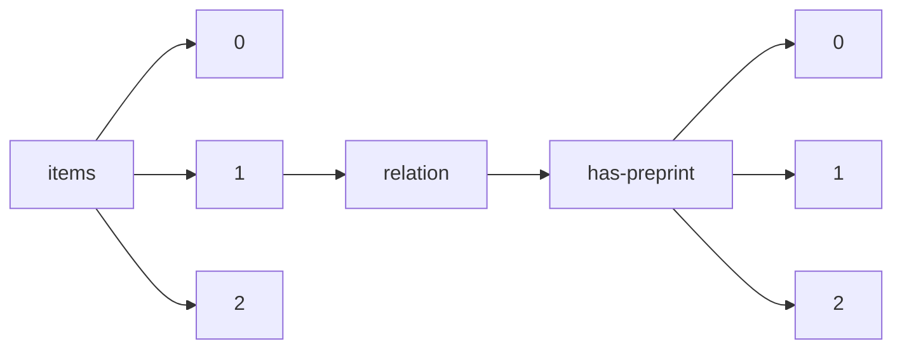

!!! warning "This document is not official Crossref documentation"
# Elements
PATH = items/array/relation/has-preprint/array(1)  
Occurs 156 676 times  
{ .annotate }

1. A route to an element, for example:  
   The route "items/array/relation/has-preprint/array" corresponds to navigating through the JSON indices as  
   ["items"][0]["relation"]["has-preprint"][0]  

## Asserted-by
See more information: [items/array/relation/has-preprint/array/asserted-by](asserted-by/index.md)  
Occurs 156 676 timess  
Unique values: 2  

| **Row** | **Value** `String` | **Count** `Int64` |
|--------:|----------------------:|---------------------:|
| **1**   | object                | 108 557              |
| **2**   | subject               | 48 119               |

## Id
See more information: [items/array/relation/has-preprint/array/id](id/index.md)  
Occurs 156 676 timess  
Unique values: > 999  

!!! note "Due to current limitations, only the first 1,000 unique values are counted."

| **Row** | **Value** `String`      | **Count** `Int64` |
|--------:|---------------------------:|---------------------:|
| **1**   | 10.47649/vau001            | 101                  |
| **2**   | 10.5194/tcd-7-5921-2013    | 4                    |
| **3**   | 10.5194/acpd-14-6361-2014  | 4                    |
| **4**   | 10.5194/bgd-10-12285-2013  | 4                    |
| **5**   | 10.5194/egusphere-2022-294 | 4                    |
| **6**   | 10.5194/cpd-2-1293-2006    | 4                    |
| **7**   | 10.5194/egusphere-2022-568 | 3                    |
| **8**   | 10.1101/2020.04.24.058958  | 3                    |
| **9**   | 10.5194/egusphere-2022-491 | 3                    |
| **10**  | 10.5194/egusphere-2022-824 | 3                    |
| ... | ... | ... |

## Id-type
See more information: [items/array/relation/has-preprint/array/id-type](id-type/index.md)  
Occurs 156 676 timess  
Unique values: 5  

| **Row** | **Value** `String` | **Count** `Int64` |
|--------:|----------------------:|---------------------:|
| **1**   | doi                   | 155 214              |
| **2**   | arxiv                 | 1 034                |
| **3**   | uri                   | 424                  |
| **4**   | issn                  | 3                    |
| **5**   | other                 | 1                    |

