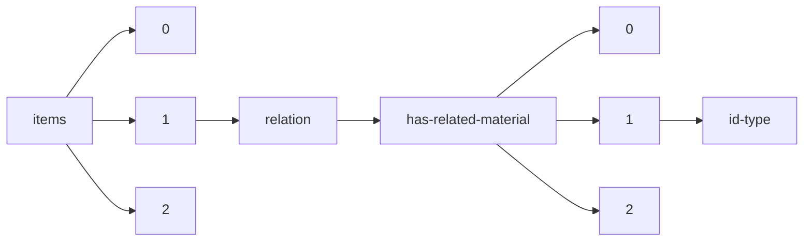

!!! warning "This document is not official Crossref documentation"
# Id-type
PATH = items/array/relation/has-related-material/array/id-type(1)  
Occurs 5 497 times  
Unique values: 4  
{ .annotate }

1. A route to an element, for example:  
   The route "items/array/relation/has-related-material/array/id-type" corresponds to navigating through the JSON indices as  
   ["items"][0]["relation"]["has-related-material"][0]["id-type"]  

| **Row** | **Value** `String` | **Count** `Int64` |
|--------:|----------------------:|---------------------:|
| **1**   | doi                   | 3 319                |
| **2**   | uri                   | 2 175                |
| **3**   | other                 | 2                    |
| **4**   | issn                  | 1                    |

