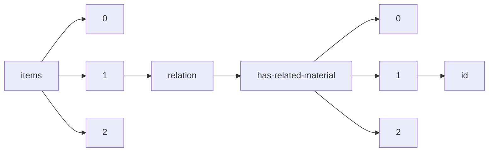

!!! warning "This document is not official Crossref documentation"
# Id
PATH = items/array/relation/has-related-material/array/id(1)  
Occurs 5 497 times  
Unique values: > 999  
{ .annotate }

1. A route to an element, for example:  
   The route "items/array/relation/has-related-material/array/id" corresponds to navigating through the JSON indices as  
   ["items"][0]["relation"]["has-related-material"][0]["id"]  

!!! note "Due to current limitations, only the first 1,000 unique values are counted."

| **Row** | **Value** `String`                                                   | **Count** `Int64` |
|--------:|------------------------------------------------------------------------:|---------------------:|
| **1**   |                                                                         | 361                  |
| **2**   | 10.26419/ppi.00099.001                                                  | 58                   |
| **3**   | 10.26419/ppi.00090.001                                                  | 23                   |
| **4**   | 10.26419/ppi.00073.000                                                  | 9                    |
| **5**   | 10.26419/ppi.00082.006                                                  | 8                    |
| **6**   | 10.26419/res.00471.001                                                  | 6                    |
| **7**   | 10.26419/res.00539.009                                                  | 2                    |
| **8**   | 10.26419/res.00581.007                                                  | 2                    |
| **9**   | https://cults3d.com/en/3d-model/various/surgical-mask-strap-remix-short | 2                    |
| **10**  | 10.5281/zenodo.1242619                                                  | 2                    |
| **11**  | 10.5281/zenodo.6375532                                                  | 2                    |
| **12**  | 10.26419/ppi.00081.001                                                  | 2                    |
| **13**  | 10.26419/res.00446.004                                                  | 2                    |
| **14**  | 10.5281/zenodo.891621                                                   | 2                    |
| **15**  | 10.26419/res.00399.002                                                  | 1                    |
| **16**  | https://sciety.org/articles/activity/10.1101/2021.03.03.433714          | 1                    |
| **17**  | 10.5281/zenodo.5502329                                                  | 1                    |
| **18**  | 10.5281/zenodo.3822424                                                  | 1                    |
| **19**  | 10.26419/int.00042.005                                                  | 1                    |
| **20**  | 10.26419/int.00052.060                                                  | 1                    |
| **21**  | 10.5281/zenodo.5463851                                                  | 1                    |
| **22**  | 10.5281/zenodo.6981055                                                  | 1                    |
| **23**  | https://sciety.org/articles/activity/10.1101/2021.06.09.447533          | 1                    |
| **24**  | 10.26419/res.00064.001                                                  | 1                    |
| **25**  | https://sciety.org/articles/activity/10.1101/2022.05.02.490367          | 1                    |
| **26**  | https://sciety.org/articles/activity/10.1101/2020.04.20.050146          | 1                    |
| **27**  | https://sciety.org/articles/activity/10.1101/2022.09.20.508672          | 1                    |
| **28**  | 10.26419/res.00055.018                                                  | 1                    |
| **29**  | 10.5281/zenodo.5715852                                                  | 1                    |
| **30**  | 10.5281/zenodo.7129948                                                  | 1                    |
| **31**  | https://sciety.org/articles/activity/10.1101/2020.12.28.424067          | 1                    |
| **32**  | 10.26419/res.00054.031                                                  | 1                    |
| **33**  | https://sciety.org/articles/activity/10.1101/2021.11.22.469550          | 1                    |
| **34**  | https://sciety.org/articles/activity/10.1101/2021.09.05.459045          | 1                    |
| **35**  | 10.26419/int.00052.028                                                  | 1                    |
| **36**  | 10.26419/res.00351.067                                                  | 1                    |
| **37**  | https://sciety.org/articles/activity/10.1101/2022.06.17.496598          | 1                    |
| **38**  | https://sciety.org/articles/activity/10.1101/2021.12.02.21267173        | 1                    |
| **39**  | 10.5281/zenodo.7646098                                                  | 1                    |
| **40**  | https://sciety.org/articles/activity/10.1101/2021.07.07.451497          | 1                    |
| **41**  | 10.26419/res.00346.004                                                  | 1                    |
| **42**  | https://sciety.org/articles/activity/10.1101/2022.06.22.497266          | 1                    |
| **43**  | 10.26419/res.00487.005                                                  | 1                    |
| **44**  | https://sciety.org/articles/activity/10.1101/2021.11.26.470085          | 1                    |
| **45**  | https://sciety.org/articles/activity/10.1101/2022.07.06.498988          | 1                    |
| **46**  | 10.26419/res.00524.180                                                  | 1                    |
| **47**  | 10.26419/ppi.00099.052                                                  | 1                    |
| **48**  | 10.26419/res.00505.009                                                  | 1                    |
| **49**  | 10.26419/res.00349.010                                                  | 1                    |
| **50**  | 10.26419/res.00493.008                                                  | 1                    |
| **51**  | 10.26419/pia.00094.003                                                  | 1                    |
| **52**  | https://sciety.org/articles/activity/10.1101/2021.11.29.470429          | 1                    |
| **53**  | https://sciety.org/articles/activity/10.1101/2021.09.24.461681          | 1                    |
| **54**  | 10.26419/res.00351.255                                                  | 1                    |
| **55**  | 10.26419/res.00461.002                                                  | 1                    |
| **56**  | 10.26419/res.00351.119                                                  | 1                    |
| **57**  | 10.26419/res.00351.009                                                  | 1                    |
| **58**  | https://sciety.org/articles/activity/10.1101/2021.12.03.471141          | 1                    |
| **59**  | https://sciety.org/articles/activity/10.1101/2022.05.20.491883          | 1                    |
| **60**  | 10.5281/Zenodo.2594638                                                  | 1                    |
| **61**  | https://sciety.org/articles/activity/10.1101/2022.03.22.485336          | 1                    |
| **62**  | 10.26419/res.00228.016                                                  | 1                    |
| **63**  | 10.26419/res.00146.002                                                  | 1                    |
| **64**  | 10.26419/res.00351.266                                                  | 1                    |
| **65**  | 10.26419/res.00514.067                                                  | 1                    |
| **66**  | 10.26419/res.00381.007                                                  | 1                    |
| **67**  | https://sciety.org/articles/activity/10.1101/2022.07.29.501983          | 1                    |
| **68**  | https://sciety.org/articles/activity/10.1101/2022.03.30.484633          | 1                    |
| **69**  | https://sciety.org/articles/10.1101/2020.12.17.423361                   | 1                    |
| **70**  | https://sciety.org/articles/activity/10.1101/2022.05.19.22275311        | 1                    |
| **71**  | https://sciety.org/articles/activity/10.1101/2021.10.07.463455          | 1                    |
| **72**  | 10.5281/zenodo.4485318                                                  | 1                    |
| **73**  | 10.26419/res.00132.047                                                  | 1                    |
| **74**  | https://sciety.org/articles/activity/10.1101/2021.11.21.469249          | 1                    |
| **75**  | 10.26419/res.00245.058                                                  | 1                    |
| **76**  | https://sciety.org/articles/activity/10.1101/2022.02.10.479856          | 1                    |
| **77**  | 10.26419/int.00052.019                                                  | 1                    |
| **78**  | https://sciety.org/articles/activity/10.1101/2022.05.17.492321          | 1                    |
| **79**  | 10.26419/res.00578.002                                                  | 1                    |
| **80**  | 10.26419/res.00246.002                                                  | 1                    |
| **81**  | 10.5281/zenodo.4607208                                                  | 1                    |
| **82**  | 10.26419/res.00259.034                                                  | 1                    |
| **83**  | 10.26419/res.00432.007                                                  | 1                    |
| **84**  | 10.26419/res.00401.025                                                  | 1                    |
| **85**  | 10.26419/res.00146.005                                                  | 1                    |
| **86**  | 10.26419/res.00351.253                                                  | 1                    |
| **87**  | https://sciety.org/articles/activity/10.1101/2021.10.12.464043          | 1                    |
| **88**  | 10.26419/res.00432.002                                                  | 1                    |
| **89**  | https://sciety.org/articles/activity/10.1101/2021.11.24.469914          | 1                    |
| **90**  | https://sciety.org/articles/activity/10.1101/2021.11.02.466870          | 1                    |
| **91**  | 10.26419/res.00254.012                                                  | 1                    |
| **92**  | 10.26419/res.00514.041                                                  | 1                    |
| **93**  | 10.5281/zenodo.6556154                                                  | 1                    |
| **94**  | https://sciety.org/articles/activity/10.1101/2021.12.03.21267269        | 1                    |
| **95**  | https://sciety.org/articles/activity/10.1101/2022.01.18.476717          | 1                    |
| **96**  | 10.26419/res.00239.002                                                  | 1                    |
| **97**  | 10.5281/zenodo.6577822                                                  | 1                    |
| **98**  | 10.26419/res.00524.146                                                  | 1                    |
| **99**  | 10.26419/ppi.00164.011                                                  | 1                    |
| **100** | 10.26419/int.00044.044                                                  | 1                    |
| **101** | 10.26419/res.00245.004                                                  | 1                    |
| **102** | 10.5281/zenodo.5896729                                                  | 1                    |
| **103** | 10.26419/res.00245.078                                                  | 1                    |
| **104** | 10.26419/res.00245.041                                                  | 1                    |
| **105** | 10.26419/res.00469.002                                                  | 1                    |
| **106** | https://sciety.org/articles/activity/10.1101/2021.02.28.433265          | 1                    |
| **107** | 10.26419/res.00524.138                                                  | 1                    |
| **108** | 10.26419/res.00524.109                                                  | 1                    |
| **109** | 10.26419/res.00524.102                                                  | 1                    |
| **110** | 10.5281/zenodo.1493261                                                  | 1                    |
| **111** | https://sciety.org/articles/activity/10.1101/2022.02.15.480488          | 1                    |
| **112** | https://sciety.org/articles/activity/10.1101/2022.05.17.492308          | 1                    |
| **113** | https://sciety.org/articles/activity/10.1101/2022.09.26.509532          | 1                    |
| **114** | https://sciety.org/articles/activity/10.1101/2022.09.01.502964          | 1                    |
| **115** | 10.5281/zenodo.5778954                                                  | 1                    |
| **116** | 10.26419/res.00259.093                                                  | 1                    |
| **117** | 10.26419/res.00381.002                                                  | 1                    |
| **118** | https://sciety.org/articles/activity/10.1101/2022.05.19.492758          | 1                    |
| **119** | https://sciety.org/articles/activity/10.1101/2021.08.24.457524          | 1                    |
| **120** | 10.26419/res.00476.003                                                  | 1                    |
| **121** | https://sciety.org/articles/activity/10.1101/2021.06.09.447807          | 1                    |
| **122** | https://sciety.org/articles/activity/10.1101/2022.09.05.506603          | 1                    |
| **123** | 10.26419/res.00550.006                                                  | 1                    |
| **124** | https://sciety.org/articles/activity/10.1101/2022.05.23.493056          | 1                    |
| **125** | 10.26419/res.00351.469                                                  | 1                    |
| **126** | 10.26419/pia.00101.005                                                  | 1                    |
| **127** | 10.26419/ppi.00165.034                                                  | 1                    |
| **128** | 10.5281/zenodo.7509141                                                  | 1                    |
| **129** | 10.5281/zenodo.7143919                                                  | 1                    |
| **130** | https://sciety.org/articles/activity/10.1101/2022.01.29.478317          | 1                    |
| **131** | 10.26419/res.00572.043                                                  | 1                    |
| **132** | 10.5281/zenodo.3977560                                                  | 1                    |
| **133** | 10.5281/zenodo.1312209                                                  | 1                    |
| **134** | https://sciety.org/articles/activity/10.1101/2021.12.22.21268006        | 1                    |
| **135** | https://sciety.org/articles/activity/10.1101/2022.02.08.479530          | 1                    |
| **136** | https://sciety.org/articles/activity/10.1101/2021.10.29.466469          | 1                    |
| **137** | 10.26419/res.00133.012                                                  | 1                    |
| **138** | https://sciety.org/articles/activity/10.1101/2021.10.05.463155          | 1                    |
| **139** | 10.26419/res.00351.347                                                  | 1                    |
| **140** | 10.5281/zenodo.7509528                                                  | 1                    |
| **141** | 10.26419/int.00042.003                                                  | 1                    |
| **142** | 10.26419/res.00340.002                                                  | 1                    |
| **143** | https://sciety.org/articles/activity/10.1101/2022.04.27.489692          | 1                    |
| **144** | https://sciety.org/articles/activity/10.1101/2020.08.22.262568          | 1                    |
| **145** | 10.5281/zenodo.4700297                                                  | 1                    |
| **146** | https://sciety.org/articles/activity/10.1101/2022.06.17.496561          | 1                    |
| **147** | https://sciety.org/articles/activity/10.1101/2021.07.14.452386          | 1                    |
| **148** | https://sciety.org/articles/activity/10.1101/2022.08.15.501844          | 1                    |
| **149** | https://sciety.org/articles/activity/10.1101/2022.05.10.22274883        | 1                    |
| **150** | https://sciety.org/articles/activity/10.1101/2022.06.02.491151          | 1                    |
| **151** | 10.26419/ppi.00099.054                                                  | 1                    |
| **152** | 10.26419/res.00572.052                                                  | 1                    |
| **153** | 10.5281/zenodo.6085386                                                  | 1                    |
| **154** | 10.26419/pia.00105.001                                                  | 1                    |
| **155** | 10.5281/zenodo.1485164                                                  | 1                    |
| **156** | 10.26419/res.00515.005                                                  | 1                    |
| **157** | https://sciety.org/articles/activity/10.1101/2022.03.15.484434          | 1                    |
| **158** | https://sciety.org/articles/activity/10.1101/2022.01.27.478049          | 1                    |
| **159** | https://sciety.org/articles/activity/10.1101/2021.06.01.446584          | 1                    |
| **160** | https://sciety.org/articles/activity/10.1101/2022.06.21.497035          | 1                    |
| **161** | https://sciety.org/articles/activity/10.1101/2022.07.18.500452          | 1                    |
| **162** | 10.26419/res.00524.148                                                  | 1                    |
| **163** | https://sciety.org/articles/activity/10.1101/2022.04.25.489459          | 1                    |
| **164** | 10.26419/res.00579.003                                                  | 1                    |
| **165** | https://sciety.org/articles/activity/10.1101/2022.07.25.501348          | 1                    |
| **166** | 10.26419/res.00295.004                                                  | 1                    |
| **167** | https://sciety.org/articles/activity/10.1101/2022.05.16.492077          | 1                    |
| **168** | 10.5281/zenodo.4216311                                                  | 1                    |
| **169** | https://sciety.org/articles/activity/10.1101/2022.11.01.514700          | 1                    |
| **170** | 10.26419/ppi.00103.015                                                  | 1                    |
| **171** | https://sciety.org/articles/activity/10.1101/2020.06.30.180448          | 1                    |
| **172** | https://sciety.org/articles/activity/10.1101/2021.08.05.455213          | 1                    |
| **173** | https://sciety.org/articles/activity/10.1101/2022.06.14.496061          | 1                    |
| **174** | https://sciety.org/articles/activity/10.1101/2021.09.09.459638          | 1                    |
| **175** | 10.26419-2Fres.00561.002                                                | 1                    |
| **176** | 10.26419/pia.00001.008                                                  | 1                    |
| **177** | https://sciety.org/articles/activity/10.1101/2021.03.22.436471          | 1                    |
| **178** | https://sciety.org/articles/activity/10.1101/2021.11.03.467146          | 1                    |
| **179** | 10.26419/res.00351.082                                                  | 1                    |
| **180** | 10.26419/res.00143.002                                                  | 1                    |
| **181** | 10.26419/res.00232.002                                                  | 1                    |
| **182** | 10.5281/zenodo.3934439                                                  | 1                    |
| **183** | https://sciety.org/articles/activity/10.1101/2022.03.10.483745          | 1                    |
| **184** | https://sciety.org/articles/activity/10.1101/2022.07.15.500158          | 1                    |
| **185** | 10.5281/zenodo.7262759                                                  | 1                    |
| **186** | 10.26419/res.00082.002                                                  | 1                    |
| **187** | 10.5281/zenodo.3976934                                                  | 1                    |
| **188** | 10.26419/res.00132.011                                                  | 1                    |
| **189** | 10.26419/res.00138.002                                                  | 1                    |
| **190** | 10.26419/ppi.00099.020                                                  | 1                    |
| **191** | 10.18260/1-2--34706                                                     | 1                    |
| **192** | https://sciety.org/articles/activity/10.1101/2021.11.11.468193          | 1                    |
| **193** | 10.26419/res.00277.003                                                  | 1                    |
| **194** | https://sciety.org/articles/activity/10.1101/2022.02.02.478877          | 1                    |
| **195** | https://sciety.org/articles/activity/10.1101/2021.11.10.468058          | 1                    |
| **196** | 10.26419/int.00052.005                                                  | 1                    |
| **197** | https://sciety.org/articles/activity/10.1101/2021.07.15.452506          | 1                    |
| **198** | 10.26419/res.00572.045                                                  | 1                    |
| **199** | 10.26419/pia.00101.006                                                  | 1                    |
| **200** | https://sciety.org/articles/activity/10.1101/2021.01.26.428209          | 1                    |
| **201** | 10.5281/zenodo.6717679                                                  | 1                    |
| **202** | 10.5281/zenodo.3988767                                                  | 1                    |
| **203** | 10.26419/res.00459.001                                                  | 1                    |
| **204** | https://sciety.org/articles/activity/10.1101/2022.03.30.486293          | 1                    |
| **205** | https://sciety.org/articles/activity/10.1101/2022.02.18.481095          | 1                    |
| **206** | https://sciety.org/articles/activity/10.1101/2022.08.29.505645          | 1                    |
| **207** | 10.5281/zenodo.3613419                                                  | 1                    |
| **208** | 10.5281/zenodo.2653464                                                  | 1                    |
| **209** | https://sciety.org/articles/activity/10.1101/2022.10.19.512845          | 1                    |
| **210** | https://sciety.org/articles/activity/10.1101/2021.04.13.439699          | 1                    |
| **211** | 10.5281/zenodo.3966222                                                  | 1                    |
| **212** | 10.26419/res.00162.004                                                  | 1                    |
| **213** | https://sciety.org/articles/activity/10.1101/2021.12.29.474428          | 1                    |
| **214** | https://sciety.org/articles/activity/10.1101/2022.01.13.476277          | 1                    |
| **215** | 10.26419/ppi.00090.019                                                  | 1                    |
| **216** | 10.5281/zenodo.7296552                                                  | 1                    |
| **217** | 10.26419/res.00298.002                                                  | 1                    |
| **218** | 10.5281/zenodo.580150                                                   | 1                    |
| **219** | https://sciety.org/articles/activity/10.1101/2020.12.29.424773          | 1                    |
| **220** | https://sciety.org/articles/activity/10.1101/2022.06.14.22276385        | 1                    |
| **221** | https://sciety.org/articles/activity/10.1101/2021.12.05.471286          | 1                    |
| **222** | 10.26419/res.00289.019                                                  | 1                    |
| **223** | 10.26419/res.00414.009                                                  | 1                    |
| **224** | 10.26419/res.00254.029                                                  | 1                    |
| **225** | 10.26419/res.00337.002                                                  | 1                    |
| **226** | https://sciety.org/articles/activity/10.1101/2021.02.17.431714          | 1                    |
| **227** | 10.26419/res.00480.002                                                  | 1                    |
| **228** | 10.26419/res.00584.006                                                  | 1                    |
| **229** | https://sciety.org/articles/activity/10.1101/2021.10.24.465614          | 1                    |
| **230** | https://sciety.org/articles/activity/10.1101/2022.03.30.486436          | 1                    |
| **231** | https://sciety.org/articles/activity/10.1101/2021.08.27.457984          | 1                    |
| **232** | https://sciety.org/articles/activity/10.1101/2021.11.05.467492          | 1                    |
| **233** | https://sciety.org/articles/activity/10.1101/2022.02.17.480931          | 1                    |
| **234** | https://sciety.org/articles/activity/10.1101/2022.08.05.502934          | 1                    |
| **235** | https://sciety.org/articles/activity/10.1101/2022.03.30.486419          | 1                    |
| **236** | 10.26419/res.00328.005                                                  | 1                    |
| **237** | 10.26419/res.00524.051                                                  | 1                    |
| **238** | 10.26419/res.00279.004                                                  | 1                    |
| **239** | 10.26419/ppi.00164.005                                                  | 1                    |
| **240** | 10.26419/pia.00101.012                                                  | 1                    |
| **241** | 10.5281/zenodo.1214176                                                  | 1                    |
| **242** | 10.5281/zenodo.3613373                                                  | 1                    |
| **243** | https://sciety.org/articles/activity/10.1101/2021.09.19.460995          | 1                    |
| **244** | 10.5281/zenodo.1481300                                                  | 1                    |
| **245** | 10.5281/zenodo.6501978                                                  | 1                    |
| **246** | 10.26419/res.00351.354                                                  | 1                    |
| **247** | https://sciety.org/articles/activity/10.1101/2021.08.16.456545          | 1                    |
| **248** | 10.26419/res.00055.030                                                  | 1                    |
| **249** | 10.26419/res.00351.272                                                  | 1                    |
| **250** | 10.26419/res.00054.030                                                  | 1                    |
| **251** | 10.5281/zenodo.887923                                                   | 1                    |
| **252** | 10.26419/res.00259.061                                                  | 1                    |
| **253** | 10.5281/zenodo.6479171                                                  | 1                    |
| **254** | 10.26419/res.00254.013                                                  | 1                    |
| **255** | https://sciety.org/articles/activity/10.1101/2022.04.23.489276          | 1                    |
| **256** | 10.26419/res.00062.007                                                  | 1                    |
| **257** | https://sciety.org/articles/activity/10.1101/2022.03.18.484650          | 1                    |
| **258** | 10.26419/res.00055.052                                                  | 1                    |
| **259** | 10.26419/int.00052.078                                                  | 1                    |
| **260** | https://sciety.org/articles/activity/10.1101/2022.02.08.479571          | 1                    |
| **261** | 10.26419/int.00044.003                                                  | 1                    |
| **262** | 10.26419/res.00265.006                                                  | 1                    |
| **263** | 10.5281/zenodo.3466131                                                  | 1                    |
| **264** | https://sciety.org/articles/activity/10.1101/2022.07.13.499955          | 1                    |
| **265** | 10.26419/ppi.00082.003                                                  | 1                    |
| **266** | https://sciety.org/articles/activity/10.1101/2022.06.08.495285          | 1                    |
| **267** | https://sciety.org/articles/activity/10.1101/2021.08.19.456941          | 1                    |
| **268** | 10.26419/res.00055.008                                                  | 1                    |
| **269** | https://sciety.org/articles/activity/10.1101/2022.04.05.487177          | 1                    |
| **270** | https://sciety.org/articles/activity/10.1101/2022.04.03.486893          | 1                    |
| **271** | https://sciety.org/articles/activity/10.1101/2022.02.09.479782          | 1                    |
| **272** | https://sciety.org/articles/activity/10.1101/2022.10.24.511151          | 1                    |
| **273** | https://sciety.org/articles/activity/10.1101/2021.09.09.21263335        | 1                    |
| **274** | https://sciety.org/articles/activity/10.1101/2022.03.01.482443          | 1                    |
| **275** | 10.26419/res.00570.004                                                  | 1                    |
| **276** | 10.26419/res.00254.049                                                  | 1                    |
| **277** | 10.26419/pia.00106.002                                                  | 1                    |
| **278** | 10.26419/ppi.00082.005                                                  | 1                    |
| **279** | https://sciety.org/articles/activity/10.1101/2022.03.15.484461          | 1                    |
| **280** | 10.26419/res.00351.053                                                  | 1                    |
| **281** | https://sciety.org/articles/activity/10.1101/2022.01.04.474960          | 1                    |
| **282** | https://sciety.org/articles/activity/10.1101/2022.07.28.501837          | 1                    |
| **283** | https://sciety.org/articles/activity/10.1101/2021.10.11.463966          | 1                    |
| **284** | 10.26419/res.00103.007                                                  | 1                    |
| **285** | 10.26419/pia.00106.007                                                  | 1                    |
| **286** | 10.5281/zenodo.2538228                                                  | 1                    |
| **287** | 10.26419/res.00217.003                                                  | 1                    |
| **288** | 10.26419/res.00496.003                                                  | 1                    |
| **289** | 10.26419/res.00343.003                                                  | 1                    |
| **290** | 10.26419/res.00319.002                                                  | 1                    |
| **291** | 10.5281/zenodo.3997430                                                  | 1                    |
| **292** | https://sciety.org/articles/activity/10.1101/2022.05.12.491625          | 1                    |
| **293** | https://sciety.org/articles/activity/10.1101/2021.07.03.450698          | 1                    |
| **294** | 10.26419/res.00265.004                                                  | 1                    |
| **295** | 10.26419/res.00304.003                                                  | 1                    |
| **296** | 10.26419/res.00086.001                                                  | 1                    |
| **297** | 10.26419/res.00509.003                                                  | 1                    |
| **298** | 10.26419/res.00351.350                                                  | 1                    |
| **299** | https://sciety.org/articles/activity/10.1101/2021.09.28.462095          | 1                    |
| **300** | 10.26419/res.00367.011                                                  | 1                    |
| **301** | 10.26419/res.00487.008                                                  | 1                    |
| **302** | 10.26419/res.00368.002                                                  | 1                    |
| **303** | 10.5281/zenodo.7696630                                                  | 1                    |
| **304** | 10.5281/zenodo.3613377                                                  | 1                    |
| **305** | 10.5281/zenodo.7504200                                                  | 1                    |
| **306** | 10.26419/res.00259.051                                                  | 1                    |
| **307** | 10.5281/zenodo.7438357                                                  | 1                    |
| **308** | 10.26419/res.00430.002                                                  | 1                    |
| **309** | 10.26419/res.00550.001                                                  | 1                    |
| **310** | 10.26419/res.00092.002                                                  | 1                    |
| **311** | https://sciety.org/articles/activity/10.1101/2022.03.08.483496          | 1                    |
| **312** | 10.26419/res.00524.070                                                  | 1                    |
| **313** | 10.26419/res.00351.036                                                  | 1                    |
| **314** | https://sciety.org/articles/activity/10.1101/2021.09.24.461725          | 1                    |
| **315** | 10.26419/res.00261.003                                                  | 1                    |
| **316** | https://sciety.org/articles/activity/10.1101/2022.02.09.477148          | 1                    |
| **317** | 10.26419/res.00367.016                                                  | 1                    |
| **318** | 10.26419/pia.00099.003                                                  | 1                    |
| **319** | 10.5281/zenodo.7178352                                                  | 1                    |
| **320** | 10.26419/res.00524.010                                                  | 1                    |
| **321** | https://sciety.org/articles/activity/10.1101/2022.03.14.484239          | 1                    |
| **322** | 10.26419/res.00228.040                                                  | 1                    |
| **323** | 10.5281/zenodo.4554589                                                  | 1                    |
| **324** | https://sciety.org/articles/activity/10.1101/2022.10.10.510128          | 1                    |
| **325** | 10.5281/zenodo.6349848                                                  | 1                    |
| **326** | 10.26419/res.00550.025                                                  | 1                    |
| **327** | 10.26419/res.00259.053                                                  | 1                    |
| **328** | https://sciety.org/articles/activity/10.1101/2022.06.27.497828          | 1                    |
| **329** | 10.26419/res.00351.451                                                  | 1                    |
| **330** | 10.5281/zenodo.7607567                                                  | 1                    |
| **331** | https://sciety.org/articles/activity/10.1101/2022.01.24.22269736        | 1                    |
| **332** | https://sciety.org/articles/activity/10.1101/2022.01.22.477332          | 1                    |
| **333** | 10.26419/int.00052.043                                                  | 1                    |
| **334** | 10.26419/res.00349.013                                                  | 1                    |
| **335** | 10.26419/res.00524.074                                                  | 1                    |
| **336** | 10.26419/int.00052.027                                                  | 1                    |
| **337** | 10.26419/res.00351.086                                                  | 1                    |
| **338** | https://sciety.org/articles/activity/10.1101/2021.11.24.469935          | 1                    |
| **339** | 10.26419/res.00505.007                                                  | 1                    |
| **340** | https://sciety.org/articles/activity/10.1101/2022.01.13.22269257        | 1                    |
| **341** | https://sciety.org/articles/activity/10.1101/2021.09.24.461712          | 1                    |
| **342** | https://sciety.org/articles/activity/10.1101/2021.08.24.457491          | 1                    |
| **343** | 10.26419/res.00461.003                                                  | 1                    |
| **344** | 10.26419/res.00401.011                                                  | 1                    |
| **345** | 10.26419/res.00535.002                                                  | 1                    |
| **346** | 10.26419/res.00553.003                                                  | 1                    |
| **347** | https://sciety.org/articles/activity/10.1101/2021.04.29.441834          | 1                    |
| **348** | https://sciety.org/articles/activity/10.1101/2021.12.01.470738          | 1                    |
| **349** | https://sciety.org/articles/activity/10.1101/2022.03.16.484644          | 1                    |
| **350** | 10.26419/res.00351.267                                                  | 1                    |
| **351** | 10.26419/int.00044.051                                                  | 1                    |
| **352** | https://sciety.org/articles/activity/10.1101/2021.10.03.462942          | 1                    |
| **353** | 10.5281/zenodo.1323714                                                  | 1                    |
| **354** | 10.26419/res.00351.329                                                  | 1                    |
| **355** | https://sciety.org/articles/activity/10.1101/2021.11.18.468628          | 1                    |
| **356** | 10.5281/zenodo.7327584                                                  | 1                    |
| **357** | https://sciety.org/articles/activity/10.1101/2021.08.10.455885          | 1                    |
| **358** | 10.26419/res.00365.004                                                  | 1                    |
| **359** | 10.26419/res.00119.007                                                  | 1                    |
| **360** | 10.26419/res.00473.002                                                  | 1                    |
| **361** | 10.26419/res.00351.218                                                  | 1                    |
| **362** | 10.5281/zenodo.3862791                                                  | 1                    |
| **363** | 10.26419/res.00351.091                                                  | 1                    |
| **364** | https://sciety.org/articles/activity/10.1101/2021.07.21.453231          | 1                    |
| **365** | 10.26419/pia.00001.011                                                  | 1                    |
| **366** | 10.26419/res.00351.346                                                  | 1                    |
| **367** | https://sciety.org/articles/activity/10.1101/2022.05.01.490188          | 1                    |
| **368** | 10.26419/res.00065.002                                                  | 1                    |
| **369** | https://sciety.org/articles/activity/10.1101/2022.04.27.489695          | 1                    |
| **370** | https://sciety.org/articles/activity/10.1101/2021.02.05.429919          | 1                    |
| **371** | https://sciety.org/articles/activity/10.1101/2022.06.06.494928          | 1                    |
| **372** | 10.26419/res.00351.229                                                  | 1                    |
| **373** | 10.26419/res.00351.333                                                  | 1                    |
| **374** | https://sciety.org/articles/activity/10.1101/2021.06.11.448100          | 1                    |
| **375** | 10.5281/zenodo.2594621                                                  | 1                    |
| **376** | 10.26419/res.00351.468                                                  | 1                    |
| **377** | 10.26419/res.00351.374                                                  | 1                    |
| **378** | 10.5281/zenodo.6463308                                                  | 1                    |
| **379** | https://sciety.org/articles/activity/10.1101/2021.10.21.465258          | 1                    |
| **380** | https://sciety.org/articles/activity/10.1101/2022.06.20.496907          | 1                    |
| **381** | 10.26419/int.00052.014                                                  | 1                    |
| **382** | 10.26419/res.00351.332                                                  | 1                    |
| **383** | 10.26419/res.00520.004                                                  | 1                    |
| **384** | 10.1017/S0003055415000040                                               | 1                    |
| **385** | 10.26419/res.00351.031                                                  | 1                    |
| **386** | 10.26419/res.00539.002                                                  | 1                    |
| **387** | 10.26419/int.00052.021                                                  | 1                    |
| **388** | https://sciety.org/articles/activity/10.1101/2021.04.13.439649          | 1                    |
| **389** | https://sciety.org/articles/activity/10.1101/2021.05.19.444783          | 1                    |
| **390** | 10.26419/res.00351.379                                                  | 1                    |
| **391** | https://sciety.org/articles/activity/10.1101/2021.02.24.432517          | 1                    |
| **392** | 10.5281/zenodo.7382887                                                  | 1                    |
| **393** | https://sciety.org/articles/activity/10.1101/2021.10.20.465082          | 1                    |
| **394** | 10.5281/zenodo.7274439                                                  | 1                    |
| **395** | https://sciety.org/articles/activity/10.1101/2022.04.12.488078          | 1                    |
| **396** | https://sciety.org/articles/activity/10.1101/2021.05.13.444039          | 1                    |
| **397** | 10.5281/zenodo.1211434                                                  | 1                    |
| **398** | 10.26419/res.00351.348                                                  | 1                    |
| **399** | 10.26419/res.00210.002                                                  | 1                    |
| **400** | 10.26419/res.00554.010                                                  | 1                    |
| **401** | https://sciety.org/articles/activity/10.1101/2022.04.04.487030          | 1                    |
| **402** | https://sciety.org/articles/activity/10.1101/2021.12.12.472090          | 1                    |
| **403** | https://sciety.org/articles/activity/10.1101/2020.11.03.367540          | 1                    |
| **404** | https://sciety.org/articles/activity/10.1101/2022.03.31.486585          | 1                    |
| **405** | https://sciety.org/articles/activity/10.1101/2021.12.31.474622          | 1                    |
| **406** | 10.26419/res.00351.294                                                  | 1                    |
| **407** | https://sciety.org/articles/activity/10.1101/2021.12.16.472988          | 1                    |
| **408** | https://sciety.org/articles/activity/10.1101/2022.03.03.482855          | 1                    |
| **409** | https://sciety.org/articles/activity/10.1101/2021.12.15.472789          | 1                    |
| **410** | https://sciety.org/articles/activity/10.1101/2022.03.28.486009          | 1                    |
| **411** | https://sciety.org/articles/activity/10.1101/2022.03.25.485785          | 1                    |
| **412** | https://sciety.org/articles/activity/10.1101/2022.08.12.503784          | 1                    |
| **413** | 10.26419/int.00052.070                                                  | 1                    |
| **414** | https://sciety.org/articles/activity/10.1101/2021.06.06.447254          | 1                    |
| **415** | https://sciety.org/articles/activity/10.1101/2021.10.26.465915          | 1                    |
| **416** | 10.26419/res.00112.003                                                  | 1                    |
| **417** | 10.26419/res.00351.250                                                  | 1                    |
| **418** | 10.26419/res.00351.303                                                  | 1                    |
| **419** | 10.26419/res.00365.003                                                  | 1                    |
| **420** | 10.26419/res.00351.338                                                  | 1                    |
| **421** | 10.26419/res.00351.311                                                  | 1                    |
| **422** | 10.5281/zenodo.573769                                                   | 1                    |
| **423** | 10.26419/res.00351.274                                                  | 1                    |
| **424** | https://sciety.org/articles/activity/10.1101/2022.04.11.487908          | 1                    |
| **425** | https://sciety.org/articles/activity/10.1101/2022.01.19.476887          | 1                    |
| **426** | https://sciety.org/articles/activity/10.1101/2020.12.01.407023          | 1                    |
| **427** | 10.26419/int.00052.035                                                  | 1                    |
| **428** | https://sciety.org/articles/activity/10.1101/2022.03.01.482471          | 1                    |
| **429** | 10.26419/res.00351.460                                                  | 1                    |
| **430** | https://sciety.org/articles/activity/10.1101/2022.08.03.502693          | 1                    |
| **431** | https://sciety.org/articles/activity/10.1101/2022.04.01.486686          | 1                    |
| **432** | https://sciety.org/articles/activity/10.1101/2021.11.12.468404          | 1                    |
| **433** | 10.26419/res.00539.010                                                  | 1                    |
| **434** | 10.26419/int.00052.037                                                  | 1                    |
| **435** | 10.26419/int.00052.069                                                  | 1                    |
| **436** | 10.5281/zenodo.1045417                                                  | 1                    |
| **437** | 10.26419/res.00351.140                                                  | 1                    |
| **438** | 10.5281/zenodo.7186370                                                  | 1                    |
| **439** | 10.5281/zenodo.5795592                                                  | 1                    |
| **440** | 10.26419/int.00052.013                                                  | 1                    |
| **441** | 10.26419/ppi.00103.021                                                  | 1                    |
| **442** | 10.26419/int.00052.065                                                  | 1                    |
| **443** | 10.26419/res.00119.005                                                  | 1                    |
| **444** | 10.5281/zenodo.1485219                                                  | 1                    |
| **445** | 10.26419/res.00539.005                                                  | 1                    |
| **446** | 10.26419/res.00351.284                                                  | 1                    |
| **447** | https://sciety.org/articles/activity/10.1101/2021.06.23.449598          | 1                    |
| **448** | https://sciety.org/articles/activity/10.1101/2022.10.24.513549          | 1                    |
| **449** | 10.26419/res.00346.002                                                  | 1                    |
| **450** | https://sciety.org/articles/activity/10.1101/2021.07.14.452321          | 1                    |
| **451** | 10.26419/res.00351.279                                                  | 1                    |
| **452** | 10.26419/res.00351.455                                                  | 1                    |
| **453** | 10.26419/res.00456.004                                                  | 1                    |
| **454** | https://sciety.org/articles/activity/10.1101/2021.03.09.433696          | 1                    |
| **455** | 10.5281/zenodo.5560269                                                  | 1                    |
| **456** | https://sciety.org/articles/activity/10.1101/2021.06.15.448562          | 1                    |
| **457** | https://sciety.org/articles/activity/10.1101/2021.12.10.472118          | 1                    |
| **458** | 10.5281/zenodo.6781577                                                  | 1                    |
| **459** | https://sciety.org/articles/activity/10.1101/2022.09.13.507807          | 1                    |
| **460** | https://sciety.org/articles/activity/10.1101/2022.03.07.483247          | 1                    |
| **461** | 10.26419/res.00351.368                                                  | 1                    |
| **462** | 10.26419/res.00351.129                                                  | 1                    |
| **463** | https://sciety.org/articles/activity/10.1101/2021.10.12.464082          | 1                    |
| **464** | 10.26419/res.00351.454                                                  | 1                    |
| **465** | 10.5281/zenodo.1254137                                                  | 1                    |
| **466** | 10.26419/res.00351.056                                                  | 1                    |
| **467** | 10.26419/res.00554.009                                                  | 1                    |
| **468** | 10.26419/pia.00001.004                                                  | 1                    |
| **469** | 10.26419/res.00177.004                                                  | 1                    |
| **470** | https://sciety.org/articles/activity/10.1101/2021.08.09.455666          | 1                    |
| **471** | 10.26419/res.00289.009                                                  | 1                    |
| **472** | 10.26419/res.00547.002                                                  | 1                    |
| **473** | 10.26419/res.00333.002                                                  | 1                    |
| **474** | 10.5281/zenodo.7438323                                                  | 1                    |
| **475** | 10.26419/int.00052.016                                                  | 1                    |
| **476** | https://sciety.org/articles/activity/10.1101/2021.09.07.459250          | 1                    |
| **477** | https://sciety.org/articles/activity/10.1101/2022.07.04.498659          | 1                    |
| **478** | 10.26419/res.00351.016                                                  | 1                    |
| **479** | https://sciety.org/articles/activity/10.1101/2022.06.01.494280          | 1                    |
| **480** | 10.26419/res.00235.002                                                  | 1                    |
| **481** | https://sciety.org/articles/activity/10.1101/2022.06.15.496340          | 1                    |
| **482** | 10.5281/zenodo.7066676                                                  | 1                    |
| **483** | https://sciety.org/articles/activity/10.1101/2022.03.16.484671          | 1                    |
| **484** | https://sciety.org/articles/activity/10.1101/2021.08.10.455713          | 1                    |
| **485** | 10.26419/int.00052.079                                                  | 1                    |
| **486** | 10.26419/int.00052.067                                                  | 1                    |
| **487** | https://sciety.org/articles/activity/10.1101/2022.04.14.22273724        | 1                    |
| **488** | 10.5281/zenodo.810347                                                   | 1                    |
| **489** | 10.26419/res.00553.009                                                  | 1                    |
| **490** | https://sciety.org/articles/activity/10.1101/2022.05.23.493120          | 1                    |
| **491** | https://sciety.org/articles/activity/10.1101/2021.10.18.464857          | 1                    |
| **492** | 10.5281/zenodo.5091613                                                  | 1                    |
| **493** | 10.26419/res.00351.051                                                  | 1                    |
| **494** | 10.26419/res.00351.245                                                  | 1                    |
| **495** | https://sciety.org/articles/activity/10.1101/2022.02.10.479959          | 1                    |
| **496** | 10.5281/zenodo.5526251                                                  | 1                    |
| **497** | https://sciety.org/articles/activity/10.1101/2021.11.03.467156          | 1                    |
| **498** | 10.5281/zenodo.6513296                                                  | 1                    |
| **499** | 10.26419/res.00389.002                                                  | 1                    |
| **500** | 10.26419/pia.00001.005                                                  | 1                    |
| **501** | 10.26419/res.00351.123                                                  | 1                    |
| **502** | 10.26419/ppi.00103.016                                                  | 1                    |
| **503** | 10.26419/ppi.00095.002                                                  | 1                    |
| **504** | 10.26419/res.00351.278                                                  | 1                    |
| **505** | 10.26419/res.00083.002                                                  | 1                    |
| **506** | 10.5281/zenodo.5855127                                                  | 1                    |
| **507** | https://sciety.org/articles/activity/10.1101/2021.11.09.467894          | 1                    |
| **508** | 10.5281/Zenodo.1404184                                                  | 1                    |
| **509** | 10.26419/res.00351.320                                                  | 1                    |
| **510** | 10.26419/res.00539.020                                                  | 1                    |
| **511** | https://sciety.org/articles/activity/10.1101/2021.12.10.472099          | 1                    |
| **512** | 10.26419/res.00080.003                                                  | 1                    |
| **513** | https://sciety.org/articles/activity/10.1101/2022.01.14.476317          | 1                    |
| **514** | 10.5281/Zenodo.5100377                                                  | 1                    |
| **515** | 10.26419/res.00539.022                                                  | 1                    |
| **516** | https://sciety.org/articles/activity/10.1101/2021.11.07.467645          | 1                    |
| **517** | 10.26419/res.00351.143                                                  | 1                    |
| **518** | 10.5281/zenodo.4772970                                                  | 1                    |
| **519** | https://sciety.org/articles/activity/10.1101/2021.09.13.460117          | 1                    |
| **520** | 10.26419/ppi.00103.012                                                  | 1                    |
| **521** | https://sciety.org/articles/activity/10.1101/2021.02.12.430975          | 1                    |
| **522** | 10.26419/res.00351.271                                                  | 1                    |
| **523** | 10.26419/res.00273.002                                                  | 1                    |
| **524** | 10.26419/res.00351.106                                                  | 1                    |
| **525** | https://sciety.org/articles/activity/10.1101/2022.07.05.498877          | 1                    |
| **526** | https://sciety.org/articles/activity/10.1101/2021.04.12.439526          | 1                    |
| **527** | 10.5281/zenodo.1248413                                                  | 1                    |
| **528** | https://sciety.org/articles/activity/10.1101/2022.05.04.490570          | 1                    |
| **529** | https://sciety.org/articles/activity/10.1101/2022.02.13.480280          | 1                    |
| **530** | 10.26419/res.00351.136                                                  | 1                    |
| **531** | 10.26419/res.00420.005                                                  | 1                    |
| **532** | https://sciety.org/articles/activity/10.1101/2019.12.12.874230          | 1                    |
| **533** | 10.26419/res.00351.263                                                  | 1                    |
| **534** | 10.26419/res.00119.003                                                  | 1                    |
| **535** | 10.26419/res.00464.002                                                  | 1                    |
| **536** | 10.26419/ppi.00103.010                                                  | 1                    |
| **537** | 10.26419/res.00375.002                                                  | 1                    |
| **538** | 10.26419/res.00351.232                                                  | 1                    |
| **539** | 10.26419/res.00364.006                                                  | 1                    |
| **540** | 10.5281/zenodo.7685295                                                  | 1                    |
| **541** | 10.26419/res.00460.006                                                  | 1                    |
| **542** | 10.26419/res.00351.020                                                  | 1                    |
| **543** | 10.26419/res.00420.004                                                  | 1                    |
| **544** | 10.26419/res.00351.102                                                  | 1                    |
| **545** | https://sciety.org/articles/activity/10.1101/2022.10.18.512721          | 1                    |
| **546** | 10.26419/int.00052.006                                                  | 1                    |
| **547** | 10.26419/res.00284.002                                                  | 1                    |
| **548** | https://sciety.org/articles/activity/10.1101/2022.03.15.484537          | 1                    |
| **549** | 10.26419/res.00351.330                                                  | 1                    |
| **550** | 10.26419/res.00351.223                                                  | 1                    |
| **551** | https://sciety.org/articles/activity/10.1101/2021.05.02.442353          | 1                    |
| **552** | 10.26419/res.00351.307                                                  | 1                    |
| **553** | 10.26419/pia.00014.002                                                  | 1                    |
| **554** | 10.26419/res.00351.217                                                  | 1                    |
| **555** | 10.26419/int.00052.068                                                  | 1                    |
| **556** | 10.26419/res.00351.342                                                  | 1                    |
| **557** | 10.5281/zenodo.6539702                                                  | 1                    |
| **558** | https://sciety.org/articles/activity/10.1101/2020.07.27.223354          | 1                    |
| **559** | 10.26419/res.00554.007                                                  | 1                    |
| **560** | 10.26419/res.00554.014                                                  | 1                    |
| **561** | https://sciety.org/articles/activity/10.1101/2022.04.08.487649          | 1                    |
| **562** | 10.5281/zenodo.2647796                                                  | 1                    |
| **563** | 10.5281/zenodo.1451490                                                  | 1                    |
| **564** | 10.26419/int.00052.044                                                  | 1                    |
| **565** | 10.26419/res.00383.005                                                  | 1                    |
| **566** | 10.26419/res.00574.002                                                  | 1                    |
| **567** | https://sciety.org/articles/activity/10.1101/2022.05.24.493232          | 1                    |
| **568** | 10.5281/zenodo.7626112                                                  | 1                    |
| **569** | https://sciety.org/articles/activity/10.1101/2021.08.09.455606          | 1                    |
| **570** | https://sciety.org/articles/activity/10.1101/2022.09.18.508441          | 1                    |
| **571** | 10.26419/int.00052.036                                                  | 1                    |
| **572** | 10.26419/res.00581.006                                                  | 1                    |
| **573** | https://sciety.org/articles/activity/10.1101/2022.01.25.477704          | 1                    |
| **574** | https://sciety.org/articles/activity/10.1101/2022.05.25.493453          | 1                    |
| **575** | https://sciety.org/articles/activity/10.1101/2022.05.08.490793          | 1                    |
| **576** | 10.26419/res.00581.008                                                  | 1                    |
| **577** | 10.26419/int.00052.011                                                  | 1                    |
| **578** | 10.26419/res.00351.310                                                  | 1                    |
| **579** | 10.26419/int.00052.004                                                  | 1                    |
| **580** | 10.26419/int.00052.017                                                  | 1                    |
| **581** | 10.26419/res.00119.004                                                  | 1                    |
| **582** | 10.26419/res.00420.010                                                  | 1                    |
| **583** | https://sciety.org/articles/activity/10.1101/2021.11.02.466912          | 1                    |
| **584** | 10.26419/ppi.00103.011                                                  | 1                    |
| **585** | 10.5281/zenodo.3248630                                                  | 1                    |
| **586** | 10.26419/res.00351.352                                                  | 1                    |
| **587** | https://sciety.org/articles/activity/10.1101/2021.11.23.468539          | 1                    |
| **588** | 10.26419/pia.00001.006                                                  | 1                    |
| **589** | https://sciety.org/articles/activity/10.1101/2022.07.22.501123          | 1                    |
| **590** | 10.26419/res.00425.002                                                  | 1                    |
| **591** | 10.26419/res.00351.291                                                  | 1                    |
| **592** | https://sciety.org/articles/activity/10.1101/2021.10.06.463436          | 1                    |
| **593** | 10.5281/zenodo.5234600                                                  | 1                    |
| **594** | 10.26419/res.00351.117                                                  | 1                    |
| **595** | https://sciety.org/articles/activity/10.1101/2019.12.29.890319          | 1                    |
| **596** | https://sciety.org/articles/activity/10.1101/2022.05.19.492681          | 1                    |
| **597** | 10.26419/int.00052.048                                                  | 1                    |
| **598** | 10.5281/zenodo.7382929                                                  | 1                    |
| **599** | https://sciety.org/articles/activity/10.1101/2022.04.14.488295          | 1                    |
| **600** | 10.26419/res.00121.002                                                  | 1                    |
| **601** | 10.26419/res.00351.334                                                  | 1                    |
| **602** | https://sciety.org/articles/activity/10.1101/2021.12.02.470901          | 1                    |
| **603** | 10.5281/zenodo.4496828                                                  | 1                    |
| **604** | 10.26419/int.00052.050                                                  | 1                    |
| **605** | https://sciety.org/articles/activity/10.1101/2022.03.09.483618          | 1                    |
| **606** | https://sciety.org/articles/activity/10.1101/2022.02.22.481465          | 1                    |
| **607** | 10.5281/zenodo.6963752                                                  | 1                    |
| **608** | 10.26419/res.00351.337                                                  | 1                    |
| **609** | https://sciety.org/articles/activity/10.1101/2022.06.26.496535          | 1                    |
| **610** | https://sciety.org/articles/activity/10.1101/2022.04.27.489754          | 1                    |
| **611** | https://sciety.org/articles/activity/10.1101/2021.11.10.468056          | 1                    |
| **612** | https://sciety.org/articles/activity/10.1101/2021.04.22.440896          | 1                    |
| **613** | 10.5281/zenodo.3761723                                                  | 1                    |
| **614** | https://sciety.org/articles/activity/10.1101/2022.10.24.513522          | 1                    |
| **615** | 10.5281/zenodo.1053578                                                  | 1                    |
| **616** | 10.26419/ppi.00090.013                                                  | 1                    |
| **617** | 10.26419/int.00052.066                                                  | 1                    |
| **618** | 10.5281/zenodo.7582988                                                  | 1                    |
| **619** | 10.26419/res.00351.130                                                  | 1                    |
| **620** | 10.26419/res.00351.095                                                  | 1                    |
| **621** | 10.26419/res.00382.002                                                  | 1                    |
| **622** | https://sciety.org/articles/activity/10.1101/2022.03.31.22273222        | 1                    |
| **623** | https://sciety.org/articles/activity/10.1101/2022.02.21.481263          | 1                    |
| **624** | 10.26419/res.00383.007                                                  | 1                    |
| **625** | 10.5281/zenodo.7112375                                                  | 1                    |
| **626** | 10.5281/zenodo.4544394                                                  | 1                    |
| **627** | 10.26419/res.00277.008                                                  | 1                    |
| **628** | https://sciety.org/articles/activity/10.1101/2022.07.21.501025          | 1                    |
| **629** | https://sciety.org/articles/activity/10.1101/2021.11.19.469261          | 1                    |
| **630** | 10.26419/res.00283.002                                                  | 1                    |
| **631** | https://sciety.org/articles/activity/10.1101/2021.09.28.462183          | 1                    |
| **632** | 10.26419/res.00524.042                                                  | 1                    |
| **633** | https://sciety.org/articles/activity/10.1101/2021.12.21.473652          | 1                    |
| **634** | 10.5281/zenodo.1189056                                                  | 1                    |
| **635** | 10.26419/res.00166.002                                                  | 1                    |
| **636** | 10.26419/res.00351.043                                                  | 1                    |
| **637** | 10.26419/res.00331.002                                                  | 1                    |
| **638** | 10.26419/ppi.00164.028                                                  | 1                    |
| **639** | https://sciety.org/articles/activity/10.1101/2021.12.18.473332          | 1                    |
| **640** | 10.26419/res.00553.006                                                  | 1                    |
| **641** | 10.26419/res.00328.004                                                  | 1                    |
| **642** | 10.26419/res.00524.093                                                  | 1                    |
| **643** | 10.26419/pia.00094.007                                                  | 1                    |
| **644** | https://sciety.org/articles/activity/10.1101/2021.10.27.466082          | 1                    |
| **645** | https://sciety.org/articles/activity/10.1101/2022.08.14.503889          | 1                    |
| **646** | 10.26419/ppi.00164.024                                                  | 1                    |
| **647** | 10.26419/ppi.00165.041                                                  | 1                    |
| **648** | 10.5281/zenodo.4065739                                                  | 1                    |
| **649** | 10.26419/ppi.00165.012                                                  | 1                    |
| **650** | 10.26419/res.00572.023                                                  | 1                    |
| **651** | https://sciety.org/articles/activity/10.1101/2022.03.15.484462          | 1                    |
| **652** | 10.26419/res.00390.003                                                  | 1                    |
| **653** | 10.26419/ppi.00099.056                                                  | 1                    |
| **654** | 10.26419/res.00091.004                                                  | 1                    |
| **655** | https://sciety.org/articles/activity/10.1101/2021.12.02.470975          | 1                    |
| **656** | https://sciety.org/articles/activity/10.1101/2021.12.17.473193          | 1                    |
| **657** | 10.26419/res.00463.003                                                  | 1                    |
| **658** | https://sciety.org/articles/activity/10.1101/2020.04.27.20080804        | 1                    |
| **659** | https://sciety.org/articles/activity/10.1101/2022.05.16.492068          | 1                    |
| **660** | https://sciety.org/articles/activity/10.1101/2022.03.03.482857          | 1                    |
| **661** | 10.26419/int.00044.033                                                  | 1                    |
| **662** | https://sciety.org/articles/activity/10.1101/2021.10.03.462935          | 1                    |
| **663** | 10.26419/res.00468.002                                                  | 1                    |
| **664** | 10.26419/res.00351.035                                                  | 1                    |
| **665** | 10.5281/zenodo.810343                                                   | 1                    |
| **666** | https://sciety.org/articles/activity/10.1101/2022.06.01.494351          | 1                    |
| **667** | 10.26419/res.00309.002                                                  | 1                    |
| **668** | 10.26419/res.00249.006                                                  | 1                    |
| **669** | 10.26419/res.00401.027                                                  | 1                    |
| **670** | 10.26419/res.00401.007                                                  | 1                    |
| **671** | https://sciety.org/articles/activity/10.1101/2021.01.28.428480          | 1                    |
| **672** | 10.26419/res.00136.002                                                  | 1                    |
| **673** | https://sciety.org/articles/activity/10.1101/2021.07.07.451307          | 1                    |
| **674** | https://sciety.org/articles/activity/10.1101/2021.03.18.435979          | 1                    |
| **675** | 10.26419/res.00133.008                                                  | 1                    |
| **676** | 10.26419/res.00524.153                                                  | 1                    |
| **677** | https://sciety.org/articles/activity/10.1101/2022.08.31.505994          | 1                    |
| **678** | https://sciety.org/articles/activity/10.1101/2022.05.14.491958          | 1                    |
| **679** | 10.26419/res.00524.127                                                  | 1                    |
| **680** | https://sciety.org/articles/activity/10.1101/2021.10.25.465732          | 1                    |
| **681** | https://sciety.org/articles/activity/10.1101/2021.11.08.21266020        | 1                    |
| **682** | https://sciety.org/articles/activity/10.1101/2021.04.09.439048          | 1                    |
| **683** | https://sciety.org/articles/activity/10.1101/2021.11.12.21266270        | 1                    |
| **684** | https://sciety.org/articles/activity/10.1101/2022.04.10.487797          | 1                    |
| **685** | https://sciety.org/articles/activity/10.1101/2022.06.27.497721          | 1                    |
| **686** | https://sciety.org/articles/activity/10.1101/2022.01.24.477290          | 1                    |
| **687** | 10.26419/res.00351.365                                                  | 1                    |
| **688** | https://sciety.org/articles/activity/10.1101/2022.05.14.491627          | 1                    |
| **689** | https://sciety.org/articles/activity/10.1101/2022.06.01.494335          | 1                    |
| **690** | 10.26419/res.00351.220                                                  | 1                    |
| **691** | 10.26419/res.00473.003                                                  | 1                    |
| **692** | 10.26419/res.00055.054                                                  | 1                    |
| **693** | https://sciety.org/articles/activity/10.1101/2021.09.15.21263636        | 1                    |
| **694** | 10.26419/res.00351.264                                                  | 1                    |
| **695** | 10.5281/zenodo.7438254                                                  | 1                    |
| **696** | 10.26419/res.00246.004                                                  | 1                    |
| **697** | https://sciety.org/articles/activity/10.1101/2021.03.20.436273          | 1                    |
| **698** | https://sciety.org/articles/activity/10.1101/2021.07.26.453786          | 1                    |
| **699** | 10.26419/res.00113.002                                                  | 1                    |
| **700** | 10.26419/res.00055.022                                                  | 1                    |
| **701** | 10.5281/zenodo.5727627                                                  | 1                    |
| **702** | 10.26419/res.00524.150                                                  | 1                    |
| **703** | https://sciety.org/articles/activity/10.1101/2021.10.07.463105          | 1                    |
| **704** | 10.26419/res.00351.076                                                  | 1                    |
| **705** | 10.5281/zenodo.6595036                                                  | 1                    |
| **706** | 10.5281/zenodo.7254540                                                  | 1                    |
| **707** | https://sciety.org/articles/activity/10.1101/2022.05.07.490949          | 1                    |
| **708** | https://sciety.org/articles/activity/10.1101/2021.03.22.436451          | 1                    |
| **709** | 10.5281/zenodo.4409579                                                  | 1                    |
| **710** | https://sciety.org/articles/activity/10.1101/2022.08.11.503588          | 1                    |
| **711** | https://sciety.org/articles/activity/10.1101/2021.07.28.454116          | 1                    |
| **712** | 10.26419/res.00582.007                                                  | 1                    |
| **713** | https://sciety.org/articles/activity/10.1101/2021.07.05.451112          | 1                    |
| **714** | https://sciety.org/articles/activity/10.1101/2021.05.01.442295          | 1                    |
| **715** | https://sciety.org/articles/activity/10.1101/2022.06.30.498268          | 1                    |
| **716** | https://sciety.org/articles/activity/10.1101/2021.09.15.460446          | 1                    |
| **717** | 10.5281/zenodo.7395996                                                  | 1                    |
| **718** | https://sciety.org/articles/activity/10.1101/2022.03.11.483951          | 1                    |
| **719** | 10.5281/zenodo.7225840                                                  | 1                    |
| **720** | 10.26419/res.00514.034                                                  | 1                    |
| **721** | 10.5281/zenodo.4216755                                                  | 1                    |
| **722** | 10.26419/res.00514.048                                                  | 1                    |
| **723** | 10.26419/pia.00101.008                                                  | 1                    |
| **724** | https://sciety.org/articles/activity/10.1101/2022.02.02.478878          | 1                    |
| **725** | https://sciety.org/articles/activity/10.1101/2020.11.25.392936          | 1                    |
| **726** | https://sciety.org/articles/activity/10.1101/2021.11.24.469674          | 1                    |
| **727** | 10.26419/res.00368.005                                                  | 1                    |
| **728** | https://sciety.org/articles/activity/10.1101/2022.07.13.499944          | 1                    |
| **729** | 10.26419/res.00539.004                                                  | 1                    |
| **730** | https://sciety.org/articles/activity/10.1101/2022.07.25.501400          | 1                    |
| **731** | https://sciety.org/articles/activity/10.1101/2022.03.17.484692          | 1                    |
| **732** | 10.26419/res.00550.023                                                  | 1                    |
| **733** | https://sciety.org/articles/activity/10.1101/2022.05.06.22274613        | 1                    |
| **734** | 10.26419/res.00351.377                                                  | 1                    |
| **735** | https://sciety.org/articles/activity/10.1101/2022.05.03.22274606        | 1                    |
| **736** | https://sciety.org/articles/activity/10.1101/2021.09.28.462124          | 1                    |
| **737** | 10.26419/res.00351.027                                                  | 1                    |
| **738** | 10.26419/res.00115.007                                                  | 1                    |
| **739** | https://sciety.org/articles/activity/10.1101/2021.07.05.21260008        | 1                    |
| **740** | 10.5281/zenodo.6167835                                                  | 1                    |
| **741** | https://sciety.org/articles/activity/10.1101/2022.03.21.22272418        | 1                    |
| **742** | 10.26419/res.00245.044                                                  | 1                    |
| **743** | 10.26419/int.00052.033                                                  | 1                    |
| **744** | 10.26419/res.00351.362                                                  | 1                    |
| **745** | https://sciety.org/articles/activity/10.1101/2022.02.11.480042          | 1                    |
| **746** | https://sciety.org/articles/activity/10.1101/2021.06.18.448887          | 1                    |
| **747** | 10.26419/res.00351.079                                                  | 1                    |
| **748** | 10.26419/res.00514.017                                                  | 1                    |
| **749** | https://sciety.org/articles/activity/10.1101/2021.08.11.455992          | 1                    |
| **750** | 10.26419/res.00545.004                                                  | 1                    |
| **751** | 10.5281/zenodo.5519111                                                  | 1                    |
| **752** | 10.5281/zenodo.3775868                                                  | 1                    |
| **753** | 10.26419/res.00525.009                                                  | 1                    |
| **754** | 10.26419/res.00497.005                                                  | 1                    |
| **755** | 10.26419/res.00254.018                                                  | 1                    |
| **756** | 10.26419/pia.00106.008                                                  | 1                    |
| **757** | 10.26419/res.00562.005                                                  | 1                    |
| **758** | 10.26419/res.00578.003                                                  | 1                    |
| **759** | 10.26419/res.00132.014                                                  | 1                    |
| **760** | 10.26419/res.00132.019                                                  | 1                    |
| **761** | 10.26419/res.00524.135                                                  | 1                    |
| **762** | 10.5281/zenodo.2653056                                                  | 1                    |
| **763** | 10.26419/res.00351.033                                                  | 1                    |
| **764** | https://sciety.org/articles/activity/10.1101/2021.12.08.21267454        | 1                    |
| **765** | https://sciety.org/articles/activity/10.1101/2022.05.12.491618          | 1                    |
| **766** | 10.26419/res.00420.012                                                  | 1                    |
| **767** | https://sciety.org/articles/activity/10.1101/2021.05.25.445615          | 1                    |
| **768** | https://sciety.org/articles/activity/10.1101/2021.12.07.471176          | 1                    |
| **769** | 10.26419/res.00514.074                                                  | 1                    |
| **770** | 10.5281/zenodo.1471756                                                  | 1                    |
| **771** | 10.26419/res.00108.002                                                  | 1                    |
| **772** | 10.26419/res.00387.004                                                  | 1                    |
| **773** | https://sciety.org/articles/activity/10.1101/2021.10.10.463812          | 1                    |
| **774** | 10.26419/res.00351.269                                                  | 1                    |
| **775** | 10.26419/int.00052.047                                                  | 1                    |
| **776** | 10.26419/pia.00013.003                                                  | 1                    |
| **777** | 10.26419/res.00471.007                                                  | 1                    |
| **778** | https://sciety.org/articles/activity/10.1101/2022.04.01.486727          | 1                    |
| **779** | 10.26419/res.00259.023                                                  | 1                    |
| **780** | https://sciety.org/articles/activity/10.1101/2020.03.04.977348          | 1                    |
| **781** | 10.26419/res.00351.093                                                  | 1                    |
| **782** | 10.5281/zenodo.5773853                                                  | 1                    |
| **783** | 10.26419/res.00351.372                                                  | 1                    |
| **784** | 10.26419/res.00554.003                                                  | 1                    |
| **785** | https://sciety.org/articles/activity/10.1101/2021.02.24.432575          | 1                    |
| **786** | https://sciety.org/articles/activity/10.1101/2021.12.17.473123          | 1                    |
| **787** | 10.26419/res.00231.005                                                  | 1                    |
| **788** | https://sciety.org/articles/activity/10.1101/2021.08.31.458467          | 1                    |
| **789** | 10.26419/pia.00001.003                                                  | 1                    |
| **790** | 10.26419/res.00351.297                                                  | 1                    |
| **791** | 10.26419/res.00351.113                                                  | 1                    |
| **792** | https://sciety.org/articles/activity/10.1101/2022.01.31.478526          | 1                    |
| **793** | https://sciety.org/articles/activity/10.1101/2022.07.06.499062          | 1                    |
| **794** | https://sciety.org/articles/activity/10.1101/2021.06.29.450295          | 1                    |
| **795** | 10.5281/zenodo.4775879                                                  | 1                    |
| **796** | https://sciety.org/articles/activity/10.1101/2022.08.17.22278655        | 1                    |
| **797** | 10.26419/res.00592.003                                                  | 1                    |
| **798** | 10.26419/res.00432.008                                                  | 1                    |
| **799** | https://sciety.org/articles/activity/10.1101/2021.11.10.468107          | 1                    |
| **800** | https://sciety.org/articles/activity/10.1101/2022.04.03.486894          | 1                    |
| **801** | https://sciety.org/articles/activity/10.1101/2022.01.11.475853          | 1                    |
| **802** | 10.26419/res.00524.079                                                  | 1                    |
| **803** | 10.5281/zenodo.2586233                                                  | 1                    |
| **804** | https://sciety.org/articles/activity/10.1101/2022.04.05.487222          | 1                    |
| **805** | 10.26419/res.00500.002                                                  | 1                    |
| **806** | 10.26419/res.00381.005                                                  | 1                    |
| **807** | 10.26419/ppi.00081.003                                                  | 1                    |
| **808** | 10.26419/int.00044.002                                                  | 1                    |
| **809** | https://sciety.org/articles/activity/10.1101/2021.11.24.469932          | 1                    |
| **810** | https://sciety.org/articles/activity/10.1101/2022.08.15.22278787        | 1                    |
| **811** | 10.26419/res.00524.012                                                  | 1                    |
| **812** | 10.26419/res.00332.002                                                  | 1                    |
| **813** | 10.26419/ppi.00090.010                                                  | 1                    |
| **814** | 10.26419/res.00432.004                                                  | 1                    |
| **815** | https://sciety.org/articles/activity/10.1101/2021.09.17.460747          | 1                    |
| **816** | https://sciety.org/articles/activity/10.1101/2021.07.11.451959          | 1                    |
| **817** | 10.26419/res.00123.002                                                  | 1                    |
| **818** | 10.26419/res.00351.339                                                  | 1                    |
| **819** | 10.26419/res.00401.030                                                  | 1                    |
| **820** | 10.26419/res.00572.035                                                  | 1                    |
| **821** | 10.26419/res.00063.002                                                  | 1                    |
| **822** | 10.26419/int.00044.028                                                  | 1                    |
| **823** | 10.26419/res.00422.002                                                  | 1                    |
| **824** | https://sciety.org/articles/activity/10.1101/2021.11.07.467658          | 1                    |
| **825** | 10.26419/int.00052.074                                                  | 1                    |
| **826** | 10.26419/res.00524.011                                                  | 1                    |
| **827** | https://sciety.org/articles/activity/10.1101/2021.12.13.472475          | 1                    |
| **828** | 10.5281/zenodo.7504169                                                  | 1                    |
| **829** | https://sciety.org/articles/activity/10.1101/2022.05.16.492048          | 1                    |
| **830** | 10.26419/res.00096.002                                                  | 1                    |
| **831** | 10.26419/res.00460.007                                                  | 1                    |
| **832** | 10.26419/res.00416.005                                                  | 1                    |
| **833** | 10.26419/res.00351.021                                                  | 1                    |
| **834** | https://sciety.org/articles/activity/10.1101/2021.09.01.458532          | 1                    |
| **835** | 10.5281/zenodo.810144                                                   | 1                    |
| **836** | https://sciety.org/articles/activity/10.1101/2021.11.07.467637          | 1                    |
| **837** | https://sciety.org/articles/activity/10.1101/2022.02.09.479699          | 1                    |
| **838** | https://sciety.org/articles/activity/10.1101/2020.08.22.262907          | 1                    |
| **839** | 10.26419/res.00383.009                                                  | 1                    |
| **840** | 10.26419/res.00351.221                                                  | 1                    |
| **841** | 10.26419/res.00351.301                                                  | 1                    |
| **842** | https://sciety.org/articles/activity/10.1101/2021.12.01.470757          | 1                    |
| **843** | 10.26419/res.00351.366                                                  | 1                    |
| **844** | 10.26419/res.00420.009                                                  | 1                    |
| **845** | https://sciety.org/articles/activity/10.1101/2022.01.04.474894          | 1                    |
| **846** | 10.5281/zenodo.3766919                                                  | 1                    |
| **847** | https://sciety.org/articles/activity/10.1101/2022.03.03.482871          | 1                    |
| **848** | 10.26419/res.00351.281                                                  | 1                    |
| **849** | 10.26419/res.00553.004                                                  | 1                    |
| **850** | 10.26419/ppi.00103.022                                                  | 1                    |
| **851** | 10.26419/res.00351.019                                                  | 1                    |
| **852** | https://sciety.org/articles/activity/10.1101/2022.10.14.512213          | 1                    |
| **853** | 10.26419/res.00351.047                                                  | 1                    |
| **854** | 10.5281/zenodo.7051180                                                  | 1                    |
| **855** | 10.26419/res.00383.003                                                  | 1                    |
| **856** | 10.26419/res.00351.061                                                  | 1                    |
| **857** | https://sciety.org/articles/activity/10.1101/2022.06.15.495325          | 1                    |
| **858** | 10.26419/ppi.00090.021                                                  | 1                    |
| **859** | 10.5281/zenodo.5814718                                                  | 1                    |
| **860** | https://sciety.org/articles/activity/10.1101/2021.11.15.468130          | 1                    |
| **861** | https://sciety.org/articles/activity/10.1101/2021.05.02.442355          | 1                    |
| **862** | 10.26419/int.00052.055                                                  | 1                    |
| **863** | 10.26419/int.00052.045                                                  | 1                    |
| **864** | 10.26419/ppi.00090.022                                                  | 1                    |
| **865** | 10.26419/res.00224.005                                                  | 1                    |
| **866** | 10.26419/res.00351.356                                                  | 1                    |
| **867** | 10.26419/ppi.00090.003                                                  | 1                    |
| **868** | 10.26419/res.00091.002                                                  | 1                    |
| **869** | https://sciety.org/articles/activity/10.1101/2021.01.29.428609          | 1                    |
| **870** | 10.26419/res.00351.017                                                  | 1                    |
| **871** | https://sciety.org/articles/activity/10.1101/2022.08.04.502824          | 1                    |
| **872** | 10.26419/res.00351.248                                                  | 1                    |
| **873** | https://sciety.org/articles/activity/10.1101/2022.08.31.506098          | 1                    |
| **874** | 10.26419/ppi.00090.006                                                  | 1                    |
| **875** | https://sciety.org/articles/activity/10.1101/2021.02.24.432639          | 1                    |
| **876** | 10.26419/res.00554.011                                                  | 1                    |
| **877** | 10.26419/res.00351.121                                                  | 1                    |
| **878** | 10.26419/res.00135.003                                                  | 1                    |
| **879** | 10.26419/res.00473.005                                                  | 1                    |
| **880** | https://sciety.org/articles/activity/10.1101/2021.12.06.21264056        | 1                    |
| **881** | 10.5281/zenodo.3941068                                                  | 1                    |
| **882** | 10.26419/ppi.00103.020                                                  | 1                    |
| **883** | 10.26419/res.00224.003                                                  | 1                    |
| **884** | https://sciety.org/articles/activity/10.1101/2022.08.31.506043          | 1                    |
| **885** | 10.26419/res.00351.357                                                  | 1                    |
| **886** | https://sciety.org/articles/activity/10.1101/2022.04.28.489861          | 1                    |
| **887** | 10.26419/res.00455.002                                                  | 1                    |
| **888** | https://sciety.org/articles/activity/10.1101/2022.05.18.492432          | 1                    |
| **889** | https://sciety.org/articles/activity/10.1101/2022.01.25.477696          | 1                    |
| **890** | 10.26419/res.00351.292                                                  | 1                    |
| **891** | https://sciety.org/articles/activity/10.1101/2022.07.11.499588          | 1                    |
| **892** | https://sciety.org/articles/activity/10.1101/2021.06.08.21258515        | 1                    |
| **893** | https://sciety.org/articles/activity/10.1101/2022.03.01.482465          | 1                    |
| **894** | 10.26419/res.00351.304                                                  | 1                    |
| **895** | https://sciety.org/articles/activity/10.1101/2021.08.19.456942          | 1                    |
| **896** | 10.5281/zenodo.5709235                                                  | 1                    |
| **897** | 10.26419/res.00179.002                                                  | 1                    |
| **898** | 10.26419/int.00052.077                                                  | 1                    |
| **899** | https://sciety.org/articles/activity/10.1101/2021.06.15.448579          | 1                    |
| **900** | 10.26419/res.00351.107                                                  | 1                    |
| **901** | 10.26419/res.00478.004                                                  | 1                    |
| **902** | https://sciety.org/articles/activity/10.1101/2020.10.30.361808          | 1                    |
| **903** | 10.26419/res.00351.235                                                  | 1                    |
| **904** | 10.26419/res.00462.002                                                  | 1                    |
| **905** | https://sciety.org/articles/activity/10.1101/2021.12.17.473050          | 1                    |
| **906** | 10.26419/pia.00001.009                                                  | 1                    |
| **907** | https://sciety.org/articles/activity/10.1101/2022.01.13.476100          | 1                    |
| **908** | 10.26419/res.00553.002                                                  | 1                    |
| **909** | 10.26419/int.00052.057                                                  | 1                    |
| **910** | 10.5281/zenodo.5100536                                                  | 1                    |
| **911** | https://sciety.org/articles/activity/10.1101/2022.03.21.485195          | 1                    |
| **912** | https://sciety.org/articles/activity/10.1101/2022.01.26.477913          | 1                    |
| **913** | https://sciety.org/articles/activity/10.1101/2022.01.21.477198          | 1                    |
| **914** | 10.26419/res.00492.003                                                  | 1                    |
| **915** | https://sciety.org/articles/activity/10.1101/2021.10.05.463201          | 1                    |
| **916** | 10.26419/res.00577.002                                                  | 1                    |
| **917** | 10.26419/res.00473.004                                                  | 1                    |
| **918** | 10.26419/res.00455.005                                                  | 1                    |
| **919** | https://sciety.org/articles/activity/10.1101/2021.03.08.434248          | 1                    |
| **920** | https://sciety.org/articles/activity/10.1101/2022.01.14.476379          | 1                    |
| **921** | https://sciety.org/articles/activity/10.1101/2021.11.18.467545          | 1                    |
| **922** | 10.26419/res.00351.240                                                  | 1                    |
| **923** | 10.26419/ppi.00090.011                                                  | 1                    |
| **924** | 10.26419/res.00351.040                                                  | 1                    |
| **925** | 10.26419/res.00554.002                                                  | 1                    |
| **926** | 10.26419/res.00383.011                                                  | 1                    |
| **927** | 10.26419/res.00177.005                                                  | 1                    |
| **928** | 10.26419/res.00445.002                                                  | 1                    |
| **929** | 10.26419/res.00266.002                                                  | 1                    |
| **930** | 10.26419/int.00052.051                                                  | 1                    |
| **931** | https://sciety.org/articles/activity/10.1101/2022.02.20.481207          | 1                    |
| **932** | 10.5281/zenodo.3237435                                                  | 1                    |
| **933** | https://sciety.org/articles/activity/10.1101/2021.03.03.433546          | 1                    |
| **934** | 10.26419/res.00351.319                                                  | 1                    |
| **935** | 10.26419/res.00351.249                                                  | 1                    |
| **936** | 10.26419/res.00289.013                                                  | 1                    |
| **937** | 10.26419/int.00052.024                                                  | 1                    |
| **938** | 10.26419/int.00052.029                                                  | 1                    |
| **939** | https://sciety.org/articles/activity/10.1101/2022.04.13.488149          | 1                    |
| **940** | https://sciety.org/articles/activity/10.1101/2022.04.13.22273812        | 1                    |
| **941** | 10.26419/pia.00001.010                                                  | 1                    |
| **942** | https://sciety.org/articles/activity/10.1101/2020.10.23.352195          | 1                    |
| **943** | 10.26419/res.00091.006                                                  | 1                    |
| **944** | 10.5281/zenodo.583277                                                   | 1                    |
| **945** | https://sciety.org/articles/activity/10.1101/2022.05.24.493204          | 1                    |
| **946** | https://sciety.org/articles/activity/10.1101/2021.11.29.470412          | 1                    |
| **947** | https://sciety.org/articles/activity/10.1101/2021.08.10.455823          | 1                    |
| **948** | 10.26419/res.00318.003                                                  | 1                    |
| **949** | 10.26419/res.00554.008                                                  | 1                    |
| **950** | 10.26419/int.00052.046                                                  | 1                    |
| **951** | 10.5281/zenodo.5706589                                                  | 1                    |
| **952** | https://sciety.org/articles/activity/10.1101/2022.09.08.507120          | 1                    |
| **953** | 10.26419/res.00351.458                                                  | 1                    |
| **954** | 10.26419/res.00351.073                                                  | 1                    |
| **955** | 10.26419/res.00351.308                                                  | 1                    |
| **956** | 10.26419/ppi.00090.020                                                  | 1                    |
| **957** | 10.26419/res.00445.003                                                  | 1                    |
| **958** | 10.26419/res.00056.002                                                  | 1                    |
| **959** | https://sciety.org/articles/activity/10.1101/2021.12.06.471423          | 1                    |
| **960** | 10.26419/int.00052.063                                                  | 1                    |
| **961** | 10.26419/ppi.00090.008                                                  | 1                    |
| **962** | https://sciety.org/articles/activity/10.1101/2022.08.12.503733          | 1                    |
| **963** | 10.26419/pia.00001.007                                                  | 1                    |
| **964** | https://sciety.org/articles/activity/10.1101/2022.09.23.509216          | 1                    |
| **965** | 10.5281/zenodo.3248646                                                  | 1                    |
| **966** | 10.5281/zenodo.7406594                                                  | 1                    |
| **967** | 10.5281/zenodo.5799392                                                  | 1                    |
| **968** | https://sciety.org/articles/activity/10.1101/2021.11.16.468845          | 1                    |
| **969** | 10.26419/int.00052.020                                                  | 1                    |
| **970** | https://sciety.org/articles/activity/10.1101/2020.08.29.273219          | 1                    |
| **971** | 10.26419/res.00351.246                                                  | 1                    |
| **972** | https://sciety.org/articles/activity/10.1101/2021.10.18.464827          | 1                    |
| **973** | https://sciety.org/articles/activity/10.1101/2021.09.26.461872          | 1                    |
| **974** | 10.26419/res.00351.403                                                  | 1                    |
| **975** | https://sciety.org/articles/activity/10.1101/2021.09.06.459145          | 1                    |
| **976** | 10.26419/res.00351.238                                                  | 1                    |
| **977** | 10.26419/ppi.00090.024                                                  | 1                    |
| **978** | 10.26419/res.00363.002                                                  | 1                    |
| **979** | https://sciety.org/articles/activity/10.1101/2021.03.16.435730          | 1                    |
| **980** | 10.26419/res.00351.109                                                  | 1                    |
| **981** | 10.26419/res.00314.002                                                  | 1                    |
| **982** | https://sciety.org/articles/activity/10.1101/2021.12.09.471922          | 1                    |
| **983** | 10.26419/res.00351.283                                                  | 1                    |
| **984** | 10.26419/res.00351.358                                                  | 1                    |
| **985** | 10.26419/res.00462.003                                                  | 1                    |
| **986** | 10.26419/res.00420.007                                                  | 1                    |
| **987** | 10.5281/zenodo.5136832                                                  | 1                    |
| **988** | 10.5281/zenodo.7335167                                                  | 1                    |
| **989** | https://sciety.org/articles/activity/10.1101/2021.10.01.462813          | 1                    |
| **990** | 10.5281/zenodo.7657622                                                  | 1                    |
| **991** | 10.26419/res.00540.002                                                  | 1                    |
| **992** | 10.26419/res.00351.215                                                  | 1                    |
| **993** | 10.26419/ppi.00090.015                                                  | 1                    |
| **994** | 10.26419/res.00318.002                                                  | 1                    |
| **995** | 10.5281/zenodo.4178328                                                  | 1                    |
| **996** | https://sciety.org/articles/activity/10.1101/2022.10.23.513400          | 1                    |
| **997** | 10.26419/res.00351.118                                                  | 1                    |
| **998** | 10.5281/zenodo.7033681                                                  | 1                    |
| **999** | 10.26419/res.00351.012                                                  | 1                    |
| ... | ... | ... |

