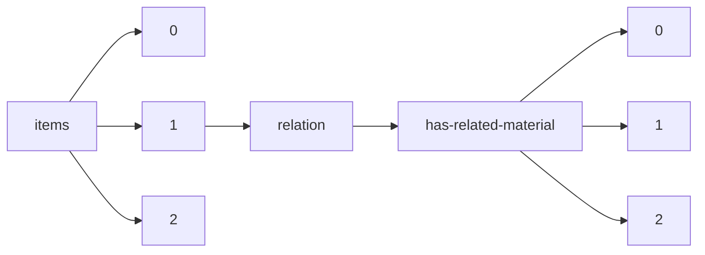

!!! warning "This document is not official Crossref documentation"
# Elements
PATH = items/array/relation/has-related-material/array(1)  
Occurs 5 497 times  
{ .annotate }

1. A route to an element, for example:  
   The route "items/array/relation/has-related-material/array" corresponds to navigating through the JSON indices as  
   ["items"][0]["relation"]["has-related-material"][0]  

## Asserted-by
See more information: [items/array/relation/has-related-material/array/asserted-by](asserted-by/index.md)  
Occurs 5 497 timess  
Unique values: 1  

| **Row** | **Value** `String` | **Count** `Int64` |
|--------:|----------------------:|---------------------:|
| **1**   | subject               | 5 497                |

## Id
See more information: [items/array/relation/has-related-material/array/id](id/index.md)  
Occurs 5 497 timess  
Unique values: > 999  

!!! note "Due to current limitations, only the first 1,000 unique values are counted."

| **Row** | **Value** `String`                                                   | **Count** `Int64` |
|--------:|------------------------------------------------------------------------:|---------------------:|
| **1**   |                                                                         | 361                  |
| **2**   | 10.26419/ppi.00099.001                                                  | 58                   |
| **3**   | 10.26419/ppi.00090.001                                                  | 23                   |
| **4**   | 10.26419/ppi.00073.000                                                  | 9                    |
| **5**   | 10.26419/ppi.00082.006                                                  | 8                    |
| **6**   | 10.26419/res.00471.001                                                  | 6                    |
| **7**   | 10.26419/res.00539.009                                                  | 2                    |
| **8**   | 10.26419/res.00581.007                                                  | 2                    |
| **9**   | https://cults3d.com/en/3d-model/various/surgical-mask-strap-remix-short | 2                    |
| **10**  | 10.5281/zenodo.1242619                                                  | 2                    |
| ... | ... | ... |

## Id-type
See more information: [items/array/relation/has-related-material/array/id-type](id-type/index.md)  
Occurs 5 497 timess  
Unique values: 4  

| **Row** | **Value** `String` | **Count** `Int64` |
|--------:|----------------------:|---------------------:|
| **1**   | doi                   | 3 319                |
| **2**   | uri                   | 2 175                |
| **3**   | other                 | 2                    |
| **4**   | issn                  | 1                    |

