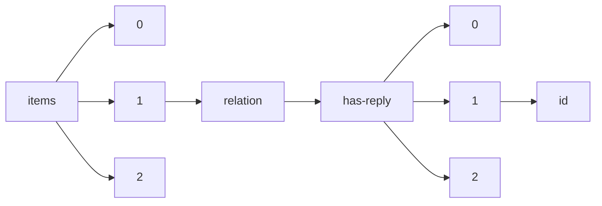

!!! warning "This document is not official Crossref documentation"
# Id
PATH = items/array/relation/has-reply/array/id(1)  
Occurs 55 655 times  
Unique values: > 999  
{ .annotate }

1. A route to an element, for example:  
   The route "items/array/relation/has-reply/array/id" corresponds to navigating through the JSON indices as  
   ["items"][0]["relation"]["has-reply"][0]["id"]  

!!! note "Due to current limitations, only the first 1,000 unique values are counted."

| **Row** | **Value** `String`      | **Count** `Int64` |
|--------:|---------------------------:|---------------------:|
| **1**   | 10.5194/cp-2018-19-AC6     | 5                    |
| **2**   | 10.5194/bg-2019-307-AC1    | 5                    |
| **3**   | 10.5194/cp-2018-89-AC1     | 4                    |
| **4**   | 10.5194/nhess-2019-344-AC1 | 4                    |
| **5**   | 10.5194/bg-2020-76-AC1     | 4                    |
| **6**   | 10.5194/esd-2018-36-AC3    | 4                    |
| **7**   | 10.5194/amt-2018-435-AC1   | 4                    |
| **8**   | 10.5194/amt-2017-401-AC1   | 4                    |
| **9**   | 10.5194/amt-2020-121-AC1   | 4                    |
| **10**  | 10.5194/amt-2019-408-AC1   | 4                    |
| **11**  | 10.5194/bg-2019-33-AC1     | 4                    |
| **12**  | 10.5194/acp-2018-1029-AC2  | 3                    |
| **13**  | 10.5194/acp-2019-740-AC1   | 3                    |
| **14**  | 10.5194/soil-2019-58-AC1   | 3                    |
| **15**  | 10.5194/cp-2018-177-AC4    | 3                    |
| **16**  | 10.5194/hess-2017-204-AC1  | 3                    |
| **17**  | 10.5194/cp-2018-27-AC2     | 3                    |
| **18**  | 10.5194/amt-2019-51-AC1    | 3                    |
| **19**  | 10.5194/esd-2017-101-AC2   | 3                    |
| **20**  | 10.5194/amt-2018-99-AC1    | 3                    |
| **21**  | 10.5194/acp-2019-864-AC1   | 3                    |
| **22**  | 10.5194/amt-2018-45-AC5    | 3                    |
| **23**  | 10.5194/amt-2018-75-AC1    | 3                    |
| **24**  | 10.5194/soil-2018-44-AC1   | 3                    |
| **25**  | 10.5194/amt-2018-442-AC2   | 3                    |
| **26**  | 10.5194/bg-2019-267-AC1    | 3                    |
| **27**  | 10.5194/essd-2019-102-AC2  | 3                    |
| **28**  | 10.5194/tc-2019-54-AC1     | 3                    |
| **29**  | 10.5194/bg-2019-321-AC1    | 3                    |
| **30**  | 10.5194/cp-2018-177-AC1    | 3                    |
| **31**  | 10.5194/tc-2017-283-AC1    | 3                    |
| **32**  | 10.5194/tc-2019-57-AC3     | 3                    |
| **33**  | 10.5194/bg-2018-119-AC1    | 3                    |
| **34**  | 10.5194/amt-2017-328-AC1   | 3                    |
| **35**  | 10.5194/tc-2019-131-AC1    | 3                    |
| **36**  | 10.15252/rc.2023604741     | 3                    |
| **37**  | 10.5194/tc-2017-200-AC4    | 3                    |
| **38**  | 10.5194/npg-2019-11-AC1    | 3                    |
| **39**  | 10.5194/se-2020-50-AC1     | 3                    |
| **40**  | 10.5194/hess-2018-304-AC3  | 3                    |
| **41**  | 10.5194/tc-2019-180-AC1    | 3                    |
| **42**  | 10.5194/acp-2019-271-AC2   | 3                    |
| **43**  | 10.5194/hess-2018-304-AC1  | 3                    |
| **44**  | 10.5194/os-2019-53-AC2     | 3                    |
| **45**  | 10.5194/se-2019-201-AC1    | 3                    |
| **46**  | 10.5194/esd-2020-11-AC1    | 3                    |
| **47**  | 10.5194/bg-2019-472-AC1    | 3                    |
| **48**  | 10.5194/cp-2019-18-AC3     | 3                    |
| **49**  | 10.5194/tc-2017-265-AC1    | 3                    |
| **50**  | 10.5194/esd-2017-101-AC1   | 3                    |
| **51**  | 10.5194/tc-2019-25-AC1     | 3                    |
| **52**  | 10.5194/amt-2017-237-AC3   | 3                    |
| **53**  | 10.5194/nhess-2019-142-AC1 | 3                    |
| **54**  | 10.15252/rc.2023374128     | 3                    |
| **55**  | 10.5194/bg-2018-202-AC1    | 3                    |
| **56**  | 10.5194/esd-2017-104-AC1   | 3                    |
| **57**  | 10.5194/tc-2018-278-AC1    | 3                    |
| **58**  | 10.5194/cp-2019-78-AC1     | 3                    |
| **59**  | 10.5194/gmd-2017-208-AC1   | 3                    |
| **60**  | 10.5194/acp-2020-75-AC1    | 3                    |
| **61**  | 10.5194/wes-2018-23-AC2    | 3                    |
| **62**  | 10.5194/tc-2019-222-AC1    | 3                    |
| **63**  | 10.5194/tc-2018-288-AC2    | 3                    |
| **64**  | 10.21428/39829d0b.b4848f39 | 3                    |
| **65**  | 10.5194/hess-2019-163-AC1  | 3                    |
| **66**  | 10.5194/nhess-2019-142-AC2 | 3                    |
| **67**  | 10.5194/hess-2019-201-AC2  | 3                    |
| **68**  | 10.5194/tc-2017-200-AC6    | 3                    |
| **69**  | 10.5194/nhess-2018-17-AC1  | 3                    |
| **70**  | 10.5194/wes-2018-23-AC1    | 3                    |
| **71**  | 10.5194/bg-2020-149-AC1    | 3                    |
| **72**  | 10.5194/tc-2019-49-AC1     | 3                    |
| **73**  | 10.5194/tc-2018-21-AC1     | 3                    |
| **74**  | 10.5194/amt-2018-45-AC6    | 3                    |
| **75**  | 10.5194/nhess-2017-352-AC1 | 3                    |
| **76**  | 10.5194/gmd-2018-270-AC2   | 3                    |
| **77**  | 10.5194/gmd-2018-41-AC1    | 3                    |
| **78**  | 10.5194/amt-2017-296-AC1   | 3                    |
| **79**  | 10.5194/amt-2017-287-AC1   | 3                    |
| **80**  | 10.5194/bg-2018-156-AC2    | 3                    |
| **81**  | 10.5194/os-2019-81-AC1     | 3                    |
| **82**  | 10.5194/amt-2016-326-AC1   | 3                    |
| **83**  | 10.5194/bg-2019-117-AC1    | 3                    |
| **84**  | 10.5194/tc-2019-148-AC1    | 3                    |
| **85**  | 10.5194/amt-2018-318-AC1   | 3                    |
| **86**  | 10.5194/hess-2018-144-AC2  | 3                    |
| **87**  | 10.5194/tc-2019-22-AC1     | 3                    |
| **88**  | 10.5194/gmd-2018-166-AC1   | 3                    |
| **89**  | 10.5194/se-2019-65-AC1     | 3                    |
| **90**  | 10.5194/amt-2018-125-AC1   | 3                    |
| **91**  | 10.5194/hess-2018-232-AC1  | 3                    |
| **92**  | 10.5194/bg-2019-89-AC1     | 3                    |
| **93**  | 10.5194/tc-2017-202-AC1    | 3                    |
| **94**  | 10.5194/cp-2018-113-AC1    | 3                    |
| **95**  | 10.5194/angeo-2018-27-AC2  | 3                    |
| **96**  | 10.5194/amt-2019-52-AC1    | 3                    |
| **97**  | 10.5194/npg-2019-11-AC2    | 3                    |
| **98**  | 10.5194/angeo-2019-131-AC2 | 3                    |
| **99**  | 10.5194/hess-2018-387-AC1  | 3                    |
| **100** | 10.5194/hess-2019-81-AC1   | 3                    |
| **101** | 10.5194/cp-2018-17-AC4     | 3                    |
| **102** | 10.5194/cp-2019-33-AC1     | 3                    |
| **103** | 10.5194/os-2017-95-AC3     | 3                    |
| **104** | 10.5194/amt-2019-1-AC1     | 3                    |
| **105** | 10.5194/acp-2016-1181-AC1  | 2                    |
| **106** | 10.5194/bg-2020-70-AC3     | 2                    |
| **107** | 10.5194/amt-2019-297-AC2   | 2                    |
| **108** | 10.5194/nhess-2018-169-AC2 | 2                    |
| **109** | 10.5194/os-2019-132-AC2    | 2                    |
| **110** | 10.5194/esd-2019-39-AC1    | 2                    |
| **111** | 10.5194/acp-2018-1134-AC4  | 2                    |
| **112** | 10.5194/hess-2017-111-SC3  | 2                    |
| **113** | 10.5194/hess-2016-601-AC2  | 2                    |
| **114** | 10.5194/os-2019-116-SC1    | 2                    |
| **115** | 10.5194/bg-2019-457-AC1    | 2                    |
| **116** | 10.5194/esurf-2018-67-AC2  | 2                    |
| **117** | 10.5194/hess-2018-555-AC2  | 2                    |
| **118** | 10.5194/bg-2017-159-AC2    | 2                    |
| **119** | 10.5194/acp-2017-860-AC2   | 2                    |
| **120** | 10.5194/amt-2019-252-AC2   | 2                    |
| **121** | 10.5194/hess-2018-188-AC3  | 2                    |
| **122** | 10.5194/acp-2019-62-AC2    | 2                    |
| **123** | 10.5194/nhess-2017-116-AC1 | 2                    |
| **124** | 10.5194/bg-2018-70-AC2     | 2                    |
| **125** | 10.5194/se-2018-76-AC1     | 2                    |
| **126** | 10.5194/hess-2019-650-AC5  | 2                    |
| **127** | 10.5194/acp-2018-1073-AC2  | 2                    |
| **128** | 10.5194/soil-2019-24-EC2   | 2                    |
| **129** | 10.5194/amt-2020-67-AC2    | 2                    |
| **130** | 10.5194/hess-2018-96-AC2   | 2                    |
| **131** | 10.5194/se-2018-22-AC2     | 2                    |
| **132** | 10.5194/acp-2018-185-AC5   | 2                    |
| **133** | 10.5194/acp-2018-296-AC1   | 2                    |
| **134** | 10.5194/tc-2019-301-AC2    | 2                    |
| **135** | 10.5194/amt-2017-200-AC3   | 2                    |
| **136** | 10.5194/esd-2017-54-AC3    | 2                    |
| **137** | 10.5194/angeo-2019-42-AC7  | 2                    |
| **138** | 10.5194/gmd-2017-256-AC2   | 2                    |
| **139** | 10.5194/amt-2017-425-AC2   | 2                    |
| **140** | 10.5194/essd-2019-136-AC3  | 2                    |
| **141** | 10.5194/gmd-2017-68-AC1    | 2                    |
| **142** | 10.5194/tc-2020-88-AC1     | 2                    |
| **143** | 10.5194/hess-2019-409-AC1  | 2                    |
| **144** | 10.5194/bg-2018-365-AC2    | 2                    |
| **145** | 10.5194/amt-2019-370-AC2   | 2                    |
| **146** | 10.5194/se-2018-38-AC2     | 2                    |
| **147** | 10.5194/esd-2019-66-AC2    | 2                    |
| **148** | 10.5194/hess-2018-279-AC3  | 2                    |
| **149** | 10.5194/wes-2017-48-AC1    | 2                    |
| **150** | 10.5194/hess-2019-197-AC3  | 2                    |
| **151** | 10.5194/essd-2019-99-AC4   | 2                    |
| **152** | 10.5194/hess-2017-97-AC2   | 2                    |
| **153** | 10.5194/os-2017-90-AC1     | 2                    |
| **154** | 10.5194/acp-2019-69-AC1    | 2                    |
| **155** | 10.5194/bg-2018-179-AC2    | 2                    |
| **156** | 10.5194/acp-2017-818-AC2   | 2                    |
| **157** | 10.5194/tc-2019-119-AC1    | 2                    |
| **158** | 10.5194/acp-2018-647-AC2   | 2                    |
| **159** | 10.5194/bg-2020-257-AC1    | 2                    |
| **160** | 10.5194/nhess-2019-188-AC2 | 2                    |
| **161** | 10.5194/bg-2019-158-AC5    | 2                    |
| **162** | 10.5194/nhess-2020-118-AC1 | 2                    |
| **163** | 10.5194/bg-2018-332-AC1    | 2                    |
| **164** | 10.5194/hess-2018-638-AC2  | 2                    |
| **165** | 10.5194/acp-2019-902-AC2   | 2                    |
| **166** | 10.5194/esurf-2017-10-AC3  | 2                    |
| **167** | 10.5194/bg-2017-308-AC3    | 2                    |
| **168** | 10.5194/cp-2017-1-AC3      | 2                    |
| **169** | 10.5194/se-2019-18-AC1     | 2                    |
| **170** | 10.5194/acp-2019-302-AC3   | 2                    |
| **171** | 10.5194/bg-2019-231-AC1    | 2                    |
| **172** | 10.5194/gmd-2019-19-AC3    | 2                    |
| **173** | 10.5194/npg-2017-14-AC1    | 2                    |
| **174** | 10.5194/gmd-2017-167-AC1   | 2                    |
| **175** | 10.5194/hess-2017-431-AC3  | 2                    |
| **176** | 10.5194/npg-2019-31-AC1    | 2                    |
| **177** | 10.5194/acp-2017-557-AC3   | 2                    |
| **178** | 10.5194/hess-2019-5-AC1    | 2                    |
| **179** | 10.5194/acp-2018-408-AC1   | 2                    |
| **180** | 10.5194/acp-2019-666-AC1   | 2                    |
| **181** | 10.5194/acp-2019-812-AC3   | 2                    |
| **182** | 10.5194/nhess-2017-273-AC1 | 2                    |
| **183** | 10.5194/bg-2018-443-AC1    | 2                    |
| **184** | 10.5194/acp-2017-126-AC4   | 2                    |
| **185** | 10.5194/amt-2019-417-AC1   | 2                    |
| **186** | 10.5194/hess-2018-479-SC5  | 2                    |
| **187** | 10.5194/amt-2017-432-AC2   | 2                    |
| **188** | 10.5194/acp-2019-707-AC2   | 2                    |
| **189** | 10.5194/acp-2018-1154-AC3  | 2                    |
| **190** | 10.5194/acp-2017-342-AC6   | 2                    |
| **191** | 10.5194/bg-2017-94-AC1     | 2                    |
| **192** | 10.5194/gmd-2017-76-AC1    | 2                    |
| **193** | 10.5194/bg-2017-53-AC2     | 2                    |
| **194** | 10.5194/amt-2019-174-AC2   | 2                    |
| **195** | 10.5194/nhess-2018-127-AC2 | 2                    |
| **196** | 10.5194/acp-2018-424-AC2   | 2                    |
| **197** | 10.5194/essd-2017-44-AC4   | 2                    |
| **198** | 10.5194/acp-2016-1112-AC1  | 2                    |
| **199** | 10.5194/nhess-2019-34-AC3  | 2                    |
| **200** | 10.5194/amt-2020-60-AC4    | 2                    |
| **201** | 10.5194/hess-2019-679-AC2  | 2                    |
| **202** | 10.5194/nhess-2018-36-AC3  | 2                    |
| **203** | 10.5194/hess-2019-426-AC1  | 2                    |
| **204** | 10.5194/hess-2017-680-AC1  | 2                    |
| **205** | 10.5194/se-2018-50-AC3     | 2                    |
| **206** | 10.5194/acp-2018-313-AC3   | 2                    |
| **207** | 10.5194/acp-2019-71-AC2    | 2                    |
| **208** | 10.5194/nhess-2019-331-AC3 | 2                    |
| **209** | 10.5194/se-2018-135-AC3    | 2                    |
| **210** | 10.5194/bg-2019-308-AC1    | 2                    |
| **211** | 10.5194/bg-2017-120-AC1    | 2                    |
| **212** | 10.5194/acp-2019-442-AC1   | 2                    |
| **213** | 10.5194/acp-2018-208-AC1   | 2                    |
| **214** | 10.5194/se-2019-204-AC2    | 2                    |
| **215** | 10.5194/se-2016-174-AC1    | 2                    |
| **216** | 10.5194/esd-2019-37-AC2    | 2                    |
| **217** | 10.5194/cp-2019-115-AC1    | 2                    |
| **218** | 10.5194/cp-2018-48-AC2     | 2                    |
| **219** | 10.5194/acp-2019-961-AC1   | 2                    |
| **220** | 10.5194/angeo-2018-50-AC3  | 2                    |
| **221** | 10.5194/cp-2019-135-SC5    | 2                    |
| **222** | 10.5194/se-2018-74-AC2     | 2                    |
| **223** | 10.5194/bg-2018-380-EC1    | 2                    |
| **224** | 10.5194/gmd-2019-33-AC2    | 2                    |
| **225** | 10.5194/amt-2019-127-AC4   | 2                    |
| **226** | 10.5194/bg-2020-94-AC1     | 2                    |
| **227** | 10.5194/bg-2018-110-AC3    | 2                    |
| **228** | 10.5194/hess-2018-249-AC6  | 2                    |
| **229** | 10.5194/cp-2019-104-AC1    | 2                    |
| **230** | 10.5194/acp-2020-133-AC3   | 2                    |
| **231** | 10.5194/bg-2017-530-AC1    | 2                    |
| **232** | 10.5194/gmd-2020-257-AC1   | 2                    |
| **233** | 10.5194/bg-2018-232-AC1    | 2                    |
| **234** | 10.5194/se-2019-99-AC2     | 2                    |
| **235** | 10.5194/nhess-2018-92-AC2  | 2                    |
| **236** | 10.5194/acp-2018-121-AC2   | 2                    |
| **237** | 10.5194/acp-2017-558-AC2   | 2                    |
| **238** | 10.5194/hess-2017-316-AC1  | 2                    |
| **239** | 10.5194/bg-2017-534-AC2    | 2                    |
| **240** | 10.5194/gi-2017-19-AC2     | 2                    |
| **241** | 10.5194/hess-2017-344-AC1  | 2                    |
| **242** | 10.5194/se-2019-49-AC2     | 2                    |
| **243** | 10.5194/hess-2019-159-AC2  | 2                    |
| **244** | 10.5194/se-2018-72-AC1     | 2                    |
| **245** | 10.5194/amt-2019-414-AC1   | 2                    |
| **246** | 10.5194/amt-2018-225-AC2   | 2                    |
| **247** | 10.5194/amt-2019-388-AC2   | 2                    |
| **248** | 10.5194/acp-2019-19-AC2    | 2                    |
| **249** | 10.5194/bg-2019-223-AC4    | 2                    |
| **250** | 10.5194/hess-2017-744-AC3  | 2                    |
| **251** | 10.5194/angeo-2019-115-AC2 | 2                    |
| **252** | 10.5194/bg-2020-95-AC1     | 2                    |
| **253** | 10.5194/bg-2017-572-AC1    | 2                    |
| **254** | 10.5194/soil-2019-72-AC1   | 2                    |
| **255** | 10.5194/bg-2020-156-AC4    | 2                    |
| **256** | 10.5194/bg-2019-246-AC2    | 2                    |
| **257** | 10.5194/gmd-2017-296-AC1   | 2                    |
| **258** | 10.5194/acp-2019-831-AC1   | 2                    |
| **259** | 10.5194/nhess-2018-312-AC2 | 2                    |
| **260** | 10.5194/tc-2018-175-AC3    | 2                    |
| **261** | 10.5194/acp-2020-8-AC2     | 2                    |
| **262** | 10.5194/nhess-2016-393-AC2 | 2                    |
| **263** | 10.5194/amt-2020-146-AC2   | 2                    |
| **264** | 10.5194/cp-2018-35-AC1     | 2                    |
| **265** | 10.5194/cp-2019-26-AC3     | 2                    |
| **266** | 10.5194/gmd-2017-108-AC2   | 2                    |
| **267** | 10.5194/nhess-2019-16-AC3  | 2                    |
| **268** | 10.5194/bg-2017-450-RC4    | 2                    |
| **269** | 10.5194/essd-2018-31-AC2   | 2                    |
| **270** | 10.5194/acp-2019-472-AC2   | 2                    |
| **271** | 10.5194/bg-2017-108-AC5    | 2                    |
| **272** | 10.5194/bg-2018-423-AC1    | 2                    |
| **273** | 10.5194/hess-2017-537-AC2  | 2                    |
| **274** | 10.5194/amt-2018-258-AC1   | 2                    |
| **275** | 10.5194/tc-2018-166-AC1    | 2                    |
| **276** | 10.5194/amt-2018-164-AC2   | 2                    |
| **277** | 10.5194/os-2016-94-AC1     | 2                    |
| **278** | 10.5194/se-2020-132-AC1    | 2                    |
| **279** | 10.5194/acp-2017-1116-AC1  | 2                    |
| **280** | 10.5194/acp-2017-574-AC2   | 2                    |
| **281** | 10.5194/wes-2018-4-AC3     | 2                    |
| **282** | 10.5194/essd-2018-59-AC1   | 2                    |
| **283** | 10.5194/hess-2018-265-AC2  | 2                    |
| **284** | 10.5194/cp-2020-41-AC1     | 2                    |
| **285** | 10.5194/cp-2020-59-AC2     | 2                    |
| **286** | 10.5194/nhess-2018-35-AC1  | 2                    |
| **287** | 10.5194/hess-2018-424-AC3  | 2                    |
| **288** | 10.5194/bg-2018-427-AC1    | 2                    |
| **289** | 10.5194/hess-2019-239-AC2  | 2                    |
| **290** | 10.5194/nhess-2018-93-AC2  | 2                    |
| **291** | 10.5194/essd-2018-99-AC1   | 2                    |
| **292** | 10.5194/hess-2018-5-AC1    | 2                    |
| **293** | 10.5194/hess-2019-142-SC3  | 2                    |
| **294** | 10.5194/amt-2019-117-AC1   | 2                    |
| **295** | 10.5194/hess-2019-626-AC1  | 2                    |
| **296** | 10.5194/bg-2019-407-AC3    | 2                    |
| **297** | 10.5194/gmd-2019-26-AC2    | 2                    |
| **298** | 10.5194/esd-2017-58-AC2    | 2                    |
| **299** | 10.5194/bg-2017-229-AC2    | 2                    |
| **300** | 10.5194/os-2018-149-AC3    | 2                    |
| **301** | 10.5194/acp-2019-1025-AC2  | 2                    |
| **302** | 10.5194/hess-2020-342-AC1  | 2                    |
| **303** | 10.5194/amt-2020-63-AC2    | 2                    |
| **304** | 10.5194/gmd-2017-29-AC1    | 2                    |
| **305** | 10.5194/tc-2018-38-AC3     | 2                    |
| **306** | 10.5194/essd-2017-67-AC1   | 2                    |
| **307** | 10.5194/acp-2019-715-AC2   | 2                    |
| **308** | 10.5194/mr-2020-28-AC1     | 2                    |
| **309** | 10.5194/gmd-2018-92-RC1    | 2                    |
| **310** | 10.5194/nhess-2019-259-AC2 | 2                    |
| **311** | 10.5194/amt-2019-101-AC2   | 2                    |
| **312** | 10.5194/os-2019-100-AC1    | 2                    |
| **313** | 10.5194/acp-2017-915-AC2   | 2                    |
| **314** | 10.5194/esd-2017-99-AC1    | 2                    |
| **315** | 10.5194/bg-2017-16-AC4     | 2                    |
| **316** | 10.5194/acp-2018-344-AC2   | 2                    |
| **317** | 10.5194/amt-2018-67-AC1    | 2                    |
| **318** | 10.5194/nhess-2019-116-AC2 | 2                    |
| **319** | 10.5194/acp-2017-271-AC1   | 2                    |
| **320** | 10.5194/amt-2018-29-AC2    | 2                    |
| **321** | 10.5194/os-2018-151-AC1    | 2                    |
| **322** | 10.5194/tc-2018-285-AC1    | 2                    |
| **323** | 10.5194/os-2017-93-AC1     | 2                    |
| **324** | 10.5194/essd-2017-139-AC2  | 2                    |
| **325** | 10.5194/essd-2018-74-AC2   | 2                    |
| **326** | 10.5194/bg-2017-308-AC2    | 2                    |
| **327** | 10.5194/amt-2019-127-AC2   | 2                    |
| **328** | 10.5194/nhess-2018-148-AC2 | 2                    |
| **329** | 10.5194/acp-2019-718-AC2   | 2                    |
| **330** | 10.5194/acp-2019-991-AC2   | 2                    |
| **331** | 10.5194/acp-2017-275-AC1   | 2                    |
| **332** | 10.5194/hess-2017-474-AC1  | 2                    |
| **333** | 10.5194/se-2017-54-AC4     | 2                    |
| **334** | 10.5194/acp-2018-113-AC1   | 2                    |
| **335** | 10.5194/gmd-2019-65-AC2    | 2                    |
| **336** | 10.5194/os-2017-77-AC2     | 2                    |
| **337** | 10.5194/gchron-2020-1-AC1  | 2                    |
| **338** | 10.5194/acp-2018-543-AC2   | 2                    |
| **339** | 10.5194/cp-2018-21-AC2     | 2                    |
| **340** | 10.5194/hess-2017-473-AC1  | 2                    |
| **341** | 10.5194/cp-2018-78-AC5     | 2                    |
| **342** | 10.5194/gmd-2019-99-AC1    | 2                    |
| **343** | 10.5194/essd-2018-111-AC3  | 2                    |
| **344** | 10.5194/os-2017-53-AC2     | 2                    |
| **345** | 10.5194/acp-2018-46-AC1    | 2                    |
| **346** | 10.5194/acp-2018-59-AC3    | 2                    |
| **347** | 10.5194/acp-2018-507-AC2   | 2                    |
| **348** | 10.5194/essd-2017-62-AC2   | 2                    |
| **349** | 10.5194/bg-2018-108-AC1    | 2                    |
| **350** | 10.5194/tc-2017-150-AC3    | 2                    |
| **351** | 10.5194/tc-2018-23-AC1     | 2                    |
| **352** | 10.5194/amt-2018-433-AC1   | 2                    |
| **353** | 10.5194/os-2018-111-AC2    | 2                    |
| **354** | 10.5194/esd-2017-125-AC3   | 2                    |
| **355** | 10.5194/amt-2019-466-AC2   | 2                    |
| **356** | 10.5194/nhess-2017-232-AC2 | 2                    |
| **357** | 10.5194/tc-2017-162-AC2    | 2                    |
| **358** | 10.5194/tc-2020-10-AC2     | 2                    |
| **359** | 10.5194/bg-2017-229-AC1    | 2                    |
| **360** | 10.5194/amt-2017-154-AC2   | 2                    |
| **361** | 10.5194/tc-2018-66-AC3     | 2                    |
| **362** | 10.5194/nhess-2018-178-AC4 | 2                    |
| **363** | 10.5194/gmd-2018-113-AC1   | 2                    |
| **364** | 10.5194/acp-2017-94-AC2    | 2                    |
| **365** | 10.5194/bg-2019-305-AC1    | 2                    |
| **366** | 10.5194/acp-2019-713-AC2   | 2                    |
| **367** | 10.5194/acp-2018-427-AC1   | 2                    |
| **368** | 10.5194/tc-2018-263-AC3    | 2                    |
| **369** | 10.5194/gmd-2017-289-AC2   | 2                    |
| **370** | 10.5194/amt-2020-96-AC1    | 2                    |
| **371** | 10.5194/acp-2017-1238-AC1  | 2                    |
| **372** | 10.5194/amt-2017-388-AC1   | 2                    |
| **373** | 10.5194/soil-2020-51-AC1   | 2                    |
| **374** | 10.5194/acp-2017-515-AC1   | 2                    |
| **375** | 10.5194/nhess-2019-372-AC2 | 2                    |
| **376** | 10.5194/hess-2017-684-AC1  | 2                    |
| **377** | 10.5194/nhess-2018-62-AC1  | 2                    |
| **378** | 10.5194/soil-2016-62-AC2   | 2                    |
| **379** | 10.5194/nhess-2017-226-SC1 | 2                    |
| **380** | 10.5194/cp-2018-52-AC1     | 2                    |
| **381** | 10.5194/angeo-2018-95-RC2  | 2                    |
| **382** | 10.5194/gmd-2018-31-AC3    | 2                    |
| **383** | 10.5194/nhess-2018-310-AC1 | 2                    |
| **384** | 10.5194/acp-2017-108-AC2   | 2                    |
| **385** | 10.5194/acp-2019-1019-AC1  | 2                    |
| **386** | 10.5194/bg-2018-85-AC3     | 2                    |
| **387** | 10.5194/bg-2017-220-AC1    | 2                    |
| **388** | 10.5194/tc-2017-253-AC2    | 2                    |
| **389** | 10.5194/esurf-2017-15-AC2  | 2                    |
| **390** | 10.5194/amt-2020-105-AC1   | 2                    |
| **391** | 10.5194/se-2019-192-AC2    | 2                    |
| **392** | 10.5194/npg-2018-12-AC1    | 2                    |
| **393** | 10.5194/gc-2018-13-AC1     | 2                    |
| **394** | 10.5194/esd-2019-43-AC2    | 2                    |
| **395** | 10.5194/nhess-2017-243-AC1 | 2                    |
| **396** | 10.5194/gmd-2018-185-AC2   | 2                    |
| **397** | 10.5194/esurf-2018-98-AC2  | 2                    |
| **398** | 10.5194/nhess-2018-88-AC1  | 2                    |
| **399** | 10.5194/acp-2017-1182-AC2  | 2                    |
| **400** | 10.5194/hess-2019-369-AC1  | 2                    |
| **401** | 10.5194/esurf-2017-6-AC1   | 2                    |
| **402** | 10.5194/tc-2017-151-AC4    | 2                    |
| **403** | 10.5194/essd-2017-30-AC2   | 2                    |
| **404** | 10.5194/bg-2018-147-AC4    | 2                    |
| **405** | 10.5194/nhess-2018-350-AC1 | 2                    |
| **406** | 10.5194/amt-2017-447-AC1   | 2                    |
| **407** | 10.5194/esd-2017-54-AC4    | 2                    |
| **408** | 10.5194/amt-2019-177-AC2   | 2                    |
| **409** | 10.5194/bg-2017-212-AC2    | 2                    |
| **410** | 10.5194/tc-2020-10-AC3     | 2                    |
| **411** | 10.5194/se-2019-109-AC2    | 2                    |
| **412** | 10.5194/nhess-2017-126-AC1 | 2                    |
| **413** | 10.5194/os-2017-3-AC2      | 2                    |
| **414** | 10.5194/amt-2019-141-AC1   | 2                    |
| **415** | 10.5194/amt-2017-429-AC2   | 2                    |
| **416** | 10.5194/acp-2016-1079-AC2  | 2                    |
| **417** | 10.5194/bg-2018-366-AC2    | 2                    |
| **418** | 10.5194/gmd-2017-267-AC2   | 2                    |
| **419** | 10.5194/se-2018-4-AC1      | 2                    |
| **420** | 10.5194/tc-2017-35-AC3     | 2                    |
| **421** | 10.5194/amt-2020-19-AC2    | 2                    |
| **422** | 10.5194/bg-2019-42-AC1     | 2                    |
| **423** | 10.5194/amt-2018-245-AC4   | 2                    |
| **424** | 10.5194/amt-2018-342-AC1   | 2                    |
| **425** | 10.5194/bg-2017-565-AC1    | 2                    |
| **426** | 10.5194/esd-2017-12-AC3    | 2                    |
| **427** | 10.5194/nhess-2019-91-AC3  | 2                    |
| **428** | 10.5194/wes-2018-56-AC1    | 2                    |
| **429** | 10.5194/cp-2019-140-AC1    | 2                    |
| **430** | 10.5194/cp-2019-89-AC3     | 2                    |
| **431** | 10.5194/angeo-2019-57-AC1  | 2                    |
| **432** | 10.5194/acp-2018-1270-AC2  | 2                    |
| **433** | 10.5194/acp-2019-703-AC4   | 2                    |
| **434** | 10.5194/bg-2017-103-AC2    | 2                    |
| **435** | 10.5194/se-2020-99-AC1     | 2                    |
| **436** | 10.5194/bg-2020-24-AC4     | 2                    |
| **437** | 10.5194/acp-2018-753-AC1   | 2                    |
| **438** | 10.5194/amt-2018-297-AC2   | 2                    |
| **439** | 10.5194/gmd-2018-136-SC2   | 2                    |
| **440** | 10.5194/amt-2020-278-AC1   | 2                    |
| **441** | 10.5194/amt-2018-138-AC2   | 2                    |
| **442** | 10.5194/esd-2018-71-AC2    | 2                    |
| **443** | 10.5194/se-2019-196-AC2    | 2                    |
| **444** | 10.5194/se-2017-57-AC2     | 2                    |
| **445** | 10.5194/amt-2018-90-AC1    | 2                    |
| **446** | 10.5194/angeo-2018-79-AC2  | 2                    |
| **447** | 10.5194/tc-2017-115-AC2    | 2                    |
| **448** | 10.5194/acp-2018-651-AC2   | 2                    |
| **449** | 10.5194/acp-2018-1092-AC2  | 2                    |
| **450** | 10.5194/amt-2017-48-AC2    | 2                    |
| **451** | 10.5194/acp-2017-794-AC2   | 2                    |
| **452** | 10.5194/hess-2018-493-AC1  | 2                    |
| **453** | 10.5194/hess-2017-581-AC1  | 2                    |
| **454** | 10.5194/os-2017-51-AC2     | 2                    |
| **455** | 10.5194/acp-2019-1128-AC1  | 2                    |
| **456** | 10.5194/hess-2017-504-AC3  | 2                    |
| **457** | 10.5194/cp-2017-157-AC2    | 2                    |
| **458** | 10.5194/bg-2018-220-AC4    | 2                    |
| **459** | 10.5194/hess-2019-8-AC4    | 2                    |
| **460** | 10.5194/hess-2018-174-AC2  | 2                    |
| **461** | 10.5194/esd-2017-119-AC1   | 2                    |
| **462** | 10.5194/angeo-2019-119-AC3 | 2                    |
| **463** | 10.5194/hess-2018-78-AC3   | 2                    |
| **464** | 10.5194/tc-2018-32-AC1     | 2                    |
| **465** | 10.5194/esurf-2018-62-AC3  | 2                    |
| **466** | 10.5194/acp-2018-1071-AC2  | 2                    |
| **467** | 10.5194/bg-2019-483-AC1    | 2                    |
| **468** | 10.5194/tc-2018-41-AC1     | 2                    |
| **469** | 10.5194/bg-2018-445-AC1    | 2                    |
| **470** | 10.5194/acp-2019-648-AC1   | 2                    |
| **471** | 10.5194/acp-2018-421-AC1   | 2                    |
| **472** | 10.5194/acp-2017-893-AC2   | 2                    |
| **473** | 10.5194/tc-2019-63-AC1     | 2                    |
| **474** | 10.5194/soil-2017-28-AC3   | 2                    |
| **475** | 10.5194/hess-2018-519-AC1  | 2                    |
| **476** | 10.5194/nhess-2016-379-AC2 | 2                    |
| **477** | 10.5194/gi-2019-25-RC3     | 2                    |
| **478** | 10.5194/cp-2017-129-AC5    | 2                    |
| **479** | 10.5194/esd-2017-6-AC1     | 2                    |
| **480** | 10.5194/essd-2018-109-AC2  | 2                    |
| **481** | 10.5194/amt-2019-213-AC1   | 2                    |
| **482** | 10.5194/gmd-2019-39-AC1    | 2                    |
| **483** | 10.5194/os-2017-2-AC1      | 2                    |
| **484** | 10.5194/amt-2017-446-AC2   | 2                    |
| **485** | 10.5194/esd-2017-17-AC2    | 2                    |
| **486** | 10.5194/amt-2017-95-AC2    | 2                    |
| **487** | 10.5194/acp-2019-627-AC2   | 2                    |
| **488** | 10.5194/dwes-2020-32-AC4   | 2                    |
| **489** | 10.5194/gmd-2019-377-AC3   | 2                    |
| **490** | 10.5194/amt-2019-77-AC1    | 2                    |
| **491** | 10.5194/acp-2017-546-AC2   | 2                    |
| **492** | 10.5194/tc-2017-290-AC1    | 2                    |
| **493** | 10.5194/esd-2018-24-AC2    | 2                    |
| **494** | 10.5194/amt-2018-133-AC3   | 2                    |
| **495** | 10.5194/acp-2017-293-AC1   | 2                    |
| **496** | 10.5194/amt-2019-124-AC2   | 2                    |
| **497** | 10.5194/nhess-2019-24-AC1  | 2                    |
| **498** | 10.5194/gmd-2019-104-AC1   | 2                    |
| **499** | 10.5194/se-2018-18-AC1     | 2                    |
| **500** | 10.5194/nhess-2017-438-AC1 | 2                    |
| **501** | 10.5194/npg-2017-71-AC2    | 2                    |
| **502** | 10.5194/hess-2017-403-AC2  | 2                    |
| **503** | 10.5194/acp-2019-385-AC2   | 2                    |
| **504** | 10.5194/bg-2018-167-AC3    | 2                    |
| **505** | 10.5194/angeo-2019-99-AC2  | 2                    |
| **506** | 10.5194/acp-2018-857-AC2   | 2                    |
| **507** | 10.5194/acp-2018-1305-AC1  | 2                    |
| **508** | 10.5194/acp-2019-292-AC1   | 2                    |
| **509** | 10.5194/hess-2019-436-SC5  | 2                    |
| **510** | 10.5194/gmd-2019-52-AC3    | 2                    |
| **511** | 10.5194/hess-2018-591-AC1  | 2                    |
| **512** | 10.5194/wes-2017-13-AC2    | 2                    |
| **513** | 10.5194/acp-2019-139-AC2   | 2                    |
| **514** | 10.5194/os-2019-18-AC1     | 2                    |
| **515** | 10.5194/dwes-2017-7-AC5    | 2                    |
| **516** | 10.5194/bg-2018-30-RC1     | 2                    |
| **517** | 10.5194/amt-2017-439-AC1   | 2                    |
| **518** | 10.5194/npg-2017-46-AC2    | 2                    |
| **519** | 10.5194/tc-2019-287-AC3    | 2                    |
| **520** | 10.5194/gmd-2019-52-AC5    | 2                    |
| **521** | 10.5194/hess-2019-234-AC3  | 2                    |
| **522** | 10.5194/se-2018-26-AC4     | 2                    |
| **523** | 10.5194/amt-2018-203-AC1   | 2                    |
| **524** | 10.5194/essd-2017-28-AC1   | 2                    |
| **525** | 10.5194/bg-2017-543-AC1    | 2                    |
| **526** | 10.5194/bg-2020-10-AC1     | 2                    |
| **527** | 10.5194/amt-2019-488-AC3   | 2                    |
| **528** | 10.5194/se-2017-30-AC1     | 2                    |
| **529** | 10.5194/gmd-2018-183-AC1   | 2                    |
| **530** | 10.5194/bg-2019-243-AC1    | 2                    |
| **531** | 10.5194/tc-2019-173-AC2    | 2                    |
| **532** | 10.5194/se-2019-152-AC2    | 2                    |
| **533** | 10.5194/cp-2020-38-AC6     | 2                    |
| **534** | 10.5194/amt-2017-67-AC2    | 2                    |
| **535** | 10.5194/bg-2018-518-AC2    | 2                    |
| **536** | 10.5194/acp-2017-719-AC1   | 2                    |
| **537** | 10.5194/hess-2017-87-AC1   | 2                    |
| **538** | 10.5194/acp-2019-444-AC2   | 2                    |
| **539** | 10.5194/nhess-2017-13-AC1  | 2                    |
| **540** | 10.5194/gmd-2017-73-AC2    | 2                    |
| **541** | 10.5194/amt-2019-471-AC2   | 2                    |
| **542** | 10.5194/acp-2018-461-AC2   | 2                    |
| **543** | 10.5194/acp-2017-415-AC2   | 2                    |
| **544** | 10.5194/bg-2018-252-AC3    | 2                    |
| **545** | 10.5194/bg-2017-508-AC1    | 2                    |
| **546** | 10.5194/amt-2017-17-RC4    | 2                    |
| **547** | 10.5194/angeo-2019-123-AC3 | 2                    |
| **548** | 10.5194/bg-2017-501-AC5    | 2                    |
| **549** | 10.5194/tc-2017-111-AC1    | 2                    |
| **550** | 10.5194/acp-2019-245-AC3   | 2                    |
| **551** | 10.5194/cp-2019-32-AC2     | 2                    |
| **552** | 10.5194/hess-2018-408-AC2  | 2                    |
| **553** | 10.5194/acp-2019-590-AC2   | 2                    |
| **554** | 10.5194/acp-2017-966-AC2   | 2                    |
| **555** | 10.5194/hess-2017-549-AC2  | 2                    |
| **556** | 10.5194/acp-2019-245-AC1   | 2                    |
| **557** | 10.5194/bg-2018-439-AC1    | 2                    |
| **558** | 10.5194/hess-2019-213-AC2  | 2                    |
| **559** | 10.5194/bg-2016-559-AC2    | 2                    |
| **560** | 10.5194/npg-2019-20-AC2    | 2                    |
| **561** | 10.5194/tc-2020-67-AC4     | 2                    |
| **562** | 10.5194/npg-2017-27-AC3    | 2                    |
| **563** | 10.5194/cp-2020-98-AC1     | 2                    |
| **564** | 10.5194/cp-2019-44-AC1     | 2                    |
| **565** | 10.5194/amt-2017-218-AC1   | 2                    |
| **566** | 10.5194/tc-2017-190-AC1    | 2                    |
| **567** | 10.5194/acp-2019-524-AC2   | 2                    |
| **568** | 10.5194/amt-2017-132-AC1   | 2                    |
| **569** | 10.5194/amt-2017-467-AC2   | 2                    |
| **570** | 10.5194/hess-2019-587-AC1  | 2                    |
| **571** | 10.5194/hess-2017-19-RC2   | 2                    |
| **572** | 10.5194/angeo-2019-32-AC1  | 2                    |
| **573** | 10.5194/angeo-2018-137-AC2 | 2                    |
| **574** | 10.5194/hess-2019-563-AC2  | 2                    |
| **575** | 10.5194/wes-2017-33-AC1    | 2                    |
| **576** | 10.5194/amt-2020-60-AC1    | 2                    |
| **577** | 10.5194/bg-2019-91-AC3     | 2                    |
| **578** | 10.5194/nhess-2019-279-AC1 | 2                    |
| **579** | 10.5194/gmd-2017-31-AC1    | 2                    |
| **580** | 10.5194/bg-2019-151-SC2    | 2                    |
| **581** | 10.5194/gmd-2019-201-SC1   | 2                    |
| **582** | 10.5194/hess-2018-118-AC1  | 2                    |
| **583** | 10.5194/os-2018-51-AC2     | 2                    |
| **584** | 10.5194/essd-2019-135-AC3  | 2                    |
| **585** | 10.5194/amt-2017-420-AC3   | 2                    |
| **586** | 10.5194/nhess-2020-26-AC2  | 2                    |
| **587** | 10.5194/tc-2017-44-AC1     | 2                    |
| **588** | 10.5194/gmd-2019-132-AC1   | 2                    |
| **589** | 10.5194/bg-2016-548-AC1    | 2                    |
| **590** | 10.5194/gmd-2019-122-AC3   | 2                    |
| **591** | 10.5194/bg-2018-306-AC3    | 2                    |
| **592** | 10.5194/hess-2017-39-AC1   | 2                    |
| **593** | 10.5194/bg-2018-508-AC2    | 2                    |
| **594** | 10.5194/esurf-2017-63-RC2  | 2                    |
| **595** | 10.5194/cp-2018-68-AC1     | 2                    |
| **596** | 10.5194/acp-2018-697-AC3   | 2                    |
| **597** | 10.5194/bg-2019-443-AC2    | 2                    |
| **598** | 10.5194/hess-2017-208-AC1  | 2                    |
| **599** | 10.5194/essd-2019-161-AC2  | 2                    |
| **600** | 10.5194/amt-2018-104-AC2   | 2                    |
| **601** | 10.5194/wes-2017-20-AC2    | 2                    |
| **602** | 10.5194/acp-2017-124-AC3   | 2                    |
| **603** | 10.5194/tc-2018-259-AC1    | 2                    |
| **604** | 10.5194/hess-2020-243-AC1  | 2                    |
| **605** | 10.5194/amt-2017-201-AC3   | 2                    |
| **606** | 10.5194/hess-2018-267-AC6  | 2                    |
| **607** | 10.5194/acp-2017-622-AC3   | 2                    |
| **608** | 10.5194/bg-2017-268-AC2    | 2                    |
| **609** | 10.5194/os-2019-11-AC4     | 2                    |
| **610** | 10.5194/esurf-2017-11-AC1  | 2                    |
| **611** | 10.5194/amt-2017-292-AC1   | 2                    |
| **612** | 10.5194/nhess-2019-81-AC2  | 2                    |
| **613** | 10.5194/gmd-2019-109-AC2   | 2                    |
| **614** | 10.5194/acp-2018-617-AC1   | 2                    |
| **615** | 10.5194/gc-2019-18-AC1     | 2                    |
| **616** | 10.5194/gmd-2019-336-AC3   | 2                    |
| **617** | 10.5194/amt-2019-2-AC4     | 2                    |
| **618** | 10.5194/nhess-2019-419-AC1 | 2                    |
| **619** | 10.5194/bg-2019-229-AC2    | 2                    |
| **620** | 10.5194/amt-2018-109-AC1   | 2                    |
| **621** | 10.5194/acp-2017-942-AC1   | 2                    |
| **622** | 10.5194/hess-2018-468-AC2  | 2                    |
| **623** | 10.5194/amt-2019-266-AC1   | 2                    |
| **624** | 10.5194/hess-2018-482-AC4  | 2                    |
| **625** | 10.5194/bg-2019-9-AC3      | 2                    |
| **626** | 10.5194/tc-2017-170-AC2    | 2                    |
| **627** | 10.5194/se-2020-51-AC1     | 2                    |
| **628** | 10.5194/acp-2019-43-AC2    | 2                    |
| **629** | 10.5194/acp-2020-813-AC1   | 2                    |
| **630** | 10.5194/hess-2018-261-AC4  | 2                    |
| **631** | 10.5194/nhess-2018-183-AC2 | 2                    |
| **632** | 10.5194/amt-2018-219-AC1   | 2                    |
| **633** | 10.5194/hess-2019-79-AC1   | 2                    |
| **634** | 10.5194/amt-2017-20-AC2    | 2                    |
| **635** | 10.5194/acp-2017-1157-AC1  | 2                    |
| **636** | 10.5194/hess-2017-325-AC1  | 2                    |
| **637** | 10.5194/amt-2017-424-AC2   | 2                    |
| **638** | 10.5194/acp-2017-747-AC1   | 2                    |
| **639** | 10.5194/acp-2017-1083-AC3  | 2                    |
| **640** | 10.5194/essd-2018-28-AC5   | 2                    |
| **641** | 10.5194/hess-2018-252-AC1  | 2                    |
| **642** | 10.5194/bg-2019-481-AC1    | 2                    |
| **643** | 10.5194/acp-2018-1203-RC2  | 2                    |
| **644** | 10.5194/acp-2017-38-AC1    | 2                    |
| **645** | 10.5194/acp-2018-1203-AC1  | 2                    |
| **646** | 10.5194/gmd-2018-94-AC1    | 2                    |
| **647** | 10.5194/gmd-2017-18-AC1    | 2                    |
| **648** | 10.5194/acp-2017-295-AC1   | 2                    |
| **649** | 10.5194/os-2017-18-RC1     | 2                    |
| **650** | 10.5194/bg-2019-106-AC2    | 2                    |
| **651** | 10.5194/acp-2017-186-AC1   | 2                    |
| **652** | 10.5194/bg-2017-323-AC2    | 2                    |
| **653** | 10.5194/amt-2019-26-AC2    | 2                    |
| **654** | 10.5194/amt-2020-68-AC1    | 2                    |
| **655** | 10.5194/esurf-2020-23-AC3  | 2                    |
| **656** | 10.5194/tc-2019-50-AC2     | 2                    |
| **657** | 10.5194/hess-2019-543-AC2  | 2                    |
| **658** | 10.5194/acp-2018-1020-AC2  | 2                    |
| **659** | 10.5194/bg-2019-94-AC1     | 2                    |
| **660** | 10.5194/hess-2018-6-AC1    | 2                    |
| **661** | 10.5194/bg-2017-252-AC2    | 2                    |
| **662** | 10.5194/bg-2017-482-AC1    | 2                    |
| **663** | 10.5194/hess-2017-28-AC4   | 2                    |
| **664** | 10.5194/hess-2018-548-AC3  | 2                    |
| **665** | 10.5194/esd-2019-24-AC1    | 2                    |
| **666** | 10.5194/hess-2017-9-RC4    | 2                    |
| **667** | 10.5194/amt-2019-376-AC2   | 2                    |
| **668** | 10.5194/amt-2020-242-AC3   | 2                    |
| **669** | 10.5194/os-2019-42-AC4     | 2                    |
| **670** | 10.5194/amt-2018-66-AC1    | 2                    |
| **671** | 10.5194/cp-2017-36-AC1     | 2                    |
| **672** | 10.5194/cp-2019-68-AC1     | 2                    |
| **673** | 10.5194/os-2017-78-AC2     | 2                    |
| **674** | 10.5194/bg-2018-208-AC2    | 2                    |
| **675** | 10.5194/nhess-2017-111-AC3 | 2                    |
| **676** | 10.5194/gmd-2017-166-RC2   | 2                    |
| **677** | 10.5194/angeo-2018-80-AC2  | 2                    |
| **678** | 10.5194/bg-2017-257-AC2    | 2                    |
| **679** | 10.5194/nhess-2017-441-AC1 | 2                    |
| **680** | 10.5194/acp-2018-12-AC5    | 2                    |
| **681** | 10.5194/hess-2017-486-AC3  | 2                    |
| **682** | 10.5194/bg-2017-212-AC1    | 2                    |
| **683** | 10.5194/bg-2018-377-AC1    | 2                    |
| **684** | 10.5194/essd-2018-73-AC1   | 2                    |
| **685** | 10.5194/nhess-2018-126-AC1 | 2                    |
| **686** | 10.5194/angeo-2019-50-AC4  | 2                    |
| **687** | 10.5194/bg-2018-232-AC2    | 2                    |
| **688** | 10.5194/acp-2018-697-AC1   | 2                    |
| **689** | 10.5194/acp-2019-292-AC3   | 2                    |
| **690** | 10.5194/hess-2019-547-AC1  | 2                    |
| **691** | 10.5194/bg-2019-204-AC2    | 2                    |
| **692** | 10.5194/angeo-2020-7-AC1   | 2                    |
| **693** | 10.5194/tc-2019-176-AC2    | 2                    |
| **694** | 10.5194/soil-2018-39-EC1   | 2                    |
| **695** | 10.5194/nhess-2020-79-AC2  | 2                    |
| **696** | 10.5194/bg-2017-566-AC2    | 2                    |
| **697** | 10.5194/amt-2019-20-AC1    | 2                    |
| **698** | 10.5194/amt-2018-199-AC1   | 2                    |
| **699** | 10.5194/cp-2017-35-AC1     | 2                    |
| **700** | 10.5194/acp-2020-159-AC2   | 2                    |
| **701** | 10.5194/nhess-2018-109-AC3 | 2                    |
| **702** | 10.5194/tc-2019-250-AC3    | 2                    |
| **703** | 10.5194/acp-2017-40-AC1    | 2                    |
| **704** | 10.5194/nhess-2018-212-AC5 | 2                    |
| **705** | 10.5194/amt-2017-213-AC1   | 2                    |
| **706** | 10.5194/amt-2019-270-AC1   | 2                    |
| **707** | 10.5194/essd-2019-75-AC3   | 2                    |
| **708** | 10.5194/angeo-2018-50-SC4  | 2                    |
| **709** | 10.5194/wes-2019-29-AC1    | 2                    |
| **710** | 10.5194/soil-2017-40-AC3   | 2                    |
| **711** | 10.5194/tc-2019-86-AC2     | 2                    |
| **712** | 10.5194/acp-2018-1207-AC1  | 2                    |
| **713** | 10.5194/nhess-2017-422-AC1 | 2                    |
| **714** | 10.5194/acp-2018-700-AC3   | 2                    |
| **715** | 10.5194/bg-2018-109-AC2    | 2                    |
| **716** | 10.5194/bg-2017-336-AC2    | 2                    |
| **717** | 10.5194/acp-2018-1219-AC2  | 2                    |
| **718** | 10.5194/acp-2018-161-AC2   | 2                    |
| **719** | 10.5194/wes-2018-79-AC2    | 2                    |
| **720** | 10.5194/esurf-2017-60-AC2  | 2                    |
| **721** | 10.5194/acp-2018-512-AC1   | 2                    |
| **722** | 10.5194/acp-2019-935-AC1   | 2                    |
| **723** | 10.5194/hess-2018-90-AC1   | 2                    |
| **724** | 10.5194/hess-2017-178-AC2  | 2                    |
| **725** | 10.5194/gmd-2019-201-RC3   | 2                    |
| **726** | 10.5194/tc-2017-113-AC2    | 2                    |
| **727** | 10.5194/nhess-2019-182-AC1 | 2                    |
| **728** | 10.5194/bg-2018-174-AC3    | 2                    |
| **729** | 10.5194/bg-2018-13-AC2     | 2                    |
| **730** | 10.5194/amt-2018-187-AC3   | 2                    |
| **731** | 10.5194/acp-2018-982-AC3   | 2                    |
| **732** | 10.5194/hess-2018-298-AC4  | 2                    |
| **733** | 10.5194/tc-2018-195-AC2    | 2                    |
| **734** | 10.5194/hess-2017-106-AC2  | 2                    |
| **735** | 10.5194/soil-2019-72-AC3   | 2                    |
| **736** | 10.5194/acp-2019-164-AC1   | 2                    |
| **737** | 10.5194/acp-2019-861-AC2   | 2                    |
| **738** | 10.5194/bg-2018-199-AC1    | 2                    |
| **739** | 10.5194/esurf-2019-59-AC1  | 2                    |
| **740** | 10.5194/dwes-2018-37-AC3   | 2                    |
| **741** | 10.5194/tc-2020-82-AC2     | 2                    |
| **742** | 10.5194/cp-2017-75-AC1     | 2                    |
| **743** | 10.5194/acp-2018-64-AC1    | 2                    |
| **744** | 10.5194/npg-2018-22-AC3    | 2                    |
| **745** | 10.5194/gmd-2019-249-AC1   | 2                    |
| **746** | 10.5194/se-2018-113-AC4    | 2                    |
| **747** | 10.5194/gmd-2018-320-AC2   | 2                    |
| **748** | 10.5194/tc-2019-262-AC3    | 2                    |
| **749** | 10.5194/esd-2020-59-AC5    | 2                    |
| **750** | 10.5194/essd-2018-66-AC1   | 2                    |
| **751** | 10.5194/acp-2019-45-AC1    | 2                    |
| **752** | 10.5194/essd-2019-46-AC1   | 2                    |
| **753** | 10.5194/acp-2016-1090-AC2  | 2                    |
| **754** | 10.5194/amt-2017-56-AC1    | 2                    |
| **755** | 10.5194/angeo-2019-111-RC3 | 2                    |
| **756** | 10.5194/tc-2018-8-AC1      | 2                    |
| **757** | 10.5194/tc-2018-240-AC3    | 2                    |
| **758** | 10.5194/acp-2018-984-AC2   | 2                    |
| **759** | 10.5194/gmd-2017-72-AC4    | 2                    |
| **760** | 10.5194/cp-2018-114-AC5    | 2                    |
| **761** | 10.5194/amt-2019-70-AC3    | 2                    |
| **762** | 10.5194/esurf-2018-17-AC3  | 2                    |
| **763** | 10.5194/hess-2019-267-AC1  | 2                    |
| **764** | 10.5194/essd-2018-58-RC2   | 2                    |
| **765** | 10.5194/acp-2017-161-AC2   | 2                    |
| **766** | 10.5194/amt-2018-166-AC1   | 2                    |
| **767** | 10.5194/esd-2017-33-AC2    | 2                    |
| **768** | 10.5194/hess-2017-292-AC2  | 2                    |
| **769** | 10.5194/acp-2019-42-AC3    | 2                    |
| **770** | 10.5194/npg-2019-7-AC1     | 2                    |
| **771** | 10.5194/tc-2019-87-AC2     | 2                    |
| **772** | 10.5194/os-2019-105-AC1    | 2                    |
| **773** | 10.5194/nhess-2017-118-AC2 | 2                    |
| **774** | 10.5194/tc-2018-245-AC3    | 2                    |
| **775** | 10.5194/hess-2017-456-RC4  | 2                    |
| **776** | 10.5194/amt-2017-431-AC1   | 2                    |
| **777** | 10.5194/acp-2019-684-AC2   | 2                    |
| **778** | 10.5194/acp-2019-991-AC1   | 2                    |
| **779** | 10.5194/nhess-2017-379-AC3 | 2                    |
| **780** | 10.5194/tc-2018-122-AC2    | 2                    |
| **781** | 10.5194/acp-2018-69-AC1    | 2                    |
| **782** | 10.5194/bg-2017-532-AC2    | 2                    |
| **783** | 10.5194/se-2019-176-AC1    | 2                    |
| **784** | 10.5194/acp-2017-656-AC2   | 2                    |
| **785** | 10.5194/gmd-2016-319-AC1   | 2                    |
| **786** | 10.5194/acp-2019-1010-AC2  | 2                    |
| **787** | 10.5194/acp-2017-414-AC2   | 2                    |
| **788** | 10.5194/acp-2019-801-AC1   | 2                    |
| **789** | 10.5194/amt-2019-504-AC2   | 2                    |
| **790** | 10.5194/mr-2020-3-SC4      | 2                    |
| **791** | 10.5194/os-2017-72-AC2     | 2                    |
| **792** | 10.5194/acp-2019-308-AC1   | 2                    |
| **793** | 10.5194/amt-2016-409-AC1   | 2                    |
| **794** | 10.5194/nhess-2018-16-RC3  | 2                    |
| **795** | 10.5194/esd-2017-92-AC3    | 2                    |
| **796** | 10.5194/amt-2019-18-AC1    | 2                    |
| **797** | 10.5194/acp-2018-683-AC1   | 2                    |
| **798** | 10.5194/nhess-2019-62-AC1  | 2                    |
| **799** | 10.5194/gmd-2019-297-AC3   | 2                    |
| **800** | 10.5194/bg-2019-198-AC2    | 2                    |
| **801** | 10.5194/cp-2017-105-AC3    | 2                    |
| **802** | 10.5194/cp-2018-171-AC3    | 2                    |
| **803** | 10.5194/amt-2018-445-AC2   | 2                    |
| **804** | 10.5194/acp-2017-774-AC1   | 2                    |
| **805** | 10.5194/hess-2018-107-AC2  | 2                    |
| **806** | 10.5194/nhess-2019-419-AC3 | 2                    |
| **807** | 10.5194/tc-2017-193-AC1    | 2                    |
| **808** | 10.5194/esd-2017-30-AC2    | 2                    |
| **809** | 10.5194/amt-2018-74-AC3    | 2                    |
| **810** | 10.5194/essd-2019-207-AC1  | 2                    |
| **811** | 10.5194/acp-2018-231-AC1   | 2                    |
| **812** | 10.5194/tc-2018-159-AC3    | 2                    |
| **813** | 10.5194/cp-2018-174-AC1    | 2                    |
| **814** | 10.5194/hess-2019-35-AC1   | 2                    |
| **815** | 10.5194/acp-2018-933-AC2   | 2                    |
| **816** | 10.5194/angeo-2019-37-AC2  | 2                    |
| **817** | 10.5194/amt-2017-214-AC3   | 2                    |
| **818** | 10.5194/bg-2018-478-AC2    | 2                    |
| **819** | 10.5194/cp-2018-9-AC2      | 2                    |
| **820** | 10.5194/acp-2020-316-AC2   | 2                    |
| **821** | 10.5194/bg-2017-369-AC2    | 2                    |
| **822** | 10.5194/hess-2019-587-AC2  | 2                    |
| **823** | 10.5194/acp-2018-188-AC1   | 2                    |
| **824** | 10.5194/gmd-2017-7-AC2     | 2                    |
| **825** | 10.5194/os-2017-86-SC8     | 2                    |
| **826** | 10.5194/cp-2017-50-AC4     | 2                    |
| **827** | 10.5194/acp-2018-364-AC2   | 2                    |
| **828** | 10.5194/angeo-2019-68-AC3  | 2                    |
| **829** | 10.5194/nhess-2017-74-AC4  | 2                    |
| **830** | 10.5194/acp-2018-499-AC4   | 2                    |
| **831** | 10.5194/acp-2019-238-AC1   | 2                    |
| **832** | 10.5194/dwes-2017-10-AC3   | 2                    |
| **833** | 10.5194/os-2018-47-AC4     | 2                    |
| **834** | 10.5194/gi-2018-45-AC1     | 2                    |
| **835** | 10.5194/gmd-2017-5-AC1     | 2                    |
| **836** | 10.5194/mr-2020-4-AC3      | 2                    |
| **837** | 10.5194/bg-2017-353-AC1    | 2                    |
| **838** | 10.5194/wes-2018-70-AC3    | 2                    |
| **839** | 10.5194/soil-2019-94-AC3   | 2                    |
| **840** | 10.5194/nhess-2017-342-AC2 | 2                    |
| **841** | 10.5194/se-2019-34-SC1     | 2                    |
| **842** | 10.5194/acp-2018-292-AC5   | 2                    |
| **843** | 10.5194/acp-2019-726-AC2   | 2                    |
| **844** | 10.5194/hess-2020-184-AC4  | 2                    |
| **845** | 10.5194/acp-2018-165-AC2   | 2                    |
| **846** | 10.5194/cp-2020-17-AC1     | 2                    |
| **847** | 10.5194/se-2019-135-AC1    | 2                    |
| **848** | 10.5194/bg-2019-413-AC2    | 2                    |
| **849** | 10.5194/gc-2019-26-AC2     | 2                    |
| **850** | 10.5194/acp-2018-153-AC2   | 2                    |
| **851** | 10.5194/acp-2016-1106-AC1  | 2                    |
| **852** | 10.5194/acp-2017-480-AC2   | 2                    |
| **853** | 10.5194/cp-2019-125-AC1    | 2                    |
| **854** | 10.5194/acp-2017-1080-AC2  | 2                    |
| **855** | 10.5194/amt-2017-474-AC1   | 2                    |
| **856** | 10.5194/os-2017-74-AC3     | 2                    |
| **857** | 10.5194/se-2018-14-AC2     | 2                    |
| **858** | 10.5194/nhess-2019-358-AC3 | 2                    |
| **859** | 10.5194/hess-2019-684-AC2  | 2                    |
| **860** | 10.5194/amt-2019-448-AC1   | 2                    |
| **861** | 10.5194/essd-2019-65-AC4   | 2                    |
| **862** | 10.5194/angeo-2018-65-AC3  | 2                    |
| **863** | 10.5194/gmd-2019-298-AC1   | 2                    |
| **864** | 10.5194/hess-2017-564-AC1  | 2                    |
| **865** | 10.5194/amt-2017-217-AC2   | 2                    |
| **866** | 10.5194/os-2018-88-AC1     | 2                    |
| **867** | 10.5194/esd-2018-66-AC4    | 2                    |
| **868** | 10.5194/bg-2017-449-AC1    | 2                    |
| **869** | 10.5194/amt-2018-211-AC1   | 2                    |
| **870** | 10.5194/amt-2019-326-AC1   | 2                    |
| **871** | 10.5194/bg-2017-528-AC2    | 2                    |
| **872** | 10.5194/angeo-2018-61-AC4  | 2                    |
| **873** | 10.5194/amt-2017-452-AC1   | 2                    |
| **874** | 10.5194/acp-2017-691-AC3   | 2                    |
| **875** | 10.5194/angeo-2019-163-AC2 | 2                    |
| **876** | 10.5194/acp-2018-854-AC2   | 2                    |
| **877** | 10.5194/gmd-2018-239-AC1   | 2                    |
| **878** | 10.5194/gmd-2018-44-AC1    | 2                    |
| **879** | 10.5194/amt-2018-395-AC2   | 2                    |
| **880** | 10.5194/tc-2016-256-AC1    | 2                    |
| **881** | 10.5194/bg-2018-487-AC1    | 2                    |
| **882** | 10.5194/hess-2018-339-AC1  | 2                    |
| **883** | 10.5194/esd-2019-14-AC2    | 2                    |
| **884** | 10.5194/hess-2019-210-AC1  | 2                    |
| **885** | 10.5194/se-2018-109-AC3    | 2                    |
| **886** | 10.5194/bg-2017-372-AC1    | 2                    |
| **887** | 10.5194/bg-2018-334-AC4    | 2                    |
| **888** | 10.5194/acp-2019-60-AC2    | 2                    |
| **889** | 10.5194/amt-2019-2-AC2     | 2                    |
| **890** | 10.5194/angeo-2019-138-AC1 | 2                    |
| **891** | 10.5194/bg-2017-550-AC1    | 2                    |
| **892** | 10.5194/acp-2019-1179-AC1  | 2                    |
| **893** | 10.5194/wcd-2020-38-AC2    | 2                    |
| **894** | 10.5194/bg-2017-572-AC2    | 2                    |
| **895** | 10.5194/tc-2019-211-AC3    | 2                    |
| **896** | 10.5194/hess-2019-64-RC2   | 2                    |
| **897** | 10.5194/tc-2016-297-AC2    | 2                    |
| **898** | 10.5194/se-2018-92-AC1     | 2                    |
| **899** | 10.5194/se-2016-173-AC4    | 2                    |
| **900** | 10.5194/tc-2016-282-AC3    | 2                    |
| **901** | 10.5194/bg-2019-256-AC2    | 2                    |
| **902** | 10.5194/acp-2017-606-AC1   | 2                    |
| **903** | 10.5194/gmd-2018-87-AC1    | 2                    |
| **904** | 10.5194/acp-2020-667-AC3   | 2                    |
| **905** | 10.5194/amt-2019-403-AC2   | 2                    |
| **906** | 10.5194/bg-2019-315-AC1    | 2                    |
| **907** | 10.5194/os-2019-71-AC4     | 2                    |
| **908** | 10.5194/bg-2018-138-AC1    | 2                    |
| **909** | 10.5194/nhess-2017-56-AC2  | 2                    |
| **910** | 10.5194/gc-2019-7-AC1      | 2                    |
| **911** | 10.5194/wes-2017-24-AC2    | 2                    |
| **912** | 10.5194/amt-2019-301-AC1   | 2                    |
| **913** | 10.5194/nhess-2018-73-AC1  | 2                    |
| **914** | 10.5194/acp-2017-894-AC1   | 2                    |
| **915** | 10.5194/nhess-2017-127-AC2 | 2                    |
| **916** | 10.5194/cp-2019-63-AC4     | 2                    |
| **917** | 10.5194/acp-2017-534-AC3   | 2                    |
| **918** | 10.5194/amt-2017-226-AC4   | 2                    |
| **919** | 10.5194/acp-2016-1095-AC2  | 2                    |
| **920** | 10.5194/gchron-2020-14-SC1 | 2                    |
| **921** | 10.5194/acp-2019-510-AC1   | 2                    |
| **922** | 10.5194/bg-2017-326-AC1    | 2                    |
| **923** | 10.5194/bg-2018-187-AC1    | 2                    |
| **924** | 10.5194/hess-2019-694-AC3  | 2                    |
| **925** | 10.5194/tc-2017-232-AC3    | 2                    |
| **926** | 10.5194/bg-2019-47-AC3     | 2                    |
| **927** | 10.5194/gmd-2020-28-AC1    | 2                    |
| **928** | 10.5194/hess-2019-332-AC4  | 2                    |
| **929** | 10.5194/tc-2019-318-AC2    | 2                    |
| **930** | 10.5194/os-2018-103-AC2    | 2                    |
| **931** | 10.5194/os-2018-78-AC1     | 2                    |
| **932** | 10.5194/tc-2018-113-AC3    | 2                    |
| **933** | 10.5194/gmd-2019-111-AC1   | 2                    |
| **934** | 10.5194/esurf-2017-53-AC1  | 2                    |
| **935** | 10.5194/angeo-2018-22-AC3  | 2                    |
| **936** | 10.5194/gmd-2019-379-AC2   | 2                    |
| **937** | 10.5194/hess-2019-547-AC4  | 2                    |
| **938** | 10.5194/amt-2019-318-AC1   | 2                    |
| **939** | 10.5194/bg-2020-167-AC2    | 2                    |
| **940** | 10.5194/acp-2019-263-AC2   | 2                    |
| **941** | 10.5194/bg-2019-157-AC2    | 2                    |
| **942** | 10.5194/acp-2017-911-AC1   | 2                    |
| **943** | 10.5194/gmd-2019-300-AC1   | 2                    |
| **944** | 10.5194/gmd-2018-217-AC2   | 2                    |
| **945** | 10.5194/nhess-2017-203-AC1 | 2                    |
| **946** | 10.5194/gi-2017-35-AC2     | 2                    |
| **947** | 10.5194/bg-2017-395-AC1    | 2                    |
| **948** | 10.5194/hess-2018-283-AC2  | 2                    |
| **949** | 10.5194/amt-2019-291-AC2   | 2                    |
| **950** | 10.5194/hess-2017-100-AC3  | 2                    |
| **951** | 10.5194/hess-2018-413-AC1  | 2                    |
| **952** | 10.5194/bg-2017-236-AC4    | 2                    |
| **953** | 10.5194/dwes-2017-19-AC1   | 2                    |
| **954** | 10.5194/amt-2019-324-AC3   | 2                    |
| **955** | 10.5194/bg-2019-182-AC2    | 2                    |
| **956** | 10.5194/nhess-2018-193-AC1 | 2                    |
| **957** | 10.5194/bg-2018-344-AC2    | 2                    |
| **958** | 10.5194/hess-2020-143-AC1  | 2                    |
| **959** | 10.5194/nhess-2019-133-AC1 | 2                    |
| **960** | 10.5194/nhess-2019-9-AC3   | 2                    |
| **961** | 10.5194/hess-2018-144-RC7  | 2                    |
| **962** | 10.5194/hess-2019-82-AC1   | 2                    |
| **963** | 10.5194/amt-2018-171-AC1   | 2                    |
| **964** | 10.5194/esurf-2017-63-AC1  | 2                    |
| **965** | 10.5194/essd-2018-4-AC1    | 2                    |
| **966** | 10.5194/acp-2018-1256-AC3  | 2                    |
| **967** | 10.5194/nhess-2017-426-AC3 | 2                    |
| **968** | 10.5194/bg-2017-531-AC2    | 2                    |
| **969** | 10.5194/acp-2018-85-AC2    | 2                    |
| **970** | 10.5194/amt-2017-64-AC2    | 2                    |
| **971** | 10.5194/acp-2018-452-AC1   | 2                    |
| **972** | 10.5194/os-2018-112-RC4    | 2                    |
| **973** | 10.5194/acp-2017-1000-AC4  | 2                    |
| **974** | 10.5194/bg-2017-335-AC3    | 2                    |
| **975** | 10.5194/acp-2017-418-AC2   | 2                    |
| **976** | 10.5194/angeo-2019-15-SC2  | 2                    |
| **977** | 10.5194/gmd-2018-241-AC1   | 2                    |
| **978** | 10.5194/acp-2019-407-AC1   | 2                    |
| **979** | 10.5194/acp-2018-1194-AC1  | 2                    |
| **980** | 10.5194/hess-2020-133-AC3  | 2                    |
| **981** | 10.5194/amt-2018-234-AC1   | 2                    |
| **982** | 10.5194/essd-2020-16-AC2   | 2                    |
| **983** | 10.5194/nhess-2020-274-AC1 | 2                    |
| **984** | 10.5194/amt-2018-145-AC2   | 2                    |
| **985** | 10.5194/amt-2018-187-AC2   | 2                    |
| **986** | 10.5194/bg-2018-336-AC1    | 2                    |
| **987** | 10.5194/tc-2018-138-AC1    | 2                    |
| **988** | 10.5194/bg-2017-180-AC1    | 2                    |
| **989** | 10.5194/wes-2018-8-AC1     | 2                    |
| **990** | 10.5194/hess-2018-583-AC1  | 2                    |
| **991** | 10.5194/amt-2019-326-AC2   | 2                    |
| **992** | 10.5194/gmd-2019-124-SC2   | 2                    |
| **993** | 10.5194/acp-2017-695-AC2   | 2                    |
| **994** | 10.5194/se-2017-64-AC3     | 2                    |
| **995** | 10.5194/bg-2019-332-AC1    | 2                    |
| **996** | 10.5194/gmd-2017-118-AC2   | 2                    |
| **997** | 10.5194/bg-2018-397-AC1    | 2                    |
| **998** | 10.5194/bg-2017-9-AC1      | 2                    |
| **999** | 10.5194/acp-2017-175-AC1   | 2                    |
| ... | ... | ... |

