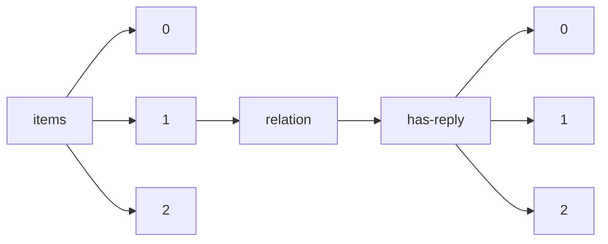

!!! warning "This document is not official Crossref documentation"
# Elements
PATH = items/array/relation/has-reply/array(1)  
Occurs 55 655 times  
{ .annotate }

1. A route to an element, for example:  
   The route "items/array/relation/has-reply/array" corresponds to navigating through the JSON indices as  
   ["items"][0]["relation"]["has-reply"][0]  

## Asserted-by
See more information: [items/array/relation/has-reply/array/asserted-by](asserted-by/index.md)  
Occurs 55 655 timess  
Unique values: 2  

| **Row** | **Value** `String` | **Count** `Int64` |
|--------:|----------------------:|---------------------:|
| **1**   | subject               | 28 245               |
| **2**   | object                | 27 410               |

## Id
See more information: [items/array/relation/has-reply/array/id](id/index.md)  
Occurs 55 655 timess  
Unique values: > 999  

!!! note "Due to current limitations, only the first 1,000 unique values are counted."

| **Row** | **Value** `String`      | **Count** `Int64` |
|--------:|---------------------------:|---------------------:|
| **1**   | 10.5194/cp-2018-19-AC6     | 5                    |
| **2**   | 10.5194/bg-2019-307-AC1    | 5                    |
| **3**   | 10.5194/cp-2018-89-AC1     | 4                    |
| **4**   | 10.5194/nhess-2019-344-AC1 | 4                    |
| **5**   | 10.5194/bg-2020-76-AC1     | 4                    |
| **6**   | 10.5194/esd-2018-36-AC3    | 4                    |
| **7**   | 10.5194/amt-2018-435-AC1   | 4                    |
| **8**   | 10.5194/amt-2017-401-AC1   | 4                    |
| **9**   | 10.5194/amt-2020-121-AC1   | 4                    |
| **10**  | 10.5194/amt-2019-408-AC1   | 4                    |
| ... | ... | ... |

## Id-type
See more information: [items/array/relation/has-reply/array/id-type](id-type/index.md)  
Occurs 55 655 timess  
Unique values: 3  

| **Row** | **Value** `String` | **Count** `Int64` |
|--------:|----------------------:|---------------------:|
| **1**   | doi                   | 55 599               |
| **2**   | uri                   | 55                   |
| **3**   | isbn                  | 1                    |

