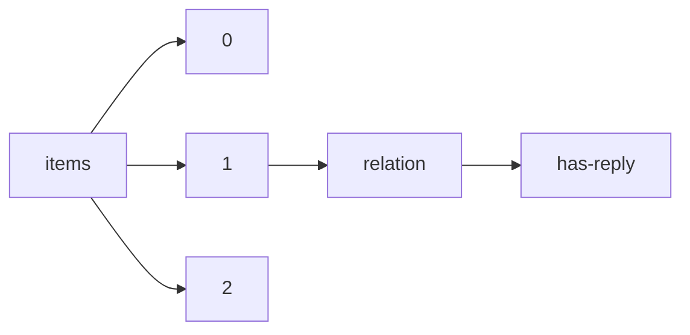

!!! warning "This document is not official Crossref documentation"
# Has-reply
PATH = items/array/relation/has-reply(1)  
Occurs 26 149 times  
{ .annotate }

1. A route to an element, for example:  
   The route "items/array/relation/has-reply" corresponds to navigating through the JSON indices as  
   ["items"][0]["relation"]["has-reply"]  

## Properties of Array
See information about elements: [items/array/relation/has-reply/array](array/index.md)  
Distribution of lengths:  

| **Row** | **Length** `Any` | **Count** `Int64` |
|--------:|--------------------:|---------------------:|
| **1**   | 1                   | 874                  |
| **2**   | 2                   | 23 315               |
| **3**   | 3                   | 158                  |
| **4**   | 4                   | 1 593                |
| **5**   | 5                   | 25                   |
| **6**   | 6                   | 151                  |
| **7**   | 7                   | 2                    |
| **8**   | 8                   | 25                   |
| **9**   | 10                  | 6                    |

