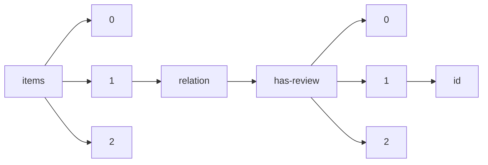

!!! warning "This document is not official Crossref documentation"
# Id
PATH = items/array/relation/has-review/array/id(1)  
Occurs 337 735 times  
Unique values: > 999  
{ .annotate }

1. A route to an element, for example:  
   The route "items/array/relation/has-review/array/id" corresponds to navigating through the JSON indices as  
   ["items"][0]["relation"]["has-review"][0]["id"]  

!!! note "Due to current limitations, only the first 1,000 unique values are counted."

| **Row** | **Value** `String`               | **Count** `Int64` |
|--------:|------------------------------------:|---------------------:|
| **1**   | 978-967-13147-0-8                   | 406                  |
| **2**   | 2289-8506                           | 323                  |
| **3**   | 0128-2603                           | 174                  |
| **4**   | 0128-2611                           | 84                   |
| **5**   | 0128-259X                           | 83                   |
| **6**   | 0128-3103                           | 65                   |
| **7**   | 2181-1091                           | 37                   |
| **8**   | 2181-9939                           | 35                   |
| **9**   | 2636-9168                           | 9                    |
| **10**  | 2180-0421                           | 8                    |
| **11**  | 10.5194/cp-2020-164-AC1             | 8                    |
| **12**  | 2181-8584                           | 7                    |
| **13**  | 10.5194/bg-2021-276-AC1             | 7                    |
| **14**  | 10.5194/tc-2021-175-AC1             | 6                    |
| **15**  | 10.5194/mr-2021-46-AC1              | 6                    |
| **16**  | 10.5194/essd-2022-171-AC2           | 5                    |
| **17**  | 10.5194/gmd-2021-338-AC1            | 5                    |
| **18**  | 10.5194/mr-2020-37-AC1              | 5                    |
| **19**  | 10.5194/tc-2020-28-AC1              | 5                    |
| **20**  | 10.5194/tc-2021-396-AC1             | 5                    |
| **21**  | 10.5194/os-2018-89-AC1              | 5                    |
| **22**  | 10.5194/acp-2020-1237-AC1           | 5                    |
| **23**  | 10.5194/tc-2020-345-AC1             | 5                    |
| **24**  | 10.5194/tc-2020-259-AC1             | 5                    |
| **25**  | 10.5194/amt-2022-148-AC1            | 5                    |
| **26**  | 10.5194/egusphere-2022-1102-AC1     | 5                    |
| **27**  | 10.5194/amt-2020-414-AC1            | 5                    |
| **28**  | 10.5194/acp-2021-981-AC1            | 5                    |
| **29**  | 10.5194/gmd-2021-128-AC2            | 5                    |
| **30**  | 10.5194/gmd-2022-39-AC1             | 5                    |
| **31**  | 10.5194/gchron-2020-31-AC3          | 5                    |
| **32**  | 10.5194/essd-2020-289-RC2           | 4                    |
| **33**  | 10.5194/bg-2020-430-RC3             | 4                    |
| **34**  | 10.5194/soil-2020-75-RC3            | 4                    |
| **35**  | 10.5194/essd-2019-142-RC1           | 4                    |
| **36**  | 10.5194/soil-2020-75-RC2            | 4                    |
| **37**  | 10.5194/acp-2021-320-AC1            | 4                    |
| **38**  | 10.5194/wcd-2021-13-RC2             | 4                    |
| **39**  | 10.5194/egusphere-2022-294-AC1      | 4                    |
| **40**  | 10.5194/egusphere-2022-268-AC1      | 4                    |
| **41**  | 10.5194/amt-2021-57-RC1             | 4                    |
| **42**  | 10.5194/tc-2020-374-RC1             | 4                    |
| **43**  | 10.5194/tc-2020-330-RC1             | 4                    |
| **44**  | 10.5194/acp-2021-17-RC2             | 4                    |
| **45**  | 10.5194/os-2020-123-RC1             | 4                    |
| **46**  | 10.5194/tc-2021-249-AC1             | 4                    |
| **47**  | 10.5194/amt-2021-29-RC3             | 4                    |
| **48**  | 10.5194/egusphere-2022-294-RC1      | 4                    |
| **49**  | 10.5194/egusphere-2022-965-AC1      | 4                    |
| **50**  | 10.5194/acp-2020-1009-RC2           | 4                    |
| **51**  | 10.5194/egusphere-2022-638-AC1      | 4                    |
| **52**  | 10.5194/amt-2021-29-RC1             | 4                    |
| **53**  | 10.5194/acp-2019-1004-AC1           | 4                    |
| **54**  | 10.5194/os-2020-113-AC1             | 4                    |
| **55**  | 10.5194/gmd-2021-99-AC1             | 4                    |
| **56**  | 10.5194/acp-2022-604-AC1            | 4                    |
| **57**  | 10.5194/egusphere-2022-294-CEC1     | 4                    |
| **58**  | 10.5194/tc-2020-109-AC1             | 4                    |
| **59**  | 10.5194/acp-2020-582-AC1            | 4                    |
| **60**  | 10.5194/se-2020-215-RC1             | 4                    |
| **61**  | 10.5194/amt-2021-29-RC2             | 4                    |
| **62**  | 10.5194/tc-2022-44-AC1              | 4                    |
| **63**  | 10.5194/essd-2021-140-AC1           | 4                    |
| **64**  | 10.5194/soil-2020-75-RC4            | 4                    |
| **65**  | 10.5194/egusphere-2022-294-AC3      | 4                    |
| **66**  | 10.5194/egusphere-2022-226-AC1      | 4                    |
| **67**  | 10.5194/se-2020-215-RC2             | 4                    |
| **68**  | 10.5194/esurf-2020-105-RC1          | 4                    |
| **69**  | 10.5194/acp-2020-1009-RC1           | 4                    |
| **70**  | 10.5194/hess-2020-429-AC1           | 4                    |
| **71**  | 10.5194/gmd-2022-250-AC1            | 4                    |
| **72**  | 10.5194/bg-2021-244-AC1             | 4                    |
| **73**  | 10.5194/acp-2021-17-RC1             | 4                    |
| **74**  | 10.5194/tc-2020-50-AC2              | 4                    |
| **75**  | 10.5194/hess-2020-169-AC1           | 4                    |
| **76**  | 10.5194/essd-2021-48-AC5            | 4                    |
| **77**  | 10.5194/cp-2020-142-AC1             | 4                    |
| **78**  | 10.5194/essd-2020-327-AC1           | 4                    |
| **79**  | 10.5194/cp-2021-143-AC1             | 4                    |
| **80**  | 10.5194/acp-2022-438-AC1            | 4                    |
| **81**  | 10.5194/egusphere-2022-294-RC2      | 4                    |
| **82**  | 10.5194/tc-2020-312-AC4             | 4                    |
| **83**  | 10.5194/egusphere-2022-980-AC2      | 4                    |
| **84**  | 10.5194/esd-2022-5-AC1              | 4                    |
| **85**  | 10.5194/os-2020-119-RC1             | 4                    |
| **86**  | 2636-915X                           | 4                    |
| **87**  | 10.5194/acp-2020-801-AC1            | 4                    |
| **88**  | 10.5194/amt-2020-395-AC1            | 4                    |
| **89**  | 10.5194/bg-2020-438-RC2             | 4                    |
| **90**  | 10.5194/gmd-2022-63-AC1             | 4                    |
| **91**  | 10.5194/gc-2021-2-AC1               | 4                    |
| **92**  | 10.5194/esurf-2020-105-RC2          | 4                    |
| **93**  | 10.5194/essd-2021-274-AC1           | 4                    |
| **94**  | 10.5194/egusphere-2022-738-AC1      | 4                    |
| **95**  | 10.5194/cp-2019-81-AC1              | 4                    |
| **96**  | 10.5194/egusphere-2022-294-CEC2     | 4                    |
| **97**  | 10.5194/hess-2021-597-AC1           | 4                    |
| **98**  | 10.5194/tc-2020-339-AC1             | 4                    |
| **99**  | 10.5194/amt-2021-4-AC4              | 4                    |
| **100** | 10.5194/acp-2022-91-AC1             | 4                    |
| **101** | 10.5194/amt-2020-313-AC1            | 4                    |
| **102** | 10.5194/acp-2020-1322-AC1           | 4                    |
| **103** | 10.5194/os-2020-119-EC1             | 4                    |
| **104** | 10.5194/amt-2020-122-AC1            | 4                    |
| **105** | 10.5194/egusphere-2022-294-CEC3     | 4                    |
| **106** | 10.5194/nhess-2022-120-AC4          | 4                    |
| **107** | 10.5194/egusphere-2022-164-AC1      | 4                    |
| **108** | 10.5194/essd-2022-269-AC1           | 4                    |
| **109** | 10.5194/gmd-2021-339-AC2            | 4                    |
| **110** | 10.5194/hess-2021-120-AC1           | 4                    |
| **111** | 10.5194/esd-2021-100-AC2            | 4                    |
| **112** | 10.5194/gmd-2018-96-AC1             | 4                    |
| **113** | 10.5194/bg-2020-367-AC2             | 4                    |
| **114** | 10.5194/wes-2022-11-AC1             | 4                    |
| **115** | 10.5194/hess-2021-64-AC1            | 4                    |
| **116** | 10.5194/essd-2022-103-AC1           | 4                    |
| **117** | 10.5194/tc-2020-330-RC3             | 4                    |
| **118** | 10.5194/bg-2020-356-AC2             | 4                    |
| **119** | 10.5194/esurf-2021-90-AC1           | 4                    |
| **120** | 10.5194/wcd-2022-49-AC1             | 4                    |
| **121** | 10.5194/egusphere-2022-733-AC2      | 4                    |
| **122** | 10.5194/acp-2021-744-AC1            | 4                    |
| **123** | 10.5194/hess-2020-235-AC1           | 4                    |
| **124** | 10.5194/acp-2022-202-AC1            | 4                    |
| **125** | 10.5194/mr-2022-4-AC1               | 4                    |
| **126** | 10.5194/gmd-2020-302-AC1            | 4                    |
| **127** | 10.5194/acp-2022-720-AC1            | 4                    |
| **128** | 10.5194/egusphere-2022-294-AC2      | 4                    |
| **129** | 10.5194/gmd-2021-20-AC1             | 4                    |
| **130** | 10.5194/acp-2022-330-AC1            | 4                    |
| **131** | 10.5194/acp-2021-160-AC1            | 4                    |
| **132** | 10.5194/amt-2020-466-AC1            | 4                    |
| **133** | 10.5194/esurf-2022-1-AC1            | 4                    |
| **134** | 10.5194/acp-2016-109-RC3            | 3                    |
| **135** | 10.5194/acp-2015-928-RC1            | 3                    |
| **136** | 10.5194/hess-2020-349-RC1           | 3                    |
| **137** | 10.5194/mr-2021-18-RC1              | 3                    |
| **138** | 10.5194/gi-2016-1-RC1               | 3                    |
| **139** | 10.5194/bg-2016-401-RC2             | 3                    |
| **140** | 10.5194/mr-2021-15-RC2              | 3                    |
| **141** | 10.5194/gmd-2021-3-RC1              | 3                    |
| **142** | 10.5194/bg-2016-55-RC1              | 3                    |
| **143** | 10.5194/esd-2021-41-RC1             | 3                    |
| **144** | 10.5194/amt-2020-295-RC1            | 3                    |
| **145** | 10.5194/bg-2016-289-RC3             | 3                    |
| **146** | 10.5194/tc-2020-261-RC4             | 3                    |
| **147** | 10.5194/cp-2016-41-RC1              | 3                    |
| **148** | 10.5194/essd-2020-173-RC2           | 3                    |
| **149** | 10.5194/amt-2016-111-RC1            | 3                    |
| **150** | 10.5194/egusphere-2022-268-RC1      | 3                    |
| **151** | 10.5194/cp-2020-86-RC2              | 3                    |
| **152** | 10.5194/bg-2016-508-RC2             | 3                    |
| **153** | 10.5194/hess-2018-329-AC3           | 3                    |
| **154** | 10.5194/acp-2020-985-RC2            | 3                    |
| **155** | 10.5194/angeo-2020-86-AC2           | 3                    |
| **156** | 10.5194/acp-2016-135-RC1            | 3                    |
| **157** | 10.5194/acp-2015-671-RC1            | 3                    |
| **158** | 10.5194/hess-2020-425-RC2           | 3                    |
| **159** | 10.5194/essd-2022-328-AC1           | 3                    |
| **160** | 10.5194/acp-2021-738-AC1            | 3                    |
| **161** | 10.5194/bg-2015-654-RC1             | 3                    |
| **162** | 10.5194/amt-2016-212-RC2            | 3                    |
| **163** | 10.5194/essd-2022-328-AC3           | 3                    |
| **164** | 10.5194/tc-2016-161-RC1             | 3                    |
| **165** | 10.5194/bg-2020-251-RC1             | 3                    |
| **166** | 10.5194/hess-2016-246-EC1           | 3                    |
| **167** | 10.5194/amt-2016-206-RC2            | 3                    |
| **168** | 10.1098/RSPB.2022.1784/v2/decision1 | 3                    |
| **169** | 10.5194/essd-2020-319-RC1           | 3                    |
| **170** | 10.5194/egusphere-2022-96-RC2       | 3                    |
| **171** | 10.5194/acp-2020-1052-RC1           | 3                    |
| **172** | 10.5194/tc-2020-210-AC1             | 3                    |
| **173** | 10.5194/acp-2020-986-RC1            | 3                    |
| **174** | 10.5194/acp-2020-937-RC2            | 3                    |
| **175** | 10.5194/amt-2016-207-RC2            | 3                    |
| **176** | 10.5194/gmd-2020-417-RC1            | 3                    |
| **177** | 10.5194/acp-2016-421-RC1            | 3                    |
| **178** | 10.5194/hess-2016-210-RC2           | 3                    |
| **179** | 10.5194/bg-2020-112-RC2             | 3                    |
| **180** | 10.5194/bg-2016-49-RC2              | 3                    |
| **181** | 10.5194/acp-2016-87-RC1             | 3                    |
| **182** | 10.5194/hess-2020-425-RC1           | 3                    |
| **183** | 10.5194/amt-2022-201-AC1            | 3                    |
| **184** | 10.5194/acp-2016-308-RC1            | 3                    |
| **185** | 10.5194/amt-2016-111-RC3            | 3                    |
| **186** | 10.1098/RSPB.2022.2179/v1/review1   | 3                    |
| **187** | 10.5194/acp-2016-221-RC2            | 3                    |
| **188** | 10.5194/amt-2016-389-RC1            | 3                    |
| **189** | 10.5194/gi-2015-47-RC2              | 3                    |
| **190** | 10.5194/amt-2021-10-RC3             | 3                    |
| **191** | 10.5194/amt-2020-327-RC1            | 3                    |
| **192** | 10.5194/acp-2016-62-RC1             | 3                    |
| **193** | 10.5194/os-2016-24-RC2              | 3                    |
| **194** | 10.5194/egusphere-2022-43-CC1       | 3                    |
| **195** | 10.5194/acp-2021-300-RC2            | 3                    |
| **196** | 10.5194/hess-2016-257-RC2           | 3                    |
| **197** | 10.5194/acp-2020-275-RC1            | 3                    |
| **198** | 10.5194/amt-2016-18-RC2             | 3                    |
| **199** | 10.5194/gc-2022-5-AC2               | 3                    |
| **200** | 10.5194/nhess-2016-263-RC3          | 3                    |
| **201** | 10.5194/os-2020-95-RC2              | 3                    |
| **202** | 10.5194/amt-2020-390-RC2            | 3                    |
| **203** | 10.5194/tc-2020-294-RC1             | 3                    |
| **204** | 10.5194/acp-2015-1054-RC1           | 3                    |
| **205** | 10.5194/cp-2015-175-RC2             | 3                    |
| **206** | 10.1098/RSPB.2022.2020/v1/decision1 | 3                    |
| **207** | 10.5194/esurf-2020-105-AC1          | 3                    |
| **208** | 10.5194/wes-2020-105-RC2            | 3                    |
| **209** | 10.5194/egusphere-2022-43-AC1       | 3                    |
| **210** | 10.5194/gmd-2020-282-RC2            | 3                    |
| **211** | 10.5194/gmd-2016-44-RC1             | 3                    |
| **212** | 10.5194/bg-2016-79-RC1              | 3                    |
| **213** | 10.5194/mr-2021-15-RC1              | 3                    |
| **214** | 10.1098/RSOB.220363/v1/review1      | 3                    |
| **215** | 10.5194/acp-2020-868-RC1            | 3                    |
| **216** | 10.5194/acp-2020-951-RC2            | 3                    |
| **217** | 10.5194/acp-2021-210-AC1            | 3                    |
| **218** | 10.5194/acp-2020-862-RC2            | 3                    |
| **219** | 10.5194/amt-2020-267-RC2            | 3                    |
| **220** | 10.1098/RSPB.2022.2094/v1/review2   | 3                    |
| **221** | 10.5194/amt-2020-260-AC1            | 3                    |
| **222** | 10.5194/tc-2020-154-RC3             | 3                    |
| **223** | 10.5194/acp-2016-1022-RC2           | 3                    |
| **224** | 10.5194/amt-2016-389-RC4            | 3                    |
| **225** | 10.5194/nhess-2020-362-RC1          | 3                    |
| **226** | 10.5194/gi-2016-40-RC2              | 3                    |
| **227** | 10.5194/cp-2020-149-AC1             | 3                    |
| **228** | 10.5194/amt-2020-360-RC1            | 3                    |
| **229** | 10.5194/hess-2016-59-RC1            | 3                    |
| **230** | 10.5194/tc-2020-135-RC1             | 3                    |
| **231** | 10.5194/amt-2020-87-RC2             | 3                    |
| **232** | 10.5194/gchron-2020-38-RC1          | 3                    |
| **233** | 10.5194/wcd-2022-7-AC1              | 3                    |
| **234** | 10.5194/soil-2016-18-RC1            | 3                    |
| **235** | 10.5194/soil-2021-78-AC1            | 3                    |
| **236** | 10.5194/egusphere-2022-377-RC1      | 3                    |
| **237** | 10.5194/hess-2015-533-RC1           | 3                    |
| **238** | 10.5194/egusphere-2022-513-AC1      | 3                    |
| **239** | 10.5194/essd-2020-173-RC1           | 3                    |
| **240** | 10.5194/bg-2016-196-RC2             | 3                    |
| **241** | 10.5194/acp-2020-1041-RC2           | 3                    |
| **242** | 10.5194/acp-2020-837-RC2            | 3                    |
| **243** | 10.5194/wes-2020-111-RC2            | 3                    |
| **244** | 10.5194/tc-2020-356-AC1             | 3                    |
| **245** | 10.5194/egusphere-2022-43-RC1       | 3                    |
| **246** | 10.5194/bg-2015-640-RC1             | 3                    |
| **247** | 10.5194/amt-2020-347-AC2            | 3                    |
| **248** | 10.5194/wes-2020-66-AC1             | 3                    |
| **249** | 10.5194/gchron-2020-26-AC2          | 3                    |
| **250** | 10.5194/tc-2020-37-AC1              | 3                    |
| **251** | 10.5194/tc-2020-155-RC2             | 3                    |
| **252** | 10.5194/gmd-2020-225-RC2            | 3                    |
| **253** | 10.5194/essd-2022-61-RC1            | 3                    |
| **254** | 10.5194/cp-2020-127-AC1             | 3                    |
| **255** | 10.5194/tc-2020-96-AC1              | 3                    |
| **256** | 10.5194/egusphere-2022-635-RC2      | 3                    |
| **257** | 10.5194/se-2020-137-AC1             | 3                    |
| **258** | 10.5194/esurf-2016-1-RC1            | 3                    |
| **259** | 10.5194/gmd-2020-424-AC1            | 3                    |
| **260** | 10.5194/amt-2020-192-RC1            | 3                    |
| **261** | 10.5194/hess-2020-136-RC2           | 3                    |
| **262** | 10.5194/egusphere-2022-377-AC1      | 3                    |
| **263** | 10.1098/RSPB.2022.1986/v2/decision1 | 3                    |
| **264** | 10.5194/tc-2022-113-RC1             | 3                    |
| **265** | 10.5194/bg-2020-123-AC3             | 3                    |
| **266** | 10.5194/egusphere-2022-62-AC1       | 3                    |
| **267** | 10.1098/RSPB.2022.2319/v1/review1   | 3                    |
| **268** | 10.1098/RSPB.2022.2179/v2/decision1 | 3                    |
| **269** | 10.1098/RSPB.2022.1702/v1/decision1 | 3                    |
| **270** | 10.5194/acp-2015-840-RC1            | 3                    |
| **271** | 10.5194/amt-2016-191-RC1            | 3                    |
| **272** | 10.5194/egusphere-2022-43-AC2       | 3                    |
| **273** | 10.1098/RSOB.220363/v2/decision1    | 3                    |
| **274** | 10.5194/hess-2015-533-RC2           | 3                    |
| **275** | 10.5194/essd-2022-188-RC2           | 3                    |
| **276** | 10.5194/amt-2020-224-AC1            | 3                    |
| **277** | 10.5194/bg-2020-356-AC1             | 3                    |
| **278** | 10.5194/gmd-2016-144-RC2            | 3                    |
| **279** | 10.5194/tc-2020-175-AC1             | 3                    |
| **280** | 10.5194/amt-2022-196-RC1            | 3                    |
| **281** | 10.5194/esurf-2015-56-RC1           | 3                    |
| **282** | 10.5194/tc-2021-161-AC1             | 3                    |
| **283** | 10.1098/RSPB.2022.1702/v1/review2   | 3                    |
| **284** | 10.5194/bg-2020-396-AC1             | 3                    |
| **285** | 10.5194/amt-2022-250-AC3            | 3                    |
| **286** | 10.5194/amt-2022-265-AC1            | 3                    |
| **287** | 10.5194/essd-2022-328-RC2           | 3                    |
| **288** | 10.5194/mr-2021-26-RC1              | 3                    |
| **289** | 10.5194/os-2016-41-RC2              | 3                    |
| **290** | 10.5194/tc-2020-217-AC3             | 3                    |
| **291** | 10.5194/gmd-2020-249-AC1            | 3                    |
| **292** | 10.5194/amt-2016-191-RC2            | 3                    |
| **293** | 10.5194/bg-2020-194-AC1             | 3                    |
| **294** | 10.5194/egusphere-2022-638-RC2      | 3                    |
| **295** | 10.5194/hess-2020-176-AC4           | 3                    |
| **296** | 10.5194/egusphere-2022-96-AC1       | 3                    |
| **297** | 10.5194/cp-2020-112-AC1             | 3                    |
| **298** | 10.5194/acp-2019-973-RC1            | 3                    |
| **299** | 10.5194/egusphere-2022-797-AC2      | 3                    |
| **300** | 10.1098/RSPB.2022.1494/v2/review1   | 3                    |
| **301** | 10.5194/tc-2020-310-AC1             | 3                    |
| **302** | 10.5194/tc-2020-243-AC1             | 3                    |
| **303** | 10.5194/essd-2022-245-AC2           | 3                    |
| **304** | 10.5194/egusphere-2022-43-AC3       | 3                    |
| **305** | 10.5194/acp-2021-114-AC1            | 3                    |
| **306** | 10.5194/gmd-2016-144-RC1            | 3                    |
| **307** | 10.5194/acp-2016-421-RC2            | 3                    |
| **308** | 10.5194/acp-2020-845-AC1            | 3                    |
| **309** | 10.5194/egusphere-2022-141-AC1      | 3                    |
| **310** | 10.5194/esurf-2015-56-RC2           | 3                    |
| **311** | 10.5194/egusphere-2022-168-AC2      | 3                    |
| **312** | 10.5194/gmd-2020-269-AC2            | 3                    |
| **313** | 10.5194/amt-2019-497-AC1            | 3                    |
| **314** | 10.5194/cp-2020-1-AC1               | 3                    |
| **315** | 10.5194/os-2020-100-AC1             | 3                    |
| **316** | 10.1098/RSPB.2022.1986/v2/review1   | 3                    |
| **317** | 10.5194/egusphere-2022-638-RC1      | 3                    |
| **318** | 10.5194/esurf-2016-1-RC2            | 3                    |
| **319** | 10.5194/egusphere-2022-568-RC1      | 3                    |
| **320** | 10.5194/egusphere-2022-513-RC2      | 3                    |
| **321** | 10.5194/cp-2021-63-AC1              | 3                    |
| **322** | 10.5194/tc-2016-133-RC2             | 3                    |
| **323** | 10.5194/tc-2016-133-RC3             | 3                    |
| **324** | 10.5194/acp-2016-596-RC2            | 3                    |
| **325** | 10.5194/egusphere-2022-96-RC1       | 3                    |
| **326** | 10.5194/amt-2016-199-RC2            | 3                    |
| **327** | 10.5194/amt-2020-404-AC2            | 3                    |
| **328** | 10.5194/gmd-2021-433-AC1            | 3                    |
| **329** | 10.5194/acp-2016-599-RC2            | 3                    |
| **330** | 10.5194/egusphere-2022-966-RC1      | 3                    |
| **331** | 10.5194/egusphere-2022-491-CC1      | 3                    |
| **332** | 10.5194/tc-2020-217-AC2             | 3                    |
| **333** | 10.5194/egusphere-2022-268-CC1      | 3                    |
| **334** | 10.5194/tc-2020-107-AC2             | 3                    |
| **335** | 10.5194/acp-2016-599-RC1            | 3                    |
| **336** | 10.5194/gmd-2022-250-RC2            | 3                    |
| **337** | 10.5194/tc-2021-208-AC1             | 3                    |
| **338** | 10.5194/egusphere-2022-777-RC1      | 3                    |
| **339** | 10.5194/gmd-2020-148-AC1            | 3                    |
| **340** | 10.5194/acp-2020-985-RC3            | 3                    |
| **341** | 10.5194/amt-2020-492-RC2            | 3                    |
| **342** | 10.5194/os-2020-119-AC1             | 3                    |
| **343** | 10.5194/amt-2020-228-RC1            | 3                    |
| **344** | 10.1098/RSOB.220363/v1/decision1    | 3                    |
| **345** | 10.5194/wcd-2022-7-RC1              | 3                    |
| **346** | 10.5194/acp-2016-940-RC3            | 3                    |
| **347** | 10.5194/essd-2022-188-AC4           | 3                    |
| **348** | 10.5194/wes-2021-56-AC1             | 3                    |
| **349** | 10.5194/acp-2016-656-RC1            | 3                    |
| **350** | 10.5194/essd-2022-245-AC3           | 3                    |
| **351** | 10.5194/tc-2016-208-RC2             | 3                    |
| **352** | 10.5194/esd-2020-4-RC1              | 3                    |
| **353** | 10.5194/wes-2020-115-AC1            | 3                    |
| **354** | 10.5194/acp-2016-439-RC2            | 3                    |
| **355** | 10.5194/amt-2016-212-RC1            | 3                    |
| **356** | 10.5194/acp-2016-864-RC1            | 3                    |
| **357** | 10.5194/nhess-2020-192-RC4          | 3                    |
| **358** | 10.5194/acp-2020-862-RC1            | 3                    |
| **359** | 10.5194/tc-2020-291-AC1             | 3                    |
| **360** | 10.1098/RSPB.2022.2179/v2/review1   | 3                    |
| **361** | 10.5194/gmd-2021-426-AC2            | 3                    |
| **362** | 10.5194/os-2016-61-RC1              | 3                    |
| **363** | 10.5194/bg-2016-49-RC1              | 3                    |
| **364** | 10.5194/hess-2015-533-RC3           | 3                    |
| **365** | 10.5194/acp-2018-1333-AC1           | 3                    |
| **366** | 10.5194/tc-2016-13-EC1              | 3                    |
| **367** | 10.5194/acp-2016-273-RC1            | 3                    |
| **368** | 10.5194/bg-2022-31-AC4              | 3                    |
| **369** | 10.5194/nhess-2016-156-RC1          | 3                    |
| **370** | 10.5194/amt-2021-166-AC1            | 3                    |
| **371** | 10.5194/acp-2020-285-RC1            | 3                    |
| **372** | 10.5194/gmd-2016-248-RC3            | 3                    |
| **373** | 10.5194/amt-2016-237-RC2            | 3                    |
| **374** | 10.5194/gmd-2016-252-RC2            | 3                    |
| **375** | 10.5194/cp-2016-85-RC1              | 3                    |
| **376** | 10.5194/hess-2020-338-RC2           | 3                    |
| **377** | 10.5194/acp-2016-267-RC2            | 3                    |
| **378** | 10.5194/gmd-2021-51-AC1             | 3                    |
| **379** | 10.5194/gmd-2016-248-RC2            | 3                    |
| **380** | 10.1098/RSPB.2022.2179/v3/decision1 | 3                    |
| **381** | 10.5194/egusphere-2022-168-RC1      | 3                    |
| **382** | 10.5194/cp-2020-86-RC3              | 3                    |
| **383** | 10.5194/egusphere-2022-181-AC1      | 3                    |
| **384** | 10.5194/egusphere-2022-588-RC1      | 3                    |
| **385** | 10.5194/essd-2016-49-RC1            | 3                    |
| **386** | 10.5194/bg-2016-251-RC1             | 3                    |
| **387** | 10.5194/tc-2020-235-RC1             | 3                    |
| **388** | 10.5194/esd-2021-94-AC2             | 3                    |
| **389** | 10.5194/egusphere-2022-62-RC2       | 3                    |
| **390** | 10.5194/acp-2016-109-RC2            | 3                    |
| **391** | 10.5194/amt-2016-40-RC1             | 3                    |
| **392** | 10.5194/amt-2020-137-RC1            | 3                    |
| **393** | 10.5194/essd-2022-328-RC4           | 3                    |
| **394** | 10.5194/hess-2016-141-RC2           | 3                    |
| **395** | 10.5194/bg-2020-340-AC1             | 3                    |
| **396** | 10.1098/RSPB.2022.1897/v1/decision1 | 3                    |
| **397** | 10.1098/RSOB.220363/v1/review3      | 3                    |
| **398** | 10.5194/esd-2016-19-RC1             | 3                    |
| **399** | 10.5194/acp-2016-198-RC2            | 3                    |
| **400** | 10.5194/soil-2016-19-RC1            | 3                    |
| **401** | 10.5194/gchron-2021-16-AC1          | 3                    |
| **402** | 10.5194/acp-2015-840-RC2            | 3                    |
| **403** | 10.5194/wes-2022-49-AC1             | 3                    |
| **404** | 10.5194/gmd-2020-294-RC2            | 3                    |
| **405** | 10.5194/acp-2020-18-RC1             | 3                    |
| **406** | 10.5194/egusphere-2022-43-RC3       | 3                    |
| **407** | 10.5194/hess-2020-169-EC1           | 3                    |
| **408** | 10.5194/essd-2022-188-AC3           | 3                    |
| **409** | 10.5194/acp-2019-1067-RC3           | 3                    |
| **410** | 10.5194/amt-2020-369-AC1            | 3                    |
| **411** | 10.1098/RSPB.2022.2094/v2/decision1 | 3                    |
| **412** | 10.5194/acp-2016-726-RC1            | 3                    |
| **413** | 10.5194/os-2020-119-AC3             | 3                    |
| **414** | 10.5194/acp-2015-732-RC2            | 3                    |
| **415** | 10.1098/RSPB.2022.2319/v1/review2   | 3                    |
| **416** | 10.5194/essd-2022-188-EC1           | 3                    |
| **417** | 10.5194/acp-2019-1067-RC2           | 3                    |
| **418** | 10.5194/esurf-2022-7-AC1            | 3                    |
| **419** | 10.5194/acp-2020-744-RC2            | 3                    |
| **420** | 10.5194/egusphere-2022-966-CC2      | 3                    |
| **421** | 10.5194/amt-2016-351-RC1            | 3                    |
| **422** | 10.5194/tc-2020-209-AC1             | 3                    |
| **423** | 10.5194/amt-2016-327-RC1            | 3                    |
| **424** | 10.5194/tc-2020-243-RC2             | 3                    |
| **425** | 10.5194/gmd-2022-113-AC3            | 3                    |
| **426** | 10.5194/amt-2015-364-RC1            | 3                    |
| **427** | 10.5194/angeo-2020-86-AC1           | 3                    |
| **428** | 10.5194/egusphere-2022-304-RC1      | 3                    |
| **429** | 10.5194/cp-2015-186-RC2             | 3                    |
| **430** | 10.5194/gmd-2020-210-AC1            | 3                    |
| **431** | 10.5194/gi-2016-1-RC2               | 3                    |
| **432** | 10.5194/acp-2021-153-AC1            | 3                    |
| **433** | 10.5194/egusphere-2022-43-RC2       | 3                    |
| **434** | 10.5194/tc-2016-159-RC2             | 3                    |
| **435** | 10.5194/esd-2020-47-AC1             | 3                    |
| **436** | 10.5194/egusphere-2022-824-AC2      | 3                    |
| **437** | 10.5194/essd-2022-188-AC1           | 3                    |
| **438** | 10.5194/amt-2020-292-AC1            | 3                    |
| **439** | 10.1098/RSOB.220363/v2/response1    | 3                    |
| **440** | 10.1098/RSPB.2022.2319/v1/decision1 | 3                    |
| **441** | 10.5194/egusphere-2022-270-AC1      | 3                    |
| **442** | 10.5194/essd-2022-188-RC1           | 3                    |
| **443** | 10.5194/nhess-2016-309-RC2          | 3                    |
| **444** | 10.5194/essd-2022-245-AC1           | 3                    |
| **445** | 10.1098/RSPB.2022.1986/v1/decision1 | 3                    |
| **446** | 10.1098/RSPB.2022.2094/v1/review1   | 3                    |
| **447** | 10.5194/essd-2021-59-AC2            | 3                    |
| **448** | 10.5194/wes-2020-13-AC1             | 3                    |
| **449** | 10.5194/gmd-2022-3-AC1              | 3                    |
| **450** | 10.5194/gmd-2022-250-RC1            | 3                    |
| **451** | 10.5194/amt-2020-469-AC1            | 3                    |
| **452** | 10.5194/wes-2021-58-AC1             | 3                    |
| **453** | 10.5194/egusphere-2022-4-AC1        | 3                    |
| **454** | 10.5194/essd-2022-171-AC1           | 3                    |
| **455** | 10.1098/RSPB.2022.1897/v1/review1   | 3                    |
| **456** | 10.5194/acp-2019-619-RC2            | 3                    |
| **457** | 10.5194/amt-2016-206-RC1            | 3                    |
| **458** | 10.5194/wcd-2021-53-AC1             | 3                    |
| **459** | 10.5194/amt-2022-196-AC1            | 3                    |
| **460** | 10.5194/mr-2021-34-AC1              | 3                    |
| **461** | 10.5194/essd-2022-328-AC2           | 3                    |
| **462** | 10.5194/amt-2015-340-RC1            | 3                    |
| **463** | 10.5194/se-2016-21-RC2              | 3                    |
| **464** | 10.5194/egusphere-2022-824-RC2      | 3                    |
| **465** | 10.1098/RSPB.2022.1494/v1/decision1 | 3                    |
| **466** | 10.1098/RSPB.2022.1784/v1/review2   | 3                    |
| **467** | 10.5194/egusphere-2022-387-AC2      | 3                    |
| **468** | 10.5194/essd-2022-61-AC1            | 3                    |
| **469** | 10.5194/wcd-2022-50-AC1             | 3                    |
| **470** | 10.5194/amt-2020-265-AC1            | 3                    |
| **471** | 10.5194/npg-2016-49-RC1             | 3                    |
| **472** | 10.5194/gmd-2020-148-AC2            | 3                    |
| **473** | 10.5194/amt-2016-142-RC1            | 3                    |
| **474** | 10.5194/acp-2022-106-AC1            | 3                    |
| **475** | 10.5194/acp-2021-1073-AC1           | 3                    |
| **476** | 10.5194/amt-2020-339-AC1            | 3                    |
| **477** | 10.5194/bg-2016-71-RC1              | 3                    |
| **478** | 10.5194/nhess-2022-137-AC1          | 3                    |
| **479** | 10.5194/acp-2021-1018-AC1           | 3                    |
| **480** | 10.5194/esurf-2022-7-RC1            | 3                    |
| **481** | 10.5194/nhess-2016-309-RC1          | 3                    |
| **482** | 10.5194/egusphere-2022-491-AC1      | 3                    |
| **483** | 10.5194/gchron-2020-33-AC1          | 3                    |
| **484** | 10.5194/egusphere-2022-568-AC1      | 3                    |
| **485** | 10.5194/egusphere-2022-824-RC1      | 3                    |
| **486** | 10.5194/egusphere-2022-270-RC2      | 3                    |
| **487** | 10.5194/gmd-2020-173-AC1            | 3                    |
| **488** | 10.5194/egusphere-2022-268-RC2      | 3                    |
| **489** | 10.5194/bg-2015-640-RC2             | 3                    |
| **490** | 10.5194/amt-2021-327-AC1            | 3                    |
| **491** | 10.5194/acp-2015-840-RC4            | 3                    |
| **492** | 10.5194/tc-2021-120-AC1             | 3                    |
| **493** | 10.5194/egusphere-2022-568-AC2      | 3                    |
| **494** | 10.5194/bg-2021-149-AC1             | 3                    |
| **495** | 10.5194/egusphere-2022-62-RC1       | 3                    |
| **496** | 10.5194/tc-2020-339-AC2             | 3                    |
| **497** | 10.5194/acp-2020-548-AC1            | 3                    |
| **498** | 10.5194/egusphere-2022-141-RC1      | 3                    |
| **499** | 10.5194/egusphere-2022-62-EC1       | 3                    |
| **500** | 10.5194/acp-2021-836-AC1            | 3                    |
| **501** | 10.5194/amt-2021-277-AC2            | 3                    |
| **502** | 10.5194/egusphere-2022-513-RC1      | 3                    |
| **503** | 10.5194/dwes-2020-8-AC1             | 3                    |
| **504** | 10.5194/essd-2022-188-AC2           | 3                    |
| **505** | 10.5194/bg-2016-192-RC2             | 3                    |
| **506** | 10.5194/nhess-2020-265-AC3          | 3                    |
| **507** | 10.5194/egusphere-2022-43-AC4       | 3                    |
| **508** | 10.5194/se-2016-89-RC2              | 3                    |
| **509** | 10.5194/essd-2016-18-RC1            | 3                    |
| **510** | 10.5194/tc-2021-298-AC1             | 3                    |
| **511** | 10.5194/bg-2016-401-RC1             | 3                    |
| **512** | 10.5194/acp-2016-322-RC1            | 3                    |
| **513** | 10.5194/acp-2016-741-RC3            | 3                    |
| **514** | 10.5194/hess-2016-59-RC3            | 3                    |
| **515** | 10.5194/egusphere-2022-96-AC2       | 3                    |
| **516** | 10.5194/esurf-2015-54-RC2           | 3                    |
| **517** | 10.5194/acp-2016-844-RC2            | 3                    |
| **518** | 10.5194/mr-2021-18-RC3              | 3                    |
| **519** | 10.5194/acp-2015-940-RC1            | 3                    |
| **520** | 10.5194/npg-2016-35-RC1             | 3                    |
| **521** | 10.5194/bg-2016-192-RC1             | 3                    |
| **522** | 10.5194/gmd-2021-55-AC3             | 3                    |
| **523** | 10.5194/acp-2016-891-RC1            | 3                    |
| **524** | 10.5194/tc-2016-170-RC1             | 3                    |
| **525** | 10.5194/hess-2021-461-AC2           | 3                    |
| **526** | 10.5194/egusphere-2022-491-AC2      | 3                    |
| **527** | 10.5194/acp-2022-262-AC1            | 3                    |
| **528** | 10.5194/egusphere-2022-168-RC2      | 3                    |
| **529** | 10.5194/npg-2016-49-RC2             | 3                    |
| **530** | 10.1098/RSPB.2022.1986/v2/review2   | 3                    |
| **531** | 10.5194/gmd-2020-249-AC2            | 3                    |
| **532** | 10.5194/egusphere-2022-887-AC1      | 3                    |
| **533** | 10.5194/acp-2022-250-RC2            | 3                    |
| **534** | 10.5194/nhess-2022-137-RC1          | 3                    |
| **535** | 10.5194/os-2016-25-RC2              | 3                    |
| **536** | 10.5194/acp-2016-292-RC2            | 3                    |
| **537** | 10.1098/RSPB.2022.2179/v3/review1   | 3                    |
| **538** | 10.5194/tc-2016-133-RC1             | 3                    |
| **539** | 10.5194/egusphere-2022-887-RC2      | 3                    |
| **540** | 10.5194/hess-2020-548-AC1           | 3                    |
| **541** | 10.5194/essd-2022-328-AC4           | 3                    |
| **542** | 10.5194/amt-2016-48-RC2             | 3                    |
| **543** | 10.5194/acp-2022-216-AC1            | 3                    |
| **544** | 10.5194/acp-2016-695-RC1            | 3                    |
| **545** | 10.5194/essd-2022-188-AC5           | 3                    |
| **546** | 10.5194/bg-2016-251-RC2             | 3                    |
| **547** | 10.5194/esurf-2016-16-RC2           | 3                    |
| **548** | 10.5194/egusphere-2022-513-AC2      | 3                    |
| **549** | 10.5194/gmd-2015-250-RC1            | 3                    |
| **550** | 10.5194/hess-2018-329-AC2           | 3                    |
| **551** | 10.5194/cp-2016-55-RC1              | 3                    |
| **552** | 10.5194/os-2021-112-RC2             | 3                    |
| **553** | 10.1098/RSPB.2022.1494/v1/review1   | 3                    |
| **554** | 10.1098/RSPB.2022.1986/v1/review1   | 3                    |
| **555** | 10.5194/nhess-2015-326-RC2          | 3                    |
| **556** | 10.5194/wcd-2020-53-RC2             | 3                    |
| **557** | 10.5194/hess-2016-198-RC1           | 3                    |
| **558** | 10.5194/nhess-2016-125-RC2          | 3                    |
| **559** | 10.1098/RSPB.2022.2319/v2/decision1 | 3                    |
| **560** | 10.5194/nhess-2015-326-RC1          | 3                    |
| **561** | 10.5194/egusphere-2022-593-RC2      | 3                    |
| **562** | 10.5194/npg-2016-7-RC1              | 3                    |
| **563** | 10.5194/egusphere-2022-270-AC2      | 3                    |
| **564** | 10.5194/acp-2016-322-RC2            | 3                    |
| **565** | 10.5194/acp-2016-680-RC1            | 3                    |
| **566** | 10.1098/RSPB.2022.2020/v2/decision1 | 3                    |
| **567** | 10.5194/acp-2016-935-RC1            | 3                    |
| **568** | 10.5194/wcd-2020-53-RC1             | 3                    |
| **569** | 10.5194/egusphere-2022-268-AC2      | 3                    |
| **570** | 10.5194/acp-2016-470-RC2            | 3                    |
| **571** | 10.5194/amt-2016-142-RC2            | 3                    |
| **572** | 10.5194/nhess-2020-122-RC2          | 3                    |
| **573** | 10.5194/acp-2015-928-RC3            | 3                    |
| **574** | 10.1098/RSPB.2022.2020/v1/review2   | 3                    |
| **575** | 10.5194/essd-2016-49-RC2            | 3                    |
| **576** | 10.5194/egusphere-2022-62-AC2       | 3                    |
| **577** | 10.5194/egusphere-2022-206-RC1      | 3                    |
| **578** | 10.5194/cp-2020-135-AC1             | 3                    |
| **579** | 10.5194/gchron-2022-3-AC1           | 3                    |
| **580** | 10.5194/hess-2020-514-AC1           | 3                    |
| **581** | 10.5194/bg-2016-196-RC1             | 3                    |
| **582** | 10.5194/gmd-2022-85-AC3             | 3                    |
| **583** | 10.1098/RSPB.2022.1784/v3/decision1 | 3                    |
| **584** | 10.5194/acp-2021-666-AC1            | 3                    |
| **585** | 10.5194/essd-2022-328-RC5           | 3                    |
| **586** | 10.1098/RSPB.2022.2094/v1/decision1 | 3                    |
| **587** | 10.5194/amt-2016-128-RC1            | 3                    |
| **588** | 10.5194/gi-2021-11-AC1              | 3                    |
| **589** | 10.5194/hess-2022-313-AC2           | 3                    |
| **590** | 10.5194/acp-2015-966-RC2            | 3                    |
| **591** | 10.5194/cp-2015-186-RC1             | 3                    |
| **592** | 10.5194/amt-2019-103-AC2            | 3                    |
| **593** | 10.5194/acp-2022-276-AC1            | 3                    |
| **594** | 10.5194/essd-2022-328-RC3           | 3                    |
| **595** | 10.5194/egusphere-2022-593-RC1      | 3                    |
| **596** | 10.5194/se-2016-89-RC1              | 3                    |
| **597** | 10.5194/angeo-2020-60-RC2           | 3                    |
| **598** | 10.5194/bg-2016-71-RC2              | 3                    |
| **599** | 10.5194/tc-2016-159-RC1             | 3                    |
| **600** | 10.5194/angeo-2020-64-AC1           | 3                    |
| **601** | 10.5194/egusphere-2022-412-AC3      | 3                    |
| **602** | 10.5194/essd-2022-236-AC2           | 3                    |
| **603** | 10.5194/amt-2020-138-AC1            | 3                    |
| **604** | 10.5194/acp-2020-845-AC2            | 3                    |
| **605** | 10.5194/gmd-2020-312-AC1            | 3                    |
| **606** | 10.5194/se-2016-25-RC1              | 3                    |
| **607** | 10.5194/esd-2021-104-RC1            | 3                    |
| **608** | 10.5194/wcd-2022-7-RC2              | 3                    |
| **609** | 10.5194/acp-2019-619-RC1            | 3                    |
| **610** | 10.5194/hess-2016-276-RC1           | 3                    |
| **611** | 10.5194/tc-2020-232-AC1             | 3                    |
| **612** | 10.5194/nhess-2021-330-AC1          | 3                    |
| **613** | 10.1098/RSPB.2022.2020/v1/review3   | 3                    |
| **614** | 10.5194/esurf-2016-1-RC3            | 3                    |
| **615** | 10.1098/RSOB.220363/v1/review2      | 3                    |
| **616** | 10.5194/se-2016-25-RC2              | 3                    |
| **617** | 10.5194/mr-2021-18-RC2              | 3                    |
| **618** | 10.5194/egusphere-2022-966-AC4      | 3                    |
| **619** | 10.5194/se-2016-21-RC1              | 3                    |
| **620** | 10.5194/essd-2022-61-RC2            | 3                    |
| **621** | 10.5194/gmd-2020-269-AC1            | 3                    |
| **622** | 10.5194/wes-2021-79-AC1             | 3                    |
| **623** | 10.5194/bg-2016-273-RC1             | 3                    |
| **624** | 10.5194/acp-2016-351-RC1            | 3                    |
| **625** | 10.5194/bg-2020-396-AC3             | 3                    |
| **626** | 10.5194/acp-2015-928-RC2            | 3                    |
| **627** | 10.5194/cp-2020-130-AC2             | 3                    |
| **628** | 10.5194/bg-2020-396-AC2             | 3                    |
| **629** | 10.5194/egusphere-2022-168-AC1      | 3                    |
| **630** | 10.5194/egusphere-2022-141-AC2      | 3                    |
| **631** | 10.5194/esurf-2022-7-RC2            | 3                    |
| **632** | 10.5194/acp-2015-840-RC3            | 3                    |
| **633** | 10.5194/amt-2016-128-RC2            | 3                    |
| **634** | 10.5194/acp-2016-584-RC2            | 3                    |
| **635** | 10.5194/esurf-2022-7-RC3            | 3                    |
| **636** | 10.5194/acp-2021-53-AC3             | 3                    |
| **637** | 10.5194/amt-2021-116-AC1            | 3                    |
| **638** | 10.5194/bg-2020-364-AC2             | 3                    |
| **639** | 10.5194/hess-2021-120-AC2           | 3                    |
| **640** | 10.5194/tc-2016-124-RC2             | 3                    |
| **641** | 10.5194/amt-2022-250-AC2            | 3                    |
| **642** | 10.5194/egusphere-2022-377-RC2      | 3                    |
| **643** | 10.5194/acp-2021-460-AC1            | 3                    |
| **644** | 10.5194/wcd-2021-51-AC1             | 3                    |
| **645** | 10.5194/hess-2020-458-AC3           | 3                    |
| **646** | 10.1098/RSPB.2022.1784/v1/review1   | 3                    |
| **647** | 10.5194/acp-2015-966-RC1            | 3                    |
| **648** | 10.5194/nhess-2020-279-AC1          | 3                    |
| **649** | 10.5194/npg-2016-7-RC2              | 3                    |
| **650** | 10.5194/tc-2021-375-AC1             | 3                    |
| **651** | 10.5194/acp-2016-726-RC2            | 3                    |
| **652** | 10.5194/acp-2022-563-AC1            | 3                    |
| **653** | 10.5194/hess-2016-340-RC1           | 3                    |
| **654** | 10.5194/hess-2016-340-RC2           | 3                    |
| **655** | 10.5194/tc-2021-67-AC1              | 3                    |
| **656** | 10.5194/acp-2020-1106-AC1           | 3                    |
| **657** | 10.5194/egusphere-2022-387-RC3      | 3                    |
| **658** | 10.5194/amt-2020-207-AC1            | 3                    |
| **659** | 10.5194/acp-2016-680-RC2            | 3                    |
| **660** | 10.5194/acp-2022-438-RC1            | 3                    |
| **661** | 10.5194/tc-2016-161-RC2             | 3                    |
| **662** | 10.5194/acp-2016-258-RC1            | 3                    |
| **663** | 10.5194/os-2019-101-AC1             | 3                    |
| **664** | 10.5194/acp-2016-439-RC3            | 3                    |
| **665** | 10.5194/cp-2015-175-RC3             | 3                    |
| **666** | 10.5194/hess-2019-590-AC7           | 3                    |
| **667** | 10.5194/acp-2016-694-RC2            | 3                    |
| **668** | 10.5194/acp-2016-345-RC2            | 3                    |
| **669** | 10.5194/wes-2015-3-RC2              | 3                    |
| **670** | 10.5194/gmd-2016-219-RC1            | 3                    |
| **671** | 10.5194/amt-2021-188-AC1            | 3                    |
| **672** | 10.5194/nhess-2021-50-AC1           | 3                    |
| **673** | 10.5194/acp-2021-126-AC1            | 3                    |
| **674** | 10.5194/amt-2016-95-RC1             | 3                    |
| **675** | 10.5194/cp-2016-15-RC1              | 3                    |
| **676** | 10.5194/egusphere-2022-387-RC1      | 3                    |
| **677** | 10.1098/RSPB.2022.2020/v1/review1   | 3                    |
| **678** | 10.5194/soil-2016-18-RC2            | 3                    |
| **679** | 10.5194/acp-2016-96-RC2             | 3                    |
| **680** | 10.5194/bg-2016-474-RC5             | 3                    |
| **681** | 10.5194/acp-2016-221-RC1            | 3                    |
| **682** | 10.5194/gchron-2020-35-AC2          | 3                    |
| **683** | 10.5194/bg-2016-266-RC2             | 3                    |
| **684** | 10.5194/hess-2016-351-RC2           | 3                    |
| **685** | 10.5194/npg-2016-35-RC2             | 3                    |
| **686** | 10.5194/amt-2021-371-AC1            | 3                    |
| **687** | 10.5194/tc-2016-117-RC1             | 3                    |
| **688** | 10.5194/acp-2016-28-RC2             | 3                    |
| **689** | 10.1098/RSPB.2022.2179/v1/decision1 | 3                    |
| **690** | 10.5194/wes-2021-96-AC1             | 3                    |
| **691** | 10.1098/RSPB.2022.1702/v2/decision1 | 3                    |
| **692** | 10.5194/bg-2020-316-AC1             | 3                    |
| **693** | 10.5194/acp-2020-837-RC1            | 3                    |
| **694** | 10.5194/acp-2016-569-RC2            | 3                    |
| **695** | 10.5194/tc-2020-148-AC1             | 3                    |
| **696** | 10.5194/se-2021-36-AC1              | 3                    |
| **697** | 10.5194/acp-2016-549-RC1            | 3                    |
| **698** | 10.5194/os-2021-112-EC1             | 3                    |
| **699** | 10.5194/tc-2021-274-AC1             | 3                    |
| **700** | 10.5194/bg-2020-274-AC1             | 3                    |
| **701** | 10.5194/essd-2022-213-AC2           | 3                    |
| **702** | 10.5194/essd-2022-328-AC5           | 3                    |
| **703** | 10.5194/bg-2020-448-AC1             | 3                    |
| **704** | 10.5194/egusphere-2022-887-RC1      | 3                    |
| **705** | 10.5194/egusphere-2022-966-AC1      | 3                    |
| **706** | 10.5194/amt-2022-196-AC2            | 3                    |
| **707** | 10.5194/essd-2020-78-AC1            | 3                    |
| **708** | 10.5194/egusphere-2022-387-CEC1     | 3                    |
| **709** | 10.5194/gc-2022-5-AC1               | 3                    |
| **710** | 10.5194/amt-2016-233-RC2            | 3                    |
| **711** | 10.5194/gc-2022-5-RC1               | 3                    |
| **712** | 10.5194/nhess-2022-137-AC2          | 3                    |
| **713** | 10.5194/cp-2016-85-RC2              | 3                    |
| **714** | 10.5194/gchron-2020-26-AC1          | 3                    |
| **715** | 10.5194/os-2020-93-AC2              | 3                    |
| **716** | 10.5194/acp-2016-1070-RC1           | 3                    |
| **717** | 10.5194/acp-2016-351-RC2            | 3                    |
| **718** | 10.5194/egusphere-2022-369-AC1      | 3                    |
| **719** | 10.5194/tc-2016-124-RC1             | 3                    |
| **720** | 10.5194/esurf-2022-7-AC3            | 3                    |
| **721** | 10.5194/esd-2021-41-RC2             | 3                    |
| **722** | 10.5194/nhess-2022-107-AC1          | 3                    |
| **723** | 10.5194/hess-2016-276-RC2           | 3                    |
| **724** | 10.5194/wes-2021-91-AC1             | 3                    |
| **725** | 10.5194/gc-2022-5-RC2               | 3                    |
| **726** | 10.1098/RSPB.2022.1986/v3/decision1 | 3                    |
| **727** | 10.5194/egusphere-2022-568-RC2      | 3                    |
| **728** | 10.5194/bg-2020-364-AC1             | 3                    |
| **729** | 10.5194/essd-2022-245-AC4           | 3                    |
| **730** | 10.5194/amt-2020-359-AC1            | 3                    |
| **731** | 10.5194/amt-2020-139-AC1            | 3                    |
| **732** | 10.5194/acp-2016-584-RC1            | 3                    |
| **733** | 10.5194/hess-2019-590-AC6           | 3                    |
| **734** | 10.5194/acp-2021-113-AC1            | 3                    |
| **735** | 10.5194/amt-2016-207-RC1            | 3                    |
| **736** | 10.5194/bg-2015-654-RC2             | 3                    |
| **737** | 10.5194/egusphere-2022-887-AC2      | 3                    |
| **738** | 10.5194/egusphere-2022-966-AC3      | 3                    |
| **739** | 10.5194/egusphere-2022-777-RC2      | 3                    |
| **740** | 10.1098/RSPB.2022.1494/v2/decision1 | 3                    |
| **741** | 10.5194/gmd-2021-402-AC1            | 3                    |
| **742** | 10.5194/gmd-2021-394-AC2            | 3                    |
| **743** | 10.5194/tc-2022-113-RC2             | 3                    |
| **744** | 10.5194/essd-2021-293-AC1           | 3                    |
| **745** | 10.5194/egusphere-2022-268-AC3      | 3                    |
| **746** | 10.5194/bg-2022-157-AC2             | 3                    |
| **747** | 10.5194/egusphere-2022-252-AC2      | 3                    |
| **748** | 10.5194/cp-2022-63-AC1              | 3                    |
| **749** | 10.1098/RSPB.2022.1897/v2/decision1 | 3                    |
| **750** | 10.1098/RSPB.2022.2020/v1/review4   | 3                    |
| **751** | 10.5194/acp-2016-596-RC1            | 3                    |
| **752** | 10.5194/tc-2021-192-AC1             | 3                    |
| **753** | 10.5194/wcd-2020-47-AC1             | 3                    |
| **754** | 10.5194/egusphere-2022-270-RC1      | 3                    |
| **755** | 10.5194/amt-2016-142-EC1            | 3                    |
| **756** | 10.1098/RSPB.2022.2179/v1/review2   | 3                    |
| **757** | 10.1098/RSPB.2022.1494/v1/review2   | 3                    |
| **758** | 10.5194/bg-2016-273-RC2             | 3                    |
| **759** | 10.5194/nhess-2020-345-AC1          | 3                    |
| **760** | 10.5194/egusphere-2022-777-AC1      | 3                    |
| **761** | 10.5194/amt-2022-77-AC1             | 3                    |
| **762** | 10.1098/RSPB.2022.1897/v1/review2   | 3                    |
| **763** | 10.5194/egusphere-2022-377-AC2      | 3                    |
| **764** | 10.5194/gmd-2020-41-AC1             | 3                    |
| **765** | 10.5194/esurf-2022-7-CC1            | 3                    |
| **766** | 10.5194/hess-2018-329-AC1           | 3                    |
| **767** | 10.5194/amt-2015-340-RC2            | 3                    |
| **768** | 10.5194/nhess-2022-137-RC2          | 3                    |
| **769** | 10.5194/egusphere-2022-966-RC2      | 3                    |
| **770** | 10.5194/egusphere-2022-491-RC1      | 3                    |
| **771** | 10.5194/nhess-2021-405-AC1          | 3                    |
| **772** | 10.5194/egusphere-2022-966-CC1      | 3                    |
| **773** | 10.5194/gi-2016-14-RC1              | 3                    |
| **774** | 10.5194/egusphere-2022-387-RC2      | 3                    |
| **775** | 10.5194/acp-2019-1176-AC1           | 3                    |
| **776** | 10.5194/egusphere-2022-425-AC1      | 3                    |
| **777** | 10.5194/acp-2015-940-RC2            | 3                    |
| **778** | 10.1098/RSPB.2022.1702/v1/review1   | 3                    |
| **779** | 10.5194/gmd-2020-430-AC2            | 3                    |
| **780** | 10.5194/tc-2019-334-AC1             | 3                    |
| **781** | 10.5194/gi-2016-14-RC2              | 3                    |
| **782** | 10.5194/amt-2022-196-RC2            | 3                    |
| **783** | 10.5194/egusphere-2022-141-RC2      | 3                    |
| **784** | 10.5194/amt-2015-364-RC2            | 3                    |
| **785** | 10.5194/esurf-2022-7-AC2            | 3                    |
| **786** | 10.1098/RSPB.2022.1494/v3/decision1 | 3                    |
| **787** | 10.5194/amt-2016-199-RC1            | 3                    |
| **788** | 10.5194/egusphere-2022-387-AC1      | 3                    |
| **789** | 10.1098/RSPB.2022.1986/v2/response1 | 3                    |
| **790** | 10.5194/egusphere-2022-966-AC2      | 3                    |
| **791** | 10.1098/RSPB.2022.1986/v1/review2   | 3                    |
| **792** | 10.1098/RSPB.2022.2179/v2/review2   | 3                    |
| **793** | 10.5194/bg-2020-444-AC5             | 3                    |
| **794** | 10.5194/amt-2020-317-AC1            | 3                    |
| **795** | 10.5194/essd-2022-328-RC1           | 3                    |
| **796** | 10.5194/egusphere-2022-824-AC1      | 3                    |
| **797** | 10.5194/esd-2021-104-RC2            | 3                    |
| **798** | 10.5194/amt-2020-347-AC1            | 3                    |
| **799** | 10.5194/acp-2015-732-RC1            | 3                    |
| **800** | 10.1098/RSPB.2022.1784/v1/decision1 | 3                    |
| **801** | 10.5194/soil-2021-138-AC1           | 3                    |
| **802** | 10.5194/egusphere-2022-1009-RC1     | 2                    |
| **803** | 10.5194/egusphere-2022-101-RC3      | 2                    |
| **804** | 10.5194/tc-2016-208-AC4             | 2                    |
| **805** | 10.5194/bg-2016-162-RC2             | 2                    |
| **806** | 10.5194/acp-2016-651-AC2            | 2                    |
| **807** | 10.5194/hess-2021-590-RC3           | 2                    |
| **808** | 10.5194/amt-2020-238-AC2            | 2                    |
| **809** | 10.5194/tc-2022-175-RC1             | 2                    |
| **810** | 10.5194/essd-2016-2-RC1             | 2                    |
| **811** | 10.5194/gmd-2016-187-AC1            | 2                    |
| **812** | 10.5194/egusphere-2022-131-RC1      | 2                    |
| **813** | 10.5194/bg-2016-218-AC2             | 2                    |
| **814** | 10.5194/cp-2022-54-AC1              | 2                    |
| **815** | 10.5194/acp-2016-340-RC2            | 2                    |
| **816** | 10.5194/acp-2015-991-AC1            | 2                    |
| **817** | 10.5194/acp-2016-811-AC2            | 2                    |
| **818** | 10.5194/bg-2022-210-AC1             | 2                    |
| **819** | 10.5194/wes-2016-10-AC1             | 2                    |
| **820** | 10.5194/amt-2016-378-RC3            | 2                    |
| **821** | 10.5194/bg-2020-329-AC5             | 2                    |
| **822** | 10.5194/gmd-2016-80-AC1             | 2                    |
| **823** | 10.5194/amt-2019-344-AC1            | 2                    |
| **824** | 10.5194/bg-2016-160-RC1             | 2                    |
| **825** | 10.5194/nhess-2016-44-AC2           | 2                    |
| **826** | 10.5194/hgss-2022-14-AC1            | 2                    |
| **827** | 10.5194/hess-2020-148-AC1           | 2                    |
| **828** | 10.5194/amt-2020-410-RC1            | 2                    |
| **829** | 10.5194/acp-2016-50-RC3             | 2                    |
| **830** | 10.5194/tc-2021-331-RC2             | 2                    |
| **831** | 10.5194/gmd-2016-49-RC2             | 2                    |
| **832** | 10.5194/acp-2020-990-RC1            | 2                    |
| **833** | 10.5194/egusphere-2022-1339-RC2     | 2                    |
| **834** | 10.5194/egusphere-2022-704-RC1      | 2                    |
| **835** | 10.5194/esurf-2020-75-AC2           | 2                    |
| **836** | 10.5194/os-2020-109-RC2             | 2                    |
| **837** | 10.5194/wes-2016-54-RC2             | 2                    |
| **838** | 10.5194/bg-2016-52-RC1              | 2                    |
| **839** | 10.5194/acp-2021-826-AC2            | 2                    |
| **840** | 10.5194/gi-2020-31-RC1              | 2                    |
| **841** | 10.5194/amt-2016-215-RC1            | 2                    |
| **842** | 10.5194/amt-2020-248-AC1            | 2                    |
| **843** | 10.5194/hgss-2022-11-RC1            | 2                    |
| **844** | 10.5194/bg-2020-294-RC2             | 2                    |
| **845** | 10.5194/acp-2020-702-RC2            | 2                    |
| **846** | 10.5194/nhess-2021-360-AC1          | 2                    |
| **847** | 10.5194/esd-2020-96-AC2             | 2                    |
| **848** | 10.5194/wcd-2022-62-RC1             | 2                    |
| **849** | 10.5194/tc-2015-220-AC4             | 2                    |
| **850** | 10.5194/amt-2020-204-RC1            | 2                    |
| **851** | 10.5194/acp-2022-201-RC2            | 2                    |
| **852** | 10.5194/acp-2016-850-RC3            | 2                    |
| **853** | 10.5194/hess-2016-47-AC2            | 2                    |
| **854** | 10.5194/acp-2016-460-RC1            | 2                    |
| **855** | 10.5194/egusphere-2022-255-RC1      | 2                    |
| **856** | 10.5194/gmd-2020-160-RC3            | 2                    |
| **857** | 10.5194/egusphere-2022-499-AC2      | 2                    |
| **858** | 10.5194/acp-2016-827-AC2            | 2                    |
| **859** | 10.5194/nhess-2016-321-RC1          | 2                    |
| **860** | 10.5194/esd-2015-94-RC1             | 2                    |
| **861** | 10.5194/egusphere-2023-397-RC2      | 2                    |
| **862** | 10.5194/egusphere-2022-689-AC1      | 2                    |
| **863** | 10.5194/bg-2015-654-AC2             | 2                    |
| **864** | 10.5194/acp-2015-1061-RC2           | 2                    |
| **865** | 10.1098/RSOB.220326/v1/review2      | 2                    |
| **866** | 10.5194/gi-2016-10-AC5              | 2                    |
| **867** | 10.5194/hess-2015-536-RC3           | 2                    |
| **868** | 10.5194/acp-2016-339-RC2            | 2                    |
| **869** | 10.5194/tc-2016-263-RC1             | 2                    |
| **870** | 10.5194/essd-2022-436-RC2           | 2                    |
| **871** | 10.5194/esurf-2020-90-RC2           | 2                    |
| **872** | 10.5194/gmd-2020-380-AC1            | 2                    |
| **873** | 10.5194/tc-2016-83-AC1              | 2                    |
| **874** | 10.5194/acp-2020-785-RC2            | 2                    |
| **875** | 10.5194/angeo-2022-4-RC2            | 2                    |
| **876** | 10.5194/acp-2016-903-RC2            | 2                    |
| **877** | 10.5194/hess-2016-531-RC2           | 2                    |
| **878** | 10.5194/bg-2016-88-AC1              | 2                    |
| **879** | 10.5194/esd-2020-96-AC1             | 2                    |
| **880** | 10.5194/amt-2016-333-RC2            | 2                    |
| **881** | 10.5194/bg-2016-177-RC1             | 2                    |
| **882** | 10.5194/amt-2016-199-AC1            | 2                    |
| **883** | 10.5194/acp-2022-474-AC2            | 2                    |
| **884** | 10.5194/egusphere-2022-1267-RC1     | 2                    |
| **885** | 10.5194/egusphere-2023-124-RC3      | 2                    |
| **886** | 10.5194/acp-2020-671-AC1            | 2                    |
| **887** | 10.5194/egusphere-2022-922-RC1      | 2                    |
| **888** | 10.5194/acp-2016-990-AC4            | 2                    |
| **889** | 10.5194/tc-2020-253-RC1             | 2                    |
| **890** | 10.5194/egusphere-2022-561-RC1      | 2                    |
| **891** | 10.5194/gmd-2020-238-RC3            | 2                    |
| **892** | 10.5194/bg-2020-456-RC2             | 2                    |
| **893** | 10.5194/acp-2016-1059-RC2           | 2                    |
| **894** | 10.5194/amt-2015-350-RC2            | 2                    |
| **895** | 10.5194/essd-2022-401-RC1           | 2                    |
| **896** | 10.5194/acp-2016-278-RC2            | 2                    |
| **897** | 10.5194/hess-2022-94-RC2            | 2                    |
| **898** | 10.5194/essd-2016-42-AC1            | 2                    |
| **899** | 10.5194/acp-2016-989-AC2            | 2                    |
| **900** | 10.5194/nhess-2020-118-AC1          | 2                    |
| **901** | 10.5194/hess-2022-172-RC2           | 2                    |
| **902** | 10.5194/amt-2019-344-AC5            | 2                    |
| **903** | 10.5194/egusphere-2022-17-RC2       | 2                    |
| **904** | 10.5194/tc-2016-112-RC2             | 2                    |
| **905** | 10.5194/tc-2016-122-RC1             | 2                    |
| **906** | 10.5194/soil-2020-29-AC2            | 2                    |
| **907** | 10.5194/amt-2016-323-AC2            | 2                    |
| **908** | 10.5194/amt-2015-372-AC3            | 2                    |
| **909** | 10.5194/wes-2022-52-AC2             | 2                    |
| **910** | 10.5194/acp-2015-692-AC2            | 2                    |
| **911** | 10.5194/tc-2020-110-RC2             | 2                    |
| **912** | 10.5194/angeo-2020-66-RC3           | 2                    |
| **913** | 10.5194/wes-2015-2-RC1              | 2                    |
| **914** | 10.5194/acp-2016-953-RC2            | 2                    |
| **915** | 10.5194/egusphere-2022-42-RC1       | 2                    |
| **916** | 10.5194/amt-2016-173-RC2            | 2                    |
| **917** | 10.5194/gmd-2021-319-AC1            | 2                    |
| **918** | 10.5194/soil-2016-34-SC4            | 2                    |
| **919** | 10.5194/acp-2016-262-RC2            | 2                    |
| **920** | 10.5194/acp-2016-237-RC1            | 2                    |
| **921** | 10.5194/acp-2020-728-AC1            | 2                    |
| **922** | 10.5194/acp-2016-753-AC1            | 2                    |
| **923** | 10.5194/egusphere-2022-86-AC1       | 2                    |
| **924** | 10.5194/bg-2020-443-AC3             | 2                    |
| **925** | 10.5194/hess-2016-227-AC5           | 2                    |
| **926** | 10.5194/esd-2016-19-AC2             | 2                    |
| **927** | 10.5194/egusphere-2022-244-AC1      | 2                    |
| **928** | 10.5194/gchron-2020-39-AC2          | 2                    |
| **929** | 10.5194/tc-2016-151-AC1             | 2                    |
| **930** | 10.5194/nhess-2020-227-AC5          | 2                    |
| **931** | 10.5194/gc-2020-20-AC3              | 2                    |
| **932** | 10.5194/tc-2015-225-AC2             | 2                    |
| **933** | 10.5194/cp-2016-135-AC1             | 2                    |
| **934** | 10.5194/amt-2016-164-RC2            | 2                    |
| **935** | 10.5194/tc-2016-88-AC1              | 2                    |
| **936** | 10.5194/wes-2019-102-AC1            | 2                    |
| **937** | 10.5194/bg-2022-69-RC2              | 2                    |
| **938** | 10.5194/amt-2020-21-RC1             | 2                    |
| **939** | 10.5194/gi-2015-39-RC1              | 2                    |
| **940** | 10.5194/tc-2021-26-RC1              | 2                    |
| **941** | 10.5194/egusphere-2022-222-RC1      | 2                    |
| **942** | 10.5194/gi-2016-10-RC5              | 2                    |
| **943** | 10.5194/esd-2020-83-AC2             | 2                    |
| **944** | 10.5194/acp-2016-694-AC1            | 2                    |
| **945** | 10.5194/amt-2020-338-AC1            | 2                    |
| **946** | 10.5194/egusphere-2022-1280-EC2     | 2                    |
| **947** | 10.5194/hess-2016-427-EC1           | 2                    |
| **948** | 10.5194/acp-2016-307-RC3            | 2                    |
| **949** | 10.5194/nhess-2016-193-RC1          | 2                    |
| **950** | 10.5194/esurf-2020-68-SC3           | 2                    |
| **951** | 10.5194/essd-2020-242-AC2           | 2                    |
| **952** | 10.5194/acp-2020-1207-RC4           | 2                    |
| **953** | 10.5194/gmd-2022-113-RC2            | 2                    |
| **954** | 10.5194/npg-2016-50-AC1             | 2                    |
| **955** | 10.5194/gchron-2020-30-SC1          | 2                    |
| **956** | 10.5194/acp-2016-76-AC3             | 2                    |
| **957** | 10.5194/acp-2016-577-RC3            | 2                    |
| **958** | 10.5194/essd-2022-189-RC1           | 2                    |
| **959** | 10.5194/acp-2016-535-RC3            | 2                    |
| **960** | 10.5194/hess-2016-484-SC1           | 2                    |
| **961** | 10.5194/hess-2016-443-RC2           | 2                    |
| **962** | 10.5194/acp-2022-192-RC2            | 2                    |
| **963** | 10.5194/egusphere-2022-869-AC5      | 2                    |
| **964** | 10.5194/essd-2016-47-RC2            | 2                    |
| **965** | 10.5194/tc-2022-266-RC2             | 2                    |
| **966** | 10.3410/f.742009194.793592761       | 2                    |
| **967** | 10.5194/tc-2022-61-RC1              | 2                    |
| **968** | 10.5194/bg-2016-177-AC1             | 2                    |
| **969** | 10.5194/hess-2016-371-AC4           | 2                    |
| **970** | 10.5194/gmd-2022-225-AC3            | 2                    |
| **971** | 10.5194/bg-2020-489-AC2             | 2                    |
| **972** | 10.5194/acp-2022-28-RC1             | 2                    |
| **973** | 10.5194/gmd-2022-217-AC1            | 2                    |
| **974** | 10.5194/acp-2016-504-RC1            | 2                    |
| **975** | 10.5194/tc-2016-152-RC1             | 2                    |
| **976** | 10.5194/bg-2022-15-RC1              | 2                    |
| **977** | 10.5194/acp-2015-955-RC2            | 2                    |
| **978** | 10.5194/tc-2022-174-RC1             | 2                    |
| **979** | 10.5194/amt-2020-418-RC2            | 2                    |
| **980** | 10.5194/tc-2020-369-AC2             | 2                    |
| **981** | 10.5194/amt-2018-33-RC2             | 2                    |
| **982** | 10.5194/wes-2022-84-AC3             | 2                    |
| **983** | 10.5194/bg-2022-36-AC2              | 2                    |
| **984** | 10.5194/amt-2020-294-RC1            | 2                    |
| **985** | 10.5194/acp-2021-990-RC2            | 2                    |
| **986** | 10.5194/acp-2020-984-AC2            | 2                    |
| **987** | 10.5194/wes-2022-93-RC3             | 2                    |
| **988** | 10.5194/hess-2016-343-AC1           | 2                    |
| **989** | 10.5194/tc-2016-101-RC1             | 2                    |
| **990** | 10.5194/essd-2020-136-AC2           | 2                    |
| **991** | 10.5194/se-2016-148-RC2             | 2                    |
| **992** | 10.5194/bg-2015-606-RC2             | 2                    |
| **993** | 10.5194/hess-2016-201-RC2           | 2                    |
| **994** | 10.5194/hess-2016-41-RC1            | 2                    |
| **995** | 10.5194/acp-2015-795-RC3            | 2                    |
| **996** | 10.5194/gmd-2020-160-RC1            | 2                    |
| **997** | 10.5194/gmd-2016-3-AC1              | 2                    |
| **998** | 10.5194/hess-2021-331-RC3           | 2                    |
| **999** | 10.5194/esurf-2022-48-AC1           | 2                    |
| ... | ... | ... |

