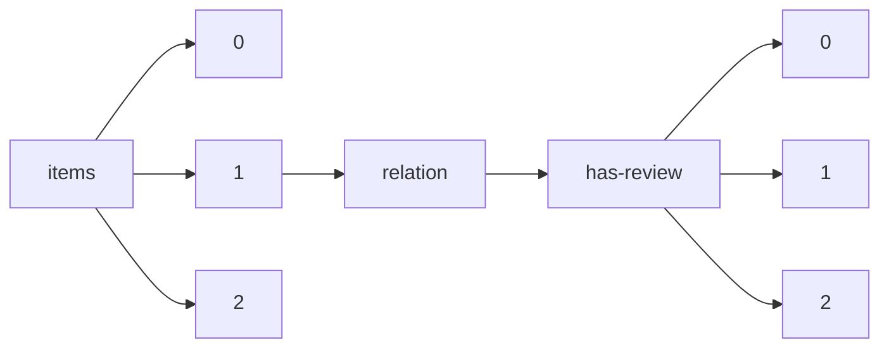

!!! warning "This document is not official Crossref documentation"
# Elements
PATH = items/array/relation/has-review/array(1)  
Occurs 337 735 times  
{ .annotate }

1. A route to an element, for example:  
   The route "items/array/relation/has-review/array" corresponds to navigating through the JSON indices as  
   ["items"][0]["relation"]["has-review"][0]  

## Asserted-by
See more information: [items/array/relation/has-review/array/asserted-by](asserted-by/index.md)  
Occurs 337 735 timess  
Unique values: 2  

| **Row** | **Value** `String` | **Count** `Int64` |
|--------:|----------------------:|---------------------:|
| **1**   | object                | 209 526              |
| **2**   | subject               | 128 209              |

## Id
See more information: [items/array/relation/has-review/array/id](id/index.md)  
Occurs 337 735 timess  
Unique values: > 999  

!!! note "Due to current limitations, only the first 1,000 unique values are counted."

| **Row** | **Value** `String` | **Count** `Int64` |
|--------:|----------------------:|---------------------:|
| **1**   | 978-967-13147-0-8     | 406                  |
| **2**   | 2289-8506             | 323                  |
| **3**   | 0128-2603             | 174                  |
| **4**   | 0128-2611             | 84                   |
| **5**   | 0128-259X             | 83                   |
| **6**   | 0128-3103             | 65                   |
| **7**   | 2181-1091             | 37                   |
| **8**   | 2181-9939             | 35                   |
| **9**   | 2636-9168             | 9                    |
| **10**  | 2180-0421             | 8                    |
| ... | ... | ... |

## Id-type
See more information: [items/array/relation/has-review/array/id-type](id-type/index.md)  
Occurs 337 735 timess  
Unique values: 6  

| **Row** | **Value** `String` | **Count** `Int64` |
|--------:|----------------------:|---------------------:|
| **1**   | doi                   | 334 242              |
| **2**   | uri                   | 2 094                |
| **3**   | issn                  | 985                  |
| **4**   | isbn                  | 412                  |
| **5**   | other                 | 1                    |
| **6**   | handle                | 1                    |

