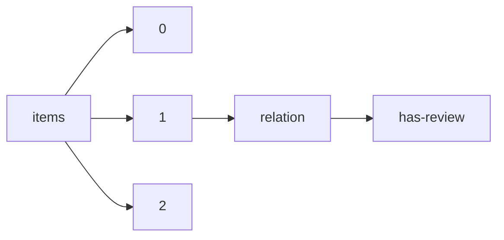

!!! warning "This document is not official Crossref documentation"
# Has-review
PATH = items/array/relation/has-review(1)  
Occurs 134 559 times  
{ .annotate }

1. A route to an element, for example:  
   The route "items/array/relation/has-review" corresponds to navigating through the JSON indices as  
   ["items"][0]["relation"]["has-review"]  

## Properties of Array
See information about elements: [items/array/relation/has-review/array](array/index.md)  
Distribution of lengths:  

| **Row** | **Length** `Any` | **Count** `Int64` |
|--------:|--------------------:|---------------------:|
| **1**   | 1                   | 66 189               |
| **2**   | 2                   | 32 132               |
| **3**   | 3                   | 10 051               |
| **4**   | 4                   | 7 904                |
| **5**   | 5                   | 3 037                |
| **6**   | 6                   | 4 294                |
| **7**   | 7                   | 1 759                |
| **8**   | 8                   | 4 201                |
| **9**   | 9                   | 1 172                |
| **10**  | 10                  | 1 085                |
| ... | ... | ... |

