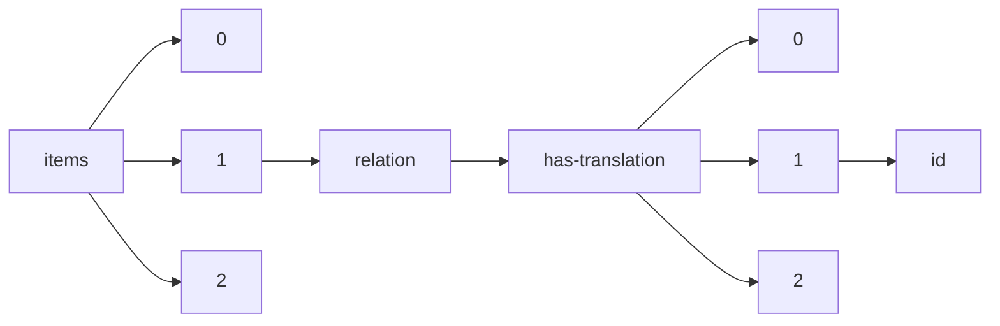

!!! warning "This document is not official Crossref documentation"
# Id
PATH = items/array/relation/has-translation/array/id(1)  
Occurs 6 644 times  
Unique values: > 999  
{ .annotate }

1. A route to an element, for example:  
   The route "items/array/relation/has-translation/array/id" corresponds to navigating through the JSON indices as  
   ["items"][0]["relation"]["has-translation"][0]["id"]  

!!! note "Due to current limitations, only the first 1,000 unique values are counted."

| **Row** | **Value** `String`                                        | **Count** `Int64` |
|--------:|-------------------------------------------------------------:|---------------------:|
| **1**   | https://www.imaios.com/jp/e-Anatomy                          | 26                   |
| **2**   | https://www.imaios.com/br/e-Anatomy                          | 26                   |
| **3**   | https://www.imaios.com/de/e-Anatomy                          | 26                   |
| **4**   | https://www.imaios.com/es/e-Anatomy                          | 26                   |
| **5**   | https://www.imaios.com/fr/e-Anatomy                          | 26                   |
| **6**   | https://www.imaios.com/ru/e-Anatomy                          | 26                   |
| **7**   | https://www.imaios.com/cn/e-Anatomy                          | 26                   |
| **8**   | https://www.imaios.com/pl/e-Anatomy                          | 26                   |
| **9**   | 10.37019/e-anatomy/93511                                     | 8                    |
| **10**  | 10.37019/e-anatomy/901113                                    | 8                    |
| **11**  | 10.37019/vet-anatomy/689991                                  | 8                    |
| **12**  | 10.37019/e-anatomy/178                                       | 8                    |
| **13**  | 10.37019/e-anatomy/346638                                    | 8                    |
| **14**  | 10.37019/e-anatomy/940479                                    | 8                    |
| **15**  | 10.37019/e-anatomy/127140                                    | 8                    |
| **16**  | 10.37019/vet-anatomy/586827                                  | 8                    |
| **17**  | 10.37019/e-anatomy/49566                                     | 8                    |
| **18**  | 10.37019/e-anatomy/145192                                    | 8                    |
| **19**  | 10.37019/e-anatomy/179                                       | 8                    |
| **20**  | 10.37019/e-anatomy/170                                       | 8                    |
| **21**  | 10.37019/e-anatomy/187                                       | 8                    |
| **22**  | 10.37019/vet-anatomy/588175                                  | 8                    |
| **23**  | 10.37019/e-anatomy/826056                                    | 8                    |
| **24**  | 10.37019/e-anatomy/180                                       | 8                    |
| **25**  | 10.37019/e-anatomy/536306                                    | 8                    |
| **26**  | 10.37019/vet-anatomy/550913                                  | 8                    |
| **27**  | 10.37019/e-anatomy/49563                                     | 8                    |
| **28**  | 10.37019/e-anatomy/52828                                     | 8                    |
| **29**  | 10.37019/e-anatomy/959587                                    | 8                    |
| **30**  | 10.37019/e-anatomy/520279                                    | 8                    |
| **31**  | 10.37019/e-anatomy/826011                                    | 8                    |
| **32**  | 10.37019/e-anatomy/186                                       | 8                    |
| **33**  | 10.37019/e-anatomy/137610                                    | 8                    |
| **34**  | 10.37019/vet-anatomy/536493                                  | 8                    |
| **35**  | 10.37019/e-anatomy/691978                                    | 8                    |
| **36**  | 10.37019/e-anatomy/185                                       | 8                    |
| **37**  | 10.37019/vet-anatomy/610470                                  | 8                    |
| **38**  | 10.37019/vet-anatomy/597381                                  | 8                    |
| **39**  | 10.37019/vet-anatomy/617929                                  | 8                    |
| **40**  | 10.37019/e-anatomy/49541                                     | 8                    |
| **41**  | 10.37019/e-anatomy/49556                                     | 8                    |
| **42**  | 10.37019/e-anatomy/110094                                    | 8                    |
| **43**  | 10.37019/e-anatomy/520281                                    | 8                    |
| **44**  | 10.37019/e-anatomy/278217                                    | 8                    |
| **45**  | 10.37019/e-anatomy/176                                       | 8                    |
| **46**  | 10.37019/e-anatomy/346547                                    | 8                    |
| **47**  | 10.37019/e-anatomy/127139                                    | 8                    |
| **48**  | 10.37019/e-anatomy/278225                                    | 8                    |
| **49**  | 10.37019/vet-anatomy/674563                                  | 8                    |
| **50**  | 10.37019/vet-anatomy/418653                                  | 8                    |
| **51**  | 10.37019/e-anatomy/410042                                    | 8                    |
| **52**  | 10.37019/e-anatomy/346546                                    | 8                    |
| **53**  | 10.37019/vet-anatomy/726635                                  | 8                    |
| **54**  | 10.37019/vet-anatomy/489864                                  | 8                    |
| **55**  | 10.37019/e-anatomy/397a3b49-8b03-46d7-a1d5-21ac57db67bc      | 8                    |
| **56**  | 10.37019/e-anatomy/110093                                    | 8                    |
| **57**  | 10.37019/e-anatomy/49570                                     | 8                    |
| **58**  | 10.37019/e-anatomy/688472                                    | 8                    |
| **59**  | 10.37019/e-anatomy/159099                                    | 8                    |
| **60**  | 10.37019/e-anatomy/182                                       | 8                    |
| **61**  | 10.37019/vet-anatomy/898995                                  | 8                    |
| **62**  | 10.37019/e-anatomy/501                                       | 8                    |
| **63**  | 10.37019/vet-anatomy/649760                                  | 8                    |
| **64**  | 10.37019/e-anatomy/346545                                    | 8                    |
| **65**  | 10.37019/vet-anatomy/382522                                  | 8                    |
| **66**  | 10.37019/e-anatomy/49576                                     | 8                    |
| **67**  | 10.37019/e-anatomy/867141                                    | 8                    |
| **68**  | 10.37019/e-anatomy/88366                                     | 8                    |
| **69**  | 10.37019/vet-anatomy/402856                                  | 8                    |
| **70**  | 10.37019/e-anatomy/30125                                     | 8                    |
| **71**  | 10.37019/vet-anatomy/707070                                  | 8                    |
| **72**  | 10.37019/e-anatomy/840343                                    | 8                    |
| **73**  | 10.37019/e-anatomy/88365                                     | 8                    |
| **74**  | 10.37019/e-anatomy/458637                                    | 8                    |
| **75**  | 10.37019/e-anatomy/826010                                    | 8                    |
| **76**  | 10.37019/e-anatomy/825842                                    | 8                    |
| **77**  | 10.37019/e-anatomy/166969                                    | 8                    |
| **78**  | 10.37019/e-anatomy/183                                       | 8                    |
| **79**  | 10.37019/e-anatomy/580429                                    | 8                    |
| **80**  | 10.37019/vet-anatomy/e5c37bf8-9682-4d68-a3cc-739e2557e962    | 8                    |
| **81**  | 10.37019/vet-anatomy/636316                                  | 8                    |
| **82**  | 10.37019/e-anatomy/188                                       | 8                    |
| **83**  | 10.37019/vet-anatomy/482659                                  | 8                    |
| **84**  | 10.37019/e-anatomy/163                                       | 8                    |
| **85**  | 10.37019/e-anatomy/901093                                    | 8                    |
| **86**  | 10.37019/e-anatomy/110095                                    | 8                    |
| **87**  | 10.37019/e-anatomy/c34b9cfd-1bf1-4ca3-b7ea-455e42e29d65      | 8                    |
| **88**  | 10.37019/e-anatomy/181                                       | 8                    |
| **89**  | 10.37019/vet-anatomy/382521                                  | 8                    |
| **90**  | 10.37019/e-anatomy/211161                                    | 8                    |
| **91**  | 10.37019/vet-anatomy/927205                                  | 8                    |
| **92**  | 10.37019/e-anatomy/867620                                    | 8                    |
| **93**  | 10.37019/e-anatomy/167                                       | 8                    |
| **94**  | 10.37019/e-anatomy/206436                                    | 8                    |
| **95**  | 10.37019/e-anatomy/826053                                    | 8                    |
| **96**  | 10.37019/vet-anatomy/429705                                  | 8                    |
| **97**  | 10.37019/vet-anatomy/564757                                  | 8                    |
| **98**  | 10.37019/e-anatomy/400295                                    | 8                    |
| **99**  | 10.37019/vet-anatomy/398378                                  | 8                    |
| **100** | 10.37019/e-anatomy/278222                                    | 8                    |
| **101** | 10.37019/e-anatomy/49401                                     | 8                    |
| **102** | 10.37019/e-anatomy/867168                                    | 8                    |
| **103** | 10.37019/e-anatomy/49562                                     | 8                    |
| **104** | 10.37019/e-anatomy/826049                                    | 8                    |
| **105** | 10.37019/vet-anatomy/522241                                  | 8                    |
| **106** | 10.37019/e-anatomy/83480                                     | 8                    |
| **107** | 10.1590/1983-80422022304000pt                                | 4                    |
| **108** | 10.1590/0102-311xpt009523                                    | 4                    |
| **109** | 10.1590/1983-80422022304575pt                                | 4                    |
| **110** | 10.1590/1983-80422022304579pt                                | 4                    |
| **111** | 10.1590/1983-80422022302538pt                                | 3                    |
| **112** | 10.1590/1518-8345.5618.3599                                  | 3                    |
| **113** | 10.1590/1518-8345.0000.3873                                  | 2                    |
| **114** | 10.24075/brsmu.2019.076                                      | 2                    |
| **115** | 10.1590/1518-8345.5806.3777                                  | 2                    |
| **116** | 10.24075/brsmu.2020.011                                      | 2                    |
| **117** | 10.1590/0102-311xpt187422                                    | 2                    |
| **118** | 10.30841/2708-8731.8.2022.273297                             | 2                    |
| **119** | 10.7250/HESIHE.2020.008                                      | 2                    |
| **120** | 10.1590/1808-057x20221578.en                                 | 2                    |
| **121** | 10.1590/1518-8345.6101.3828                                  | 2                    |
| **122** | 10.24075/brsmu.2020.016                                      | 2                    |
| **123** | 10.1590/1518-8345.5868.3607                                  | 2                    |
| **124** | 10.1590/ce.v28i0.85412                                       | 2                    |
| **125** | 10.1590/1518-8345.6202.3855                                  | 2                    |
| **126** | 10.1590/1518-8345.6289.3712                                  | 2                    |
| **127** | 10.1590/0103-11042022e312                                    | 2                    |
| **128** | 10.4467/27204383TER.23.013.17453                             | 2                    |
| **129** | 10.17537/2020.15.t52                                         | 2                    |
| **130** | 10.5380/ce.v27i0.87296                                       | 2                    |
| **131** | 10.1590/1983-80422022304569pt                                | 2                    |
| **132** | 10.1590/1518-8345.5980.3774                                  | 2                    |
| **133** | 10.4467/2543702XSHS.17.001.7702                              | 2                    |
| **134** | 10.17537/2020.15.t1                                          | 2                    |
| **135** | 10.1590/1518-8345.6239.3843                                  | 2                    |
| **136** | 10.5380/ce.v27i0.87759                                       | 2                    |
| **137** | 10.1590/1518-8345.0000.3906                                  | 2                    |
| **138** | 10.1590/1983-1447.2022.20220270.en                           | 2                    |
| **139** | 10.1590/1983-80422022301513pt                                | 2                    |
| **140** | 10.24075/brsmu.2019.080                                      | 2                    |
| **141** | 10.1590/0103-11042022e311                                    | 2                    |
| **142** | 10.1590/1983-80422022303547pt                                | 2                    |
| **143** | 10.1590/1983-80422022304564pt                                | 2                    |
| **144** | 10.24075/brsmu.2020.009                                      | 2                    |
| **145** | 10.1590/1518-8345.5691.3575                                  | 2                    |
| **146** | 10.1590/1983-80422022302536pt                                | 2                    |
| **147** | 10.5380/ce.v27i0.88124                                       | 2                    |
| **148** | 10.17537/2015.10.t1                                          | 2                    |
| **149** | 10.4467/23921749SHS.16.023.6166                              | 2                    |
| **150** | 10.5380/ce.v27i0.87606                                       | 2                    |
| **151** | 10.1590/s0103-73312022320403                                 | 2                    |
| **152** | 10.1590/1983-80422022302524pt                                | 2                    |
| **153** | 10.1590/1983-80422022303557pt                                | 2                    |
| **154** | 10.1590/1518-8345.5597.3626                                  | 2                    |
| **155** | 10.17537/2015.10.t39                                         | 2                    |
| **156** | 10.5380/ce.v27i0.87272                                       | 2                    |
| **157** | 10.1590/0102-311xpt228122                                    | 2                    |
| **158** | 10.17537/2018.13.t162                                        | 2                    |
| **159** | 10.1590/1518-8345.6296.3834                                  | 2                    |
| **160** | 10.1590/1983-80422022303560pt                                | 2                    |
| **161** | 10.1590/1518-8345.6240.3807                                  | 2                    |
| **162** | 10.5380/ce.v27i0.87203                                       | 2                    |
| **163** | 10.5380/ce.v27i0.87128                                       | 2                    |
| **164** | 10.17537/2019.14.t44                                         | 2                    |
| **165** | 10.1590/1983-80422022302534pt                                | 2                    |
| **166** | 10.1590/1809-4422asoc20220021l5oa                            | 2                    |
| **167** | 10.24075/vrgmu.2018.082                                      | 2                    |
| **168** | 10.5380/ce.v27i0.87196                                       | 2                    |
| **169** | 10.18485/aida.2023.24.ch9                                    | 2                    |
| **170** | 10.24075/brsmu.2020.013                                      | 2                    |
| **171** | 10.24075/brsmu.2020.028                                      | 2                    |
| **172** | 10.1590/0102-311xpt148222                                    | 2                    |
| **173** | 10.5380/ce.v27i0.87124                                       | 2                    |
| **174** | 10.24075/brsmu.2019.088                                      | 2                    |
| **175** | 10.7250/HESIHE.2018.006                                      | 2                    |
| **176** | 10.4467/27204383TER.22.024.16344                             | 2                    |
| **177** | 10.17537/2020.15.t88                                         | 2                    |
| **178** | 10.37019/e-anatomy/49577.pl                                  | 2                    |
| **179** | 10.7250/HESIHE.2018.008                                      | 2                    |
| **180** | 10.1590/s0034-759020230202                                   | 2                    |
| **181** | 10.1590/1980-265x-tce-2021-0332en                            | 2                    |
| **182** | 10.4467/27204383TER.22.028.16348                             | 2                    |
| **183** | 10.17537/2015.10.t56                                         | 2                    |
| **184** | 10.4467/20801335PBW.22.058.16949                             | 2                    |
| **185** | 10.56373/2023-2-4                                            | 2                    |
| **186** | 10.24075/brsmu.2020.032                                      | 2                    |
| **187** | 10.1590/1518-8345.6037.3672                                  | 2                    |
| **188** | 10.1590/0034-7167-2022-0644                                  | 2                    |
| **189** | 10.17537/2018.13.t70                                         | 2                    |
| **190** | 10.37019/e-anatomy/49577.ru                                  | 2                    |
| **191** | 10.1590/0034-7167.2022750501                                 | 2                    |
| **192** | 10.5380/ce.v27i0.88120                                       | 2                    |
| **193** | 10.17537/2014.9.t1                                           | 2                    |
| **194** | 10.7250/HESIHE.2018.007                                      | 2                    |
| **195** | 10.37019/e-anatomy/49577.jp                                  | 2                    |
| **196** | 10.24075/brsmu.2020.029                                      | 2                    |
| **197** | 10.24075/brsmu.2020.012                                      | 2                    |
| **198** | 10.4467/27204383TER.22.027.16347                             | 2                    |
| **199** | 10.17537/2020.15.t32                                         | 2                    |
| **200** | 10.24075/brsmu.2020.010                                      | 2                    |
| **201** | 10.24075/brsmu.2020.036                                      | 2                    |
| **202** | 10.5380/ce.v27i0.87125                                       | 2                    |
| **203** | 10.24075/brsmu.2019.075                                      | 2                    |
| **204** | 10.5380/ce.v27i0.88206                                       | 2                    |
| **205** | 10.24075/brsmu.2020.021                                      | 2                    |
| **206** | 10.1590/1983-80422022301507pt                                | 2                    |
| **207** | 10.1590/1518-8345.6120.3687                                  | 2                    |
| **208** | 10.1590/1980-220x-reeusp-2022-0082en                         | 2                    |
| **209** | 10.5380/ce.v27i0.87707                                       | 2                    |
| **210** | 10.1590/0100-3984.2022.55.3e1-en                             | 2                    |
| **211** | 10.7250/HESIHE.2020.009                                      | 2                    |
| **212** | 10.1590/s0034-759020220205                                   | 2                    |
| **213** | 10.1590/0103-11042022e400                                    | 2                    |
| **214** | 10.1590/0103-11042022e603                                    | 2                    |
| **215** | 10.1590/1984-92302023v30n0005en                              | 2                    |
| **216** | 10.1590/1678-6971/eramg220210.en                             | 2                    |
| **217** | 10.1590/0102-311xpt133622                                    | 2                    |
| **218** | 10.1590/1518-8345.0000.3631                                  | 2                    |
| **219** | 10.1590/2177-9465-ean-2022-0198es                            | 2                    |
| **220** | 10.37019/e-anatomy/49577.br                                  | 2                    |
| **221** | 10.1590/1983-80422022303541pt                                | 2                    |
| **222** | 10.5380/ce.v27i0.87211                                       | 2                    |
| **223** | 10.1590/1518-8345.5826.3783                                  | 2                    |
| **224** | 10.1590/1518-8345.6294.3789                                  | 2                    |
| **225** | 10.1590/1518-8345.5849.3593                                  | 2                    |
| **226** | 10.1590/1518-8345.6163.3664                                  | 2                    |
| **227** | 10.1590/0103-11042022e303                                    | 2                    |
| **228** | 10.1590/1518-8345.6057.3816                                  | 2                    |
| **229** | 10.1590/1983-80422022302521pt                                | 2                    |
| **230** | 10.1590/1983-80422022304580pt                                | 2                    |
| **231** | 10.1590/0102-311xpt206822                                    | 2                    |
| **232** | 10.1590/1518-8345.5581.3557                                  | 2                    |
| **233** | 10.5380/ce.v27i0.87365                                       | 2                    |
| **234** | 10.14211/regepe.esbj.e2375                                   | 2                    |
| **235** | 10.1590/18070337-125405pt                                    | 2                    |
| **236** | 10.1590/1518-8345.5825.3623                                  | 2                    |
| **237** | 10.1590/1518-8345.6034.3699                                  | 2                    |
| **238** | 10.1590/1983-80422022303546pt                                | 2                    |
| **239** | 10.1590/1980-265x-tce-2022-e002en                            | 2                    |
| **240** | 10.7250/HESIHE.2020.002                                      | 2                    |
| **241** | 10.1590/ce.v28i0.79812                                       | 2                    |
| **242** | 10.24075/brsmu.2020.023                                      | 2                    |
| **243** | 10.5380/ce.v27i0.87106                                       | 2                    |
| **244** | 10.24075/brsmu.2020.004                                      | 2                    |
| **245** | 10.1590/1518-8345.6265.3735                                  | 2                    |
| **246** | 10.1590/1983-80422022302526pt                                | 2                    |
| **247** | 10.4467/27204383TER.23.011.17451                             | 2                    |
| **248** | 10.1590/0102-311xpt176622                                    | 2                    |
| **249** | 10.17537/2018.13.t104                                        | 2                    |
| **250** | 10.18485/aida.2023.24.ch11                                   | 2                    |
| **251** | 10.24075/brsmu.2020.034                                      | 2                    |
| **252** | 10.5380/ce.v27i0.87273                                       | 2                    |
| **253** | 10.24075/brsmu.2019.077                                      | 2                    |
| **254** | 10.56373/2023-2-6                                            | 2                    |
| **255** | 10.5380/ce.v27i0.87200                                       | 2                    |
| **256** | 10.33273/2663-4570-2020-89-2-32-39                           | 2                    |
| **257** | 10.1590/1981-5271v46.1-20210286.ing                          | 2                    |
| **258** | 10.17537/2016.11.t1                                          | 2                    |
| **259** | 10.5380/ce.v27i0.87459                                       | 2                    |
| **260** | 10.31857/S020595920014202-8                                  | 2                    |
| **261** | 10.4467/2543702XSHS.18.001.9321                              | 2                    |
| **262** | 10.4467/27204383TER.22.026.16346                             | 2                    |
| **263** | 10.1590/1983-80422022304577pt                                | 2                    |
| **264** | 10.1590/1980-6248-2020-0075                                  | 2                    |
| **265** | 10.33273/2663-9726-2020-53-2-29-38                           | 2                    |
| **266** | 10.17537/2018.13.t1                                          | 2                    |
| **267** | 10.1590/0034-7167.2022750401                                 | 2                    |
| **268** | 10.1590/1516-73132023000a                                    | 2                    |
| **269** | 10.56373/2023-2-9                                            | 2                    |
| **270** | 10.1590/1980-549720230013                                    | 2                    |
| **271** | 10.17537/2018.13.t84                                         | 2                    |
| **272** | 10.1590/1809-6891v24e-74190e                                 | 2                    |
| **273** | 10.7250/HESIHE.2020.001                                      | 2                    |
| **274** | 10.37019/e-anatomy/49577.de                                  | 2                    |
| **275** | 10.4467/27204383TER.23.009.17449                             | 2                    |
| **276** | 10.4467/27204383TER.22.029.16349                             | 2                    |
| **277** | 10.5380/ce.v27i0.87156                                       | 2                    |
| **278** | 10.5380/ce.v27i0.87400                                       | 2                    |
| **279** | 10.1590/1518-8345.6302.3846                                  | 2                    |
| **280** | 10.7250/HESIHE.2020.004                                      | 2                    |
| **281** | 10.17537/2018.13.t59                                         | 2                    |
| **282** | 10.24075/brsmu.2020.007                                      | 2                    |
| **283** | 10.18485/aida.2023.24.ch7                                    | 2                    |
| **284** | 10.1590/1518-8345.5623.3601                                  | 2                    |
| **285** | 10.24075/brsmu.2020.002                                      | 2                    |
| **286** | 10.7250/HESIHE.2018.009                                      | 2                    |
| **287** | 10.5380/ce.v27i0.88192                                       | 2                    |
| **288** | 10.33273/2663-4570-2020-88-1-5-22                            | 2                    |
| **289** | 10.1590/1518-8345.5967.3675                                  | 2                    |
| **290** | 10.1590/1980-220x-reeusp-2022-0168en                         | 2                    |
| **291** | 10.4467/27204383TER.23.010.17450                             | 2                    |
| **292** | 10.17537/2019.14.t37                                         | 2                    |
| **293** | 10.1590/1678-6971/eramr220239.en                             | 2                    |
| **294** | 10.1590/1983-80422022301511pt                                | 2                    |
| **295** | 10.24075/brsmu.2019.058                                      | 2                    |
| **296** | 10.17537/2020.15.t35                                         | 2                    |
| **297** | 10.1590/1980-6248-2021-0033                                  | 2                    |
| **298** | 10.1590/1984-92302023v30n0000en                              | 2                    |
| **299** | 10.1590/ce.v28i0.84086                                       | 2                    |
| **300** | 10.1590/1518-8345.6250.3756                                  | 2                    |
| **301** | 10.4467/20801335PBW.22.061.16952                             | 2                    |
| **302** | 10.1590/1983-80422022301000pt                                | 2                    |
| **303** | 10.1590/1413-81232023283.19952022                            | 2                    |
| **304** | 10.1590/1983-80422022303552pt                                | 2                    |
| **305** | 10.1590/1809-2950/00000029032022pt                           | 2                    |
| **306** | 10.5380/ce.v27i0.88147                                       | 2                    |
| **307** | 10.5380/ce.v27i0.87896                                       | 2                    |
| **308** | 10.5380/ce.v27i0.88143                                       | 2                    |
| **309** | 10.1590/1518-8345.5897.3597                                  | 2                    |
| **310** | 10.24075/brsmu.2021.003                                      | 2                    |
| **311** | 10.1590/1983-80422022302000pt                                | 2                    |
| **312** | 10.1590/0102-311xpt115122                                    | 2                    |
| **313** | 10.1590/1983-80422022302523pt                                | 2                    |
| **314** | 10.1590/0034-7167.202275suppl201                             | 2                    |
| **315** | 10.1590/1983-80422022302528pt                                | 2                    |
| **316** | 10.1590/1983-80422022302531pt                                | 2                    |
| **317** | 10.1590/1518-8345.6102.3881                                  | 2                    |
| **318** | 10.24075/brsmu.2020.038                                      | 2                    |
| **319** | 10.18485/aida.2023.24.ch3                                    | 2                    |
| **320** | 10.4467/20801335PBW.22.057.16948                             | 2                    |
| **321** | 10.5380/ce.v27i0.87463                                       | 2                    |
| **322** | 10.1590/0103-11042021e213                                    | 2                    |
| **323** | 10.1590/1983-80422022302527pt                                | 2                    |
| **324** | 10.1590/1518-8345.6162.3655                                  | 2                    |
| **325** | 10.1590/1983-80422022304572pt                                | 2                    |
| **326** | 10.1590/1983-80422022302529pt                                | 2                    |
| **327** | 10.1590/1983-80422022303550pt                                | 2                    |
| **328** | 10.7250/HESIHE.2020.003                                      | 2                    |
| **329** | 10.17537/2018.13.t39                                         | 2                    |
| **330** | 10.17537/2015.10.t29                                         | 2                    |
| **331** | 10.1590/1983-80422022303558pt                                | 2                    |
| **332** | 10.33273/2663-4570-2021-90-1-51-59                           | 2                    |
| **333** | 10.1590/1983-1447.2022.20210339.en                           | 2                    |
| **334** | 10.1590/1983-80422022304562pt                                | 2                    |
| **335** | 10.4467/2543702XSHS.17.020.7721                              | 2                    |
| **336** | 10.1590/1518-8345.6263.3706                                  | 2                    |
| **337** | 10.1590/1677-5449.202200811                                  | 2                    |
| **338** | 10.1590/1413-81232022277.19432021                            | 2                    |
| **339** | 10.1590/1518-8345.5869.3620                                  | 2                    |
| **340** | 10.1590/s1413-24782023280017                                 | 2                    |
| **341** | 10.17537/2020.15.t21                                         | 2                    |
| **342** | 10.7250/HESIHE.2018.005                                      | 2                    |
| **343** | 10.24075/brsmu.2020.033                                      | 2                    |
| **344** | 10.24075/brsmu.2020.008                                      | 2                    |
| **345** | 10.4467/27204383TER.23.012.17452                             | 2                    |
| **346** | 10.1590/s0034-759020220506                                   | 2                    |
| **347** | 10.1590/1677-5449.202000531                                  | 2                    |
| **348** | 10.7250/HESIHE.2020.006                                      | 2                    |
| **349** | 10.1590/1980-265x-tce-2022-e001-en                           | 2                    |
| **350** | 10.5380/ce.v27i0.87460                                       | 2                    |
| **351** | 10.1590/1809-6891v22e-70836e                                 | 2                    |
| **352** | 10.1590/1983-80422022302540pt                                | 2                    |
| **353** | 10.24075/brsmu.2019.060                                      | 2                    |
| **354** | 10.5380/ce.v27i0.87401                                       | 2                    |
| **355** | 10.1590/1518-8345.6215.3741                                  | 2                    |
| **356** | 10.5380/ce.v27i0.88196                                       | 2                    |
| **357** | 10.1590/2177-9465-ean-2021-0334pt                            | 2                    |
| **358** | 10.4467/23921749SHS.16.021.6164                              | 2                    |
| **359** | 10.5380/ce.v27i0.87276                                       | 2                    |
| **360** | 10.1590/1809-4422asoceditorialvu2022l5edeng                  | 2                    |
| **361** | 10.5380/ce.v27i0.87461                                       | 2                    |
| **362** | 10.17537/2018.13.t29                                         | 2                    |
| **363** | 10.33273/2663-9726-2020-53-2-80-87                           | 2                    |
| **364** | 10.24075/brsmu.2020.015                                      | 2                    |
| **365** | 10.1590/ce.v28i0.83871                                       | 2                    |
| **366** | 10.33273/2663-9726-2020-53-2-5-16                            | 2                    |
| **367** | 10.5380/ce.v27i0.87071                                       | 2                    |
| **368** | 10.7250/HESIHE.2020.005                                      | 2                    |
| **369** | 10.24075/brsmu.2019.073                                      | 2                    |
| **370** | 10.24075/brsmu.2020.040                                      | 2                    |
| **371** | 10.4467/27204383TER.22.025.16345                             | 2                    |
| **372** | 10.24075/brsmu.2020.046                                      | 2                    |
| **373** | 10.1590/1983-80422022302539pt                                | 2                    |
| **374** | 10.1590/1518-8345.6245.3717                                  | 2                    |
| **375** | 10.1590/0102-311xpt069022                                    | 2                    |
| **376** | 10.17537/2019.14.t62                                         | 2                    |
| **377** | 10.1590/0103-11042022e415                                    | 2                    |
| **378** | 10.1590/1983-21172022240112                                  | 2                    |
| **379** | 10.1590/0102-311xpt236022                                    | 2                    |
| **380** | 10.24075/brsmu.2020.020                                      | 2                    |
| **381** | 10.1590/0103-11042022e300                                    | 2                    |
| **382** | 10.24075/brsmu.2020.027                                      | 2                    |
| **383** | 10.1590/1518-8345.0000.3870                                  | 2                    |
| **384** | 10.37019/e-anatomy/49577.fr                                  | 2                    |
| **385** | 10.5380/ce.v27i0.87073                                       | 2                    |
| **386** | 10.1590/1518-8345.6222.3715                                  | 2                    |
| **387** | 10.1590/1413-81232023283.13822022                            | 2                    |
| **388** | 10.17537/2018.13.t17                                         | 2                    |
| **389** | 10.1590/1413-81232023283.07032022                            | 2                    |
| **390** | 10.1590/1518-8345.5830.3617                                  | 2                    |
| **391** | 10.24075/brsmu.2020.024                                      | 2                    |
| **392** | 10.1590/1518-8345.5965.3729                                  | 2                    |
| **393** | 10.5380/ce.v27i0.87127                                       | 2                    |
| **394** | 10.1590/1983-1447.2022.20210081.en                           | 2                    |
| **395** | 10.1590/0100-3984.2021.0149-en                               | 2                    |
| **396** | 10.37019/e-anatomy/49577.cn                                  | 2                    |
| **397** | 10.5380/ce.v27i0.82955                                       | 2                    |
| **398** | 10.1590/0103-11042022e500                                    | 2                    |
| **399** | 10.24075/brsmu.2019.079                                      | 2                    |
| **400** | 10.5380/ce.v27i0.87275                                       | 2                    |
| **401** | 10.1590/1518-8345.5866.3636                                  | 2                    |
| **402** | 10.4467/20801335PBW.22.059.16950                             | 2                    |
| **403** | 10.4467/27204383TER.23.014.17454                             | 2                    |
| **404** | 10.33273/2663-9726-2020-53-2-96-101                          | 2                    |
| **405** | 10.1590/1980-6248-2020-0045                                  | 2                    |
| **406** | 10.1590/1983-80422022303542pt                                | 2                    |
| **407** | 10.7250/HESIHE.2018.011                                      | 2                    |
| **408** | 10.1590/1809-6891v23e-71763e                                 | 2                    |
| **409** | 10.1590/1982-0259.2023e92518                                 | 2                    |
| **410** | 10.1590/1518-8345.5992.3771                                  | 2                    |
| **411** | 10.1590/2317-1782/20212022208pt                              | 2                    |
| **412** | 10.1590/1518-8345.0000.3751                                  | 2                    |
| **413** | 10.1590/1983-80422022303545pt                                | 2                    |
| **414** | 10.37019/e-anatomy/49577.es                                  | 2                    |
| **415** | 10.17537/2015.10.t20                                         | 2                    |
| **416** | 10.1590/1677-5449.202200011                                  | 2                    |
| **417** | 10.1590/0100-3984.2021.0169                                  | 2                    |
| **418** | 10.24075/brsmu.2020.037                                      | 2                    |
| **419** | 10.1590/1808-057x20221636.en                                 | 2                    |
| **420** | 10.1590/0102-311xpt023223                                    | 2                    |
| **421** | 10.1590/1518-8345.5799.3591                                  | 2                    |
| **422** | 10.24075/brsmu.2020.031                                      | 2                    |
| **423** | 10.1590/1413-81232023282.11412022                            | 2                    |
| **424** | 10.1590/1980-220x-reeusp-2021-0442en                         | 2                    |
| **425** | 10.5380/ce.v27i0.87231                                       | 2                    |
| **426** | 10.4467/2543702XSHS.17.005.7706                              | 2                    |
| **427** | 10.5380/ce.v27i0.87865                                       | 2                    |
| **428** | 10.1590/1984-92302022v30n0006en                              | 2                    |
| **429** | 10.1590/1518-8345.6071.3747                                  | 2                    |
| **430** | 10.1590/0103-11042022e315                                    | 2                    |
| **431** | 10.1590/0103-11042022e409                                    | 2                    |
| **432** | 10.1590/1983-1447.2022.20200485.en                           | 2                    |
| **433** | 10.1590/1983-80422022302532pt                                | 2                    |
| **434** | 10.5380/ce.v27i0.87204                                       | 2                    |
| **435** | 10.5380/ce.v27i0.87126                                       | 2                    |
| **436** | 10.24075/brsmu.2020.035                                      | 2                    |
| **437** | 10.1590/1983-80422022301519pt                                | 2                    |
| **438** | 10.24075/brsmu.2020.001                                      | 2                    |
| **439** | 10.18485/aida.2023.24.ch21                                   | 2                    |
| **440** | 10.1590/2526-8910.ctoao238931181                             | 2                    |
| **441** | 10.24075/brsmu.2019.074                                      | 2                    |
| **442** | 10.5380/ce.v27i0.87105                                       | 2                    |
| **443** | 10.4467/27204383TER.23.008.17448                             | 2                    |
| **444** | 10.1590/0034-7167-2021-0535                                  | 2                    |
| **445** | 10.24075/brsmu.2019.059                                      | 2                    |
| **446** | 10.17537/2018.13.t132                                        | 2                    |
| **447** | 10.30841/2708-8731.7.2022.272464                             | 2                    |
| **448** | 10.24075/brsmu.2020.039                                      | 2                    |
| **449** | 10.7250/HESIHE.2018.002                                      | 2                    |
| **450** | 10.18485/aida.2023.24.ch19                                   | 2                    |
| **451** | 10.5380/ce.v27i0.87604                                       | 2                    |
| **452** | 10.24075/brsmu.2020.049                                      | 2                    |
| **453** | 10.24075/brsmu.2020.014                                      | 2                    |
| **454** | 10.5380/ce.v27i0.88198                                       | 2                    |
| **455** | 10.18485/aida.2023.24.ch15                                   | 2                    |
| **456** | 10.1590/2177-9465-ean-2022-0291pt                            | 2                    |
| **457** | 10.17537/2019.14.t1                                          | 2                    |
| **458** | 10.1590/1983-80422022302522pt                                | 2                    |
| **459** | 10.1590/1518-8345.5756.3577                                  | 2                    |
| **460** | 10.24075/brsmu.2019.090                                      | 2                    |
| **461** | 10.33273/2663-4570-2020-88-1-67-78                           | 2                    |
| **462** | 10.1590/1980-265x-tce-2020-0395en                            | 2                    |
| **463** | https://replito.pubpub.org/pub/i5pju8z0                      | 2                    |
| **464** | 10.7250/HESIHE.2020.007                                      | 2                    |
| **465** | 10.4467/2543702XSHS.18.019.9339                              | 2                    |
| **466** | 10.1590/0103-11042022e402                                    | 2                    |
| **467** | 10.1590/1677-5449.202201511                                  | 2                    |
| **468** | 10.1590/1980-220x-reeusp-2022-0421en                         | 2                    |
| **469** | 10.17537/2019.14.t18                                         | 2                    |
| **470** | 10.1590/1679-395120220022                                    | 1                    |
| **471** | 10.37019/e-anatomy/688472.cn                                 | 1                    |
| **472** | 10.24075/brsmu.2022.026                                      | 1                    |
| **473** | 10.30886/estima.v17.807\_PT                                  | 1                    |
| **474** | 10.1590/0103-1104202213317                                   | 1                    |
| **475** | 10.1590/1982-7849rac2022220012.por                           | 1                    |
| **476** | 10.17684/i1A14en                                             | 1                    |
| **477** | 10.37019/e-anatomy/410042.zh                                 | 1                    |
| **478** | 10.1590/1984-0411.84525                                      | 1                    |
| **479** | 10.4220/Sykepleienf.2016.59801en                             | 1                    |
| **480** | prepr-2018-132-e                                             | 1                    |
| **481** | 10.1590/1980-6248-2020-0119                                  | 1                    |
| **482** | 10.24075/brsmu.2022.009                                      | 1                    |
| **483** | 10.32013/8812345678                                          | 1                    |
| **484** | 10.1590/1983-1447.2022.20220142.en                           | 1                    |
| **485** | 10.24075/brsmu.2020.070                                      | 1                    |
| **486** | 10.1590/1982-0259.2022.e89701                                | 1                    |
| **487** | 10.1590/s1413-24782022270124                                 | 1                    |
| **488** | 10.31684/2542-1336.2019.3(15).36-40                          | 1                    |
| **489** | 10.1590/1981-22562022025.210219.pt                           | 1                    |
| **490** | 10.1590/1413-81232022277.17772021                            | 1                    |
| **491** | 10.1590/0034-7167-2022-0114                                  | 1                    |
| **492** | 10.1590/1809-2950/19022929032022pt                           | 1                    |
| **493** | 10.24075/brsmu.2020.077                                      | 1                    |
| **494** | 10.24075/brsmu.2019.023                                      | 1                    |
| **495** | 10.1590/2526-8910.ctoao233130811                             | 1                    |
| **496** | 10.1590/interface.220103                                     | 1                    |
| **497** | 10.46856/grp.22.et094                                        | 1                    |
| **498** | 10.37019/e-anatomy/826056.de                                 | 1                    |
| **499** | 10.1590/0102.3772e38319.en                                   | 1                    |
| **500** | 10.24135/link2021.v2i1.58.g43                                | 1                    |
| **501** | 10.1590/1413-81232023281.08322022                            | 1                    |
| **502** | 10.1590/1980-220x-reeusp-2021-0437en                         | 1                    |
| **503** | 10.1590/0103-11042021e200                                    | 1                    |
| **504** | 10.24135/link2021.v2i1.66.g54                                | 1                    |
| **505** | 10.3103/S0735272722070019                                    | 1                    |
| **506** | 10.1590/0102-4698368526769                                   | 1                    |
| **507** | 10.1590/1980-6248-2020-0059                                  | 1                    |
| **508** | 10.1590/1679-395120210222                                    | 1                    |
| **509** | 10.1590/1981-5271v46.2-20210458                              | 1                    |
| **510** | 10.1590/2175-6236117756vs01                                  | 1                    |
| **511** | 10.1590/1413-81232022278.01122022                            | 1                    |
| **512** | 10.1590/1413-81232022279.02672022                            | 1                    |
| **513** | 10.1590/1981-22562022025.210238.pt                           | 1                    |
| **514** | 10.1590/s0034-759020230108                                   | 1                    |
| **515** | 10.24075/brsmu.2020.045                                      | 1                    |
| **516** | 10.1590/1982-7849rac2023230017.por                           | 1                    |
| **517** | 10.1590/0034-7167-2022-0306                                  | 1                    |
| **518** | 10.4220/Sykepleienf.2015.55977en                             | 1                    |
| **519** | 10.1590/2177-9465-ean-2022-0123pt                            | 1                    |
| **520** | 10.37019/e-anatomy/940479.ja                                 | 1                    |
| **521** | 10.17684/i8A118en                                            | 1                    |
| **522** | 10.1590/1983-1447.2022.20220163.en                           | 1                    |
| **523** | 10.24075/brsmu.2018.004                                      | 1                    |
| **524** | 10.1590/1981-22562022025.210194.pt                           | 1                    |
| **525** | 10.1590/1808-057x20211391.en                                 | 1                    |
| **526** | 10.1134/S0022093021020150                                    | 1                    |
| **527** | 10.1590/fm.2022.35141                                        | 1                    |
| **528** | 10.1007/s11018-020-01777-1                                   | 1                    |
| **529** | 10.24135/link2021.v2i1.70.g67                                | 1                    |
| **530** | 10.24075/brsmu.2019.057                                      | 1                    |
| **531** | 10.17684/i9A139en                                            | 1                    |
| **532** | 10.1590/0034-7167-2022-0058                                  | 1                    |
| **533** | 10.1590/0034-7167-2020-1109                                  | 1                    |
| **534** | 10.37019/vet-anatomy/522241.br                               | 1                    |
| **535** | 10.24075/brsmu.2020.044                                      | 1                    |
| **536** | 10.24135/link2021.v2i1.76.g37                                | 1                    |
| **537** | 10.1590/1980-265x-tce-2022-0259en                            | 1                    |
| **538** | 10.1590/1984-92302022v29n0024en                              | 1                    |
| **539** | 10.37019/e-anatomy/867620.ru                                 | 1                    |
| **540** | 10.1590/1983-1447.2022.20200491.en                           | 1                    |
| **541** | 10.18485/aida.2022.23.ch23                                   | 1                    |
| **542** | 10.31684/2542-1336.2019.2(14).22-25                          | 1                    |
| **543** | 10.37019/e-anatomy/825842.de                                 | 1                    |
| **544** | 10.1590/1984-92302023v30n0003en                              | 1                    |
| **545** | 10.37019/e-anatomy/520279.de                                 | 1                    |
| **546** | 10.1590/2175-6236116429vs01                                  | 1                    |
| **547** | 10.1590/0034-761220220150x                                   | 1                    |
| **548** | 10.24075/brsmu.2019.025                                      | 1                    |
| **549** | 10.24075/brsmu.2021.033                                      | 1                    |
| **550** | 10.5380/ce.v27i0.87082                                       | 1                    |
| **551** | 10.1134/S096554412105008X                                    | 1                    |
| **552** | 10.5380/ce.v27i0.87277                                       | 1                    |
| **553** | 10.1590/2175-35392022241008                                  | 1                    |
| **554** | 10.37019/vet-anatomy/e5c37bf8-9682-4d68-a3cc-739e2557e962.de | 1                    |
| **555** | 10.1590/1982-0216/20222427521                                | 1                    |
| **556** | 10.24135/link2021.v2i1.118.g187                              | 1                    |
| **557** | 10.1590/1413-81232022277.19122021                            | 1                    |
| **558** | 10.1590/1981-5271v46.4-20210479                              | 1                    |
| **559** | 10.1590/s1678-4634202248239168por                            | 1                    |
| **560** | 10.1590/1980-265x-tce-2022-0201en                            | 1                    |
| **561** | 10.4467/23921943RP.22.030.16893                              | 1                    |
| **562** | 10.1007/s11018-018-1320-x                                    | 1                    |
| **563** | 10.24075/brsmu.2022.034                                      | 1                    |
| **564** | 10.1590/1809-6891v23e-72508e                                 | 1                    |
| **565** | 10.1590/2177-9465-ean-2021-0389pt                            | 1                    |
| **566** | 10.1590/0100-6991e-20223291-en                               | 1                    |
| **567** | 10.24075/brsmu.2020.042                                      | 1                    |
| **568** | 10.37019/e-anatomy/826010.jp                                 | 1                    |
| **569** | 10.1590/0034-7167-2021-0946                                  | 1                    |
| **570** | 10.1590/1982-7849rac2023220008.por                           | 1                    |
| **571** | 10.1590/1413-81232022279.16462021                            | 1                    |
| **572** | 10.1590/interface.220186                                     | 1                    |
| **573** | 10.1590/1809-2950/19039029012022pt                           | 1                    |
| **574** | 10.1590/1984-0411.85931                                      | 1                    |
| **575** | 10.24075/brsmu.2022.050                                      | 1                    |
| **576** | 10.21119/anamps.11.37-68/translation                         | 1                    |
| **577** | 10.3103/S0735272722060048                                    | 1                    |
| **578** | 10.37019/e-anatomy/580429.pl                                 | 1                    |
| **579** | 10.1590/2175-8239-jbn-2022-0019en                            | 1                    |
| **580** | 10.1590/1980-220x-reeusp-2022-0109en                         | 1                    |
| **581** | 10.1590/1981-5271v46.4-editorial                             | 1                    |
| **582** | 10.1590/1809-584420222120pt                                  | 1                    |
| **583** | 10.21428/cbd17b20.12e98c01                                   | 1                    |
| **584** | 10.1590/0034-7167-2022-0170                                  | 1                    |
| **585** | 10.7250/HESIHE.2018.004                                      | 1                    |
| **586** | 10.37019/e-anatomy/901113.pl                                 | 1                    |
| **587** | 10.1134/S1070427221010067                                    | 1                    |
| **588** | 10.1590/0100-6991e-20223246-en                               | 1                    |
| **589** | 10.30841/2708-8731.5.2022.265476                             | 1                    |
| **590** | 10.1590/1677-5449.202200101                                  | 1                    |
| **591** | 10.37019/e-anatomy/826049.pl                                 | 1                    |
| **592** | 10.1590/1980-265x-tce-2022-0010en                            | 1                    |
| **593** | 10.4220/Sykepleienf.2019.77012en                             | 1                    |
| **594** | 10.1590/s0104-12902022220011pt                               | 1                    |
| **595** | 10.1590/1809-6891v24e-73410e                                 | 1                    |
| **596** | 10.1590/s0034-759020230205                                   | 1                    |
| **597** | 10.1134/S0022093021020204                                    | 1                    |
| **598** | 10.1590/1983-1447.2022.20210247.en                           | 1                    |
| **599** | 10.24075/brsmu.2018.044                                      | 1                    |
| **600** | 10.1590/dados.2023.66.2.303                                  | 1                    |
| **601** | 10.1590/1982-7849rac2022210166.por                           | 1                    |
| **602** | 10.3103/S0735272703110116                                    | 1                    |
| **603** | 10.37019/e-anatomy/826010.ru                                 | 1                    |
| **604** | 10.1590/fm.2022.35606                                        | 1                    |
| **605** | 10.31684/2542-1336.2019.2(14).26-31                          | 1                    |
| **606** | 10.46856/grp.27.et134                                        | 1                    |
| **607** | 10.1590/0103-11042022e103                                    | 1                    |
| **608** | 10.1590/1413-81232023281.16802022                            | 1                    |
| **609** | 10.37019/e-anatomy/825842.cn                                 | 1                    |
| **610** | 10.1590/1981-5271v46.3-20210402                              | 1                    |
| **611** | 10.3103/S0735272703020110                                    | 1                    |
| **612** | 10.1590/1413-81232023283.11782022                            | 1                    |
| **613** | 10.1590/2175-8239-jbn-2022-0083en                            | 1                    |
| **614** | 10.1590/1809-6891v22e-70813e                                 | 1                    |
| **615** | 10.1590/0103-11042021e214                                    | 1                    |
| **616** | 10.1590/interface.220057                                     | 1                    |
| **617** | 10.1590/2175-6236116971vs01                                  | 1                    |
| **618** | 10.1590/1980-220x-reeusp-2022-0059en                         | 1                    |
| **619** | 10.1590/s0034-759020230206                                   | 1                    |
| **620** | 10.3103/S0735272703070069                                    | 1                    |
| **621** | 10.24207/jca.v32n4.979\_PT                                   | 1                    |
| **622** | https://www.imaios.com/br/e-anatomy                          | 1                    |
| **623** | 10.1590/s0104-12902022200761pt                               | 1                    |
| **624** | 10.1590/1984-92302022v29n0025en                              | 1                    |
| **625** | 10.1590/1980-6248-2021-0030                                  | 1                    |
| **626** | 10.17684/i9A131en                                            | 1                    |
| **627** | 10.37019/e-anatomy/88365.es                                  | 1                    |
| **628** | 10.1590/2177-9465-ean-2022-0246pt                            | 1                    |
| **629** | 10.1134/S1070363221030129                                    | 1                    |
| **630** | 10.1590/1980-549720220030                                    | 1                    |
| **631** | 10.24075/brsmu.2019.086                                      | 1                    |
| **632** | 10.17684/i4A58en                                             | 1                    |
| **633** | 10.3103/S0735272703080016                                    | 1                    |
| **634** | 10.1590/s0104-12902022210617pt                               | 1                    |
| **635** | 10.24075/brsmu.2018.063                                      | 1                    |
| **636** | 10.4467/2543702XSHS.19.001.11007                             | 1                    |
| **637** | 10.1590/s0034-759020220308x                                  | 1                    |
| **638** | 10.1590/1982-7849rac2023220017.por                           | 1                    |
| **639** | 10.1134/S0010508221020027                                    | 1                    |
| **640** | 10.1590/2526-8910.ctoao247732413                             | 1                    |
| **641** | 10.21428/671d579e.6b4d5be5                                   | 1                    |
| **642** | 10.1134/S1070363221030038                                    | 1                    |
| **643** | 10.1590/2175-35392022-235549                                 | 1                    |
| **644** | 10.4467/2543702XSHS.20.021.12577                             | 1                    |
| **645** | 10.24075/brsmu.2021.048                                      | 1                    |
| **646** | 10.1590/1980-220x-reeusp-2022-0078en                         | 1                    |
| **647** | 10.3103/S0735272703080028                                    | 1                    |
| **648** | 10.1134/S0021894420030190                                    | 1                    |
| **649** | 10.1590/2526-8910.ctoao254033181                             | 1                    |
| **650** | 10.3103/S0735272703020067                                    | 1                    |
| **651** | 10.1590/2236-463331ef00622                                   | 1                    |
| **652** | 10.1590/0100-6991e-20223390-en                               | 1                    |
| **653** | 10.37019/e-anatomy/901113.ja                                 | 1                    |
| **654** | 10.17684/i8A123en                                            | 1                    |
| **655** | 10.1590/1980-220x-reeusp-2021-0455en                         | 1                    |
| **656** | 10.1590/1983-1447.2022.20220213.en                           | 1                    |
| **657** | 10.1016/j.rgg.2018.12.005                                    | 1                    |
| **658** | 10.37019/e-anatomy/940479.jp                                 | 1                    |
| **659** | 10.4467/23921943RP.22.033.16896                              | 1                    |
| **660** | 10.24207/jca.v32n4.987\_PT                                   | 1                    |
| **661** | 10.1590/1980-549720220013                                    | 1                    |
| **662** | 10.4220/Sykepleienf.2019.78828en                             | 1                    |
| **663** | 10.17684/i4A63en                                             | 1                    |
| **664** | 10.1590/1980-549720220004.supl.2                             | 1                    |
| **665** | 10.1590/2175-35392022233863                                  | 1                    |
| **666** | 10.1590/1981-5271v46.3-20220106                              | 1                    |
| **667** | 10.1590/1413-81232023281.08392022                            | 1                    |
| **668** | 10.37019/vet-anatomy/898995.pl                               | 1                    |
| **669** | 10.1590/1984-0462/2022/40/2021134in                          | 1                    |
| **670** | 10.1134/S1070427221020178                                    | 1                    |
| **671** | 10.1590/0034-7167-2021-0545                                  | 1                    |
| **672** | 10.3103/S0735272722060024                                    | 1                    |
| **673** | 10.24207/jca.v32n4.111\_PT                                   | 1                    |
| **674** | 10.17684/i11A162en                                           | 1                    |
| **675** | 10.1590/1981-22562022025.210224.pt                           | 1                    |
| **676** | 10.1590/0102-469826146                                       | 1                    |
| **677** | 10.1590/0102-469839258                                       | 1                    |
| **678** | 10.17684/i5A69en                                             | 1                    |
| **679** | 10.1590/0103-11042022e413                                    | 1                    |
| **680** | 10.1590/1980-6248-2021-0023                                  | 1                    |
| **681** | 10.1590/0034-7167-2021-0712                                  | 1                    |
| **682** | prepr-2019-134-e                                             | 1                    |
| **683** | 10.1590/0102.3772e38511.en                                   | 1                    |
| **684** | 10.24135/link2021.v2i1.102.g145                              | 1                    |
| **685** | 10.1590/s0104-12902022200881pt                               | 1                    |
| **686** | 10.1590/1982-0216/20222467022                                | 1                    |
| **687** | 10.4220/Sykepleienf.2017.62244en                             | 1                    |
| **688** | 10.24135/link2021.v2i1.161.g232                              | 1                    |
| **689** | 10.3103/S0735272703110062                                    | 1                    |
| **690** | 10.1590/1984-92302022v29n0035en                              | 1                    |
| **691** | 10.1590/fm.2022.35149                                        | 1                    |
| **692** | 10.24075/brsmu.2019.013                                      | 1                    |
| **693** | 10.17684/i1A15en                                             | 1                    |
| **694** | 10.1590/1679-395120210092x                                   | 1                    |
| **695** | 10.1590/2317-6431-2020-2447pt                                | 1                    |
| **696** | 10.1590/1982-0216/20222458122                                | 1                    |
| **697** | 10.1590/1809-6891v23e-72731e                                 | 1                    |
| **698** | 10.1590/1983-1447.2022.20220131.en                           | 1                    |
| **699** | 10.1134/S008154382101003X                                    | 1                    |
| **700** | 10.33327/AJEE-18-5.3-n000312UK                               | 1                    |
| **701** | 10.1590/0034-7167-2021-0769                                  | 1                    |
| **702** | 10.1590/1413-81232022278.04242022                            | 1                    |
| **703** | 10.1590/1983-1447.2022.20200458.en                           | 1                    |
| **704** | 10.46819/TN.2.1.135-147                                      | 1                    |
| **705** | 10.1590/2175-8239-jbn-2022-0006en                            | 1                    |
| **706** | 10.1590/1809-2950/22001129032022pt                           | 1                    |
| **707** | 10.1590/0102-469837369                                       | 1                    |
| **708** | 10.24075/brsmu.2019.041                                      | 1                    |
| **709** | 10.1590/0034-7167-2021-0867                                  | 1                    |
| **710** | 10.1590/0100-6991e-20223363-en                               | 1                    |
| **711** | 10.24135/link2021.v2i1.111.g169                              | 1                    |
| **712** | 10.37019/e-anatomy/397a3b49-8b03-46d7-a1d5-21ac57db67bc.ja   | 1                    |
| **713** | 10.1590/1984-0462/2022/40/2020412in                          | 1                    |
| **714** | 10.4467/2543702XSHS.20.022.12578                             | 1                    |
| **715** | 10.1590/2526-8910.ctoao245632141                             | 1                    |
| **716** | 10.24075/brsmu.2021.031                                      | 1                    |
| **717** | 10.1590/1980-549720230004                                    | 1                    |
| **718** | 10.1590/2176-4573p58284                                      | 1                    |
| **719** | 10.1590/0034-7167-2021-0923                                  | 1                    |
| **720** | 10.1016/j.rgg.2018.12.009                                    | 1                    |
| **721** | 10.46856/grp.27.et157                                        | 1                    |
| **722** | 10.1590/2175-6236119386vs01                                  | 1                    |
| **723** | 10.24075/brsmu.2020.078                                      | 1                    |
| **724** | 10.1590/s0034-759020220510                                   | 1                    |
| **725** | 10.1590/s0034-759020220410                                   | 1                    |
| **726** | 10.24135/link2021.v2i1.121.g195                              | 1                    |
| **727** | 10.1590/1980-220x-reeusp-2021-0433en                         | 1                    |
| **728** | 10.24075/brsmu.2022.013                                      | 1                    |
| **729** | 10.17684/i3A37en                                             | 1                    |
| **730** | https://cfrp.pubpub.org/pub/7kcgizsx                         | 1                    |
| **731** | 10.3103/S0735272722060012                                    | 1                    |
| **732** | 10.1590/1983-1447.2022.20210329.en                           | 1                    |
| **733** | 10.1590/2177-9465-ean-2021-0425pt                            | 1                    |
| **734** | 10.1590/1679-395120220008                                    | 1                    |
| **735** | 10.30886/estima.v18.963\_PT                                  | 1                    |
| **736** | 10.1590/2237-2660111166                                      | 1                    |
| **737** | 10.1590/0034-7167.2022750601                                 | 1                    |
| **738** | 10.1590/1983-80422022301508pt                                | 1                    |
| **739** | 10.1590/0102-4698236387                                      | 1                    |
| **740** | 10.1590/1413-81232022278.04942022                            | 1                    |
| **741** | 10.37019/e-anatomy/49556.es                                  | 1                    |
| **742** | 10.4220/Sykepleienf.2016.57689en                             | 1                    |
| **743** | 10.3103/S0735272703040058                                    | 1                    |
| **744** | 10.1590/1518-8345.0000.3646                                  | 1                    |
| **745** | 10.1590/s1678-4634202248248132por                            | 1                    |
| **746** | 10.24075/brsmu.2020.085                                      | 1                    |
| **747** | 10.1590/2175-6236119894vs01                                  | 1                    |
| **748** | 10.3103/S0735272703090048                                    | 1                    |
| **749** | 10.37019/e-anatomy/826011.ja                                 | 1                    |
| **750** | 10.1590/1980-220x-reeusp-2021-0447en                         | 1                    |
| **751** | 10.1590/1980-220x-reeusp-2021-0579en                         | 1                    |
| **752** | 10.37019/e-anatomy/83480.jp                                  | 1                    |
| **753** | 10.1590/1981-5271v46.1-20210237.ing                          | 1                    |
| **754** | 10.17684/i5A79en                                             | 1                    |
| **755** | 10.5380/ce.v27i0.88119                                       | 1                    |
| **756** | 10.1590/1413-812320222712.11702022                           | 1                    |
| **757** | 10.24135/link2021.v2i1.128.g221                              | 1                    |
| **758** | 10.37019/e-anatomy/179.es                                    | 1                    |
| **759** | 10.1590/1809-4422asoc20200069r1vu2022l3oa                    | 1                    |
| **760** | 10.37019/e-anatomy/691978.fr                                 | 1                    |
| **761** | 10.1590/1518-8345.5834.3561                                  | 1                    |
| **762** | 10.1590/0100-6991e-20223231-en                               | 1                    |
| **763** | 10.1590/1518-8345.5778.3589                                  | 1                    |
| **764** | 10.1590/s1678-4634202248240660por                            | 1                    |
| **765** | 10.1590/2177-9465-ean-2022-0041pt                            | 1                    |
| **766** | 10.24075/brsmu.2022.015                                      | 1                    |
| **767** | 10.1590/1980-220x-reeusp-2022-0217en                         | 1                    |
| **768** | 10.24075/brsmu.2020.062                                      | 1                    |
| **769** | 10.30886/estima.v18.698\_PT                                  | 1                    |
| **770** | 10.1590/1981-5271v46.3-2021043                               | 1                    |
| **771** | 10.1590/1517-8692202329022022\_0117i                         | 1                    |
| **772** | 10.1590/1982-0216/202224110521                               | 1                    |
| **773** | 10.3103/S0735272703100108                                    | 1                    |
| **774** | 10.53855/bjt.v25i3.455\_esp                                  | 1                    |
| **775** | 10.1590/0103-11042022e308                                    | 1                    |
| **776** | 10.31684/2542-1336.2019.3(15).16-26                          | 1                    |
| **777** | 10.1134/S1070363221020122                                    | 1                    |
| **778** | 10.46856/grp.27.ept157                                       | 1                    |
| **779** | 10.1590/1980-220x-reeusp-2022-0173en                         | 1                    |
| **780** | 10.24075/brsmu.2021.029                                      | 1                    |
| **781** | 10.5380/ce.v27i0.87601                                       | 1                    |
| **782** | 10.37019/e-anatomy/176.br                                    | 1                    |
| **783** | 10.1590/1809-2950/22008629042022pt                           | 1                    |
| **784** | 10.24075/brsmu.2022.047                                      | 1                    |
| **785** | 10.1590/1809-58442022106pt                                   | 1                    |
| **786** | 10.1590/0100-6991e-20223303-en                               | 1                    |
| **787** | 10.24075/brsmu.2019.078                                      | 1                    |
| **788** | 10.1590/s0104-12902022210523pt                               | 1                    |
| **789** | 10.37019/e-anatomy/901113.jp                                 | 1                    |
| **790** | 10.1590/1679-395120210130x                                   | 1                    |
| **791** | 10.24135/link2021.v2i1.101.g141                              | 1                    |
| **792** | 10.1590/1983-1447.2022.20210169.en                           | 1                    |
| **793** | 10.1590/0102-311xpt150320                                    | 1                    |
| **794** | 10.1590/2526-8910.ctoed302022012                             | 1                    |
| **795** | 10.24135/link2021.v2i1.144.g311                              | 1                    |
| **796** | 10.1590/2177-9465-ean-2022-0181pt                            | 1                    |
| **797** | 10.1590/1413-81232022279.00642022                            | 1                    |
| **798** | 10.4220/Sykepleienf.2017.62986en                             | 1                    |
| **799** | 10.1590/1983-80422022301510pt                                | 1                    |
| **800** | 10.47109/0102240106                                          | 1                    |
| **801** | 10.1590/1809-2950/21017229012022pt                           | 1                    |
| **802** | 10.1134/S0081543821010077                                    | 1                    |
| **803** | 10.5380/ce.v27i0.87471                                       | 1                    |
| **804** | 10.1590/1413-812320222712.10212022                           | 1                    |
| **805** | 10.5380/ce.v27i0.87280                                       | 1                    |
| **806** | 10.1590/18094449202200640016                                 | 1                    |
| **807** | 10.3103/S0735272703050091                                    | 1                    |
| **808** | 10.5380/ce.v27i0.83942                                       | 1                    |
| **809** | 10.24135/link2021.v2i1.157.g248                              | 1                    |
| **810** | 10.1134/S0001434622090206                                    | 1                    |
| **811** | 10.1590/s0104-12902022210414pt                               | 1                    |
| **812** | 10.37019/e-anatomy/867620.pl                                 | 1                    |
| **813** | 10.4220/Sykepleienf.2017.60171en                             | 1                    |
| **814** | 10.5380/ce.v27i0.87866                                       | 1                    |
| **815** | 10.1590/1983-1447.2023.20210334.en                           | 1                    |
| **816** | 10.1590/s1413-24782022270058                                 | 1                    |
| **817** | 10.5380/ce.v27i0.87599                                       | 1                    |
| **818** | 10.1590/1679-395120220049                                    | 1                    |
| **819** | 10.3103/S0735272703060025                                    | 1                    |
| **820** | 10.1590/1809-58442022121pt                                   | 1                    |
| **821** | 10.1590/0034-7167-2021-0003                                  | 1                    |
| **822** | 10.1590/2526-8910.ctoao247832423                             | 1                    |
| **823** | 10.1590/1980-265x-tce-2021-0359en                            | 1                    |
| **824** | 10.1590/1980-549720220006.supl.1                             | 1                    |
| **825** | 10.46856/grp.27.ept154                                       | 1                    |
| **826** | 10.1590/1808-057x20221484.en                                 | 1                    |
| **827** | 10.24135/link2021.v2i1.131.g249                              | 1                    |
| **828** | 10.1590/2176-4573p58510                                      | 1                    |
| **829** | 10.1590/1413-81232022277.17792021                            | 1                    |
| **830** | 10.1590/2175-6236117631vs01                                  | 1                    |
| **831** | 10.1590/0102-469834201                                       | 1                    |
| **832** | 10.17684/i10A145en                                           | 1                    |
| **833** | 10.37019/e-anatomy/867141.cn                                 | 1                    |
| **834** | 10.1590/0100-3984.2023.56.1e3                                | 1                    |
| **835** | 10.1016/j.rgg.2015.06.006                                    | 1                    |
| **836** | 10.1590/1413-812320222712.13012022                           | 1                    |
| **837** | 10.1590/1980-549720220009.2                                  | 1                    |
| **838** | 10.46856/grp.22.ept139                                       | 1                    |
| **839** | 10.1590/0034-7167-2021-0301                                  | 1                    |
| **840** | 10.1590/2176-4573p59814                                      | 1                    |
| **841** | 10.21119/anamps.12.247-265/translation                       | 1                    |
| **842** | 10.1590/0103-11042022e114                                    | 1                    |
| **843** | 10.1590/2175-35392022-241884                                 | 1                    |
| **844** | 10.1590/1980-220x-reeusp-2022-0127en                         | 1                    |
| **845** | 10.37019/e-anatomy/826010.cn                                 | 1                    |
| **846** | 10.37019/e-anatomy/688472.br                                 | 1                    |
| **847** | 10.1590/1983-1447.2022.20210289.en                           | 1                    |
| **848** | 10.37019/e-anatomy/826049.fr                                 | 1                    |
| **849** | 10.1590/1980-220x-reeusp-2021-0406en                         | 1                    |
| **850** | 10.37019/e-anatomy/397a3b49-8b03-46d7-a1d5-21ac57db67bc.pt   | 1                    |
| **851** | 10.1590/0102-469826206                                       | 1                    |
| **852** | 10.1134/S1070363221030051                                    | 1                    |
| **853** | 10.1590/1982-0216/20222436521                                | 1                    |
| **854** | 10.4220/Sykepleienf.2018.69422en                             | 1                    |
| **855** | 10.1134/S0016266320030065                                    | 1                    |
| **856** | 10.1590/s1678-4634202248246037por                            | 1                    |
| **857** | 10.3103/S0735272703110050                                    | 1                    |
| **858** | 10.1590/0102-469836853                                       | 1                    |
| **859** | 10.1590/1413-81232022279.04652022                            | 1                    |
| **860** | 10.4220/Sykepleienf.2019.78413en                             | 1                    |
| **861** | 10.24135/link2021.v2i1.77.g84                                | 1                    |
| **862** | 10.1007/s11018-018-1531-1                                    | 1                    |
| **863** | 10.1590/2236-9996.2023-5610                                  | 1                    |
| **864** | 10.24135/link2021.v2i1.81.g96                                | 1                    |
| **865** | 10.24075/brsmu.2019.034                                      | 1                    |
| **866** | 10.1590/1809-6891v23e-72748e                                 | 1                    |
| **867** | 10.1590/2526-8910.ctoarf234130951                            | 1                    |
| **868** | 10.1590/es.252895                                            | 1                    |
| **869** | prepr-2019-11-e                                              | 1                    |
| **870** | 10.1590/1980-220x-reeusp-2021-0568en                         | 1                    |
| **871** | 10.1590/2177-9465-ean-2021-0452pt                            | 1                    |
| **872** | 10.1590/0100-6991e-20223264-en                               | 1                    |
| **873** | 10.24075/brsmu.2021.004                                      | 1                    |
| **874** | 10.1590/1413-81232022275.10392021                            | 1                    |
| **875** | 10.1590/1980-265x-tce-2021-0427en                            | 1                    |
| **876** | 10.1590/1980-265x-tce-2022-0147en                            | 1                    |
| **877** | 10.1590/1980-549720220009.supl.2                             | 1                    |
| **878** | 10.17684/i6A91en                                             | 1                    |
| **879** | 10.24135/link2021.v2i1.147.g310                              | 1                    |
| **880** | 10.37019/e-anatomy/826056.pl                                 | 1                    |
| **881** | 10.17684/i1A9en                                              | 1                    |
| **882** | 10.17684/i4A61en                                             | 1                    |
| **883** | 10.1134/S1070427221020075                                    | 1                    |
| **884** | 10.1590/s0104-12902022200667pt                               | 1                    |
| **885** | 10.1590/1809-4422asoc20210036r1vu2022l2oa                    | 1                    |
| **886** | 10.17684/i3A40en                                             | 1                    |
| **887** | 10.1590/1984-0411.84533                                      | 1                    |
| **888** | 10.17684/i7A109en                                            | 1                    |
| **889** | 10.24135/link2021.v2i1.122.g198                              | 1                    |
| **890** | 10.1590/1983-1447.2022.20210010.en                           | 1                    |
| **891** | 10.24135/link2021.v2i1.130.g235                              | 1                    |
| **892** | 10.1590/1982-7849rac2023210318.por                           | 1                    |
| **893** | 10.1590/1677-5449.202101911                                  | 1                    |
| **894** | 10.1134/S0010508221020088                                    | 1                    |
| **895** | 10.1590/0034-7167-2021-0572                                  | 1                    |
| **896** | 10.1590/2317-6431-2022-2659pt                                | 1                    |
| **897** | 10.24075/brsmu.2018.035                                      | 1                    |
| **898** | 10.3103/S0735272703060086                                    | 1                    |
| **899** | 10.1590/1678-6971/eramf220131.en                             | 1                    |
| **900** | 10.1590/0102-469836572                                       | 1                    |
| **901** | 10.1590/interface.210528                                     | 1                    |
| **902** | 10.1590/2177-9465-ean-2022-0279pt                            | 1                    |
| **903** | 10.31417/educitec.v7.1336                                    | 1                    |
| **904** | 10.1590/1980-6248-2021-0034pt                                | 1                    |
| **905** | 10.37019/e-anatomy/145192.pl                                 | 1                    |
| **906** | 10.1590/1982-7849rac2022210315.por                           | 1                    |
| **907** | 10.1590/0034-761220220047x                                   | 1                    |
| **908** | 10.1590/1413-81232023281.10782022                            | 1                    |
| **909** | 10.1590/1984-6487.sess.2022.38.e22308.a                      | 1                    |
| **910** | 10.37019/e-anatomy/185.cn                                    | 1                    |
| **911** | 10.1590/1982-7849rac2022220073.en                            | 1                    |
| **912** | 10.37019/e-anatomy/826010.br                                 | 1                    |
| **913** | 10.1590/1982-0216/20222456522                                | 1                    |
| **914** | 10.1590/1980-220x-reeusp-2021-0397en                         | 1                    |
| **915** | 10.1590/s1413-24782022270068                                 | 1                    |
| **916** | 10.1590/s0034-759020230103                                   | 1                    |
| **917** | 10.37019/e-anatomy/901093.cn                                 | 1                    |
| **918** | 10.24135/link2021.v2i1.157.g247                              | 1                    |
| **919** | 10.1590/2317-6172202201                                      | 1                    |
| **920** | 10.3103/S0735272703060037                                    | 1                    |
| **921** | 10.1134/S1070427221010018                                    | 1                    |
| **922** | 10.1590/s1678-4634202248246918por                            | 1                    |
| **923** | 10.1134/S1070427220120046                                    | 1                    |
| **924** | 10.3103/S0735272703120082                                    | 1                    |
| **925** | 10.1590/2175-8239-jbn-2022-0085en                            | 1                    |
| **926** | 10.17684/i7A102en                                            | 1                    |
| **927** | 10.1590/0100-6991e-20223130-en                               | 1                    |
| **928** | 10.37019/vet-anatomy/927205.br                               | 1                    |
| **929** | 10.1590/1982-7849rac2022220014.en                            | 1                    |
| **930** | 10.1590/1984-0411.85974                                      | 1                    |
| **931** | 10.24075/brsmu.2019.026                                      | 1                    |
| **932** | 10.1590/1413-81232022277.18312021                            | 1                    |
| **933** | 10.1590/0102-469826736                                       | 1                    |
| **934** | 10.1134/S1070427221010146                                    | 1                    |
| **935** | 10.24135/link2021.v2i1.125.g207                              | 1                    |
| **936** | 10.3103/S0735272703120057                                    | 1                    |
| **937** | 10.24075/brsmu.2018.050                                      | 1                    |
| **938** | 10.1590/1982-0216/202224211421                               | 1                    |
| **939** | 10.1134/S001626632003003X                                    | 1                    |
| **940** | 10.1590/1980-220x-reeusp-2021-0333en                         | 1                    |
| **941** | 10.17684/i8A125en                                            | 1                    |
| **942** | 10.24135/link2021.v2i1.65.g49                                | 1                    |
| **943** | 10.37019/e-anatomy/940479.fr                                 | 1                    |
| **944** | 10.1590/0034-7167-2021-0243                                  | 1                    |
| **945** | 10.1590/0100-6991e-20223300-en                               | 1                    |
| **946** | 10.1590/2177-9465-ean-2022-0054pt                            | 1                    |
| **947** | 10.1590/s1413-24782022270106                                 | 1                    |
| **948** | 10.24075/vrgmu.2019.049                                      | 1                    |
| **949** | 10.1590/1982-7849rac2022210202.por                           | 1                    |
| **950** | 10.1590/1980-220x-reeusp-2022-0135en                         | 1                    |
| **951** | 10.1590/2177-9465-ean-2022-0138pt                            | 1                    |
| **952** | 10.3103/S0735272703010114                                    | 1                    |
| **953** | 10.1590/1679-395120210152                                    | 1                    |
| **954** | 10.3103/S0735272703070094                                    | 1                    |
| **955** | 10.1134/S1066362221010021                                    | 1                    |
| **956** | 10.1590/0102-469835900                                       | 1                    |
| **957** | 10.1590/0103-11042022e404                                    | 1                    |
| **958** | 10.1590/1809-6891v23e-72577e                                 | 1                    |
| **959** | 10.3103/S0735272703010011                                    | 1                    |
| **960** | 10.1590/1980-6248-2020-0092                                  | 1                    |
| **961** | 10.1590/1981-22562022025.220073.pt                           | 1                    |
| **962** | 10.1590/1981-5271v46.2-20200491.ing                          | 1                    |
| **963** | 10.37019/vet-anatomy/398378.ru                               | 1                    |
| **964** | 10.1590/1413-812320222711.06702022                           | 1                    |
| **965** | 10.1590/2317-6431-2022-2643pt                                | 1                    |
| **966** | 10.4220/Sykepleienf.2018.73845en                             | 1                    |
| **967** | 10.1590/0034-7167-2021-0983                                  | 1                    |
| **968** | 10.1134/S0010508221020118                                    | 1                    |
| **969** | 10.1590/1983-1447.2022.20210077.en                           | 1                    |
| **970** | 10.37019/e-anatomy/688472.pl                                 | 1                    |
| **971** | 10.1590/0102.3772e38422.en                                   | 1                    |
| **972** | 10.17537/2017.12.t23                                         | 1                    |
| **973** | 10.1590/198053148148                                         | 1                    |
| **974** | 10.26439/contratexto2022.n037.53315669                       | 1                    |
| **975** | 10.1590/1984-92302022v29n0010en                              | 1                    |
| **976** | 10.1590/1413-812320222710.07732022                           | 1                    |
| **977** | 10.4220/Sykepleienf.2016.57692en                             | 1                    |
| **978** | 10.1590/2317-1782/20212021252pt                              | 1                    |
| **979** | 10.1590/0034-7167-2021-0964                                  | 1                    |
| **980** | 10.1590/1980-220x-reeusp-2022-0167en                         | 1                    |
| **981** | 10.30886/estima.v19.1038\_PT                                 | 1                    |
| **982** | 10.3103/S0735272703050078                                    | 1                    |
| **983** | 10.1590/1413-81232023282.09112022                            | 1                    |
| **984** | 10.21428/3d640a4a.48ea4b20                                   | 1                    |
| **985** | 10.1590/1413-81232023281.09992022                            | 1                    |
| **986** | 10.1134/S0021894420030104                                    | 1                    |
| **987** | 10.24075/brsmu.2022.029                                      | 1                    |
| **988** | 10.1590/1983-1447.2022.20210270.en                           | 1                    |
| **989** | 10.17684/i7A107en                                            | 1                    |
| **990** | 10.17684/i3A38en                                             | 1                    |
| **991** | 10.1007/s11018-018-1522-2                                    | 1                    |
| **992** | 10.24075/brsmu.2019.008                                      | 1                    |
| **993** | 10.1590/1413-81232022279.01472022                            | 1                    |
| **994** | 10.1134/S1070363221030130                                    | 1                    |
| **995** | 10.1590/0102-469833842                                       | 1                    |
| **996** | 10.1590/1982-0216/20222467422                                | 1                    |
| **997** | 10.1590/1980-220x-reeusp-2021-0451en                         | 1                    |
| **998** | 10.1590/1984-92302022v29n0033en                              | 1                    |
| **999** | 10.17684/i11A164en                                           | 1                    |
| ... | ... | ... |

