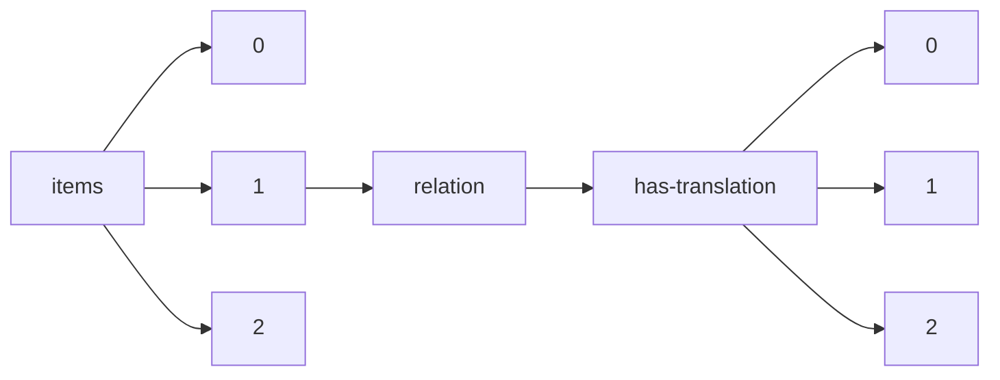

!!! warning "This document is not official Crossref documentation"
# Elements
PATH = items/array/relation/has-translation/array(1)  
Occurs 6 644 times  
{ .annotate }

1. A route to an element, for example:  
   The route "items/array/relation/has-translation/array" corresponds to navigating through the JSON indices as  
   ["items"][0]["relation"]["has-translation"][0]  

## Asserted-by
See more information: [items/array/relation/has-translation/array/asserted-by](asserted-by/index.md)  
Occurs 6 644 timess  
Unique values: 2  

| **Row** | **Value** `String` | **Count** `Int64` |
|--------:|----------------------:|---------------------:|
| **1**   | subject               | 5 199                |
| **2**   | object                | 1 445                |

## Id
See more information: [items/array/relation/has-translation/array/id](id/index.md)  
Occurs 6 644 timess  
Unique values: > 999  

!!! note "Due to current limitations, only the first 1,000 unique values are counted."

| **Row** | **Value** `String`               | **Count** `Int64` |
|--------:|------------------------------------:|---------------------:|
| **1**   | https://www.imaios.com/jp/e-Anatomy | 26                   |
| **2**   | https://www.imaios.com/br/e-Anatomy | 26                   |
| **3**   | https://www.imaios.com/de/e-Anatomy | 26                   |
| **4**   | https://www.imaios.com/es/e-Anatomy | 26                   |
| **5**   | https://www.imaios.com/fr/e-Anatomy | 26                   |
| **6**   | https://www.imaios.com/ru/e-Anatomy | 26                   |
| **7**   | https://www.imaios.com/cn/e-Anatomy | 26                   |
| **8**   | https://www.imaios.com/pl/e-Anatomy | 26                   |
| **9**   | 10.37019/e-anatomy/93511            | 8                    |
| **10**  | 10.37019/e-anatomy/901113           | 8                    |
| ... | ... | ... |

## Id-type
See more information: [items/array/relation/has-translation/array/id-type](id-type/index.md)  
Occurs 6 644 timess  
Unique values: 2  

| **Row** | **Value** `String` | **Count** `Int64` |
|--------:|----------------------:|---------------------:|
| **1**   | doi                   | 6 401                |
| **2**   | uri                   | 243                  |

