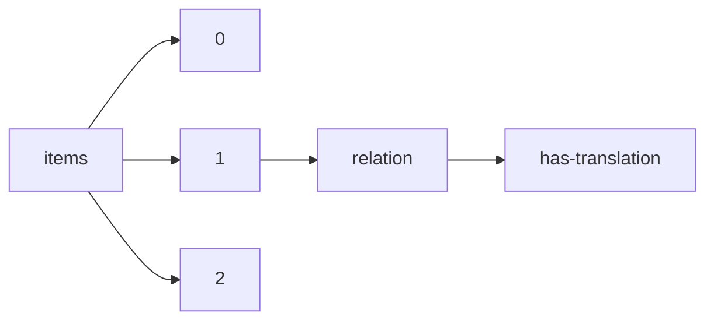

!!! warning "This document is not official Crossref documentation"
# Has-translation
PATH = items/array/relation/has-translation(1)  
Occurs 5 308 times  
{ .annotate }

1. A route to an element, for example:  
   The route "items/array/relation/has-translation" corresponds to navigating through the JSON indices as  
   ["items"][0]["relation"]["has-translation"]  

## Properties of Array
See information about elements: [items/array/relation/has-translation/array](array/index.md)  
Distribution of lengths:  

| **Row** | **Length** `Any` | **Count** `Int64` |
|--------:|--------------------:|---------------------:|
| **1**   | 1                   | 4 780                |
| **2**   | 2                   | 396                  |
| **3**   | 3                   | 5                    |
| **4**   | 8                   | 111                  |
| **5**   | 9                   | 10                   |
| **6**   | 11                  | 5                    |
| **7**   | 24                  | 1                    |

