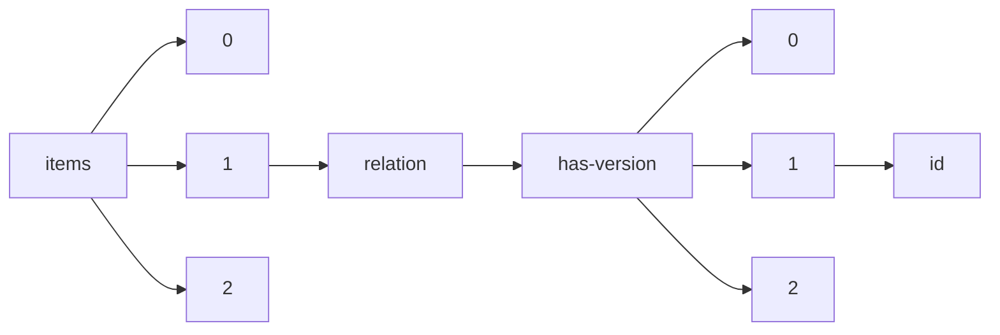

!!! warning "This document is not official Crossref documentation"
# Id
PATH = items/array/relation/has-version/array/id(1)  
Occurs 20 753 times  
Unique values: > 999  
{ .annotate }

1. A route to an element, for example:  
   The route "items/array/relation/has-version/array/id" corresponds to navigating through the JSON indices as  
   ["items"][0]["relation"]["has-version"][0]["id"]  

!!! note "Due to current limitations, only the first 1,000 unique values are counted."

| **Row** | **Value** `String`                  | **Count** `Int64` |
|--------:|---------------------------------------:|---------------------:|
| **1**   | 10.21203/rs.3.rs-708548/v27            | 26                   |
| **2**   | 10.21203/rs.3.rs-708548/v9             | 26                   |
| **3**   | 10.21203/rs.3.rs-708548/v16            | 26                   |
| **4**   | 10.21203/rs.3.rs-708548/v10            | 26                   |
| **5**   | 10.21203/rs.3.rs-708548/v15            | 26                   |
| **6**   | 10.21203/rs.3.rs-708548/v21            | 26                   |
| **7**   | 10.21203/rs.3.rs-708548/v7             | 26                   |
| **8**   | 10.21203/rs.3.rs-708548/v17            | 26                   |
| **9**   | 10.21203/rs.3.rs-708548/v3             | 26                   |
| **10**  | 10.21203/rs.3.rs-708548/v12            | 26                   |
| **11**  | 10.21203/rs.3.rs-708548/v1             | 26                   |
| **12**  | 10.21203/rs.3.rs-708548/v2             | 26                   |
| **13**  | 10.21203/rs.3.rs-708548/v20            | 26                   |
| **14**  | 10.21203/rs.3.rs-708548/v26            | 25                   |
| **15**  | 10.21203/rs.3.rs-708548/v4             | 25                   |
| **16**  | 10.21203/rs.3.rs-708548/v23            | 25                   |
| **17**  | 10.21203/rs.3.rs-708548/v14            | 25                   |
| **18**  | 10.21203/rs.3.rs-708548/v22            | 21                   |
| **19**  | 10.21203/rs.3.rs-708548/v18            | 21                   |
| **20**  | 10.21203/rs.3.rs-708548/v8             | 20                   |
| **21**  | 10.21203/rs.3.rs-708548/v24            | 20                   |
| **22**  | 10.21203/rs.3.rs-708548/v13            | 19                   |
| **23**  | 10.21203/rs.3.rs-708548/v11            | 19                   |
| **24**  | 10.21203/rs.3.rs-708548/v5             | 19                   |
| **25**  | 10.21203/rs.3.rs-708548/v25            | 19                   |
| **26**  | 10.21203/rs.3.rs-708548/v6             | 19                   |
| **27**  | 10.21203/rs.3.rs-708548/v19            | 18                   |
| **28**  | 10.17504/protocols.io.8uvhww6          | 15                   |
| **29**  | 10.17504/protocols.io.5qpvonn2bl4o/v15 | 15                   |
| **30**  | 10.17504/protocols.io.779hrr6          | 14                   |
| **31**  | 10.17504/protocols.io.5qpvonn2bl4o/v13 | 13                   |
| **32**  | 10.17504/protocols.io.5qpvonn2bl4o/v14 | 13                   |
| **33**  | 10.17504/protocols.io.2bvgan6          | 12                   |
| **34**  | 10.17504/protocols.io.594g98w          | 12                   |
| **35**  | 10.17504/protocols.io.bqjbmuin         | 12                   |
| **36**  | 10.17504/protocols.io.bndema3e         | 12                   |
| **37**  | 10.20944/preprints202208.0309.v1       | 11                   |
| **38**  | 10.20944/preprints202208.0309.v12      | 11                   |
| **39**  | 10.17504/protocols.io.59zg976          | 11                   |
| **40**  | 10.20944/preprints202208.0309.v6       | 11                   |
| **41**  | 10.20944/preprints202208.0309.v9       | 11                   |
| **42**  | 10.17504/protocols.io.nghdbt6          | 10                   |
| **43**  | 10.17504/protocols.io.fuhbnt6          | 10                   |
| **44**  | 10.17504/protocols.io.ngfdbtn          | 10                   |
| **45**  | 10.20944/preprints202208.0309.v2       | 10                   |
| **46**  | 10.20944/preprints202208.0309.v8       | 10                   |
| **47**  | 10.17504/protocols.io.435gyq6          | 10                   |
| **48**  | 10.20944/preprints202210.0091.v8       | 10                   |
| **49**  | 10.20944/preprints202208.0309.v7       | 10                   |
| **50**  | 10.20944/preprints202210.0091.v12      | 10                   |
| **51**  | 10.20944/preprints202208.0309.v10      | 10                   |
| **52**  | 10.20944/preprints202210.0091.v3       | 10                   |
| **53**  | 10.20944/preprints202210.0091.v11      | 10                   |
| **54**  | 10.20944/preprints202210.0091.v6       | 10                   |
| **55**  | 10.17504/protocols.io.14egnzrrzg5d/v4  | 10                   |
| **56**  | 10.17504/protocols.io.14egnzrrzg5d/v5  | 10                   |
| **57**  | 10.17504/protocols.io.b2qmqdu6         | 10                   |
| **58**  | 10.20944/preprints202208.0309.v4       | 10                   |
| **59**  | 10.20944/preprints202210.0091.v5       | 9                    |
| **60**  | 10.17504/protocols.io.nnuddew          | 9                    |
| **61**  | 10.17504/protocols.io.81wgb6pk1lpk/v6  | 9                    |
| **62**  | 10.17504/protocols.io.nysdfwe          | 9                    |
| **63**  | 10.20944/preprints201904.0076.v3       | 9                    |
| **64**  | 10.17504/protocols.io.778hrrw          | 9                    |
| **65**  | 10.20944/preprints202210.0091.v2       | 9                    |
| **66**  | 10.20944/preprints201904.0076.v9       | 9                    |
| **67**  | 10.20944/preprints201904.0076.v2       | 9                    |
| **68**  | 10.20944/preprints202210.0091.v1       | 9                    |
| **69**  | 10.20944/preprints202210.0091.v10      | 9                    |
| **70**  | 10.20944/preprints202210.0091.v9       | 9                    |
| **71**  | 10.17504/protocols.io.fuebnte          | 9                    |
| **72**  | 10.20944/preprints202208.0309.v11      | 9                    |
| **73**  | 10.17504/protocols.io.hdrb256          | 8                    |
| **74**  | 10.17504/protocols.io.2yfgftn          | 8                    |
| **75**  | 10.20944/preprints201904.0076.v8       | 8                    |
| **76**  | 10.20944/preprints202210.0091.v4       | 8                    |
| **77**  | 10.17504/protocols.io.ewov14w27vr2/v6  | 8                    |
| **78**  | 10.17504/protocols.io.fucbnsw          | 8                    |
| **79**  | 10.20944/preprints202208.0309.v3       | 8                    |
| **80**  | 10.20944/preprints201802.0040.v1       | 7                    |
| **81**  | 10.20944/preprints201802.0131.v7       | 7                    |
| **82**  | 10.17504/protocols.io.ewtbfen          | 7                    |
| **83**  | 10.17504/protocols.io.b5vwq67e         | 7                    |
| **84**  | 10.20944/preprints201802.0040.v6       | 7                    |
| **85**  | 10.20944/preprints201802.0040.v4       | 7                    |
| **86**  | 10.17504/protocols.io.b3rtqm6n         | 7                    |
| **87**  | 10.20944/preprints201802.0040.v7       | 7                    |
| **88**  | 10.17504/protocols.io.hjbb4in          | 7                    |
| **89**  | 10.20944/preprints201904.0076.v6       | 7                    |
| **90**  | 10.17504/protocols.io.t3reqm6          | 7                    |
| **91**  | 10.20944/preprints202208.0309.v5       | 7                    |
| **92**  | 10.17504/protocols.io.bfxfjpjn         | 7                    |
| **93**  | 10.17504/protocols.io.2ijgccn          | 7                    |
| **94**  | 10.20944/preprints201904.0076.v7       | 7                    |
| **95**  | 10.20944/preprints202210.0091.v7       | 7                    |
| **96**  | 10.17504/protocols.io.ypwfvpe          | 7                    |
| **97**  | 10.17504/protocols.io.b5uyq6xw         | 7                    |
| **98**  | 10.17504/protocols.io.hjdb4i6          | 7                    |
| **99**  | 10.17504/protocols.io.zxhf7j6          | 7                    |
| **100** | 10.17504/protocols.io.ft9bnr6          | 7                    |
| **101** | 10.17504/protocols.io.74vhqw6          | 6                    |
| **102** | 10.17504/protocols.io.rnnd5de          | 6                    |
| **103** | 10.17504/protocols.io.bygdpts6         | 6                    |
| **104** | 10.17504/protocols.io.bxyvppw6         | 6                    |
| **105** | 10.17504/protocols.io.m5xc87n          | 6                    |
| **106** | 10.17504/protocols.io.bzd9p296         | 6                    |
| **107** | 10.17504/protocols.io.b3xyqppw         | 6                    |
| **108** | 10.17504/protocols.io.ewibfce          | 6                    |
| **109** | 10.20944/preprints201802.0131.v8       | 6                    |
| **110** | 10.17504/protocols.io.e6abhae          | 6                    |
| **111** | 10.17504/protocols.io.ft8bnrw          | 6                    |
| **112** | 10.17504/protocols.io.evube6w          | 6                    |
| **113** | 10.20944/preprints201607.0028.v3       | 6                    |
| **114** | 10.17504/protocols.io.bz7cp9iw         | 6                    |
| **115** | 10.20944/preprints202108.0087.v6       | 6                    |
| **116** | 10.17504/protocols.io.5qpvob3e9l4o/v2  | 6                    |
| **117** | 10.17504/protocols.io.7vmhn46          | 6                    |
| **118** | 10.17504/protocols.io.29ngh5e          | 6                    |
| **119** | 10.20944/preprints201802.0040.v2       | 6                    |
| **120** | 10.20944/preprints201607.0028.v1       | 6                    |
| **121** | 10.17504/protocols.io.w8ffhtn          | 6                    |
| **122** | 10.17504/protocols.io.by2mpyc6         | 6                    |
| **123** | 10.17504/protocols.io.n99dh96          | 6                    |
| **124** | 10.20944/preprints201607.0028.v5       | 6                    |
| **125** | 10.17504/protocols.io.bsbxnapn         | 6                    |
| **126** | 10.20944/preprints202108.0087.v7       | 6                    |
| **127** | 10.17504/protocols.io.p6kdrcw          | 6                    |
| **128** | 10.17504/protocols.io.tfrejm6          | 6                    |
| **129** | 10.20944/preprints201904.0076.v4       | 6                    |
| **130** | 10.17504/protocols.io.dwt7em           | 5                    |
| **131** | 10.20944/preprints202207.0399.v27      | 5                    |
| **132** | 10.20944/preprints201711.0157.v3       | 5                    |
| **133** | 10.17504/protocols.io.b5u2q6ye         | 5                    |
| **134** | 10.17504/protocols.io.w62fhge          | 5                    |
| **135** | 10.20944/preprints202004.0277.v5       | 5                    |
| **136** | 10.20944/preprints202004.0512.v6       | 5                    |
| **137** | 10.20944/preprints202004.0512.v5       | 5                    |
| **138** | 10.17504/protocols.io.btdnni5e         | 5                    |
| **139** | 10.17504/protocols.io.be48jgzw         | 5                    |
| **140** | 10.20944/preprints201711.0157.v1       | 5                    |
| **141** | 10.20944/preprints201711.0157.v5       | 5                    |
| **142** | 10.20944/preprints201802.0040.v5       | 5                    |
| **143** | 10.17504/protocols.io.hicb4aw          | 5                    |
| **144** | 10.20944/preprints201910.0144.v6       | 5                    |
| **145** | 10.20944/preprints201811.0301.v1       | 5                    |
| **146** | 10.20944/preprints201607.0028.v7       | 5                    |
| **147** | 10.20944/preprints201802.0040.v8       | 5                    |
| **148** | 10.20944/preprints202108.0087.v2       | 5                    |
| **149** | 10.20944/preprints202004.0512.v1       | 5                    |
| **150** | 10.17504/protocols.io.bepkjdkw         | 5                    |
| **151** | 10.17504/protocols.io.hidb4a6          | 5                    |
| **152** | 10.17504/protocols.io.ewdbfa6          | 5                    |
| **153** | 10.20944/preprints201805.0173.v6       | 5                    |
| **154** | 10.17504/protocols.io.vere3d6          | 5                    |
| **155** | 10.20944/preprints201904.0076.v1       | 5                    |
| **156** | 10.17504/protocols.io.brqwm5xe         | 5                    |
| **157** | 10.20944/preprints202004.0277.v4       | 5                    |
| **158** | 10.21203/rs.3.rs-590186/v3             | 5                    |
| **159** | 10.20944/preprints201802.0040.v3       | 5                    |
| **160** | 10.20944/preprints202004.0277.v1       | 5                    |
| **161** | 10.20944/preprints201802.0131.v4       | 5                    |
| **162** | 10.17504/protocols.io.te9ejh6          | 5                    |
| **163** | 10.20944/preprints201904.0076.v5       | 5                    |
| **164** | 10.20944/preprints201904.0076.v10      | 5                    |
| **165** | 10.17504/protocols.io.ns9deh6          | 5                    |
| **166** | 10.17504/protocols.io.bhxmj7k6         | 4                    |
| **167** | 10.21203/rs.3.rs-2129511/v5            | 4                    |
| **168** | 10.33774/coe-2021-5dwz2-v5             | 4                    |
| **169** | 10.17504/protocols.io.yxnfxme          | 4                    |
| **170** | 10.33774/coe-2021-n3vv9-v10            | 4                    |
| **171** | 10.17504/protocols.io.9i7h4hn          | 4                    |
| **172** | 10.20944/preprints202207.0399.v25      | 4                    |
| **173** | 10.33774/coe-2021-5dwz2-v3             | 4                    |
| **174** | 10.33774/coe-2020-l173k-v9             | 4                    |
| **175** | 10.17504/protocols.io.bukhnut6         | 4                    |
| **176** | 10.17504/protocols.io.z99f996          | 4                    |
| **177** | 10.17504/protocols.io.bdwni7de         | 4                    |
| **178** | 10.17504/protocols.io.kbecsje          | 4                    |
| **179** | 10.17504/protocols.io.bgndjva6         | 4                    |
| **180** | 10.17504/protocols.io.bx72prqe         | 4                    |
| **181** | 10.21203/rs.3.rs-88120/v3              | 4                    |
| **182** | 10.17504/protocols.io.kevcte6          | 4                    |
| **183** | 10.17504/protocols.io.bwj6pcre         | 4                    |
| **184** | 10.17504/protocols.io.14egnzrrzg5d/v6  | 4                    |
| **185** | 10.20944/preprints202301.0204.v5       | 4                    |
| **186** | 10.20944/preprints202207.0399.v11      | 4                    |
| **187** | 10.20944/preprints202207.0399.v9       | 4                    |
| **188** | 10.17504/protocols.io.qekdtcw          | 4                    |
| **189** | 10.20944/preprints202207.0399.v7       | 4                    |
| **190** | 10.20944/preprints202108.0087.v3       | 4                    |
| **191** | 10.17504/protocols.io.5yeg7te          | 4                    |
| **192** | 10.17504/protocols.io.yh2ft8e          | 4                    |
| **193** | 10.20944/preprints201805.0173.v5       | 4                    |
| **194** | 10.17504/protocols.io.ftkbnkw          | 4                    |
| **195** | 10.20944/preprints202301.0204.v1       | 4                    |
| **196** | 10.17504/protocols.io.hi7b4hn          | 4                    |
| **197** | 10.17504/protocols.io.buuknwuw         | 4                    |
| **198** | 10.20944/preprints201905.0352.v5       | 4                    |
| **199** | 10.17504/protocols.io.ketcten          | 4                    |
| **200** | 10.20944/preprints202005.0409.v5       | 4                    |
| **201** | 10.20944/preprints201910.0057.v3       | 4                    |
| **202** | 10.21203/rs.3.rs-590186/v5             | 4                    |
| **203** | 10.17504/protocols.io.rynd7ve          | 4                    |
| **204** | 10.20944/preprints201802.0131.v2       | 4                    |
| **205** | 10.17504/protocols.io.be2fjgbn         | 4                    |
| **206** | 10.20944/preprints202104.0034.v4       | 4                    |
| **207** | 10.20944/preprints202004.0277.v6       | 4                    |
| **208** | 10.20944/preprints202207.0399.v15      | 4                    |
| **209** | 10.17504/protocols.io.5xhg7j6          | 4                    |
| **210** | 10.17504/protocols.io.yqefvte          | 4                    |
| **211** | 10.17504/protocols.io.nt9der6          | 4                    |
| **212** | 10.20944/preprints201711.0157.v6       | 4                    |
| **213** | 10.20944/preprints201802.0131.v9       | 4                    |
| **214** | 10.17504/protocols.io.yxifxke          | 4                    |
| **215** | 10.17504/protocols.io.xu4fnyw          | 4                    |
| **216** | 10.17504/protocols.io.ftrbnm6          | 4                    |
| **217** | 10.20944/preprints202004.0512.v2       | 4                    |
| **218** | 10.17504/protocols.io.nebdban          | 4                    |
| **219** | 10.17504/protocols.io.nbmdak6          | 4                    |
| **220** | 10.20944/preprints202004.0277.v2       | 4                    |
| **221** | 10.21203/rs.3.rs-590186/v6             | 4                    |
| **222** | 10.21203/rs.3.rs-590186/v8             | 4                    |
| **223** | 10.20944/preprints202207.0399.v10      | 4                    |
| **224** | 10.17504/protocols.io.f9kbr4w          | 4                    |
| **225** | 10.20944/preprints202207.0399.v6       | 4                    |
| **226** | 10.20944/preprints202108.0087.v1       | 4                    |
| **227** | 10.17504/protocols.io.e55bg86          | 4                    |
| **228** | 10.20944/preprints201805.0173.v3       | 4                    |
| **229** | 10.17504/protocols.io.57hg9j6          | 4                    |
| **230** | 10.20944/preprints202207.0399.v1       | 4                    |
| **231** | 10.17504/protocols.io.vdee23e          | 4                    |
| **232** | 10.17504/protocols.io.bnhemb3e         | 4                    |
| **233** | 10.17504/protocols.io.w8gfhtw          | 4                    |
| **234** | 10.20944/preprints202207.0399.v5       | 4                    |
| **235** | 10.20944/preprints202207.0399.v8       | 4                    |
| **236** | 10.17504/protocols.io.bb2iiqce         | 4                    |
| **237** | 10.20944/preprints202104.0034.v1       | 4                    |
| **238** | 10.17504/protocols.io.14egnzrrzg5d/v7  | 4                    |
| **239** | 10.20944/preprints201910.0057.v2       | 4                    |
| **240** | 10.17504/protocols.io.5xgg7jw          | 4                    |
| **241** | 10.20944/preprints201711.0157.v2       | 4                    |
| **242** | 10.17504/protocols.io.42jgycn          | 4                    |
| **243** | 10.17504/protocols.io.nt7dern          | 4                    |
| **244** | 10.20944/preprints202104.0034.v5       | 4                    |
| **245** | 10.20944/preprints202207.0399.v19      | 4                    |
| **246** | 10.17504/protocols.io.f8qbrvw          | 4                    |
| **247** | 10.20944/preprints202207.0399.v13      | 4                    |
| **248** | 10.17504/protocols.io.vnce5aw          | 4                    |
| **249** | 10.17504/protocols.io.hjeb4je          | 4                    |
| **250** | 10.20944/preprints201805.0173.v2       | 4                    |
| **251** | 10.17504/protocols.io.wigfcbw          | 3                    |
| **252** | 10.17504/protocols.io.kxygxzdbwv8j/v3  | 3                    |
| **253** | 10.20944/preprints202207.0121.v4       | 3                    |
| **254** | 10.17504/protocols.io.fthbnj6          | 3                    |
| **255** | 10.20944/preprints202011.0146.v2       | 3                    |
| **256** | 10.20944/preprints202301.0163.v3       | 3                    |
| **257** | 10.20944/preprints201801.0039.v4       | 3                    |
| **258** | 10.17504/protocols.io.bu95nz86         | 3                    |
| **259** | 10.17504/protocols.io.bugxntxn         | 3                    |
| **260** | 10.17504/protocols.io.bg9sjz6e         | 3                    |
| **261** | 10.20944/preprints201712.0077.v4       | 3                    |
| **262** | 10.17504/protocols.io.bmazk2f6         | 3                    |
| **263** | 10.20944/preprints201803.0135.v2       | 3                    |
| **264** | 10.20944/preprints202002.0147.v4       | 3                    |
| **265** | 10.17504/protocols.io.bv9jn94n         | 3                    |
| **266** | 10.21203/rs.3.rs-1456664/v2            | 3                    |
| **267** | 10.33774/coe-2021-n3vv9-v5             | 3                    |
| **268** | 10.17504/protocols.io.b2kkqcuw         | 3                    |
| **269** | 10.20944/preprints201608.0017.v4       | 3                    |
| **270** | 10.21203/rs.3.rs-1456664/v1            | 3                    |
| **271** | 10.17504/protocols.io.be2djga6         | 3                    |
| **272** | 10.20944/preprints201805.0188.v4       | 3                    |
| **273** | 10.21203/rs.3.rs-2439561/v4            | 3                    |
| **274** | 10.20944/preprints201908.0284.v2       | 3                    |
| **275** | 10.20944/preprints202007.0576.v1       | 3                    |
| **276** | 10.17504/protocols.io.yxmfxk6          | 3                    |
| **277** | 10.17504/protocols.io.bpwympfw         | 3                    |
| **278** | 10.17504/protocols.io.bacsiawe         | 3                    |
| **279** | 10.21203/rs.3.rs-2577298/v4            | 3                    |
| **280** | 10.17504/protocols.io.bhz2j78e         | 3                    |
| **281** | 10.17504/protocols.io.vdde226          | 3                    |
| **282** | 10.20944/preprints201811.0189.v2       | 3                    |
| **283** | 10.20944/preprints201711.0157.v4       | 3                    |
| **284** | 10.17504/protocols.io.2mjgc4n          | 3                    |
| **285** | 10.20944/preprints202004.0368.v1       | 3                    |
| **286** | 10.20944/preprints202207.0121.v1       | 3                    |
| **287** | 10.21203/rs.3.rs-2129511/v4            | 3                    |
| **288** | 10.20944/preprints201811.0301.v5       | 3                    |
| **289** | 10.20944/preprints201610.0033.v5       | 3                    |
| **290** | 10.17504/protocols.io.f8ibrue          | 3                    |
| **291** | 10.17504/protocols.io.bepxjdpn         | 3                    |
| **292** | 10.17504/protocols.io.b2uyqexw         | 3                    |
| **293** | 10.20944/preprints201805.0188.v1       | 3                    |
| **294** | 10.17504/protocols.io.qsgdwbw          | 3                    |
| **295** | 10.20944/preprints201811.0189.v3       | 3                    |
| **296** | 10.20944/preprints202004.0512.v4       | 3                    |
| **297** | 10.17504/protocols.io.rm7vzy39rlx1/v3  | 3                    |
| **298** | 10.21203/rs.3.rs-1352724/v4            | 3                    |
| **299** | 10.20944/preprints201912.0163.v4       | 3                    |
| **300** | 10.17504/protocols.io.5zcg72w          | 3                    |
| **301** | 10.33774/coe-2021-5dwz2                | 3                    |
| **302** | 10.33774/coe-2021-n3vv9-v8             | 3                    |
| **303** | 10.20944/preprints202207.0121.v2       | 3                    |
| **304** | 10.33774/coe-2021-n3vv9-v9             | 3                    |
| **305** | 10.33774/coe-2020-l173k-v8             | 3                    |
| **306** | 10.21203/rs.3.rs-1456664/v4            | 3                    |
| **307** | 10.17504/protocols.io.bwmrpc56         | 3                    |
| **308** | 10.17504/protocols.io.bvvtn66n         | 3                    |
| **309** | 10.17504/protocols.io.bqu3mwyn         | 3                    |
| **310** | 10.33774/coe-2021-n3vv9-v11            | 3                    |
| **311** | 10.17504/protocols.io.f7xbrpn          | 3                    |
| **312** | 10.20944/preprints201902.0172.v3       | 3                    |
| **313** | 10.20944/preprints202207.0399.v20      | 3                    |
| **314** | 10.17504/protocols.io.55dg826          | 3                    |
| **315** | 10.17504/protocols.io.bsfdnbi6         | 3                    |
| **316** | 10.17504/protocols.io.jtvcnn6          | 3                    |
| **317** | 10.17504/protocols.io.bf66jrhe         | 3                    |
| **318** | 10.17504/protocols.io.bc6bizan         | 3                    |
| **319** | 10.17504/protocols.io.p5vdq66          | 3                    |
| **320** | 10.20944/preprints202207.0399.v2       | 3                    |
| **321** | 10.20944/preprints201802.0131.v3       | 3                    |
| **322** | 10.20944/preprints201610.0033.v3       | 3                    |
| **323** | 10.20944/preprints202002.0289.v4       | 3                    |
| **324** | 10.17504/protocols.io.e5zbg76          | 3                    |
| **325** | 10.17504/protocols.io.r7cd9iw          | 3                    |
| **326** | 10.20944/preprints202301.0023.v6       | 3                    |
| **327** | 10.20944/preprints202004.0512.v3       | 3                    |
| **328** | 10.20944/preprints201805.0188.v3       | 3                    |
| **329** | 10.17504/protocols.io.byshpwb6         | 3                    |
| **330** | 10.17504/protocols.io.bqx5mxq6         | 3                    |
| **331** | 10.20944/preprints202005.0409.v1       | 3                    |
| **332** | 10.17504/protocols.io.bg5tjy6n         | 3                    |
| **333** | 10.21203/rs.3.rs-1352724/v1            | 3                    |
| **334** | 10.17504/protocols.io.btsrnnd6         | 3                    |
| **335** | 10.20944/preprints201901.0038.v4       | 3                    |
| **336** | 10.17504/protocols.io.jtxcnpn          | 3                    |
| **337** | 10.33774/coe-2020-l173k-v7             | 3                    |
| **338** | 10.33774/coe-2020-l173k-v18            | 3                    |
| **339** | 10.33774/coe-2021-n3vv9-v7             | 3                    |
| **340** | 10.17504/protocols.io.byrgpv3w         | 3                    |
| **341** | 10.26434/chemrxiv-2021-9g274-v2        | 3                    |
| **342** | 10.20944/preprints202301.0204.v3       | 3                    |
| **343** | 10.17504/protocols.io.bwxcpfiw         | 3                    |
| **344** | 10.33774/coe-2021-5dwz2-v4             | 3                    |
| **345** | 10.17504/protocols.io.e5qbg5w          | 3                    |
| **346** | 10.17504/protocols.io.bhxkj7kw         | 3                    |
| **347** | 10.20944/preprints202104.0034.v2       | 3                    |
| **348** | 10.33774/coe-2020-l173k-v4             | 3                    |
| **349** | 10.33774/coe-2020-l173k-v16            | 3                    |
| **350** | 10.21203/rs.3.rs-2277090/v1            | 3                    |
| **351** | 10.20944/preprints201910.0057.v1       | 3                    |
| **352** | 10.17504/protocols.io.2ungeve          | 3                    |
| **353** | 10.17504/protocols.io.bysrpwd6         | 3                    |
| **354** | 10.17504/protocols.io.rjkd4kw          | 3                    |
| **355** | 10.21203/rs.3.rs-590186/v1             | 3                    |
| **356** | 10.20944/preprints201805.0173.v1       | 3                    |
| **357** | 10.17504/protocols.io.bi46kgze         | 3                    |
| **358** | 10.20944/preprints201811.0301.v3       | 3                    |
| **359** | 10.17504/protocols.io.nz2df8e          | 3                    |
| **360** | 10.17504/protocols.io.bdn7i5hn         | 3                    |
| **361** | 10.17504/protocols.io.bxm6pk9e         | 3                    |
| **362** | 10.17504/protocols.io.bkjgkujw         | 3                    |
| **363** | 10.26434/chemrxiv-2021-9g274-v4        | 3                    |
| **364** | 10.21203/rs.3.rs-1352724/v2            | 3                    |
| **365** | 10.20944/preprints202208.0472.v4       | 3                    |
| **366** | 10.33774/coe-2021-5dwz2-v2             | 3                    |
| **367** | 10.17504/protocols.io.syheft6          | 3                    |
| **368** | 10.20944/preprints202007.0576.v4       | 3                    |
| **369** | 10.20944/preprints202301.0023.v8       | 3                    |
| **370** | 10.21203/rs.3.rs-2639206/v4            | 3                    |
| **371** | 10.17504/protocols.io.byzepx3e         | 3                    |
| **372** | 10.17504/protocols.io.6rjhd4n          | 3                    |
| **373** | 10.17504/protocols.io.bhxuj7nw         | 3                    |
| **374** | 10.20944/preprints202004.0368.v3       | 3                    |
| **375** | 10.20944/preprints202207.0121.v3       | 3                    |
| **376** | 10.33774/coe-2021-5dwz2-v10            | 3                    |
| **377** | 10.17504/protocols.io.b3bcqiiw         | 3                    |
| **378** | 10.17504/protocols.io.by7bpzin         | 3                    |
| **379** | 10.17504/protocols.io.q26g7b52klwz/v9  | 3                    |
| **380** | 10.20944/preprints201805.0173.v4       | 3                    |
| **381** | 10.17504/protocols.io.fs5bng6          | 3                    |
| **382** | 10.17504/protocols.io.b3xiqpke         | 3                    |
| **383** | 10.21203/rs.3.rs-2129511/v3            | 3                    |
| **384** | 10.17504/protocols.io.8h9ht96          | 2                    |
| **385** | 10.20944/preprints201711.0174.v3       | 2                    |
| **386** | 10.21203/rs.3.rs-1491953/v3            | 2                    |
| **387** | 10.20944/preprints201901.0082.v3       | 2                    |
| **388** | 10.20944/preprints201808.0094.v3       | 2                    |
| **389** | 10.20944/preprints201806.0332.v3       | 2                    |
| **390** | 10.21203/rs.3.rs-2526010/v2            | 2                    |
| **391** | 10.17504/protocols.io.hi5b4g6          | 2                    |
| **392** | 10.17504/protocols.io.f55bq86          | 2                    |
| **393** | 10.20944/preprints201911.0314.v3       | 2                    |
| **394** | 10.21203/rs.3.rs-1573462/v1            | 2                    |
| **395** | 10.20944/preprints202001.0157.v2       | 2                    |
| **396** | 10.20944/preprints201706.0047.v2       | 2                    |
| **397** | 10.20944/preprints201706.0094.v3       | 2                    |
| **398** | 10.20944/preprints201911.0350.v1       | 2                    |
| **399** | 10.17504/protocols.io.97bh9in          | 2                    |
| **400** | 10.17504/protocols.io.bu3tnynn         | 2                    |
| **401** | 10.17504/protocols.io.7k6hkze          | 2                    |
| **402** | 10.17504/protocols.io.besnjede         | 2                    |
| **403** | 10.20944/preprints202103.0654.v3       | 2                    |
| **404** | 10.20944/preprints201706.0012.v1       | 2                    |
| **405** | 10.20944/preprints201810.0415.v2       | 2                    |
| **406** | 10.17504/protocols.io.b2pvqdn6         | 2                    |
| **407** | 10.17504/protocols.io.brqvm5w6         | 2                    |
| **408** | 10.17504/protocols.io.7ukhnuw          | 2                    |
| **409** | 10.20944/preprints201705.0029.v2       | 2                    |
| **410** | 10.20944/preprints201903.0194.v2       | 2                    |
| **411** | 10.17504/protocols.io.bwcipaue         | 2                    |
| **412** | 10.20944/preprints202002.0092.v3       | 2                    |
| **413** | 10.17504/protocols.io.bf7ujrnw         | 2                    |
| **414** | 10.20944/preprints201901.0118.v2       | 2                    |
| **415** | 10.20944/preprints202007.0336.v3       | 2                    |
| **416** | 10.21203/rs.3.rs-1106615/v1            | 2                    |
| **417** | 10.20944/preprints201909.0166.v2       | 2                    |
| **418** | 10.17504/protocols.io.7uahnse          | 2                    |
| **419** | 10.20944/preprints202002.0066.v2       | 2                    |
| **420** | 10.17504/protocols.io.b4cyqsxw         | 2                    |
| **421** | 10.17504/protocols.io.ftibnke          | 2                    |
| **422** | 10.20944/preprints201808.0071.v3       | 2                    |
| **423** | 10.20944/preprints201801.0173.v1       | 2                    |
| **424** | 10.20944/preprints202301.0023.v7       | 2                    |
| **425** | 10.20944/preprints201904.0043.v3       | 2                    |
| **426** | 10.20944/preprints201805.0238.v1       | 2                    |
| **427** | 10.20944/preprints201806.0332.v2       | 2                    |
| **428** | 10.20944/preprints201909.0028.v2       | 2                    |
| **429** | 10.21203/rs.3.rs-2422645/v2            | 2                    |
| **430** | 10.17504/protocols.io.kancsde          | 2                    |
| **431** | 10.17504/protocols.io.f7vbrn6          | 2                    |
| **432** | 10.21203/rs.3.rs-2378527/v1            | 2                    |
| **433** | 10.20944/preprints201901.0165.v2       | 2                    |
| **434** | 10.20944/preprints202105.0066.v1       | 2                    |
| **435** | 10.17504/protocols.io.besajeae         | 2                    |
| **436** | 10.20944/preprints201712.0001.v2       | 2                    |
| **437** | 10.17504/protocols.io.b2hzqb76         | 2                    |
| **438** | 10.17504/protocols.io.m4bc8sn          | 2                    |
| **439** | 10.17504/protocols.io.bwm5pc86         | 2                    |
| **440** | 10.17504/protocols.io.nkudcww          | 2                    |
| **441** | 10.17504/protocols.io.bbimikc6         | 2                    |
| **442** | 10.17504/protocols.io.y2pfydn          | 2                    |
| **443** | 10.17504/protocols.io.nbzdap6          | 2                    |
| **444** | 10.20944/preprints202002.0147.v2       | 2                    |
| **445** | 10.17504/protocols.io.nshdeb6          | 2                    |
| **446** | 10.17504/protocols.io.bpy6mpze         | 2                    |
| **447** | 10.20944/preprints202012.0625.v3       | 2                    |
| **448** | 10.17504/protocols.io.byqzpvx6         | 2                    |
| **449** | 10.20944/preprints202301.0163.v2       | 2                    |
| **450** | 10.20944/preprints202302.0074.v3       | 2                    |
| **451** | 10.17504/protocols.io.bgxjjxkn         | 2                    |
| **452** | 10.20944/preprints201902.0215.v4       | 2                    |
| **453** | 10.17504/protocols.io.bchwit7e         | 2                    |
| **454** | 10.20944/preprints201810.0123.v3       | 2                    |
| **455** | 10.17504/protocols.io.v4pe8vn          | 2                    |
| **456** | 10.20944/preprints202005.0409.v3       | 2                    |
| **457** | 10.17504/protocols.io.k9icz4e          | 2                    |
| **458** | 10.9789/2175-5361.rpcfo.v12.7826       | 2                    |
| **459** | 10.17504/protocols.io.m3dc8i6          | 2                    |
| **460** | 10.17504/protocols.io.43qgymw          | 2                    |
| **461** | 10.17504/protocols.io.rmrd456          | 2                    |
| **462** | 10.20944/preprints201902.0215.v2       | 2                    |
| **463** | 10.20944/preprints202208.0472.v2       | 2                    |
| **464** | 10.17504/protocols.io.ewov14w27vr2/v7  | 2                    |
| **465** | 10.17504/protocols.io.q7cdziw          | 2                    |
| **466** | 10.17504/protocols.io.ewov14w27vr2/v8  | 2                    |
| **467** | 10.20944/preprints201703.0079.v2       | 2                    |
| **468** | 10.17504/protocols.io.2edgba6          | 2                    |
| **469** | 10.17504/protocols.io.95rh856          | 2                    |
| **470** | 10.17504/protocols.io.ntpdemn          | 2                    |
| **471** | 10.20944/preprints201809.0368.v1       | 2                    |
| **472** | 10.17504/protocols.io.yxjfxkn          | 2                    |
| **473** | 10.20944/preprints201607.0028.v2       | 2                    |
| **474** | 10.17504/protocols.io.bx64prgw         | 2                    |
| **475** | 10.20944/preprints202301.0204.v4       | 2                    |
| **476** | 10.17504/protocols.io.be4djgs6         | 2                    |
| **477** | 10.33774/coe-2021-n3vv9-v6             | 2                    |
| **478** | 10.20944/preprints201610.0042.v3       | 2                    |
| **479** | 10.17504/protocols.io.95qh85w          | 2                    |
| **480** | 10.17504/protocols.io.kb7csrn          | 2                    |
| **481** | 10.17504/protocols.io.5weg7be          | 2                    |
| **482** | 10.20944/preprints201811.0301.v6       | 2                    |
| **483** | 10.17504/protocols.io.bgz2jx8e         | 2                    |
| **484** | 10.17504/protocols.io.bwhppb5n         | 2                    |
| **485** | 10.33774/coe-2021-n3vv9-v2             | 2                    |
| **486** | 10.20944/preprints202003.0077.v1       | 2                    |
| **487** | 10.20944/preprints201706.0094.v1       | 2                    |
| **488** | 10.20944/preprints202207.0399.v14      | 2                    |
| **489** | 10.20944/preprints202005.0409.v2       | 2                    |
| **490** | 10.17504/protocols.io.86khzcw          | 2                    |
| **491** | 10.17504/protocols.io.evtbe6n          | 2                    |
| **492** | 10.20944/preprints201711.0054.v1       | 2                    |
| **493** | 10.17504/protocols.io.bream3ae         | 2                    |
| **494** | 10.20944/preprints202207.0399.v3       | 2                    |
| **495** | 10.20944/preprints201811.0353.v2       | 2                    |
| **496** | 10.20944/preprints202004.0368.v5       | 2                    |
| **497** | 10.20944/preprints202104.0034.v3       | 2                    |
| **498** | 10.21203/rs.3.rs-1106615/v3            | 2                    |
| **499** | 10.17504/protocols.io.gy5bxy6          | 2                    |
| **500** | 10.20944/preprints201905.0352.v4       | 2                    |
| **501** | 10.17504/protocols.io.e3zbgp6          | 2                    |
| **502** | 10.33774/apsa-2021-l8k5x-v3            | 2                    |
| **503** | 10.20944/preprints202003.0052.v4       | 2                    |
| **504** | 10.20944/preprints202002.0051.v3       | 2                    |
| **505** | 10.20944/preprints201808.0094.v2       | 2                    |
| **506** | 10.21203/rs.3.rs-1539214/v1            | 2                    |
| **507** | 10.17504/protocols.io.kxygxzdbwv8j/v4  | 2                    |
| **508** | 10.21203/rs.3.rs-2378274/v2            | 2                    |
| **509** | 10.17504/protocols.io.fitbken          | 2                    |
| **510** | 10.20944/preprints201709.0062.v3       | 2                    |
| **511** | 10.17504/protocols.io.hi6b4he          | 2                    |
| **512** | 10.17504/protocols.io.fngbmbw          | 2                    |
| **513** | 10.17504/protocols.io.biwukfew         | 2                    |
| **514** | 10.17504/protocols.io.byuxpwxn         | 2                    |
| **515** | 10.17504/protocols.io.zbef2je          | 2                    |
| **516** | 10.17504/protocols.io.81wgb1pw3vpk/v2  | 2                    |
| **517** | 10.21203/rs.3.rs-1901695/v2            | 2                    |
| **518** | 10.20944/preprints201911.0084.v2       | 2                    |
| **519** | 10.20944/preprints202112.0132.v1       | 2                    |
| **520** | 10.17504/protocols.io.vwfe7bn          | 2                    |
| **521** | 10.21203/rs.3.rs-27723/v1              | 2                    |
| **522** | 10.21203/rs.3.rs-152344/v1             | 2                    |
| **523** | 10.17504/protocols.io.ksacwae          | 2                    |
| **524** | 10.17504/protocols.io.jqdcms6          | 2                    |
| **525** | 10.20944/preprints202102.0332.v1       | 2                    |
| **526** | 10.17504/protocols.io.x8xfrxn          | 2                    |
| **527** | 10.20944/preprints201906.0142.v1       | 2                    |
| **528** | 10.20944/preprints201708.0088.v1       | 2                    |
| **529** | 10.17504/protocols.io.gg5bty6          | 2                    |
| **530** | 10.17504/protocols.io.jpdcmi6          | 2                    |
| **531** | 10.20944/preprints202301.0163.v4       | 2                    |
| **532** | 10.20944/preprints201712.0173.v1       | 2                    |
| **533** | 10.17504/protocols.io.hhhb336          | 2                    |
| **534** | 10.17504/protocols.io.bcuhiwt6         | 2                    |
| **535** | 10.33774/coe-2020-l173k-v15            | 2                    |
| **536** | 10.17504/protocols.io.b34pqqvn         | 2                    |
| **537** | 10.20944/preprints201802.0131.v5       | 2                    |
| **538** | 10.20944/preprints201710.0114.v1       | 2                    |
| **539** | 10.20944/preprints202301.0163.v5       | 2                    |
| **540** | 10.17504/protocols.io.8fahtie          | 2                    |
| **541** | 10.33774/coe-2021-wfzw6-v2             | 2                    |
| **542** | 10.17504/protocols.io.ga4bsgw          | 2                    |
| **543** | 10.17504/protocols.io.tdmei46          | 2                    |
| **544** | 10.21203/rs.3.rs-1195514/v1            | 2                    |
| **545** | 10.20944/preprints202009.0267.v2       | 2                    |
| **546** | 10.20944/preprints202002.0289.v5       | 2                    |
| **547** | 10.17504/protocols.io.bxkypkxw         | 2                    |
| **548** | 10.33774/coe-2021-n3vv9-v3             | 2                    |
| **549** | 10.21203/rs.3.rs-2551316/v1            | 2                    |
| **550** | 10.17504/protocols.io.q56dy9e          | 2                    |
| **551** | 10.21203/rs.3.rs-1518507/v1            | 2                    |
| **552** | 10.17504/protocols.io.b28fqhtn         | 2                    |
| **553** | 10.17504/protocols.io.bg9njz5e         | 2                    |
| **554** | 10.17504/protocols.io.h94b98w          | 2                    |
| **555** | 10.20944/preprints202006.0299.v3       | 2                    |
| **556** | 10.17504/protocols.io.5qpvo52wdl4o/v3  | 2                    |
| **557** | 10.20944/preprints201810.0415.v1       | 2                    |
| **558** | 10.33774/coe-2020-l173k-v5             | 2                    |
| **559** | 10.21203/rs.3.rs-561383/v2             | 2                    |
| **560** | 10.33774/coe-2020-l173k-v11            | 2                    |
| **561** | 10.21203/rs.3.rs-2551316/v3            | 2                    |
| **562** | 10.17504/protocols.io.ssqeedw          | 2                    |
| **563** | 10.20944/preprints202003.0052.v2       | 2                    |
| **564** | 10.17504/protocols.io.bq6ymzfw         | 2                    |
| **565** | 10.17504/protocols.io.9vmh646          | 2                    |
| **566** | 10.21203/rs.3.rs-1910359/v3            | 2                    |
| **567** | 10.20944/preprints202003.0077.v2       | 2                    |
| **568** | 10.17504/protocols.io.wrefd3e          | 2                    |
| **569** | 10.20944/preprints201911.0350.v2       | 2                    |
| **570** | 10.17504/protocols.io.81wgb6pk1lpk/v7  | 2                    |
| **571** | 10.17504/protocols.io.bgudjws6         | 2                    |
| **572** | 10.33774/coe-2020-l173k-v3             | 2                    |
| **573** | 10.20944/preprints201901.0159.v2       | 2                    |
| **574** | 10.20944/preprints202004.0368.v2       | 2                    |
| **575** | 10.17504/protocols.io.bem9jc96         | 2                    |
| **576** | 10.33774/coe-2020-l173k                | 2                    |
| **577** | 10.17504/protocols.io.bdjti4nn         | 2                    |
| **578** | 10.17504/protocols.io.bgrajv2e         | 2                    |
| **579** | 10.20944/preprints202007.0141.v2       | 2                    |
| **580** | 10.17504/protocols.io.bdtri6m6         | 2                    |
| **581** | 10.17504/protocols.io.2qugdww          | 2                    |
| **582** | 10.17504/protocols.io.hdqb25w          | 2                    |
| **583** | 10.20944/preprints201607.0028.v4       | 2                    |
| **584** | 10.20944/preprints202208.0229.v2       | 2                    |
| **585** | 10.17504/protocols.io.wfefbje          | 2                    |
| **586** | 10.20944/preprints202207.0399.v12      | 2                    |
| **587** | 10.21203/rs.3.rs-1409611/v4            | 2                    |
| **588** | 10.20944/preprints201802.0065.v3       | 2                    |
| **589** | 10.17504/protocols.io.hhgb33w          | 2                    |
| **590** | 10.20944/preprints201610.0033.v2       | 2                    |
| **591** | 10.33774/coe-2020-l173k-v6             | 2                    |
| **592** | 10.17504/protocols.io.kesctee          | 2                    |
| **593** | 10.33774/coe-2020-l173k-v2             | 2                    |
| **594** | 10.20944/preprints201909.0043.v1       | 2                    |
| **595** | 10.17504/protocols.io.r7bd9in          | 2                    |
| **596** | 10.20944/preprints202301.0204.v2       | 2                    |
| **597** | 10.20944/preprints201811.0394.v2       | 2                    |
| **598** | 10.17504/protocols.io.bgpvjvn6         | 2                    |
| **599** | 10.17504/protocols.io.nkvdcw6          | 2                    |
| **600** | 10.21203/rs.3.rs-1961934/v1            | 2                    |
| **601** | 10.21203/rs.3.rs-2618433/v1            | 2                    |
| **602** | 10.17504/protocols.io.x45fqy6          | 2                    |
| **603** | 10.17504/protocols.io.4gkgtuw          | 2                    |
| **604** | 10.17504/protocols.io.kxygxzk5dv8j/v5  | 2                    |
| **605** | 10.17504/protocols.io.32qgqdw          | 2                    |
| **606** | 10.21203/rs.3.rs-1949857/v1            | 2                    |
| **607** | 10.17504/protocols.io.e58bg9w          | 2                    |
| **608** | 10.21203/rs.3.rs-561383/v3             | 2                    |
| **609** | 10.20944/preprints201806.0225.v1       | 2                    |
| **610** | 10.17504/protocols.io.buqhnvt6         | 2                    |
| **611** | 10.20944/preprints201810.0171.v2       | 2                    |
| **612** | 10.17504/protocols.io.4r3l2oy2pv1y/v3  | 2                    |
| **613** | 10.17504/protocols.io.b53zq8p6         | 2                    |
| **614** | 10.17504/protocols.io.zewov12ogr24/v6  | 2                    |
| **615** | 10.20944/preprints201809.0142.v3       | 2                    |
| **616** | 10.17504/protocols.io.h93b98n          | 2                    |
| **617** | 10.17504/protocols.io.pdxdi7n          | 2                    |
| **618** | 10.21203/rs.3.rs-2639206/v2            | 2                    |
| **619** | 10.20944/preprints201812.0054.v3       | 2                    |
| **620** | 10.20944/preprints201710.0114.v4       | 2                    |
| **621** | 10.17504/protocols.io.xu6fnze          | 2                    |
| **622** | 10.17504/protocols.io.hieb4be          | 2                    |
| **623** | 10.17504/protocols.io.14egn797zv5d/v3  | 2                    |
| **624** | 10.17504/protocols.io.yxmvm45nv3pe/v9  | 2                    |
| **625** | 10.17504/protocols.io.bp9cmr2w         | 2                    |
| **626** | 10.17504/protocols.io.xu5fny6          | 2                    |
| **627** | 10.20944/preprints201808.0037.v2       | 2                    |
| **628** | 10.17504/protocols.io.buc3nsyn         | 2                    |
| **629** | 10.17504/protocols.io.e6nvw5orwvmk/v5  | 2                    |
| **630** | 10.17504/protocols.io.izkcf4w          | 2                    |
| **631** | 10.33774/coe-2021-5dwz2-v9             | 2                    |
| **632** | 10.17504/protocols.io.6ibhcan          | 2                    |
| **633** | 10.20944/preprints201710.0185.v2       | 2                    |
| **634** | 10.17504/protocols.io.kxygxzk5dv8j/v4  | 2                    |
| **635** | 10.17504/protocols.io.7mjhk4n          | 2                    |
| **636** | 10.17504/protocols.io.bwbppamn         | 2                    |
| **637** | 10.17504/protocols.io.5szg6f6          | 2                    |
| **638** | 10.20944/preprints201904.0254.v1       | 2                    |
| **639** | 10.17504/protocols.io.wq6fdze          | 2                    |
| **640** | 10.20944/preprints201808.0085.v2       | 2                    |
| **641** | 10.17504/protocols.io.ber3jd8n         | 2                    |
| **642** | 10.17504/protocols.io.5gig3ue          | 2                    |
| **643** | 10.17504/protocols.io.kzycx7w          | 2                    |
| **644** | 10.33774/coe-2021-n3vv9                | 2                    |
| **645** | 10.20944/preprints202004.0368.v4       | 2                    |
| **646** | 10.17504/protocols.io.byq8pvzw         | 2                    |
| **647** | 10.17504/protocols.io.be59jg96         | 2                    |
| **648** | 10.20944/preprints201901.0038.v1       | 2                    |
| **649** | 10.17504/protocols.io.bxk7pkzn         | 2                    |
| **650** | 10.20944/preprints202005.0360.v2       | 2                    |
| **651** | 10.20944/preprints201811.0189.v4       | 2                    |
| **652** | 10.20944/preprints201905.0352.v1       | 2                    |
| **653** | 10.17504/protocols.io.bwyppfvn         | 2                    |
| **654** | 10.17504/protocols.io.vhge33w          | 2                    |
| **655** | 10.20944/preprints202108.0087.v4       | 2                    |
| **656** | 10.17504/protocols.io.hjcb4iw          | 2                    |
| **657** | 10.17504/protocols.io.bx3dpqi6         | 2                    |
| **658** | 10.17504/protocols.io.khfct3n          | 2                    |
| **659** | 10.17504/protocols.io.968h9hw          | 2                    |
| **660** | 10.20944/preprints201902.0172.v1       | 2                    |
| **661** | 10.20944/preprints201802.0131.v1       | 2                    |
| **662** | 10.17504/protocols.io.bdp7i5rn         | 2                    |
| **663** | 10.17504/protocols.io.but7nwrn         | 2                    |
| **664** | 10.17504/protocols.io.ux8exrw          | 2                    |
| **665** | 10.33774/miir-2021-4lgsp-v3            | 2                    |
| **666** | 10.33774/coe-2020-l173k-v12            | 2                    |
| **667** | 10.20944/preprints201711.0053.v1       | 2                    |
| **668** | 10.20944/preprints201903.0213.v1       | 2                    |
| **669** | 10.20944/preprints202004.0277.v3       | 2                    |
| **670** | 10.20944/preprints201806.0424.v4       | 2                    |
| **671** | 10.21203/rs.3.rs-2577298/v2            | 2                    |
| **672** | 10.20944/preprints201911.0314.v1       | 2                    |
| **673** | 10.17504/protocols.io.bmaqk2dw         | 2                    |
| **674** | 10.20944/preprints202208.0229.v1       | 2                    |
| **675** | 10.17504/protocols.io.qhedt3e          | 2                    |
| **676** | 10.33774/coe-2021-wfzw6-v4             | 2                    |
| **677** | 10.17504/protocols.io.bhw5j7g6         | 2                    |
| **678** | 10.21203/rs.3.rs-1409611/v1            | 2                    |
| **679** | 10.17504/protocols.io.budxns7n         | 2                    |
| **680** | 10.20944/preprints201806.0424.v1       | 2                    |
| **681** | 10.20944/preprints201812.0090.v3       | 2                    |
| **682** | 10.17504/protocols.io.bjswknfe         | 2                    |
| **683** | 10.20944/preprints201902.0172.v2       | 2                    |
| **684** | 10.17504/protocols.io.buisnuee         | 2                    |
| **685** | 10.20944/preprints202004.0203.v2       | 2                    |
| **686** | 10.20944/preprints201808.0094.v1       | 2                    |
| **687** | 10.20944/preprints202003.0197.v1       | 2                    |
| **688** | 10.21203/rs.3.rs-2551316/v2            | 2                    |
| **689** | 10.17504/protocols.io.hiab4ae          | 2                    |
| **690** | 10.20944/preprints201911.0314.v2       | 2                    |
| **691** | 10.17504/protocols.io.74yhqxw          | 2                    |
| **692** | 10.21203/rs.3.rs-1644919/v1            | 2                    |
| **693** | 10.17504/protocols.io.bwkdpcs6         | 2                    |
| **694** | 10.17504/protocols.io.4sugwew          | 2                    |
| **695** | 10.20944/preprints201806.0350.v2       | 2                    |
| **696** | 10.20944/preprints201807.0337.v3       | 2                    |
| **697** | 10.33774/apsa-2021-l8k5x-v4            | 2                    |
| **698** | 10.20944/preprints201711.0181.v3       | 2                    |
| **699** | 10.20944/preprints202004.0203.v4       | 2                    |
| **700** | 10.17504/protocols.io.maqc2dw          | 2                    |
| **701** | 10.17504/protocols.io.uzhex36          | 2                    |
| **702** | 10.33774/coe-2020-l173k-v17            | 2                    |
| **703** | 10.20944/preprints201811.0189.v1       | 2                    |
| **704** | 10.17504/protocols.io.wrxfd7n          | 2                    |
| **705** | 10.20944/preprints201806.0424.v3       | 2                    |
| **706** | 10.20944/preprints201802.0131.v6       | 2                    |
| **707** | 10.17504/protocols.io.fsvbne6          | 2                    |
| **708** | 10.17504/protocols.io.4r3l2oy53v1y/v3  | 2                    |
| **709** | 10.17504/protocols.io.97ah9ie          | 2                    |
| **710** | 10.33774/coe-2021-5dwz2-v6             | 2                    |
| **711** | 10.20944/preprints201905.0229.v1       | 2                    |
| **712** | 10.17504/protocols.io.nw3dfgn          | 2                    |
| **713** | 10.20944/preprints201712.0173.v3       | 2                    |
| **714** | 10.20944/preprints201710.0049.v3       | 2                    |
| **715** | 10.17504/protocols.io.bb7airie         | 2                    |
| **716** | 10.17504/protocols.io.bii4kcgw         | 2                    |
| **717** | 10.21203/rs.3.rs-590186/v4             | 2                    |
| **718** | 10.17504/protocols.io.jqgcmtw          | 2                    |
| **719** | 10.17504/protocols.io.b53tq8nn         | 2                    |
| **720** | 10.20944/preprints201711.0054.v4       | 2                    |
| **721** | 10.20944/preprints201608.0183.v1       | 2                    |
| **722** | 10.20944/preprints202006.0299.v4       | 2                    |
| **723** | 10.17504/protocols.io.e6nvw5orwvmk/v4  | 2                    |
| **724** | 10.17504/protocols.io.bwmbpc2n         | 2                    |
| **725** | 10.17504/protocols.io.fv7bn9n          | 2                    |
| **726** | 10.20944/preprints202208.0229.v4       | 2                    |
| **727** | 10.33774/coe-2020-l173k-v10            | 2                    |
| **728** | 10.17504/protocols.io.x8qfrvw          | 2                    |
| **729** | 10.17504/protocols.io.bpiumkew         | 2                    |
| **730** | 10.21203/rs.3.rs-2000899/v2            | 2                    |
| **731** | 10.17504/protocols.io.mfdc3i6          | 2                    |
| **732** | 10.20944/preprints201911.0076.v1       | 2                    |
| **733** | 10.17504/protocols.io.5sjg6cn          | 2                    |
| **734** | 10.21203/rs.3.rs-2277090/v4            | 2                    |
| **735** | 10.17504/protocols.io.vf8e3rw          | 2                    |
| **736** | 10.17504/protocols.io.bbkvikw6         | 2                    |
| **737** | 10.21203/rs.3.rs-1518507/v4            | 2                    |
| **738** | 10.17504/protocols.io.3byl4jdmjlo5/v2  | 2                    |
| **739** | 10.17504/protocols.io.bnn7mdhn         | 2                    |
| **740** | 10.20944/preprints202010.0046.v2       | 2                    |
| **741** | 10.20944/preprints202002.0289.v1       | 2                    |
| **742** | 10.26434/chemrxiv-2021-9g274           | 2                    |
| **743** | 10.20944/preprints201607.0028.v6       | 2                    |
| **744** | 10.17504/protocols.io.bw6qphdw         | 2                    |
| **745** | 10.17504/protocols.io.br4mm8u6         | 2                    |
| **746** | 10.17504/protocols.io.gg6btze          | 2                    |
| **747** | 10.17504/protocols.io.8wbhxan          | 2                    |
| **748** | 10.17504/protocols.io.ftjbnkn          | 2                    |
| **749** | 10.20944/preprints201902.0172.v4       | 2                    |
| **750** | 10.17504/protocols.io.bg5vjy66         | 2                    |
| **751** | 10.33774/coe-2021-wfzw6-v5             | 2                    |
| **752** | 10.20944/preprints201810.0123.v1       | 2                    |
| **753** | 10.33774/coe-2021-5dwz2-v8             | 2                    |
| **754** | 10.1257/rct.1360-2.0                   | 1                    |
| **755** | 10.17504/protocols.io.b3gsqjwe         | 1                    |
| **756** | 10.1257/rct.2918-1.0                   | 1                    |
| **757** | 10.1257/rct.5230-1.0                   | 1                    |
| **758** | 10.1257/rct.5545-1.1                   | 1                    |
| **759** | 10.17504/protocols.io.b3ufqntn         | 1                    |
| **760** | 10.20944/preprints202006.0166.v1       | 1                    |
| **761** | 10.1257/rct.2129-1.0                   | 1                    |
| **762** | https://cfrp.pubpub.org/pub/vn4qmtrt   | 1                    |
| **763** | 10.1257/rct.3658-6.1                   | 1                    |
| **764** | 10.21203/rs.3.rs-1964787/v1            | 1                    |
| **765** | 10.22541/au.159164757.78780485/v2      | 1                    |
| **766** | 10.1257/rct.4801-1.1                   | 1                    |
| **767** | 10.17504/protocols.io.bs2rngd6         | 1                    |
| **768** | 10.21203/rs.3.rs-2224241/v2            | 1                    |
| **769** | 10.1257/rct.5960-1.0                   | 1                    |
| **770** | 10.20944/preprints202010.0460.v1       | 1                    |
| **771** | 10.1257/rct.1484-3.2                   | 1                    |
| **772** | 10.1257/rct.6555-1.2000000000000002    | 1                    |
| **773** | 10.21203/rs.3.rs-2548920/v2            | 1                    |
| **774** | 10.1257/rct.918-1.0                    | 1                    |
| **775** | 10.20944/preprints201812.0178.v1       | 1                    |
| **776** | 10.1257/rct.6391-1.0                   | 1                    |
| **777** | 10.20944/preprints202010.0299.v1       | 1                    |
| **778** | 10.17504/protocols.io.bdpei5je         | 1                    |
| **779** | 10.1257/rct.1027-7.1                   | 1                    |
| **780** | 10.20944/preprints202006.0362.v2       | 1                    |
| **781** | 10.20944/preprints201812.0173.v2       | 1                    |
| **782** | 10.1257/rct.5180-1.0                   | 1                    |
| **783** | 10.17504/protocols.io.492gz8e          | 1                    |
| **784** | 10.1257/rct.5031-1.0                   | 1                    |
| **785** | 10.1257/rct.2299-3.0                   | 1                    |
| **786** | 10.20944/preprints202108.0052.v2       | 1                    |
| **787** | 10.17504/protocols.io.baumieu6         | 1                    |
| **788** | 10.20944/preprints201608.0121.v2       | 1                    |
| **789** | 10.1257/rct.2685-1.0                   | 1                    |
| **790** | 10.1257/rct.1631-6.0                   | 1                    |
| **791** | 10.1257/rct.4404-1.0                   | 1                    |
| **792** | 10.1257/rct.1624-9.1                   | 1                    |
| **793** | 10.20944/preprints201811.0068.v1       | 1                    |
| **794** | 10.1257/rct.1145-6.0                   | 1                    |
| **795** | 10.1257/rct.5229-2.1                   | 1                    |
| **796** | 10.17504/protocols.io.x9kfr4w          | 1                    |
| **797** | 10.32388/1G6J3Q.3                      | 1                    |
| **798** | 10.1257/rct.6721-1.0                   | 1                    |
| **799** | 10.20944/preprints202012.0749.v1       | 1                    |
| **800** | 10.1257/rct.1554-16.1                  | 1                    |
| **801** | 10.1257/rct.6018-1.0                   | 1                    |
| **802** | 10.17504/protocols.io.jg4cjyw          | 1                    |
| **803** | 10.1257/rct.2412-3.0                   | 1                    |
| **804** | 10.20944/preprints202301.0178.v2       | 1                    |
| **805** | 10.1257/rct.3290-1.0                   | 1                    |
| **806** | 10.1257/rct.1246-3.0                   | 1                    |
| **807** | 10.1257/rct.2447-1.0                   | 1                    |
| **808** | 10.1257/rct.6139-1.0                   | 1                    |
| **809** | 10.17504/protocols.io.zrkf54w          | 1                    |
| **810** | 10.32388/U5MTTB.2                      | 1                    |
| **811** | 10.21203/rs.3.rs-2175983/v2            | 1                    |
| **812** | 10.1257/rct.4200-2.0                   | 1                    |
| **813** | 10.17504/protocols.io.v2ie8ce          | 1                    |
| **814** | 10.1257/rct.2323-1.0                   | 1                    |
| **815** | 10.1257/rct.7425-1.0                   | 1                    |
| **816** | 10.1257/rct.4028-1.1                   | 1                    |
| **817** | 10.1257/rct.1333-2.0                   | 1                    |
| **818** | 10.9789/2175-5361.rpcfo.v12.7137       | 1                    |
| **819** | 10.17504/protocols.io.kqfcvtn          | 1                    |
| **820** | 10.1257/rct.2735-1.0                   | 1                    |
| **821** | 10.21203/rs.3.rs-2024983/v1            | 1                    |
| **822** | 10.20944/preprints202011.0508.v1       | 1                    |
| **823** | 10.1257/rct.3800-1.0                   | 1                    |
| **824** | 10.1257/rct.4792-1.0                   | 1                    |
| **825** | 10.1257/rct.5127-1.1                   | 1                    |
| **826** | 10.21203/rs.3.rs-2241102/v2            | 1                    |
| **827** | 10.20944/preprints201712.0134.v2       | 1                    |
| **828** | 10.20944/preprints202212.0290.v2       | 1                    |
| **829** | 10.1257/rct.4317-1.0                   | 1                    |
| **830** | 10.21016/ICEPSS.14023                  | 1                    |
| **831** | 10.21203/rs.3.rs-2400208/v2            | 1                    |
| **832** | 10.1257/rct.4249-1.1                   | 1                    |
| **833** | 10.21203/rs.3.rs-1730876/v2            | 1                    |
| **834** | 10.1257/rct.6177-2.2                   | 1                    |
| **835** | 10.1257/rct.1708-2.0                   | 1                    |
| **836** | 10.1257/rct.3115-1.0                   | 1                    |
| **837** | 10.1257/rct.5021-1.0                   | 1                    |
| **838** | 10.1257/rct.1612-1.0                   | 1                    |
| **839** | 10.1257/rct.3657-1.0                   | 1                    |
| **840** | 10.17504/protocols.io.8fkhtkw          | 1                    |
| **841** | 10.20944/preprints202302.0362.v2       | 1                    |
| **842** | 10.21203/rs.3.rs-2314634/v2            | 1                    |
| **843** | 10.20944/preprints201810.0713.v1       | 1                    |
| **844** | 10.21203/rs.3.rs-2402931/v2            | 1                    |
| **845** | 10.20944/preprints201906.0071.v1       | 1                    |
| **846** | 10.1257/rct.7225-1.0                   | 1                    |
| **847** | 10.1257/rct.4275-3.0                   | 1                    |
| **848** | 10.20944/preprints201901.0196.v1       | 1                    |
| **849** | 10.17504/protocols.io.pjrdkm6          | 1                    |
| **850** | 10.17504/protocols.io.8y3hxyn          | 1                    |
| **851** | 10.1257/rct.1312-5.0                   | 1                    |
| **852** | 10.21203/rs.3.rs-1895628/v2            | 1                    |
| **853** | 10.1257/rct.819-1.0                    | 1                    |
| **854** | 10.20944/preprints201907.0265.v2       | 1                    |
| **855** | 10.1257/rct.3498-1.0                   | 1                    |
| **856** | 10.1257/rct.4739-1.0                   | 1                    |
| **857** | 10.1257/rct.3056-1.0                   | 1                    |
| **858** | 10.1257/rct.7712-1.0                   | 1                    |
| **859** | 10.17504/protocols.io.kdmcs46          | 1                    |
| **860** | 10.1257/rct.1060-2.0                   | 1                    |
| **861** | 10.17504/protocols.io.bf64jrgw         | 1                    |
| **862** | 10.1257/rct.1319-1.0                   | 1                    |
| **863** | 10.1257/rct.7355-1.2000000000000002    | 1                    |
| **864** | 10.1257/rct.4122-1.1                   | 1                    |
| **865** | 10.1257/rct.1039-5.1                   | 1                    |
| **866** | 10.1257/rct.3673-3.0                   | 1                    |
| **867** | 10.20944/preprints201705.0031.v2       | 1                    |
| **868** | 10.20944/preprints201911.0301.v2       | 1                    |
| **869** | 10.1257/rct.6240-1.0                   | 1                    |
| **870** | 10.1257/rct.6591-1.1                   | 1                    |
| **871** | 10.1257/rct.756-1.0                    | 1                    |
| **872** | 10.1257/rct.7015-1.0                   | 1                    |
| **873** | 10.1257/rct.1812-1.0                   | 1                    |
| **874** | 10.21203/rs.3.rs-2126270/v2            | 1                    |
| **875** | 10.21203/rs.3.rs-2471999/v1            | 1                    |
| **876** | 10.17504/protocols.io.bxzqpp5w         | 1                    |
| **877** | 10.17504/protocols.io.666hhhe          | 1                    |
| **878** | 10.17504/protocols.io.eq2lynp7pvx9/v2  | 1                    |
| **879** | 10.22541/au.161360719.93879332/v2      | 1                    |
| **880** | 10.1257/rct.10774-1.0                  | 1                    |
| **881** | 10.17504/protocols.io.t3eeqje          | 1                    |
| **882** | 10.1257/rct.3538-2.0                   | 1                    |
| **883** | 10.1257/rct.5644-2.1                   | 1                    |
| **884** | 10.1257/rct.4270-1.0                   | 1                    |
| **885** | 10.1257/rct.3774-1.0                   | 1                    |
| **886** | 10.22541/au.160193464.48676767/v2      | 1                    |
| **887** | 10.1257/rct.4406-1.0                   | 1                    |
| **888** | 10.20944/preprints201805.0411.v1       | 1                    |
| **889** | 10.1257/rct.4650-1.1                   | 1                    |
| **890** | 10.21203/rs.3.rs-2045347/v2            | 1                    |
| **891** | 10.20944/preprints202009.0237.v2       | 1                    |
| **892** | 10.1257/rct.2523-1.0                   | 1                    |
| **893** | 10.21428/cb6ab371.a54dc428             | 1                    |
| **894** | 10.20944/preprints202007.0080.v2       | 1                    |
| **895** | 10.22541/au.158801943.39428086/v4      | 1                    |
| **896** | 10.1257/rct.2874-1.0                   | 1                    |
| **897** | 10.20944/preprints201712.0093.v1       | 1                    |
| **898** | 10.1257/rct.3966-2.1                   | 1                    |
| **899** | 10.1257/rct.4720-1.0                   | 1                    |
| **900** | 10.1257/rct.2801-1.0                   | 1                    |
| **901** | 10.20944/preprints201804.0343.v2       | 1                    |
| **902** | 10.1257/rct.4471-1.0                   | 1                    |
| **903** | 10.20944/preprints202011.0565.v2       | 1                    |
| **904** | 10.1257/rct.4290-1.0                   | 1                    |
| **905** | 10.20944/preprints201902.0004.v2       | 1                    |
| **906** | 10.1257/rct.3820-1.1                   | 1                    |
| **907** | 10.17504/protocols.io.678hhrw          | 1                    |
| **908** | 10.1257/rct.1781-1.0                   | 1                    |
| **909** | 10.1257/rct.7363-1.0                   | 1                    |
| **910** | 10.1257/rct.9328-1.0                   | 1                    |
| **911** | 10.17504/protocols.io.nj5dcq6          | 1                    |
| **912** | 10.1257/rct.5814-1.0                   | 1                    |
| **913** | 10.1257/rct.5525-1.0                   | 1                    |
| **914** | 10.17504/protocols.io.bmzak72e         | 1                    |
| **915** | 10.1257/rct.2402-8.2                   | 1                    |
| **916** | 10.1257/rct.1554-10.0                  | 1                    |
| **917** | 10.20944/preprints202001.0102.v2       | 1                    |
| **918** | 10.20944/preprints202002.0418.v1       | 1                    |
| **919** | 10.9789/2175-5361.rpcfo.v12.7052       | 1                    |
| **920** | 10.20944/preprints201712.0053.v2       | 1                    |
| **921** | 10.1257/rct.11041-1.0                  | 1                    |
| **922** | 10.1257/rct.7004-2.0                   | 1                    |
| **923** | 10.1257/rct.1952-1.0                   | 1                    |
| **924** | 10.1257/rct.11049-1.0                  | 1                    |
| **925** | 10.1257/rct.1783-3.0                   | 1                    |
| **926** | 10.1257/rct.1621-1.0                   | 1                    |
| **927** | 10.1257/rct.2963-9.0                   | 1                    |
| **928** | 10.1257/rct.1424-1.0                   | 1                    |
| **929** | 10.22541/au.159986525.53189546/v2      | 1                    |
| **930** | 10.21203/rs.3.rs-2305070/v2            | 1                    |
| **931** | 10.17504/protocols.io.bfyxjpxn         | 1                    |
| **932** | 10.1257/rct.7132-1.0                   | 1                    |
| **933** | 10.1257/rct.5374-2.0                   | 1                    |
| **934** | 10.1257/rct.3862-1.0                   | 1                    |
| **935** | 10.17504/protocols.io.bs99nh96         | 1                    |
| **936** | 10.1257/rct.6649-1.0                   | 1                    |
| **937** | 10.1257/rct.843-4.0                    | 1                    |
| **938** | 10.1257/rct.5397-2.1                   | 1                    |
| **939** | 10.20944/preprints202008.0162.v1       | 1                    |
| **940** | 10.1257/rct.7298-1.0                   | 1                    |
| **941** | 10.1257/rct.3147-1.0                   | 1                    |
| **942** | 10.1257/rct.2205-1.0                   | 1                    |
| **943** | 10.21203/rs.3.rs-1785892/v1            | 1                    |
| **944** | 10.1257/rct.2571-3.0                   | 1                    |
| **945** | 10.1257/rct.4729-1.0                   | 1                    |
| **946** | 10.1257/rct.1850-1.0                   | 1                    |
| **947** | 10.17504/protocols.io.bsg7nbzn         | 1                    |
| **948** | 10.1257/rct.7157-1.0                   | 1                    |
| **949** | 10.1257/rct.6589-1.0                   | 1                    |
| **950** | 10.17504/protocols.io.ix9cfr6          | 1                    |
| **951** | 10.20944/preprints201811.0113.v2       | 1                    |
| **952** | 10.20944/preprints201712.0181.v1       | 1                    |
| **953** | 10.1257/rct.1964-1.0                   | 1                    |
| **954** | 10.1257/rct.1411-1.0                   | 1                    |
| **955** | 10.1257/rct.1554-11.0                  | 1                    |
| **956** | 10.1257/rct.6238-1.0                   | 1                    |
| **957** | 10.21203/rs.3.rs-1733027/v1            | 1                    |
| **958** | 10.1257/rct.5707-1.3                   | 1                    |
| **959** | 10.20944/preprints202004.0226.v2       | 1                    |
| **960** | 10.20944/preprints201806.0349.v2       | 1                    |
| **961** | 10.20944/preprints201910.0368.v2       | 1                    |
| **962** | 10.1257/rct.4304-3.0                   | 1                    |
| **963** | 10.1257/rct.4435-17.0                  | 1                    |
| **964** | 10.1257/rct.3925-1.0                   | 1                    |
| **965** | 10.1257/rct.5912-1.0                   | 1                    |
| **966** | 10.17504/protocols.io.83uhynw          | 1                    |
| **967** | 10.1257/rct.5755-1.0                   | 1                    |
| **968** | 10.1257/rct.11075-1.0                  | 1                    |
| **969** | 10.1257/rct.4195-1.0                   | 1                    |
| **970** | 10.1257/rct.1624-4.0                   | 1                    |
| **971** | 10.1257/rct.1195-2.0                   | 1                    |
| **972** | 10.1257/rct.5220-2.0                   | 1                    |
| **973** | 10.20944/preprints202104.0212.v1       | 1                    |
| **974** | 10.20944/preprints201712.0023.v1       | 1                    |
| **975** | 10.1257/rct.8417-1.0                   | 1                    |
| **976** | 10.20944/preprints202004.0206.v2       | 1                    |
| **977** | 10.21203/rs.3.rs-2098018/v2            | 1                    |
| **978** | 10.17504/protocols.io.bdvfi63n         | 1                    |
| **979** | 10.21203/rs.3.rs-1343509/v1            | 1                    |
| **980** | 10.1257/rct.4435-2.0                   | 1                    |
| **981** | 10.1257/rct.4987-1.0                   | 1                    |
| **982** | 10.20944/preprints202005.0171.v2       | 1                    |
| **983** | 10.1257/rct.1191-11.1                  | 1                    |
| **984** | 10.20944/preprints201806.0274.v2       | 1                    |
| **985** | 10.1257/rct.5339-1.0                   | 1                    |
| **986** | 10.20944/preprints201902.0189.v2       | 1                    |
| **987** | 10.22541/au.162430525.58658196/v2      | 1                    |
| **988** | 10.1257/rct.4081-1.0                   | 1                    |
| **989** | 10.17504/protocols.io.bhk3j4yn         | 1                    |
| **990** | 10.1257/rct.6725-1.0                   | 1                    |
| **991** | 10.1257/rct.5840-1.1                   | 1                    |
| **992** | 10.1257/rct.1831-1.0                   | 1                    |
| **993** | 10.20944/preprints201705.0027.v1       | 1                    |
| **994** | 10.20944/preprints202006.0046.v2       | 1                    |
| **995** | 10.1257/rct.808-1.0                    | 1                    |
| **996** | 10.22541/au.158938627.75818182/v2      | 1                    |
| **997** | 10.20944/preprints201811.0378.v1       | 1                    |
| **998** | 10.20944/preprints201808.0154.v2       | 1                    |
| **999** | 10.17504/protocols.io.jx6cpre          | 1                    |
| ... | ... | ... |

