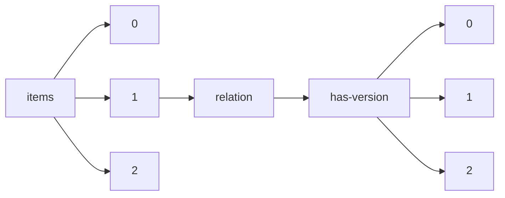

!!! warning "This document is not official Crossref documentation"
# Elements
PATH = items/array/relation/has-version/array(1)  
Occurs 20 753 times  
{ .annotate }

1. A route to an element, for example:  
   The route "items/array/relation/has-version/array" corresponds to navigating through the JSON indices as  
   ["items"][0]["relation"]["has-version"][0]  

## Asserted-by
See more information: [items/array/relation/has-version/array/asserted-by](asserted-by/index.md)  
Occurs 20 753 timess  
Unique values: 2  

| **Row** | **Value** `String` | **Count** `Int64` |
|--------:|----------------------:|---------------------:|
| **1**   | object                | 16 096               |
| **2**   | subject               | 4 657                |

## Id
See more information: [items/array/relation/has-version/array/id](id/index.md)  
Occurs 20 753 timess  
Unique values: > 999  

!!! note "Due to current limitations, only the first 1,000 unique values are counted."

| **Row** | **Value** `String`       | **Count** `Int64` |
|--------:|----------------------------:|---------------------:|
| **1**   | 10.21203/rs.3.rs-708548/v27 | 26                   |
| **2**   | 10.21203/rs.3.rs-708548/v9  | 26                   |
| **3**   | 10.21203/rs.3.rs-708548/v16 | 26                   |
| **4**   | 10.21203/rs.3.rs-708548/v10 | 26                   |
| **5**   | 10.21203/rs.3.rs-708548/v15 | 26                   |
| **6**   | 10.21203/rs.3.rs-708548/v21 | 26                   |
| **7**   | 10.21203/rs.3.rs-708548/v7  | 26                   |
| **8**   | 10.21203/rs.3.rs-708548/v17 | 26                   |
| **9**   | 10.21203/rs.3.rs-708548/v3  | 26                   |
| **10**  | 10.21203/rs.3.rs-708548/v12 | 26                   |
| ... | ... | ... |

## Id-type
See more information: [items/array/relation/has-version/array/id-type](id-type/index.md)  
Occurs 20 753 timess  
Unique values: 5  

| **Row** | **Value** `String` | **Count** `Int64` |
|--------:|----------------------:|---------------------:|
| **1**   | doi                   | 20 738               |
| **2**   | uri                   | 8                    |
| **3**   | other                 | 4                    |
| **4**   | handle                | 2                    |
| **5**   | pmcid                 | 1                    |

