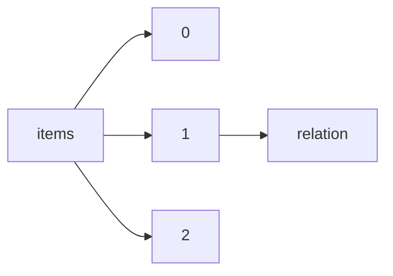

!!! warning "This document is not official Crossref documentation"
# Relation
PATH = items/array/relation(1)  
Occurs 1 835 967 times  
{ .annotate }

1. A route to an element, for example:  
   The route "items/array/relation" corresponds to navigating through the JSON indices as  
   ["items"][0]["relation"]  

## Based-on-data
See more information: [items/array/relation/based-on-data](based-on-data/index.md)  
Occurs 113 timess  

| **Row** | **Length** `Any` | **Count** `Int64` |
|--------:|--------------------:|---------------------:|
| **1**   | 1                   | 81                   |
| **2**   | 2                   | 14                   |
| **3**   | 3                   | 6                    |
| **4**   | 4                   | 6                    |
| **5**   | 5                   | 3                    |
| **6**   | 8                   | 1                    |
| **7**   | 10                  | 1                    |
| **8**   | 13                  | 1                    |

## Compiles
See more information: [items/array/relation/compiles](compiles/index.md)  
Occurs 39 timess  

| **Row** | **Length** `Any` | **Count** `Int64` |
|--------:|--------------------:|---------------------:|
| **1**   | 1                   | 36                   |
| **2**   | 2                   | 3                    |

## Continues
See more information: [items/array/relation/continues](continues/index.md)  
Occurs 99 timess  

| **Row** | **Length** `Any` | **Count** `Int64` |
|--------:|--------------------:|---------------------:|
| **1**   | 1                   | 95                   |
| **2**   | 2                   | 3                    |
| **3**   | 3                   | 1                    |

## Documents
See more information: [items/array/relation/documents](documents/index.md)  
Occurs 612 timess  

| **Row** | **Length** `Any` | **Count** `Int64` |
|--------:|--------------------:|---------------------:|
| **1**   | 1                   | 445                  |
| **2**   | 2                   | 86                   |
| **3**   | 3                   | 28                   |
| **4**   | 4                   | 19                   |
| **5**   | 5                   | 11                   |
| **6**   | 6                   | 15                   |
| **7**   | 7                   | 5                    |
| **8**   | 8                   | 2                    |
| **9**   | 9                   | 1                    |

## Finances
See more information: [items/array/relation/finances](finances/index.md)  
Occurs 2 timess  

| **Row** | **Length** `Any` | **Count** `Int64` |
|--------:|--------------------:|---------------------:|
| **1**   | 1                   | 1                    |
| **2**   | 5                   | 1                    |

## Has-comment
See more information: [items/array/relation/has-comment](has-comment/index.md)  
Occurs 27 907 timess  

| **Row** | **Length** `Any` | **Count** `Int64` |
|--------:|--------------------:|---------------------:|
| **1**   | 1                   | 1 982                |
| **2**   | 2                   | 8 102                |
| **3**   | 3                   | 2 821                |
| **4**   | 4                   | 7 976                |
| **5**   | 5                   | 685                  |
| **6**   | 6                   | 4 158                |
| **7**   | 7                   | 199                  |
| **8**   | 8                   | 1 367                |
| **9**   | 9                   | 63                   |
| **10**  | 10                  | 347                  |
| ... | ... | ... |

## Has-derivation
See more information: [items/array/relation/has-derivation](has-derivation/index.md)  
Occurs 10 timess  

| **Row** | **Length** `Any` | **Count** `Int64` |
|--------:|--------------------:|---------------------:|
| **1**   | 1                   | 9                    |
| **2**   | 2                   | 1                    |

## Has-expression
See more information: [items/array/relation/has-expression](has-expression/index.md)  
Occurs 2 timess  

| **Row** | **Length** `Any` | **Count** `Int64` |
|--------:|--------------------:|---------------------:|
| **1**   | 1                   | 2                    |

## Has-format
See more information: [items/array/relation/has-format](has-format/index.md)  
Occurs 12 timess  

| **Row** | **Length** `Any` | **Count** `Int64` |
|--------:|--------------------:|---------------------:|
| **1**   | 1                   | 12                   |

## Has-manifestation
See more information: [items/array/relation/has-manifestation](has-manifestation/index.md)  
Occurs 9 405 timess  

| **Row** | **Length** `Any` | **Count** `Int64` |
|--------:|--------------------:|---------------------:|
| **1**   | 1                   | 8 111                |
| **2**   | 2                   | 1 248                |
| **3**   | 3                   | 41                   |
| **4**   | 4                   | 3                    |
| **5**   | 6                   | 2                    |

## Has-manuscript
See more information: [items/array/relation/has-manuscript](has-manuscript/index.md)  
Occurs 327 timess  

| **Row** | **Length** `Any` | **Count** `Int64` |
|--------:|--------------------:|---------------------:|
| **1**   | 1                   | 327                  |

## Has-part
See more information: [items/array/relation/has-part](has-part/index.md)  
Occurs 844 timess  

| **Row** | **Length** `Any` | **Count** `Int64` |
|--------:|--------------------:|---------------------:|
| **1**   | 1                   | 762                  |
| **2**   | 2                   | 44                   |
| **3**   | 3                   | 13                   |
| **4**   | 4                   | 4                    |
| **5**   | 5                   | 5                    |
| **6**   | 6                   | 1                    |
| **7**   | 8                   | 4                    |
| **8**   | 9                   | 1                    |
| **9**   | 13                  | 1                    |
| **10**  | 14                  | 1                    |
| ... | ... | ... |

## Has-preprint
See more information: [items/array/relation/has-preprint](has-preprint/index.md)  
Occurs 109 916 timess  

| **Row** | **Length** `Any` | **Count** `Int64` |
|--------:|--------------------:|---------------------:|
| **1**   | 1                   | 69 623               |
| **2**   | 2                   | 36 517               |
| **3**   | 3                   | 2 423                |
| **4**   | 4                   | 977                  |
| **5**   | 5                   | 262                  |
| **6**   | 6                   | 71                   |
| **7**   | 7                   | 11                   |
| **8**   | 8                   | 3                    |
| **9**   | 10                  | 1                    |
| **10**  | 12                  | 1                    |
| ... | ... | ... |

## Has-related-material
See more information: [items/array/relation/has-related-material](has-related-material/index.md)  
Occurs 3 422 timess  

| **Row** | **Length** `Any` | **Count** `Int64` |
|--------:|--------------------:|---------------------:|
| **1**   | 1                   | 3 192                |
| **2**   | 2                   | 66                   |
| **3**   | 3                   | 46                   |
| **4**   | 4                   | 22                   |
| **5**   | 5                   | 14                   |
| **6**   | 6                   | 23                   |
| **7**   | 7                   | 8                    |
| **8**   | 8                   | 7                    |
| **9**   | 9                   | 4                    |
| **10**  | 10                  | 1                    |
| ... | ... | ... |

## Has-reply
See more information: [items/array/relation/has-reply](has-reply/index.md)  
Occurs 26 149 timess  

| **Row** | **Length** `Any` | **Count** `Int64` |
|--------:|--------------------:|---------------------:|
| **1**   | 1                   | 874                  |
| **2**   | 2                   | 23 315               |
| **3**   | 3                   | 158                  |
| **4**   | 4                   | 1 593                |
| **5**   | 5                   | 25                   |
| **6**   | 6                   | 151                  |
| **7**   | 7                   | 2                    |
| **8**   | 8                   | 25                   |
| **9**   | 10                  | 6                    |

## Has-review
See more information: [items/array/relation/has-review](has-review/index.md)  
Occurs 134 559 timess  

| **Row** | **Length** `Any` | **Count** `Int64` |
|--------:|--------------------:|---------------------:|
| **1**   | 1                   | 66 189               |
| **2**   | 2                   | 32 132               |
| **3**   | 3                   | 10 051               |
| **4**   | 4                   | 7 904                |
| **5**   | 5                   | 3 037                |
| **6**   | 6                   | 4 294                |
| **7**   | 7                   | 1 759                |
| **8**   | 8                   | 4 201                |
| **9**   | 9                   | 1 172                |
| **10**  | 10                  | 1 085                |
| ... | ... | ... |

## Has-translation
See more information: [items/array/relation/has-translation](has-translation/index.md)  
Occurs 5 308 timess  

| **Row** | **Length** `Any` | **Count** `Int64` |
|--------:|--------------------:|---------------------:|
| **1**   | 1                   | 4 780                |
| **2**   | 2                   | 396                  |
| **3**   | 3                   | 5                    |
| **4**   | 8                   | 111                  |
| **5**   | 9                   | 10                   |
| **6**   | 11                  | 5                    |
| **7**   | 24                  | 1                    |

## Has-version
See more information: [items/array/relation/has-version](has-version/index.md)  
Occurs 12 212 timess  

| **Row** | **Length** `Any` | **Count** `Int64` |
|--------:|--------------------:|---------------------:|
| **1**   | 1                   | 8 519                |
| **2**   | 2                   | 2 017                |
| **3**   | 3                   | 775                  |
| **4**   | 4                   | 365                  |
| **5**   | 5                   | 186                  |
| **6**   | 6                   | 102                  |
| **7**   | 7                   | 66                   |
| **8**   | 8                   | 41                   |
| **9**   | 9                   | 28                   |
| **10**  | 10                  | 20                   |
| ... | ... | ... |

## Is-based-on
See more information: [items/array/relation/is-based-on](is-based-on/index.md)  
Occurs 182 timess  

| **Row** | **Length** `Any` | **Count** `Int64` |
|--------:|--------------------:|---------------------:|
| **1**   | 1                   | 179                  |
| **2**   | 2                   | 2                    |
| **3**   | 33                  | 1                    |

## Is-basis-for
See more information: [items/array/relation/is-basis-for](is-basis-for/index.md)  
Occurs 10 timess  

| **Row** | **Length** `Any` | **Count** `Int64` |
|--------:|--------------------:|---------------------:|
| **1**   | 1                   | 10                   |

## Is-comment-on
See more information: [items/array/relation/is-comment-on](is-comment-on/index.md)  
Occurs 53 622 timess  

| **Row** | **Length** `Any` | **Count** `Int64` |
|--------:|--------------------:|---------------------:|
| **1**   | 1                   | 21 129               |
| **2**   | 2                   | 32 485               |
| **3**   | 3                   | 2                    |
| **4**   | 4                   | 1                    |
| **5**   | 5                   | 1                    |
| **6**   | 7                   | 3                    |
| **7**   | 8                   | 1                    |

## Is-compiled-by
See more information: [items/array/relation/is-compiled-by](is-compiled-by/index.md)  
Occurs 3 timess  

| **Row** | **Length** `Any` | **Count** `Int64` |
|--------:|--------------------:|---------------------:|
| **1**   | 1                   | 3                    |

## Is-continued-by
See more information: [items/array/relation/is-continued-by](is-continued-by/index.md)  
Occurs 41 timess  

| **Row** | **Length** `Any` | **Count** `Int64` |
|--------:|--------------------:|---------------------:|
| **1**   | 1                   | 39                   |
| **2**   | 2                   | 2                    |

## Is-data-basis-for
See more information: [items/array/relation/is-data-basis-for](is-data-basis-for/index.md)  
Occurs 277 timess  

| **Row** | **Length** `Any` | **Count** `Int64` |
|--------:|--------------------:|---------------------:|
| **1**   | 1                   | 248                  |
| **2**   | 2                   | 21                   |
| **3**   | 3                   | 2                    |
| **4**   | 4                   | 2                    |
| **5**   | 5                   | 3                    |
| **6**   | 6                   | 1                    |

## Is-derived-from
See more information: [items/array/relation/is-derived-from](is-derived-from/index.md)  
Occurs 289 timess  

| **Row** | **Length** `Any` | **Count** `Int64` |
|--------:|--------------------:|---------------------:|
| **1**   | 1                   | 284                  |
| **2**   | 2                   | 4                    |
| **3**   | 14                  | 1                    |

## Is-documented-by
See more information: [items/array/relation/is-documented-by](is-documented-by/index.md)  
Occurs 518 timess  

| **Row** | **Length** `Any` | **Count** `Int64` |
|--------:|--------------------:|---------------------:|
| **1**   | 1                   | 230                  |
| **2**   | 2                   | 82                   |
| **3**   | 3                   | 48                   |
| **4**   | 4                   | 41                   |
| **5**   | 5                   | 25                   |
| **6**   | 6                   | 22                   |
| **7**   | 7                   | 21                   |
| **8**   | 8                   | 15                   |
| **9**   | 9                   | 8                    |
| **10**  | 10                  | 6                    |
| ... | ... | ... |

## Is-expression-of
See more information: [items/array/relation/is-expression-of](is-expression-of/index.md)  
Occurs 1 timess  

| **Row** | **Length** `Any` | **Count** `Int64` |
|--------:|--------------------:|---------------------:|
| **1**   | 1                   | 1                    |

## Is-financed-by
See more information: [items/array/relation/is-financed-by](is-financed-by/index.md)  
Occurs 2 timess  

| **Row** | **Length** `Any` | **Count** `Int64` |
|--------:|--------------------:|---------------------:|
| **1**   | 1                   | 2                    |

## Is-identical-to
See more information: [items/array/relation/is-identical-to](is-identical-to/index.md)  
Occurs 475 969 timess  

| **Row** | **Length** `Any` | **Count** `Int64` |
|--------:|--------------------:|---------------------:|
| **1**   | 1                   | 405 976              |
| **2**   | 2                   | 61 952               |
| **3**   | 3                   | 5 531                |
| **4**   | 4                   | 605                  |
| **5**   | 5                   | 761                  |
| **6**   | 6                   | 452                  |
| **7**   | 7                   | 231                  |
| **8**   | 8                   | 105                  |
| **9**   | 9                   | 79                   |
| **10**  | 10                  | 35                   |
| ... | ... | ... |

## Is-manifestation-of
See more information: [items/array/relation/is-manifestation-of](is-manifestation-of/index.md)  
Occurs 2 timess  

| **Row** | **Length** `Any` | **Count** `Int64` |
|--------:|--------------------:|---------------------:|
| **1**   | 1                   | 2                    |

## Is-manuscript-of
See more information: [items/array/relation/is-manuscript-of](is-manuscript-of/index.md)  
Occurs 77 timess  

| **Row** | **Length** `Any` | **Count** `Int64` |
|--------:|--------------------:|---------------------:|
| **1**   | 1                   | 77                   |

## Is-original-form-of
See more information: [items/array/relation/is-original-form-of](is-original-form-of/index.md)  
Occurs 4 timess  

| **Row** | **Length** `Any` | **Count** `Int64` |
|--------:|--------------------:|---------------------:|
| **1**   | 1                   | 4                    |

## Is-part-of
See more information: [items/array/relation/is-part-of](is-part-of/index.md)  
Occurs 24 550 timess  

| **Row** | **Length** `Any` | **Count** `Int64` |
|--------:|--------------------:|---------------------:|
| **1**   | 1                   | 20 210               |
| **2**   | 2                   | 2 512                |
| **3**   | 3                   | 791                  |
| **4**   | 4                   | 412                  |
| **5**   | 5                   | 232                  |
| **6**   | 6                   | 114                  |
| **7**   | 7                   | 89                   |
| **8**   | 8                   | 61                   |
| **9**   | 9                   | 32                   |
| **10**  | 10                  | 21                   |
| ... | ... | ... |

## Is-preprint-of
See more information: [items/array/relation/is-preprint-of](is-preprint-of/index.md)  
Occurs 333 811 timess  

| **Row** | **Length** `Any` | **Count** `Int64` |
|--------:|--------------------:|---------------------:|
| **1**   | 1                   | 313 871              |
| **2**   | 2                   | 19 935               |
| **3**   | 3                   | 1                    |
| **4**   | 4                   | 3                    |
| **5**   | 107                 | 1                    |

## Is-referenced-by
See more information: [items/array/relation/is-referenced-by](is-referenced-by/index.md)  
Occurs 19 115 timess  

| **Row** | **Length** `Any` | **Count** `Int64` |
|--------:|--------------------:|---------------------:|
| **1**   | 1                   | 9 097                |
| **2**   | 2                   | 4 292                |
| **3**   | 3                   | 5 697                |
| **4**   | 4                   | 2                    |
| **5**   | 6                   | 1                    |
| **6**   | 32                  | 11                   |
| **7**   | 38                  | 14                   |
| **8**   | 39                  | 1                    |

## Is-related-material
See more information: [items/array/relation/is-related-material](is-related-material/index.md)  
Occurs 3 944 timess  

| **Row** | **Length** `Any` | **Count** `Int64` |
|--------:|--------------------:|---------------------:|
| **1**   | 1                   | 3 838                |
| **2**   | 2                   | 56                   |
| **3**   | 3                   | 16                   |
| **4**   | 4                   | 7                    |
| **5**   | 5                   | 8                    |
| **6**   | 6                   | 4                    |
| **7**   | 7                   | 3                    |
| **8**   | 8                   | 5                    |
| **9**   | 10                  | 2                    |
| **10**  | 14                  | 1                    |
| ... | ... | ... |

## Is-replaced-by
See more information: [items/array/relation/is-replaced-by](is-replaced-by/index.md)  
Occurs 1 377 timess  

| **Row** | **Length** `Any` | **Count** `Int64` |
|--------:|--------------------:|---------------------:|
| **1**   | 1                   | 1 377                |

## Is-reply-to
See more information: [items/array/relation/is-reply-to](is-reply-to/index.md)  
Occurs 27 834 timess  

| **Row** | **Length** `Any` | **Count** `Int64` |
|--------:|--------------------:|---------------------:|
| **1**   | 1                   | 130                  |
| **2**   | 2                   | 26 566               |
| **3**   | 3                   | 930                  |
| **4**   | 4                   | 179                  |
| **5**   | 5                   | 23                   |
| **6**   | 6                   | 5                    |
| **7**   | 7                   | 1                    |

## Is-review-of
See more information: [items/array/relation/is-review-of](is-review-of/index.md)  
Occurs 593 045 timess  

| **Row** | **Length** `Any` | **Count** `Int64` |
|--------:|--------------------:|---------------------:|
| **1**   | 1                   | 562 292              |
| **2**   | 2                   | 18 262               |
| **3**   | 3                   | 12 490               |
| **4**   | 4                   | 1                    |

## Is-same-as
See more information: [items/array/relation/is-same-as](is-same-as/index.md)  
Occurs 3 946 timess  

| **Row** | **Length** `Any` | **Count** `Int64` |
|--------:|--------------------:|---------------------:|
| **1**   | 1                   | 3 328                |
| **2**   | 2                   | 618                  |

## Is-supplement-to
See more information: [items/array/relation/is-supplement-to](is-supplement-to/index.md)  
Occurs 24 608 timess  

| **Row** | **Length** `Any` | **Count** `Int64` |
|--------:|--------------------:|---------------------:|
| **1**   | 1                   | 13 569               |
| **2**   | 2                   | 11 039               |

## Is-supplemented-by
See more information: [items/array/relation/is-supplemented-by](is-supplemented-by/index.md)  
Occurs 43 005 timess  

| **Row** | **Length** `Any` | **Count** `Int64` |
|--------:|--------------------:|---------------------:|
| **1**   | 1                   | 23 944               |
| **2**   | 2                   | 13 704               |
| **3**   | 3                   | 2 429                |
| **4**   | 4                   | 1 004                |
| **5**   | 5                   | 585                  |
| **6**   | 6                   | 321                  |
| **7**   | 7                   | 270                  |
| **8**   | 8                   | 175                  |
| **9**   | 9                   | 109                  |
| **10**  | 10                  | 86                   |
| ... | ... | ... |

## Is-translation-of
See more information: [items/array/relation/is-translation-of](is-translation-of/index.md)  
Occurs 9 940 timess  

| **Row** | **Length** `Any` | **Count** `Int64` |
|--------:|--------------------:|---------------------:|
| **1**   | 1                   | 9 112                |
| **2**   | 2                   | 755                  |
| **3**   | 3                   | 2                    |
| **4**   | 4                   | 71                   |

## Is-variant-form-of
See more information: [items/array/relation/is-variant-form-of](is-variant-form-of/index.md)  
Occurs 1 379 timess  

| **Row** | **Length** `Any` | **Count** `Int64` |
|--------:|--------------------:|---------------------:|
| **1**   | 1                   | 1 379                |

## Is-version-of
See more information: [items/array/relation/is-version-of](is-version-of/index.md)  
Occurs 37 903 timess  

| **Row** | **Length** `Any` | **Count** `Int64` |
|--------:|--------------------:|---------------------:|
| **1**   | 1                   | 32 281               |
| **2**   | 2                   | 3 199                |
| **3**   | 3                   | 989                  |
| **4**   | 4                   | 406                  |
| **5**   | 5                   | 202                  |
| **6**   | 6                   | 148                  |
| **7**   | 7                   | 80                   |
| **8**   | 8                   | 119                  |
| **9**   | 9                   | 100                  |
| **10**  | 10                  | 57                   |
| ... | ... | ... |

## References
See more information: [items/array/relation/references](references/index.md)  
Occurs 12 192 timess  

| **Row** | **Length** `Any` | **Count** `Int64` |
|--------:|--------------------:|---------------------:|
| **1**   | 1                   | 6 456                |
| **2**   | 2                   | 2 357                |
| **3**   | 3                   | 580                  |
| **4**   | 4                   | 818                  |
| **5**   | 5                   | 199                  |
| **6**   | 6                   | 417                  |
| **7**   | 7                   | 69                   |
| **8**   | 8                   | 284                  |
| **9**   | 9                   | 57                   |
| **10**  | 10                  | 181                  |
| ... | ... | ... |

## Replaces
See more information: [items/array/relation/replaces](replaces/index.md)  
Occurs 1 381 timess  

| **Row** | **Length** `Any` | **Count** `Int64` |
|--------:|--------------------:|---------------------:|
| **1**   | 1                   | 1 381                |

## Requires
See more information: [items/array/relation/requires](requires/index.md)  
Occurs 2 timess  

| **Row** | **Length** `Any` | **Count** `Int64` |
|--------:|--------------------:|---------------------:|
| **1**   | 1                   | 2                    |

