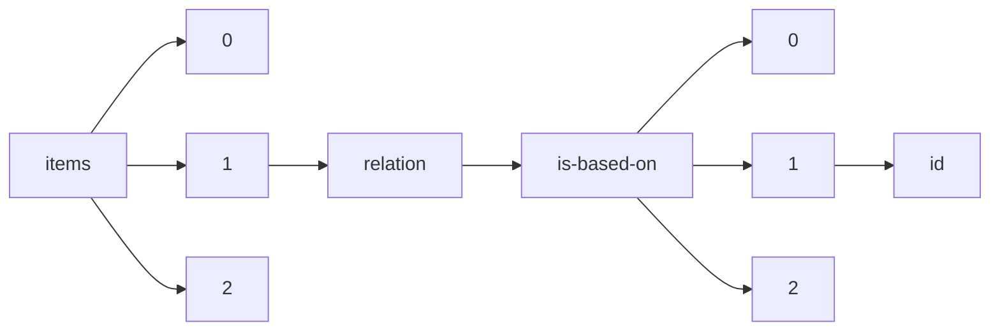

!!! warning "This document is not official Crossref documentation"
# Id
PATH = items/array/relation/is-based-on/array/id(1)  
Occurs 216 times  
Unique values: 196  
{ .annotate }

1. A route to an element, for example:  
   The route "items/array/relation/is-based-on/array/id" corresponds to navigating through the JSON indices as  
   ["items"][0]["relation"]["is-based-on"][0]["id"]  

| **Row** | **Value** `String`                                                               | **Count** `Int64` |
|--------:|------------------------------------------------------------------------------------:|---------------------:|
| **1**   | 10.1890/14-2274.1                                                                   | 21                   |
| **2**   | 10.1103/PhysRevResearch.4.013102                                                    | 1                    |
| **3**   | 10.1007/s11787-021-00290-5                                                          | 1                    |
| **4**   | 10.14272/reaction/SA-FUHFF-UHFFFADPSC-NQVQLXTURK-UHFFFADPSC-NUHFF-NCVEK-NUHFF-ZZZ   | 1                    |
| **5**   | 10.14272/reaction/SA-FUHFF-UHFFFADPSC-KQBXWZPQDC-UHFFFADPSC-NUHFF-NBDJD-NUHFF-ZZZ   | 1                    |
| **6**   | 10.1159/000501375                                                                   | 1                    |
| **7**   | 10.14272/reaction/SA-FUHFF-UHFFFADPSC-HLSFJQKZZG-UHFFFADPSC-NUHFF-NQFOL-NUHFF-ZZZ   | 1                    |
| **8**   | 10.1007/s00283-018-9823-5                                                           | 1                    |
| **9**   | 10.1016/j.sctalk.2022.100105                                                        | 1                    |
| **10**  | 10.1103/PhysRevA.105.033517                                                         | 1                    |
| **11**  | 10.1016/j.cpc.2022.108453                                                           | 1                    |
| **12**  | 10.1159/000504455                                                                   | 1                    |
| **13**  | 10.1016/j.chphi.2021.100014                                                         | 1                    |
| **14**  | 10.1016/J.CHPHI.2021.100029                                                         | 1                    |
| **15**  | 10.14272/reaction/SA-FUHFF-UHFFFADPSC-AHUQBMJJIB-UHFFFADPSC-NUHFF-NUHFF-NUHFF-ZZZ   | 1                    |
| **16**  | 10.1159/000481567                                                                   | 1                    |
| **17**  | 10.1007/s11787-021-00291-4                                                          | 1                    |
| **18**  | 10.1007/s43069-020-00026-z                                                          | 1                    |
| **19**  | 10.14272/reaction/SA-FUHFF-UHFFFADPSC-CEFFSZUXPZ-UHFFFADPSC-NUHFF-NUHFF-NUHFF-ZZZ   | 1                    |
| **20**  | 10.1016/j.cpc.2018.05.010                                                           | 1                    |
| **21**  | 10.1002/anie.202108934                                                              | 1                    |
| **22**  | 10.1016/j.electacta.2021.139019                                                     | 1                    |
| **23**  | 10.17011/jyx/SLJ/2021/3b                                                            | 1                    |
| **24**  | 10.1111/nph.16229                                                                   | 1                    |
| **25**  | 10.14272/reaction/SA-FUHFF-UHFFFADPSC-WDXQCIDOHP-UHFFFADPSC-NUHFF-NUHFF-NUHFF-ZZZ   | 1                    |
| **26**  | 10.1159/000496095                                                                   | 1                    |
| **27**  | 10.1007/s11787-021-00275-4                                                          | 1                    |
| **28**  | 10.1210/EN.2003-1307                                                                | 1                    |
| **29**  | 10.1016/j.physrep.2022.03.001                                                       | 1                    |
| **30**  | 10.14272/reaction/SA-FUHFF-UHFFFADPSC-AATCYLWHXD-UHFFFADPSC-NUHFF-NWIMK-NUHFF-ZZZ   | 1                    |
| **31**  | 10.1175/JCLI-D-12-00508.1                                                           | 1                    |
| **32**  | 10.1016/j.cpc.2018.04.027                                                           | 1                    |
| **33**  | 10.1017/jfm.2017.246                                                                | 1                    |
| **34**  | 10.1016/j.jcp.2019.03.002                                                           | 1                    |
| **35**  | 10.1016/j.cpc.2018.12.010                                                           | 1                    |
| **36**  | 10.1007/s00348-022-03485-8                                                          | 1                    |
| **37**  | 10.1016/j.cpc.2017.12.015                                                           | 1                    |
| **38**  | 10.1016/j.jcp.2021.110206                                                           | 1                    |
| **39**  | 10.1159/000525237                                                                   | 1                    |
| **40**  | 10.1039/D1CC02350K                                                                  | 1                    |
| **41**  | 10.5555/letstestgrants01                                                            | 1                    |
| **42**  | 10.1007/s11787-022-00308-6                                                          | 1                    |
| **43**  | 10.1159/000489094                                                                   | 1                    |
| **44**  | 10.1103/PhysRevApplied.12.014016                                                    | 1                    |
| **45**  | 10.1016/j.physrep.2022.06.003                                                       | 1                    |
| **46**  | 10.1103/PhysRevB.105.125422                                                         | 1                    |
| **47**  | 10.1016/j.jcp.2022.111008                                                           | 1                    |
| **48**  | 10.1007/s11787-021-00278-1                                                          | 1                    |
| **49**  | 10.1007/s11787-022-00310-y                                                          | 1                    |
| **50**  | 10.3390/atoms7040097                                                                | 1                    |
| **51**  | 10.1007/s11787-020-00256-z                                                          | 1                    |
| **52**  | 10.1016/j.physd.2021.133008                                                         | 1                    |
| **53**  | 10.1007/s11071-019-05123-1                                                          | 1                    |
| **54**  | 10.1145/3290605.3300404                                                             | 1                    |
| **55**  | 10.1016/j.cpc.2017.09.033                                                           | 1                    |
| **56**  | 10.1159/000505303                                                                   | 1                    |
| **57**  | 10.1016/j.physrep.2020.07.006                                                       | 1                    |
| **58**  | 10.1159/000509249                                                                   | 1                    |
| **59**  | 10.1007/s11060-022-04130-4                                                          | 1                    |
| **60**  | 10.14272/reaction/SA-FUHFF-UHFFFADPSC-UCPMQTTXXM-UHFFFADPSC-NUHFF-NRHPV-NUHFF-ZZZ   | 1                    |
| **61**  | 10.14272/reaction/SA-FUHFF-UHFFFADPSC-KPRSIIAWIW-UHFFFADPSC-NUHFF-NUHFF-NUHFF-ZZZ   | 1                    |
| **62**  | 10.1007/s11060-022-04123-3                                                          | 1                    |
| **63**  | http://www.ecmi.de/fileadmin/downloads/publications/JEMIE/2012/Quer.pdf             | 1                    |
| **64**  | 10.1159/000501176                                                                   | 1                    |
| **65**  | 10.14272/reaction/SA-FUHFF-UHFFFADPSC-CCXXYIBWZN-UHFFFADPSC-NUHFF-NCWUQ-NUHFF-ZZZ   | 1                    |
| **66**  | 10.1002/adma.202110115                                                              | 1                    |
| **67**  | 10.1016/j.cpc.2019.107065                                                           | 1                    |
| **68**  | 10.1007/s11787-022-00304-w                                                          | 1                    |
| **69**  | 10.1016/j.jcp.2009.12.030                                                           | 1                    |
| **70**  | 10.5281/zenodo.1237391                                                              | 1                    |
| **71**  | 10.1016/j.cpc.2018.10.032                                                           | 1                    |
| **72**  | 10.14272/reaction/SA-FUHFF-UHFFFADPSC-JUJUWEBLNY-UHFFFADPSC-NUHFF-NUHFF-NUHFF-ZZZ   | 1                    |
| **73**  | 10.14272/reaction/SA-FUHFF-UHFFFADPSC-KEQOQOHNHB-UHFFFADPSC-NUHFF-NUHFF-NUHFF-ZZZ   | 1                    |
| **74**  | 10.1016/j.jcp.2019.108913                                                           | 1                    |
| **75**  | 10.1016/j.physrep.2021.11.002                                                       | 1                    |
| **76**  | 10.31979/mti.2022.2123.ds                                                           | 1                    |
| **77**  | 10.1007/s11787-021-00284-3                                                          | 1                    |
| **78**  | 10.1007/s11787-021-00273-6                                                          | 1                    |
| **79**  | 10.14272/reaction/SA-FUHFF-UHFFFADPSC-PGERMRZARQ-UHFFFADPSC-NUHFF-NUHFF-NUHFF-ZZZ.1 | 1                    |
| **80**  | 10.1159/000507902                                                                   | 1                    |
| **81**  | 10.1038/s44221-022-00015-y                                                          | 1                    |
| **82**  | 10.1111/nph.16045                                                                   | 1                    |
| **83**  | 10.1159/000499492                                                                   | 1                    |
| **84**  | 10.17011/jyx/SLJ/2022/1b                                                            | 1                    |
| **85**  | 10.5284/1000389                                                                     | 1                    |
| **86**  | 10.5281/zenodo.1312178                                                              | 1                    |
| **87**  | 10.1186/s40627-016-0009-7                                                           | 1                    |
| **88**  | 10.1051/photon/202111032                                                            | 1                    |
| **89**  | 10.1016/j.jcp.2017.10.006                                                           | 1                    |
| **90**  | 10.1007/s11787-019-00220-6                                                          | 1                    |
| **91**  | 10.1145/3432190                                                                     | 1                    |
| **92**  | 10.14272/reaction/SA-FUHFF-UHFFFADPSC-MPRWSIYLAU-UHFFFADPSC-NUHFF-NOHLW-NUHFF-ZZZ   | 1                    |
| **93**  | 10.1159/000501565                                                                   | 1                    |
| **94**  | 10.1103/PhysRevLett.126.177402                                                      | 1                    |
| **95**  | 10.14272/reaction/SA-FUHFF-UHFFFADPSC-NZDLOEMQHU-UHFFFADPSC-NUHFF-NXEFH-NUHFF-ZZZ   | 1                    |
| **96**  | 10.2352/J.Percept.Imaging.2019.2.1.010401                                           | 1                    |
| **97**  | 10.1007/s11787-022-00305-9                                                          | 1                    |
| **98**  | 10.14272/reaction/SA-FUHFF-UHFFFADPSC-SMDRKVWNQX-UHFFFADPSC-NUHFF-NSKKF-NUHFF-ZZZ   | 1                    |
| **99**  | 10.1159/000509233                                                                   | 1                    |
| **100** | https://github.com/PyFR/PyFR                                                        | 1                    |
| **101** | 10.1159/000502018                                                                   | 1                    |
| **102** | 10.1016/j.cpc.2019.107110                                                           | 1                    |
| **103** | 10.1137/1.9781611975840                                                             | 1                    |
| **104** |                                                                                     | 1                    |
| **105** | 10.1063/5.0087488                                                                   | 1                    |
| **106** | 10.1111/nph.17729                                                                   | 1                    |
| **107** | 10.1007/s11787-021-00292-3                                                          | 1                    |
| **108** | 10.14272/reaction/SA-FUHFF-UHFFFADPSC-GZXDXORFZU-UHFFFADPSC-NUHFF-NHIGY-NUHFF-ZZZ   | 1                    |
| **109** | 10.1021/acsestwater.1c00434                                                         | 1                    |
| **110** | 10.1159/000497620                                                                   | 1                    |
| **111** | 10.1016/j.chphi.2022.100062                                                         | 1                    |
| **112** | 10.14272/reaction/SA-FUHFF-UHFFFADPSC-MORMFGNFEX-UHFFFADPSC-NUHFF-NIWVK-NUHFF-ZZZ   | 1                    |
| **113** | 10.14272/reaction/SA-FUHFF-UHFFFADPSC-CYZFVCDWYP-UHFFFADPSC-NUHFF-NPQQK-NUHFF-ZZZ   | 1                    |
| **114** | 10.14272/reaction/SA-FUHFF-UHFFFADPSC-RZSNDUJLUY-UHFFFADPSC-NUHFF-NJAII-NUHFF-ZZZ   | 1                    |
| **115** | 10.1007/s42985-020-0008-7                                                           | 1                    |
| **116** | 10.14272/reaction/SA-FUHFF-UHFFFADPSC-UZTCZZRTCD-UHFFFADPSC-NUHFF-NPQQK-NUHFF-ZZZ   | 1                    |
| **117** | 10.1016/j.jcp.2022.111493                                                           | 1                    |
| **118** | 10.14272/reaction/SA-FUHFF-UHFFFADPSC-CYCAXLGFKD-UHFFFADPSC-NUHFF-NULGB-NUHFF-ZZZ   | 1                    |
| **119** | 10.1016/j.cpc.2022.108292                                                           | 1                    |
| **120** | 10.1007/s11787-021-00267-4                                                          | 1                    |
| **121** | 10.1098/rsnr.2022.0002                                                              | 1                    |
| **122** | 10.14272/reaction/SA-FUHFF-UHFFFADPSC-KRKANRSFKB-UHFFFADPSC-NUHFF-NVGOA-NUHFF-ZZZ   | 1                    |
| **123** | 10.1016/j.physrep.2022.03.002                                                       | 1                    |
| **124** | 10.1159/000525707                                                                   | 1                    |
| **125** | 10.1016/j.jcp.2020.109844                                                           | 1                    |
| **126** | 10.1016/j.tchem.2022.100006                                                         | 1                    |
| **127** | 10.1007/s11787-022-00307-7                                                          | 1                    |
| **128** | 10.1007/s00348-021-03157-z                                                          | 1                    |
| **129** | 10.1007/s11787-022-00318-4                                                          | 1                    |
| **130** | 10.1007/s11787-020-00265-y                                                          | 1                    |
| **131** | 10.14272/reaction/SA-FUHFF-UHFFFADPSC-VXSAZKPHEZ-UHFFFADPSC-NUHFF-NQYKM-NUHFF-ZZZ   | 1                    |
| **132** | 10.14272/reaction/SA-FUHFF-UHFFFADPSC-WJOQJVSLWF-UHFFFADPSC-NUHFF-NUHFF-NUHFF-ZZZ   | 1                    |
| **133** | 10.1007/s11787-021-00274-5                                                          | 1                    |
| **134** | 10.1159/000505595                                                                   | 1                    |
| **135** | 10.1159/000513949                                                                   | 1                    |
| **136** | 10.1016/j.chphi.2021.100011                                                         | 1                    |
| **137** | 10.1159/000501735                                                                   | 1                    |
| **138** | 10.1159/000502390                                                                   | 1                    |
| **139** | 10.1016/j.jcp.2022.111866                                                           | 1                    |
| **140** | 10.14272/reaction/SA-FUHFF-UHFFFADPSC-SGMNZUYLCB-UHFFFADPSC-NUHFF-NBSLK-NUHFF-ZZZ   | 1                    |
| **141** | 10.1002/jame.20038                                                                  | 1                    |
| **142** | 10.1159/000504147                                                                   | 1                    |
| **143** | 10.1159/000526482                                                                   | 1                    |
| **144** | 10.1159/000497784                                                                   | 1                    |
| **145** | 10.1007/s11787-022-00303-x                                                          | 1                    |
| **146** | 10.1002/gamm.202200004                                                              | 1                    |
| **147** | 10.1016/j.sctalk.2022.100083                                                        | 1                    |
| **148** | 10.14272/reaction/SA-FUHFF-UHFFFADPSC-SSTDOKZYUW-UHFFFADPSC-NUHFF-NUVCO-NUHFF-ZZZ   | 1                    |
| **149** | 10.1007/s11787-020-00246-1                                                          | 1                    |
| **150** | 10.1007/978-3-031-15146-0\_10                                                       | 1                    |
| **151** | 10.1111/nph.17682                                                                   | 1                    |
| **152** | 10.14272/reaction/SA-FUHFF-UHFFFADPSC-QFPQAGCPTO-UHFFFADPSC-NUHFF-NUHFF-NUHFF-ZZZ   | 1                    |
| **153** | 10.1175/2011jcli4083.1                                                              | 1                    |
| **154** | 10.1007/s11787-021-00287-0                                                          | 1                    |
| **155** | 10.1111/nph.16412                                                                   | 1                    |
| **156** | 10.1007/s11787-021-00286-1                                                          | 1                    |
| **157** | 10.14272/reaction/SA-FUHFF-UHFFFADPSC-BBXJSLXPCZ-UHFFFADPSC-NUHFF-NJAII-NUHFF-ZZZ   | 1                    |
| **158** | 10.1007/s43069-020-00023-2                                                          | 1                    |
| **159** | 10.1159/000522175                                                                   | 1                    |
| **160** | 10.1016/j.jcp.2018.10.045                                                           | 1                    |
| **161** | 10.3390/math10203912                                                                | 1                    |
| **162** | 10.3389/fcvm.2022.953109                                                            | 1                    |
| **163** | 10.1007/s42985-020-00062-8                                                          | 1                    |
| **164** | 10.14272/reaction/SA-FUHFF-UHFFFADPSC-NFQAOFXQAV-UHFFFADPSC-NUHFF-NGHTP-NUHFF-ZZZ   | 1                    |
| **165** | 10.1016/j.jcp.2020.109866                                                           | 1                    |
| **166** | 10.1017/jfm.2018.798                                                                | 1                    |
| **167** | 10.1016/j.physrep.2022.07.001                                                       | 1                    |
| **168** | 10.1007/s11787-022-00311-x                                                          | 1                    |
| **169** | 10.1007/978-3-030-98152-5                                                           | 1                    |
| **170** | 10.1159/000524786                                                                   | 1                    |
| **171** | 10.1364/OE.454740                                                                   | 1                    |
| **172** | 10.5281/zenodo.1312170                                                              | 1                    |
| **173** | 10.1007/s11787-022-00302-y                                                          | 1                    |
| **174** | 10.14272/reaction/SA-FUHFF-UHFFFADPSC-PTHGCHFVSV-UHFFFADPSC-NUHFF-NXOJS-NUHFF-ZZZ   | 1                    |
| **175** | 10.1017/jfm.2018.8                                                                  | 1                    |
| **176** | 10.14272/reaction/SA-FUHFF-UHFFFADPSC-MPFTVRYGHB-UHFFFADPSC-NUHFF-NWMXW-NUHFF-ZZZ   | 1                    |
| **177** | 10.5555/letsgogrants03                                                              | 1                    |
| **178** | 10.1103/PhysRevX.11.031010                                                          | 1                    |
| **179** | 10.1007/s11787-020-00262-1                                                          | 1                    |
| **180** | 10.1159/000507767                                                                   | 1                    |
| **181** | 10.1017/jfm.2020.885                                                                | 1                    |
| **182** | 10.1016/j.cpc.2019.106949                                                           | 1                    |
| **183** | 10.1103/PhysRevA.102.063508                                                         | 1                    |
| **184** | 10.31979/mti.2021.2112.ds                                                           | 1                    |
| **185** | 10.1017/jfm.2020.1023                                                               | 1                    |
| **186** | 10.1007/s00348-022-03497-4                                                          | 1                    |
| **187** | 10.1016/j.cpc.2021.108076                                                           | 1                    |
| **188** | 10.1364/OL.411108                                                                   | 1                    |
| **189** | 10.1007/s43069-020-00016-1                                                          | 1                    |
| **190** | 10.1159/000523900                                                                   | 1                    |
| **191** | 10.1007/s11787-021-00282-5                                                          | 1                    |
| **192** | 10.1159/000525556                                                                   | 1                    |
| **193** | 10.1016/j.cpc.2019.107099                                                           | 1                    |
| **194** | 10.1007/s11787-020-00255-0                                                          | 1                    |
| **195** | 10.1038/s41467-021-25305-z                                                          | 1                    |
| **196** | 10.14272/reaction/SA-FUHFF-UHFFFADPSC-RPEOLKMCSJ-UHFFFADPSC-NUHFF-NJTWA-NUHFF-ZZZ   | 1                    |

