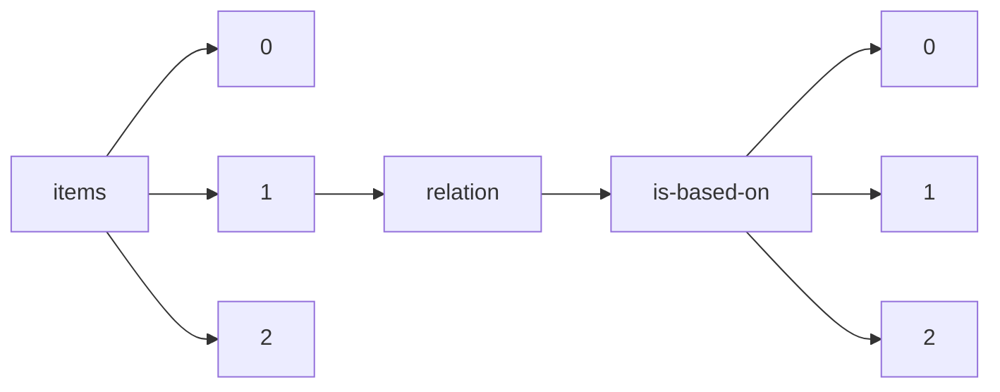

!!! warning "This document is not official Crossref documentation"
# Elements
PATH = items/array/relation/is-based-on/array(1)  
Occurs 216 times  
{ .annotate }

1. A route to an element, for example:  
   The route "items/array/relation/is-based-on/array" corresponds to navigating through the JSON indices as  
   ["items"][0]["relation"]["is-based-on"][0]  

## Asserted-by
See more information: [items/array/relation/is-based-on/array/asserted-by](asserted-by/index.md)  
Occurs 216 timess  
Unique values: 1  

| **Row** | **Value** `String` | **Count** `Int64` |
|--------:|----------------------:|---------------------:|
| **1**   | subject               | 216                  |

## Id
See more information: [items/array/relation/is-based-on/array/id](id/index.md)  
Occurs 216 timess  
Unique values: 196  

| **Row** | **Value** `String`                                                             | **Count** `Int64` |
|--------:|----------------------------------------------------------------------------------:|---------------------:|
| **1**   | 10.1890/14-2274.1                                                                 | 21                   |
| **2**   | 10.1103/PhysRevResearch.4.013102                                                  | 1                    |
| **3**   | 10.1007/s11787-021-00290-5                                                        | 1                    |
| **4**   | 10.14272/reaction/SA-FUHFF-UHFFFADPSC-NQVQLXTURK-UHFFFADPSC-NUHFF-NCVEK-NUHFF-ZZZ | 1                    |
| **5**   | 10.14272/reaction/SA-FUHFF-UHFFFADPSC-KQBXWZPQDC-UHFFFADPSC-NUHFF-NBDJD-NUHFF-ZZZ | 1                    |
| **6**   | 10.1159/000501375                                                                 | 1                    |
| **7**   | 10.14272/reaction/SA-FUHFF-UHFFFADPSC-HLSFJQKZZG-UHFFFADPSC-NUHFF-NQFOL-NUHFF-ZZZ | 1                    |
| **8**   | 10.1007/s00283-018-9823-5                                                         | 1                    |
| **9**   | 10.1016/j.sctalk.2022.100105                                                      | 1                    |
| **10**  | 10.1103/PhysRevA.105.033517                                                       | 1                    |
| ... | ... | ... |

## Id-type
See more information: [items/array/relation/is-based-on/array/id-type](id-type/index.md)  
Occurs 216 timess  
Unique values: 3  

| **Row** | **Value** `String` | **Count** `Int64` |
|--------:|----------------------:|---------------------:|
| **1**   | doi                   | 213                  |
| **2**   | uri                   | 2                    |
| **3**   | other                 | 1                    |

