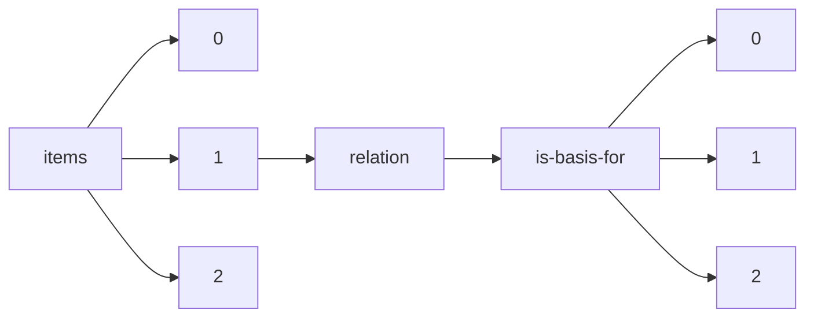

!!! warning "This document is not official Crossref documentation"
# Elements
PATH = items/array/relation/is-basis-for/array(1)  
Occurs 10 times  
{ .annotate }

1. A route to an element, for example:  
   The route "items/array/relation/is-basis-for/array" corresponds to navigating through the JSON indices as  
   ["items"][0]["relation"]["is-basis-for"][0]  

## Asserted-by
See more information: [items/array/relation/is-basis-for/array/asserted-by](asserted-by/index.md)  
Occurs 10 timess  
Unique values: 2  

| **Row** | **Value** `String` | **Count** `Int64` |
|--------:|----------------------:|---------------------:|
| **1**   | object                | 5                    |
| **2**   | subject               | 5                    |

## Id
See more information: [items/array/relation/is-basis-for/array/id](id/index.md)  
Occurs 10 timess  
Unique values: 10  

| **Row** | **Value** `String`                                        | **Count** `Int64` |
|--------:|-------------------------------------------------------------:|---------------------:|
| **1**   | 10.15763/DBS.SCCSC.RR.0001                                   | 1                    |
| **2**   | 10.52843/cassyni.9wdq84                                      | 1                    |
| **3**   | 10.15763/DBS.SCCSC.RR.0002                                   | 1                    |
| **4**   | https://www.youtube.com/watch?v=ELZTVOiqKn8&feature=youtu.be | 1                    |
| **5**   | 10.2514/1.J061454                                            | 1                    |
| **6**   | 10.1016/j.cpc.2021.108193                                    | 1                    |
| **7**   | 10.15763/DBS.SCCSC.RR.0004                                   | 1                    |
| **8**   | 10.1109/JPROC.2022.3187339                                   | 1                    |
| **9**   | 10.25039/CIE.DS.8svs5rqd                                     | 1                    |
| **10**  | 10.5555/letstestgrants02                                     | 1                    |

## Id-type
See more information: [items/array/relation/is-basis-for/array/id-type](id-type/index.md)  
Occurs 10 timess  
Unique values: 2  

| **Row** | **Value** `String` | **Count** `Int64` |
|--------:|----------------------:|---------------------:|
| **1**   | doi                   | 9                    |
| **2**   | uri                   | 1                    |

