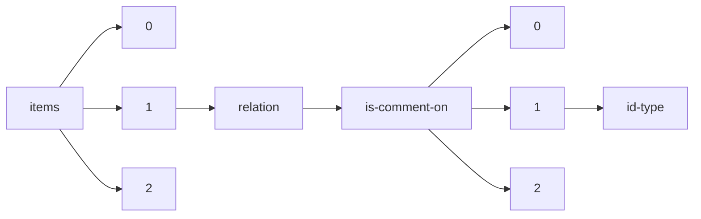

!!! warning "This document is not official Crossref documentation"
# Id-type
PATH = items/array/relation/is-comment-on/array/id-type(1)  
Occurs 86 143 times  
Unique values: 8  
{ .annotate }

1. A route to an element, for example:  
   The route "items/array/relation/is-comment-on/array/id-type" corresponds to navigating through the JSON indices as  
   ["items"][0]["relation"]["is-comment-on"][0]["id-type"]  

| **Row** | **Value** `String` | **Count** `Int64` |
|--------:|----------------------:|---------------------:|
| **1**   | doi                   | 85 668               |
| **2**   | ecli                  | 417                  |
| **3**   | uri                   | 41                   |
| **4**   | arxiv                 | 8                    |
| **5**   | issn                  | 4                    |
| **6**   | pmid                  | 3                    |
| **7**   | isbn                  | 1                    |
| **8**   | uuid                  | 1                    |

