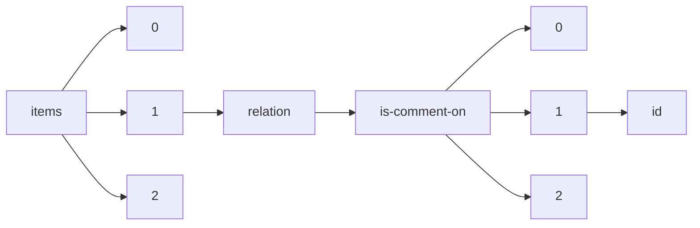

!!! warning "This document is not official Crossref documentation"
# Id
PATH = items/array/relation/is-comment-on/array/id(1)  
Occurs 86 143 times  
Unique values: > 999  
{ .annotate }

1. A route to an element, for example:  
   The route "items/array/relation/is-comment-on/array/id" corresponds to navigating through the JSON indices as  
   ["items"][0]["relation"]["is-comment-on"][0]["id"]  

!!! note "Due to current limitations, only the first 1,000 unique values are counted."

| **Row** | **Value** `String`       | **Count** `Int64` |
|--------:|----------------------------:|---------------------:|
| **1**   | 10.5194/se-2015-134         | 24                   |
| **2**   | 10.5194/essd-2019-4         | 20                   |
| **3**   | 10.1075/lab.3.3.01ogr       | 17                   |
| **4**   | 10.1075/lab.5.4.01phi       | 17                   |
| **5**   | 10.5194/esd-2018-36         | 15                   |
| **6**   | 10.5194/hess-2019-216       | 14                   |
| **7**   | 10.1075/lab.1.1.01sor       | 14                   |
| **8**   | 10.5194/wes-2018-46         | 14                   |
| **9**   | 10.5194/soil-2018-5         | 14                   |
| **10**  | 10.5194/hess-2017-497       | 14                   |
| **11**  | 10.5194/gc-2018-10          | 14                   |
| **12**  | 10.1075/lab.17058.sch       | 14                   |
| **13**  | 10.5194/tc-2017-6           | 14                   |
| **14**  | 10.5194/acp-2016-1157       | 14                   |
| **15**  | 10.5194/esd-2017-120        | 12                   |
| **16**  | 10.5194/nhess-2016-408      | 12                   |
| **17**  | 10.5194/cp-2017-147         | 12                   |
| **18**  | 10.5194/bg-2017-107         | 12                   |
| **19**  | 10.5194/nhess-2020-128      | 12                   |
| **20**  | 10.1075/lab.4.3.01tsi       | 12                   |
| **21**  | 10.5194/hess-2017-116       | 12                   |
| **22**  | 10.5194/acp-2018-234        | 12                   |
| **23**  | 10.5194/npg-2019-53         | 12                   |
| **24**  | 10.5194/amt-2017-336        | 12                   |
| **25**  | 10.5194/acp-2018-711        | 12                   |
| **26**  | 10.5194/gmd-2019-52         | 12                   |
| **27**  | 10.5194/hess-2017-162       | 12                   |
| **28**  | 10.5194/gmd-2018-220        | 12                   |
| **29**  | 10.5194/se-2018-133         | 10                   |
| **30**  | 10.5194/gmd-2019-104        | 10                   |
| **31**  | 10.5194/essd-2019-78        | 10                   |
| **32**  | 10.5194/amt-2017-413        | 10                   |
| **33**  | 10.5194/gmd-2017-150        | 10                   |
| **34**  | 10.5194/amt-2017-171        | 10                   |
| **35**  | 10.5194/npg-2017-67         | 10                   |
| **36**  | 10.5194/gmd-2019-180        | 10                   |
| **37**  | 10.5194/hess-2017-111       | 10                   |
| **38**  | 10.5194/gmd-2019-183        | 10                   |
| **39**  | 10.5194/gmd-2017-224        | 10                   |
| **40**  | 10.5194/acp-2020-106        | 10                   |
| **41**  | 10.5194/gmd-2019-46         | 10                   |
| **42**  | 10.5194/cp-2018-145         | 10                   |
| **43**  | 10.5194/hess-2018-479       | 10                   |
| **44**  | 10.5194/acp-2020-145        | 10                   |
| **45**  | 10.5194/cp-2016-132         | 10                   |
| **46**  | 10.5194/essd-2018-144       | 10                   |
| **47**  | 10.5194/amt-2018-58         | 10                   |
| **48**  | 10.5194/essd-2019-154       | 10                   |
| **49**  | 10.5194/os-2020-26          | 10                   |
| **50**  | 10.5194/bg-2017-505         | 10                   |
| **51**  | 10.1075/lab.2.3.01dab       | 10                   |
| **52**  | 10.5194/acp-2018-847        | 10                   |
| **53**  | 10.5194/nhess-2017-72       | 10                   |
| **54**  | 10.5194/wes-2017-53         | 10                   |
| **55**  | 10.5194/soil-2017-30        | 10                   |
| **56**  | 10.5194/nhess-2017-216      | 10                   |
| **57**  | 10.5194/gmd-2019-57         | 10                   |
| **58**  | 10.5194/hess-2017-83        | 10                   |
| **59**  | 10.5194/gmd-2019-273        | 10                   |
| **60**  | 10.5194/nhess-2018-28       | 10                   |
| **61**  | 10.5194/gi-2020-14          | 10                   |
| **62**  | 10.5194/amt-2017-456        | 10                   |
| **63**  | 10.5194/esurf-2019-5        | 10                   |
| **64**  | 10.5194/gmd-2019-195        | 10                   |
| **65**  | 10.5194/gi-2017-48          | 10                   |
| **66**  | 10.5194/gmd-2018-68         | 10                   |
| **67**  | 10.5194/bg-2017-7           | 10                   |
| **68**  | 10.1075/lab.6.6.01lil       | 10                   |
| **69**  | 10.5194/amt-2018-177        | 9                    |
| **70**  | 10.5194/esd-2016-10         | 9                    |
| **71**  | 10.5194/se-2018-44          | 8                    |
| **72**  | 10.5194/tc-2017-236         | 8                    |
| **73**  | 10.5194/nhess-2018-40       | 8                    |
| **74**  | 10.5194/amt-2017-46         | 8                    |
| **75**  | 10.5194/bg-2017-308         | 8                    |
| **76**  | 10.5194/acp-2018-1066       | 8                    |
| **77**  | 10.5194/hess-2018-612       | 8                    |
| **78**  | 10.5194/essd-2018-73        | 8                    |
| **79**  | 10.5194/cp-2017-40          | 8                    |
| **80**  | 10.5194/wes-2019-41         | 8                    |
| **81**  | 10.5194/nhess-2018-303      | 8                    |
| **82**  | 10.5194/hess-2019-189       | 8                    |
| **83**  | 10.5194/bg-2017-259         | 8                    |
| **84**  | 10.5194/bg-2017-302         | 8                    |
| **85**  | 10.5194/wes-2019-43         | 8                    |
| **86**  | 10.5194/acp-2017-856        | 8                    |
| **87**  | 10.5194/acp-2018-1129       | 8                    |
| **88**  | 10.5194/acp-2017-54         | 8                    |
| **89**  | 10.5194/acp-2018-1185       | 8                    |
| **90**  | 10.5194/bg-2019-307         | 8                    |
| **91**  | 10.5194/os-2017-67          | 8                    |
| **92**  | 10.5194/hess-2018-416       | 8                    |
| **93**  | 10.5194/gmd-2017-234        | 8                    |
| **94**  | 10.5194/acp-2018-10         | 8                    |
| **95**  | 10.5194/hess-2017-198       | 8                    |
| **96**  | 10.5194/esurf-2018-43       | 8                    |
| **97**  | 10.5194/hess-2018-429       | 8                    |
| **98**  | 10.5194/wes-2019-22         | 8                    |
| **99**  | 10.5194/essd-2018-3         | 8                    |
| **100** | 10.5194/acp-2016-976        | 8                    |
| **101** | 10.5194/tc-2018-36          | 8                    |
| **102** | 10.5194/esd-2018-22         | 8                    |
| **103** | 10.5194/tc-2018-197         | 8                    |
| **104** | 10.5194/essd-2018-152       | 8                    |
| **105** | 10.5194/os-2017-98          | 8                    |
| **106** | 10.5194/acp-2018-1345       | 8                    |
| **107** | 10.5194/amt-2018-311        | 8                    |
| **108** | 10.5194/acp-2017-304        | 8                    |
| **109** | 10.5194/essd-2016-65        | 8                    |
| **110** | 10.5194/hess-2017-358       | 8                    |
| **111** | 10.5194/se-2018-98          | 8                    |
| **112** | 10.5194/tc-2017-227         | 8                    |
| **113** | 10.5194/cp-2018-19          | 8                    |
| **114** | 10.5194/cp-2018-106         | 8                    |
| **115** | 10.5194/bg-2018-405         | 8                    |
| **116** | 10.5194/esurf-2017-42       | 8                    |
| **117** | 10.5194/tc-2018-130         | 8                    |
| **118** | 10.5194/hess-2019-407       | 8                    |
| **119** | 10.5194/esd-2017-58         | 8                    |
| **120** | 10.5194/gmd-2018-142        | 8                    |
| **121** | 10.5194/gmd-2019-4          | 8                    |
| **122** | 10.5194/acp-2017-1124       | 8                    |
| **123** | 10.5194/acp-2017-939        | 8                    |
| **124** | 10.5194/acp-2019-1133       | 8                    |
| **125** | 10.5194/wes-2019-71         | 8                    |
| **126** | 10.5194/npg-2017-21         | 8                    |
| **127** | 10.5194/se-2018-83          | 8                    |
| **128** | 10.5194/amt-2017-182        | 8                    |
| **129** | 10.5194/acp-2018-748        | 8                    |
| **130** | 10.5194/esurf-2018-41       | 8                    |
| **131** | 10.5194/tc-2017-219         | 8                    |
| **132** | 10.5194/acp-2018-985        | 8                    |
| **133** | 10.5194/acp-2018-645        | 8                    |
| **134** | 10.5194/esd-2017-40         | 8                    |
| **135** | 10.5194/acp-2018-1153       | 8                    |
| **136** | 10.5194/acp-2017-83         | 8                    |
| **137** | 10.5194/os-2020-46          | 8                    |
| **138** | 10.5194/esurf-2018-60       | 8                    |
| **139** | 10.5194/angeo-2019-72       | 8                    |
| **140** | 10.5194/acp-2019-229        | 8                    |
| **141** | 10.5194/amt-2018-442        | 8                    |
| **142** | 10.5194/hess-2017-9         | 8                    |
| **143** | 10.5194/wes-2019-42         | 8                    |
| **144** | 10.5194/acp-2017-458        | 8                    |
| **145** | 10.5194/hess-2018-424       | 8                    |
| **146** | 10.5194/wcd-2020-2          | 8                    |
| **147** | 10.5194/bg-2016-549         | 8                    |
| **148** | 10.5194/hess-2018-476       | 8                    |
| **149** | 10.5194/tc-2019-218         | 8                    |
| **150** | 10.5194/acp-2018-1201       | 8                    |
| **151** | 10.5194/tc-2019-192         | 8                    |
| **152** | 10.5194/bg-2019-85          | 8                    |
| **153** | 10.5194/wes-2017-35         | 8                    |
| **154** | 10.5194/acp-2016-1138       | 8                    |
| **155** | 10.5194/hess-2017-89        | 8                    |
| **156** | 10.5194/gmd-2018-4          | 8                    |
| **157** | 10.5194/acp-2019-259        | 8                    |
| **158** | 10.5194/cp-2017-11          | 8                    |
| **159** | 10.5194/esurf-2020-3        | 8                    |
| **160** | 10.5194/acp-2019-905        | 8                    |
| **161** | 10.5194/os-2020-33          | 8                    |
| **162** | 10.5194/nhess-2017-347      | 8                    |
| **163** | 10.5194/amt-2019-4          | 8                    |
| **164** | 10.5194/essd-2018-150       | 8                    |
| **165** | 10.5194/tc-2017-115         | 8                    |
| **166** | 10.5194/se-2019-62          | 8                    |
| **167** | 10.5194/cp-2017-18          | 8                    |
| **168** | 10.5194/acp-2017-1039       | 8                    |
| **169** | 10.5194/esd-2017-93         | 8                    |
| **170** | 10.5194/gc-2019-3           | 8                    |
| **171** | 10.5194/tc-2018-292         | 8                    |
| **172** | 10.5194/acp-2017-201        | 8                    |
| **173** | 10.5194/gmd-2017-294        | 8                    |
| **174** | 10.5194/mr-2020-2           | 8                    |
| **175** | 10.5194/amt-2019-501        | 8                    |
| **176** | 10.5194/gmd-2016-80         | 8                    |
| **177** | 10.5194/amt-2018-45         | 8                    |
| **178** | 10.5194/acp-2018-203        | 8                    |
| **179** | 10.5194/tc-2018-13          | 8                    |
| **180** | 10.5194/cp-2018-104         | 8                    |
| **181** | 10.5194/hess-2017-752       | 8                    |
| **182** | 10.5194/acp-2018-1215       | 8                    |
| **183** | 10.5194/npg-2017-20         | 8                    |
| **184** | 10.5194/gmd-2017-257        | 8                    |
| **185** | 10.5194/essd-2018-81        | 8                    |
| **186** | 10.5194/essd-2018-158       | 8                    |
| **187** | 10.5194/wes-2017-39         | 8                    |
| **188** | 10.5194/essd-2018-142       | 8                    |
| **189** | 10.1075/lab.19043.goa       | 7                    |
| **190** | 10.5194/bg-2017-469         | 7                    |
| **191** | 10.5194/acp-2019-861        | 6                    |
| **192** | 10.5194/tc-2018-143         | 6                    |
| **193** | 10.5194/bg-2018-205         | 6                    |
| **194** | 10.5194/gmd-2019-230        | 6                    |
| **195** | 10.5194/acp-2019-1096       | 6                    |
| **196** | 10.5194/acp-2018-322        | 6                    |
| **197** | 10.5194/se-2019-64          | 6                    |
| **198** | 10.5194/amt-2019-291        | 6                    |
| **199** | 10.5194/acp-2016-1028       | 6                    |
| **200** | 10.5194/cp-2020-132         | 6                    |
| **201** | 10.5194/hess-2018-467       | 6                    |
| **202** | 10.5194/acp-2019-141        | 6                    |
| **203** | 10.5194/cp-2019-80          | 6                    |
| **204** | 10.5194/amt-2019-405        | 6                    |
| **205** | 10.5194/wes-2020-77         | 6                    |
| **206** | 10.5194/tc-2019-33          | 6                    |
| **207** | 10.5194/gmd-2019-277        | 6                    |
| **208** | 10.5194/esurf-2018-21       | 6                    |
| **209** | 10.5194/nhess-2019-375      | 6                    |
| **210** | 10.5194/essd-2017-46        | 6                    |
| **211** | 10.5194/gmd-2017-286        | 6                    |
| **212** | 10.5194/gmd-2017-97         | 6                    |
| **213** | 10.5194/amt-2018-40         | 6                    |
| **214** | 10.5194/acp-2019-1024       | 6                    |
| **215** | 10.5194/acp-2018-172        | 6                    |
| **216** | 10.5194/os-2018-142         | 6                    |
| **217** | 10.5194/hess-2019-533       | 6                    |
| **218** | 10.5194/dwes-2016-9         | 6                    |
| **219** | 10.5194/esurf-2019-52       | 6                    |
| **220** | 10.5194/amt-2018-395        | 6                    |
| **221** | 10.5194/acp-2020-175        | 6                    |
| **222** | 10.5194/acp-2019-471        | 6                    |
| **223** | 10.5194/tc-2017-121         | 6                    |
| **224** | 10.5194/nhess-2017-127      | 6                    |
| **225** | 10.5194/amt-2018-318        | 6                    |
| **226** | 10.5194/hess-2017-207       | 6                    |
| **227** | 10.5194/cp-2018-149         | 6                    |
| **228** | 10.5194/gmd-2020-54         | 6                    |
| **229** | 10.5194/acp-2016-1054       | 6                    |
| **230** | 10.5194/hess-2017-150       | 6                    |
| **231** | 10.5194/amt-2018-189        | 6                    |
| **232** | 10.5194/hess-2019-415       | 6                    |
| **233** | 10.5194/tc-2017-79          | 6                    |
| **234** | 10.5194/hess-2019-650       | 6                    |
| **235** | 10.5194/se-2017-12          | 6                    |
| **236** | 10.5194/hess-2019-264       | 6                    |
| **237** | 10.5194/hess-2017-685       | 6                    |
| **238** | 10.5194/angeo-2018-49       | 6                    |
| **239** | 10.5194/se-2017-70          | 6                    |
| **240** | 10.5194/amt-2019-199        | 6                    |
| **241** | 10.5194/nhess-2019-132      | 6                    |
| **242** | 10.5194/os-2018-150         | 6                    |
| **243** | 10.5194/amt-2017-86         | 6                    |
| **244** | 10.5194/cp-2018-59          | 6                    |
| **245** | 10.5194/acp-2018-121        | 6                    |
| **246** | 10.5194/bg-2019-218         | 6                    |
| **247** | 10.5194/acp-2017-718        | 6                    |
| **248** | 10.5194/bg-2020-392         | 6                    |
| **249** | 10.5194/amt-2018-412        | 6                    |
| **250** | 10.5194/acp-2017-366        | 6                    |
| **251** | 10.5194/acp-2018-357        | 6                    |
| **252** | 10.5194/acp-2016-1165       | 6                    |
| **253** | 10.5194/essd-2020-197       | 6                    |
| **254** | 10.5194/gmd-2019-134        | 6                    |
| **255** | 10.5194/acp-2019-129        | 6                    |
| **256** | 10.5194/esurf-2018-25       | 6                    |
| **257** | 10.5194/tc-2018-275         | 6                    |
| **258** | 10.5194/essd-2017-44        | 6                    |
| **259** | 10.5194/hess-2017-549       | 6                    |
| **260** | 10.5194/egusphere-2022-1057 | 6                    |
| **261** | 10.5194/gmd-2017-13         | 6                    |
| **262** | 10.5194/amt-2018-32         | 6                    |
| **263** | 10.5194/gmd-2017-278        | 6                    |
| **264** | 10.5194/hess-2017-715       | 6                    |
| **265** | 10.5194/acp-2016-1133       | 6                    |
| **266** | 10.5194/amt-2020-121        | 6                    |
| **267** | 10.5194/essd-2018-46        | 6                    |
| **268** | 10.5194/acp-2018-685        | 6                    |
| **269** | 10.5194/amt-2018-44         | 6                    |
| **270** | 10.5194/hess-2017-296       | 6                    |
| **271** | 10.5194/se-2019-40          | 6                    |
| **272** | 10.5194/wes-2018-78         | 6                    |
| **273** | 10.5194/acp-2017-1151       | 6                    |
| **274** | 10.5194/os-2018-117         | 6                    |
| **275** | 10.5194/gmd-2019-42         | 6                    |
| **276** | 10.5194/essd-2020-10        | 6                    |
| **277** | 10.5194/bg-2018-407         | 6                    |
| **278** | 10.5194/essd-2019-159       | 6                    |
| **279** | 10.5194/cp-2016-137         | 6                    |
| **280** | 10.5194/se-2017-47          | 6                    |
| **281** | 10.5194/acp-2018-1009       | 6                    |
| **282** | 10.5194/gmd-2018-212        | 6                    |
| **283** | 10.5194/bg-2019-79          | 6                    |
| **284** | 10.5194/bg-2016-557         | 6                    |
| **285** | 10.5194/acp-2018-667        | 6                    |
| **286** | 10.5194/acp-2017-954        | 6                    |
| **287** | 10.5194/acp-2017-71         | 6                    |
| **288** | 10.5194/os-2018-70          | 6                    |
| **289** | 10.5194/npg-2018-36         | 6                    |
| **290** | 10.5194/acp-2017-356        | 6                    |
| **291** | 10.5194/wes-2018-54         | 6                    |
| **292** | 10.5194/acp-2019-121        | 6                    |
| **293** | 10.5194/npg-2019-10         | 6                    |
| **294** | 10.5194/esurf-2018-55       | 6                    |
| **295** | 10.5194/esurf-2018-67       | 6                    |
| **296** | 10.5194/hess-2018-305       | 6                    |
| **297** | 10.5194/nhess-2018-195      | 6                    |
| **298** | 10.5194/amt-2018-435        | 6                    |
| **299** | 10.5194/hess-2017-302       | 6                    |
| **300** | 10.5194/tc-2017-90          | 6                    |
| **301** | 10.5194/acp-2018-832        | 6                    |
| **302** | 10.5194/gmd-2017-74         | 6                    |
| **303** | 10.5194/acp-2017-86         | 6                    |
| **304** | 10.5194/acp-2019-213        | 6                    |
| **305** | 10.5194/tc-2018-67          | 6                    |
| **306** | 10.5194/gmd-2019-36         | 6                    |
| **307** | 10.5194/acp-2018-1045       | 6                    |
| **308** | 10.5194/nhess-2017-79       | 6                    |
| **309** | 10.5194/gmd-2018-147        | 6                    |
| **310** | 10.5194/acp-2019-944        | 6                    |
| **311** | 10.5194/acp-2017-1091       | 6                    |
| **312** | 10.5194/acp-2018-1353       | 6                    |
| **313** | 10.5194/gi-2017-38          | 6                    |
| **314** | 10.5194/acp-2019-235        | 6                    |
| **315** | 10.5194/acp-2018-228        | 6                    |
| **316** | 10.5194/os-2018-91          | 6                    |
| **317** | 10.5194/se-2019-27          | 6                    |
| **318** | 10.5194/se-2020-30          | 6                    |
| **319** | 10.5194/esurf-2017-1        | 6                    |
| **320** | 10.5194/acp-2017-376        | 6                    |
| **321** | 10.5194/se-2019-183         | 6                    |
| **322** | 10.5194/gi-2019-43          | 6                    |
| **323** | 10.5194/acp-2018-885        | 6                    |
| **324** | 10.5194/acp-2017-735        | 6                    |
| **325** | 10.5194/acp-2017-602        | 6                    |
| **326** | 10.5194/se-2017-99          | 6                    |
| **327** | 10.5194/acp-2016-1010       | 6                    |
| **328** | 10.5194/hess-2017-42        | 6                    |
| **329** | 10.1162/99608f92.cb0fa8d2   | 6                    |
| **330** | 10.5194/acp-2016-1170       | 6                    |
| **331** | 10.5194/esurf-2018-93       | 6                    |
| **332** | 10.5194/amt-2018-347        | 6                    |
| **333** | 10.5194/acp-2018-60         | 6                    |
| **334** | 10.5194/hess-2017-662       | 6                    |
| **335** | 10.5194/gc-2019-22          | 6                    |
| **336** | 10.5194/bg-2018-296         | 6                    |
| **337** | 10.5194/gmd-2020-49         | 6                    |
| **338** | 10.5194/gmd-2019-140        | 6                    |
| **339** | 10.5194/acp-2018-27         | 6                    |
| **340** | 10.5194/acp-2018-414        | 6                    |
| **341** | 10.5194/acp-2017-300        | 6                    |
| **342** | 10.5194/se-2019-173         | 6                    |
| **343** | 10.5194/acp-2017-43         | 6                    |
| **344** | 10.5194/se-2020-10          | 6                    |
| **345** | 10.5194/acp-2016-1127       | 6                    |
| **346** | 10.5194/wes-2018-30         | 6                    |
| **347** | 10.5194/gmd-2017-271        | 6                    |
| **348** | 10.5194/amt-2019-119        | 6                    |
| **349** | 10.5194/se-2018-28          | 6                    |
| **350** | 10.5194/acp-2018-698        | 6                    |
| **351** | 10.5194/hess-2017-398       | 6                    |
| **352** | 10.5194/hess-2017-36        | 6                    |
| **353** | 10.5194/hess-2019-151       | 6                    |
| **354** | 10.5194/acp-2017-410        | 6                    |
| **355** | 10.5194/bg-2018-334         | 6                    |
| **356** | 10.5194/essd-2017-59        | 6                    |
| **357** | 10.5194/acp-2018-20         | 6                    |
| **358** | 10.5194/bg-2019-41          | 6                    |
| **359** | 10.5194/cp-2018-58          | 6                    |
| **360** | 10.5194/hess-2016-686       | 6                    |
| **361** | 10.5194/hess-2017-456       | 6                    |
| **362** | 10.5194/essd-2020-74        | 6                    |
| **363** | 10.5194/amt-2017-363        | 6                    |
| **364** | 10.5194/hess-2019-77        | 6                    |
| **365** | 10.5194/angeo-2019-45       | 6                    |
| **366** | 10.5194/acp-2019-890        | 6                    |
| **367** | 10.5194/cp-2018-20          | 6                    |
| **368** | 10.5194/acp-2019-696        | 6                    |
| **369** | 10.5194/cp-2019-29          | 6                    |
| **370** | 10.5194/esurf-2017-12       | 6                    |
| **371** | 10.5194/bg-2018-267         | 6                    |
| **372** | 10.5194/bg-2017-103         | 6                    |
| **373** | 10.5194/acp-2019-833        | 6                    |
| **374** | 10.5194/nhess-2018-253      | 6                    |
| **375** | 10.5194/hess-2018-36        | 6                    |
| **376** | 10.5194/amt-2019-183        | 6                    |
| **377** | 10.5194/gchron-2019-13      | 6                    |
| **378** | 10.5194/acp-2018-982        | 6                    |
| **379** | 10.5194/essd-2019-236       | 6                    |
| **380** | 10.5194/hess-2019-297       | 6                    |
| **381** | 10.5194/hess-2019-308       | 6                    |
| **382** | 10.5194/essd-2018-125       | 6                    |
| **383** | 10.5194/wes-2020-58         | 6                    |
| **384** | 10.5194/acp-2017-1172       | 6                    |
| **385** | 10.5194/acp-2017-592        | 6                    |
| **386** | 10.5194/hess-2019-99        | 6                    |
| **387** | 10.5194/amt-2018-197        | 6                    |
| **388** | 10.5194/tc-2017-168         | 6                    |
| **389** | 10.5194/gmd-2017-243        | 6                    |
| **390** | 10.5194/acp-2019-1002       | 6                    |
| **391** | 10.5194/tc-2018-80          | 6                    |
| **392** | 10.5194/acp-2018-1298       | 6                    |
| **393** | 10.5194/bg-2018-97          | 6                    |
| **394** | 10.5194/hess-2018-413       | 6                    |
| **395** | 10.5194/wes-2016-55         | 6                    |
| **396** | 10.5194/hess-2019-247       | 6                    |
| **397** | 10.5194/bg-2017-368         | 6                    |
| **398** | 10.5194/tc-2019-72          | 6                    |
| **399** | 10.5194/nhess-2019-399      | 6                    |
| **400** | 10.5194/tc-2017-129         | 6                    |
| **401** | 10.5194/nhess-2017-297      | 6                    |
| **402** | 10.5194/acp-2020-137        | 6                    |
| **403** | 10.5194/gi-2018-25          | 6                    |
| **404** | 10.5194/amt-2016-392        | 6                    |
| **405** | 10.5194/acp-2018-194        | 6                    |
| **406** | 10.5194/hess-2017-282       | 6                    |
| **407** | 10.5194/gi-2019-6           | 6                    |
| **408** | 10.5194/wes-2017-11         | 6                    |
| **409** | 10.5194/acp-2017-1022       | 6                    |
| **410** | 10.5194/acp-2019-596        | 6                    |
| **411** | 10.5194/gmd-2017-164        | 6                    |
| **412** | 10.5194/cp-2018-77          | 6                    |
| **413** | 10.5194/acp-2019-755        | 6                    |
| **414** | 10.5194/hess-2019-254       | 6                    |
| **415** | 10.5194/bg-2020-227         | 6                    |
| **416** | 10.5194/acp-2018-356        | 6                    |
| **417** | 10.5194/acp-2017-1126       | 6                    |
| **418** | 10.5194/acp-2019-107        | 6                    |
| **419** | 10.5194/npg-2017-49         | 6                    |
| **420** | 10.5194/esurf-2018-50       | 6                    |
| **421** | 10.5194/amt-2016-414        | 6                    |
| **422** | 10.5194/gmd-2017-148        | 6                    |
| **423** | 10.5194/gmd-2018-55         | 6                    |
| **424** | 10.5194/hess-2018-144       | 6                    |
| **425** | 10.5194/tc-2017-92          | 6                    |
| **426** | 10.5194/acp-2018-1091       | 6                    |
| **427** | 10.5194/amt-2017-361        | 6                    |
| **428** | 10.5194/acp-2019-994        | 6                    |
| **429** | 10.5194/hess-2019-117       | 6                    |
| **430** | 10.5194/acp-2020-281        | 6                    |
| **431** | 10.5194/hess-2018-625       | 6                    |
| **432** | 10.5194/amt-2017-401        | 6                    |
| **433** | 10.5194/cp-2017-19          | 6                    |
| **434** | 10.5194/essd-2017-122       | 6                    |
| **435** | 10.5194/acp-2018-24         | 6                    |
| **436** | 10.5194/essd-2017-134       | 6                    |
| **437** | 10.5194/npg-2018-38         | 6                    |
| **438** | 10.5194/os-2019-66          | 6                    |
| **439** | 10.5194/gmd-2019-125        | 6                    |
| **440** | 10.5194/gmd-2017-61         | 6                    |
| **441** | 10.5194/acp-2018-569        | 6                    |
| **442** | 10.5194/os-2020-22          | 6                    |
| **443** | 10.5194/acp-2019-1183       | 6                    |
| **444** | 10.5194/gmd-2020-146        | 6                    |
| **445** | 10.5194/soil-2019-65        | 6                    |
| **446** | 10.5194/acp-2017-1176       | 6                    |
| **447** | 10.5194/acp-2019-1044       | 6                    |
| **448** | 10.5194/amt-2019-408        | 6                    |
| **449** | 10.5194/tc-2018-218         | 6                    |
| **450** | 10.5194/bg-2019-94          | 6                    |
| **451** | 10.5194/acp-2019-356        | 6                    |
| **452** | 10.5194/amt-2019-452        | 6                    |
| **453** | 10.5194/gmd-2018-10         | 6                    |
| **454** | 10.5194/hess-2020-44        | 6                    |
| **455** | 10.5194/bg-2018-478         | 6                    |
| **456** | 10.5194/angeo-2019-112      | 6                    |
| **457** | 10.5194/amt-2018-414        | 6                    |
| **458** | 10.5194/gmd-2018-266        | 6                    |
| **459** | 10.5194/wes-2017-48         | 6                    |
| **460** | 10.5194/acp-2018-902        | 6                    |
| **461** | 10.5194/acp-2018-1281       | 6                    |
| **462** | 10.5194/acp-2019-672        | 6                    |
| **463** | 10.5194/angeo-2019-68       | 6                    |
| **464** | 10.5194/os-2019-16          | 6                    |
| **465** | 10.5194/acp-2019-690        | 6                    |
| **466** | 10.5194/wes-2019-7          | 6                    |
| **467** | 10.5194/bg-2018-202         | 6                    |
| **468** | 10.5194/acp-2017-269        | 6                    |
| **469** | 10.5194/cp-2020-38          | 6                    |
| **470** | 10.5194/esurf-2017-2        | 6                    |
| **471** | 10.5194/acp-2017-1018       | 6                    |
| **472** | 10.5194/wes-2019-68         | 6                    |
| **473** | 10.5194/bg-2017-542         | 6                    |
| **474** | 10.5194/se-2017-8           | 6                    |
| **475** | 10.5194/esurf-2020-29       | 6                    |
| **476** | 10.5194/se-2017-14          | 6                    |
| **477** | 10.5194/gmd-2019-306        | 6                    |
| **478** | 10.5194/tc-2018-268         | 6                    |
| **479** | 10.5194/bg-2020-76          | 6                    |
| **480** | 10.5194/acp-2017-914        | 6                    |
| **481** | 10.5194/wes-2018-35         | 6                    |
| **482** | 10.5194/se-2019-32          | 6                    |
| **483** | 10.5194/acp-2016-1064       | 6                    |
| **484** | 10.5194/cp-2018-48          | 6                    |
| **485** | 10.5194/cp-2017-146         | 6                    |
| **486** | 10.5194/acp-2018-572        | 6                    |
| **487** | 10.5194/hess-2019-389       | 6                    |
| **488** | 10.5194/hess-2018-32        | 6                    |
| **489** | 10.5194/gmd-2016-79         | 5                    |
| **490** | 10.5194/nhess-2020-227      | 5                    |
| **491** | 10.5194/egusphere-2022-719  | 5                    |
| **492** | 10.5194/hess-2016-525       | 5                    |
| **493** | 10.5194/hess-2022-116       | 5                    |
| **494** | 10.5194/acp-2018-1029       | 5                    |
| **495** | 10.5194/egusphere-2022-660  | 5                    |
| **496** | 10.5194/se-2017-78          | 5                    |
| **497** | 10.5194/esurf-2019-64       | 5                    |
| **498** | 10.5194/os-2018-99          | 5                    |
| **499** | 10.5194/gmd-2018-336        | 4                    |
| **500** | 10.5194/esurf-2017-15       | 4                    |
| **501** | 10.5194/bg-2017-362         | 4                    |
| **502** | 10.5194/hess-2017-749       | 4                    |
| **503** | 10.5194/gmd-2017-291        | 4                    |
| **504** | 10.5194/acp-2016-1182       | 4                    |
| **505** | 10.5194/npg-2019-46         | 4                    |
| **506** | 10.5194/amt-2020-126        | 4                    |
| **507** | 10.5194/acp-2019-406        | 4                    |
| **508** | 10.5194/hess-2017-652       | 4                    |
| **509** | 10.5194/bg-2017-547         | 4                    |
| **510** | 10.5194/amt-2018-42         | 4                    |
| **511** | 10.5194/cp-2019-96          | 4                    |
| **512** | 10.5194/os-2020-64          | 4                    |
| **513** | 10.5194/tc-2018-57          | 4                    |
| **514** | 10.5194/acp-2017-91         | 4                    |
| **515** | 10.5194/esd-2016-20         | 4                    |
| **516** | 10.5194/acp-2016-806        | 4                    |
| **517** | 10.5194/acp-2018-1057       | 4                    |
| **518** | 10.5194/os-2016-106         | 4                    |
| **519** | 10.5194/amt-2019-481        | 4                    |
| **520** | 10.5194/os-2017-62          | 4                    |
| **521** | 10.5194/wes-2019-63         | 4                    |
| **522** | 10.5194/acp-2018-137        | 4                    |
| **523** | 10.5194/bg-2019-16          | 4                    |
| **524** | 10.5194/amt-2017-219        | 4                    |
| **525** | 10.5194/acp-2017-265        | 4                    |
| **526** | 10.5194/amt-2020-219        | 4                    |
| **527** | 10.5194/essd-2017-117       | 4                    |
| **528** | 10.5194/nhess-2017-56       | 4                    |
| **529** | 10.5194/wes-2017-42         | 4                    |
| **530** | 10.5194/tc-2018-132         | 4                    |
| **531** | 10.5194/cp-2020-82          | 4                    |
| **532** | 10.5194/os-2017-41          | 4                    |
| **533** | 10.5194/nhess-2019-61       | 4                    |
| **534** | 10.5194/acp-2019-773        | 4                    |
| **535** | 10.5194/tc-2019-300         | 4                    |
| **536** | 10.5194/acp-2018-638        | 4                    |
| **537** | 10.5194/gmd-2017-299        | 4                    |
| **538** | 10.5194/acp-2018-134        | 4                    |
| **539** | 10.5194/acp-2017-50         | 4                    |
| **540** | 10.5194/tc-2019-144         | 4                    |
| **541** | 10.5194/acp-2017-94         | 4                    |
| **542** | 10.5194/nhess-2017-151      | 4                    |
| **543** | 10.5194/hess-2019-499       | 4                    |
| **544** | 10.5194/angeo-2018-106      | 4                    |
| **545** | 10.5194/hess-2017-440       | 4                    |
| **546** | 10.5194/amt-2019-137        | 4                    |
| **547** | 10.5194/cp-2017-61          | 4                    |
| **548** | 10.5194/hess-2017-142       | 4                    |
| **549** | 10.5194/wes-2017-2          | 4                    |
| **550** | 10.5194/gmd-2017-69         | 4                    |
| **551** | 10.5194/gmd-2019-319        | 4                    |
| **552** | 10.5194/essd-2019-21        | 4                    |
| **553** | 10.5194/acp-2018-1008       | 4                    |
| **554** | 10.5194/gmd-2018-115        | 4                    |
| **555** | 10.5194/hess-2018-241       | 4                    |
| **556** | 10.5194/amt-2019-343        | 4                    |
| **557** | 10.5194/amt-2017-403        | 4                    |
| **558** | 10.5194/acp-2019-442        | 4                    |
| **559** | 10.5194/nhess-2020-332      | 4                    |
| **560** | 10.5194/se-2020-6           | 4                    |
| **561** | 10.5194/nhess-2016-204      | 4                    |
| **562** | 10.5194/tc-2018-213         | 4                    |
| **563** | 10.5194/gi-2017-37          | 4                    |
| **564** | 10.5194/se-2017-57          | 4                    |
| **565** | 10.5194/acp-2019-1147       | 4                    |
| **566** | 10.5194/bg-2017-437         | 4                    |
| **567** | 10.5194/nhess-2020-2        | 4                    |
| **568** | 10.5194/nhess-2018-395      | 4                    |
| **569** | 10.5194/esd-2018-40         | 4                    |
| **570** | 10.5194/bg-2018-251         | 4                    |
| **571** | 10.5194/gmd-2017-212        | 4                    |
| **572** | 10.5194/wes-2017-3          | 4                    |
| **573** | 10.5194/gmd-2018-41         | 4                    |
| **574** | 10.5194/tc-2017-41          | 4                    |
| **575** | 10.5194/amt-2017-71         | 4                    |
| **576** | 10.5194/bg-2017-346         | 4                    |
| **577** | 10.5194/nhess-2018-250      | 4                    |
| **578** | 10.5194/acp-2019-84         | 4                    |
| **579** | 10.5194/acp-2017-547        | 4                    |
| **580** | 10.5194/acp-2017-1191       | 4                    |
| **581** | 10.5194/esurf-2018-94       | 4                    |
| **582** | 10.5194/bg-2018-427         | 4                    |
| **583** | 10.5194/soil-2019-94        | 4                    |
| **584** | 10.5194/hess-2018-395       | 4                    |
| **585** | 10.5194/tc-2015-229         | 4                    |
| **586** | 10.5194/acp-2018-163        | 4                    |
| **587** | 10.5194/hess-2017-729       | 4                    |
| **588** | 10.5194/hess-2018-208       | 4                    |
| **589** | 10.5194/os-2018-97          | 4                    |
| **590** | 10.5194/gmd-2018-91         | 4                    |
| **591** | 10.5194/hess-2020-200       | 4                    |
| **592** | 10.5194/tc-2018-278         | 4                    |
| **593** | 10.5194/esurf-2017-9        | 4                    |
| **594** | 10.5194/esurf-2018-51       | 4                    |
| **595** | 10.5194/acp-2016-1066       | 4                    |
| **596** | 10.5194/esurf-2018-9        | 4                    |
| **597** | 10.5194/essd-2018-164       | 4                    |
| **598** | 10.5194/acp-2017-454        | 4                    |
| **599** | 10.5194/cp-2018-89          | 4                    |
| **600** | 10.5194/esd-2019-3          | 4                    |
| **601** | 10.5194/bg-2016-541         | 4                    |
| **602** | 10.5194/acp-2020-570        | 4                    |
| **603** | 10.5194/acp-2018-1049       | 4                    |
| **604** | 10.5194/nhess-2018-394      | 4                    |
| **605** | 10.5194/hess-2019-540       | 4                    |
| **606** | 10.5194/amt-2019-382        | 4                    |
| **607** | 10.5194/nhess-2017-207      | 4                    |
| **608** | 10.5194/bg-2019-93          | 4                    |
| **609** | 10.5194/hess-2019-601       | 4                    |
| **610** | 10.5194/soil-2019-26        | 4                    |
| **611** | 10.5194/acp-2017-471        | 4                    |
| **612** | 10.5194/acp-2019-787        | 4                    |
| **613** | 10.5194/bg-2019-365         | 4                    |
| **614** | 10.5194/tc-2019-250         | 4                    |
| **615** | 10.5194/npg-2020-15         | 4                    |
| **616** | 10.5194/bg-2019-319         | 4                    |
| **617** | 10.5194/esurf-2017-55       | 4                    |
| **618** | 10.5194/amt-2018-299        | 4                    |
| **619** | 10.5194/bg-2020-64          | 4                    |
| **620** | 10.5194/hess-2019-480       | 4                    |
| **621** | 10.5194/acp-2018-811        | 4                    |
| **622** | 10.5194/acp-2017-1130       | 4                    |
| **623** | 10.5194/cp-2018-71          | 4                    |
| **624** | 10.5194/tc-2019-69          | 4                    |
| **625** | 10.5194/cp-2018-56          | 4                    |
| **626** | 10.5194/acp-2017-214        | 4                    |
| **627** | 10.5194/nhess-2018-73       | 4                    |
| **628** | 10.5194/acp-2019-424        | 4                    |
| **629** | 10.5194/bg-2017-272         | 4                    |
| **630** | 10.5194/bg-2017-58          | 4                    |
| **631** | 10.5194/gmd-2019-256        | 4                    |
| **632** | 10.5194/wcd-2019-2          | 4                    |
| **633** | 10.5194/gmd-2018-131        | 4                    |
| **634** | 10.5194/acp-2018-102        | 4                    |
| **635** | 10.5194/cp-2018-82          | 4                    |
| **636** | 10.5194/amt-2018-430        | 4                    |
| **637** | 10.5194/esurf-2017-66       | 4                    |
| **638** | 10.5194/se-2019-109         | 4                    |
| **639** | 10.5194/soil-2017-15        | 4                    |
| **640** | 10.5194/gmd-2017-52         | 4                    |
| **641** | 10.5194/acp-2019-1120       | 4                    |
| **642** | 10.5194/se-2018-45          | 4                    |
| **643** | 10.5194/hess-2017-446       | 4                    |
| **644** | 10.5194/gmd-2019-238        | 4                    |
| **645** | 10.5194/os-2019-25          | 4                    |
| **646** | 10.5194/acp-2018-196        | 4                    |
| **647** | 10.5194/tc-2017-49          | 4                    |
| **648** | 10.5194/amt-2017-330        | 4                    |
| **649** | 10.5194/gmd-2018-103        | 4                    |
| **650** | 10.5194/acp-2017-1076       | 4                    |
| **651** | 10.5194/hess-2018-487       | 4                    |
| **652** | 10.5194/hess-2018-290       | 4                    |
| **653** | 10.5194/amt-2018-405        | 4                    |
| **654** | 10.5194/acp-2019-813        | 4                    |
| **655** | 10.5194/nhess-2020-342      | 4                    |
| **656** | 10.5194/essd-2018-23        | 4                    |
| **657** | 10.5194/npg-2017-79         | 4                    |
| **658** | 10.5194/acp-2017-585        | 4                    |
| **659** | 10.5194/gmd-2019-207        | 4                    |
| **660** | 10.5194/amt-2017-206        | 4                    |
| **661** | 10.5194/nhess-2018-349      | 4                    |
| **662** | 10.5194/amt-2019-403        | 4                    |
| **663** | 10.5194/cp-2020-81          | 4                    |
| **664** | 10.5194/bg-2019-499         | 4                    |
| **665** | 10.5194/acp-2019-834        | 4                    |
| **666** | 10.5194/acp-2018-236        | 4                    |
| **667** | 10.5194/essd-2018-11        | 4                    |
| **668** | 10.5194/nhess-2019-416      | 4                    |
| **669** | 10.5194/acp-2019-796        | 4                    |
| **670** | 10.5194/hess-2017-63        | 4                    |
| **671** | 10.5194/nhess-2019-122      | 4                    |
| **672** | 10.5194/acp-2020-761        | 4                    |
| **673** | 10.5194/gmd-2018-263        | 4                    |
| **674** | 10.5194/npg-2017-27         | 4                    |
| **675** | 10.5194/acp-2018-629        | 4                    |
| **676** | 10.5194/hess-2019-421       | 4                    |
| **677** | 10.5194/acp-2016-1145       | 4                    |
| **678** | 10.5194/wes-2018-43         | 4                    |
| **679** | 10.5194/nhess-2017-35       | 4                    |
| **680** | 10.5194/acp-2017-1007       | 4                    |
| **681** | 10.5194/acp-2018-235        | 4                    |
| **682** | 10.5194/bg-2019-44          | 4                    |
| **683** | 10.5194/acp-2019-201        | 4                    |
| **684** | 10.5194/acp-2017-1104       | 4                    |
| **685** | 10.5194/wes-2017-38         | 4                    |
| **686** | 10.5194/bg-2018-208         | 4                    |
| **687** | 10.5194/hess-2017-25        | 4                    |
| **688** | 10.5194/acp-2016-1164       | 4                    |
| **689** | 10.5194/hess-2017-629       | 4                    |
| **690** | 10.5194/wes-2018-50         | 4                    |
| **691** | 10.5194/wes-2019-44         | 4                    |
| **692** | 10.5194/amt-2018-296        | 4                    |
| **693** | 10.5194/nhess-2017-90       | 4                    |
| **694** | 10.5194/essd-2018-68        | 4                    |
| **695** | 10.5194/gmd-2017-312        | 4                    |
| **696** | 10.5194/bg-2017-311         | 4                    |
| **697** | 10.5194/acp-2018-1076       | 4                    |
| **698** | 10.5194/amt-2019-467        | 4                    |
| **699** | 10.5194/hess-2019-49        | 4                    |
| **700** | 10.5194/amt-2017-358        | 4                    |
| **701** | 10.5194/cp-2017-100         | 4                    |
| **702** | 10.5194/acp-2018-421        | 4                    |
| **703** | 10.5194/acp-2017-90         | 4                    |
| **704** | 10.5194/nhess-2017-152      | 4                    |
| **705** | 10.5194/se-2018-12          | 4                    |
| **706** | 10.5194/essd-2019-138       | 4                    |
| **707** | 10.5194/acp-2019-955        | 4                    |
| **708** | 10.5194/hess-2018-452       | 4                    |
| **709** | 10.5194/bg-2016-407         | 4                    |
| **710** | 10.5194/hess-2018-177       | 4                    |
| **711** | 10.5194/acp-2019-580        | 4                    |
| **712** | 10.5194/se-2019-87          | 4                    |
| **713** | 10.5194/os-2019-107         | 4                    |
| **714** | 10.5194/hess-2018-364       | 4                    |
| **715** | 10.5194/bg-2020-10          | 4                    |
| **716** | 10.5194/acp-2017-722        | 4                    |
| **717** | 10.5194/esurf-2017-59       | 4                    |
| **718** | 10.5194/acp-2017-282        | 4                    |
| **719** | 10.5194/gmd-2018-59         | 4                    |
| **720** | 10.5194/esurf-2017-71       | 4                    |
| **721** | 10.5194/tc-2017-162         | 4                    |
| **722** | 10.5194/amt-2019-198        | 4                    |
| **723** | 10.5194/bg-2017-408         | 4                    |
| **724** | 10.5194/amt-2018-243        | 4                    |
| **725** | 10.5194/gmd-2019-193        | 4                    |
| **726** | 10.5194/acp-2019-816        | 4                    |
| **727** | 10.5194/acp-2017-593        | 4                    |
| **728** | 10.5194/gmd-2018-92         | 4                    |
| **729** | 10.5194/hess-2018-195       | 4                    |
| **730** | 10.5194/nhess-2018-155      | 4                    |
| **731** | 10.5194/acp-2018-597        | 4                    |
| **732** | 10.5194/hess-2017-385       | 4                    |
| **733** | 10.5194/hess-2016-649       | 4                    |
| **734** | 10.5194/gmd-2018-316        | 4                    |
| **735** | 10.5194/npg-2019-23         | 4                    |
| **736** | 10.5194/acp-2018-1154       | 4                    |
| **737** | 10.5194/amt-2017-23         | 4                    |
| **738** | 10.5194/tc-2018-138         | 4                    |
| **739** | 10.5194/hess-2017-85        | 4                    |
| **740** | 10.5194/npg-2016-82         | 4                    |
| **741** | 10.5194/tc-2017-264         | 4                    |
| **742** | 10.5194/gmd-2019-142        | 4                    |
| **743** | 10.5194/se-2020-110         | 4                    |
| **744** | 10.5194/hess-2018-386       | 4                    |
| **745** | 10.5194/esurf-2017-52       | 4                    |
| **746** | 10.5194/cp-2017-8           | 4                    |
| **747** | 10.5194/acp-2020-518        | 4                    |
| **748** | 10.5194/gmd-2019-263        | 4                    |
| **749** | 10.5194/acp-2020-779        | 4                    |
| **750** | 10.5194/wes-2017-37         | 4                    |
| **751** | 10.5194/gi-2017-14          | 4                    |
| **752** | 10.5194/acp-2018-244        | 4                    |
| **753** | 10.5194/se-2017-28          | 4                    |
| **754** | 10.5194/os-2017-40          | 4                    |
| **755** | 10.5194/npg-2018-22         | 4                    |
| **756** | 10.5194/tc-2018-115         | 4                    |
| **757** | 10.5194/soil-2019-16        | 4                    |
| **758** | 10.5194/acp-2019-772        | 4                    |
| **759** | 10.5194/bg-2019-351         | 4                    |
| **760** | 10.5194/acp-2018-440        | 4                    |
| **761** | 10.5194/acp-2017-141        | 4                    |
| **762** | 10.5194/acp-2019-807        | 4                    |
| **763** | 10.5194/esd-2017-101        | 4                    |
| **764** | 10.5194/acp-2017-784        | 4                    |
| **765** | 10.5194/tc-2017-131         | 4                    |
| **766** | 10.5194/npg-2018-20         | 4                    |
| **767** | 10.5194/nhess-2020-224      | 4                    |
| **768** | 10.5194/hess-2018-387       | 4                    |
| **769** | 10.5194/acp-2016-1021       | 4                    |
| **770** | 10.5194/bg-2017-467         | 4                    |
| **771** | 10.5194/cp-2018-115         | 4                    |
| **772** | 10.5194/acp-2019-797        | 4                    |
| **773** | 10.5194/nhess-2016-164      | 4                    |
| **774** | 10.5194/bg-2018-301         | 4                    |
| **775** | 10.5194/amt-2017-293        | 4                    |
| **776** | 10.5194/bg-2018-416         | 4                    |
| **777** | 10.5194/essd-2019-205       | 4                    |
| **778** | 10.5194/hess-2017-419       | 4                    |
| **779** | 10.5194/acp-2019-443        | 4                    |
| **780** | 10.5194/nhess-2018-305      | 4                    |
| **781** | 10.5194/tc-2018-260         | 4                    |
| **782** | 10.5194/acp-2017-1072       | 4                    |
| **783** | 10.5194/se-2018-14          | 4                    |
| **784** | 10.5194/bg-2019-46          | 4                    |
| **785** | 10.5194/gc-2019-17          | 4                    |
| **786** | 10.5194/cp-2018-103         | 4                    |
| **787** | 10.5194/bg-2017-95          | 4                    |
| **788** | 10.5194/acp-2018-968        | 4                    |
| **789** | 10.5194/bg-2017-533         | 4                    |
| **790** | 10.5194/se-2018-26          | 4                    |
| **791** | 10.5194/essd-2018-122       | 4                    |
| **792** | 10.5194/hess-2018-374       | 4                    |
| **793** | 10.5194/amt-2018-134        | 4                    |
| **794** | 10.5194/acp-2019-832        | 4                    |
| **795** | 10.5194/cp-2019-99          | 4                    |
| **796** | 10.5194/amt-2018-439        | 4                    |
| **797** | 10.5194/se-2019-118         | 4                    |
| **798** | 10.5194/nhess-2019-42       | 4                    |
| **799** | 10.5194/acp-2019-511        | 4                    |
| **800** | 10.5194/amt-2017-485        | 4                    |
| **801** | 10.5194/se-2019-168         | 4                    |
| **802** | 10.5194/cp-2018-147         | 4                    |
| **803** | 10.5194/gmd-2018-117        | 4                    |
| **804** | 10.5194/bg-2019-482         | 4                    |
| **805** | 10.5194/se-2019-108         | 4                    |
| **806** | 10.5194/tc-2019-130         | 4                    |
| **807** | 10.5194/bg-2020-50          | 4                    |
| **808** | 10.5194/acp-2019-1128       | 4                    |
| **809** | 10.5194/acp-2017-274        | 4                    |
| **810** | 10.5194/nhess-2017-440      | 4                    |
| **811** | 10.5194/bg-2019-472         | 4                    |
| **812** | 10.5194/acp-2018-557        | 4                    |
| **813** | 10.5194/tc-2017-7           | 4                    |
| **814** | 10.5194/bg-2017-289         | 4                    |
| **815** | 10.5194/esd-2018-11         | 4                    |
| **816** | 10.5194/nhess-2017-236      | 4                    |
| **817** | 10.5194/cp-2020-61          | 4                    |
| **818** | 10.5194/acp-2019-168        | 4                    |
| **819** | 10.5194/essd-2019-127       | 4                    |
| **820** | 10.5194/esd-2019-41         | 4                    |
| **821** | 10.5194/hess-2020-378       | 4                    |
| **822** | 10.5194/acp-2018-290        | 4                    |
| **823** | 10.5194/wes-2019-24         | 4                    |
| **824** | 10.5194/esurf-2018-69       | 4                    |
| **825** | 10.5194/tc-2020-215         | 4                    |
| **826** | 10.5194/acp-2019-1094       | 4                    |
| **827** | 10.5194/acp-2018-999        | 4                    |
| **828** | 10.5194/bg-2018-187         | 4                    |
| **829** | 10.5194/hess-2020-156       | 4                    |
| **830** | 10.5194/gmd-2016-71         | 4                    |
| **831** | 10.5194/tc-2017-91          | 4                    |
| **832** | 10.5194/gmd-2019-78         | 4                    |
| **833** | 10.5194/angeo-2018-63       | 4                    |
| **834** | 10.5194/hess-2017-187       | 4                    |
| **835** | 10.5194/acp-2018-713        | 4                    |
| **836** | 10.5194/tc-2019-49          | 4                    |
| **837** | 10.5194/essd-2020-91        | 4                    |
| **838** | 10.5194/gmd-2019-11         | 4                    |
| **839** | 10.5194/amt-2018-59         | 4                    |
| **840** | 10.5194/acp-2019-373        | 4                    |
| **841** | 10.5194/nhess-2019-200      | 4                    |
| **842** | 10.5194/essd-2019-42        | 4                    |
| **843** | 10.5194/gi-2018-30          | 4                    |
| **844** | 10.5194/bg-2019-97          | 4                    |
| **845** | 10.5194/acp-2017-1160       | 4                    |
| **846** | 10.5194/acp-2018-298        | 4                    |
| **847** | 10.5194/esd-2019-48         | 4                    |
| **848** | 10.5194/hess-2017-151       | 4                    |
| **849** | 10.5194/bg-2019-145         | 4                    |
| **850** | 10.5194/amt-2018-268        | 4                    |
| **851** | 10.5194/nhess-2019-212      | 4                    |
| **852** | 10.5194/essd-2017-16        | 4                    |
| **853** | 10.5194/amt-2018-438        | 4                    |
| **854** | 10.5194/acp-2018-1106       | 4                    |
| **855** | 10.5194/acp-2018-145        | 4                    |
| **856** | 10.5194/amt-2017-18         | 4                    |
| **857** | 10.5194/hess-2017-543       | 4                    |
| **858** | 10.5194/hess-2019-436       | 4                    |
| **859** | 10.5194/acp-2020-532        | 4                    |
| **860** | 10.5194/hess-2020-91        | 4                    |
| **861** | 10.5194/acp-2017-1027       | 4                    |
| **862** | 10.5194/bg-2019-147         | 4                    |
| **863** | 10.5194/wcd-2019-9          | 4                    |
| **864** | 10.5194/tc-2017-202         | 4                    |
| **865** | 10.5194/tc-2017-230         | 4                    |
| **866** | 10.5194/nhess-2017-353      | 4                    |
| **867** | 10.5194/nhess-2018-14       | 4                    |
| **868** | 10.5194/acp-2020-443        | 4                    |
| **869** | 10.5194/gmd-2019-286        | 4                    |
| **870** | 10.5194/esd-2019-1          | 4                    |
| **871** | 10.5194/se-2019-163         | 4                    |
| **872** | 10.5194/gi-2018-48          | 4                    |
| **873** | 10.5194/acp-2017-639        | 4                    |
| **874** | 10.5194/nhess-2019-6        | 4                    |
| **875** | 10.5194/acp-2018-332        | 4                    |
| **876** | 10.5194/acp-2019-75         | 4                    |
| **877** | 10.5194/esd-2020-59         | 4                    |
| **878** | 10.5194/cp-2018-88          | 4                    |
| **879** | 10.5194/acp-2017-624        | 4                    |
| **880** | 10.5194/acp-2017-367        | 4                    |
| **881** | 10.5194/se-2016-175         | 4                    |
| **882** | 10.5194/acp-2017-1020       | 4                    |
| **883** | 10.5194/acp-2019-739        | 4                    |
| **884** | 10.5194/amt-2018-285        | 4                    |
| **885** | 10.5194/acp-2018-1137       | 4                    |
| **886** | 10.5194/acp-2017-26         | 4                    |
| **887** | 10.5194/esd-2019-55         | 4                    |
| **888** | 10.5194/bg-2016-367         | 4                    |
| **889** | 10.5194/gmd-2017-120        | 4                    |
| **890** | 10.5194/bg-2018-419         | 4                    |
| **891** | 10.5194/bg-2017-196         | 4                    |
| **892** | 10.5194/cp-2018-174         | 4                    |
| **893** | 10.5194/acp-2018-171        | 4                    |
| **894** | 10.5194/se-2020-48          | 4                    |
| **895** | 10.5194/cp-2017-33          | 4                    |
| **896** | 10.5194/os-2018-101         | 4                    |
| **897** | 10.5194/esurf-2018-29       | 4                    |
| **898** | 10.5194/acp-2019-52         | 4                    |
| **899** | 10.5194/bg-2018-61          | 4                    |
| **900** | 10.5194/hess-2019-7         | 4                    |
| **901** | 10.5194/gmd-2017-296        | 4                    |
| **902** | 10.5194/gmd-2017-265        | 4                    |
| **903** | 10.5194/nhess-2017-86       | 4                    |
| **904** | 10.5194/acp-2018-233        | 4                    |
| **905** | 10.5194/acp-2020-121        | 4                    |
| **906** | 10.5194/hess-2017-268       | 4                    |
| **907** | 10.5194/soil-2018-44        | 4                    |
| **908** | 10.5194/bg-2018-162         | 4                    |
| **909** | 10.5194/hess-2019-81        | 4                    |
| **910** | 10.5194/acp-2017-311        | 4                    |
| **911** | 10.5194/bg-2018-252         | 4                    |
| **912** | 10.5194/esd-2017-10         | 4                    |
| **913** | 10.5194/cp-2019-119         | 4                    |
| **914** | 10.5194/gmd-2019-97         | 4                    |
| **915** | 10.5194/wes-2019-53         | 4                    |
| **916** | 10.5194/hess-2017-404       | 4                    |
| **917** | 10.5194/acp-2017-901        | 4                    |
| **918** | 10.5194/amt-2017-85         | 4                    |
| **919** | 10.5194/bg-2019-339         | 4                    |
| **920** | 10.5194/acp-2017-207        | 4                    |
| **921** | 10.5194/hess-2018-298       | 4                    |
| **922** | 10.5194/acp-2019-1173       | 4                    |
| **923** | 10.5194/bg-2019-117         | 4                    |
| **924** | 10.5194/acp-2019-277        | 4                    |
| **925** | 10.5194/bg-2017-11          | 4                    |
| **926** | 10.5194/gi-2019-31          | 4                    |
| **927** | 10.5194/acp-2017-828        | 4                    |
| **928** | 10.5194/soil-2019-58        | 4                    |
| **929** | 10.5194/bg-2019-396         | 4                    |
| **930** | 10.5194/hess-2017-443       | 4                    |
| **931** | 10.5194/npg-2019-25         | 4                    |
| **932** | 10.5194/essd-2019-51        | 4                    |
| **933** | 10.5194/hess-2016-692       | 4                    |
| **934** | 10.5194/amt-2019-456        | 4                    |
| **935** | 10.5194/acp-2019-289        | 4                    |
| **936** | 10.5194/bg-2020-52          | 4                    |
| **937** | 10.5194/hess-2018-588       | 4                    |
| **938** | 10.5194/hess-2016-631       | 4                    |
| **939** | 10.5194/acp-2019-422        | 4                    |
| **940** | 10.5194/acp-2018-1199       | 4                    |
| **941** | 10.5194/acp-2018-565        | 4                    |
| **942** | 10.5194/gmd-2019-8          | 4                    |
| **943** | 10.5194/nhess-2017-402      | 4                    |
| **944** | 10.5194/cp-2020-36          | 4                    |
| **945** | 10.5194/amt-2019-357        | 4                    |
| **946** | 10.5194/hess-2017-573       | 4                    |
| **947** | 10.5194/gmd-2017-295        | 4                    |
| **948** | 10.5194/amt-2017-177        | 4                    |
| **949** | 10.5194/bg-2018-258         | 4                    |
| **950** | 10.5194/acp-2018-1275       | 4                    |
| **951** | 10.5194/amt-2019-204        | 4                    |
| **952** | 10.5194/acp-2018-707        | 4                    |
| **953** | 10.5194/bg-2018-253         | 4                    |
| **954** | 10.5194/acp-2018-655        | 4                    |
| **955** | 10.5194/amt-2017-287        | 4                    |
| **956** | 10.5194/se-2017-27          | 4                    |
| **957** | 10.5194/tc-2018-15          | 4                    |
| **958** | 10.5194/bg-2018-313         | 4                    |
| **959** | 10.5194/nhess-2019-94       | 4                    |
| **960** | 10.5194/hess-2017-179       | 4                    |
| **961** | 10.5194/bg-2018-119         | 4                    |
| **962** | 10.5194/hess-2017-710       | 4                    |
| **963** | 10.5194/hess-2018-188       | 4                    |
| **964** | 10.5194/tc-2017-118         | 4                    |
| **965** | 10.5194/cp-2018-163         | 4                    |
| **966** | 10.5194/hess-2016-660       | 4                    |
| **967** | 10.5194/nhess-2017-323      | 4                    |
| **968** | 10.5194/bg-2017-81          | 4                    |
| **969** | 10.5194/gmd-2018-30         | 4                    |
| **970** | 10.5194/hess-2017-93        | 4                    |
| **971** | 10.5194/wes-2019-85         | 4                    |
| **972** | 10.5194/acp-2017-182        | 4                    |
| **973** | 10.5194/acp-2017-1212       | 4                    |
| **974** | 10.5194/wes-2019-73         | 4                    |
| **975** | 10.5194/bg-2018-51          | 4                    |
| **976** | 10.5194/npg-2018-13         | 4                    |
| **977** | 10.5194/amt-2018-452        | 4                    |
| **978** | 10.5194/amt-2016-413        | 4                    |
| **979** | 10.5194/hess-2019-80        | 4                    |
| **980** | 10.5194/esurf-2017-73       | 4                    |
| **981** | 10.5194/gmd-2018-150        | 4                    |
| **982** | 10.5194/bg-2017-251         | 4                    |
| **983** | 10.5194/acp-2019-1010       | 4                    |
| **984** | 10.5194/hess-2018-128       | 4                    |
| **985** | 10.5194/bg-2019-135         | 4                    |
| **986** | 10.5194/angeo-2019-119      | 4                    |
| **987** | 10.5194/acp-2019-558        | 4                    |
| **988** | 10.5194/hess-2018-493       | 4                    |
| **989** | 10.5194/acp-2018-355        | 4                    |
| **990** | 10.5194/acp-2019-40         | 4                    |
| **991** | 10.5194/bg-2017-374         | 4                    |
| **992** | 10.5194/essd-2019-200       | 4                    |
| **993** | 10.5194/hess-2018-266       | 4                    |
| **994** | 10.5194/essd-2020-47        | 4                    |
| **995** | 10.5194/tc-2018-199         | 4                    |
| **996** | 10.5194/wes-2019-54         | 4                    |
| **997** | 10.5194/angeo-2020-14       | 4                    |
| **998** | 10.5194/acp-2020-84         | 4                    |
| **999** | 10.5194/esd-2020-31         | 4                    |
| ... | ... | ... |

