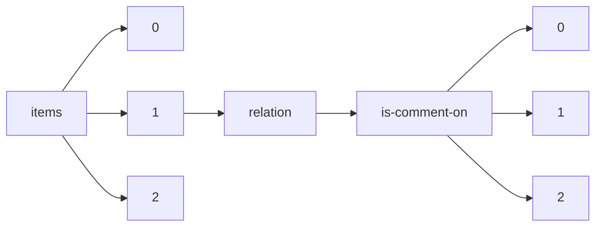

!!! warning "This document is not official Crossref documentation"
# Elements
PATH = items/array/relation/is-comment-on/array(1)  
Occurs 86 143 times  
{ .annotate }

1. A route to an element, for example:  
   The route "items/array/relation/is-comment-on/array" corresponds to navigating through the JSON indices as  
   ["items"][0]["relation"]["is-comment-on"][0]  

## Asserted-by
See more information: [items/array/relation/is-comment-on/array/asserted-by](asserted-by/index.md)  
Occurs 86 143 timess  
Unique values: 2  

| **Row** | **Value** `String` | **Count** `Int64` |
|--------:|----------------------:|---------------------:|
| **1**   | object                | 52 710               |
| **2**   | subject               | 33 433               |

## Id
See more information: [items/array/relation/is-comment-on/array/id](id/index.md)  
Occurs 86 143 timess  
Unique values: > 999  

!!! note "Due to current limitations, only the first 1,000 unique values are counted."

| **Row** | **Value** `String` | **Count** `Int64` |
|--------:|----------------------:|---------------------:|
| **1**   | 10.5194/se-2015-134   | 24                   |
| **2**   | 10.5194/essd-2019-4   | 20                   |
| **3**   | 10.1075/lab.3.3.01ogr | 17                   |
| **4**   | 10.1075/lab.5.4.01phi | 17                   |
| **5**   | 10.5194/esd-2018-36   | 15                   |
| **6**   | 10.5194/hess-2019-216 | 14                   |
| **7**   | 10.1075/lab.1.1.01sor | 14                   |
| **8**   | 10.5194/wes-2018-46   | 14                   |
| **9**   | 10.5194/soil-2018-5   | 14                   |
| **10**  | 10.5194/hess-2017-497 | 14                   |
| ... | ... | ... |

## Id-type
See more information: [items/array/relation/is-comment-on/array/id-type](id-type/index.md)  
Occurs 86 143 timess  
Unique values: 8  

| **Row** | **Value** `String` | **Count** `Int64` |
|--------:|----------------------:|---------------------:|
| **1**   | doi                   | 85 668               |
| **2**   | ecli                  | 417                  |
| **3**   | uri                   | 41                   |
| **4**   | arxiv                 | 8                    |
| **5**   | issn                  | 4                    |
| **6**   | pmid                  | 3                    |
| **7**   | isbn                  | 1                    |
| **8**   | uuid                  | 1                    |

