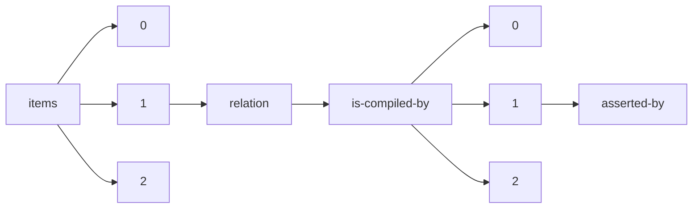

!!! warning "This document is not official Crossref documentation"
# Asserted-by
PATH = items/array/relation/is-compiled-by/array/asserted-by(1)  
Occurs 3 times  
Unique values: 1  
{ .annotate }

1. A route to an element, for example:  
   The route "items/array/relation/is-compiled-by/array/asserted-by" corresponds to navigating through the JSON indices as  
   ["items"][0]["relation"]["is-compiled-by"][0]["asserted-by"]  

| **Row** | **Value** `String` | **Count** `Int64` |
|--------:|----------------------:|---------------------:|
| **1**   | object                | 3                    |

