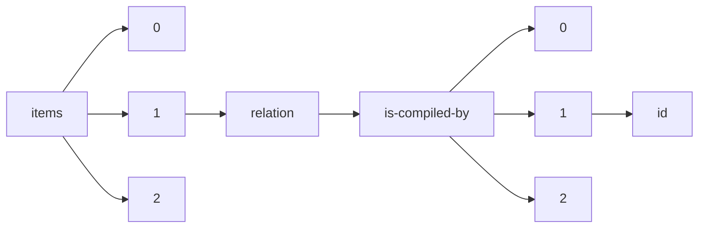

!!! warning "This document is not official Crossref documentation"
# Id
PATH = items/array/relation/is-compiled-by/array/id(1)  
Occurs 3 times  
Unique values: 3  
{ .annotate }

1. A route to an element, for example:  
   The route "items/array/relation/is-compiled-by/array/id" corresponds to navigating through the JSON indices as  
   ["items"][0]["relation"]["is-compiled-by"][0]["id"]  

| **Row** | **Value** `String`  | **Count** `Int64` |
|--------:|-----------------------:|---------------------:|
| **1**   | 10.29053/pslr.v4i.2150 | 1                    |
| **2**   | 10.29053/pslr.v4i.2158 | 1                    |
| **3**   | 10.29053/pslr.v4i.2154 | 1                    |

