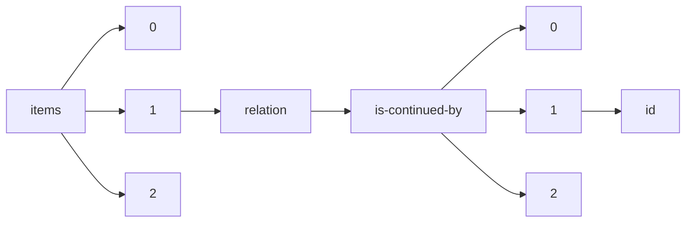

!!! warning "This document is not official Crossref documentation"
# Id
PATH = items/array/relation/is-continued-by/array/id(1)  
Occurs 43 times  
Unique values: 42  
{ .annotate }

1. A route to an element, for example:  
   The route "items/array/relation/is-continued-by/array/id" corresponds to navigating through the JSON indices as  
   ["items"][0]["relation"]["is-continued-by"][0]["id"]  

| **Row** | **Value** `String`            | **Count** `Int64` |
|--------:|---------------------------------:|---------------------:|
| **1**   | 10.4467/23005920SPL.22.003.16380 | 2                    |
| **2**   | 10.19108/KOERS.83.1.2371         | 1                    |
| **3**   | 10.1159/000512536                | 1                    |
| **4**   | 10.1159/000496371                | 1                    |
| **5**   | 10.47109/0102250105              | 1                    |
| **6**   | 10.1159/000492606                | 1                    |
| **7**   | 10.52750/274958                  | 1                    |
| **8**   | 10.6028/NIST.AI.100-1            | 1                    |
| **9**   | 10.1159/000492975                | 1                    |
| **10**  | 10.4467/2543702XSHS.19.002.11008 | 1                    |
| **11**  | 10.19108/KOERS.84.1.2452         | 1                    |
| **12**  | 10.52750/894475                  | 1                    |
| **13**  | 10.52750/512352                  | 1                    |
| **14**  | 10.1159/000511941                | 1                    |
| **15**  | 10.52750/798934                  | 1                    |
| **16**  | 10.1159/000488305                | 1                    |
| **17**  | 10.1159/000494119                | 1                    |
| **18**  | 10.33619/2414-2948/51/17         | 1                    |
| **19**  | 10.1159/000488922                | 1                    |
| **20**  | 10.4467/2543702XSHS.18.020.9340  | 1                    |
| **21**  | 10.1159/000485018                | 1                    |
| **22**  | 10.4467/12332135KRA.18.004.14391 | 1                    |
| **23**  | 10.4467/2543702XSHS.19.001.11007 | 1                    |
| **24**  | 10.1159/000501707                | 1                    |
| **25**  | 10.19108/KOERS.86.1.2518         | 1                    |
| **26**  | 10.33619/2414-2948/52/47         | 1                    |
| **27**  | 10.4467/2543702XSHS.17.021.7722  | 1                    |
| **28**  | 10.33619/2414-2948/56/49         | 1                    |
| **29**  | 10.4467/2543702XSHS.18.001.9321  | 1                    |
| **30**  | 10.4467/2543702XSHS.18.019.9339  | 1                    |
| **31**  | 10.4467/2543702XSHS.17.001.7702  | 1                    |
| **32**  | 10.1159/000502709                | 1                    |
| **33**  | 10.52750/743281                  | 1                    |
| **34**  | 10.32013/vGVkUKI                 | 1                    |
| **35**  | 10.4467/2543702XSHS.18.002.9322  | 1                    |
| **36**  | 10.47109/0102230106              | 1                    |
| **37**  | 10.4467/20834624SL.22.014.16684  | 1                    |
| **38**  | 10.19108/KOERS.83.1.2370         | 1                    |
| **39**  | 10.1159/000496414                | 1                    |
| **40**  | 10.4467/20834624SL.22.016.16686  | 1                    |
| **41**  | 10.4467/12332135KRA.15.007.15908 | 1                    |
| **42**  | 10.4467/2543702XSHS.17.020.7721  | 1                    |

