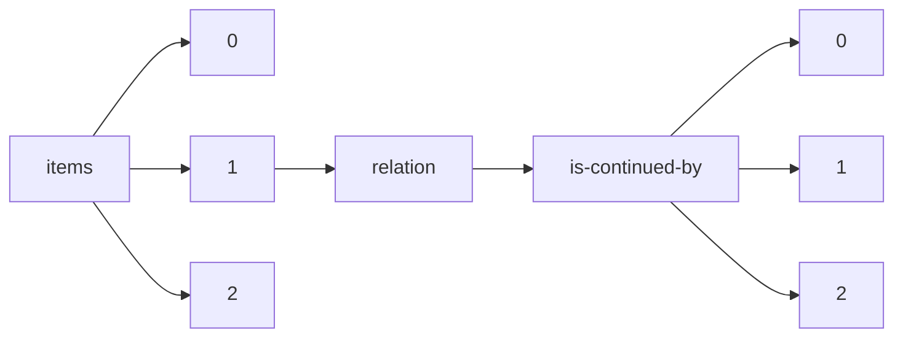

!!! warning "This document is not official Crossref documentation"
# Elements
PATH = items/array/relation/is-continued-by/array(1)  
Occurs 43 times  
{ .annotate }

1. A route to an element, for example:  
   The route "items/array/relation/is-continued-by/array" corresponds to navigating through the JSON indices as  
   ["items"][0]["relation"]["is-continued-by"][0]  

## Asserted-by
See more information: [items/array/relation/is-continued-by/array/asserted-by](asserted-by/index.md)  
Occurs 43 timess  
Unique values: 2  

| **Row** | **Value** `String` | **Count** `Int64` |
|--------:|----------------------:|---------------------:|
| **1**   | object                | 27                   |
| **2**   | subject               | 16                   |

## Id
See more information: [items/array/relation/is-continued-by/array/id](id/index.md)  
Occurs 43 timess  
Unique values: 42  

| **Row** | **Value** `String`            | **Count** `Int64` |
|--------:|---------------------------------:|---------------------:|
| **1**   | 10.4467/23005920SPL.22.003.16380 | 2                    |
| **2**   | 10.19108/KOERS.83.1.2371         | 1                    |
| **3**   | 10.1159/000512536                | 1                    |
| **4**   | 10.1159/000496371                | 1                    |
| **5**   | 10.47109/0102250105              | 1                    |
| **6**   | 10.1159/000492606                | 1                    |
| **7**   | 10.52750/274958                  | 1                    |
| **8**   | 10.6028/NIST.AI.100-1            | 1                    |
| **9**   | 10.1159/000492975                | 1                    |
| **10**  | 10.4467/2543702XSHS.19.002.11008 | 1                    |
| ... | ... | ... |

## Id-type
See more information: [items/array/relation/is-continued-by/array/id-type](id-type/index.md)  
Occurs 43 timess  
Unique values: 1  

| **Row** | **Value** `String` | **Count** `Int64` |
|--------:|----------------------:|---------------------:|
| **1**   | doi                   | 43                   |

