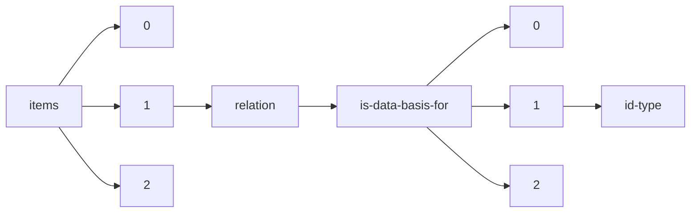

!!! warning "This document is not official Crossref documentation"
# Id-type
PATH = items/array/relation/is-data-basis-for/array/id-type(1)  
Occurs 325 times  
Unique values: 2  
{ .annotate }

1. A route to an element, for example:  
   The route "items/array/relation/is-data-basis-for/array/id-type" corresponds to navigating through the JSON indices as  
   ["items"][0]["relation"]["is-data-basis-for"][0]["id-type"]  

| **Row** | **Value** `String` | **Count** `Int64` |
|--------:|----------------------:|---------------------:|
| **1**   | doi                   | 317                  |
| **2**   | uri                   | 8                    |

