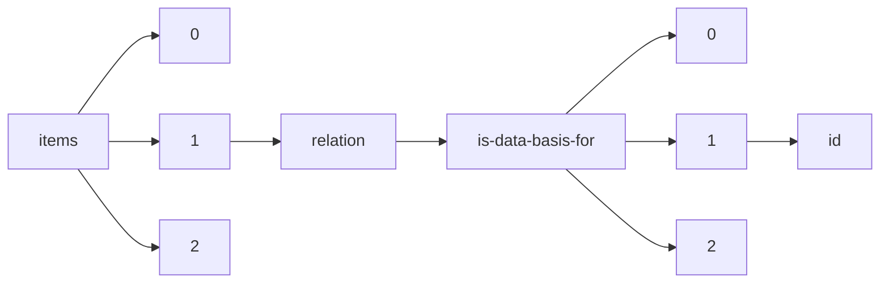

!!! warning "This document is not official Crossref documentation"
# Id
PATH = items/array/relation/is-data-basis-for/array/id(1)  
Occurs 325 times  
Unique values: 175  
{ .annotate }

1. A route to an element, for example:  
   The route "items/array/relation/is-data-basis-for/array/id" corresponds to navigating through the JSON indices as  
   ["items"][0]["relation"]["is-data-basis-for"][0]["id"]  

| **Row** | **Value** `String`                                        | **Count** `Int64` |
|--------:|-------------------------------------------------------------:|---------------------:|
| **1**   | 10.3389/fmicb.2019.01864                                     | 13                   |
| **2**   | 10.3354/meps12907                                            | 10                   |
| **3**   | 10.1016/j.gca.2018.05.023                                    | 8                    |
| **4**   | 10.1038/s42003-018-0183-7                                    | 7                    |
| **5**   | 10.1007/s00227-019-3606-1                                    | 5                    |
| **6**   | 10.1371/journal.pone.0162098                                 | 5                    |
| **7**   | 10.3354/meps11836                                            | 5                    |
| **8**   | 10.1002/lno.10797                                            | 4                    |
| **9**   | 10.1111/ele.13378                                            | 4                    |
| **10**  | 10.1093/beheco/arx189                                        | 4                    |
| **11**  | 10.1007/s00227-018-3324-0                                    | 4                    |
| **12**  | https://www.mass.gov/files/documents/2016/08/wh/rwhale02.pdf | 4                    |
| **13**  | 10.5194/bg-12-4979-2015                                      | 4                    |
| **14**  | 10.1002/ece3.3739                                            | 4                    |
| **15**  | 10.1007/s00227-018-3459-z                                    | 4                    |
| **16**  | 10.4319/lo.2014.59.4.1256                                    | 4                    |
| **17**  | 10.1029/2018GB006057                                         | 4                    |
| **18**  | 10.1002/ecy.2173                                             | 4                    |
| **19**  | 10.1029/2019GC008440                                         | 4                    |
| **20**  | 10.3389/fenvs.2020.00011                                     | 4                    |
| **21**  | 10.1016/j.jembe.2017.01.003                                  | 4                    |
| **22**  | 10.1155/2016/2690329                                         | 3                    |
| **23**  | 10.1002/ecy.1449                                             | 3                    |
| **24**  | 10.1002/lno.10756                                            | 3                    |
| **25**  | 10.1007/s00227-019-3540-2                                    | 3                    |
| **26**  | 10.1007/s00338-018-1721-y                                    | 3                    |
| **27**  | 10.3390/md13052834                                           | 3                    |
| **28**  | 10.1007/s00227-017-3243-5                                    | 3                    |
| **29**  | 10.1007/s00338-016-1483-3                                    | 3                    |
| **30**  | 10.1242/jeb.200899                                           | 3                    |
| **31**  | 10.3354/meps10594                                            | 3                    |
| **32**  | 10.1002/lno.10968                                            | 3                    |
| **33**  | 10.1111/oik.04471                                            | 3                    |
| **34**  | 10.1073/pnas.1707525114                                      | 2                    |
| **35**  | 10.1002/lno.10347                                            | 2                    |
| **36**  | 10.1016/j.dsr2.2014.11.019                                   | 2                    |
| **37**  | 10.5194/bg-2019-394                                          | 2                    |
| **38**  | 10.5194/bg-2018-525                                          | 2                    |
| **39**  | 10.1016/j.jembe.2009.07.013                                  | 2                    |
| **40**  | 10.1093/plankt/fbu077                                        | 2                    |
| **41**  | 10.1111/gcb.13838                                            | 2                    |
| **42**  | 10.1016/j.dsr2.2004.09.017                                   | 2                    |
| **43**  | 10.1016/j.dsr.2014.04.008                                    | 2                    |
| **44**  | 10.1029/2018PA003469                                         | 2                    |
| **45**  | 10.3389/fmars.2017.00430                                     | 2                    |
| **46**  | 10.1371/journal.pone.0193405                                 | 2                    |
| **47**  | 10.1002/eap.1940                                             | 2                    |
| **48**  | 10.1007/s00248-017-1096-6                                    | 2                    |
| **49**  | 10.1007/s00227-016-2921-z                                    | 2                    |
| **50**  | 10.1007/s00338-018-1731-9                                    | 2                    |
| **51**  | http://fishbull.noaa.gov/1021/brodeur.pdf                    | 2                    |
| **52**  | 10.1007/s00338-019-01803-x                                   | 2                    |
| **53**  | 10.1016/j.dsr.2013.05.012                                    | 2                    |
| **54**  | 10.1098/rspb.2017.1790                                       | 2                    |
| **55**  | 10.1111/geb.12940                                            | 2                    |
| **56**  | 10.1073/pnas.1513754112                                      | 2                    |
| **57**  | 10.1093/plankt/fbp136                                        | 2                    |
| **58**  | 10.1016/j.dsr2.2014.11.020                                   | 2                    |
| **59**  | https://cedar.wwu.edu/wwuet/694                              | 2                    |
| **60**  | 10.1371/journal.pone.0050015                                 | 2                    |
| **61**  | 10.1002/lno.10762                                            | 2                    |
| **62**  | 10.1111/gcb.14784                                            | 2                    |
| **63**  | 10.1126/sciadv.aau5180                                       | 2                    |
| **64**  | 10.1016/j.marchem.2018.08.005                                | 2                    |
| **65**  | 10.1016/j.dsr2.2004.07.025                                   | 2                    |
| **66**  | NTP-DATA-002-01006-0035-0000-7                               | 2                    |
| **67**  | 10.3354/dao02487                                             | 2                    |
| **68**  | 10.1007/s12237-012-9531-x                                    | 2                    |
| **69**  | 10.4319/lom.2014.12.840                                      | 2                    |
| **70**  | 10.1016/j.gca.2017.10.006                                    | 2                    |
| **71**  | 10.1371/journal.pone.0177083                                 | 2                    |
| **72**  | 10.1073/pnas.1700353114                                      | 1                    |
| **73**  | 10.1007/s12237-017-0345-8                                    | 1                    |
| **74**  | 10.1002/2014GL060555                                         | 1                    |
| **75**  | 10.1111/ivb.12201                                            | 1                    |
| **76**  | 10.1016/j.jembe.2017.12.002                                  | 1                    |
| **77**  | 10.1002/ecy.1918                                             | 1                    |
| **78**  | 10.38211/joarps.2020.1.1.3                                   | 1                    |
| **79**  | 10.1002/2016GC006421                                         | 1                    |
| **80**  | 10.1016/j.dsr.2005.12.018                                    | 1                    |
| **81**  | 10.1002/2017JC013331                                         | 1                    |
| **82**  | 10.1016/j.aquaculture.2017.10.024                            | 1                    |
| **83**  | 10.6084/m9.figshare.6441818.v1                               | 1                    |
| **84**  | 10.12952/journal.elementa.000140                             | 1                    |
| **85**  | 10.1093/plankt/fbs029                                        | 1                    |
| **86**  | 10.2116/bunsekikagaku.61.287                                 | 1                    |
| **87**  | 10.38211/joarps.2020.1.1.2                                   | 1                    |
| **88**  | 10.1016/j.marchem.2011.07.005                                | 1                    |
| **89**  | 10.1093/femsec/fiw050                                        | 1                    |
| **90**  | 10.12952/journal.elementa.000043                             | 1                    |
| **91**  | 10.1029/2019GL083719                                         | 1                    |
| **92**  | NTP-DATA-002-02655-0003-0000-3                               | 1                    |
| **93**  | 10.1016/j.jembe.2009.07.012                                  | 1                    |
| **94**  | 10.1016/j.marchem.2019.02.006                                | 1                    |
| **95**  | 10.1016/j.dsr2.2018.07.014                                   | 1                    |
| **96**  | 10.1242/jeb.118182                                           | 1                    |
| **97**  | 10.1111/mec.12782                                            | 1                    |
| **98**  | 10.1007/s10592-016-0895-5                                    | 1                    |
| **99**  | 10.38211/joarps.2020.1.1.4                                   | 1                    |
| **100** | 10.1002/lol2.10056                                           | 1                    |
| **101** | 10.1002/ece3.4959                                            | 1                    |
| **102** | 10.3354/meps13174                                            | 1                    |
| **103** | 10.1007/s00227-018-3291-5                                    | 1                    |
| **104** | 10.1111/eva.12592                                            | 1                    |
| **105** | 10.1016/j.geoderma.2018.08.020                               | 1                    |
| **106** | 10.1002/2017GL075361                                         | 1                    |
| **107** | 10.3389/fmars.2018.00380                                     | 1                    |
| **108** | 10.1002/ecy.1912                                             | 1                    |
| **109** | 10.1016/j.jembe.2009.07.014                                  | 1                    |
| **110** | 10.3354/meps10768                                            | 1                    |
| **111** | 10.1002/2017JC013264                                         | 1                    |
| **112** | 10.1002/lol2.10074                                           | 1                    |
| **113** | 10.1038/sdata.2014.48                                        | 1                    |
| **114** | 10.1002/lol2.10092                                           | 1                    |
| **115** | 10.1016/j.marchem.2018.06.002                                | 1                    |
| **116** | 10.1073/pnas.1312317110                                      | 1                    |
| **117** | 10.1186/s40850-018-0034-5                                    | 1                    |
| **118** | 10.1038/s41467-019-09238-2                                   | 1                    |
| **119** | 10.1111/j.1365-2486.2012.02668.x                             | 1                    |
| **120** | 10.1073/pnas.1307701110                                      | 1                    |
| **121** | 10.1007/s00338-018-1710-1                                    | 1                    |
| **122** | 10.1093/icesjms/fsx128                                       | 1                    |
| **123** | 10.1126/science.1255641                                      | 1                    |
| **124** | 10.1073/pnas.1804558115                                      | 1                    |
| **125** | 10.1007/s00338-010-0632-3                                    | 1                    |
| **126** | 10.1007/s00227-018-3286-2                                    | 1                    |
| **127** | 10.1002/lno.10063                                            | 1                    |
| **128** | 10.1007/s00227-014-2507-6                                    | 1                    |
| **129** | 10.1007/s10533-018-0438-x                                    | 1                    |
| **130** | 10.1890/14-0941.1                                            | 1                    |
| **131** | 10.1038/s41564-019-0502-x                                    | 1                    |
| **132** | 10.5194/acp-16-13389-2016                                    | 1                    |
| **133** | 10.1093/icesjms/fsy140                                       | 1                    |
| **134** | 10.38211/joarps.2020.1.1.5                                   | 1                    |
| **135** | 10.1130/G37822.1                                             | 1                    |
| **136** | 10.1098/rspb.2017.2718                                       | 1                    |
| **137** | 10.1038/s41598-018-23270-0                                   | 1                    |
| **138** | NTP-DATA-002-02657-0006-0000-8                               | 1                    |
| **139** | 10.1029/2018JG004384                                         | 1                    |
| **140** | 10.1002/lno.10062                                            | 1                    |
| **141** | 10.7717/peerj.4119                                           | 1                    |
| **142** | 10.1002/ecy.2992                                             | 1                    |
| **143** | 10.1007/s00338-015-1269-z                                    | 1                    |
| **144** | 10.1111/1462-2920.14107                                      | 1                    |
| **145** | 10.1016/j.dsr2.2018.02.011                                   | 1                    |
| **146** | 10.1038/s41467-017-01229-5                                   | 1                    |
| **147** | 10.1016/j.gca.2020.02.013                                    | 1                    |
| **148** | 10.1111/mec.12274                                            | 1                    |
| **149** | 10.1002/lno.10443                                            | 1                    |
| **150** | NTP-DATA-002-02654-0003-0000-2                               | 1                    |
| **151** | 10.1016/j.dsr2.2007.11.015                                   | 1                    |
| **152** | NTP-DATA-RR-8                                                | 1                    |
| **153** | 10.1002/lno.10547                                            | 1                    |
| **154** | NTP-DATA-002-03267-0002-0000-2                               | 1                    |
| **155** | 10.1016/j.protis.2018.10.002                                 | 1                    |
| **156** | NTP-DATA-002-02656-0003-0000-4                               | 1                    |
| **157** | NTP-DATA-002-02652-0004-0000-1                               | 1                    |
| **158** | 10.32628/CSEIT183810                                         | 1                    |
| **159** | 10.1002/lno.10042                                            | 1                    |
| **160** | 10.1021/acs.est.7b05462                                      | 1                    |
| **161** | 10.5194/bg-13-4645-2016                                      | 1                    |
| **162** | 10.1371/journal.pone.0016814                                 | 1                    |
| **163** | 10.3389/fmicb.2019.02397                                     | 1                    |
| **164** | 10.1016/j.ympev.2018.02.027                                  | 1                    |
| **165** | 10.12952/journal.elementa.000071                             | 1                    |
| **166** | NTP-DATA-002-01134-0003-0000-4                               | 1                    |
| **167** | 10.1126/sciadv.aax0341                                       | 1                    |
| **168** | 10.1016/j.dsr2.2004.09.027                                   | 1                    |
| **169** | 10.1016/j.marchem.2018.11.010                                | 1                    |
| **170** | 10.3390/d10030069                                            | 1                    |
| **171** | 10.4319/lom.2012.10.653                                      | 1                    |
| **172** | 10.1002/2017JG003779                                         | 1                    |
| **173** | 10.3354/meps11563                                            | 1                    |
| **174** | 10.1002/lno.11193                                            | 1                    |
| **175** | 10.1016/S0967-0645(00)00116-8                                | 1                    |

