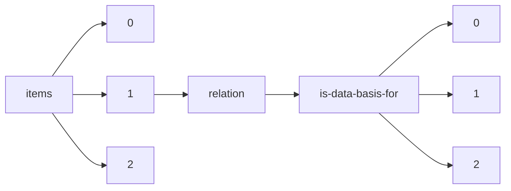

!!! warning "This document is not official Crossref documentation"
# Elements
PATH = items/array/relation/is-data-basis-for/array(1)  
Occurs 325 times  
{ .annotate }

1. A route to an element, for example:  
   The route "items/array/relation/is-data-basis-for/array" corresponds to navigating through the JSON indices as  
   ["items"][0]["relation"]["is-data-basis-for"][0]  

## Asserted-by
See more information: [items/array/relation/is-data-basis-for/array/asserted-by](asserted-by/index.md)  
Occurs 325 timess  
Unique values: 2  

| **Row** | **Value** `String` | **Count** `Int64` |
|--------:|----------------------:|---------------------:|
| **1**   | subject               | 320                  |
| **2**   | object                | 5                    |

## Id
See more information: [items/array/relation/is-data-basis-for/array/id](id/index.md)  
Occurs 325 timess  
Unique values: 175  

| **Row** | **Value** `String`        | **Count** `Int64` |
|--------:|-----------------------------:|---------------------:|
| **1**   | 10.3389/fmicb.2019.01864     | 13                   |
| **2**   | 10.3354/meps12907            | 10                   |
| **3**   | 10.1016/j.gca.2018.05.023    | 8                    |
| **4**   | 10.1038/s42003-018-0183-7    | 7                    |
| **5**   | 10.1007/s00227-019-3606-1    | 5                    |
| **6**   | 10.1371/journal.pone.0162098 | 5                    |
| **7**   | 10.3354/meps11836            | 5                    |
| **8**   | 10.1002/lno.10797            | 4                    |
| **9**   | 10.1111/ele.13378            | 4                    |
| **10**  | 10.1093/beheco/arx189        | 4                    |
| ... | ... | ... |

## Id-type
See more information: [items/array/relation/is-data-basis-for/array/id-type](id-type/index.md)  
Occurs 325 timess  
Unique values: 2  

| **Row** | **Value** `String` | **Count** `Int64` |
|--------:|----------------------:|---------------------:|
| **1**   | doi                   | 317                  |
| **2**   | uri                   | 8                    |

