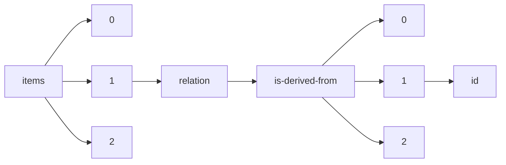

!!! warning "This document is not official Crossref documentation"
# Id
PATH = items/array/relation/is-derived-from/array/id(1)  
Occurs 306 times  
Unique values: 62  
{ .annotate }

1. A route to an element, for example:  
   The route "items/array/relation/is-derived-from/array/id" corresponds to navigating through the JSON indices as  
   ["items"][0]["relation"]["is-derived-from"][0]["id"]  

| **Row** | **Value** `String`                                                    | **Count** `Int64` |
|--------:|-------------------------------------------------------------------------:|---------------------:|
| **1**   |                                                                          | 233                  |
| **2**   | https://www.R-project.org                                                | 4                    |
| **3**   | http://cran.r-project.org/web/packages/car/index.html                    | 4                    |
| **4**   | https://www.ncbi.nlm.nih.gov/pubmed/22930834                             | 4                    |
| **5**   | 10.1371/journal.pone.0061217                                             | 2                    |
| **6**   | MedPharmRes                                                              | 2                    |
| **7**   | 2456-3927                                                                | 2                    |
| **8**   | 10.3389/fmicb.2017.01434                                                 | 1                    |
| **9**   | 10.3334/CDIAC/otg.CO2SYS\_MATLAB\_v1.1                                   | 1                    |
| **10**  | 10.1038/ismej.2015.248                                                   | 1                    |
| **11**  | 10.33264/rpa.201801-04                                                   | 1                    |
| **12**  | 10.1128/AEM.01038-14                                                     | 1                    |
| **13**  | 10.36887/2415-8453-2019-2-3                                              | 1                    |
| **14**  | 10.36887/2415-8453-2019-2-12                                             | 1                    |
| **15**  | 10.36887/2415-8453-2019-2-9                                              | 1                    |
| **16**  | 10.37881/1.613                                                           | 1                    |
| **17**  | 10.36887/2415-8453-2019-2-10                                             | 1                    |
| **18**  | 10.36887/2524-0455-2019-2-4                                              | 1                    |
| **19**  | http://www.rstudio.com/.                                                 | 1                    |
| **20**  | 10.36887/2524-0455-2019-2-10                                             | 1                    |
| **21**  | 10.36887/2415-8453-2019-2-8                                              | 1                    |
| **22**  | 10.1080/01490451.2017.1392649                                            | 1                    |
| **23**  | 10.36887/2524-0455-2019-2-9                                              | 1                    |
| **24**  | 10.25039/tr.015.2018                                                     | 1                    |
| **25**  | 10.36887/2415-8453-2019-2-5                                              | 1                    |
| **26**  | 10.36887/2415-8453-2019-2-4                                              | 1                    |
| **27**  | 10.1038/ismej.2017.187                                                   | 1                    |
| **28**  | 10.25039/CIE.DS.etgmuqt5                                                 | 1                    |
| **29**  | https://CRAN.R-project.org/package=vegan                                 | 1                    |
| **30**  | 10.3389/fmicb.2019.01983                                                 | 1                    |
| **31**  | 10.3389/fmicb.2016.00820                                                 | 1                    |
| **32**  | https://cran.r-project.org/web/packages/secr/index.html                  | 1                    |
| **33**  | 10.36887/2415-8453-2019-2-13                                             | 1                    |
| **34**  | 10.3389/fmicb.2018.01249                                                 | 1                    |
| **35**  | 10.36887/2415-8453-2019-2-14                                             | 1                    |
| **36**  | https://github.com/BCODMO/V4\_tagsequencing\_18Sdiversity\_q1/tree/v2    | 1                    |
| **37**  | 10.3389/fmicb.2015.01470                                                 | 1                    |
| **38**  | http://calib.org                                                         | 1                    |
| **39**  | 10.36887/2524-0455-2019-2-12                                             | 1                    |
| **40**  | 10.25039/CIE.DS.wi5idbqu                                                 | 1                    |
| **41**  | 10.25039/CIE.DS.xvudnb9b                                                 | 1                    |
| **42**  | https://cran.r-project.org/src/contrib/Archive/vegan/vegan\_2.5-4.tar.gz | 1                    |
| **43**  | http://CRAN.R-project.org/package=vegan                                  | 1                    |
| **44**  | 10.36887/2524-0455-2019-2-3                                              | 1                    |
| **45**  | 10.36887/2524-0455-2019-2-11                                             | 1                    |
| **46**  | 10.36887/2524-0455-2019-2-2                                              | 1                    |
| **47**  | 10.36887/2524-0455-2019-2-5                                              | 1                    |
| **48**  | 10.36887/2524-0455-2019-2-6                                              | 1                    |
| **49**  | 10.36887/2524-0455-2019-2-7                                              | 1                    |
| **50**  | https://cran.r-project.org/bin/windows/base/old/3.3.0/                   | 1                    |
| **51**  | http://www.cimcett.es/es/                                                | 1                    |
| **52**  | 10.1038/srep22541                                                        | 1                    |
| **53**  | 10.36887/2415-8453-2019-2-1                                              | 1                    |
| **54**  | 10.36887/2415-8453-2019-2-11                                             | 1                    |
| **55**  | 10.46647/ijetms.2023.v07i01.018                                          | 1                    |
| **56**  | 10.36887/2524-0455-2019-2-8                                              | 1                    |
| **57**  | 10.36887/2524-0455-2019-2-1                                              | 1                    |
| **58**  | 10.37881/1.611                                                           | 1                    |
| **59**  | 10.36887/2415-8453-2019-2-6                                              | 1                    |
| **60**  | 10.1080/01490451.2016.1155001                                            | 1                    |
| **61**  | 2690-8220                                                                | 1                    |
| **62**  | http://v9docs.flowjo.com/html/version.html#6.4.7                         | 1                    |

