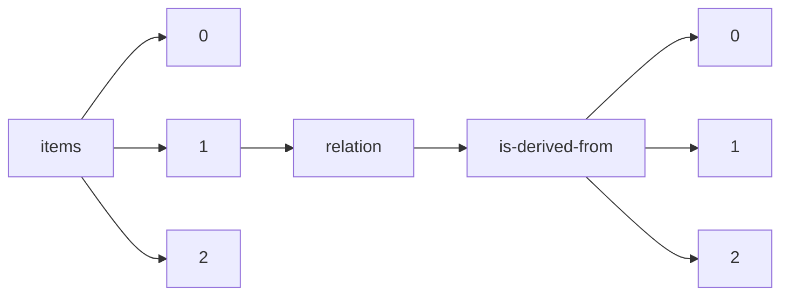

!!! warning "This document is not official Crossref documentation"
# Elements
PATH = items/array/relation/is-derived-from/array(1)  
Occurs 306 times  
{ .annotate }

1. A route to an element, for example:  
   The route "items/array/relation/is-derived-from/array" corresponds to navigating through the JSON indices as  
   ["items"][0]["relation"]["is-derived-from"][0]  

## Asserted-by
See more information: [items/array/relation/is-derived-from/array/asserted-by](asserted-by/index.md)  
Occurs 306 timess  
Unique values: 1  

| **Row** | **Value** `String` | **Count** `Int64` |
|--------:|----------------------:|---------------------:|
| **1**   | subject               | 306                  |

## Id
See more information: [items/array/relation/is-derived-from/array/id](id/index.md)  
Occurs 306 timess  
Unique values: 62  

| **Row** | **Value** `String`                                 | **Count** `Int64` |
|--------:|------------------------------------------------------:|---------------------:|
| **1**   |                                                       | 233                  |
| **2**   | https://www.R-project.org                             | 4                    |
| **3**   | http://cran.r-project.org/web/packages/car/index.html | 4                    |
| **4**   | https://www.ncbi.nlm.nih.gov/pubmed/22930834          | 4                    |
| **5**   | 10.1371/journal.pone.0061217                          | 2                    |
| **6**   | MedPharmRes                                           | 2                    |
| **7**   | 2456-3927                                             | 2                    |
| **8**   | 10.3389/fmicb.2017.01434                              | 1                    |
| **9**   | 10.3334/CDIAC/otg.CO2SYS\_MATLAB\_v1.1                | 1                    |
| **10**  | 10.1038/ismej.2015.248                                | 1                    |
| ... | ... | ... |

## Id-type
See more information: [items/array/relation/is-derived-from/array/id-type](id-type/index.md)  
Occurs 306 timess  
Unique values: 5  

| **Row** | **Value** `String` | **Count** `Int64` |
|--------:|----------------------:|---------------------:|
| **1**   | issn                  | 235                  |
| **2**   | doi                   | 46                   |
| **3**   | uri                   | 22                   |
| **4**   | other                 | 2                    |
| **5**   | ecli                  | 1                    |

