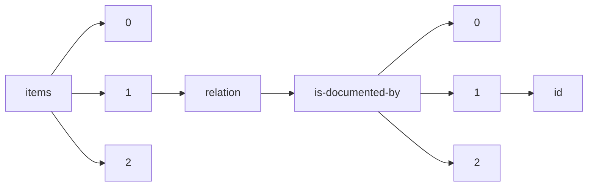

!!! warning "This document is not official Crossref documentation"
# Id
PATH = items/array/relation/is-documented-by/array/id(1)  
Occurs 1 655 times  
Unique values: 847  
{ .annotate }

1. A route to an element, for example:  
   The route "items/array/relation/is-documented-by/array/id" corresponds to navigating through the JSON indices as  
   ["items"][0]["relation"]["is-documented-by"][0]["id"]  

| **Row** | **Value** `String`                                                                                | **Count** `Int64` |
|--------:|-----------------------------------------------------------------------------------------------------:|---------------------:|
| **1**   | https://www.nodc.noaa.gov/ocads/oceans/Handbook\_2007.html                                           | 28                   |
| **2**   | 10.1021/ac010088e                                                                                    | 12                   |
| **3**   | 10.1021/es200665d                                                                                    | 12                   |
| **4**   | 10.1021/ac020113w                                                                                    | 11                   |
| **5**   | 10.1016/0967-0637(93)90048-8                                                                         | 10                   |
| **6**   | 10.1007/BF00428135                                                                                   | 10                   |
| **7**   | 10.1007/BF00541648                                                                                   | 9                    |
| **8**   | 10.4319/lo.1969.14.3.0454                                                                            | 8                    |
| **9**   | 10.1111/j.1523-1739.2009.01428.x                                                                     | 8                    |
| **10**  | 10.1002/rcm.7570                                                                                     | 8                    |
| **11**  | 10.4319/lom.2005.3.361                                                                               | 8                    |
| **12**  | 10.1130/G36147.1                                                                                     | 8                    |
| **13**  | 10.1016/0198-0149(87)90021-5                                                                         | 7                    |
| **14**  | 10.4319/lo.1992.37.5.1113                                                                            | 7                    |
| **15**  | 10.1111/j.1461-0248.2011.01721.x                                                                     | 7                    |
| **16**  | 10.4319/lo.1973.18.6.0897                                                                            | 7                    |
| **17**  | 10.1002/2015JG002970                                                                                 | 7                    |
| **18**  | 10.1029/2004GB002320                                                                                 | 7                    |
| **19**  | 10.1007/s10533-015-0111-6                                                                            | 7                    |
| **20**  | 10.1007/s00254-008-1585-5                                                                            | 7                    |
| **21**  | 10.4319/lom.2012.10.425                                                                              | 7                    |
| **22**  | 10.1093/icesjms/30.1.3                                                                               | 7                    |
| **23**  | 10.1016/j.epsl.2009.06.029                                                                           | 6                    |
| **24**  | 10.1016/0012-821X(95)00063-I                                                                         | 6                    |
| **25**  | 10.1126/sciadv.1500328                                                                               | 6                    |
| **26**  | 10.4319/lo.2000.45.3.0569                                                                            | 6                    |
| **27**  | 10.4319/lo.1995.40.5.1011                                                                            | 6                    |
| **28**  | 10.1357/002224008787157449                                                                           | 6                    |
| **29**  | 10.1016/j.gca.2015.12.022                                                                            | 6                    |
| **30**  | 10.1007/s00244-008-9204-8                                                                            | 6                    |
| **31**  | 10.4319/lo.2002.47.2.0367                                                                            | 6                    |
| **32**  | 10.1021/ac00199a007                                                                                  | 6                    |
| **33**  | 10.1016/j.marchem.2011.03.004                                                                        | 6                    |
| **34**  | 10.1016/j.marchem.2007.03.002                                                                        | 6                    |
| **35**  | 10.1371/journal.pone.0074251                                                                         | 6                    |
| **36**  | 10.1016/j.marchem.2005.10.023                                                                        | 6                    |
| **37**  | 0080302874                                                                                           | 6                    |
| **38**  | 10.4319/lo.2011.56.5.1781                                                                            | 6                    |
| **39**  | 10.1016/j.dsr2.2010.02.013                                                                           | 6                    |
| **40**  | 10.1007/s10530-015-1026-9                                                                            | 6                    |
| **41**  | 10.1016/S0003-2670(00)01196-X                                                                        | 6                    |
| **42**  | 10.4319/lo.1980.25.5.0943                                                                            | 5                    |
| **43**  | 10.4319/lo.1994.39.8.1985                                                                            | 5                    |
| **44**  | 10.3334/CDIAC/otg.CO2SYS\_XLS\_CDIAC105a                                                             | 5                    |
| **45**  | 10.1016/0043-1354(78)90060-X                                                                         | 5                    |
| **46**  | 10.1128/AEM.01541-09                                                                                 | 5                    |
| **47**  | 10.3354/meps11836                                                                                    | 5                    |
| **48**  | 0-295-96523-1                                                                                        | 5                    |
| **49**  | 10.2172/639712                                                                                       | 5                    |
| **50**  | 10.4319/lo.2012.57.4.1011                                                                            | 5                    |
| **51**  | 10.1021/ac1028984                                                                                    | 5                    |
| **52**  | 10.1016/j.marchem.2013.06.001                                                                        | 5                    |
| **53**  | 10.1093/nar/gks1219                                                                                  | 5                    |
| **54**  | 10.1016/j.csr.2017.06.007                                                                            | 5                    |
| **55**  | 10.2307/3543338                                                                                      | 5                    |
| **56**  | 11329/249                                                                                            | 5                    |
| **57**  | 10.4319/lo.2013.58.1.0354                                                                            | 5                    |
| **58**  | 10.1126/science.1190182                                                                              | 4                    |
| **59**  | 10.1128/AEM.01457-10                                                                                 | 4                    |
| **60**  | 10.3354/meps11670                                                                                    | 4                    |
| **61**  | http://CRAN.R-project.org/package=seacarb                                                            | 4                    |
| **62**  | 10.1111/j.1462-2920.2010.02350.x                                                                     | 4                    |
| **63**  | 10.1002/ecy.1449                                                                                     | 4                    |
| **64**  | https://cran.r-project.org/web/packages/seacarb/index.html                                           | 4                    |
| **65**  | 10.1016/j.aca.2017.05.008                                                                            | 4                    |
| **66**  | 10.2343/geochemj.38.613                                                                              | 4                    |
| **67**  | 10.1093/plankt/7.5.715                                                                               | 4                    |
| **68**  | http://jeb.biologists.org/content/176/1/207                                                          | 4                    |
| **69**  | 10.3354/ame01753                                                                                     | 4                    |
| **70**  | 10.1007/BF00392945                                                                                   | 4                    |
| **71**  | 10.1073/pnas.1301589110                                                                              | 4                    |
| **72**  | 10.4319/lo.1975.20.3.0493                                                                            | 4                    |
| **73**  | 10.1016/j.trac.2011.03.006                                                                           | 4                    |
| **74**  | 10.1016/0304-4203(93)90218-D                                                                         | 4                    |
| **75**  | 10.1139/f99-128                                                                                      | 4                    |
| **76**  | 10.1002/ecy.2173                                                                                     | 4                    |
| **77**  | 10.1016/j.aca.2010.03.027                                                                            | 4                    |
| **78**  | 10.5281/zenodo.57855                                                                                 | 4                    |
| **79**  | 10.1016/j.marchem.2007.07.003                                                                        | 4                    |
| **80**  | 10.1038/ngeo2387                                                                                     | 4                    |
| **81**  | 10.2204/iodp.proc.336.109.2012                                                                       | 4                    |
| **82**  | 10.1029/2003PA000996                                                                                 | 4                    |
| **83**  | 10.1002/2013GL058489                                                                                 | 4                    |
| **84**  | 10.1016/j.jembe.2017.01.003                                                                          | 4                    |
| **85**  | 10.1093/icesjms/18.2.117                                                                             | 4                    |
| **86**  | 10.1002/lno.10797                                                                                    | 4                    |
| **87**  | 10.1093/icb/14.1.81                                                                                  | 4                    |
| **88**  | 10.1016/j.marchem.2013.10.002                                                                        | 4                    |
| **89**  | 10.3354/meps11587                                                                                    | 4                    |
| **90**  | https://oceancolor.gsfc.nasa.gov/fsg/hplc/SH2\_TM2005\_212785.pdf                                    | 4                    |
| **91**  | 10.1016/0304-4203(93)90207-5                                                                         | 4                    |
| **92**  | 10.1016/S0304-4203(97)00072-8                                                                        | 4                    |
| **93**  | 10.1073/pnas.0506625102                                                                              | 4                    |
| **94**  | 10.1146/annurev.ecolsys.34.011802.132419                                                             | 4                    |
| **95**  | 0879693096                                                                                           | 4                    |
| **96**  | 10.1357/002224089785076091                                                                           | 4                    |
| **97**  | 10.1016/j.plaphy.2012.02.012                                                                         | 4                    |
| **98**  | 10.1007/s10530-012-0266-1                                                                            | 4                    |
| **99**  | 10.1016/j.marchem.2011.12.001                                                                        | 4                    |
| **100** | 10.1002/2014PA002765                                                                                 | 4                    |
| **101** | 10.1139/m62-029                                                                                      | 4                    |
| **102** | 10.1080/00220973.1993.9943832                                                                        | 4                    |
| **103** | http://www.gso.uri.edu/dcsmith/page3/page19/assets/smithazam92.PDF                                   | 4                    |
| **104** | 10.1016/S0012-821X(97)00068-X                                                                        | 4                    |
| **105** | 10.3391/ai.2009.4.3.5                                                                                | 4                    |
| **106** | 10.1007/BF00300117                                                                                   | 4                    |
| **107** | 10.2307/1443946                                                                                      | 4                    |
| **108** | 10.2307/1938320                                                                                      | 4                    |
| **109** | 10.1007/BF00001415                                                                                   | 4                    |
| **110** | 10.1007/978-3-319-24277-4                                                                            | 3                    |
| **111** | 10.2204/iodp.proc.329.2011                                                                           | 3                    |
| **112** | 10.5194/bg-9-3449-2012                                                                               | 3                    |
| **113** | 10.1021/acs.est.6b05276                                                                              | 3                    |
| **114** | http://www.geotraces.org/index.php/science/intercalibration/322-standards-and-reference-materials    | 3                    |
| **115** | 10.1016/0967-0637(93)90149-W                                                                         | 3                    |
| **116** | 10.1016/S0003-2670(01)00824-8                                                                        | 3                    |
| **117** | 10.1046/j.1529-8817.1999.3520403.x                                                                   | 3                    |
| **118** | 10.1038/nmeth.3869                                                                                   | 3                    |
| **119** | 10.2307/1933661                                                                                      | 3                    |
| **120** | 10.3133/tm1D3                                                                                        | 3                    |
| **121** | 10.1016/0021-9614(90)90074-Z                                                                         | 3                    |
| **122** | 10088/21560                                                                                          | 3                    |
| **123** | 10.1016/0198-0149(89)90152-0                                                                         | 3                    |
| **124** | 10.1016/S0967-0637(99)00085-0                                                                        | 3                    |
| **125** | 10.1029/95JC03139                                                                                    | 3                    |
| **126** | 10.1016/j.dsr.2009.04.001                                                                            | 3                    |
| **127** | 10.1111/1365-2664.12435                                                                              | 3                    |
| **128** | 10.1111/1462-2920.13416                                                                              | 3                    |
| **129** | 10.2307/1942565                                                                                      | 3                    |
| **130** | 10.1002/lno.10756                                                                                    | 3                    |
| **131** | 10.3389/fmars.2014.00078                                                                             | 3                    |
| **132** | 10.4319/lom.2014.12.363                                                                              | 3                    |
| **133** | 10.4319/lo.1992.37.1.0105                                                                            | 3                    |
| **134** | 10.1016/S0967-0645(99)00132-0                                                                        | 3                    |
| **135** | 10.1007/s00338-018-1721-y                                                                            | 3                    |
| **136** | 10.1029/2005EO350003                                                                                 | 3                    |
| **137** | 10.1038/26200                                                                                        | 3                    |
| **138** | 10.4319/lom.2008.6.230                                                                               | 3                    |
| **139** | http://hdl.handle.net/11329/220                                                                      | 3                    |
| **140** | 10.3354/meps051201                                                                                   | 3                    |
| **141** | 10.1016/j.marchem.2010.06.002                                                                        | 3                    |
| **142** | 10.1016/j.margeo.2014.02.009                                                                         | 3                    |
| **143** | 10.1007/BF00007865                                                                                   | 3                    |
| **144** | 10.1021/ac00290a030                                                                                  | 3                    |
| **145** | 10.1016/S0304-4203(03)00072-0                                                                        | 3                    |
| **146** | 10.4319/lo.1980.25.4.0754                                                                            | 3                    |
| **147** | 10.1111/j.1462-2920.2010.02205.x                                                                     | 3                    |
| **148** | 10.1073/pnas.1302701110                                                                              | 3                    |
| **149** | 10.1016/j.nimb.2004.04.015                                                                           | 3                    |
| **150** | 10.1016/0011-7471(66)91102-8                                                                         | 3                    |
| **151** | 10.4319/lo.1991.36.6.1232                                                                            | 3                    |
| **152** | 10.1007/s00338-016-1483-3                                                                            | 3                    |
| **153** | 10.4319/lo.2014.59.3.1081                                                                            | 3                    |
| **154** | 10.1186/s13059-014-0550-8                                                                            | 3                    |
| **155** | 10.1016/B978-0-12-381294-0.00009-2                                                                   | 3                    |
| **156** | 10.4319/lo.2013.58.6.1931                                                                            | 3                    |
| **157** | 10.1002/2016JD024998                                                                                 | 3                    |
| **158** | 9780080302874                                                                                        | 3                    |
| **159** | 10.1038/ismej.2007.118                                                                               | 3                    |
| **160** | 10.1016/j.dsr2.2016.07.004                                                                           | 3                    |
| **161** | 10.2475/ajs.283.7.780                                                                                | 3                    |
| **162** | 10.1016/j.gca.2014.07.032                                                                            | 3                    |
| **163** | 10.1371/journal.pone.0073441                                                                         | 3                    |
| **164** | https://aem.asm.org/content/63/1/186.short                                                           | 3                    |
| **165** | 10.1002/lno.10075                                                                                    | 3                    |
| **166** | 10.4319/lo.1973.18.3.0494                                                                            | 3                    |
| **167** | 10.1016/j.jembe.2018.02.004                                                                          | 3                    |
| **168** | 10.1021/ac071223b                                                                                    | 3                    |
| **169** | 10.1016/S0378-4347(00)00603-4                                                                        | 3                    |
| **170** | 10.1016/j.marchem.2007.06.012                                                                        | 3                    |
| **171** | 10.1016/0011-7471(63)90358-9                                                                         | 3                    |
| **172** | 10.1021/ac800500f                                                                                    | 3                    |
| **173** | 10.1002/lno.10443                                                                                    | 3                    |
| **174** | 10.1016/j.marchem.2005.01.004                                                                        | 3                    |
| **175** | 10.1002/2017JG004186                                                                                 | 3                    |
| **176** | 10.25607/OBP-2                                                                                       | 2                    |
| **177** | 10.1126/science.1241396                                                                              | 2                    |
| **178** | https://www.ingentaconnect.com/contentone/umrsmas/bullmar/1990/00000046/00000001/art000010#          | 2                    |
| **179** | 10.1128/AEM.68.10.5005-5011.2002                                                                     | 2                    |
| **180** | 10.1038/hdy.2012.80                                                                                  | 2                    |
| **181** | 978-0-444-538680                                                                                     | 2                    |
| **182** | 10.1002/lno.10539                                                                                    | 2                    |
| **183** | 10.1016/j.chemgeo.2009.10.010                                                                        | 2                    |
| **184** | 10.1016/j.marchem.2004.06.011                                                                        | 2                    |
| **185** | 10.1007/s00227-010-1550-1                                                                            | 2                    |
| **186** | 10.1016/j.gca.2017.04.001                                                                            | 2                    |
| **187** | 10.1002/lno.10751                                                                                    | 2                    |
| **188** | 10.4319/lom.2013.11.382                                                                              | 2                    |
| **189** | 10.1357/002224010793721433                                                                           | 2                    |
| **190** | http://cc.oulu.fi/\~jarioksa/opetus/metodi/vegantutor.pdf                                            | 2                    |
| **191** | 9780203491751                                                                                        | 2                    |
| **192** | 10.4319/lom.2014.12.530                                                                              | 2                    |
| **193** | 10.17504/protocols.io.xihfkb6                                                                        | 2                    |
| **194** | 10.1093/bioinformatics/btp161                                                                        | 2                    |
| **195** | 10.1007/s00239-008-9069-5                                                                            | 2                    |
| **196** | 10.1029/2010GB003868                                                                                 | 2                    |
| **197** | 10.1111/1462-2920.13023                                                                              | 2                    |
| **198** | 10.1093/bioinformatics/btg412                                                                        | 2                    |
| **199** | 10.4319/lom.2012.10.711                                                                              | 2                    |
| **200** | http://eprints.soton.ac.uk/id/eprint/361194                                                          | 2                    |
| **201** | 10.1073/pnas.1513754112                                                                              | 2                    |
| **202** | 10.1016/j.marchem.2015.02.008                                                                        | 2                    |
| **203** | 10.1093/jhered/esh058                                                                                | 2                    |
| **204** | 10.1016/S0009-2541(00)00198-4                                                                        | 2                    |
| **205** | 10.5194/essd-2-167-2010                                                                              | 2                    |
| **206** | 10.1002/rcm.4307                                                                                     | 2                    |
| **207** | 10.4319/lo.1969.14.5.0799                                                                            | 2                    |
| **208** | 10.1016/0304-4203(95)00022-j                                                                         | 2                    |
| **209** | 10.1111/jpy.12340                                                                                    | 2                    |
| **210** | 10.1016/S0967-0645(00)00077-1                                                                        | 2                    |
| **211** | 10.1002/2016JC011886                                                                                 | 2                    |
| **212** | 10.1016/S0967-0637(02)00126-7                                                                        | 2                    |
| **213** | 10.2136/sssabookser10.c6                                                                             | 2                    |
| **214** | 10.2307/1352779                                                                                      | 2                    |
| **215** | 10.1007/s003380100151                                                                                | 2                    |
| **216** | 10.1128/AEM.02172-06                                                                                 | 2                    |
| **217** | 9780387312781                                                                                        | 2                    |
| **218** | 10.1007/s10126-007-9011-7                                                                            | 2                    |
| **219** | 10.1016/j.gca.2005.04.012                                                                            | 2                    |
| **220** | 10.4319/lom.2009.7.196                                                                               | 2                    |
| **221** | 10.1002/lno.11089                                                                                    | 2                    |
| **222** | 10.1016/0011-7471(74)90074-6                                                                         | 2                    |
| **223** | 10.1016/j.aca.2010.11.052                                                                            | 2                    |
| **224** | 10.1016/0304-4203(95)00062-3                                                                         | 2                    |
| **225** | 10.1890/02-0576                                                                                      | 2                    |
| **226** | 10.1038/nclimate1846                                                                                 | 2                    |
| **227** | 10.1186/gb-2011-12-5-r44                                                                             | 2                    |
| **228** | 10.1029/JC090iC05p08871                                                                              | 2                    |
| **229** | 10.1002/2017JD026872                                                                                 | 2                    |
| **230** | 10.1890/0012-9658(2001)082[1814:HFIASL]2.0.CO;2                                                      | 2                    |
| **231** | 10.2307/4134548                                                                                      | 2                    |
| **232** | 10.1016/S0304-4203(98)00019-X                                                                        | 2                    |
| **233** | 10.3354/meps097271                                                                                   | 2                    |
| **234** | 10.1007/978-3-662-06414-6\_20                                                                        | 2                    |
| **235** | 10.1111/j.1529-8817.2012.01217.x                                                                     | 2                    |
| **236** | 10.1016/0198-0149(89)90092-7                                                                         | 2                    |
| **237** | 10.1111/jpy.12614                                                                                    | 2                    |
| **238** | 10.5194/bg-10-7395-2013                                                                              | 2                    |
| **239** | 10.1007/s10126-002-0076-z                                                                            | 2                    |
| **240** | 10.1029/95RG00262                                                                                    | 2                    |
| **241** | 10.3389/fmicb.2019.01983                                                                             | 2                    |
| **242** | 10.1016/S1936-7961(07)01012-3                                                                        | 2                    |
| **243** | 10.1016/j.cageo.2007.01.005                                                                          | 2                    |
| **244** | 10.4319/lom.2004.2.42                                                                                | 2                    |
| **245** | 10.2307/1540170                                                                                      | 2                    |
| **246** | 10.1007/s11099-008-0019-7                                                                            | 2                    |
| **247** | 10.1007/s00227-016-2921-z                                                                            | 2                    |
| **248** | 10.3389/fmars.2018.00177                                                                             | 2                    |
| **249** | 10.1007/s003380050162                                                                                | 2                    |
| **250** | 10.1111/j.1471-8286.2004.00770.x                                                                     | 2                    |
| **251** | 10.1016/0011-7471(76)90007-3                                                                         | 2                    |
| **252** | 10.1007/s10811-007-9260-x                                                                            | 2                    |
| **253** | 10.1029/2010jc006553                                                                                 | 2                    |
| **254** | 10.1016/j.dsr2.2014.11.004                                                                           | 2                    |
| **255** | 10.1007/978-3-662-06414-6\_18                                                                        | 2                    |
| **256** | 10.1038/srep22541                                                                                    | 2                    |
| **257** | 10.1073/pnas.1012842108                                                                              | 2                    |
| **258** | 10.4319/lo.1973.18.1.0106                                                                            | 2                    |
| **259** | 10.1071/EN15052                                                                                      | 2                    |
| **260** | 10.1007/BF01611203                                                                                   | 2                    |
| **261** | 10013/epic.45156                                                                                     | 2                    |
| **262** | 10.1002/lno.10242                                                                                    | 2                    |
| **263** | 10.1016/j.pocean.2010.04.026                                                                         | 2                    |
| **264** | 10.4319/lo.2004.49.4\_part\_2.1269                                                                   | 2                    |
| **265** | 10.1111/j.1574-6968.1992.tb04828.x                                                                   | 2                    |
| **266** | 10.1021/ac00031a008                                                                                  | 2                    |
| **267** | 10.1371/journal.pone.0045170                                                                         | 2                    |
| **268** | 10.1016/0967-0645(96)00006-9                                                                         | 2                    |
| **269** | 10.1038/hdy.2016.42                                                                                  | 2                    |
| **270** | 10.1128/AEM.01043-13                                                                                 | 2                    |
| **271** | 10.1515/botm.1982.25.9.445                                                                           | 2                    |
| **272** | 10.1007/s00227-003-1228-z                                                                            | 2                    |
| **273** | 10.1016/j.marchem.2016.08.006                                                                        | 2                    |
| **274** | 10.1186/1471-2105-7-371                                                                              | 2                    |
| **275** | 10.3354/meps11382                                                                                    | 2                    |
| **276** | 10.1016/j.marchem.2017.02.004                                                                        | 2                    |
| **277** | 10.1007/s00338-006-0123-8                                                                            | 2                    |
| **278** | 10.1016/j.quageo.2010.01.002                                                                         | 2                    |
| **279** | 10.1093/nar/gkh340                                                                                   | 2                    |
| **280** | 10.3354/meps09370                                                                                    | 2                    |
| **281** | 9780521430647                                                                                        | 2                    |
| **282** | 10.1002/2014GL059436                                                                                 | 2                    |
| **283** | 10.1016/j.cbpa.2011.06.023                                                                           | 2                    |
| **284** | 10.1016/0304-4203(85)90028-3                                                                         | 2                    |
| **285** | 10.5670/oceanog.2014.17                                                                              | 2                    |
| **286** | 10.1073/pnas.1011053108                                                                              | 2                    |
| **287** | 9780231063210                                                                                        | 2                    |
| **288** | 978-0471624349                                                                                       | 2                    |
| **289** | 10.1016/j.marchem.2015.12.003                                                                        | 2                    |
| **290** | 10.3389/fmicb.2012.00069                                                                             | 2                    |
| **291** | 10.1016/j.marchem.2014.09.006                                                                        | 2                    |
| **292** | 10.3354/ame01471                                                                                     | 2                    |
| **293** | 10.1111/j.1471-8286.2006.01573.x                                                                     | 2                    |
| **294** | 10.4319/lom.2012.10.367                                                                              | 2                    |
| **295** | 10.1007/978-1-4615-8714-9\_3                                                                         | 2                    |
| **296** | 10.1002/fee.1474                                                                                     | 2                    |
| **297** | 10.1016/S0304-4203(97)00085-6                                                                        | 2                    |
| **298** | 10.1890/13-0774.1                                                                                    | 2                    |
| **299** | 10.1371/journal.pone.0056018                                                                         | 2                    |
| **300** | 10.4319/lo.2004.49.2.0341                                                                            | 2                    |
| **301** | 10.1111/j.1755-263X.2011.00210.x                                                                     | 2                    |
| **302** | 10.3354/ame030159                                                                                    | 2                    |
| **303** | 10.4319/lom.2006.4.80                                                                                | 2                    |
| **304** | https://archimer.ifremer.fr/doc/1982/publication-5350.pdf                                            | 2                    |
| **305** | https://aem.asm.org/content/59/3/905                                                                 | 2                    |
| **306** | 10.4319/lo.2006.51.4.1762                                                                            | 2                    |
| **307** | 10.1046/j.1365-294X.2000.105333.x                                                                    | 2                    |
| **308** | 10.1007/s10530-016-1268-1                                                                            | 2                    |
| **309** | 10.1016/0967-0645(95)00034-N                                                                         | 2                    |
| **310** | 10.1111/j.1471-8286.2006.01428.x                                                                     | 2                    |
| **311** | 10.1111/j.1755-0998.2011.03108.x                                                                     | 2                    |
| **312** | 10.1002/ece3.363                                                                                     | 2                    |
| **313** | 10.1016/j.chemgeo.2017.01.018                                                                        | 2                    |
| **314** | 10.1029/2007JD008464                                                                                 | 2                    |
| **315** | 10.4319/lom.2007.5.293                                                                               | 2                    |
| **316** | 10.1007%2FBF00397668                                                                                 | 2                    |
| **317** | http://www.jstor.org/stable/24855505                                                                 | 2                    |
| **318** | 10.1111/j.1462-2920.2008.01764.x                                                                     | 2                    |
| **319** | 10.1016/0304-4203(74)90015-2                                                                         | 2                    |
| **320** | 10.3354/meps300179                                                                                   | 2                    |
| **321** | 10.1016/S0304-4203(00)00114-6                                                                        | 2                    |
| **322** | 10.1029/2004JC002378                                                                                 | 2                    |
| **323** | 10.1111/1755-0998.12620                                                                              | 2                    |
| **324** | 10.1016/0016-7037(81)90006-5                                                                         | 2                    |
| **325** | 10.1016/j.talanta.2011.01.025                                                                        | 2                    |
| **326** | 10.3354/meps09942                                                                                    | 2                    |
| **327** | 10.1016/S0967-0645(00)00150-8                                                                        | 2                    |
| **328** | 10.1046/j.1365-294X.2001.01190.x                                                                     | 2                    |
| **329** | 10.5962/bhl.title.64985                                                                              | 2                    |
| **330** | 10.3354/meps11833                                                                                    | 2                    |
| **331** | 10.1016/S0022-0981(02)00043-6                                                                        | 2                    |
| **332** | 10.3389/fmicb.2013.00185                                                                             | 2                    |
| **333** | 10.1039/c4em00073k                                                                                   | 2                    |
| **334** | 10.2204/iodp.proc.327.109.2011                                                                       | 2                    |
| **335** | 10.1111/jeu.12198                                                                                    | 2                    |
| **336** | 10.1016/j.dsr.2011.11.004                                                                            | 2                    |
| **337** | 10.1038/nmeth.1923                                                                                   | 2                    |
| **338** | 10.1016/j.gca.2016.11.043                                                                            | 2                    |
| **339** | 10.1007/s00227-012-2055-x                                                                            | 2                    |
| **340** | 10.1128/AEM.02062-15                                                                                 | 2                    |
| **341** | 10.1128/AEM.66.11.4605-4614.2000                                                                     | 2                    |
| **342** | 10.1139/cjfas-56-10-1801                                                                             | 2                    |
| **343** | 10.3354/meps111289                                                                                   | 2                    |
| **344** | 10.3354/meps09880                                                                                    | 2                    |
| **345** | 10.2307/2284441                                                                                      | 2                    |
| **346** | 10.1038/s41467-017-00417-7                                                                           | 2                    |
| **347** | 10.1016/j.marchem.2007.06.015                                                                        | 2                    |
| **348** | 10.4319/lom.2012.10.681                                                                              | 2                    |
| **349** | 10.1016/j.marchem.2017.06.002                                                                        | 2                    |
| **350** | 10.1016/S1872-2040(07)60089-9                                                                        | 2                    |
| **351** | 10.1002/0471263397.env185                                                                            | 2                    |
| **352** | 10.1002/lno.10085                                                                                    | 2                    |
| **353** | 10.1371/journal.pone.0014615                                                                         | 2                    |
| **354** | 10.3354/meps195029                                                                                   | 2                    |
| **355** | 10.1073/pnas.0906044106                                                                              | 2                    |
| **356** | 10.1002/2016GL068273                                                                                 | 2                    |
| **357** | 10.1038/ismej.2014.11                                                                                | 1                    |
| **358** | 10.1093/nar/gkv1344                                                                                  | 1                    |
| **359** | 10.1016/0273-1177(95)00396-V                                                                         | 1                    |
| **360** | 10.1186/1471-2105-7-439                                                                              | 1                    |
| **361** | 10.1021/cr050350                                                                                     | 1                    |
| **362** | 10.1021/es0155276                                                                                    | 1                    |
| **363** | 10.48609/pt6w-p810                                                                                   | 1                    |
| **364** | 10.1016/j.jembe.2017.12.002                                                                          | 1                    |
| **365** | 10.1002/ecy.1918                                                                                     | 1                    |
| **366** | https://apps.dtic.mil/docs/citations/ADA242982                                                       | 1                    |
| **367** | 10.48609/7xfg-rf46                                                                                   | 1                    |
| **368** | 10.1016/j.gca.2008.07.006                                                                            | 1                    |
| **369** | 10.1016/j.dsr.2008.07.002                                                                            | 1                    |
| **370** | 10.48609/4ft4-gq70                                                                                   | 1                    |
| **371** | 10.1016/j.dsr.2015.10.012                                                                            | 1                    |
| **372** | 10.1016/0022-0981(92)90261-8                                                                         | 1                    |
| **373** | 10.1016/j.chemosphere.2013.09.044                                                                    | 1                    |
| **374** | 10.1016/j.gca.2016.04.041                                                                            | 1                    |
| **375** | 10.4319/lom.2013.11.62                                                                               | 1                    |
| **376** | http://hdl.handle.net/20.500.12669/82                                                                | 1                    |
| **377** | 10.1111/j.1758-2229.2010.00208.x                                                                     | 1                    |
| **378** | 10.1371/journal.pone.0094297                                                                         | 1                    |
| **379** | 10.1021/ac00027a009                                                                                  | 1                    |
| **380** | 10.26761/IJRLS.6.1.2020.1318                                                                         | 1                    |
| **381** | 10.1126/science.1157890                                                                              | 1                    |
| **382** | 10.32628/IJSRSET1841079                                                                              | 1                    |
| **383** | 10.1021/ac00053a014                                                                                  | 1                    |
| **384** | 10.1093/plankt/fbg096                                                                                | 1                    |
| **385** | 10.1093/plankt/18.10.1867                                                                            | 1                    |
| **386** | 10.38211/joarps.2021.2.1.11                                                                          | 1                    |
| **387** | 10.4319/lo.1990.35.6.1401                                                                            | 1                    |
| **388** | https://swfsc.noaa.gov/publications/TM/SWFSC/NOAA-TM-NMFS-SWFSC-422.pdf                              | 1                    |
| **389** | http://www.jstor.org/stable/24849586                                                                 | 1                    |
| **390** | 10.1038/nclimate1577                                                                                 | 1                    |
| **391** | 10.1007/s00227-018-3291-5                                                                            | 1                    |
| **392** | 10.1016/S0967-0637(03)00116-X                                                                        | 1                    |
| **393** | 10.2174/1874252100802010006                                                                          | 1                    |
| **394** | 10.1093/bioinformatics/bts199                                                                        | 1                    |
| **395** | 10.48609/p35g-g683                                                                                   | 1                    |
| **396** | 10.1039/9781847552266-00185                                                                          | 1                    |
| **397** | 10.26761/IJRLS.5.2.2019.1298                                                                         | 1                    |
| **398** | 10.48609/kryd-hj33                                                                                   | 1                    |
| **399** | 10.1021/es0506962                                                                                    | 1                    |
| **400** | 10.1139/x91-053                                                                                      | 1                    |
| **401** | 10.1002/2017GL075361                                                                                 | 1                    |
| **402** | 10.1029/2012GC004309                                                                                 | 1                    |
| **403** | 10.48609/6030-r223                                                                                   | 1                    |
| **404** | 10.3897/zookeys.786.28421                                                                            | 1                    |
| **405** | 10.1093/bioinformatics/btp352                                                                        | 1                    |
| **406** | 10.1242/jeb.054809                                                                                   | 1                    |
| **407** | https://doi.org/10.48609/m5zw-h678                                                                   | 1                    |
| **408** | 10.1016/S0304-4203(98)00090-5                                                                        | 1                    |
| **409** | 10.1016/S0009-2541(03)00186-4                                                                        | 1                    |
| **410** | 10.26761/IJRLS.4.2.2018.1292                                                                         | 1                    |
| **411** | 10.1016/0012-821X(74)90078-8                                                                         | 1                    |
| **412** | https://www.ngdc.noaa.gov/mgg/coastal/crm.html                                                       | 1                    |
| **413** | 10.1073/pnas.93.15.7979                                                                              | 1                    |
| **414** | 10.1175/1520-0485(1981)011<0324:OOMFMI>2.0.CO;2                                                      | 1                    |
| **415** | 10.1007/s00338-011-0755-1                                                                            | 1                    |
| **416** | 0-873-71564-O                                                                                        | 1                    |
| **417** | 10.1111/1462-2920.12241                                                                              | 1                    |
| **418** | 10.1002/rcm.2386                                                                                     | 1                    |
| **419** | 10.1890/ES12-00048.1                                                                                 | 1                    |
| **420** | 10.5194/bg-12-4979-2015                                                                              | 1                    |
| **421** | 10.4319/lo.1998.43.7.1565                                                                            | 1                    |
| **422** | 10.1021/acs.analchem.8b01867                                                                         | 1                    |
| **423** | 10.1371/journal.pone.0023973                                                                         | 1                    |
| **424** | 10.4319/lo.2007.52.6.2540                                                                            | 1                    |
| **425** | 10.1016/j.dsr.2007.03.008                                                                            | 1                    |
| **426** | 10.1038/nature01240                                                                                  | 1                    |
| **427** | 10.4319/lo.1989.34.6.1097                                                                            | 1                    |
| **428** | http://hdl.handle.net/10013/epic.27912                                                               | 1                    |
| **429** | 10.1007/BF00243113                                                                                   | 1                    |
| **430** | 10.1021/ac60289a016                                                                                  | 1                    |
| **431** | 10.1039/C1JA10110B                                                                                   | 1                    |
| **432** | 10.1016/0304-4203(93)90202-Y                                                                         | 1                    |
| **433** | https://www.jstor.org/stable/24817583                                                                | 1                    |
| **434** | 10.1038/ismej.2011.12                                                                                | 1                    |
| **435** | 10.1039/AN9527700661                                                                                 | 1                    |
| **436** | 10.1021/ac0606406                                                                                    | 1                    |
| **437** | 10.1107/S0909049505012719                                                                            | 1                    |
| **438** | 10.1111/j.1461-0248.2012.01861.x                                                                     | 1                    |
| **439** | 10.1016/j.orggeochem.2010.02.004                                                                     | 1                    |
| **440** | 10.1002/2017GC006966                                                                                 | 1                    |
| **441** | 10.4319/lom.2007.5.296                                                                               | 1                    |
| **442** | 10.1007/s00338-015-1269-z                                                                            | 1                    |
| **443** | 10.1021/es030360x                                                                                    | 1                    |
| **444** | 10.26761/IJRLS.5.1.2019.1294                                                                         | 1                    |
| **445** | 10.1016/j.gca.2005.03.006                                                                            | 1                    |
| **446** | 10.4319/lo.1982.27.3.0544                                                                            | 1                    |
| **447** | 10.1016/j.marchem.2019.103665                                                                        | 1                    |
| **448** | 10.1016/j.marchem.2012.05.004                                                                        | 1                    |
| **449** | 10.4319/lo.2004.49.4.1073                                                                            | 1                    |
| **450** | 10.1021/es404951y                                                                                    | 1                    |
| **451** | https://arxiv.org/abs/1902.02776                                                                     | 1                    |
| **452** | 10.5194/bg-12-4099-2015                                                                              | 1                    |
| **453** | 10.26761/IJRLS.6.1.2020.1310                                                                         | 1                    |
| **454** | 10.1093/bioinformatics/btu638                                                                        | 1                    |
| **455** | 10.1038/ngeo2837                                                                                     | 1                    |
| **456** | 10.1007/s00227-003-1065-0                                                                            | 1                    |
| **457** | 10.38211/joarps.2020.2.1.14                                                                          | 1                    |
| **458** | 10.1038/ismej.2016.102                                                                               | 1                    |
| **459** | 10.1016/j.marchem.2007.03.001                                                                        | 1                    |
| **460** | 10.5194/bg-15-6151-2018                                                                              | 1                    |
| **461** | 10.1111/j.1365-294X.2007.03089.x                                                                     | 1                    |
| **462** | 10.1073/pnas.0913804107                                                                              | 1                    |
| **463** | 10.1016/j.marchem.2007.06.021                                                                        | 1                    |
| **464** | 10.1002/rcm.7433                                                                                     | 1                    |
| **465** | 10.4319/lom.2005.3.318                                                                               | 1                    |
| **466** | 10.1038/ismej.2010.62                                                                                | 1                    |
| **467** | 10.1007/BF00349534                                                                                   | 1                    |
| **468** | 10.26761/IJRLS.6.1.2020.1299                                                                         | 1                    |
| **469** | 10.1007/BF02028846                                                                                   | 1                    |
| **470** | 10.26761/IJRLS.5.2.2019.1300                                                                         | 1                    |
| **471** | 10.1002/rcm.8247                                                                                     | 1                    |
| **472** | 10.1039/B210109B                                                                                     | 1                    |
| **473** | 10.1175/JTECH1786.1                                                                                  | 1                    |
| **474** | 10.26761/IJRLS.4.2.2018.1290                                                                         | 1                    |
| **475** | 10.1093/nar/gkt1209                                                                                  | 1                    |
| **476** | 10.1093/bioinformatics/btu033                                                                        | 1                    |
| **477** | 10.1016/0304-4203(79)90001-X                                                                         | 1                    |
| **478** | 10.1038/nprot.2006.83                                                                                | 1                    |
| **479** | 10.1111/j.1745-6584.1986.tb00994.x                                                                   | 1                    |
| **480** | 10.1111/j.1471-8286.2007.01852.x                                                                     | 1                    |
| **481** | 10.26761/IJRLS.6.1.2020.1319                                                                         | 1                    |
| **482** | 10.1111/j.1365-2486.1996.tb00068.x                                                                   | 1                    |
| **483** | 10.17504/protocols.io.w9ufh6w                                                                        | 1                    |
| **484** | 10.4319/lom.2013.11.616                                                                              | 1                    |
| **485** | 10.4319/lom.2008.6.619                                                                               | 1                    |
| **486** | https://doi.org/10.1023/A:1008107902848                                                              | 1                    |
| **487** | http://globec.whoi.edu/software/digi\_prog/Digitizer1.0\_Users\_Guide.htm                            | 1                    |
| **488** | 10.48609/jx0y-2c28                                                                                   | 1                    |
| **489** | 10.2307/1543570                                                                                      | 1                    |
| **490** | 10.3354/ame01593                                                                                     | 1                    |
| **491** | 10.1093/bib/bbs035                                                                                   | 1                    |
| **492** | 10.1017/S0033822200045069                                                                            | 1                    |
| **493** | 10.4319/lo.2009.54.1.0050                                                                            | 1                    |
| **494** | 10.1016/j.gca.2015.08.012                                                                            | 1                    |
| **495** | 10.1093/plankt/fbv121                                                                                | 1                    |
| **496** | 10.26761/IJRLS.6.1.2020.1321                                                                         | 1                    |
| **497** | 10.4319/lom.2010.8.67                                                                                | 1                    |
| **498** | 10.1093/nar/gkn180                                                                                   | 1                    |
| **499** | 10.4319/lo.1985.30.4.0893                                                                            | 1                    |
| **500** | 10.32628/IJSRSET184113                                                                               | 1                    |
| **501** | 10.26761/IJRLS.6.1.2020.1303                                                                         | 1                    |
| **502** | 10.1016/B978-0-12-805375-1.00007-6                                                                   | 1                    |
| **503** | 10.1111/j.0006-341X.2001.00120.x                                                                     | 1                    |
| **504** | 10.1002/2017JC013162                                                                                 | 1                    |
| **505** | 10.17504/protocols.io.hk3b4yn                                                                        | 1                    |
| **506** | 10.1111/j.0022-3646.1992.00867.x                                                                     | 1                    |
| **507** | 10.1016/j.gca.2014.03.007                                                                            | 1                    |
| **508** | 10.1029/2011JG001798                                                                                 | 1                    |
| **509** | 10.48609/05ck-gz23                                                                                   | 1                    |
| **510** | https://pubs.usgs.gov/of/2010/1280/                                                                  | 1                    |
| **511** | 10.1007/BF00397184                                                                                   | 1                    |
| **512** | 10.36316/gcatr.01.0001                                                                               | 1                    |
| **513** | 10.26761/IJRLS.4.1.2018.1281                                                                         | 1                    |
| **514** | http://www.geotraces.org/libraries/documents/Intercalibration/Cookbook.pdf                           | 1                    |
| **515** | 10.26761/IJRLS.6.1.2020.1323                                                                         | 1                    |
| **516** | 10.26761/IJRLS.5.2.2019.1296                                                                         | 1                    |
| **517** | https://swfsc.noaa.gov/publications/TM/SWFSC/NOAA-TM-NMFS-SWFSC-309.PDF                              | 1                    |
| **518** | 10.32628/CSEIT18387                                                                                  | 1                    |
| **519** | 10.1016/j.marenvres.2014.04.002                                                                      | 1                    |
| **520** | https://cfpub.epa.gov/si/si\_public\_record\_report.cfm?Lab=NERL&dirEntryId=309417                   | 1                    |
| **521** | 10.1017/S0954102010000593                                                                            | 1                    |
| **522** | 10.1007/BF00425919                                                                                   | 1                    |
| **523** | 10.1016/j.gca.2011.07.011                                                                            | 1                    |
| **524** | 10.48609/9te5-4j65                                                                                   | 1                    |
| **525** | 10.1016/j.dsr.2007.02.007                                                                            | 1                    |
| **526** | 10.1186/1471-2148-10-8                                                                               | 1                    |
| **527** | 10.1080/10635150390235520                                                                            | 1                    |
| **528** | 10.48609/dgnq-j030                                                                                   | 1                    |
| **529** | 10.35600/25008870.2020.10.0167                                                                       | 1                    |
| **530** | 10.48609/v94m-7r16                                                                                   | 1                    |
| **531** | http://www.dfo-mpo.gc.ca/Library/110147.pdf                                                          | 1                    |
| **532** | 10.38211/joarps.2020.1.2.6                                                                           | 1                    |
| **533** | 10.1016/j.marpolbul.2016.02.013                                                                      | 1                    |
| **534** | 10.3102/10769986025001060                                                                            | 1                    |
| **535** | 10.1016/j.marchem.2004.05.001                                                                        | 1                    |
| **536** | http://epic.awi.de/17559/1/Kna1996a.pdf                                                              | 1                    |
| **537** | 10.1093/sysbio/syq010                                                                                | 1                    |
| **538** | 10.32628/IJSRSET173810                                                                               | 1                    |
| **539** | 10.35600/25008870.2020.10.0166                                                                       | 1                    |
| **540** | 10.1364/OE.17.015420                                                                                 | 1                    |
| **541** | 10.1073/pnas.1216464110                                                                              | 1                    |
| **542** | 10.1214/11-BA618                                                                                     | 1                    |
| **543** | 10.1038/srep33585                                                                                    | 1                    |
| **544** | 10.1038/ismej.2013.32                                                                                | 1                    |
| **545** | 10.1002/lno.10255                                                                                    | 1                    |
| **546** | 10.1007/s00338-013-1028-y                                                                            | 1                    |
| **547** | 10.1002/ece3.2614                                                                                    | 1                    |
| **548** | 10.1002/2017JC013264                                                                                 | 1                    |
| **549** | 10.1002/lol2.10074                                                                                   | 1                    |
| **550** | 10.48609/51d6-sd20                                                                                   | 1                    |
| **551** | 10.1186/s40168-017-0229-y                                                                            | 1                    |
| **552** | 10.26761/IJRLS.6.1.2020.1312                                                                         | 1                    |
| **553** | 10.1016/j.aca.2008.01.074                                                                            | 1                    |
| **554** | 10.38211/joarps.2020.1.2.9                                                                           | 1                    |
| **555** | 10.1016/j.gloenvcha.2006.02.006                                                                      | 1                    |
| **556** | 10.1093/plankt/25.4.385                                                                              | 1                    |
| **557** | 10.38211/joarps.2020.1.2.10                                                                          | 1                    |
| **558** | https://www.osti.gov/biblio/149787-world-ocean-circulation-experiment-woce-operations-manual-volume- | 1                    |
| **559** | 10.38211/joarps.2020.1.2.8                                                                           | 1                    |
| **560** | 10.1016/0012-821X(80)90182-X                                                                         | 1                    |
| **561** | 10.26761/IJRLS.6.1.2020.1306                                                                         | 1                    |
| **562** | 10.4319/lo.1994.39.8.1903                                                                            | 1                    |
| **563** | 10.35600/25008870.2020.10.0177                                                                       | 1                    |
| **564** | 10.1007/s00338-010-0691-5                                                                            | 1                    |
| **565** | 10.1890/10-0267.1                                                                                    | 1                    |
| **566** | 10.1007/s00227-018-3286-2                                                                            | 1                    |
| **567** | 10.1021/es400567k                                                                                    | 1                    |
| **568** | 10.26761/IJRLS.6.1.2020.1322                                                                         | 1                    |
| **569** | 10.1029/95JC01120                                                                                    | 1                    |
| **570** | 10.1109/TIP.2012.2231087                                                                             | 1                    |
| **571** | 10.1029/92JC02763                                                                                    | 1                    |
| **572** | 10.26761/IJRLS.6.1.2020.1309                                                                         | 1                    |
| **573** | 10.1016/S0012-821X(99)00127-2                                                                        | 1                    |
| **574** | 10.1029/2009GC002429                                                                                 | 1                    |
| **575** | 10.1038/ismej.2011.101                                                                               | 1                    |
| **576** | 10.1080/00273170701360662                                                                            | 1                    |
| **577** | 10.26761/IJRLS.4.2.2018.1288                                                                         | 1                    |
| **578** | 10.48609/6dhg-7f31                                                                                   | 1                    |
| **579** | 10.26761/IJRLS.6.1.2020.1311                                                                         | 1                    |
| **580** | 10.3389/fmars.2014.00081                                                                             | 1                    |
| **581** | 10.1038/nmeth.2019                                                                                   | 1                    |
| **582** | 10.36316/gcatr.01.0005                                                                               | 1                    |
| **583** | 10.2136/sssaj1996.03615995006000060033x                                                              | 1                    |
| **584** | 10.1016/j.aca.2016.11.029                                                                            | 1                    |
| **585** | 10.1021/es504893n                                                                                    | 1                    |
| **586** | 10.1890/15-1710.1                                                                                    | 1                    |
| **587** | 10.1016/j.gca.2013.09.029                                                                            | 1                    |
| **588** | 10.1021/es501611u                                                                                    | 1                    |
| **589** | 10.1177/0748730414553029                                                                             | 1                    |
| **590** | 10.3354/meps328075                                                                                   | 1                    |
| **591** | 10.1021/ac0355449                                                                                    | 1                    |
| **592** | 10.1038/ismej.2010.18                                                                                | 1                    |
| **593** | 10.1242/jeb.148304                                                                                   | 1                    |
| **594** | 10.48609/x57e-ng11                                                                                   | 1                    |
| **595** | 10.1371/journal.pone.0118502                                                                         | 1                    |
| **596** | https://coastwatch.pfeg.noaa.gov/erddap/information.html                                             | 1                    |
| **597** | 10.1093/bioinformatics/bts252                                                                        | 1                    |
| **598** | 10.1016/S0304-4203(00)00022-0                                                                        | 1                    |
| **599** | 10.1016/j.chemgeo.2004.06.030                                                                        | 1                    |
| **600** | 10.1029/93GB02263                                                                                    | 1                    |
| **601** | 10.1007/s00227-002-0842-5                                                                            | 1                    |
| **602** | 10.4319/lo.1995.40.5.1001                                                                            | 1                    |
| **603** | 10.1029/2005GC000977                                                                                 | 1                    |
| **604** | 10.1016/j.csr.2017.09.014                                                                            | 1                    |
| **605** | 10.5194/bg-3-357-2006                                                                                | 1                    |
| **606** | 10.1002/2014JD021909                                                                                 | 1                    |
| **607** | 10.1016/S0045-6535(98)00166-0                                                                        | 1                    |
| **608** | 10.32628/CSEIT18386                                                                                  | 1                    |
| **609** | 10.1007/s00338-009-0509-5                                                                            | 1                    |
| **610** | http://library.wur.nl/WebQuery/wurpubs/fulltext/245530                                               | 1                    |
| **611** | 10.26761/IJRLS.4.2.2018.1291                                                                         | 1                    |
| **612** | 10.3354/ame040241                                                                                    | 1                    |
| **613** | 10.48609/xs5d-mt62                                                                                   | 1                    |
| **614** | 10.1016/j.orggeochem.2009.03.002                                                                     | 1                    |
| **615** | 10.36316/gcatr.01.0004                                                                               | 1                    |
| **616** | 10.1016/0011-7471(70)90037-9                                                                         | 1                    |
| **617** | 10.1111/ivb.12201                                                                                    | 1                    |
| **618** | 10.4319/lo.2007.52.6.2456                                                                            | 1                    |
| **619** | 10.32628/IJSRST1840115                                                                               | 1                    |
| **620** | 10.1016/j.marchem.2016.08.003                                                                        | 1                    |
| **621** | 10.35600/25008870.2020.10.0170                                                                       | 1                    |
| **622** | 10.1002/hyp.6833                                                                                     | 1                    |
| **623** | 10.26761/IJRLS.6.1.2020.1308                                                                         | 1                    |
| **624** | 10.4319/lom.2005.3.520                                                                               | 1                    |
| **625** | 10.26761/IJRLS.4.2.2018.1293                                                                         | 1                    |
| **626** | 10.5194/bg-7-695-2010                                                                                | 1                    |
| **627** | 10.4319/lo.1995.40.7.1326                                                                            | 1                    |
| **628** | 10.1080/02786829108959504                                                                            | 1                    |
| **629** | 10.2116/bunsekikagaku.61.287                                                                         | 1                    |
| **630** | https://escholarship.org/uc/item/4k51f7p0                                                            | 1                    |
| **631** | 10.48609/cnxs-8m69                                                                                   | 1                    |
| **632** | 10.26761/IJRLS.3.2.2017.1266                                                                         | 1                    |
| **633** | 10.26761/IJRLS.6.1.2020.1320                                                                         | 1                    |
| **634** | 10.1016/0016-7037(94)00354-O                                                                         | 1                    |
| **635** | 10.3389/fmars.2017.00085                                                                             | 1                    |
| **636** | 10.26761/IJRLS.6.1.2020.1304                                                                         | 1                    |
| **637** | 10.3389/fmars.2017.00430                                                                             | 1                    |
| **638** | 10.4319/lom.2012.10.776                                                                              | 1                    |
| **639** | 10.1890/13-0329.1                                                                                    | 1                    |
| **640** | 10.26761/IJRLS.6.1.2020.1315                                                                         | 1                    |
| **641** | 10.1016/j.dsr2.2008.04.011                                                                           | 1                    |
| **642** | 10.26761/IJRLS.5.2.2019.1295                                                                         | 1                    |
| **643** | 10.1007/s10592-016-0895-5                                                                            | 1                    |
| **644** | 10.1029/JD094iD05p06457                                                                              | 1                    |
| **645** | 10.1021/ac050528s                                                                                    | 1                    |
| **646** | 10.4319/lo.1980.25.4.0751                                                                            | 1                    |
| **647** | 10.1002/ecy.1912                                                                                     | 1                    |
| **648** | 10.1371/journal.pcbi.1002195                                                                         | 1                    |
| **649** | 10.1007/s10584-011-0148-z                                                                            | 1                    |
| **650** | 10.1016/j.aca.2018.03.054                                                                            | 1                    |
| **651** | 10.2172/10107773                                                                                     | 1                    |
| **652** | 10.26761/IJRLS.4.1.2018.1273                                                                         | 1                    |
| **653** | 10.1016/j.dsr2.2007.01.013                                                                           | 1                    |
| **654** | 10.1073/pnas.1210224110                                                                              | 1                    |
| **655** | 10.48609/zbjs-mj78                                                                                   | 1                    |
| **656** | 10.1016/S0003-2670(00)83685-5                                                                        | 1                    |
| **657** | 0-08-030766-3                                                                                        | 1                    |
| **658** | 10.1002/2017GB005746                                                                                 | 1                    |
| **659** | 10.1371/journal.pone.0142994                                                                         | 1                    |
| **660** | 10.1093/jhered/esx056                                                                                | 1                    |
| **661** | 10.1002/ecs2.2629                                                                                    | 1                    |
| **662** | 10.1126/science.aaa8181                                                                              | 1                    |
| **663** | 10.26761/IJRLS.4.2.2018.1294                                                                         | 1                    |
| **664** | 10.35600/25008870.2020.10.0176                                                                       | 1                    |
| **665** | 10.1007/BF00317457                                                                                   | 1                    |
| **666** | 10.4319/lo.1972.17.6.0805                                                                            | 1                    |
| **667** | 10.1007/s12665-011-1168-8                                                                            | 1                    |
| **668** | 10.48609/3xzq-xr21                                                                                   | 1                    |
| **669** | 10.1038/ngeo1067                                                                                     | 1                    |
| **670** | 10.1039/B616755A                                                                                     | 1                    |
| **671** | 10.1038/ngeo552                                                                                      | 1                    |
| **672** | 10.48609/8cf1-7t22                                                                                   | 1                    |
| **673** | 10.1021/ac061949s                                                                                    | 1                    |
| **674** | 10.1890/14-0941.1                                                                                    | 1                    |
| **675** | 10.35600/25008870.2020.10.0173                                                                       | 1                    |
| **676** | 10.48609/3c81-7468                                                                                   | 1                    |
| **677** | 10.1242/jeb.125096                                                                                   | 1                    |
| **678** | 10.1029/2018JC014773                                                                                 | 1                    |
| **679** | 10.1016/S0003-2670(00)88444-5                                                                        | 1                    |
| **680** | 10.4319/lom.2008.6.384                                                                               | 1                    |
| **681** | 10.48609/4s6m-7643                                                                                   | 1                    |
| **682** | 10.1007/BF00397030                                                                                   | 1                    |
| **683** | 10.1366/10-06136                                                                                     | 1                    |
| **684** | https://repository.library.noaa.gov/view/noaa/4806                                                   | 1                    |
| **685** | 10.1111/1462-2920.14111                                                                              | 1                    |
| **686** | 10.4319/lo.2010.55.4.1467                                                                            | 1                    |
| **687** | 0-12-268450-8                                                                                        | 1                    |
| **688** | 10.1111/1462-2920.14107                                                                              | 1                    |
| **689** | 10.1016/j.dsr2.2008.12.005                                                                           | 1                    |
| **690** | 10.26761/IJRLS.4.1.2018.1280                                                                         | 1                    |
| **691** | 10.1016/j.csr.2004.09.017                                                                            | 1                    |
| **692** | 10.1111/1462-2920.12445                                                                              | 1                    |
| **693** | 10.1093/bioinformatics/btr381                                                                        | 1                    |
| **694** | 10.1007/s12526-012-0133-4                                                                            | 1                    |
| **695** | 10.4103/2229-5186.79345                                                                              | 1                    |
| **696** | http://hdl.handle.net/1783.1/43083                                                                   | 1                    |
| **697** | 10.1093/plankt/fbh077                                                                                | 1                    |
| **698** | 10.1111/j.1442-9993.1993.tb00438.x                                                                   | 1                    |
| **699** | https://repository.si.edu/bitstream/handle/10088/7726/00496.00x.pdf                                  | 1                    |
| **700** | 10.1016/S0012-821X(01)00263-1                                                                        | 1                    |
| **701** | 10.1371/journal.pone.0027973                                                                         | 1                    |
| **702** | 10.1002/2014GL062603                                                                                 | 1                    |
| **703** | 10.1016/S0044-8486(03)00161-3                                                                        | 1                    |
| **704** | 10.1038/ismej.2012.40                                                                                | 1                    |
| **705** | 10.17504/protocols.io.hdmb246                                                                        | 1                    |
| **706** | 10.5194/bg-10-1835-2013                                                                              | 1                    |
| **707** | 10.17504/protocols.io.hisb4ee                                                                        | 1                    |
| **708** | 10.1126/science.1224836                                                                              | 1                    |
| **709** | 10.1002/lom3.10312                                                                                   | 1                    |
| **710** | 10.1016/j.gca.2003.07.018                                                                            | 1                    |
| **711** | 10.1111/j.1755-0998.2009.02549.x                                                                     | 1                    |
| **712** | 10.3354/meps11369                                                                                    | 1                    |
| **713** | 10.26761/IJRLS.4.1.2018.1277                                                                         | 1                    |
| **714** | 10.1029/2002GL016312                                                                                 | 1                    |
| **715** | 10.4319/lom.2012.10.631                                                                              | 1                    |
| **716** | 10.32628/IJSRSET1849144                                                                              | 1                    |
| **717** | 10.36316/gcatr.01.0007                                                                               | 1                    |
| **718** | 10.1007/BF00428560                                                                                   | 1                    |
| **719** | 10.1021/ac7018975                                                                                    | 1                    |
| **720** | 10.26761/IJRLS.6.1.2020.1313                                                                         | 1                    |
| **721** | 10.3389/fmars.2018.00351                                                                             | 1                    |
| **722** | 10.1016/S0304-4203(99)00079-1                                                                        | 1                    |
| **723** | 10.3389/fmars.2018.00245                                                                             | 1                    |
| **724** | 10.35600/25008870.2020.10.0174                                                                       | 1                    |
| **725** | 10.1021/acs.est.5b03906                                                                              | 1                    |
| **726** | 10.48609/mkva-z715                                                                                   | 1                    |
| **727** | 10.1016/j.gca.2011.02.010                                                                            | 1                    |
| **728** | 10.1007/s00338-014-1191-9                                                                            | 1                    |
| **729** | 10.1016/j.gca.2006.11.022                                                                            | 1                    |
| **730** | 10.4319/lo.2004.49.2.0555                                                                            | 1                    |
| **731** | 10.1371/journal.pone.0128036                                                                         | 1                    |
| **732** | 10.1073/pnas.1419216112                                                                              | 1                    |
| **733** | 10.1021/acs.est.9b01631                                                                              | 1                    |
| **734** | 10.4319/lo.2008.53.3.0955                                                                            | 1                    |
| **735** | 10.48609/8n1p-z072                                                                                   | 1                    |
| **736** | http://hdl.handle.net/10125/50768                                                                    | 1                    |
| **737** | 10.1016/j.jbiotec.2017.06.1198                                                                       | 1                    |
| **738** | 10.1016/j.aquaculture.2017.10.024                                                                    | 1                    |
| **739** | 10.4319/lom.2013.11.126                                                                              | 1                    |
| **740** | 10.1016/S0065-2296(08)60281-5                                                                        | 1                    |
| **741** | 10.26761/IJRLS.6.1.2020.1305                                                                         | 1                    |
| **742** | 10.32628/IJSRST1184113                                                                               | 1                    |
| **743** | 10.1016/0038-0717(73)90093-X                                                                         | 1                    |
| **744** | 10.1029/2007JC004703                                                                                 | 1                    |
| **745** | 10.1021/ac00220a030                                                                                  | 1                    |
| **746** | 10.1016/j.marpol.2008.03.015                                                                         | 1                    |
| **747** | 10.1242/jeb.079855                                                                                   | 1                    |
| **748** | 10.1016/j.marchem.2005.06.004                                                                        | 1                    |
| **749** | 10.4319/lom.2011.9.443                                                                               | 1                    |
| **750** | 10.1890/0012-9623(2005)86[283:ITRFMR]2.0.CO;2                                                        | 1                    |
| **751** | 10.4319/lom.2014.12.563                                                                              | 1                    |
| **752** | 10.1111/j.1462-2920.2012.02836.x                                                                     | 1                    |
| **753** | 10.48609/8208-jf48                                                                                   | 1                    |
| **754** | 10.4319/lo.1982.27.4.0783                                                                            | 1                    |
| **755** | 10.1111/mec.12782                                                                                    | 1                    |
| **756** | 10.1016/j.cageo.2005.11.009                                                                          | 1                    |
| **757** | 10.2110/palo.2008.p08-116r                                                                           | 1                    |
| **758** | 10.1016/j.ocemod.2016.09.010                                                                         | 1                    |
| **759** | 10.1029/2012GL053054                                                                                 | 1                    |
| **760** | 10.1007/s00338-015-1289-8                                                                            | 1                    |
| **761** | 10.1371/journal.pone.0063091                                                                         | 1                    |
| **762** | 10.1007/BF00349243                                                                                   | 1                    |
| **763** | 10.1126/science.1165283                                                                              | 1                    |
| **764** | 10.1111/eva.12592                                                                                    | 1                    |
| **765** | 10.1038/ncomms12860                                                                                  | 1                    |
| **766** | 10.1007/s00338-010-0697-z                                                                            | 1                    |
| **767** | 10.26761/IJRLS.6.1.2020.1301                                                                         | 1                    |
| **768** | 10.1016/j.orggeochem.2013.04.013                                                                     | 1                    |
| **769** | 10.1093/molbev/mst010                                                                                | 1                    |
| **770** | 10.26761/IJRLS.4.1.2018.1282                                                                         | 1                    |
| **771** | 10.1128/mSystems.00143-16                                                                            | 1                    |
| **772** | 10.1016/j.dsr2.2010.06.001                                                                           | 1                    |
| **773** | 10.48609/frwq-k568                                                                                   | 1                    |
| **774** | 10.26761/IJRLS.4.1.2018.1283                                                                         | 1                    |
| **775** | 10.1021/ac00056a005                                                                                  | 1                    |
| **776** | 10.1007/BF02692205                                                                                   | 1                    |
| **777** | 10.1002/2016GL069929                                                                                 | 1                    |
| **778** | 10.1016/0198-0149(79)90089-X                                                                         | 1                    |
| **779** | 10.48609/45cx-8161                                                                                   | 1                    |
| **780** | 10.2307/2408641                                                                                      | 1                    |
| **781** | 10.48609/h4rr-vk28                                                                                   | 1                    |
| **782** | 10.1016/j.orggeochem.2013.09.005                                                                     | 1                    |
| **783** | 10.1016/J.POCEAN.2018.08.005                                                                         | 1                    |
| **784** | 10.1038/s41561-019-0430-7                                                                            | 1                    |
| **785** | 10.1016/0304-4203(94)90102-3                                                                         | 1                    |
| **786** | 10.35600/25008870.2020.10.0169                                                                       | 1                    |
| **787** | 10.1038/nmeth.2109                                                                                   | 1                    |
| **788** | 10.1002/2016JD025455                                                                                 | 1                    |
| **789** | 10.1007/BF00229957                                                                                   | 1                    |
| **790** | 10.1007/BF00443401                                                                                   | 1                    |
| **791** | 10.3354/ame014113                                                                                    | 1                    |
| **792** | 10.3897/zookeys.835.27528                                                                            | 1                    |
| **793** | 10.48609/dke1-y749                                                                                   | 1                    |
| **794** | 10.1016/0198-0149(90)90004-F                                                                         | 1                    |
| **795** | 10.26761/IJRLS.4.1.2018.1278                                                                         | 1                    |
| **796** | 10.48609/kfer-wr64                                                                                   | 1                    |
| **797** | 10.1046/j.1529-8817.2001.00194.x                                                                     | 1                    |
| **798** | 10.48609/2qnh-pg87                                                                                   | 1                    |
| **799** | 10.48609/z8tx-9638                                                                                   | 1                    |
| **800** | 10.1016/0304-4203(86)90045-9                                                                         | 1                    |
| **801** | 10.1007/s00227-014-2507-6                                                                            | 1                    |
| **802** | 10.1371/journal.pone.0034418                                                                         | 1                    |
| **803** | 10.7717/peerj.386                                                                                    | 1                    |
| **804** | 10.3390/md13052834                                                                                   | 1                    |
| **805** | 10.1111/j.1755-0998.2008.02358.x                                                                     | 1                    |
| **806** | 0-12-693015-5                                                                                        | 1                    |
| **807** | 10.1016/0011-7471(67)90082-4                                                                         | 1                    |
| **808** | 10.1039/B103828C                                                                                     | 1                    |
| **809** | 10.1016/0011-7471(72)90019-8                                                                         | 1                    |
| **810** | https://www.ncbi.nlm.nih.gov/pmc/articles/PMC2854820/                                                | 1                    |
| **811** | 10.1007/s00338-011-0739-1                                                                            | 1                    |
| **812** | 10.1016/S0003-2670(98)00388-2                                                                        | 1                    |
| **813** | 10.3391/bir.2016.5.1.03                                                                              | 1                    |
| **814** | 10.31644/IMASD.23.2020.a01                                                                           | 1                    |
| **815** | 10.4319/lo.1997.42.8.1803                                                                            | 1                    |
| **816** | 10.1093/icesjms/fsp276                                                                               | 1                    |
| **817** | 10.1002/2015JC011346                                                                                 | 1                    |
| **818** | 10.1002/eap.1398                                                                                     | 1                    |
| **819** | 10.1007/s00227-018-3395-y                                                                            | 1                    |
| **820** | 10.48609/s6tg-vb13                                                                                   | 1                    |
| **821** | 10.2307/1932984                                                                                      | 1                    |
| **822** | 10.1039/B415958F                                                                                     | 1                    |
| **823** | 10.1371/journal.pone.0050015                                                                         | 1                    |
| **824** | 10.1007/BF00397811                                                                                   | 1                    |
| **825** | 10.5194/bg-15-6151-2018-supplement                                                                   | 1                    |
| **826** | 10.1038/ismej.2014.61                                                                                | 1                    |
| **827** | 10.1038/s42003-018-0183-7                                                                            | 1                    |
| **828** | 10.48609/yjfr-mx10                                                                                   | 1                    |
| **829** | 10.1128/AEM.68.3.1312-1318.2002                                                                      | 1                    |
| **830** | 10.1073/pnas.1515641113                                                                              | 1                    |
| **831** | 10.38211/joarps.2021.2.1.12                                                                          | 1                    |
| **832** | https://doi.org/10.1023/A:1007355408723                                                              | 1                    |
| **833** | 10.1016/S0967-0637(01)00027-9                                                                        | 1                    |
| **834** | 10.1016/0011-7471(75)90022-4                                                                         | 1                    |
| **835** | 10.1016/j.ejop.2006.10.001                                                                           | 1                    |
| **836** | 10.1017/RDC.2016.32                                                                                  | 1                    |
| **837** | 10.26761/IJRLS.4.1.2018.1270                                                                         | 1                    |
| **838** | 978-1493959020                                                                                       | 1                    |
| **839** | 10.1046/j.1365-2419.2003.00231.x                                                                     | 1                    |
| **840** | 10.1016/j.csr.2015.03.003                                                                            | 1                    |
| **841** | 10.1016/S0016-7037(97)00363-3                                                                        | 1                    |
| **842** | 10.1016/j.jglr.2015.07.007                                                                           | 1                    |
| **843** | 10.1016/0011-7471(66)91103-X                                                                         | 1                    |
| **844** | 10.1002/2017JG003779                                                                                 | 1                    |
| **845** | 10.1016/j.nima.2010.01.001                                                                           | 1                    |
| **846** | 10.1242/jeb.118562                                                                                   | 1                    |
| **847** | 10.1007/s10533-009-9336-6                                                                            | 1                    |

