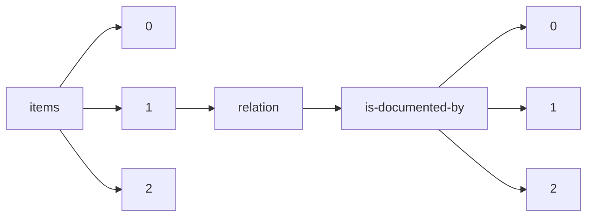

!!! warning "This document is not official Crossref documentation"
# Elements
PATH = items/array/relation/is-documented-by/array(1)  
Occurs 1 655 times  
{ .annotate }

1. A route to an element, for example:  
   The route "items/array/relation/is-documented-by/array" corresponds to navigating through the JSON indices as  
   ["items"][0]["relation"]["is-documented-by"][0]  

## Asserted-by
See more information: [items/array/relation/is-documented-by/array/asserted-by](asserted-by/index.md)  
Occurs 1 655 timess  
Unique values: 2  

| **Row** | **Value** `String` | **Count** `Int64` |
|--------:|----------------------:|---------------------:|
| **1**   | subject               | 1 589                |
| **2**   | object                | 66                   |

## Id
See more information: [items/array/relation/is-documented-by/array/id](id/index.md)  
Occurs 1 655 timess  
Unique values: 847  

| **Row** | **Value** `String`                                      | **Count** `Int64` |
|--------:|-----------------------------------------------------------:|---------------------:|
| **1**   | https://www.nodc.noaa.gov/ocads/oceans/Handbook\_2007.html | 28                   |
| **2**   | 10.1021/ac010088e                                          | 12                   |
| **3**   | 10.1021/es200665d                                          | 12                   |
| **4**   | 10.1021/ac020113w                                          | 11                   |
| **5**   | 10.1016/0967-0637(93)90048-8                               | 10                   |
| **6**   | 10.1007/BF00428135                                         | 10                   |
| **7**   | 10.1007/BF00541648                                         | 9                    |
| **8**   | 10.4319/lo.1969.14.3.0454                                  | 8                    |
| **9**   | 10.1111/j.1523-1739.2009.01428.x                           | 8                    |
| **10**  | 10.1002/rcm.7570                                           | 8                    |
| ... | ... | ... |

## Id-type
See more information: [items/array/relation/is-documented-by/array/id-type](id-type/index.md)  
Occurs 1 655 timess  
Unique values: 4  

| **Row** | **Value** `String` | **Count** `Int64` |
|--------:|----------------------:|---------------------:|
| **1**   | doi                   | 1 517                |
| **2**   | uri                   | 86                   |
| **3**   | isbn                  | 35                   |
| **4**   | handle                | 17                   |

