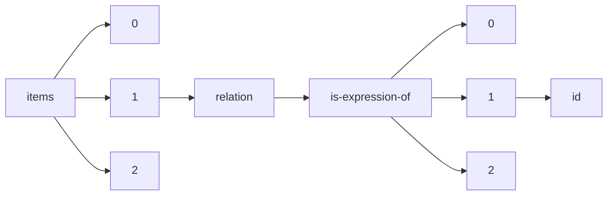

!!! warning "This document is not official Crossref documentation"
# Id
PATH = items/array/relation/is-expression-of/array/id(1)  
Occurs 1 times  
Unique values: 1  
{ .annotate }

1. A route to an element, for example:  
   The route "items/array/relation/is-expression-of/array/id" corresponds to navigating through the JSON indices as  
   ["items"][0]["relation"]["is-expression-of"][0]["id"]  

| **Row** | **Value** `String`          | **Count** `Int64` |
|--------:|-------------------------------:|---------------------:|
| **1**   | 10.1002/14651858.CD002025.pub5 | 1                    |

