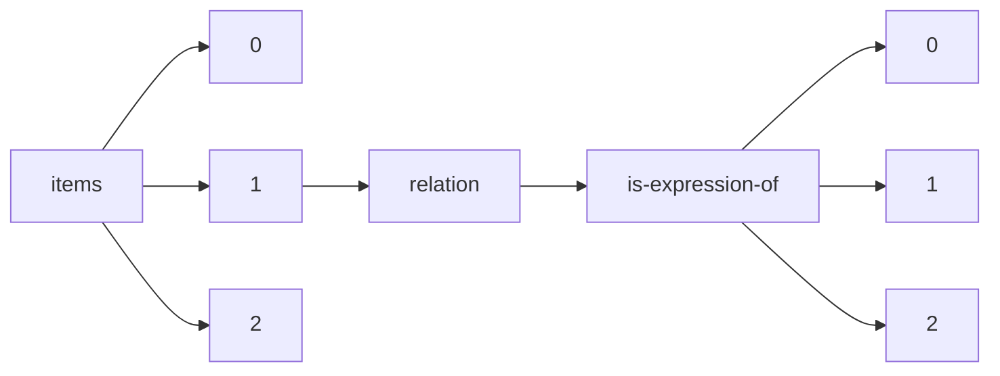

!!! warning "This document is not official Crossref documentation"
# Elements
PATH = items/array/relation/is-expression-of/array(1)  
Occurs 1 times  
{ .annotate }

1. A route to an element, for example:  
   The route "items/array/relation/is-expression-of/array" corresponds to navigating through the JSON indices as  
   ["items"][0]["relation"]["is-expression-of"][0]  

## Asserted-by
See more information: [items/array/relation/is-expression-of/array/asserted-by](asserted-by/index.md)  
Occurs 1 timess  
Unique values: 1  

| **Row** | **Value** `String` | **Count** `Int64` |
|--------:|----------------------:|---------------------:|
| **1**   | subject               | 1                    |

## Id
See more information: [items/array/relation/is-expression-of/array/id](id/index.md)  
Occurs 1 timess  
Unique values: 1  

| **Row** | **Value** `String`          | **Count** `Int64` |
|--------:|-------------------------------:|---------------------:|
| **1**   | 10.1002/14651858.CD002025.pub5 | 1                    |

## Id-type
See more information: [items/array/relation/is-expression-of/array/id-type](id-type/index.md)  
Occurs 1 timess  
Unique values: 1  

| **Row** | **Value** `String` | **Count** `Int64` |
|--------:|----------------------:|---------------------:|
| **1**   | doi                   | 1                    |

