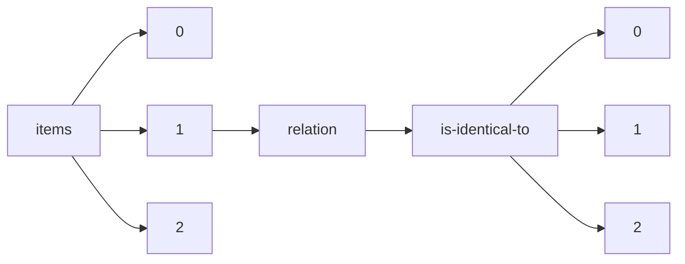

!!! warning "This document is not official Crossref documentation"
# Elements
PATH = items/array/relation/is-identical-to/array(1)  
Occurs 562 523 times  
{ .annotate }

1. A route to an element, for example:  
   The route "items/array/relation/is-identical-to/array" corresponds to navigating through the JSON indices as  
   ["items"][0]["relation"]["is-identical-to"][0]  

## Asserted-by
See more information: [items/array/relation/is-identical-to/array/asserted-by](asserted-by/index.md)  
Occurs 562 523 timess  
Unique values: 2  

| **Row** | **Value** `String` | **Count** `Int64` |
|--------:|----------------------:|---------------------:|
| **1**   | subject               | 435 766              |
| **2**   | object                | 126 757              |

## Id
See more information: [items/array/relation/is-identical-to/array/id](id/index.md)  
Occurs 562 523 timess  
Unique values: > 999  

!!! note "Due to current limitations, only the first 1,000 unique values are counted."

| **Row** | **Value** `String`      | **Count** `Int64` |
|--------:|---------------------------:|---------------------:|
| **1**   | 10.1017/9789048542079      | 53                   |
| **2**   | 10.2307/j.ctv1qr6smr       | 53                   |
| **3**   | 10.1515/9789048542079      | 53                   |
| **4**   | 2534-5079                  | 23                   |
| **5**   | 10.14361/9783839442869-038 | 21                   |
| **6**   | 10.14361/9783839442869-040 | 21                   |
| **7**   | 10.14361/9783839442869-036 | 19                   |
| **8**   | 10.2307/j.ctv1xcxr3n       | 18                   |
| **9**   | 10.14361/9783839442869-032 | 18                   |
| **10**  | 10.14361/9783839442869-034 | 18                   |
| ... | ... | ... |

## Id-type
See more information: [items/array/relation/is-identical-to/array/id-type](id-type/index.md)  
Occurs 562 523 timess  
Unique values: 5  

| **Row** | **Value** `String` | **Count** `Int64` |
|--------:|----------------------:|---------------------:|
| **1**   | doi                   | 562 467              |
| **2**   | issn                  | 31                   |
| **3**   | uri                   | 23                   |
| **4**   | arxiv                 | 1                    |
| **5**   | purl                  | 1                    |

