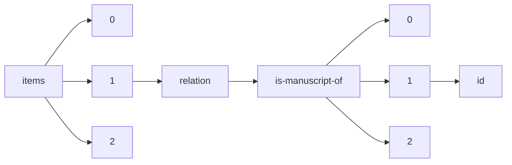

!!! warning "This document is not official Crossref documentation"
# Id
PATH = items/array/relation/is-manuscript-of/array/id(1)  
Occurs 77 times  
Unique values: 49  
{ .annotate }

1. A route to an element, for example:  
   The route "items/array/relation/is-manuscript-of/array/id" corresponds to navigating through the JSON indices as  
   ["items"][0]["relation"]["is-manuscript-of"][0]["id"]  

| **Row** | **Value** `String`                               | **Count** `Int64` |
|--------:|----------------------------------------------------:|---------------------:|
| **1**   | 2524-9347                                           | 10                   |
| **2**   | 2573-976X                                           | 6                    |
| **3**   | https://doi.org/10.46829/                           | 5                    |
| **4**   | 10.23890/IJAST                                      | 5                    |
| **5**   | 10.23890/IJAST.vm03is01                             | 4                    |
| **6**   |                                                     | 3                    |
| **7**   | 2667-5862                                           | 2                    |
| **8**   | 10.1080/19376529.2014.950142                        | 1                    |
| **9**   | 10.1016/j.adaj.2017.11.007                          | 1                    |
| **10**  | 10.1353/kri.2002.0044                               | 1                    |
| **11**  | 10.10310.1037/a00139457/a0013945                    | 1                    |
| **12**  | 10.1111/jrh.12004                                   | 1                    |
| **13**  | 10.1016/S1361-9209(02)00017-2                       | 1                    |
| **14**  | 10.1080/15228886.2014.845738                        | 1                    |
| **15**  | 10.1080/07317131.2016.1135023                       | 1                    |
| **16**  | 10.1111/1467-9434.00291                             | 1                    |
| **17**  | 10.18848/1447-9494/CGP/v11/45215                    | 1                    |
| **18**  | 10.1007/978-3-030-28509-8\_3                        | 1                    |
| **19**  | 10.1163/187633108X00102                             | 1                    |
| **20**  | 10.1177/0163443717693682                            | 1                    |
| **21**  | https://doi.org/10.46829/hsijournal.2021.12.2.2.220 | 1                    |
| **22**  | 10.1016/j.cpr.2009.06.004                           | 1                    |
| **23**  | 10.1080/1464935042000250221                         | 1                    |
| **24**  | 10.1163/187633198X00077                             | 1                    |
| **25**  | 10.1080/10875301.2013.856367                        | 1                    |
| **26**  | 10.1037/1040-3590.19.3.253                          | 1                    |
| **27**  | 10.1177/0022002707313693                            | 1                    |
| **28**  | 10.1016/j.adaj.2014.11.014                          | 1                    |
| **29**  | 10.1017/CHOL9780521812276.020                       | 1                    |
| **30**  | 10.1017/S0010417500020478                           | 1                    |
| **31**  | 10.1080/01462679.2014.860861                        | 1                    |
| **32**  | 10.1037/0021-843X.112.2.298                         | 1                    |
| **33**  | 9781609386511                                       | 1                    |
| **34**  | 10.1111/jphd.12139                                  | 1                    |
| **35**  | 10.1037/0021-843X.110.4.526                         | 1                    |
| **36**  | 10.1300/J123v41n03\_14                              | 1                    |
| **37**  | 10.1177/1473095207082033                            | 1                    |
| **38**  | 10.1037/a0022818                                    | 1                    |
| **39**  | 10.1177/2380084417714795                            | 1                    |
| **40**  | 10.1163/187633194X00170                             | 1                    |
| **41**  | 9780631213185                                       | 1                    |
| **42**  | 10.1037/a0016087                                    | 1                    |
| **43**  | 10.1016/j.healthplace.2015.05.002                   | 1                    |
| **44**  | 10.1037/0022-3514.91.5.959                          | 1                    |
| **45**  | 10.1080/19376529.2014.950144                        | 1                    |
| **46**  | 10.1108/07378831111116921                           | 1                    |
| **47**  | 10.1037/0021-843X.114.4.522                         | 1                    |
| **48**  | 10.5840/jpr201662767                                | 1                    |
| **49**  | 10.5380/ce.v27i0.81947                              | 1                    |

