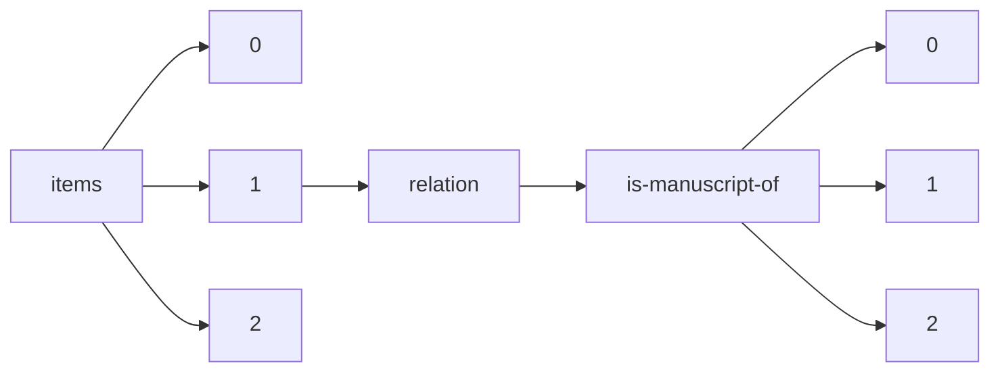

!!! warning "This document is not official Crossref documentation"
# Elements
PATH = items/array/relation/is-manuscript-of/array(1)  
Occurs 77 times  
{ .annotate }

1. A route to an element, for example:  
   The route "items/array/relation/is-manuscript-of/array" corresponds to navigating through the JSON indices as  
   ["items"][0]["relation"]["is-manuscript-of"][0]  

## Asserted-by
See more information: [items/array/relation/is-manuscript-of/array/asserted-by](asserted-by/index.md)  
Occurs 77 timess  
Unique values: 1  

| **Row** | **Value** `String` | **Count** `Int64` |
|--------:|----------------------:|---------------------:|
| **1**   | subject               | 77                   |

## Id
See more information: [items/array/relation/is-manuscript-of/array/id](id/index.md)  
Occurs 77 timess  
Unique values: 49  

| **Row** | **Value** `String`        | **Count** `Int64` |
|--------:|-----------------------------:|---------------------:|
| **1**   | 2524-9347                    | 10                   |
| **2**   | 2573-976X                    | 6                    |
| **3**   | https://doi.org/10.46829/    | 5                    |
| **4**   | 10.23890/IJAST               | 5                    |
| **5**   | 10.23890/IJAST.vm03is01      | 4                    |
| **6**   |                              | 3                    |
| **7**   | 2667-5862                    | 2                    |
| **8**   | 10.1080/19376529.2014.950142 | 1                    |
| **9**   | 10.1016/j.adaj.2017.11.007   | 1                    |
| **10**  | 10.1353/kri.2002.0044        | 1                    |
| ... | ... | ... |

## Id-type
See more information: [items/array/relation/is-manuscript-of/array/id-type](id-type/index.md)  
Occurs 77 timess  
Unique values: 3  

| **Row** | **Value** `String` | **Count** `Int64` |
|--------:|----------------------:|---------------------:|
| **1**   | doi                   | 40                   |
| **2**   | issn                  | 35                   |
| **3**   | isbn                  | 2                    |

