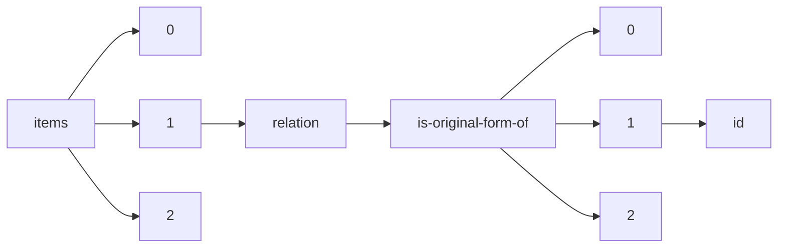

!!! warning "This document is not official Crossref documentation"
# Id
PATH = items/array/relation/is-original-form-of/array/id(1)  
Occurs 4 times  
Unique values: 4  
{ .annotate }

1. A route to an element, for example:  
   The route "items/array/relation/is-original-form-of/array/id" corresponds to navigating through the JSON indices as  
   ["items"][0]["relation"]["is-original-form-of"][0]["id"]  

| **Row** | **Value** `String`                               | **Count** `Int64` |
|--------:|----------------------------------------------------:|---------------------:|
| **1**   | LDBC\nLex-001r5                                     | 1                    |
| **2**   | 10.9743/JIR.2018.13                                 | 1                    |
| **3**   |                                                     | 1                    |
| **4**   | https://doi.org/10.46829/hsijournal.2021.12.2.2.220 | 1                    |

