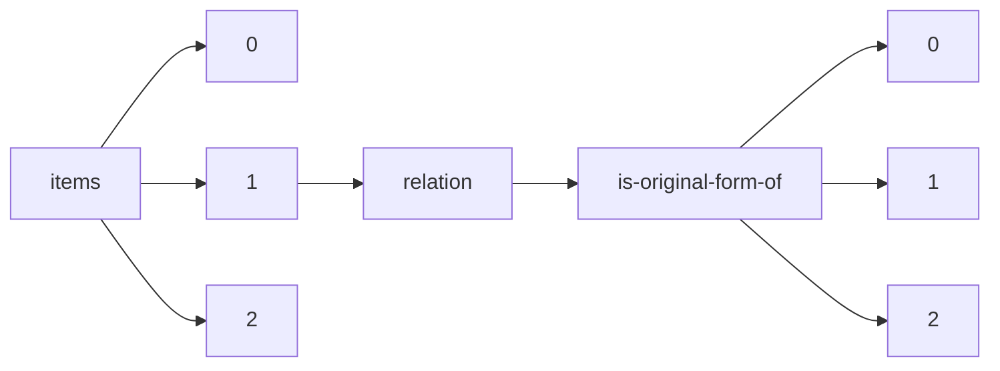

!!! warning "This document is not official Crossref documentation"
# Elements
PATH = items/array/relation/is-original-form-of/array(1)  
Occurs 4 times  
{ .annotate }

1. A route to an element, for example:  
   The route "items/array/relation/is-original-form-of/array" corresponds to navigating through the JSON indices as  
   ["items"][0]["relation"]["is-original-form-of"][0]  

## Asserted-by
See more information: [items/array/relation/is-original-form-of/array/asserted-by](asserted-by/index.md)  
Occurs 4 timess  
Unique values: 1  

| **Row** | **Value** `String` | **Count** `Int64` |
|--------:|----------------------:|---------------------:|
| **1**   | subject               | 4                    |

## Id
See more information: [items/array/relation/is-original-form-of/array/id](id/index.md)  
Occurs 4 timess  
Unique values: 4  

| **Row** | **Value** `String`                               | **Count** `Int64` |
|--------:|----------------------------------------------------:|---------------------:|
| **1**   | LDBC\nLex-001r5                                     | 1                    |
| **2**   | 10.9743/JIR.2018.13                                 | 1                    |
| **3**   |                                                     | 1                    |
| **4**   | https://doi.org/10.46829/hsijournal.2021.12.2.2.220 | 1                    |

## Id-type
See more information: [items/array/relation/is-original-form-of/array/id-type](id-type/index.md)  
Occurs 4 timess  
Unique values: 3  

| **Row** | **Value** `String` | **Count** `Int64` |
|--------:|----------------------:|---------------------:|
| **1**   | issn                  | 2                    |
| **2**   | other                 | 1                    |
| **3**   | doi                   | 1                    |

