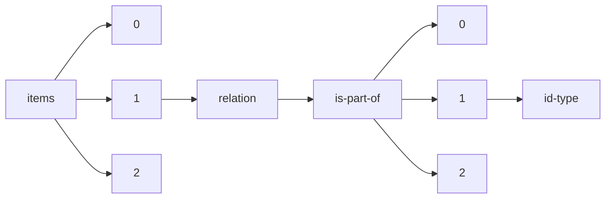

!!! warning "This document is not official Crossref documentation"
# Id-type
PATH = items/array/relation/is-part-of/array/id-type(1)  
Occurs 34 126 times  
Unique values: 8  
{ .annotate }

1. A route to an element, for example:  
   The route "items/array/relation/is-part-of/array/id-type" corresponds to navigating through the JSON indices as  
   ["items"][0]["relation"]["is-part-of"][0]["id-type"]  

| **Row** | **Value** `String` | **Count** `Int64` |
|--------:|----------------------:|---------------------:|
| **1**   | doi                   | 23 584               |
| **2**   | other                 | 9 674                |
| **3**   | issn                  | 311                  |
| **4**   | isbn                  | 256                  |
| **5**   | uri                   | 254                  |
| **6**   | purl                  | 30                   |
| **7**   | long-doi              | 9                    |
| **8**   | short-doi             | 8                    |

