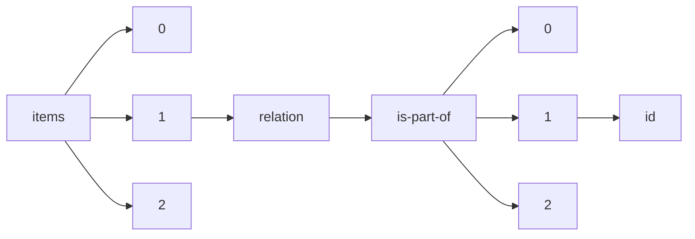

!!! warning "This document is not official Crossref documentation"
# Id
PATH = items/array/relation/is-part-of/array/id(1)  
Occurs 34 126 times  
Unique values: > 999  
{ .annotate }

1. A route to an element, for example:  
   The route "items/array/relation/is-part-of/array/id" corresponds to navigating through the JSON indices as  
   ["items"][0]["relation"]["is-part-of"][0]["id"]  

!!! note "Due to current limitations, only the first 1,000 unique values are counted."

| **Row** | **Value** `String`                                     | **Count** `Int64` |
|--------:|----------------------------------------------------------:|---------------------:|
| **1**   | 10.29172/physh                                            | 3 514                |
| **2**   | 1-5                                                       | 365                  |
| **3**   | 8-9                                                       | 109                  |
| **4**   | 20000898                                                  | 108                  |
| **5**   | https://ncsu-wolfpack-solutions.pubpub.org/               | 107                  |
| **6**   | 2353-2912                                                 | 104                  |
| **7**   | 10.25080/issn.2575-9752                                   | 90                   |
| **8**   | 10.24381/cds.bd0915c6                                     | 85                   |
| **9**   | 10.24381/cds.adbb2d47                                     | 81                   |
| **10**  | 1-269                                                     | 70                   |
| **11**  | 1-287                                                     | 68                   |
| **12**  | 10.1002/qj.828                                            | 64                   |
| **13**  | 2-515                                                     | 54                   |
| **14**  | 2000-0898                                                 | 52                   |
| **15**  | 1-280                                                     | 52                   |
| **16**  | 2-292                                                     | 49                   |
| **17**  | https://ncsu-wolfpack-solutions.pubpub.org/global-change  | 48                   |
| **18**  | 8-94                                                      | 48                   |
| **19**  | 2-483                                                     | 44                   |
| **20**  | 1-315                                                     | 44                   |
| **21**  | 1-268                                                     | 37                   |
| **22**  | 1-312                                                     | 37                   |
| **23**  | 2-281                                                     | 36                   |
| **24**  | 1-314                                                     | 36                   |
| **25**  | 1-306                                                     | 36                   |
| **26**  | 10.19135/revista.consinter.00001.00                       | 35                   |
| **27**  | 2-305                                                     | 34                   |
| **28**  | 10.3334/ORNLDAAC/1581                                     | 34                   |
| **29**  | 1-313                                                     | 34                   |
| **30**  | 8-70                                                      | 32                   |
| **31**  | 14-147                                                    | 32                   |
| **32**  | https://ncsu-wolfpack-solutions.pubpub.org/pandemics      | 32                   |
| **33**  | 1-311                                                     | 32                   |
| **34**  | 10.5065/D6M043C6                                          | 31                   |
| **35**  | https://ncsu-wolfpack-solutions.pubpub.org/future-of-food | 31                   |
| **36**  | 2456-8422                                                 | 29                   |
| **37**  | 1-4                                                       | 28                   |
| **38**  | 1-2                                                       | 28                   |
| **39**  | 1-308                                                     | 27                   |
| **40**  | 1-6 10.57568/iulres.v3i5                                  | 27                   |
| **41**  | 1-5 10.57568/iulres.v2i4                                  | 27                   |
| **42**  | 1-310                                                     | 26                   |
| **43**  | 2-284                                                     | 25                   |
| **44**  | 10.17616/R39Q0T                                           | 25                   |
| **45**  | 18-171                                                    | 24                   |
| **46**  | 1-316                                                     | 24                   |
| **47**  | 2-571                                                     | 23                   |
| **48**  | 2-491                                                     | 23                   |
| **49**  | 1-7                                                       | 23                   |
| **50**  | 38-818                                                    | 23                   |
| **51**  | 2-307                                                     | 22                   |
| **52**  | 1-82                                                      | 22                   |
| **53**  | 1-73                                                      | 22                   |
| **54**  | 10.19135/revista.consinter.00003.00                       | 22                   |
| **55**  | 1-2 10.57568/iulres.v1i1                                  | 22                   |
| **56**  | 1-307                                                     | 22                   |
| **57**  | 2-298                                                     | 22                   |
| **58**  | 2-296                                                     | 21                   |
| **59**  | 1-305                                                     | 21                   |
| **60**  | 10.24381/cds.f17050d7                                     | 21                   |
| **61**  | 1-58                                                      | 20                   |
| **62**  | 978-91-977799-3-7                                         | 20                   |
| **63**  | 1-71                                                      | 20                   |
| **64**  | 9789197779852                                             | 20                   |
| **65**  | 2-304                                                     | 20                   |
| **66**  | 10.5065/D6HH6H41                                          | 20                   |
| **67**  | 9789197779869                                             | 20                   |
| **68**  | 1-4 10.57568/iulres.v2i3                                  | 20                   |
| **69**  | 1-57                                                      | 19                   |
| **70**  | 1-79                                                      | 19                   |
| **71**  | 2-273                                                     | 19                   |
| **72**  | 10.1002/qj.3803                                           | 19                   |
| **73**  | 1-80                                                      | 19                   |
| **74**  | 10.19135/revista.consinter.00002.00                       | 19                   |
| **75**  | 1-90                                                      | 19                   |
| **76**  | 1-78                                                      | 18                   |
| **77**  | 18-175                                                    | 18                   |
| **78**  | 1-42                                                      | 18                   |
| **79**  | 1-309                                                     | 18                   |
| **80**  | 14-142                                                    | 18                   |
| **81**  | 1-296                                                     | 18                   |
| **82**  | 14-131                                                    | 18                   |
| **83**  | 8-618                                                     | 17                   |
| **84**  | 2-297                                                     | 17                   |
| **85**  | 1-15                                                      | 17                   |
| **86**  | 1-3 10.57568/iulres.v1i2                                  | 17                   |
| **87**  | 2-289                                                     | 17                   |
| **88**  | 1-72                                                      | 17                   |
| **89**  | 11-3                                                      | 17                   |
| **90**  | 8-624                                                     | 16                   |
| **91**  | 1-14                                                      | 16                   |
| **92**  | 8-613                                                     | 16                   |
| **93**  | 2-279                                                     | 16                   |
| **94**  | 1-13                                                      | 16                   |
| **95**  | 8-87                                                      | 16                   |
| **96**  | 978-91-977799-2-0                                         | 16                   |
| **97**  | 10.19135/revista.consinter.00004.00                       | 16                   |
| **98**  | 3-124                                                     | 16                   |
| **99**  | 2-500                                                     | 16                   |
| **100** | 2-287                                                     | 16                   |
| **101** | 2-244                                                     | 16                   |
| **102** | 1-70                                                      | 16                   |
| **103** | 10.5067/Aircraft/SEAC4RS/Aerosol-TraceGas-Cloud           | 15                   |
| **104** | 2-591                                                     | 15                   |
| **105** | 2-494                                                     | 15                   |
| **106** | 1-56                                                      | 15                   |
| **107** | 978-91-977799-1-3                                         | 15                   |
| **108** | 1-53                                                      | 15                   |
| **109** | 2-276                                                     | 15                   |
| **110** | 2-288                                                     | 15                   |
| **111** | 11-6                                                      | 15                   |
| **112** | 18-176                                                    | 15                   |
| **113** | 14-154                                                    | 15                   |
| **114** | 8-74                                                      | 14                   |
| **115** | 18-157                                                    | 14                   |
| **116** | 18-179                                                    | 14                   |
| **117** | 3-158                                                     | 14                   |
| **118** | 9789197779906                                             | 14                   |
| **119** | 2-286                                                     | 14                   |
| **120** | 18-177                                                    | 14                   |
| **121** | 10.17882/42182                                            | 14                   |
| **122** | 2-290                                                     | 14                   |
| **123** | 9789197779845                                             | 14                   |
| **124** | 11-5                                                      | 13                   |
| **125** | 38-814                                                    | 13                   |
| **126** | 12-16                                                     | 13                   |
| **127** | 10.5067/VJAFPLI1CSIV                                      | 13                   |
| **128** | 2-586                                                     | 13                   |
| **129** | 1-6                                                       | 13                   |
| **130** | 13-80                                                     | 13                   |
| **131** | 8-82                                                      | 13                   |
| **132** | 1-59                                                      | 13                   |
| **133** | 10.5067/Suborbital/KORUSAQ/DATA01                         | 13                   |
| **134** | 1-1                                                       | 13                   |
| **135** | 18-172                                                    | 13                   |
| **136** | 2-285                                                     | 13                   |
| **137** | 8-76                                                      | 12                   |
| **138** | 10.1029/2002JD002670                                      | 12                   |
| **139** | 10.5065/D6MK6B4K                                          | 12                   |
| **140** | 2-293                                                     | 12                   |
| **141** | 1-84                                                      | 12                   |
| **142** | 38-771                                                    | 12                   |
| **143** | 2-282                                                     | 12                   |
| **144** | 1-11                                                      | 12                   |
| **145** | 10.1175/1520-0477(1996)077&lt;0437:TNYRP&gt;2.0.CO;2      | 12                   |
| **146** | 2-486                                                     | 12                   |
| **147** | 8-83                                                      | 12                   |
| **148** | 1-92                                                      | 12                   |
| **149** | 2-299                                                     | 12                   |
| **150** | 8-620                                                     | 12                   |
| **151** | 2-503                                                     | 12                   |
| **152** | 10.5067/QBZ6MG944HW0                                      | 12                   |
| **153** | 2-485                                                     | 12                   |
| **154** | 1-81                                                      | 12                   |
| **155** | 11-7                                                      | 12                   |
| **156** | 8-616                                                     | 12                   |
| **157** | 10.48216/9788269203325                                    | 12                   |
| **158** | 1-54                                                      | 12                   |
| **159** | 8-86                                                      | 11                   |
| **160** | 2-472                                                     | 11                   |
| **161** | 8-91                                                      | 11                   |
| **162** | 10.5065/D6CR5RD9                                          | 11                   |
| **163** | 2-300                                                     | 11                   |
| **164** | 3-132                                                     | 11                   |
| **165** | 10.5676/GRUAN/RS92-GDP.2                                  | 11                   |
| **166** | 1-96                                                      | 11                   |
| **167** | 10.23915/distill.00019                                    | 11                   |
| **168** | 8-73                                                      | 11                   |
| **169** | 2-457                                                     | 11                   |
| **170** | 10.2151/jmsj.2015-001                                     | 11                   |
| **171** | 38-805                                                    | 11                   |
| **172** | 3-139                                                     | 11                   |
| **173** | 2-280                                                     | 11                   |
| **174** | 18-158                                                    | 11                   |
| **175** | 15-150                                                    | 11                   |
| **176** | 8-623                                                     | 11                   |
| **177** | 9788269203325                                             | 11                   |
| **178** | 3-146                                                     | 11                   |
| **179** | 2-580                                                     | 11                   |
| **180** | 2-291                                                     | 11                   |
| **181** | 2-303                                                     | 11                   |
| **182** | 1-3                                                       | 11                   |
| **183** | 2-271                                                     | 11                   |
| **184** | 10.24381/cds.e2161bac                                     | 11                   |
| **185** | 38-568                                                    | 11                   |
| **186** | 2-470                                                     | 11                   |
| **187** | 8-75                                                      | 11                   |
| **188** | 38-839                                                    | 11                   |
| **189** | 38-768                                                    | 11                   |
| **190** | 13-82                                                     | 11                   |
| **191** | 9-143                                                     | 11                   |
| **192** | 1-74                                                      | 11                   |
| **193** | 2-463                                                     | 11                   |
| **194** | 1-18                                                      | 11                   |
| **195** | 38-798                                                    | 11                   |
| **196** | 10.1175/JCLI-D-16-0758.1                                  | 10                   |
| **197** | 8-65                                                      | 10                   |
| **198** | 8-66                                                      | 10                   |
| **199** | 9789197779890                                             | 10                   |
| **200** | 8-54                                                      | 10                   |
| **201** | 10.1002/joc.3711                                          | 10                   |
| **202** | 8-63                                                      | 10                   |
| **203** | 2-504                                                     | 10                   |
| **204** | 38-578                                                    | 10                   |
| **205** | 11-11                                                     | 10                   |
| **206** | 1-262                                                     | 10                   |
| **207** | 11-226                                                    | 10                   |
| **208** | 12-236                                                    | 10                   |
| **209** | 8-68                                                      | 10                   |
| **210** | 1-45                                                      | 10                   |
| **211** | 14-101                                                    | 10                   |
| **212** | 14-160                                                    | 10                   |
| **213** | 10.5439/1181954                                           | 10                   |
| **214** | 38-592                                                    | 10                   |
| **215** | 2-272                                                     | 10                   |
| **216** | 9789197779876                                             | 10                   |
| **217** | 10.5270/S5P-s4ljg54                                       | 10                   |
| **218** | 2-492                                                     | 10                   |
| **219** | 10.7289/V5C8276M                                          | 10                   |
| **220** | 12-338                                                    | 10                   |
| **221** | 2-493                                                     | 10                   |
| **222** | 8-67                                                      | 10                   |
| **223** | 2-508                                                     | 10                   |
| **224** | 11-196                                                    | 10                   |
| **225** | 1-47                                                      | 10                   |
| **226** | 14-199                                                    | 10                   |
| **227** | 38-829                                                    | 10                   |
| **228** | 9789197779883                                             | 10                   |
| **229** | 9-156                                                     | 9                    |
| **230** | 12-275                                                    | 9                    |
| **231** | 11-434                                                    | 9                    |
| **232** | 12-261                                                    | 9                    |
| **233** | 2-590                                                     | 9                    |
| **234** | 12-438                                                    | 9                    |
| **235** | 2-459                                                     | 9                    |
| **236** | 11-343                                                    | 9                    |
| **237** | 11-219                                                    | 9                    |
| **238** | 16-430                                                    | 9                    |
| **239** | 19-214                                                    | 9                    |
| **240** | 11-210                                                    | 9                    |
| **241** | 10.6096/dacciwa.1618                                      | 9                    |
| **242** | 2-581                                                     | 9                    |
| **243** | 11-312                                                    | 9                    |
| **244** | 1-23                                                      | 9                    |
| **245** | 1-93                                                      | 9                    |
| **246** | 11-288                                                    | 9                    |
| **247** | 11-326                                                    | 9                    |
| **248** | 11-397                                                    | 9                    |
| **249** | 12-474                                                    | 9                    |
| **250** | 17-140                                                    | 9                    |
| **251** | 12-317                                                    | 9                    |
| **252** | 11-424                                                    | 9                    |
| **253** | 11-432                                                    | 9                    |
| **254** | 11-443                                                    | 9                    |
| **255** | 12-470                                                    | 9                    |
| **256** | 11-258                                                    | 9                    |
| **257** | 11-212                                                    | 9                    |
| **258** | 15-155                                                    | 9                    |
| **259** | 10.17595/20170411.001                                     | 9                    |
| **260** | 11-513                                                    | 9                    |
| **261** | 11-250                                                    | 9                    |
| **262** | 11-240                                                    | 9                    |
| **263** | 8-89                                                      | 9                    |
| **264** | 12-339                                                    | 9                    |
| **265** | 12-276                                                    | 9                    |
| **266** | 11-229                                                    | 9                    |
| **267** | 38-584                                                    | 9                    |
| **268** | 8-84                                                      | 9                    |
| **269** | 12-303                                                    | 9                    |
| **270** | 11-227                                                    | 9                    |
| **271** | 11-433                                                    | 9                    |
| **272** | 8-69                                                      | 9                    |
| **273** | 2-576                                                     | 9                    |
| **274** | 13-541                                                    | 9                    |
| **275** | 11-396                                                    | 9                    |
| **276** | 2-294                                                     | 9                    |
| **277** | 2-275                                                     | 9                    |
| **278** | 12-209                                                    | 9                    |
| **279** | 14-221                                                    | 9                    |
| **280** | 2-278                                                     | 9                    |
| **281** | 10.5067/WWQSXQ8IVFW8                                      | 9                    |
| **282** | 13-309                                                    | 9                    |
| **283** | 18-222                                                    | 9                    |
| **284** | 10.25039/tr.015.2018                                      | 9                    |
| **285** | 11-314                                                    | 9                    |
| **286** | 11-290                                                    | 9                    |
| **287** | 12-329                                                    | 9                    |
| **288** | 13-208                                                    | 9                    |
| **289** | 8-85                                                      | 9                    |
| **290** | 11-195                                                    | 9                    |
| **291** | 12-558                                                    | 9                    |
| **292** | 11-436                                                    | 9                    |
| **293** | 1-270                                                     | 9                    |
| **294** | 13-335                                                    | 9                    |
| **295** | 10.5439/1021460                                           | 9                    |
| **296** | 10.5067/MODIS/MOD10A1.006                                 | 9                    |
| **297** | 8-90                                                      | 9                    |
| **298** | 11-4                                                      | 9                    |
| **299** | 8-78                                                      | 9                    |
| **300** | 11-318                                                    | 9                    |
| **301** | 8-81                                                      | 9                    |
| **302** | 1-27                                                      | 9                    |
| **303** | 1-16                                                      | 8                    |
| **304** | 2-498                                                     | 8                    |
| **305** | 12-636                                                    | 8                    |
| **306** | 11-553                                                    | 8                    |
| **307** | 12-517                                                    | 8                    |
| **308** | 22-637                                                    | 8                    |
| **309** | 12-475                                                    | 8                    |
| **310** | 11-458                                                    | 8                    |
| **311** | 16-223                                                    | 8                    |
| **312** | 11-471                                                    | 8                    |
| **313** | 11-415                                                    | 8                    |
| **314** | 5-134                                                     | 8                    |
| **315** | 8-31                                                      | 8                    |
| **316** | 2-516                                                     | 8                    |
| **317** | 2-24 10.32082/fp.v3i53                                    | 8                    |
| **318** | 8-88                                                      | 8                    |
| **319** | 14-429                                                    | 8                    |
| **320** | 11-591                                                    | 8                    |
| **321** | 10.11888/AtmosphericPhysics.tpe.249369.file               | 8                    |
| **322** | 12-624                                                    | 8                    |
| **323** | 11-345                                                    | 8                    |
| **324** | 11-444                                                    | 8                    |
| **325** | 12-411                                                    | 8                    |
| **326** | 15-571                                                    | 8                    |
| **327** | 2-512                                                     | 8                    |
| **328** | 11-337                                                    | 8                    |
| **329** | 13-421                                                    | 8                    |
| **330** | 11-259                                                    | 8                    |
| **331** | 18-165                                                    | 8                    |
| **332** | 13-440                                                    | 8                    |
| **333** | 10.5067/Suborbital/ORACLES/P3/2018\_V2                    | 8                    |
| **334** | 10.5067/MODIS/MOD04\_L2.006                               | 8                    |
| **335** | 22-547                                                    | 8                    |
| **336** | 11-311                                                    | 8                    |
| **337** | 13-207                                                    | 8                    |
| **338** | 15-533                                                    | 8                    |
| **339** | 15-534                                                    | 8                    |
| **340** | 11-291                                                    | 8                    |
| **341** | 16-493                                                    | 8                    |
| **342** | 11-265                                                    | 8                    |
| **343** | 12-78                                                     | 8                    |
| **344** | 10.5281/zenodo.1079898                                    | 8                    |
| **345** | 11-328                                                    | 8                    |
| **346** | 11-639                                                    | 8                    |
| **347** | 15-244                                                    | 8                    |
| **348** | 11-525                                                    | 8                    |
| **349** | 10.5067/E4E140XDMPO2                                      | 8                    |
| **350** | 11-342                                                    | 8                    |
| **351** | 18-270                                                    | 8                    |
| **352** | 11-313                                                    | 8                    |
| **353** | 14-126                                                    | 8                    |
| **354** | 18-201                                                    | 8                    |
| **355** | 11-307                                                    | 8                    |
| **356** | 11-512                                                    | 8                    |
| **357** | 11-189                                                    | 8                    |
| **358** | 11-627                                                    | 8                    |
| **359** | 17-431                                                    | 8                    |
| **360** | 11-56                                                     | 8                    |
| **361** | 2-471                                                     | 8                    |
| **362** | 8-45                                                      | 8                    |
| **363** | 11-412                                                    | 8                    |
| **364** | 11-552                                                    | 8                    |
| **365** | 11-284                                                    | 8                    |
| **366** | 13-453                                                    | 8                    |
| **367** | 10.5067/Aura/MLS/DATA2017                                 | 8                    |
| **368** | 11-564                                                    | 8                    |
| **369** | 1-36                                                      | 8                    |
| **370** | 13-322                                                    | 8                    |
| **371** | 13-131                                                    | 8                    |
| **372** | 1-29                                                      | 8                    |
| **373** | 11-565                                                    | 8                    |
| **374** | 12-287                                                    | 8                    |
| **375** | 2-488                                                     | 8                    |
| **376** | 11-618                                                    | 8                    |
| **377** | 2-579                                                     | 8                    |
| **378** | 11-422                                                    | 8                    |
| **379** | 11-184                                                    | 8                    |
| **380** | 16-323                                                    | 8                    |
| **381** | 11-205                                                    | 8                    |
| **382** | 18-551                                                    | 8                    |
| **383** | 11-255                                                    | 8                    |
| **384** | 38-590                                                    | 8                    |
| **385** | 38-585                                                    | 8                    |
| **386** | 11-238                                                    | 8                    |
| **387** | 9-149                                                     | 8                    |
| **388** | 2-497                                                     | 8                    |
| **389** | 3-151                                                     | 8                    |
| **390** | 15-614                                                    | 8                    |
| **391** | 38-833                                                    | 8                    |
| **392** | 16-498                                                    | 8                    |
| **393** | 12-310                                                    | 8                    |
| **394** | 12-181                                                    | 8                    |
| **395** | 1-12                                                      | 8                    |
| **396** | 5-128                                                     | 8                    |
| **397** | 12-349                                                    | 8                    |
| **398** | 12-247                                                    | 8                    |
| **399** | 979-8-9857300-0-5                                         | 8                    |
| **400** | 12-325                                                    | 8                    |
| **401** | 11-304                                                    | 8                    |
| **402** | 10.25326/20                                               | 8                    |
| **403** | 11-506                                                    | 8                    |
| **404** | 11-239                                                    | 8                    |
| **405** | 38-834                                                    | 8                    |
| **406** | 1-140                                                     | 8                    |
| **407** | 11-568                                                    | 8                    |
| **408** | 2-458                                                     | 8                    |
| **409** | 2-514                                                     | 8                    |
| **410** | 12-260                                                    | 8                    |
| **411** | 11-320                                                    | 8                    |
| **412** | 2-465                                                     | 8                    |
| **413** | 1-94                                                      | 8                    |
| **414** | 1-55                                                      | 8                    |
| **415** | 10.24381/cds.6860a573                                     | 8                    |
| **416** | 11-257                                                    | 8                    |
| **417** | 17-278                                                    | 8                    |
| **418** | 2-462                                                     | 8                    |
| **419** | 13-468                                                    | 8                    |
| **420** | 12-559                                                    | 8                    |
| **421** | 11-183                                                    | 8                    |
| **422** | 13-546                                                    | 8                    |
| **423** | 13-437                                                    | 8                    |
| **424** | 11-218                                                    | 8                    |
| **425** | 11-334                                                    | 8                    |
| **426** | 8-622                                                     | 8                    |
| **427** | 12-508                                                    | 8                    |
| **428** | 12-21                                                     | 8                    |
| **429** | 2-306                                                     | 8                    |
| **430** | 13-316                                                    | 8                    |
| **431** | 11-188                                                    | 8                    |
| **432** | 16-200                                                    | 8                    |
| **433** | 11-333                                                    | 8                    |
| **434** | 8-77                                                      | 8                    |
| **435** | 978-1-7362739-4-4                                         | 8                    |
| **436** | 18-327                                                    | 8                    |
| **437** | 18-169                                                    | 8                    |
| **438** | 10.5067/Aura/OMI/DATA2017                                 | 8                    |
| **439** | 8-604                                                     | 8                    |
| **440** | 11-289                                                    | 8                    |
| **441** | 13-346                                                    | 8                    |
| **442** | 18-228                                                    | 8                    |
| **443** | 12-206                                                    | 8                    |
| **444** | 2-274                                                     | 8                    |
| **445** | 18-173                                                    | 8                    |
| **446** | 11-319                                                    | 8                    |
| **447** | 1-25                                                      | 8                    |
| **448** | 12-439                                                    | 8                    |
| **449** | 11-554                                                    | 7                    |
| **450** | 38-579                                                    | 7                    |
| **451** | 1-130                                                     | 7                    |
| **452** | 15-449                                                    | 7                    |
| **453** | 11-145                                                    | 7                    |
| **454** | 978-1-5326-8495-1                                         | 7                    |
| **455** | 19-148                                                    | 7                    |
| **456** | 21-588                                                    | 7                    |
| **457** | 11-274                                                    | 7                    |
| **458** | 2-509                                                     | 7                    |
| **459** | 12-130                                                    | 7                    |
| **460** | 10.6096/dacciwa.1690                                      | 7                    |
| **461** | 13-235                                                    | 7                    |
| **462** | 13-479                                                    | 7                    |
| **463** | 11-612                                                    | 7                    |
| **464** | 8-44                                                      | 7                    |
| **465** | 13-409                                                    | 7                    |
| **466** | 11-544                                                    | 7                    |
| **467** | 12-416                                                    | 7                    |
| **468** | 8-135                                                     | 7                    |
| **469** | 11-595                                                    | 7                    |
| **470** | 18-617                                                    | 7                    |
| **471** | 18-489                                                    | 7                    |
| **472** | 2-125 10.30445/rear.v10i4                                 | 7                    |
| **473** | 19-144                                                    | 7                    |
| **474** | 14-332                                                    | 7                    |
| **475** | 12-483                                                    | 7                    |
| **476** | 2-495                                                     | 7                    |
| **477** | 9-129                                                     | 7                    |
| **478** | 2-277                                                     | 7                    |
| **479** | 10.5067/MODIS/MOD16A2.006                                 | 7                    |
| **480** | 11-503                                                    | 7                    |
| **481** | 11-60                                                     | 7                    |
| **482** | 2-21 10.32082/fp.v4i54                                    | 7                    |
| **483** | 1-143                                                     | 7                    |
| **484** | 1-142                                                     | 7                    |
| **485** | 11-128                                                    | 7                    |
| **486** | 18-174                                                    | 7                    |
| **487** | 12-532                                                    | 7                    |
| **488** | 13-400                                                    | 7                    |
| **489** | 8-57                                                      | 7                    |
| **490** | 11-414                                                    | 7                    |
| **491** | 11-524                                                    | 7                    |
| **492** | 12-293                                                    | 7                    |
| **493** | 2-592                                                     | 7                    |
| **494** | 11-610                                                    | 7                    |
| **495** | 13-262                                                    | 7                    |
| **496** | 12-580                                                    | 7                    |
| **497** | 1-144                                                     | 7                    |
| **498** | 12-599                                                    | 7                    |
| **499** | 11-543                                                    | 7                    |
| **500** | 11-609                                                    | 7                    |
| **501** | 12-509                                                    | 7                    |
| **502** | 11-271                                                    | 7                    |
| **503** | 11-607                                                    | 7                    |
| **504** | 11-408                                                    | 7                    |
| **505** | 1-17                                                      | 7                    |
| **506** | 13-81                                                     | 7                    |
| **507** | 11-441                                                    | 7                    |
| **508** | 11-182                                                    | 7                    |
| **509** | 13-233                                                    | 7                    |
| **510** | 12-531                                                    | 7                    |
| **511** | 2-505                                                     | 7                    |
| **512** | 2-506                                                     | 7                    |
| **513** | 13-620                                                    | 7                    |
| **514** | 10.5067/Aura/MLS/DATA2009                                 | 7                    |
| **515** | 8-26                                                      | 7                    |
| **516** | 13-621                                                    | 7                    |
| **517** | 38-575                                                    | 7                    |
| **518** | 19-330                                                    | 7                    |
| **519** | 13-298                                                    | 7                    |
| **520** | 2-461                                                     | 7                    |
| **521** | 13-557                                                    | 7                    |
| **522** | 13-215                                                    | 7                    |
| **523** | 14-450                                                    | 7                    |
| **524** | 11-577                                                    | 7                    |
| **525** | 13-84                                                     | 7                    |
| **526** | 2-302                                                     | 7                    |
| **527** | 11-487                                                    | 7                    |
| **528** | 11-305                                                    | 7                    |
| **529** | 12-193                                                    | 7                    |
| **530** | 11-194                                                    | 7                    |
| **531** | 13-246                                                    | 7                    |
| **532** | 13-597                                                    | 7                    |
| **533** | 12-216                                                    | 7                    |
| **534** | 38-786                                                    | 7                    |
| **535** | 11-340                                                    | 7                    |
| **536** | 13-420                                                    | 7                    |
| **537** | 11-211                                                    | 7                    |
| **538** | 11-556                                                    | 7                    |
| **539** | 11-467                                                    | 7                    |
| **540** | 22-630                                                    | 7                    |
| **541** | 8-39                                                      | 7                    |
| **542** | 10.5067/SUBORBITAL/FIREXAQ2019/DATA001                    | 7                    |
| **543** | 38-580                                                    | 7                    |
| **544** | 11-292                                                    | 7                    |
| **545** | 12-217                                                    | 7                    |
| **546** | 11-413                                                    | 7                    |
| **547** | 11-272                                                    | 7                    |
| **548** | 2-473                                                     | 7                    |
| **549** | 14-243                                                    | 7                    |
| **550** | 38-576                                                    | 7                    |
| **551** | 5-144                                                     | 7                    |
| **552** | 12-401                                                    | 7                    |
| **553** | 11-252                                                    | 7                    |
| **554** | 978-1-7252-6289-8                                         | 7                    |
| **555** | 12-402                                                    | 7                    |
| **556** | 11-399                                                    | 7                    |
| **557** | 11-61                                                     | 7                    |
| **558** | 2-264                                                     | 7                    |
| **559** | 19-191                                                    | 7                    |
| **560** | 11-263                                                    | 7                    |
| **561** | 13-562                                                    | 7                    |
| **562** | 12-185                                                    | 7                    |
| **563** | 38-806                                                    | 7                    |
| **564** | 2-499                                                     | 7                    |
| **565** | 38-586                                                    | 7                    |
| **566** | 11-336                                                    | 7                    |
| **567** | 13-452                                                    | 7                    |
| **568** | 11-427                                                    | 7                    |
| **569** | 16-300                                                    | 7                    |
| **570** | 11-583                                                    | 7                    |
| **571** | 11-269                                                    | 7                    |
| **572** | 12-234                                                    | 7                    |
| **573** | 38-828                                                    | 7                    |
| **574** | 38-744                                                    | 7                    |
| **575** | 11-435                                                    | 7                    |
| **576** | 16-459                                                    | 7                    |
| **577** | 12-98                                                     | 7                    |
| **578** | 17-197                                                    | 7                    |
| **579** | 12-501                                                    | 7                    |
| **580** | 14-619                                                    | 7                    |
| **581** | 11-237                                                    | 7                    |
| **582** | 11-204                                                    | 7                    |
| **583** | 8-93                                                      | 7                    |
| **584** | 2-517                                                     | 7                    |
| **585** | 2-501                                                     | 7                    |
| **586** | 11-576                                                    | 7                    |
| **587** | 19-190                                                    | 7                    |
| **588** | 10.14291/tccon.ggg2014.wollongong01.R0/1149291            | 6                    |
| **589** | 10.5067/MODIS/MYD08\_D3.061                               | 6                    |
| **590** | 11-505                                                    | 6                    |
| **591** | 19-536                                                    | 6                    |
| **592** | 2-22 10.32082/fp.v5i55                                    | 6                    |
| **593** | 38-596                                                    | 6                    |
| **594** | 22-521                                                    | 6                    |
| **595** | 11-58                                                     | 6                    |
| **596** | 1-44                                                      | 6                    |
| **597** | 10.5067/2E096JV59PK7                                      | 6                    |
| **598** | 10.5067/MODIS/MCD19A2.006                                 | 6                    |
| **599** | 11-273                                                    | 6                    |
| **600** | 12-417                                                    | 6                    |
| **601** | 13-294                                                    | 6                    |
| **602** | 10.5067/CALIOP/CALIPSO/LID\_L2\_05KMAPRO-STANDARD-V4-20   | 6                    |
| **603** | 2-20 10.32082/fp.v2i52                                    | 6                    |
| **604** | 10.5676/EUM\_SAF\_CM/CLARA\_AVHRR/V002                    | 6                    |
| **605** | 15-109                                                    | 6                    |
| **606** | 1-10                                                      | 6                    |
| **607** | 11-59                                                     | 6                    |
| **608** | 10.36469/0501                                             | 6                    |
| **609** | 10.25326/3                                                | 6                    |
| **610** | 38-721                                                    | 6                    |
| **611** | 2-145                                                     | 6                    |
| **612** | 11-606                                                    | 6                    |
| **613** | 18-166                                                    | 6                    |
| **614** | 19-419                                                    | 6                    |
| **615** | 2-133                                                     | 6                    |
| **616** | 22-626                                                    | 6                    |
| **617** | 16-120                                                    | 6                    |
| **618** | 15-156                                                    | 6                    |
| **619** | 2-585                                                     | 6                    |
| **620** | 13-602                                                    | 6                    |
| **621** | 11-57                                                     | 6                    |
| **622** | 14-548                                                    | 6                    |
| **623** | 2-460                                                     | 6                    |
| **624** | 16-540                                                    | 6                    |
| **625** | 19-418                                                    | 6                    |
| **626** | 11-306                                                    | 6                    |
| **627** | 17-615                                                    | 6                    |
| **628** | 11-10                                                     | 6                    |
| **629** | 10.5065/D6WD3XH5                                          | 6                    |
| **630** | 2-464                                                     | 6                    |
| **631** | 11-398                                                    | 6                    |
| **632** | 13-95                                                     | 6                    |
| **633** | 38-569                                                    | 6                    |
| **634** | 11-341                                                    | 6                    |
| **635** | 21-542                                                    | 6                    |
| **636** | 38-574                                                    | 6                    |
| **637** | 10.24381/cds.68d2bb30                                     | 6                    |
| **638** | 11-285                                                    | 6                    |
| **639** | 11-530                                                    | 6                    |
| **640** | 14-296                                                    | 6                    |
| **641** | 12-446                                                    | 6                    |
| **642** | 11-455                                                    | 6                    |
| **643** | 10.5067/MODIS/MOD06\_L2.006                               | 6                    |
| **644** | 16-463                                                    | 6                    |
| **645** | 17-451                                                    | 6                    |
| **646** | 12-348                                                    | 6                    |
| **647** | 11-592                                                    | 6                    |
| **648** | 1-41                                                      | 6                    |
| **649** | 15-495                                                    | 6                    |
| **650** | 11-286                                                    | 6                    |
| **651** | 11-473                                                    | 6                    |
| **652** | 11-514                                                    | 6                    |
| **653** | 8-617                                                     | 6                    |
| **654** | 19-394                                                    | 6                    |
| **655** | 13-632                                                    | 6                    |
| **656** | 11-426                                                    | 6                    |
| **657** | 18-391                                                    | 6                    |
| **658** | 22-560                                                    | 6                    |
| **659** | 11-515                                                    | 6                    |
| **660** | 12-410                                                    | 6                    |
| **661** | 2-452                                                     | 6                    |
| **662** | 1-89                                                      | 6                    |
| **663** | 11-529                                                    | 6                    |
| **664** | 13-635                                                    | 6                    |
| **665** | 2-131 10.30445/rear.v10i10                                | 6                    |
| **666** | 13-283                                                    | 6                    |
| **667** | 12-153                                                    | 6                    |
| **668** | 11-555                                                    | 6                    |
| **669** | 16-281                                                    | 6                    |
| **670** | 1-120                                                     | 6                    |
| **671** | 2-467                                                     | 6                    |
| **672** | 1-95                                                      | 6                    |
| **673** | 11-264                                                    | 6                    |
| **674** | 13-256                                                    | 6                    |
| **675** | 13-277                                                    | 6                    |
| **676** | 11-472                                                    | 6                    |
| **677** | 22-561                                                    | 6                    |
| **678** | 8-72                                                      | 6                    |
| **679** | 38-573                                                    | 6                    |
| **680** | 17-301                                                    | 6                    |
| **681** | 38-577                                                    | 6                    |
| **682** | 13-94                                                     | 6                    |
| **683** | 11-100                                                    | 6                    |
| **684** | 22-549                                                    | 6                    |
| **685** | 2-301                                                     | 6                    |
| **686** | 13-519                                                    | 6                    |
| **687** | 38-587                                                    | 6                    |
| **688** | 11-469                                                    | 6                    |
| **689** | 18-297                                                    | 6                    |
| **690** | 9-137                                                     | 6                    |
| **691** | 38-835                                                    | 6                    |
| **692** | 22-625                                                    | 6                    |
| **693** | 38-837                                                    | 6                    |
| **694** | 15-220                                                    | 6                    |
| **695** | 11-146                                                    | 6                    |
| **696** | 11-631                                                    | 6                    |
| **697** | 10.5067/TERRA-AQUA/CERES/EBAF\_L3B.004.1                  | 5                    |
| **698** | 16-575                                                    | 5                    |
| **699** | 22-589                                                    | 5                    |
| **700** | 10.5065/D61V5CDP                                          | 5                    |
| **701** | 1-267                                                     | 5                    |
| **702** | 16-122                                                    | 5                    |
| **703** | 10.5067/MODIS/MYD08\_M3.061                               | 5                    |
| **704** | 8-32                                                      | 5                    |
| **705** | 12-77                                                     | 5                    |
| **706** | 10.22033/ESGF/CMIP6.5710                                  | 5                    |
| **707** | 12-23                                                     | 5                    |
| **708** | 10.14291/tccon.ggg2014.parkfalls01.R0/1149161             | 5                    |
| **709** | 16-539                                                    | 5                    |
| **710** | 1-40                                                      | 5                    |
| **711** | 10.47721/ARJHSS2020                                       | 5                    |
| **712** | 12-582                                                    | 5                    |
| **713** | 1-49                                                      | 5                    |
| **714** | 10.48670/moi-00021                                        | 5                    |
| **715** | 15-104                                                    | 5                    |
| **716** | 10.5281/zenodo.3779821                                    | 5                    |
| **717** | 10.5067/MODIS/MOD08\_D3.061                               | 5                    |
| **718** | 2-133 10.30445/rear.v10i12                                | 5                    |
| **719** | 10.7289/V5N58JMF                                          | 5                    |
| **720** | 10.5067/Aura/OMI/DATA3002                                 | 5                    |
| **721** | 8-23                                                      | 5                    |
| **722** | 15-102                                                    | 5                    |
| **723** | 10.5683/SP2/BC4ATC                                        | 5                    |
| **724** | 2-29 10.32082/fp.v0i3(59)                                 | 5                    |
| **725** | 10.5067/FIRMS/MODIS/MCD14ML                               | 5                    |
| **726** | 10.5285/8344e4f3-d2ea-44f5-8afa-86d2987543a9              | 5                    |
| **727** | 14-113                                                    | 5                    |
| **728** | 11-629                                                    | 5                    |
| **729** | 11-584                                                    | 5                    |
| **730** | 2-132 10.30445/rear.v10i11                                | 5                    |
| **731** | 10.5065/D60G3H5B                                          | 5                    |
| **732** | 10.5281/zenodo.48902                                      | 5                    |
| **733** | 11-13                                                     | 5                    |
| **734** | 22-600                                                    | 5                    |
| **735** | 17-538                                                    | 5                    |
| **736** | 19-248                                                    | 5                    |
| **737** | 18-168                                                    | 5                    |
| **738** | 8-46                                                      | 5                    |
| **739** | 38-589                                                    | 5                    |
| **740** | 19-295                                                    | 5                    |
| **741** | 8-71                                                      | 5                    |
| **742** | 18-587                                                    | 5                    |
| **743** | 12-79                                                     | 5                    |
| **744** | 12-598                                                    | 5                    |
| **745** | 10.19218/3906897660                                       | 5                    |
| **746** | 18-241                                                    | 5                    |
| **747** | 11-266                                                    | 5                    |
| **748** | 11-569                                                    | 5                    |
| **749** | 12-603                                                    | 5                    |
| **750** | 21-492                                                    | 5                    |
| **751** | 17-245                                                    | 5                    |
| **752** | 20-151                                                    | 5                    |
| **753** | 16-242                                                    | 5                    |
| **754** | 17-324                                                    | 5                    |
| **755** | 8-34                                                      | 5                    |
| **756** | 11-466                                                    | 5                    |
| **757** | 11-585                                                    | 5                    |
| **758** | 10.14287/10000008                                         | 5                    |
| **759** | 10.23890/IJAST.vm02is01                                   | 5                    |
| **760** | 20-141                                                    | 5                    |
| **761** | 10.5065/D6G73C3Q                                          | 5                    |
| **762** | 17-133                                                    | 5                    |
| **763** | 11-344                                                    | 5                    |
| **764** | 1-148                                                     | 5                    |
| **765** | 12-528                                                    | 5                    |
| **766** | 14-280                                                    | 5                    |
| **767** | 2-283                                                     | 5                    |
| **768** | 14-385                                                    | 5                    |
| **769** | 12-302                                                    | 5                    |
| **770** | 11-231                                                    | 5                    |
| **771** | 12-623                                                    | 5                    |
| **772** | 22-478                                                    | 5                    |
| **773** | 12-18                                                     | 5                    |
| **774** | 11-628                                                    | 5                    |
| **775** | 8-48                                                      | 5                    |
| **776** | 19-213                                                    | 5                    |
| **777** | 17-537                                                    | 5                    |
| **778** | 1-87                                                      | 5                    |
| **779** | 8-64                                                      | 5                    |
| **780** | 2-578                                                     | 5                    |
| **781** | 22-516                                                    | 5                    |
| **782** | 13-97                                                     | 5                    |
| **783** | 978-1-7252-6290-4                                         | 5                    |
| **784** | 10.5285/b241a7f536a244749662360bd7839312                  | 5                    |
| **785** | 11-14                                                     | 5                    |
| **786** | 2-140                                                     | 5                    |
| **787** | 8-30                                                      | 5                    |
| **788** | 16-127                                                    | 5                    |
| **789** | 8-58                                                      | 5                    |
| **790** | 21-616                                                    | 5                    |
| **791** | 1-295                                                     | 5                    |
| **792** | 11-147                                                    | 5                    |
| **793** | 12-520                                                    | 5                    |
| **794** | 38-583                                                    | 5                    |
| **795** | 11-522                                                    | 5                    |
| **796** | 14-118                                                    | 5                    |
| **797** | 38-572                                                    | 5                    |
| **798** | 2-496                                                     | 5                    |
| **799** | 15-573                                                    | 5                    |
| **800** | 11-187                                                    | 5                    |
| **801** | 2-18 10.32082/fp.v1i51                                    | 5                    |
| **802** | 9-162                                                     | 5                    |
| **803** | 11-15                                                     | 5                    |
| **804** | 11-232                                                    | 5                    |
| **805** | 11-230                                                    | 5                    |
| **806** | 2-27 10.32082/fp.v0i2(58)                                 | 5                    |
| **807** | 10.14291/tccon.ggg2014.lamont01.R1/1255070                | 4                    |
| **808** | 10.4225/15/5342423241BE4                                  | 4                    |
| **809** | 8-28                                                      | 4                    |
| **810** | 13-83                                                     | 4                    |
| **811** | 10.5281/zenodo.1492912                                    | 4                    |
| **812** | 2-134 10.30445/rear.v11i1                                 | 4                    |
| **813** | 10.5281/zenodo.6191926                                    | 4                    |
| **814** | 2-141 10.30445/rear.v11i8                                 | 4                    |
| **815** | 19-613                                                    | 4                    |
| **816** | 10.1184/R1/19494188                                       | 4                    |
| **817** | 10.3334/ORNLDAAC/1502                                     | 4                    |
| **818** | 10.5281/zenodo.3387139                                    | 4                    |
| **819** | 2-172 10.30445/rear.v14i2                                 | 4                    |
| **820** | 10.5065/D6DN438J                                          | 4                    |
| **821** | 12-24                                                     | 4                    |
| **822** | 2-26 10.32082/fp.v0i1(57)                                 | 4                    |
| **823** | 10.5067/D7GK8F5J8M8R                                      | 4                    |
| **824** | 2-171 10.30445/rear.v14i1                                 | 4                    |
| **825** | 2-145 10.30445/rear.v11i12                                | 4                    |
| **826** | 2-153 10.30445/rear.v12i8                                 | 4                    |
| **827** | 17-135                                                    | 4                    |
| **828** | 20-202                                                    | 4                    |
| **829** | 22-596                                                    | 4                    |
| **830** | 10.5067/MODIS/MOD08\_M3.061                               | 4                    |
| **831** | 10.1594/PANGAEA.882736                                    | 4                    |
| **832** | 10.7289/V5T72FNM                                          | 4                    |
| **833** | 12-484                                                    | 4                    |
| **834** | 18-167                                                    | 4                    |
| **835** | 17-392                                                    | 4                    |
| **836** | 8-42                                                      | 4                    |
| **837** | 12-461                                                    | 4                    |
| **838** | 2-178 10.30445/rear.v14i8                                 | 4                    |
| **839** | 12-22                                                     | 4                    |
| **840** | 8-21                                                      | 4                    |
| **841** | 10.25326/37                                               | 4                    |
| **842** | 11-129                                                    | 4                    |
| **843** | 10.14291/tccon.ggg2014.lauder01.R0/1149293                | 4                    |
| **844** | 14-112                                                    | 4                    |
| **845** | 2-94 10.32082/fp.v0i1(63)                                 | 4                    |
| **846** | 10.7289/V5D21VHZ                                          | 4                    |
| **847** | 10.20350/digitalCSIC/10551                                | 4                    |
| **848** | 38-631                                                    | 4                    |
| **849** | 10.5281/zenodo.7026036                                    | 4                    |
| **850** | 10.5281/zenodo.3941689                                    | 4                    |
| **851** | 15-428                                                    | 4                    |
| **852** | 15-299                                                    | 4                    |
| **853** | 10.5281/zenodo.5773796                                    | 4                    |
| **854** | 1-46                                                      | 4                    |
| **855** | 11-523                                                    | 4                    |
| **856** | 8-47                                                      | 4                    |
| **857** | 10.17605/OSF.IO/SN539                                     | 4                    |
| **858** | 2-32 10.32082/fp.v0i5(61)                                 | 4                    |
| **859** | 12-17                                                     | 4                    |
| **860** | 22-579                                                    | 4                    |
| **861** | 38-571                                                    | 4                    |
| **862** | 15-279                                                    | 4                    |
| **863** | 2-142 10.30445/rear.v11i9                                 | 4                    |
| **864** | 12-460                                                    | 4                    |
| **865** | 15-198                                                    | 4                    |
| **866** | 11-480                                                    | 4                    |
| **867** | 12-518                                                    | 4                    |
| **868** | 11-511                                                    | 4                    |
| **869** | 2-126 10.30445/rear.v10i5                                 | 4                    |
| **870** | 2-468                                                     | 4                    |
| **871** | 10.5067/GPM/IMERG/3B-HH/06                                | 4                    |
| **872** | 19-491                                                    | 4                    |
| **873** | 16-155                                                    | 4                    |
| **874** | 2-152                                                     | 4                    |
| **875** | 11-563                                                    | 4                    |
| **876** | 2-135 10.30445/rear.v11i2                                 | 4                    |
| **877** | 11-638                                                    | 4                    |
| **878** | 12-500                                                    | 4                    |
| **879** | 11-604                                                    | 4                    |
| **880** | 10.5281/zenodo.1167892                                    | 4                    |
| **881** | 19-395                                                    | 4                    |
| **882** | 11-545                                                    | 4                    |
| **883** | 20-308                                                    | 4                    |
| **884** | 11-502                                                    | 4                    |
| **885** | 10.5067/MODIS/MYD08\_M3.006                               | 4                    |
| **886** | 38-595                                                    | 4                    |
| **887** | 10.5067/INAWUWO7QH7B                                      | 4                    |
| **888** | 11-526                                                    | 4                    |
| **889** | 8-49                                                      | 4                    |
| **890** | 13-96                                                     | 4                    |
| **891** | 10.5281/zenodo.6804480                                    | 4                    |
| **892** | 11-321                                                    | 4                    |
| **893** | 2-577                                                     | 4                    |
| **894** | 14-578                                                    | 4                    |
| **895** | 2-295                                                     | 4                    |
| **896** | 10.5281/zenodo.2562662                                    | 3                    |
| **897** | 10.5676/DWD/RADKLIM\_RW\_V2017.002                        | 3                    |
| **898** | 10.5285/8baf805d-39ce-4dac-b224-c926ada353b7              | 3                    |
| **899** | 12-20                                                     | 3                    |
| **900** | 10.5067/SUBORBITAL/ACEPOL2017/DATA001                     | 3                    |
| **901** | 10.5281/zenodo.2580277                                    | 3                    |
| **902** | 10.5281/zenodo.5602154                                    | 3                    |
| **903** | 10.5067/MODIS/MCD43A4.006                                 | 3                    |
| **904** | 10.5067/Aura/OMI/DATA1004                                 | 3                    |
| **905** | 1-146                                                     | 3                    |
| **906** | 10.5067/CALIOP/CALIPSO/LID\_L2\_05KMALAY-STANDARD-V4-20   | 3                    |
| **907** | 10.24381/cds.68d2bb3                                      | 3                    |
| **908** | 1-9                                                       | 3                    |
| **909** | 2-596                                                     | 3                    |
| **910** | 11-29                                                     | 3                    |
| **911** | 10.5065/D61J97TT                                          | 3                    |
| **912** | 10.5281/zenodo.6466967                                    | 3                    |
| **913** | 10.5067/MODIS/MCD12C1.006                                 | 3                    |
| **914** | 10.5067/Suborbital/ORACLES/P3/2016\_V3                    | 3                    |
| **915** | 14-117                                                    | 3                    |
| **916** | 10.23890/IJAST.vm01is02                                   | 3                    |
| **917** | 10.14291/tccon.ggg2014.darwin01.R0/1149290                | 3                    |
| **918** | 10.17600/15000900                                         | 3                    |
| **919** | 10.14291/tccon.ggg2014.garmisch01.R0/1149299              | 3                    |
| **920** | 8-22                                                      | 3                    |
| **921** | 10.2905/57A615EB-CFBC-435A-A8C5-553BD40F76C9              | 3                    |
| **922** | 10.22033/ESGF/CMIP6.3696                                  | 3                    |
| **923** | 10.5281/zenodo.4811488                                    | 3                    |
| **924** | 14-111                                                    | 3                    |
| **925** | 10.5285/BA1CAF7A-D4E0-4671-972A-E567A25CCD2C              | 3                    |
| **926** | 10.3929/ethz-b-000503165                                  | 3                    |
| **927** | 10.5194/gmd-6-1299-2013                                   | 3                    |
| **928** | 10.1109/TGRS.2006.873771                                  | 3                    |
| **929** | 18-170                                                    | 3                    |
| **930** | 10.15763/DBS.MESONET                                      | 3                    |
| **931** | 10.26190/unsworks/24146                                   | 3                    |
| **932** | 10.5067/Suborbital/ORACLES/P3/2017\_V2                    | 3                    |
| **933** | 10.35707/dostresmil                                       | 3                    |
| **934** | 10.5067/MODIS/MCD12Q1.006                                 | 3                    |
| **935** | 2-597                                                     | 3                    |
| **936** | 17-496                                                    | 3                    |
| **937** | 17-150                                                    | 3                    |
| **938** | 18-448                                                    | 3                    |
| **939** | 11-457                                                    | 3                    |
| **940** | 2-130 10.30445/rear.v10i9                                 | 3                    |
| **941** | 8-19                                                      | 3                    |
| **942** | 10.20350/digitalCSIC/8644                                 | 3                    |
| **943** | 10.25039/tr.018.2019                                      | 3                    |
| **944** | 10.3334/ORNLDAAC/1293                                     | 3                    |
| **945** | 1-161                                                     | 3                    |
| **946** | 8-20                                                      | 3                    |
| **947** | 10.23719/1528331                                          | 3                    |
| **948** | 10.3334/ORNLDAAC/1925                                     | 3                    |
| **949** | 10.5067/CALIOP/CALIPSO/LID\_L2\_05kmMLay-Standard-V4-10   | 3                    |
| **950** | 2-583                                                     | 3                    |
| **951** | 8-27                                                      | 3                    |
| **952** | 1-43                                                      | 3                    |
| **953** | 2-146 10.30445/rear.v12i1                                 | 3                    |
| **954** | 10.5067/MODIS/MYD04\_L2.006                               | 3                    |
| **955** | 10.7910/DVN/OHHUKH                                        | 3                    |
| **956** | 8-51                                                      | 3                    |
| **957** | 978-1-5326-8498-2                                         | 3                    |
| **958** | 11-611                                                    | 3                    |
| **959** | 10.5439/1046184                                           | 3                    |
| **960** | 10.5281/zenodo.5641953                                    | 3                    |
| **961** | 12-567                                                    | 3                    |
| **962** | 17-462                                                    | 3                    |
| **963** | 11-251                                                    | 3                    |
| **964** | 10.20350/digitalCSIC/12500                                | 3                    |
| **965** | 8-52                                                      | 3                    |
| **966** | 10.23890/IJAST.vm02is02                                   | 3                    |
| **967** | 19-464                                                    | 3                    |
| **968** | 10.5281/zenodo.3632525                                    | 3                    |
| **969** | 10.5439/1350634                                           | 3                    |
| **970** | 11-31                                                     | 3                    |
| **971** | 2-23 10.32082/fp.v6i56                                    | 3                    |
| **972** | 10.1029/2019MS001916                                      | 3                    |
| **973** | 2539-1933                                                 | 3                    |
| **974** | 17-224                                                    | 3                    |
| **975** | 11-30                                                     | 3                    |
| **976** | 14-116                                                    | 3                    |
| **977** | 8-41                                                      | 3                    |
| **978** | 10.5281/zenodo.3706623                                    | 3                    |
| **979** | 10.22033/ESGF/CMIP6.6113                                  | 3                    |
| **980** | 10.5281/zenodo.3524938                                    | 3                    |
| **981** | 38-567                                                    | 3                    |
| **982** | 14-110                                                    | 3                    |
| **983** | 5-141                                                     | 3                    |
| **984** | 19-249                                                    | 3                    |
| **985** | 10.5281/zenodo.2390943                                    | 3                    |
| **986** | 979-8-9857300-7-4                                         | 3                    |
| **987** | 8-43                                                      | 3                    |
| **988** | 1-153                                                     | 3                    |
| **989** | 10.3334/CDIAC/atg.db1001                                  | 3                    |
| **990** | 18-160                                                    | 3                    |
| **991** | 11-456                                                    | 3                    |
| **992** | 10.5067/AP1B0BA5PD2K                                      | 3                    |
| **993** | 11-253                                                    | 3                    |
| **994** | 8-37                                                      | 3                    |
| **995** | 18-315                                                    | 3                    |
| **996** | 19-149                                                    | 3                    |
| **997** | 10.11578/E3SM/dc.20180418.36                              | 3                    |
| **998** | 8-24                                                      | 3                    |
| **999** | 11-485                                                    | 3                    |
| ... | ... | ... |

