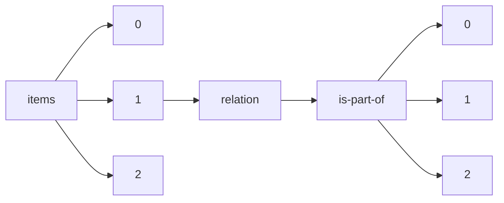

!!! warning "This document is not official Crossref documentation"
# Elements
PATH = items/array/relation/is-part-of/array(1)  
Occurs 34 126 times  
{ .annotate }

1. A route to an element, for example:  
   The route "items/array/relation/is-part-of/array" corresponds to navigating through the JSON indices as  
   ["items"][0]["relation"]["is-part-of"][0]  

## Asserted-by
See more information: [items/array/relation/is-part-of/array/asserted-by](asserted-by/index.md)  
Occurs 34 126 timess  
Unique values: 2  

| **Row** | **Value** `String` | **Count** `Int64` |
|--------:|----------------------:|---------------------:|
| **1**   | subject               | 34 015               |
| **2**   | object                | 111                  |

## Id
See more information: [items/array/relation/is-part-of/array/id](id/index.md)  
Occurs 34 126 timess  
Unique values: > 999  

!!! note "Due to current limitations, only the first 1,000 unique values are counted."

| **Row** | **Value** `String`                       | **Count** `Int64` |
|--------:|--------------------------------------------:|---------------------:|
| **1**   | 10.29172/physh                              | 3 514                |
| **2**   | 1-5                                         | 365                  |
| **3**   | 8-9                                         | 109                  |
| **4**   | 20000898                                    | 108                  |
| **5**   | https://ncsu-wolfpack-solutions.pubpub.org/ | 107                  |
| **6**   | 2353-2912                                   | 104                  |
| **7**   | 10.25080/issn.2575-9752                     | 90                   |
| **8**   | 10.24381/cds.bd0915c6                       | 85                   |
| **9**   | 10.24381/cds.adbb2d47                       | 81                   |
| **10**  | 1-269                                       | 70                   |
| ... | ... | ... |

## Id-type
See more information: [items/array/relation/is-part-of/array/id-type](id-type/index.md)  
Occurs 34 126 timess  
Unique values: 8  

| **Row** | **Value** `String` | **Count** `Int64` |
|--------:|----------------------:|---------------------:|
| **1**   | doi                   | 23 584               |
| **2**   | other                 | 9 674                |
| **3**   | issn                  | 311                  |
| **4**   | isbn                  | 256                  |
| **5**   | uri                   | 254                  |
| **6**   | purl                  | 30                   |
| **7**   | long-doi              | 9                    |
| **8**   | short-doi             | 8                    |

